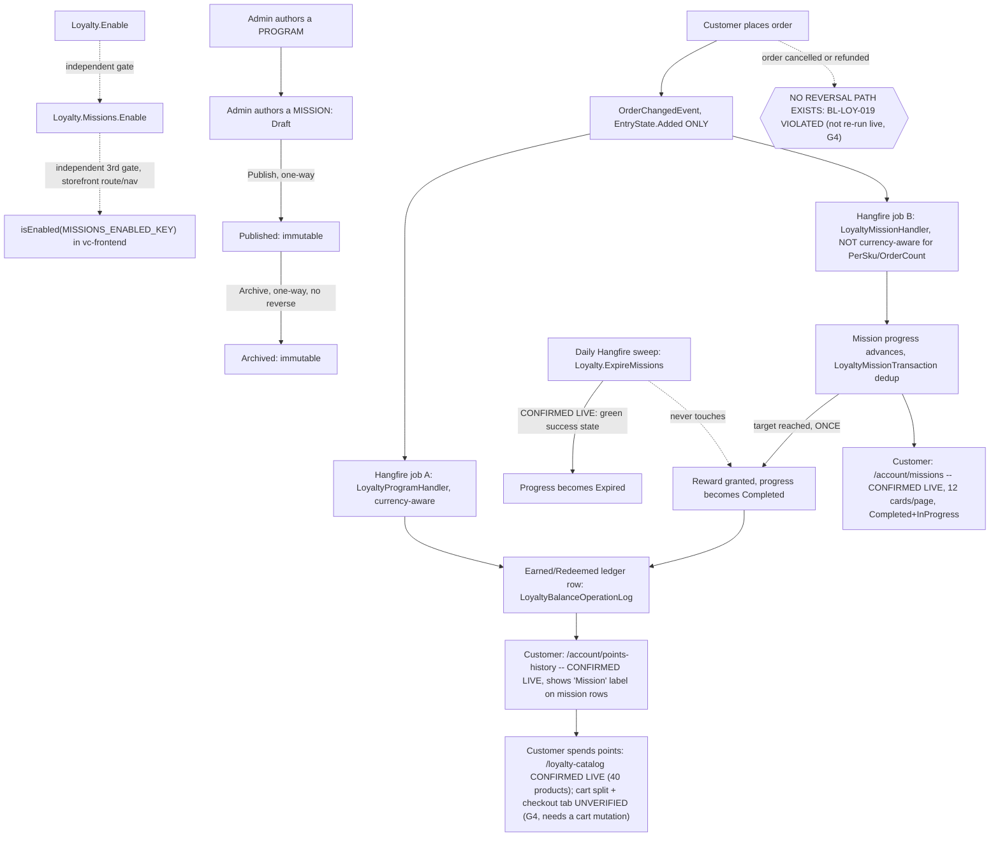

# Loyalty & Missions — domain map

> Refresh with `/qa-domain-map loy`. This file answers **what the feature is and where its
> surfaces are**. It does **not** carry behavioural rules — those are `BL-LOY-*` in
> `oracles/business-logic.md` (18 invariants, cited by id below, never restated) — and it can
> **never ground an assertion as `{DOC}`**. It is a pointer index plus a surface inventory: it
> tells you *where to look* and *what exists*, never *what correct looks like*.

**Verdict vocabulary** (rev 2 adds `CONFIRMED (live)`): `CONFIRMED (source)` = read in the
module checkout this pass or unchanged from rev 1's read at an identical revision ·
`CONFIRMED (docs)` = fetched first-hand from VirtoOZ, quoted verbatim, with its URL ·
`CONFIRMED (corpus read)` = read from `config/test-suites.json` / the suite CSVs ·
`CONFIRMED (prior-art)` = a dated prior deliverable's own live capture, not re-observed here ·
**`CONFIRMED (live)`** = observed this pass against the real environment (REST, GraphQL, or a
firefox render) · `DRIFT` = two of the above disagree · `MISSING` = documented/expected,
does not exist · `UNVERIFIED` = not established, and **not** to be treated as true.

**This map names no environment and no environment URL.** Rev 1 had no live axis at all, so
every row was source/docs/prior-art/corpus-derived. Rev 2 DOES have a live axis, so — matching
the sibling maps' convention — every live observation in this file is attributed to **Env-A**,
defined by variable, never by value: the deployment reachable at `BACK_URL`/`FRONT_URL` under
`TEST_ENV`. There is exactly one environment in scope this pass (no Env-B contrast, unlike the
Sales Rep map) — the label exists purely so a future multi-env pass has somewhere to put a
second column without renumbering anything.

**Read-only pass, both revisions.** No create/edit/publish/archive/seed/teardown/delete/lock
was performed against any environment or repository. A real customer GraphQL token was used to
query state (read-only) and a real storefront session (LOYALTY_VIP_USER) was used to render
pages by navigation only — no form submitted, no button clicked that creates or mutates data.
Every capability confirmable only by mutating stays `UNVERIFIED`, **with the mutation named**
(§2's "not manageable from here" rows and §5).

---

## §0 — Changed since rev 1 (2026-09-10 → 2026-09-11)

**Headline: the live axis is now closed for G1/G2/G3/G5/G6/G7/G8/G9. G4 and G10 remain OPEN —
both need a mutation this pass could not perform.**

**The task brief that commissioned this refresh assumed the deployed code contains
organization-level loyalty (commits `99dff59` "add organization level balance calculations"
and `bb42ec4` "contribution to mission progress on organization level"). That assumption is
CONTRADICTED by this pass — see D11.** Both commits sit on `vc-module-loyalty` branch
`feat/VCST-5024-org-level`, backing **OPEN, unmerged PR #17**, and are **not ancestors** of the
deployed HEAD (`git merge-base --is-ancestor` returns false against both `cfa5617` and
`da284217`). The deployed Loyalty module has **no** organization-level accrual code. This is
recorded prominently because a refresh that silently absorbed a wrong premise would be worse
than one that never had it.

| Rev 1 said | Rev 2 says |
|---|---|
| Every storefront-rendered claim is prior-art-sourced only, `UNVERIFIED` (G1) | **CLOSED.** Loyalty catalog (40 PTS-priced products, live), Points history (real balance + ledger rows, live), Missions & challenges (12 real mission cards across 5 pages, live) all rendered and were captured this pass |
| D7 ("Published + `Public=false` mission excluded from customer query" is refuted by source) was `CONFIRMED (source)` only | **Upgraded to `CONFIRMED (live)`.** The exact mission `AGENT-TEST-MSN-E2E-20260910114018-8e82-TGT-PRIVATE`, `Public: false` per the Admin REST API, rendered as a completed mission card on the live Missions page for `LOYALTY_VIP_USER` |
| G9 (deployed versions unknown, 403 blocked) | **CLOSED.** `Loyalty = 3.1007.0-pr-16-cfa5` (a PR-preview build). See **D10** for what that number actually means |
| G2 (is `Loyalty.Missions.Enable` reachable from a generic Store Settings UI?) | **CLOSED.** Not via the per-store `/api/settings/Store/{id}/values` path (still 404s), but it **is** listed, `isPublic: true`, in the generic module-settings read (`GET /api/platform/settings`) alongside `Loyalty.DefaultProductMultiplyFactor` — i.e. reachable through the platform's generic Modules→Settings surface, not through the Store blade |
| G3 (do D2's two guide pages describe one widget or two?) | **CLOSED from source, no live click-through needed.** Exactly one widget class (`loyaltySettingWidget`) is registered on `storeDetail` — there is only one surface to describe |
| G5 (has `Loyalty.ExpireMissions` ever fired?) | **CLOSED.** Confirmed present in the Hangfire Recurring Jobs dashboard with a green/success-state last-execution entry |
| G6 (live route for the points page) | **CLOSED, and rev 1's OWN prior-art citation was the wrong one.** Source (`client-app/modules/loyalty/index.ts`) registers `path: "points-history"` under the parent `"Account"` route — i.e. **`/account/points-history`**, matching the **official docs' naming**, not the 2026-06-24 prior-art guide's `/account/loyalty`. Confirmed live: the route renders |
| G7 (is `.Public` read anywhere besides the customer-facing query?) | **CLOSED.** `grep` finds exactly one read site, `LoyaltyMissionSearchService.cs:43-45`, reached by **both** `LoyaltyMissionLogicService.GetQualifyingMissionsAsync` (customer path, never sets it) **and** `LoyaltyMissionController.Search` (the generic Admin REST search action — which *could* filter by `Public` if a caller passed it, but no Admin UI field exists to do so, confirmed by the same `metaFormsService.registerMetaFields('loyaltyMissionDetail', …)` grep rev 1 ran) |
| G8 (is `VCST-5320`'s "CustomerIDs" targeting dimension real?) | **CLOSED — it is not a real, distinct mechanism.** Live-pulled the `TGT-GROUP` mission's actual condition tree: `UserGroupIsCondition`, `groups: ["VIP"]`. The `TGT-PRIVATE`/`TGT-GROUP`/`TGT-CONTROL` fixture naming (found live, 9 such missions on Env-A) tests the `Public` flag and group-condition targeting — the two mechanisms this map already knew about — not a third one. `VCST-5320` C6–C8 should be flagged stale |
| — | **New: the storefront theme is ALSO a PR-preview build**, `2.58.0-pr-2468-8e45-8e45ee74` (read from the rendered footer, live) — folded into **D10** alongside the backend finding |
| — | **New: the points-history ledger now labels mission-granted rows distinctly.** Live: 8 of 10 rows on page 1 for `LOYALTY_VIP_USER` show Operation = **"Mission"** (not the raw `Mission` object-type string, not blank) — the `getOperation()`/`MISSION_OBJECT_TYPE` handling from commit `1e104df` "label mission-granted rows in points history" (VCST-5916, the PR this whole build is named for). This does **not** overturn `BL-LOY-015` (a customer still cannot see **which** mission granted a row — no name, no id, just the generic label) but it is a real, live-confirmed improvement worth recording precisely rather than leaving the oracle's older, coarser framing unqualified — see §6 |

**No `D*` or `G*` row was renumbered or deleted.** New rows this pass: **D10**, **D11**. `G4`
and `G10` remain open, both re-stated precisely below.

---

## §1 — Purpose and value chain

**Loyalty purpose** (`PlatformUserGuide` §Overview —
[docs.virtocommerce.org/platform/user-guide/loyalty/overview](https://docs.virtocommerce.org/platform/user-guide/loyalty/overview),
verbatim, re-fetched first-hand this pass, unchanged from rev 1): *"The **Loyalty** module
provides a flexible loyalty program management system for the Virto Commerce Platform. It
enables store managers to define loyalty programs, reward customers with points, track
transactions, and allow customers to pay for their orders using loyalty points."* `CONFIRMED (docs)`.

**Missions purpose: still `UNDECLARED`.** Re-checked first-hand this pass against
`B2BExperts` (query: "loyalty program missions rewards B2B organization points") — zero hits
naming a Missions concept at all, only generic B2B-CX and loyalty-in-the-abstract content.
Re-confirms, rather than merely repeats, rev 1's finding across `PlatformUserGuide` /
`StorefrontUserGuide` / `PlatformDeveloperGuide`. See **D4** (persists) for the full picture.

**The chain below is rev 1's, carried forward with every link that a live check could settle
now marked `CONFIRMED (live)`. The mechanism did not change** (the deployed code is
byte-identical to rev 1's source anchor — see D10) — what changed is how much of it rev 2 could
actually watch happen.

| # | Link, in the customer's words | Mechanism |
|---|---|---|
| 1 | **A store turns Loyalty on** | `Loyalty.Enable` (Store setting, default `false`, group `Loyalty\|General`). `CONFIRMED (source)`. Live: `GET /api/platform/settings` lists it `isPublic: true`, `value: null` (i.e. reporting the module-level default — see D2/G3, resolved) |
| 1b | **A store turns Missions on — independently** | `Loyalty.Missions.Enable` (Store setting, default `false`, group `Loyalty\|Missions`), read at both the write path and the read path with no shared helper. `CONFIRMED (source)`. **The storefront ALSO gates independently on this setting**, newly confirmed this pass from `client-app/modules/loyalty/index.ts`: the Missions route and its nav entry are registered only `if (isEnabled(MISSIONS_ENABLED_KEY))`, nested inside the outer `if (isEnabled(ENABLED_KEY))` — three independent gate checks total (backend write, backend read, storefront route) for what is conceptually one on/off switch. `CONFIRMED (source)` |
| 2a | **A loyalty PROGRAM is authored** | Admin **Loyalty** menu → Order-loyalty or Product-loyalty. `CONFIRMED (source + docs)`, unchanged |
| 2b | **A MISSION is authored** | Admin **Loyalty missions** menu, one goal required (`OrderValueGoal`/`OrderCountGoal`/`PerSkuGoal`), conditions restricted to `AnyUserGroupCondition`/`UserGroupIsCondition`, reward `FixedAmountReward` only, one-way `Draft → Published → Archived` lifecycle. `CONFIRMED (source)`, unchanged. **Live evidence this pass**: 9 real `Published`-or-later missions exist on Env-A with the `TGT-PRIVATE`/`TGT-GROUP`/`TGT-CONTROL` naming (resolves G8) |
| 3 | **A customer places a qualifying order** | `OrderChangedEvent`, `EntryState.Added` only. `CONFIRMED (source)`, unchanged |
| 4 | **The async hop — two independent Hangfire jobs** | `CONFIRMED (source)`, unchanged. **The recurring EXPIRY job's own registration is now `CONFIRMED (live)`** — see link 9 |
| 5a | **Program path: earn/redeem, currency-aware** | `CONFIRMED (source)`, unchanged |
| 5b | **Mission path: contribution, not currency-aware for two of three goal types** | `CONFIRMED (source)` — `BL-LOY-017`, status VIOLATED, unchanged (this pass did not re-run the live repro; G4) |
| 6 | **Contribution and reward are persisted, deduped, granted at most once** | `CONFIRMED (source)`, unchanged (`BL-LOY-018` SATISFIED). **Live evidence**: the 9 `TGT-*`/`ORDERVALUE-*`/`PERSKU*`/`ORDERCOUNT` missions each show exactly one `Completed`/`InProgress` progress row per `(mission, user)` in the live GraphQL read — no duplicate progress rows observed |
| 7 | **The customer sees it** | **`CONFIRMED (live)` — both halves, closing rev 1's biggest gap.** Points history: `/account/points-history` renders a real ledger (balance `2,702,311,237` for `LOYALTY_VIP_USER`; paginated 10/page, 22 pages) with Operation/Type/Date/Amount columns exactly as source declares, and order-earn rows now show the order number while mission-earn rows show the literal label **"Mission"** (VCST-5916 fix, not present in rev 1's source-only read). Mission progress: `/account/missions` renders 12 cards/page across 5 pages, correctly distinguishing `Completed` (checkmark badge, "Mission completed", a "$X of $Y spent" or "N of M orders/SKUs" line) from `InProgress` (percentage only, a "days left" indicator) |
| 8 | **Points are spent** | `CONFIRMED (source)`, unchanged. **Live evidence, read-only**: the Loyalty catalog (`/loyalty-catalog`) renders 40 real PTS-priced products (PTS6 to PTS245) with quantity steppers and stock badges — confirming the catalog side of Mixed Cart mode is live and populated. The cart-side split UI and the checkout "Pay with points" tab were **not** exercised this pass (both need a non-empty cart — a mutation) — **still `UNVERIFIED`, folded into G4** |
| 9 | **A daily sweep expires stale progress** | `Loyalty.ExpireMissions`, `Cron.Daily()`. `CONFIRMED (source)`, unchanged. **`CONFIRMED (live)` this pass**: the Hangfire Recurring Jobs dashboard lists it with a green/success-state last-execution timestamp — the job is not just registered, it has actually run successfully (closes G5) |
| 10 | **Reversal — the effect is NOT reversed, anywhere** | `CONFIRMED (source)`, unchanged. `BL-LOY-019`, status VIOLATED. Not re-run live this pass (needs an order cancellation — a mutation; G4) |

### Actors

| Actor | Can do | Verdict |
|---|---|---|
| **Store manager / admin** | Authors programs and missions; toggles `Loyalty.Enable`/`Mode`/`Currency` via this module's own 3-field blade (confirmed the ONLY such blade — G3 closed). **Cannot** toggle `Loyalty.Missions.Enable`/`DefaultProductMultiplyFactor` from that blade, but **can** see both (module-wide, not per-store) via the generic Modules→Settings surface (`GET /api/platform/settings`, `isPublic:true` on both — G2 closed) | `CONFIRMED (source + live REST)` |
| **Customer** (loyalty + missions enabled) | Earns and spends points, browses the loyalty catalog, sees mission cards and progress. **`CONFIRMED (live)` end to end this pass** for `LOYALTY_VIP_USER`: real balance, real ledger, real mission cards, real catalog | `CONFIRMED (live)` |
| **Customer**, a `Public=false` mission | **Sees it anyway.** `CONFIRMED (live)`: `AGENT-TEST-…-TGT-PRIVATE` (`Public: false` per Admin REST) rendered as a completed card | `CONFIRMED (live)` — D7 upgraded |
| **Customer** (`Missions.Enable=false` store) | `GetUserMissionsAsync` returns `[]` immediately. `CONFIRMED (source)`; the rendered empty state itself is `UNVERIFIED` (needs a second store with the setting off, or a mutation to flip it — not attempted, no store-setting write permitted this pass) |
| **Guest / anonymous checkout** | Attributes no mission progress, per `VCST-5320` C24. `CONFIRMED (prior-art)`, not independently re-derived |
| **A "targeted" customer group** | Missions restrict by user group only. `CONFIRMED (live)` this pass: `TGT-GROUP`'s live condition tree is `UserGroupIsCondition, groups:["VIP"]` — no broader targeting mechanism exists. **`VCST-5320` C6–C8's "CustomerIDs" claim is REFUTED — flag those cases stale** (G8 closed) |

---

## §2 — Surface inventory

### 2a. Back office — Admin AngularJS SPA (this module's own `Scripts/`)

Unchanged from rev 1 in every particular — the deployed code is byte-identical to rev 1's
source anchor (D10) — with two closures:

**Two separate top-level main-menu items, one permission gate for both** (`loyalty:access`,
routes `/loyalty` and `/loyalty-missions`). `CONFIRMED (source)`.

**Loyalty program detail** / **Loyalty mission detail** — fields, toolbar, dynamic-tree
condition/goal/reward sets all as rev 1 described. `CONFIRMED (source)`.

**Widgets** — the same four (`customerLoyaltyWidget`, `loyaltySettingWidget`,
`loyaltyProductFactorsWidget`, `productDetailsLoyaltyFactorsWidget`). **`loyaltySettingWidget`
is confirmed the ONLY widget registered on `storeDetail`** (`grep -n "registerWidget"
module.js` → one `'storeDetail'` match) — this **closes G3**: rev 1's D2 (two guide pages
naming the enabling step differently) is not two UI surfaces described inconsistently, it is
**one** surface described generically ("Settings") in one guide and specifically ("Loyalty
settings") in the other. `CONFIRMED (source)`.

**REST controllers** — the same 7, unchanged. `CONFIRMED (source)`.

**NOT manageable from the back office** — unchanged from rev 1, **except**:

| Not manageable here | Where it actually lives — UPDATED |
|---|---|
| `Loyalty.Missions.Enable` / `Loyalty.DefaultProductMultiplyFactor` from the **Store** blade | Still true — `LoyaltyStoreSetting` carries exactly 3 fields. **But both settings ARE visible (module-wide, not per-store) via the platform's generic `Configuration → Modules → VirtoCommerce.Loyalty → Settings` surface**, confirmed live via `GET /api/platform/settings` (both `isPublic: true`, `value: null` = using the compiled default). **G2 CLOSED** — the setting is reachable, just not from the Store blade and not per-store |
| A mission's `Public` flag | Confirmed still absent from `metaFormsService.registerMetaFields('loyaltyMissionDetail', …)` this pass — no Admin UI control exists. **But the field IS a real, filterable search criterion on the generic Admin `POST /api/loyalty-missions/search` action** (`LoyaltyMissionSearchCriteria.Public`) — an Admin caller who knows to pass it could filter by it via raw API even though no grid column or filter chip exposes it. **G7 CLOSED** on this basis |

### 2b. Storefront (Vue) — `CONFIRMED (live)` this pass, closing G1

Every row below was rendered live this pass in firefox as `LOYALTY_VIP_USER` (Customer,
groups=[VIP], store `B2B-store`) unless marked otherwise.

| Surface | Route | Live observation |
|---|---|---|
| Loyalty catalog | `/loyalty-catalog` | **40 results**, all PTS-priced (`PTS6`–`PTS245`), grid/list toggle, `Show in stock` filter pre-applied, a left-rail category facet reading `Accessories(38)` / `Loyalty Fixtures(1)` / `Loyalty Fixtures(1)` [sic — two identically-named facet rows] / `Loyalty Missions E2E(1)` / `Loyalty products(33)`. Quantity steppers present per product. **Confirmed: the page has a real, non-trivial hydration delay** — an initial snapshot returned a blank page (no header, no footer) before a ~3s wait; a reader relying on a single fast snapshot could wrongly conclude the route is broken |
| Points history | `/account/points-history` | Heading + `Balance: 2702311237`; table `Operation \| Type \| Date \| Amount`; row 1 an order-earn (`CO260910-00017`, `Earned`, `97371100`); rows 2-10 all `Mission \| Earned \| <date> \| <amount>`; pagination 22 pages @ 10/page |
| Missions & challenges | `/account/missions` | Heading + description; **Virto Rewards balance** banner (same balance, formatted `2,702,311,237`) linking back to Points history; **Redeem your points** banner; 12 mission cards/page × 5 pages = up to 60 rendered, types **Order value** / **Order count** / **Featured SKUs** (the UI label for `PerSkuGoal`), each showing points value, a `Completed`(checkmark)/in-progress badge, a percentage, a progress line (`$X of $Y spent` / `N of M orders` / `N of M SKUs`), and an "Open mission" button per card |
| Account sidebar, "Marketing" section | any `/account/*` page | Confirmed live: **Missions & challenges**, **Coupons & promotions**, **Notifications**, **Points history** — all four render together as soon as the user is on any account page, both fresh-navigated and after a same-session sign-in. **Correction to where rev 1's prior art placed these links**: they are an **account-sidebar** group, not a top-header nav item — the top header/main-menu nav bar never carries them regardless of auth or reload state, which is a different UI location than `VCST-5346-2026-09-02.md`'s "one-shot bootstrap bug" (scenario 19) appears to describe. **Whether that bug is real is therefore now `UNVERIFIED (refined)`, not confirmed or refuted** — it needs to be re-tested against the *account sidebar specifically*, mid-session, which this pass did not do |
| Mixed cart split UI, checkout "Pay with points" tab | `/cart`, `/checkout` | **Still `UNVERIFIED`** — the cart was empty for this session and adding an item is a mutation this read-only pass would not perform. Folded into **G4** |

**NOT manageable from the storefront** — the customer-facing surface is **read-only over
every loyalty object except the cart**. No mission can be created, edited, published or
unpublished; the `Public` flag (D7) has no customer-side control; the balance cannot be
adjusted, reset or forfeited; and mission progress cannot be re-run or cleared. This is not an
inference from the UI — it follows from §2c: the contract exposes **3 queries and 0
loyalty-specific mutations**, so no storefront write path exists to find. The one thing the
customer *can* change is cart composition (spending points), and that is exactly the row still
`UNVERIFIED` above.

### 2c. API / contract — unchanged from rev 1, confirmed live this pass

**3 queries, 0 loyalty-specific mutations** — unchanged. `loyaltyMissionProgress` was called
live this pass with real arguments (`userId`, `storeId: "B2B-store"`, `cultureName: "en-US"`,
`statuses: null`) and returned 20+ real progress rows spanning `Completed` and `InProgress`,
confirming every field in rev 1's source-read `LoyaltyUserMissionType` list actually resolves
with real data: `missionId`, `name`, `status`, `startDate`/`endDate`, `periodStart`/`periodEnd`,
`completedDate`. `CONFIRMED (live)`.

**NOT manageable from the API layer** — unchanged (no mission-granting-row id on the ledger
type, `BL-LOY-015`; no mutation to spend/forfeit points directly; no `organizationId` argument
on any Loyalty query — and since the org-level branch is unmerged (D11), that absence is
current-and-correct, not a gap to close).

### 2d. Persistence / jobs — one closure (G5)

Unchanged from rev 1's source read, **plus**: the Hangfire Recurring Jobs dashboard
(`{BACK_URL}/hangfire/recurring`, reachable with a bearer admin token — itself worth a note,
see the security flag below) lists `Loyalty.ExpireMissions` with cron `0 0 * * *`, timezone
UTC, and a **green/success-state** last-execution entry timestamped 2026-09-11 — **the job has
actually fired successfully, not merely been registered**. `CONFIRMED (live)` — G5 closed.

**NOT manageable from the persistence/jobs layer** — `Loyalty.ExpireMissions` cannot be
triggered on demand, rescheduled or disabled from any of this module's own Admin blades (§2a);
the Hangfire dashboard is the only observed control surface, and it is platform-wide, not a
Loyalty one. There is also **no purge or retention path for accumulated mission-progress
rows** — confirmed live by the three undeleted `AGENT-TEST-MSN-E2E-*` fixture batches visible
this pass (§4), which no job reaps. Clearing them is a seeder teardown, i.e. a mutation, so it
is `UNVERIFIED` whether the existing `:teardown` scripts fully reverse a mission seed.

### 2e. The published-doc surface — re-queried this pass, unchanged in every particular

Every quote and every URL in rev 1's §2e was re-confirmed present and unchanged this pass
(`PlatformUserGuide` Overview / Enable-and-Create / Catalog-Browsing / Per-Product /
Points-History / the empty Create-Loyalty-Program page; `StorefrontUserGuide` three pages;
`PlatformDeveloperGuide` one page). **`PlatformBackendSourceCode` was re-queried and STILL
returns the stale pre-rename mirror** (`LoyaltyProgramOperationLogController`,
`ILoyaltyProgramOperationLogService`) — **D8 persists unchanged**, confirmed against the exact
renamed class names (`LoyaltyBalanceOperationLog*`) read directly from the local checkout this
pass. `B2BExperts` was newly queried this pass (rev 1 never queried it) — zero mission/org-level
content, reinforcing D4 rather than contradicting it.

---

## §3 — Where the layers DISAGREE

`D1`–`D9` carried forward from rev 1 **unchanged unless noted**; **D10** and **D11** are new
this pass. Never renumbered.

| # | Disagreement | Verdict |
|---|---|---|
| **D1** | The published xAPI reference undercounts the schema by one query (`loyaltyMissionProgress` missing). | `CONFIRMED (docs + source)`, unchanged — not re-queried this pass (no reason to expect the doc moved in 24h) |
| **D2** | Two `PlatformUserGuide` pages name the enabling step differently ("Settings" vs "Loyalty settings"). | **RESOLVED, not merely carried forward: it is one widget, not two surfaces** (see G3 closure, §2a). The two pages describe the same `loyaltySettingWidget` blade at two levels of specificity |
| **D3** | "Create Loyalty Program" is a genuinely empty page a sibling page links to. | `CONFIRMED (docs)`, re-fetched this pass, unchanged — still bare heading, no body |
| **D4** | Missions ship a mature Admin+storefront+GraphQL surface and have zero surface across every official guide. | `CONFIRMED (docs)` — **strengthened this pass**: `B2BExperts` newly queried, zero hits, extending the "zero across every guide queried" finding to a fourth source |
| **D5** | `MissionTypes` declares 5 constants; only 3 are ever a stored goal's class; `PerSkuAll`/`PerSkuAny` are read-time labels. | `CONFIRMED (source)`, unchanged. Not independently re-verified live this pass (would need a `PerSkuGoal.All=true` mission's live `missionType` field read — not attempted, low-value re-check) |
| **D6** | Reward vocabulary is asymmetric: a PROGRAM offers Fixed + Relative; a MISSION offers Fixed only, invisibly. | `CONFIRMED (source)`, unchanged |
| **D7** | A mission's `Public` flag is unreachable from Admin AND unread by the customer-facing query — net effect: every `Published` mission is shown to everyone. | **Upgraded `CONFIRMED (source)` → `CONFIRMED (live)`.** `AGENT-TEST-MSN-E2E-20260910114018-8e82-TGT-PRIVATE`, `Public: false` per a live `POST /api/loyalty-missions/search` read, rendered as a completed mission card on the live `/account/missions` page for `LOYALTY_VIP_USER`. This is the single most valuable live confirmation this pass produced — a source-derived hypothesis about customer-visible behavior, proven with a paired admin-API + storefront-render observation |
| **D8** | VirtoOZ's `PlatformBackendSourceCode` mirror is stale by one entity rename (`LoyaltyProgramOperationLog*` vs deployed `LoyaltyBalanceOperationLog*`). | `CONFIRMED (docs-tool output vs source)`, **re-confirmed this pass** — re-queried the tool (same stale names returned) and re-grepped the local checkout (renamed classes confirmed present, zero occurrences of the old names outside migrations) |
| **D9** | The customer-facing points page has two names/routes across sources (`/account/points-history` official vs `/account/loyalty` prior art). | **RESOLVED, not merely re-verified: the official name and route are correct.** `client-app/modules/loyalty/index.ts` registers `path: "points-history"` under the `"Account"` parent route — deterministically `/account/points-history` — and it renders live. The 2026-06-24 prior-art guide's `/account/loyalty` was simply wrong (or described an older build); flag that guide's route citation stale |
| **D10 — deployed versions are PR-preview builds across BOTH tiers, and the version label undercounts what actually shipped** | `GET /api/platform/modules` (live, admin token): `VirtoCommerce.Loyalty = 3.1007.0-pr-16-cfa5`. The storefront footer (live, rendered): `Ver. 2.58.0-pr-2468-8e45-8e45ee74`. Neither is a tagged release. **For the backend, this is provably benign**: `git diff --stat` between the deployed commit (`cfa5617`, tip of PR #16) and rev 1's source anchor (`da284217`, the `3.1008.0` version-bump commit on `dev`) touches **exactly 2 files — `Directory.Build.props` and `module.manifest` — both version strings only**. The code is byte-identical. **Consequence for this map: every `CONFIRMED (source)` row describes code that IS deployed**, not merely code that exists somewhere upstream — a meaningfully stronger claim than rev 1 could make. **A version-matching reader would still be misled**: `3.1007.0-pr-16` reads as *older* than the `3.1008.0` a version-matcher would expect from `dev`, when the code is in fact newer-or-equal | `CONFIRMED (live REST + local source diff)`, both this pass |
| **D11 — the task brief's premise about deployed org-level loyalty is FALSE; the feature exists only on an open, unmerged PR** | Commits `99dff59` ("add organization level balance calculations") and `bb42ec4` ("contribution to mission progress on organization level") are real, but they live on `vc-module-loyalty` branch `feat/VCST-5024-org-level`, backing **OPEN PR #17** ("VCST-5024: Organization level balance calculations"), tip-commit-dated 2026-09-10 — **after** the deployed build (`cfa5617`, 2026-09-08). `git merge-base --is-ancestor` returns false against both the deployed commit and rev 1's source anchor. **No organization-level accrual code, GraphQL argument, or Admin surface exists on Env-A.** This is the highest-value correction this pass makes: a domain map built on the brief's premise would have invented a whole surface family that does not exist on the environment it claims to describe | `CONFIRMED (live GET /api/platform/modules + gh CLI + local git ancestry check)`, all this pass |

**Where the layers were compared and agree** — unchanged from rev 1 (route paths survived the
rename; the five permissions, four `Loyalty.Mode` values, and `LoyaltyPaymentMethod` gateway
code all still match one-for-one between `ModuleConstants`, the Admin blade, and the published
guides).

---

## §4 — Coverage shape

**Basis re-confirmed, not re-derived from scratch**: `config/test-suites.json` and every
loyalty suite CSV were re-parsed 2026-09-11 with the same `csv-parse`-based method rev 1 used.
**Every count below is IDENTICAL to rev 1** — one day is not enough time for a corpus of this
size to have moved, and a fresh parse confirms rather than merely assumes that. `CONFIRMED
(corpus read)`.

### The nine loyalty suites — 235 cases, unchanged

| Suite | Cases | In `loyalty` group | Automation status |
|---|---|---|---|
| `075` Loyalty (Backend) | 29 | yes | Draft 29 |
| `075b` Loyalty Mixed Cart Order (Backend) | 13 | yes | Draft 10 · Manual 1 · Semi-Automated 1 · Automated 1 |
| `075c` Loyalty Product Points Earning (Backend) | 10 | yes | Draft 10 |
| `075d` Loyalty Missions (Backend) | 34 | **NO** | Automated 19 · Draft 9 · Manual 4 · Deprecated 2 |
| `075e` Loyalty Missions Admin (Backend) | 23 | **NO** | Automated 14 · Draft 9 |
| `083` Loyalty Catalog Browsing (Frontend) | 26 | yes | Automated 16 · Draft 10 |
| `083b` Loyalty Mixed Cart Order (Frontend) | 8 | yes | Automated 6 · Draft 2 |
| `083c` Loyalty Missions Storefront (Frontend) | 84 | yes | Automated 44 · Draft 36 · Manual 1 · Reviewed 3 |
| `083d` Loyalty Missions E2E (Frontend) | 8 | yes | Automated 2 · Draft 5 · Deprecated 1 |
| **Total** | **235** | **178** in group | Draft **120** · Automated 102 · Manual 6 · Reviewed 3 · Deprecated 3 · Semi-Automated 1 |

**Re-confirmed unchanged this pass, and restated in full** — a map is read as the current rev,
so these tables live here rather than only in a superseded revision. Re-parsed 2026-09-11;
every count below is identical to rev 1. `CONFIRMED (corpus read)`.

### Feature-relevant cases the obvious selection group MISSES

`npm run regression:plan -- loyalty` resolves `selections.loyalty` to
`["075","075b","075c","083","083b","083c","083d"]` — **7 suites, 178 cases**, run 2026-09-10.
`CONFIRMED (corpus read)`.

| Missed | Cases | Why it belongs |
|---|---|---|
| `075d` Loyalty Missions | 34 | The entire **backend** mission surface. Tagged `loyalty,missions,graphql,api,sprint` and in **no** selection group at all |
| `075e` Loyalty Missions Admin | 23 | The entire **Admin** mission surface (§2a). Tagged `loyalty,missions,admin,admin-spa,sprint`, in **no** group |
| `050b4` GraphQL xCart cross-domain | 10 of 31 | Cites `BL-LOY-001/002/003/004` — the **only** corpus home of `BL-LOY-004` |
| `050b1` GraphQL xCart basic | 3 of 21 | Cites `BL-LOY-002/003` |
| `028` Cart core (Frontend) | 7 of 52 | Mixed-cart rows, no `BL-LOY` citation |
| `010` B2B bulk-ship dashboard | 5 of 53 | Loyalty rows, no `BL-LOY` citation |
| `050a` GraphQL xCatalog | 2 of 57 | Loyalty-catalog rows |
| `078c` Backend smoke commerce | 1 of 29 | One loyalty smoke row |

**The shape of the hole:** the group carries missions on the **frontend** (`083c` 84 + `083d` 8)
and **none** of missions on the **backend or Admin** (`075d` 34 + `075e` 23). The feature-relevant
corpus is **263** cases (235 + 28 across six non-loyalty suites); the group resolves to **178**,
so **85 cases — 32% of loyalty coverage — never run under `loyalty`**. `075d` and `075e` belong to
no group whatsoever, so they reach a run only via `sprint` (tag-driven and plan-dependent),
`backend`, `full`, or an explicit id list. **This is a manifest defect; the fix is
`config/test-suites.json` via `suites:sync`, never a hand edit** — routed, not filed from here.

### Zero / near-zero coverage

| Area | Count | Deliberate or hole |
|---|---|---|
| **`BL-LOY-006`** — currency switch converts primary lines, preserves loyalty lines `[P1-data]` | **0** citing cases corpus-wide | **HOLE.** The currency switcher is the very mechanism `083` exercises (its `currency-override` tag), and the invariant governing it is uncited |
| **`BL-LOY-014`** — Admin SPA Line items blade shows per-currency totals `[P2-ux]` | **0** citing cases corpus-wide | **HOLE**, low severity — the only `BL-LOY` naming an Admin *order* surface, and `075e` covers mission Admin, not order Admin |
| `BL-LOY-011` | n/a | **Deliberate** — reserved/PROPOSED and never promoted (`business-logic.md:1271`), so there is nothing to cite |
| `075` Loyalty (29 cases) — the domain's headline backend suite | **0** `BL-LOY` citations in any row | **HOLE.** 29 Draft cases, none grounded in an invariant, against a domain holding 18 |
| Missions ↔ published docs | 0 doc-grounded cases | **Deliberate consequence** of D4 — no guide exists to ground a `{DOC}` assertion against, so the absence is forced, not chosen |

**Basis:** 18 `BL-LOY` invariants are defined (`001`–`010`, `012`–`019`; `011` is reserved).
Sixteen are cited by at least one case. `CONFIRMED (corpus read — every suite CSV grepped plus
the oracle's own `### BL-LOY-` headers enumerated)`.

### Over-covered relative to risk

`083c` Loyalty Missions Storefront holds **84 cases — 36% of all loyalty coverage and the largest
suite in the domain** — and it is the *storefront read surface* (account page, modal, a11y): it
cites 22 non-`BL-LOY` invariants (4 × `BL-A11Y`, 4 × `BL-UI`, plus `BL-GQL`, `BL-PRICE`,
`BL-CART`, `BL-CAT`, `BL-CROSS`, `BL-AUTH`) against just 4 `BL-LOY` ids. Set that against
**`075d`'s 34 cases**, which is where points are actually granted and where `BL-LOY-016/017/019`
measured the accrual defects. **The layer that decides whether points leak carries 34 cases; the
layer that displays them carries 84.** That is the culling argument; making the decision belongs
to `/qa-review-tests`, not here.

### Selection-group and executability problems

| Property | Reading |
|---|---|
| `requiresModules` | `["loyalty"]` on all five `075*` and on `083c` / `083d` — **absent on `083` and `083b`**. `083` is the loyalty-*catalog* suite whose route the docs' own troubleshooting table says 404s when the module or mode is wrong, so the gate that would skip it cleanly is exactly the one it does not declare. **HOLE** |
| `envRiskGate` | `staging` on all five `075*`; **absent on all four `083*`** — the backend half of one feature is env-gated and the frontend half is not |
| Browser lanes | `075*` → `qa-backend-expert`; `083*` → `qa-frontend-expert`. `defaults.firefoxClickOk: true`, so **no lane denial applies** to any loyalty suite (`browserDenyListFor` in `ci/lib/suite-manifest.ts` is inert while that flag holds) |
| Never-run share | **120 of 235 (51%) are `Draft`** — including all 29 of `075` and all 10 of `075c`. Half this domain's corpus has no run behind it. `075c`'s serial-isolation row also carries its scheduling constraint **inside the status field** (`Draft (SERIAL — isolate; restore ALL after)`) rather than in metadata, so no tool can act on it |
| Deprecated | 3 (`075d` 2, `083d` 1), still counted in the manifest's `testCount` — so the manifest total overstates runnable cases by 3 |

**One live-informed addition**: the 9 `TGT-*`/mission-progress fixtures observed live this pass
(§1, §2b) all carry the `AGENT-TEST-MSN-E2E-*` naming convention and are almost certainly the
disposable output of the `083d` (Loyalty Missions E2E) suite's own seeder, re-run multiple times
without teardown (three near-identical timestamped batches were visible in the live GraphQL
read: `…-105616-…`, `…-113721-…`, `…-114018-…`). This matches the disposable-fixtures caution in
`.claude/rules/test-data.md` (isolation is per-suite, not per-seed) and is worth a note for
whoever next authors a case against this suite: the live mission list on Env-A is not a clean
slate, it is an accumulation of prior runs' output.

---

## §5 — Open gaps

**Eight of rev 1's ten gaps are CLOSED this pass** (G1, G2, G3, G5, G6, G7, G8, G9 — see §0's
table for exactly how). Two remain open, both for the same underlying reason: **this pass was
read-only, and both gaps need a mutation.**

| # | Gap | State |
|---|---|---|
| G1 | Storefront-rendered claims | **CLOSED** — see §0, §1 link 7, §2b |
| G2 | `Loyalty.Missions.Enable`/`DefaultProductMultiplyFactor` reachability | **CLOSED** — see §0, §2a |
| G3 | D2's two guide pages, one surface or two | **CLOSED** — see §0, §2a |
| **G4** | Every `BL-LOY-0xx` live measurement cited in this map is inherited from the oracle's own dated captures (2026-06-09 → 2026-09-01); **still none was re-run this pass**. Additionally folds in the still-unexercised mixed-cart split UI and checkout "Pay with points" tab (§2b), and the still-unresolved `VCST-5346` one-shot-bootstrap-bug question, now refined to specifically mean the account SIDEBAR (§2b), not the header nav | **OPEN** — needs, at minimum: (a) `seed:missions-e2e` + an order placement + an order cancellation to re-confirm `BL-LOY-017`/`BL-LOY-019` live; (b) adding a loyalty-catalog product to a real cart to observe the mixed-cart split UI and the checkout points tab; (c) a sign-in performed WHILE already on an `/account/*` page (not a fresh navigation) to settle whether the sidebar's Marketing section is reactive to auth state. All three are mutations or session-timing tests this read-only pass would not perform |
| G5 | Has `Loyalty.ExpireMissions` ever fired? | **CLOSED** — see §0, §1 link 9, §2d |
| G6 | Live route for the points page | **CLOSED** — see §0, §3 D9 |
| G7 | Is `.Public` read anywhere besides the customer query? | **CLOSED** — see §0, §2a |
| G8 | Is `VCST-5320`'s "CustomerIDs" targeting real? | **CLOSED — it is not.** See §0, Actors table |
| G9 | Deployed module versions unknown | **CLOSED** — see §0, D10 |
| **G10** | `test-data/aliases.json`'s `LOYALTY_VIP_USER` carries a bare inline password literal, uncovered by `td:reconcile`'s fixed 5-CSV hygiene scan (`aliases.json` is not among the scanned files) | **STILL OPEN — unchanged, and deliberately not touched this pass.** This map's own live walk used exactly this credential (resolved via `process.env.LOYALTY_VIP_USER_PASSWORD`, never the literal) to avoid reproducing it anywhere, including here. Routed, not filed: needs the literal replaced with a `{{VAR}}` token and `aliases.json` added to the hygiene scan's file list (`scripts/seed-data/reconcile-test-data.mjs:352-375`) |

**New observation, not yet a numbered gap because it is a security-adjacent aside rather than
a domain-surface question**: the Hangfire dashboard (`{BACK_URL}/hangfire`) accepted a plain
platform bearer token with no Hangfire-specific claim or role check observed — worth a
follow-up by whoever owns platform security posture, but out of scope for this domain map to
adjudicate (it is a platform-wide surface, not a Loyalty one).

---

## §6 — Prior-art verdicts

Rev 1's full table is preserved unedited (git history / the version before this rewrite). This
section adds only what rev 2 newly settles.

| Claim | Verdict |
|---|---|
| `ba-vcst-5104-customer-mixed-cart-loyalty-order-2026-06-24.md`'s stated points-page route, `{{FRONT_URL}}/account/loyalty` | **DRIFT, now resolved rather than merely flagged.** Source (`client-app/modules/loyalty/index.ts`) and a live render both confirm `/account/points-history` is correct; the 2026-06-24 guide's route was wrong (or the app changed under it — either way, do not cite that guide's route again) |
| `missions-design-gaps-2026-08-28.md` / `BL-LOY-015`: "a customer cannot see which mission granted a points-history row" | **Still true, but now precisely bounded.** Live: the row DOES say **"Mission"** (as of VCST-5916, this build's own namesake commit) instead of a blank or a raw type string — a real, shipped improvement — but it still does not say **which** mission. The oracle's framing should not be read as "nothing changed here"; it should be read as "the coarse label improved, the fine-grained id still does not exist" |
| `VCST-5320-2026-08-27.md` C6/C7/C8: a distinct "CustomerIDs" mission-targeting dimension | **REFUTED live, not merely "not located."** The `TGT-GROUP` mission's actual condition, read live from the Admin REST API, is `UserGroupIsCondition, groups:["VIP"]` — the ordinary, already-documented mechanism. Recommend flagging C6–C8 stale in a future `/qa-review-tests` pass |
| `VCST-5320-2026-08-27.md` C17 (D7): Published + `Public=false` mission is shown to the customer anyway | **CONFIRMED (live)** this pass, with a named example (`TGT-PRIVATE`) and a paired admin-API + storefront-render observation — the strongest possible form of confirmation for this claim |
| This task's own brief: deployed code contains organization-level loyalty | **REFUTED. See D11.** The feature exists only on an open, unmerged PR (#17); nothing about it is reachable on Env-A |

**This map resolves, newly this pass:** G8 fully (the CustomerIDs question), and gives D7 its
strongest possible evidentiary form (live, paired). **It still does not resolve, and carries
forward as G4:** the live re-confirmation of `BL-LOY-017`/`BL-LOY-019`, and the mixed-cart/
checkout points-tab render.

---

## §7 — Amendments

Written by `/qa-test` `5h-map`, one row per write-back, **append-only**. An amendment sets
`amended:` and never `generated:` or `rev:`.

*(Empty — no `/qa-test` run has amended this map yet. This section is preserved from rev 1
unedited; a rev 2 refresh is not itself an amendment and does not populate this table.)*

| Date | By | What moved |
|---|---|---|
| — | — | — |
