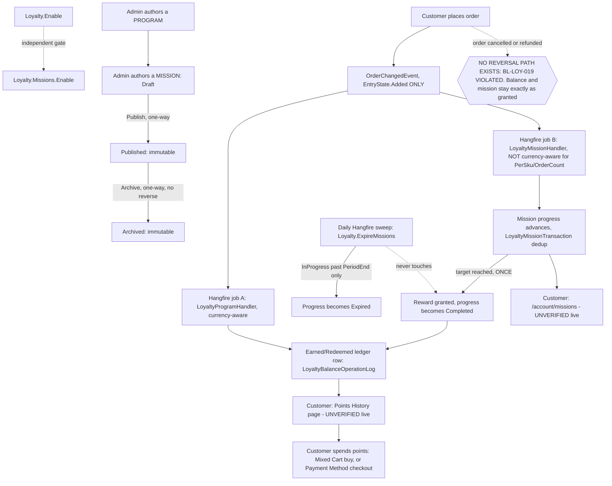
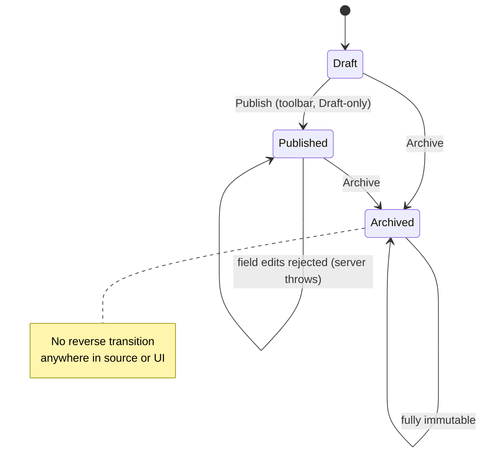

# Loyalty & Missions — domain map

> Refresh with `/qa-domain-map loy`. This file answers **what the feature is and where its
> surfaces are**. It does **not** carry behavioural rules — those are `BL-LOY-*` in
> `oracles/business-logic.md` (18 invariants, cited by id below, never restated) — and it can
> **never ground an assertion as `{DOC}`**. It is a pointer index plus a surface inventory: it
> tells you *where to look* and *what exists*, never *what correct looks like*.

**Every claim carries a verdict.** `CONFIRMED (source)` = read at HEAD `da284217` this pass ·
`CONFIRMED (docs)` = fetched first-hand from VirtoOZ this pass, quoted verbatim ·
`CONFIRMED (corpus read)` = read from `config/test-suites.json` / the suite CSVs this pass ·
`CONFIRMED (prior-art)` = a dated prior deliverable's own live capture, not re-observed here ·
`DRIFT` = two of the above disagree · `MISSING` = documented/expected, does not exist ·
`UNVERIFIED` = not established this pass, and **not** to be treated as true.

> **THE LIVE AXIS WAS BLOCKED END TO END — no claim in this file is `{OBSERVED}` live.**
> Two independent blockers, both established before the enumeration began:
> 1. `.env.local` is absent in the build container, so `ADMIN_PASSWORD` / `USER_PASSWORD` are
>    unset. Established the way `.claude/rules/test-data.md` requires — `import('./config.js')`
>    then read `process.env` — never from a single `.env` layer and never from the curated `env`
>    export, either of which would have been an unsound basis for the conclusion.
> 2. The session's egress policy **403s** `https://vcst-qa.govirto.com` at the proxy
>    (`curl: (56) CONNECT tunnel failed, response 403`). Organization policy, not retried.
>
> **Consequence for a reader: treat every `CONFIRMED (source)` row as "the code says so at this
> revision", not "the build does so".** The four axes actually available were module source,
> published docs, prior art and the local test corpus. This is the shape file's documented
> fallback ("enumerate from source + the prior art, and mark everything not seen live
> `UNVERIFIED`"), not a silent degradation — and it is why §5 opens with six live-axis gaps
> rather than one blanket note. A `/qa-domain-map loy --refresh` on a credentialled,
> network-reachable session is the intended follow-up; §5 names what each gap needs.

**Read-only pass.** No create/edit/publish/archive/seed/teardown/delete was performed against
any environment or repository. Every capability confirmable only by mutating is `UNVERIFIED`
**with the mutation named**, in §2's "not manageable from here" rows and in §5.

---

## §1 — Purpose and value chain

**Loyalty purpose** (`PlatformUserGuide` §Overview —
[docs.virtocommerce.org/platform/user-guide/loyalty/overview](https://docs.virtocommerce.org/platform/user-guide/loyalty/overview),
verbatim, fetched first-hand this pass): *"The **Loyalty** module provides a flexible loyalty
program management system for the Virto Commerce Platform. It enables store managers to define
loyalty programs, reward customers with points, track transactions, and allow customers to pay
for their orders using loyalty points."* `CONFIRMED (docs)`.

**Missions purpose: `UNDECLARED`.** Confirmed absent, independently and first-hand this pass,
across all three guides queried with mission-specific terms — "loyalty missions goals rewards
mission management campaign" against `PlatformUserGuide`; "missions challenges rewards progress
account page" against `StorefrontUserGuide`; a Loyalty-xAPI query against
`PlatformDeveloperGuide` that returned only `loyaltyBalance` / `loyaltyPointsHistory` and never
`loyaltyMissionProgress`. Zero hits in every case. This *matches*, rather than merely repeats,
two independent prior findings: `missions-design-gaps-2026-08-28.md` ("zero mission-specific
`BL-*` invariants… nothing declares whether a goal should measure merchandise value or order
total") and the `VCST-5320` test model 2026-08-27 ("No documentation exists — VirtoOZ has no
Missions content"). `BL-LOY-016` recorded the same absence on 2026-08-28; this pass re-checks and
re-dates it to 2026-09-10 rather than inheriting it.

**The chain below is therefore the first written statement of the Missions chain in this repo.**
Cite it as a hypothesis to contradict, not as authority. It is reconstructed from
`LoyaltyMissionLogicService.cs`, `LoyaltyProgramHandler.cs`, `LoyaltyCartValidator.cs`,
`ModuleConstants.cs` and `Module.cs`.

**The domain's central structural fact is that it ships TWO independent accrual paths that never
talk to each other**, both wired off the same `OrderChangedEvent`. The chain carries both, and
the prior art already names this divergence as "the root risk, not any single symptom"
(`missions-design-gaps-2026-08-28.md` Theme D).

| # | Link, in the customer's words | Mechanism |
|---|---|---|
| 1 | **A store turns Loyalty on** | `Loyalty.Enable` (Store setting, default `false`, group `Loyalty\|General`). Gates the storefront loyalty-catalog / mixed-cart / payment-method mechanics generally. `CONFIRMED (source)` |
| 1b | **A store turns Missions on — independently** | `Loyalty.Missions.Enable` (Store setting, default `false`, group `Loyalty\|Missions`). Read at **both** the write path (`LoyaltyMissionHandler`→`ProcessOrderAsync`) and the read path (`GetUserMissionsAsync`), with no shared `IsLoyaltyEnabled()` helper — so a store can run `Loyalty.Enable=false` + `Missions.Enable=true` and missions still accrue and still pay out points. `CONFIRMED (source)`, re-derived independently at HEAD, matching `VCST-5320`'s live-verified finding of 2026-08-27 |
| 2a | **A loyalty PROGRAM is authored** | Admin **Loyalty** menu (priority 100, `/loyalty`, permission `loyalty:access`) → Order-loyalty (conditions: order status / order total / first order / recurring order / registration / user group; rewards **Fixed points** or **% of order value**) or Product-loyalty (per-product multiply factor, no reward tree at all). `CONFIRMED (source + docs)` |
| 2b | **A MISSION is authored — a separate, narrower authoring surface** | Admin **Loyalty missions** menu (priority 101, `/loyalty-missions`, **same** permission `loyalty:access` — no mission-specific permission exists anywhere). Exactly one goal required, validated client-side **and** server-side: `OrderValueGoal` / `OrderCountGoal` / `PerSkuGoal`. Conditions: **only** `AnyUserGroupCondition` / `UserGroupIsCondition` — narrower than a program's set. Reward: **Fixed points only** (D6). Lifecycle `Draft` → `Published` (toolbar, Draft-only) → `Archived` (from Draft or Published) — **one-way, no reverse transition anywhere**; once non-`Draft` the record is server-enforced immutable (`InvalidOperationException` on an edit attempt). `CONFIRMED (source)` |
| 3 | **A customer places a qualifying order** | `OrderChangedEvent`, filtered to **`EntryState.Added` only** — a brand-new order row. `CONFIRMED (source)` |
| 4 | **The async hop — TWO independent Hangfire jobs, no shared transaction** | Both `LoyaltyProgramHandler.Handle` and `LoyaltyMissionHandler.Handle` enqueue their own `BackgroundJob` off the same event. Between placement and the job running the customer sees no points/progress change, and **no polling contract exists** to close that window client-side. The two are serialised only where both happen to write the SAME balance row, via a per-user distributed lock (`"loyalty-balance:{userId}"`). `CONFIRMED (source)` |
| 5a | **Program path: earn/redeem, currency-aware** | `LoyaltyProgramHandler.ProcessOrderAsync` branches on `Loyalty.Mode`: **Mixed Cart** → `EarnProductPointsAsync` (cash-currency lines only, explicit `!Currency.EqualsIgnoreCase(loyaltyCurrency)` filter) + `RedeemLoyaltyProductsAsync` (loyalty-currency total); any other mode → `EarnLoyaltyProgramAsync` (evaluates active programs' condition trees). Orders paid via the `LoyaltyPaymentMethod` gateway are explicitly skipped here — handled inside the gateway's own `PostProcessPaymentAsync`. `CONFIRMED (source)` |
| 5b | **Mission path: contribution, NOT currency-aware for two of three goal types** | `LoyaltyMissionHandler` → `LoyaltyMissionLogicService.ApplyMissionInternalAsync`: `OrderValueGoal` reads `order.Total` (shipping and tax included, net of discount — the **declared, ratified** basis per `BL-LOY-016`, amended 2026-09-01) and self-disables its currency gate whenever `CurrencyCode` is empty; `OrderCountGoal` has no currency field at all; `PerSkuGoal` increments on every matching line item with **zero currency predicate**. `CONFIRMED (source)` — this is `BL-LOY-017`, status **VIOLATED**, independently re-derived at HEAD this pass, identical to the oracle's 2026-09-01 capture |
| 6 | **Contribution and reward are persisted, deduped, granted at most once** | `LoyaltyMissionTransaction` keyed `(MissionId, ObjectId, UserId)` plus a per-`(mission,user)` distributed lock. On target reached: `GrantRewardAsync` → `LogLoyaltyProgramOperationAsync` (`Earned`, `SourceType=LoyaltyMission`) → progress flips `Completed`. `BL-LOY-018` (grant-once, order-contributes-once) is **SATISFIED** per the oracle's 2026-09-01 measurement, and the dedup mechanism read at HEAD this pass matches it. `CONFIRMED (source)` |
| 7 | **The customer sees it** | Balance / points history (storefront "Points History" page per official docs — see D9 for the naming conflict) and mission progress (storefront `/account/missions` per the newest prior art). **Both `UNVERIFIED` this pass** — no `vc-frontend` clone, no reachable env |
| 8 | **Points are spent** | Mixed Cart mode: buy a loyalty-catalog product — `LoyaltyCartValidator` gates points-products to Mixed-Cart mode, forbids a points-only cart, and requires the balance to cover the points total. Payment Method mode: pay the whole order with points via the `LoyaltyPaymentMethod` gateway, which is a **third, independent** earn/redeem path bypassing both handlers entirely (`BL-LOY-012`; not enumerated field-by-field this pass — see `excludes:`). `CONFIRMED (source)` |
| 9 | **A daily sweep expires stale progress — not rewards** | `Loyalty.ExpireMissions`, a Hangfire **recurring** job (`Cron.Daily()`, registered in `Module.cs`), moves `InProgress` progress past `PeriodEnd` to `Expired`. It never touches `Completed` progress and never revokes a granted reward — by design, since expiry applies only to missions that never finished. `CONFIRMED (source)` |
| 10 | **Reversal — the effect is NOT reversed, anywhere. The chain is asymmetric** | Both handlers filter `EntryState.Added` only, so no `Modified` / `Deleted` order event is ever observed by either path. `ModuleConstants.LoyaltyPrograms` declares exactly `Earned` / `Redeemed`, so no reversing operation type can even be constructed. `ApplyMissionInternalAsync` has no negative-contribution branch. **The decrement primitive already exists** — `LogLoyaltyProgramOperationInternalAsync`'s `Balance = Earned ? balance+amount : balance-amount` — and only `Redeemed` calls it today; the missing pieces for a cancellation reversal are a constant, a caller and a trigger, not a mechanism. This is `BL-LOY-019`, status **VIOLATED**, ratified 2026-09-01 and **independently re-derived at HEAD this pass** by reading every handler and every operation-type constant. `CONFIRMED (source)` |

### Actors

| Actor | Can do | Verdict |
|---|---|---|
| **Store manager / admin** | Authors programs and missions; toggles `Loyalty.Enable` / `Loyalty.Mode` / `Loyalty.Currency` via this module's own 3-field blade; views a customer's balance and operation log (Contact widget). **Cannot**, from any Admin surface this module ships, toggle `Loyalty.Missions.Enable` or `Loyalty.DefaultProductMultiplyFactor`, or set a mission's `Public` flag (D7) | `CONFIRMED (source)` |
| **Customer** (loyalty-enabled, missions-enabled store) | Earns and spends points, browses the loyalty catalog, sees mission cards and progress. Whether a `Public=false` mission is hidden from them: **it is not** — `GetQualifyingMissionsAsync` never filters on `Public` (D7), read from source, matching the oracle's 2026-08-28 live capture | `CONFIRMED (source)`; the render itself `UNVERIFIED` |
| **Customer** (`Missions.Enable=false` store) — **the negative case** | `GetUserMissionsAsync` returns `[]` immediately on the `Missions.Enable` gate, before any mission is searched. This is the contrast that reveals the gating logic, and the gate is read-side as well as write-side | `CONFIRMED (source)`; the rendered result `UNVERIFIED` — needs a store with the setting off and a logged-in session |
| **Guest / anonymous checkout** | Attributes no mission progress, per `VCST-5320`'s C24 ("SATISFIED (source)"). Not independently re-derived this pass — the guest-order code path was not traced, deliberately, under breadth-first | `CONFIRMED (prior-art)` / `UNVERIFIED (this pass)` |
| **A "targeted" customer group** | Missions restrict by user group only (`AnyUserGroupCondition` / `UserGroupIsCondition`) — no order-status, order-total, first-order or registration targeting of the kind a PROGRAM has. Whether a "CustomerIDs" targeting dimension exists (named in `VCST-5320`'s C6/C7/C8) was **not located** in `Core/Models/Conditions/` this pass — see G8 | `CONFIRMED (source)` for the group-only surface; `UNVERIFIED` for CustomerIDs |

---

## §2 — Surface inventory

### 2a. Back office — Admin AngularJS SPA (this module's own `Scripts/`)

**Two separate top-level main-menu items, one permission gate for both:**

| Item | Route | Priority | Permission |
|---|---|---|---|
| **Loyalty** | `/loyalty` → `loyaltyProgramList` blade | 100 | `loyalty:access` |
| **Loyalty missions** (title key `Loyalty.blades.loyalty-mission-list.title`) | `/loyalty-missions` → `loyaltyMissionList` blade | 101 | `loyalty:access` — **identical; no mission-specific permission exists** |

`CONFIRMED (source, Scripts/module.js)`. The full permission set is exactly five —
`loyalty:read`, `loyalty:access`, `loyalty:create`, `loyalty:update`, `loyalty:delete` — so
**missions are governed by the same five permissions as programs**: anyone who can author a
program can author, publish and archive a mission, and there is no way to grant one without the
other. `CONFIRMED (source, ModuleConstants.cs)`.

**Loyalty program detail** — fields `isActive` (toggle), `priority` (int), `name` (required),
localized names, `storeId` (single-select), `startDate` / `endDate`. Dynamic tree: conditions
`UserGroupsContains` / `UserGroupIs` / `OrderStatus` / `OrderTotal` / `IsFirstOrder` /
`IsRecurringOrder` / `IsRegistration`; rewards `FixedAmountReward` **and**
`RelativeAmountReward` (both offered). A **second program type**, `ProductPoints`, uses a
narrower prototype — only `UserGroupIs` / `AnyUserGroup` conditions and **no reward block at
all**, its "reward" being the per-product multiply factor, a separate mechanism.
`CONFIRMED (source)`.

**Loyalty mission detail** — toolbar **Save · Reset · Publish · Archive**. Fields: `status` (a
plain readonly `<input type="text">` — **no dropdown and no selector; the only way to change it
is the Publish/Archive toolbar buttons**), `name` (required), localized name and description,
`storeId`, `startDate` / `endDate`. Server-side date-order and reward-sign are **not**
validated: `LoyaltyMissionValidator` checks only name non-empty, store non-empty, exactly one
condition-block child, exactly one goal, at least one reward, and — for `OrderValueGoal` only —
a non-empty currency code. **A negative reward amount and an `EndDate < StartDate` mission both
save without error.** `CONFIRMED (source, LoyaltyMissionValidator.cs)`, matching
`missions-admin-guide-2026-09-02.md`'s documented "Known limitations" and re-derived
independently. Dynamic tree: conditions **`AnyUserGroup` / `UserGroupIs` only**; goals
**exactly one of** `OrderValueGoal` / `OrderCountGoal` / `PerSkuGoal` (client
`getValidationError` and the server both enforce "exactly one"); reward **`FixedAmountReward`
only** (D6). A per-SKU goal's target items are a **two-step** job — save the mission first, then
a sub-blade (`loyaltyMissionGoalItemList`) opens to pick products. A mission banner image has its
own widget (`loyaltyMissionBannerWidget`, group `loyaltyMissionDetail`). `CONFIRMED (source)`.

**Where a UI label differs from the model name:** the Admin menu reads **"Loyalty missions"**
while the entity is `LoyaltyMission` and the route is `/loyalty-missions`; the mission detail
blade labels the reward **"Fixed points"** while the class is `FixedAmountReward`; the program
walkthrough's **"% of order value as points"** is `RelativeAmountReward`; the Store widget's
**"Loyalty enabled"** / **"Enable loyalty"** (the two guides disagree — D2) is
`Loyalty.Enable`. `CONFIRMED (source + docs)`.

**Widgets:**

| Widget | Registered on | Shows | Notes |
|---|---|---|---|
| `customerLoyaltyWidget` | `customerDetail1` (Contact blade) | Balance via `GET /api/loyalty-program-operation-log/balance/{userId}`; click opens the operation-log-list blade | Resolves `userId` from `blade.currentEntity.securityAccounts[0]` — the same **first-account-only** trap the b2b and sales-rep maps already record for other Contact widgets. A contact with two security accounts shows the first one's balance with no indication that is what happened |
| `loyaltySettingWidget` | `storeDetail` (Store blade) | A **3-field** blade: `loyaltyEnabled` (toggle), `loyaltyMode` (dropdown driven by `Loyalty.Mode`'s `allowedValues`), `loyaltyCurrency` (currency dropdown) | **Does not expose `Loyalty.Missions.Enable` or `Loyalty.DefaultProductMultiplyFactor` at all** — confirmed from the DTO (`LoyaltyStoreSetting.cs` carries exactly `StoreId` / `LoyaltyEnabled` / `LoyaltyMode` / `LoyaltyCurrency`) and from `LoyaltySettingService.cs`, which reads and writes exactly those three settings |
| `loyaltyProductFactorsWidget` | `loyaltyDetail` (program detail, `ProductPoints` type) | Per-product multiply-factor list | Appears only after the program is saved |
| `productDetailsLoyaltyFactorsWidget` | `itemDetail` (Catalog product) | Count of factor entries for this product | The catalog-side entry point into loyalty config |

`CONFIRMED (source)`.

**REST controllers — 7, all gated by the generic `loyalty:{read,create,update,delete}` set with
no per-controller variation:**

| Route | Verbs | Notes |
|---|---|---|
| `api/loyalty-programs` | search · POST · PUT · GET/{id} · GET/new/{programType} · DELETE | |
| `api/loyalty-program-product-factors` | search · POST · PUT · PUT/factors (bulk) · GET/{id} · DELETE | rejects a negative `Factor` |
| `api/loyalty-program-operation-log` | search · GET/balance/{userId} | route and entity **renamed** `LoyaltyProgramOperationLog` → `LoyaltyBalanceOperationLog` (migration `20260817105444`) with the **route path unchanged** — invisible to a REST caller, wrong for anyone reading class names (D8) |
| `api/loyalty-missions` | search · POST · PUT · GET/{id} · GET/new · DELETE | |
| `api/loyalty-mission-goal-items` | search · POST · PUT · PUT/items (bulk) · GET/{id} · DELETE | rejects a negative `Quantity` |
| `api/loyalty-mission-progress` | search · GET/{id} | **read-only — no CRUD.** Progress is server-computed and cannot be corrected by hand from any layer |
| `api/loyalty-setting` | GET/store/{storeId} · PUT | the 3-field-only DTO above |

`CONFIRMED (source)`.

**NOT manageable from the back office:**

| Not manageable here | Where it actually lives |
|---|---|
| `Loyalty.Missions.Enable` — the gate that decides whether missions run at all | Not in this module's blade DTO at all. `UNVERIFIED` whether the platform-wide generic Store → Settings search UI reaches it (G2) |
| `Loyalty.DefaultProductMultiplyFactor` | Same — declared as a `SettingDescriptor`, absent from `LoyaltyStoreSetting` |
| A mission's `Public` flag | No `metaFormsService.registerMetaFields('loyaltyMissionDetail', …)` entry for it. The field exists on the model, defaults `false`, and has **zero** Admin control (D7) — writing it is API-only |
| A mission's status moving backward | Nowhere. One-way lifecycle; no UI control and no REST path regresses it |
| Correcting a customer's mission progress | Nowhere — `api/loyalty-mission-progress` is read-only and there is no GraphQL mutation either |
| Which mission or program produced a balance-log row | Nowhere in the grid — its columns are `Operation` / `Amount` / `Balance` / `Created` with no source-entity column; clicking through a row is the only path (`missions-admin-guide-2026-09-02.md`, matching `BL-LOY-015`) |
| Reversing points after a cancelled order | Nowhere, at any layer (§1 link 10, `BL-LOY-019`) |

### 2b. Storefront (Vue) — prior-art-sourced only, `UNVERIFIED` this pass

No `vc-frontend` clone and no reachable env, so **every row below is from a dated prior BA
deliverable and was not re-observed**. Listed so the inventory is not silently incomplete.

| Surface | Route (as documented) | Source |
|---|---|---|
| Loyalty catalog | `<storefront>/loyalty-catalog` | `StorefrontUserGuide`, fetched this pass |
| Mixed cart, split sections | `/cart` — a "Products in PTS" section plus the standard cash section, two total blocks | `ba-loyalty-mixed-cart-shopping-customer-2026-06-10.md`, `ba-vcst-5104-customer-mixed-cart-loyalty-order-2026-06-24.md`, both screenshot-backed at capture time |
| Checkout "Pay with points" tab | `/checkout` payment step | `StorefrontUserGuide`, fetched this pass |
| Points balance / history page | `/account/points-history` per official docs ("Points History"); `/account/loyalty` per the 2026-06-24 prior-art customer guide ("Loyalty Points") | **conflicting — see D9** |
| Missions & challenges | `/account/missions` | `VCST-5346-2026-09-02.md`, the most recent prior art |
| Mission card · order-value modal · SKU modal · points-history-as-mission-source | `mission-card.vue`, `order-mission-modal.vue`, `sku-mission-modal.vue`, `points-history.vue` | `VCST-5346-2026-09-02.md` |

**NOT available / not present from the storefront** (prior-art-sourced, `UNVERIFIED` this pass):
a customer cannot see which mission granted a points-history row (`BL-LOY-015`); the missions nav
link is absent until a full page reload for a customer who signs in mid-session
(`VCST-5346-2026-09-02.md` scenario 19 — a one-shot bootstrap bug); a partial GraphQL payload
discards the whole page rather than the failed piece (scenario 17, Apollo's default
`errorPolicy: 'none'`); and there is no customer-initiated way to claim, forfeit or transfer
points — every state change is server-driven (2c).

### 2c. API / contract — the default `/graphql` endpoint (not a scoped endpoint, unlike Sales Rep)

**3 queries, 0 loyalty-specific mutations.** `CONFIRMED (source, ExperienceApi/Queries/*.cs,
cross-matched against `.claude/knowledge/api/graphql-schema.md` introspected 2026-09-10)`:

- `loyaltyBalance(userId, orderId)`
- `loyaltyPointsHistory(after, first, keyword, sort, userId, operationType)`
- `loyaltyMissionProgress(after, first, keyword, sort, storeId!, statuses, completedStartDate, completedEndDate, cultureName, currencyCode, isStarted, userId)`

There is **no mutation** to redeem points or claim a mission reward. Every loyalty state change
is server-driven; the only customer-initiated write that touches loyalty is the ordinary
`addOrUpdateCartPayment` / `createOrderFromCart` pair. `CONFIRMED (source)`.

`LoyaltyUserMissionType` fields (source-read): `missionId`, `name`, `localizedName`,
`description`, `bannerUrl`, `startDate`, `endDate`, `missionType`, `rewardPoints`,
`daysRemaining`, `progressId`, `isStarted`, `status`, `currentValue`, `targetValue`,
`currentMoneyValue`, `targetMoneyValue`, `percentage`, `completedDate`, `periodStart`,
`periodEnd`, `items[]` (per-SKU, `LoyaltyMissionProgressItemType`: `productId`,
`currentQuantity`, `targetQuantity`, `product`).

`LoyaltyOperationLogType` fields: `id`, `operationType`, `amount`, `createdDate`,
`object{type, orderId, orderNumber}` — **no mission or program id anywhere on the ledger type**,
which is `BL-LOY-015`. `CONFIRMED (source)`.

**NOT manageable from the API layer:** no query resolves "which mission granted this row"
(`BL-LOY-015`); no mutation exists to spend or forfeit points directly; **no argument scopes
`loyaltyMissionProgress` by organization**, so a B2B buyer's missions are personal, not
organizational — a notable absence in a B2B product, and `UNVERIFIED` as to whether that is
deliberate.

### 2d. Persistence / jobs

- Two independent `IEventHandler<OrderChangedEvent>` registrations (`LoyaltyProgramHandler`,
  `LoyaltyMissionHandler`), each `BackgroundJob.Enqueue`-ing its own Hangfire job off the same
  event, `[DisableConcurrentExecution(10)]`-guarded, with **no shared transaction**.
- A third path: `IEventHandler<UserChangedEvent>` on `LoyaltyProgramHandler` only (a registration
  bonus). **Missions have no equivalent registration-triggered path.**
- One **recurring** Hangfire job, `Loyalty.ExpireMissions`, `Cron.Daily()`, registered in
  `Module.cs`. `CONFIRMED (source)`; whether it has ever actually **fired** is `UNVERIFIED` (G5).
- 12 EF migrations across 3 providers (SQL Server, PostgreSQL, MySQL) since the module's 2025
  initial release, including a full entity rename (`RenameLoyaltyProgramOperationLog`) and the
  entire Missions schema (`AddLoyaltyMissions`, `AddMissionBannerUrl`,
  `AddMissionTransactionProgressForeignKey`). This is a mature, actively-iterated feature, not a
  stub — which is what makes D4's total documentation absence notable rather than expected.

**NOT manageable from this layer:** the job schedule itself (`Cron.Daily()` is compiled in — no
setting, no Admin control, and no way to change the sweep cadence or trigger it on demand short
of the Hangfire dashboard); the enqueue-vs-inline choice; and the ordering between the two
accrual jobs, which is genuinely unspecified — they are serialised only when they contend on one
balance row (§1 link 4). `CONFIRMED (source)`.

### 2e. The published-doc surface — every quote this map carries, with its URL

The customer- and developer-facing documentation is itself a surface, and the one layer a reader
can check without an environment. Every doc claim in this map is a **verbatim** quote from one of
the pages below, each fetched first-hand on **2026-09-10**. `CONFIRMED (docs)`.

| Page | URL | The quote this map carries |
|---|---|---|
| `PlatformUserGuide` Overview | [/platform/user-guide/loyalty/overview](https://docs.virtocommerce.org/platform/user-guide/loyalty/overview) | *"The **Loyalty** module provides a flexible loyalty program management system… allow customers to pay for their orders using loyalty points."* (§1) · *"**Enable loyalty payments**: Use the built-in **LoyaltyPaymentMethod**… Points can only be used if the balance fully covers the order amount. Conversion rate: **1 point = 1 unit of order currency**."* |
| `PlatformUserGuide` Enable and Create Loyalty Programs | [/platform/user-guide/loyalty/enable-and-configure-loyalty-programs](https://docs.virtocommerce.org/platform/user-guide/loyalty/enable-and-configure-loyalty-programs) | *"In the next blade, click the **Settings** widget. Turn the **Loyalty enabled** option to on, then click **OK**."* (D2) · *"**Fixed points**: A flat points amount per qualifying order. **% of order value as points**: A percentage of the order total converted to points."* (D6) |
| `PlatformUserGuide` Set Up Loyalty Catalog Browsing | [/platform/user-guide/loyalty/set-up-loyalty-catalog-browsing](https://docs.virtocommerce.org/platform/user-guide/loyalty/set-up-loyalty-catalog-browsing) | *"In the store details blade, click the **Loyalty settings** widget. Turn the **Enable loyalty** option to on… In the **Loyalty currency** field, enter your points currency code, for example PTS. This field must not be empty."* (D2, and see the `XPT` note below) · *"Only products with a points price greater than 0 appear in the loyalty catalog. Products priced at 0 are filtered out."* · its 4-row **Troubleshooting** table (404 catalog · missing product · blade missing from the More menu · a program not awarding points) |
| `PlatformUserGuide` Configure Loyalty Points per Product | [/platform/user-guide/loyalty/configuring-loyalty-points-per-product](https://docs.virtocommerce.org/platform/user-guide/loyalty/configuring-loyalty-points-per-product) | *"This feature controls display only. The actual point accrual on order placement is configured separately through loyalty programs."* · *"Loyalty points = (Product price − Discount) × Multiply factor"* · *"The multiply factor is taken from the first matching active Product Points loyalty program, sorted by priority in descending order."* |
| `PlatformUserGuide` Loyalty Points History | [/platform/user-guide/loyalty/loyalty-points-history](https://docs.virtocommerce.org/platform/user-guide/loyalty/loyalty-points-history) | The Contact-blade **Loyalty balance** widget path (§2a) |
| `PlatformUserGuide` Create Loyalty Program | [/platform/user-guide/loyalty/create-loyalty-program](https://docs.virtocommerce.org/platform/user-guide/loyalty/create-loyalty-program) | **Empty page** — its entire content is the bare heading `# Create Loyalty Program` (D3) |
| `StorefrontUserGuide` Options for Buying Products | [/storefront/user-guide/shopping/products-purchase-options](https://docs.virtocommerce.org/storefront/user-guide/shopping/products-purchase-options) | *"You can find such products at **&lt;storefront&gt;/loyalty-catalog**… The cart keeps these two apart, showing a separate total for your money items and your points items."* (§2b) |
| `StorefrontUserGuide` Points History | [/storefront/user-guide/account/points-history](https://docs.virtocommerce.org/storefront/user-guide/account/points-history) | *"buyers can view their accumulated loyalty points in the **Points history** section… earned and redeemed for each order, as well as the total balance of points remaining."* (D9) |
| `StorefrontUserGuide` Checkout | [/storefront/user-guide/shopping/checkout-process](https://docs.virtocommerce.org/storefront/user-guide/shopping/checkout-process) | *"**Pay with points** allows you to pay for the order with loyalty points earned from previous activity."* (§2b) |
| `PlatformDeveloperGuide` Loyalty xAPI | queried 2026-09-10 | Lists `loyaltyBalance` and `loyaltyPointsHistory` only — `loyaltyMissionProgress` absent (D1) |
| `StorefrontDeveloperGuide` | queried 2026-09-10 | **No Loyalty or Missions content at all** — Storyblok/Builder.io integration and app structure only |
| `PlatformBackendSourceCode` | queried 2026-09-10 | A **pre-rename** mirror of this module (D8) |

**What is ABSENT from this layer, and it is the domain's largest documentation fact:** **Missions.**
Nothing in `PlatformUserGuide`, `StorefrontUserGuide` or `PlatformDeveloperGuide` mentions
missions, goals, mission rewards or mission progress (D4). A reader looking for how a mission is
authored, published, targeted or measured will find nothing at any of the URLs above.

**One doc claim that source contradicts, recorded here rather than as a `D*` row because the
consequence is benign:** the catalog-browsing page's *"This field must not be empty"* about
`Loyalty.Currency` sits against `ModuleConstants.FallbackLoyaltyCurrencyCode = "XPT"` in source —
so an empty currency does not hard-fail, it silently falls back to `XPT`, a code no guide, price
list or fixture in this repo mentions. `CONFIRMED (source + docs)`; what a store actually renders
in that state is `UNVERIFIED` (it needs the setting cleared on a live store — a mutation this pass
could not perform).

**NOT answerable from this layer:** every mission behaviour, and therefore every mission
assertion's intent. This is why `BL-LOY-016` had to be settled by a product decision rather than
by evidence, and why a mission oracle cannot be grounded `{DOC}` today.

---

## §3 — Where the layers DISAGREE

Numbered `D1`–`D9`; **never renumber** — the ids are a citation contract. Nothing in this section
was settled against a live build; a docs-vs-docs conflict is settled by the two quotes, and a
docs-vs-build conflict is settled against **source at HEAD `da284217`** and labelled as such.

| # | Disagreement | Verdict |
|---|---|---|
| **D1** | **The official `PlatformDeveloperGuide` Loyalty xAPI reference undercounts the shipped schema by one query.** Fetched first-hand this pass, its "Loyalty" overview table lists exactly two queries — `loyaltyBalance`, `loyaltyPointsHistory` — and their two supporting object types. `loyaltyMissionProgress`, with its full `LoyaltyUserMissionType` field set, is source-confirmed to exist and is **entirely absent** from that reference page. Same shape as the sales-rep map's own D1: a developer guide lagging the shipped schema | `CONFIRMED (docs + source)`, both this pass |
| **D2** | **Two `PlatformUserGuide` pages name the enabling step differently, and source suggests they may be two different surfaces rather than one mis-described twice.** `enable-and-configure-loyalty-programs`: *"click the **Settings** widget… Turn the **Loyalty enabled** option to on."* `set-up-loyalty-catalog-browsing`: *"click the **Loyalty settings** widget… Turn the **Enable loyalty** option to on… select a **Loyalty mode**… enter a **Loyalty currency**."* This module's own widget (`loyaltySettingWidget`) opens a blade with exactly `loyaltyEnabled` / `loyaltyMode` / `loyaltyCurrency` — matching the **second** page's fuller description, not the first's, whose generic "Settings" naming is closer to the platform-wide Store Settings screen that this module's blade does **not** expose (and which is where `Loyalty.Missions.Enable` would have to be reached). Which page describes which surface is unresolved — G3 | `CONFIRMED (docs)` for both quotes; the reconciliation `UNVERIFIED` |
| **D3** | **"Create Loyalty Program" is a genuinely empty page that a sibling page links to as a load-bearing step.** `set-up-loyalty-catalog-browsing` step 3 links to it (*"1. [Create loyalty programs.](…/create-loyalty-program.md)"*); fetched directly, twice, its entire content is the bare heading `# Create Loyalty Program` with no body. A customer-facing guide sends the reader to nothing | `CONFIRMED (docs)`, fetched twice with the same result |
| **D4** | **Missions ship a mature Admin + storefront + GraphQL surface and have ZERO surface across all three official guides queried.** 12 EF migrations, two main-menu items, a full dynamic-condition editor, a daily sweep job — against nothing in `PlatformUserGuide`, `StorefrontUserGuide` or `PlatformDeveloperGuide` (mission-specific queries against each returned zero hits this pass). **Not a documentation lag on a new feature:** the feature has been iterated at least twice more since its introducing PR (`AddMissionBannerUrl`, `AddMissionTransactionProgressForeignKey` are both later migrations) with no doc catching up. This is the domain's highest-impact row, because it is what makes every mission behaviour undecidable by intent — `BL-LOY-016` was written the wrong way round for exactly this reason and had to be amended by product decision rather than by evidence | `CONFIRMED (docs — 3 guides queried first-hand, zero hits in each)` |
| **D5** | **`MissionTypes` declares 5 constants; only 3 are ever the class of a stored goal.** `OrderValue` / `OrderCount` / `PerSku` each correspond to a real `IMissionGoal` class. `PerSkuAll` / `PerSkuAny` are **never** a stored class's `MissionType` — they are a **read-time label** computed by `ResolveMissionType()` off `PerSkuGoal.All` (`true` → `PerSkuAll`, `false` → `PerSkuAny`). A caller filtering or grouping by the raw constant on the **persisted** entity will never see `PerSkuAll` / `PerSkuAny`; they appear only on the GraphQL-projected `missionType` field. The two vocabularies differ in size, which is precisely the recurring shape this section hunts for | `CONFIRMED (source)` |
| **D6** | **Reward vocabulary is asymmetric between the two authoring surfaces, and the missing option is invisible rather than disabled.** A PROGRAM's reward block offers `FixedAmountReward` **and** `RelativeAmountReward` (`LoyaltyProgramConditionAndRewardTreePrototype`; corroborated by `PlatformUserGuide`'s own walkthrough, fetched this pass: *"**Fixed points**… **% of order value as points**"*). A MISSION's block (`LoyaltyMissionConditionAndRewardTreePrototype`) offers **`FixedAmountReward` only**. `RelativeAmountReward` is a real, globally `dynamicExpressionService`-registered expression with its own display name ("Earn % of order value as points") present in the shared tree-editor registry — but the mission tree's server-supplied `availableChildren` never includes it, so a mission author simply never sees the option and gets no message explaining its absence. Matches `missions-admin-guide-2026-09-02.md`'s "Known limitations" | `CONFIRMED (source)`, re-derived independently; matches prior art exactly |
| **D7** | **A mission's `Public` flag is unreachable from Admin AND unread by the customer-facing query — two gaps that currently cancel into "always visible".** `LoyaltyMission.Public` ("whether the mission is exposed to the storefront") and `LoyaltyMissionSearchCriteria.Public` are both real fields. But (a) the Admin blade's `metaFormsService.registerMetaFields('loyaltyMissionDetail', […])` list has **no** `public` entry, so there is no UI control and the C# default is `false`; and (b) `GetQualifyingMissionsAsync` — the actual customer-facing gate — sets only `StoreIds` and `Status=Published` and **never** `Public`. Net effect at HEAD: every `Published` mission is shown to every qualifying customer regardless of the flag. **Because both halves fail in the same direction, fixing only the read side would silently hide every mission that exists today**, since all default `Public=false` — the kind of consequence that belongs in a map rather than a ticket comment. `VCST-5320` captured this live on 2026-08-27 as its C17 "CONFIRMED DEFECT"; re-derived from source at HEAD this pass, unchanged | `CONFIRMED (source)`, re-derived; matches a prior live capture |
| **D8** | **VirtoOZ's `PlatformBackendSourceCode` mirror of this module is stale by at least one entity rename.** Queried first-hand this pass, it returns `ILoyaltyProgramOperationLogService`, `LoyaltyProgramOperationLogController` (route `api/loyalty-program-operation-log`, unchanged) and a `LoyaltyAmountResult` carrying `LoyaltyProgramId` — the **pre-rename** shape. HEAD has `ILoyaltyBalanceOperationLogService` / `LoyaltyBalanceOperationLogController` and a `LoyaltyAmountResult` carrying the generalised `SourceType` / `SourceId` pair (migration `20260817105444`, already flagged in `BL-LOY-015`'s own amendment). Invisible to any external REST caller — the route path never changed — but wrong for anyone reading VirtoOZ's indexed source for internal class names | `CONFIRMED (docs-tool output vs source)`, both this pass |
| **D9** | **The customer-facing points page has two names and two routes across sources, and neither was re-verified.** `StorefrontUserGuide`, fetched this pass, titles the section "**Points History**" and describes it as where *"buyers can view their accumulated loyalty points."* The most detailed recent prior-art walkthrough (`ba-vcst-5104-customer-mixed-cart-loyalty-order-2026-06-24.md`) calls the same concept "**Loyalty Points**" and gives its route as `{{FRONT_URL}}/account/loyalty`. By the sibling naming convention the other maps in this directory use, the official title implies `/account/points-history` — a different slug than the prior art's | `CONFIRMED (docs)` for the name conflict; `UNVERIFIED` which route is live (G6) |

**Where the layers were compared and agree:** the REST route paths survived the
`LoyaltyProgramOperationLog` → `LoyaltyBalanceOperationLog` rename unchanged, so the Admin SPA's
declared endpoints, the controller attributes and D8's stale doc mirror all still name the same
URLs — the rename is a class-name divergence only, not a contract break. The five permissions,
the four `Loyalty.Mode` values and the `LoyaltyPaymentMethod` gateway code likewise match
one-for-one between `ModuleConstants`, the Admin blade's `allowedValues`-driven dropdown and the
published guides' mode list.

---

## §4 — Coverage shape

**Shape, not an audit** — `/qa-review-tests` owns per-case review. **Basis for every count
below:** `config/test-suites.json` read 2026-09-10, and each suite CSV parsed row-by-row with
`csv-parse` (not `grep -c`, which miscounts multi-line CSV cells). Relevance for a non-loyalty
suite = a row whose text matches `loyal|mission|PTS|points`. **The manifest's `testCount` matched
the parsed row count for all nine loyalty suites** — no correction needed this pass.
`CONFIRMED (corpus read)`.

### The nine loyalty suites — 235 cases

| Suite | Cases | In `loyalty` group | Automation status |
|---|---|---|---|
| `075` Loyalty (Backend) | 29 | yes | Draft 29 |
| `075b` Loyalty Mixed Cart Order (Backend) | 13 | yes | Draft 10 · Manual 1 · Semi-Automated 1 · Automated 1 |
| `075c` Loyalty Product Points Earning (Backend) | 10 | yes | Draft 10 (one flagged `SERIAL — isolate; restore ALL after`) |
| `075d` Loyalty Missions (Backend) | 34 | **NO** | Automated 19 · Draft 9 · Manual 4 · Deprecated 2 |
| `075e` Loyalty Missions Admin (Backend) | 23 | **NO** | Automated 14 · Draft 9 |
| `083` Loyalty Catalog Browsing (Frontend) | 26 | yes | Automated 16 · Draft 10 |
| `083b` Loyalty Mixed Cart Order (Frontend) | 8 | yes | Automated 6 · Draft 2 |
| `083c` Loyalty Missions Storefront (Frontend) | 84 | yes | Automated 44 · Draft 36 · Manual 1 · Reviewed 3 |
| `083d` Loyalty Missions E2E (Frontend) | 8 | yes | Automated 2 · Draft 5 · Deprecated 1 |
| **Total** | **235** | **178** in group | Draft **120** · Automated 102 · Manual 6 · Reviewed 3 · Deprecated 3 · Semi-Automated 1 |

### Feature-relevant cases the obvious selection group MISSES

`npm run regression:plan -- loyalty` resolves `selections.loyalty` to
`["075","075b","075c","083","083b","083c","083d"]` — **7 suites, 178 cases**, run 2026-09-10.
`CONFIRMED (corpus read)`.

| Missed | Cases | Why it belongs |
|---|---|---|
| `075d` Loyalty Missions | 34 | The entire **backend** mission surface. Tagged `loyalty,missions,graphql,api,sprint` and in **no** selection group at all |
| `075e` Loyalty Missions Admin | 23 | The entire **Admin** mission surface (§2a). Tagged `loyalty,missions,admin,admin-spa,sprint`, in **no** group |
| `050b4` GraphQL xCart cross-domain | 10 of 31 | Cites `BL-LOY-001/002/003/004` — the **only** corpus home of `BL-LOY-004` |
| `050b1` GraphQL xCart basic | 3 of 21 | Cites `BL-LOY-002/003` |
| `028` Cart core (Frontend) | 7 of 52 | Mixed-cart rows, no `BL-LOY` citation |
| `010` B2B bulk-ship dashboard | 5 of 53 | Loyalty rows, no `BL-LOY` citation |
| `050a` GraphQL xCatalog | 2 of 57 | Loyalty-catalog rows |
| `078c` Backend smoke commerce | 1 of 29 | One loyalty smoke row |

**The shape of the hole:** the group carries missions on the **frontend** (`083c` 84 + `083d` 8)
and **none** of missions on the **backend or Admin** (`075d` 34 + `075e` 23). The feature-relevant
corpus is **263** cases (235 + 28 across six non-loyalty suites); the group resolves to **178**,
so **85 cases — 32% of loyalty coverage — never run under `loyalty`**. `075d` and `075e` belong to
no group whatsoever, so they reach a run only via `sprint` (tag-driven and plan-dependent),
`backend`, `full`, or an explicit id list. **This is a manifest defect; the fix is
`config/test-suites.json` via `suites:sync`, never a hand edit** — routed, not filed from here.

### Zero / near-zero coverage

| Area | Count | Deliberate or hole |
|---|---|---|
| **`BL-LOY-006`** — currency switch converts primary lines, preserves loyalty lines `[P1-data]` | **0** citing cases corpus-wide | **HOLE.** The currency switcher is the very mechanism `083` exercises (its `currency-override` tag), and the invariant governing it is uncited |
| **`BL-LOY-014`** — Admin SPA Line items blade shows per-currency totals `[P2-ux]` | **0** citing cases corpus-wide | **HOLE**, low severity — the only `BL-LOY` naming an Admin *order* surface, and `075e` covers mission Admin, not order Admin |
| `BL-LOY-011` | n/a | **Deliberate** — reserved/PROPOSED and never promoted (`business-logic.md:1271`), so there is nothing to cite |
| `075` Loyalty (29 cases) — the domain's headline backend suite | **0** `BL-LOY` citations in any row | **HOLE.** 29 Draft cases, none grounded in an invariant, against a domain holding 18 |
| Missions ↔ published docs | 0 doc-grounded cases | **Deliberate consequence** of D4 — no guide exists to ground a `{DOC}` assertion against, so the absence is forced, not chosen |

**Basis:** 18 `BL-LOY` invariants are defined (`001`–`010`, `012`–`019`; `011` is reserved).
Sixteen are cited by at least one case. `CONFIRMED (corpus read — every suite CSV grepped plus
the oracle's own `### BL-LOY-` headers enumerated)`.

### Over-covered relative to risk

`083c` Loyalty Missions Storefront holds **84 cases — 36% of all loyalty coverage and the largest
suite in the domain** — and it is the *storefront read surface* (account page, modal, a11y): it
cites 22 non-`BL-LOY` invariants (4 × `BL-A11Y`, 4 × `BL-UI`, plus `BL-GQL`, `BL-PRICE`,
`BL-CART`, `BL-CAT`, `BL-CROSS`, `BL-AUTH`) against just 4 `BL-LOY` ids. Set that against
**`075d`'s 34 cases**, which is where points are actually granted and where `BL-LOY-016/017/019`
measured the accrual defects. **The layer that decides whether points leak carries 34 cases; the
layer that displays them carries 84.** That is the culling argument; making the decision belongs
to `/qa-review-tests`, not here.

### Selection-group and executability problems

| Property | Reading |
|---|---|
| `requiresModules` | `["loyalty"]` on all five `075*` and on `083c` / `083d` — **absent on `083` and `083b`**. `083` is the loyalty-*catalog* suite whose route the docs' own troubleshooting table says 404s when the module or mode is wrong, so the gate that would skip it cleanly is exactly the one it does not declare. **HOLE** |
| `envRiskGate` | `staging` on all five `075*`; **absent on all four `083*`** — the backend half of one feature is env-gated and the frontend half is not |
| Browser lanes | `075*` → `qa-backend-expert`; `083*` → `qa-frontend-expert`. `defaults.firefoxClickOk: true`, so **no lane denial applies** to any loyalty suite (`browserDenyListFor` in `ci/lib/suite-manifest.ts` is inert while that flag holds) |
| Never-run share | **120 of 235 (51%) are `Draft`** — including all 29 of `075` and all 10 of `075c`. Half this domain's corpus has no run behind it. `075c`'s serial-isolation row also carries its scheduling constraint **inside the status field** (`Draft (SERIAL — isolate; restore ALL after)`) rather than in metadata, so no tool can act on it |
| Deprecated | 3 (`075d` 2, `083d` 1), still counted in the manifest's `testCount` — so the manifest total overstates runnable cases by 3 |

---

## §5 — Open gaps

The first six are consequences of the blocked live axis; `G9` is the version question that
blockade also leaves open. **The fixtures and seeders to close them already exist** — a live pass
needs credentials and network, not authoring: 17 npm scripts under `scripts/seed-data/loyalty/`
(`seed:loyalty`, `seed:loyalty-fixtures`, `seed:loyalty-balance`, `seed:loyalty-missions`,
`seed:missions-e2e`, `seed:loyalty:zero-user`, each with a `:teardown`), three live guards
(`td:validate:loyalty`, `td:validate:missions`, `td:validate:missions-e2e`), a ready query fixture
at `test-data/graphql/queries/loyaltyMissionProgress.graphql`, and **14 `@td()` aliases** in
`test-data/aliases.json` (12 with runtime write-back in `test-data/aliases.vcst.json`) that
already supply the account contrasts a map pass wants: `LOYALTY_VIP_USER` (rich),
`LOYALTY_WHOLESALE_USER`, `LOYALTY_NOBAL_USER` (no balance) and `LOYALTY_ZERO_USER` (the
ephemeral negative case). `CONFIRMED (corpus read)`.

| # | Gap | State |
|---|---|---|
| G1 | Every storefront-rendered claim in this map — loyalty catalog, mixed-cart split UI, checkout pay-with-points tab, mission cards and modals, the points page, and the nav-bootstrap and currency-mismatch bugs `VCST-5346-2026-09-02.md` names — is prior-art-sourced only (§2b) | **OPEN** — needs `FRONT_URL` reachability restored, or a `GIT_LFS_SKIP_SMUDGE=1 git clone --depth 1` of `vc-frontend` plus a local render. Deliberately not done this pass under breadth-first |
| G2 | Whether `Loyalty.Missions.Enable` and `Loyalty.DefaultProductMultiplyFactor` are reachable via the platform-wide generic Store → Settings search UI, the way other modules' settings are, is unknown — this module's own blade does not expose them (§2a) | **OPEN** — needs a live Admin session, or a `GET /api/settings/Store/{storeId}/values?names=Loyalty.Missions.Enable` probe with a valid admin token |
| G3 | Whether D2's two `PlatformUserGuide` pages describe one bespoke module blade twice, or two genuinely different UI surfaces (this module's own versus the generic platform Settings screen) | **OPEN** — needs both walked live, side by side, on the same store |
| G4 | Every `BL-LOY-0xx` live measurement cited here is inherited from the oracle's own dated captures (2026-06-09 → 2026-09-01); **none was re-run this pass** | **OPEN** — re-confirm the two P0-revenue **VIOLATED** invariants first: `BL-LOY-017` (mission currency filter) and `BL-LOY-019` (cancellation reversal), both unbounded-liability findings. Needs `seed:missions-e2e` plus order placement and an order cancellation — i.e. mutations this read-only pass could not perform |
| G5 | Whether the daily `Loyalty.ExpireMissions` Hangfire job has ever actually **fired** successfully (registration is source-confirmed; execution is not) | **OPEN** — needs a Hangfire dashboard read or a job-history query on a live env |
| G6 | The live route for the customer points page — `/account/points-history` (implied by the official section title) versus `/account/loyalty` (the prior art's stated route), per D9 | **OPEN** — needs a live route hit, or the `vc-frontend` router source (blocked with G1) |
| G7 | Whether `LoyaltyMissionSearchCriteria.Public` is read by **any** caller besides the customer-facing `GetQualifyingMissionsAsync` (an Admin-side search, for instance) — this pass traced only the customer-facing path | **OPEN**, and cheap: a `grep` for every `.Public =` / `.Public ==` read across the module settles it in one pass with no environment at all |
| G8 | `VCST-5320`'s C6/C7/C8 describe a "CustomerIDs" mission-targeting dimension distinct from `UserGroupIsCondition`; no such condition class was found under `Core/Models/Conditions/` this pass (only `AnyUserGroupCondition` / `UserGroupIsCondition` / `UserGroupsContainsCondition`, the last two likely shared types from `VirtoCommerce.CoreModule.Core.Conditions` rather than this module's own) | **OPEN** — if the feature is real its class needs locating, possibly in a shared conditions library outside this module; if it is not, `VCST-5320`'s C6–C8 should be flagged stale |
| G9 | **The DEPLOYED module versions are unknown.** `GET /api/platform/modules` is the authoritative source and sits behind the 403, so the manifest's `3.1008.0` at `da284217` is the **source** revision and must never be read as what is deployed. The storefront theme version is likewise unread (the footer was unreachable) | **OPEN** — one authenticated `GET /api/platform/modules` with a context-free admin token closes it, plus a storefront page-footer read. Until then, every source-read row in this map is of *known revision* but *unknown deployment* |
| G10 | **`test-data/aliases.json`'s `LOYALTY_VIP_USER` carries a bare password literal inline** (alongside a `password_env` key), and **no guard covers it**: static `td:validate` does not check passwords (its `DV-*` checks all passed clean 2026-09-10), and `td:reconcile`'s step 4 "Secret hygiene" scans a **fixed list of five CSVs** — `test-data/b2b/users.csv`, `test-data/b2b/organization-memberships.csv`, `test-data/users/test-users.csv`, `test-data/users/agent-user-pool.csv`, `test-data/white-labeling/users.csv` (`scripts/seed-data/reconcile-test-data.mjs:352-375`) — and `aliases.json` is not among them. Per `.claude/rules/test-data.md` a `{{VAR}}` token would be clean, as the sibling `MSN_E2E_USER_PTSSPEND` alias already does | **OPEN** — needs the literal replaced with a `{{VAR}}` token backed by `.env.local`, and `aliases.json` added to the hygiene scan's file list so the class cannot recur. Routed, not filed from here; the value is deliberately not reproduced in this map |

---

## §6 — Prior-art verdicts

The per-ticket deliverables stay the detail; **this map supersedes them where they disagree**, and
that is written down here so the next reader does not inherit a stale doc's authority.

| Claim | Verdict |
|---|---|
| `ba-loyalty-mixed-cart-shopping-customer-2026-06-10.md`: *"You do not have to buy money items as well… the cart simply becomes a points-only cart"* | **DRIFT.** Contradicted by `LoyaltyCartValidator` rule 2 (`LOYALTY_ONLY_POINT_PRODUCTS_NOT_ALLOWED`, matching `BL-LOY-010`). Resolved by git history: the validator was introduced in `b79d92e` (VCST-5104, ~2026-06-24) and the points-only rule specifically added later in `838baab` / `25be9d6` (VCST-5657) — both **after** this 2026-06-10 doc. The doc was accurate for its own moment and is now stale; **not** a live product defect |
| `ba-vcst-5104-developer-ordertotals-graphql-2026-06-24.md`: *"There is no pre-emptive cart validation for insufficient points… the error is raised at placement only"* | **DRIFT.** `LoyaltyCartValidator` rule 4 performs exactly such a pre-emptive cart-level balance check (`LOYALTY_INSUFFICIENT_BALANCE`) — and per `git log --follow` this validator (rules 1/3/4) existed from the **same** PR (#10) the doc itself cites as its source. Matches `BL-LOY-008`, which documents the check as real and working |
| `missions-admin-guide-2026-09-02.md`: *"Cancelling or refunding an order reverses nothing — mission progress, the completion status and the points already credited all remain"* | **CONFIRMED (source)**, independently re-derived at HEAD this pass by reading every handler and operation-type constant. Now the ratified `BL-LOY-019`, status VIOLATED |
| `missions-admin-guide-2026-09-02.md` "Known limitations": mission rewards are fixed-points only; a negative reward and an inverted date range both save | **CONFIRMED (source)** — see D6 and §2a |
| `VCST-5320-2026-08-27.md` C17: *"Published + `Public=false` mission excluded from customer query"* is REFUTED live — the mission is returned anyway | **CONFIRMED (source)**, independently re-derived — see D7, including the consequence that a one-sided fix would hide every mission that exists today |
| `VCST-5320-2026-08-27.md` Open Question 4: *"Is `Loyalty.Missions.Enable` independent of base `Loyalty.Enable`?"* | **ANSWERED and reconfirmed here:** independent, both gates checked at both the read and write sites, no shared helper — §1 link 1b |
| `BL-LOY-015`'s own SHA note (its self-flagged staleness of `file:line` anchors) | **CONFIRMED still partially accurate, with precision added.** `LoyaltyMissionLogicService.cs` has had exactly **one** commit (`5a6c10d`) since introduction, so its HEAD content is unchanged since merge. The `da8abc6`-anchored citations in `BL-LOY-015/016/017` (`:417`, `:420-431`) are **byte-identical at HEAD `da284217` — still fully accurate**. The `1be73b4`-anchored ones (`:410`, `:413-423`) do **not** match current line numbers (`ApplyContribution` now starts at `:411`) — a small, real drift for anyone citing that earlier SHA's lines |
| `missions-design-gaps-2026-08-28.md` Theme D: *"two independent accrual implementations that disagree… the structural risk"* | **CONFIRMED (source)** — this is §1's central finding, independently re-derived rather than merely repeated |
| `VCST-5346-2026-09-02.md`: storefront route `/account/missions`, the Apollo `errorPolicy` payload-discard bug, the one-shot nav-bootstrap bug, the card-vs-modal-vs-PDP currency mismatch | **Not re-verified this pass** (no `vc-frontend` clone, no live env) — carried forward as prior-art-sourced and flagged `UNVERIFIED` in §2b and G1, neither confirmed nor refuted |
| `.claude/knowledge/execution/module-suite-map.md`, the **Loyalty** row: `\| **Loyalty** \| — \| 075 \| Customers → Loyalty \| /api/loyalty/ \| — \|` | **DRIFT** (this repo's own knowledge base, not a BA deliverable). The Frontend column is `—` against four shipped frontend suites (`083`, `083b`, `083c`, `083d`); Backend lists only `075` against five (`075`–`075e`); and the xAPI column is `—` although the module ships a `VirtoCommerce.Loyalty.ExperienceApi` project with three queries (§2c). Compare the fully-populated Sales Rep row in the same table. That file is `applicability: reference`, so the correction is vcst-scoped |

**This map resolves:** `missions-design-gaps-2026-08-28.md` Open Question 2 (cancellation reversal
— now `BL-LOY-019`, independently reconfirmed VIOLATED) and `VCST-5320-2026-08-27.md` Open
Question 4 (`Missions.Enable` independence, reconfirmed). **It does not resolve, and carries
forward as gaps:** `VCST-5320`'s Open Questions 1 and 3 (whether Admin requires
`OrderValueGoal.CurrencyCode`, and why one probe order went uncredited — both need a live mutation
this pass could not perform) and its C6–C8 CustomerIDs-targeting question (G8).

---

## §7 — Amendments

Written by `/qa-test` `5h-map`, one row per write-back, **append-only**. An amendment sets
`amended:` and never `generated:` or `rev:`.

*(Empty — no `/qa-test` run has amended this map yet.)*

| Date | By | What moved |
|---|---|---|
| — | — | — |
