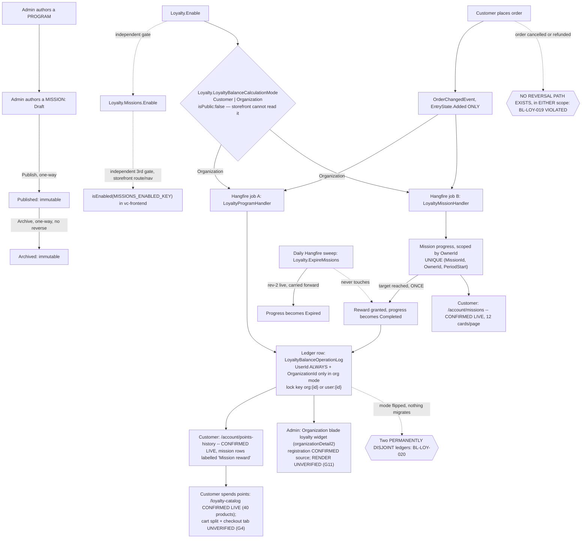

# Loyalty & Missions — domain map

> Refresh with `/qa-domain-map loy`. This file answers **what the feature is and where its
> surfaces are**. It does **not** carry behavioural rules — those are `BL-LOY-*` in
> `oracles/business-logic.md` (19 invariants, cited by id below, never restated) — and it can
> **never ground an assertion as `{DOC}`**. It is a pointer index plus a surface inventory: it
> tells you *where to look* and *what exists*, never *what correct looks like*.

**Verdict vocabulary** (unchanged from rev 2): `CONFIRMED (source)` = read in the module or
storefront source at the revision named · `CONFIRMED (docs)` = fetched first-hand from VirtoOZ,
quoted verbatim, with its URL · `CONFIRMED (corpus read)` = read from `config/test-suites.json`
or the suite CSVs · `CONFIRMED (prior-art)` = a dated prior deliverable's own capture, not
re-observed here · `CONFIRMED (live)` = observed **this pass** against the real environment
(REST, GraphQL, or a firefox render) · `DRIFT` = two of the above disagree · `MISSING` =
documented/expected, does not exist · `UNVERIFIED` = not established, and **not** to be treated
as true.

**This map names no environment and no environment URL.** Every live observation is attributed
to **Env-A**, defined by variable, never by value: the deployment reachable at
`BACK_URL`/`FRONT_URL` under `TEST_ENV`. There is exactly one environment in scope (no Env-B
contrast, unlike the Sales Rep map).

**Read-only pass, all three revisions.** No create/edit/publish/archive/seed/teardown/delete/
lock/order-placement/store-setting write was performed against any environment or repository.
Sessions were established by real sign-in and pages rendered by navigation only. Every
capability confirmable only by mutating is `UNVERIFIED` **with the mutation named** (§2's "not
manageable from here" rows, §5).

---

## §0 — Changed since rev 2 (2026-09-11 → 2026-09-18)

**Headline: rev 2's D11 is OVERTURNED BY EVENTS, not by a rev-2 error.** D11 stated that
organization-level loyalty existed only on an open, unmerged PR and that *"no organization-level
accrual code, GraphQL argument, or Admin surface exists on Env-A."* **That was true on
2026-09-11 and is false on 2026-09-18.** PR #17 merged 2026-09-17T14:29:27Z as `ab0908a8`; the
release tag `3.1008.0` is **identical** to that merge commit; and `GET /api/platform/modules`
reports `VirtoCommerce.Loyalty = 3.1008.0` on Env-A. Anyone who cited D11 to conclude "there is
no org surface to test" must re-read it — the conclusion has inverted, and the two suites
authored against that surface (`075f`, `083e`) are now testing deployed code.

| Rev 2 said | Rev 3 says |
|---|---|
| **D11**: org-level loyalty is unmerged, absent from Env-A; a map built on the brief's premise "would have invented a whole surface family that does not exist" | **OVERTURNED BY EVENTS — and rev 2 was RIGHT when it wrote this.** PR #17 merged 2026-09-17; tag `3.1008.0` ≡ merge commit `ab0908a8`; Env-A runs `3.1008.0`. Every org surface rev 2 said was absent is now live-confirmed present: the setting, the split REST balance routes, `OrganizationId`/`OwnerId` on the persisted entities, the org-keyed distributed lock, the Admin Organization widget registration. See the rewritten **D11** |
| **D10**: both tiers are PR-preview builds; backend `3.1007.0-pr-16-cfa5`, provably byte-identical to `dev` | **HALF RESOLVED, half persists.** Backend is now a **tagged release**, `3.1008.0`, and it is *exactly* PR #17's merge commit — so every `CONFIRMED (source)` row below describes code that IS deployed, with no diff at all. The **storefront theme is still a PR-preview build**, and it MOVED: `2.58.0-pr-2468-8e45-8e45ee74` → **`2.58.0-pr-2467-1f40-1f40b001`** (read live from the page footer) — a *lower* PR number than rev 2 saw. Rev 2's "a version-matcher would be misled" warning survives in a new form, described in **D10** |
| §2c: no `organizationId` argument on any Loyalty query, and *"since the org-level branch is unmerged (D11), that absence is current-and-correct, not a gap to close"* | **The EXCUSE is void; the OBSERVATION survives, and is now a finding.** Live introspection this pass returns the same three queries with **still no `organizationId` argument** — but that is now **deliberate design, proven in source**: every query sets `OrganizationId = context.GetCurrentOrganizationId()` from the ambient session, and `LoyaltyMissionLogicService` carries the comment *"The store mode - not the caller - decides, so a passed organizationId cannot redirect a user-scoped lookup."* New **D12** records what that costs |
| §2c: *"3 queries, 0 loyalty-specific mutations — unchanged"* | **The COUNT is unchanged; the ARGUMENTS are not.** `loyaltyBalance` and `loyaltyPointsHistory` each gained **`storeId: String!` — NON-NULL**, live-verified by introspection this pass. `loyaltyMissionProgress` also gained **`currencyCode`**. Two of three queries changed shape in a minor release |
| §2a / G2: `Loyalty.Missions.Enable` and `DefaultProductMultiplyFactor` are `isPublic: true` and reachable from the generic Modules→Settings surface | **Re-confirmed live, and now incomplete.** A **fourth** store-scoped Loyalty setting exists: `Loyalty.LoyaltyBalanceCalculationMode`, group `Loyalty\|Missions`, ShortText, allowed `["Customer","Organization"]`, default `Customer` — and it is the **only Loyalty setting with `isPublic: false`**. On Env-A its store value is explicitly persisted as `"Customer"`. New **D13** |
| §2a: the module's own store blade carries exactly 3 fields | **Re-confirmed live and now load-bearing.** `GET /api/loyalty-setting/store/{storeId}` returns exactly `{storeId, loyaltyEnabled, loyaltyMode, loyaltyCurrency}` — the new calculation mode is **not** in the module's own settings contract, although PR #17's own description says to *"select Organization mode in a store settings"*. Folded into **D13** |
| §1 link 7 / §6: points-history mission rows show the literal label **"Mission"** (VCST-5916) | **DRIFT — the label is now "Mission reward".** Live this pass on two separate accounts. Rev 2's precise wording is wrong in its literal; its *substance* (a coarse label, still no mission name or id) holds. `BL-LOY-015` unaffected |
| **D4**: Missions have zero surface across every official guide, *"strengthened this pass: `B2BExperts` newly queried, zero hits, extending the finding to a fourth source"* | **The FINDING holds; rev 2's STRENGTHENING is withdrawn.** `B2BExperts` re-queried this pass on five queries: it is a **generic B2B/CX thought-leadership corpus with no Virto Commerce product documentation in it at all**. Its silence about Missions carries **no signal** and never did. D4 stands on PlatformUserGuide + StorefrontUserGuide + PlatformDeveloperGuide + both source mirrors — five real sources, not four including a non-source |
| **D8**: the `PlatformBackendSourceCode` mirror is stale by the `LoyaltyProgramOperationLog*` → `LoyaltyBalanceOperationLog*` rename | **PERSISTS, and is now precisely bounded — the nuance matters.** The mirror returns the old names as **C# declarations and as github file paths**, and an explicit `LoyaltyBalanceOperationLog*` query returns **zero chunks**. Separately, the deployed REST **route** `api/loyalty-program-operation-log` was **never renamed** and is correct in the mirror — so *the route is not evidence of staleness and must not be cited as such*. The mirror also already contains the `IDistributedLockService` balance lock, so it **straddles** the rename rather than being wholesale old |
| §4: nine loyalty suites, **235** cases, `selections.loyalty` = 7 suites / 178 cases, 85 cases = **32%** never run under `loyalty` | **STALE in every number.** **Eleven** suites, **265** cases (re-derived by csv-parse; manifest `testCount` agrees exactly). `selections.loyalty` = **9 suites / 208 cases**. The missed set is unchanged in membership (`075d` 34 + `075e` 23 = 57, still in **no** selection group) but the percentage moved to **29%** because the denominator grew. See §4 |
| §4: `083` Loyalty Catalog Browsing = Automated 16 · Draft 10 | **DRIFT — now Draft 24 · Automated 2.** Same 26 cases; 14 rows moved from `Automated` to `Draft` between 2026-09-11 and today (the file was touched by `9250a23d` and `4e258073`). A coverage *regression* in status terms that no gate reports |
| §4: `envRiskGate` *"absent on all four `083*`"* | **DRIFT — four of FIVE.** `083e` is the first frontend loyalty suite to carry `envRiskGate: staging`, correctly, because every case in it requires the org-mode store setting |
| §4: 18 `BL-LOY` invariants, sixteen cited | **19 now** (`001`–`010`, `012`–`020`; `011` still reserved). `BL-LOY-020` is new since rev 2 and governs exactly the owner-scope mechanism this rev enumerates. **It is cited by `083e` once and by `075f` — the 22-case suite authored FOR org balance — not at all.** See §4 |
| G10: `LOYALTY_VIP_USER` carries a bare inline password literal | **STILL OPEN and now sharper.** Re-checked this pass: it is a 9-character bare literal (and carries a redundant `password_env` key beside it). The three *newer* org-loyalty fixtures — `ORG_LOY_A`, `ORG_LOY_B`, `LOY_PERSONAL_NOORG` — all correctly carry `{{DEFAULT_TEST_PASSWORD}}`. `LOYALTY_VIP_USER` is now the **only** loyalty alias with a literal |
| — | **NEW, and the most valuable live observation of this pass: the three-account balance contrast.** See §2b — an org member sees `Balance: 0` / "No records found" on the storefront while that organization's ledger holds **34,516,797** points |
| — | **NEW: a BREAKING REST route change shipped in a minor release.** `GET …/balance/{userId}` → `…/balance/user/{userId}`; the old path returns **404 live**. New **D14** |
| — | **NEW: fixture accumulation has roughly doubled.** 67 missions on Env-A (65 `Published`, 1 `Draft`, 1 `Archived`; **15** with `public: false`), 1,674 mission-progress rows, 2,152 operation-log rows. Rev 2 saw 9 `TGT-*`; those 9 are still there, plus 3 `AGENT-TEST-MSN-ORGLOY-*` from 2026-09-14 |

**No `D*` or `G*` row was renumbered or deleted.** New rows this pass: **D12**, **D13**, **D14**,
**G11**, **G12**. `G4` and `G10` remain **OPEN**; `G1`–`G3`, `G5`–`G9` stay **CLOSED**.

---

## §1 — Purpose and value chain

**Loyalty purpose** (`PlatformUserGuide` §Overview —
[docs.virtocommerce.org/platform/user-guide/loyalty/overview](https://docs.virtocommerce.org/platform/user-guide/loyalty/overview),
verbatim, **re-fetched first-hand this pass and byte-for-byte unchanged from rev 1 and rev 2**):
*"The **Loyalty** module provides a flexible loyalty program management system for the Virto
Commerce Platform. It enables store managers to define loyalty programs, reward customers with
points, track transactions, and allow customers to pay for their orders using loyalty points."*
`CONFIRMED (docs)`.

**Missions purpose: still `UNDECLARED`.** Re-checked first-hand this pass against
`PlatformUserGuide`, `StorefrontUserGuide`, `PlatformDeveloperGuide`, `FrontendSourceCode` and
`PlatformBackendSourceCode` — the query `"loyalty missions"` returns **zero** mission content in
every one, including 12 storefront locale files and the module's own Localizations. See **D4**.
(`B2BExperts` was also queried and returns zero, but it holds no Virto product documentation at
all, so its silence is not evidence — see §0.)

**Organization-scope purpose: also `UNDECLARED` in every published guide**, which is *expected*
for a 2026-09-17 merge and is recorded as a dated fact, not a defect — see **D11**. The nearest
thing to a purpose statement is PR #17's own description, which is a changelog entry, not a
guide: *"To enable calculating balance on the org level instead of an individual level select
Organization mode in a store settings."* `CONFIRMED (source)`.

**The chain below is rev 2's, carried forward with the organization branch folded into each
link it changes.** The mechanism DID change this rev — for the first time across three
revisions.

| # | Link, in the customer's words | Mechanism |
|---|---|---|
| 1 | **A store turns Loyalty on** | `Loyalty.Enable` (Store setting, default `false`, group `Loyalty\|General`). Live on Env-A: store value `true`, `isPublic: true`. `CONFIRMED (live)` |
| 1b | **A store turns Missions on — independently** | `Loyalty.Missions.Enable` (default `false`, group `Loyalty\|Missions`), read at the write path, the read path and **again** in the storefront route registration, with no shared helper — three independent gates for one conceptual switch. Live on Env-A: store value `true`. `CONFIRMED (source + live)` |
| **1c** | **A store chooses WHOSE balance it is — NEW this rev** | `Loyalty.LoyaltyBalanceCalculationMode` (group `Loyalty\|Missions`, ShortText, allowed `["Customer","Organization"]`, default `Customer`, **`isPublic: false`**). Read through one extension method, `StoreExtensions.IsOrganizationBalanceCalculationMode()`, which every branch below calls. Live on Env-A: store value **`"Customer"`** — so the organization branch is **present in code but not the ambient runtime state**. `CONFIRMED (live + source)` |
| 2a | **A loyalty PROGRAM is authored** | Admin **Loyalty** menu → Order-loyalty or Product-loyalty. Both menu entries confirmed live in the Admin SPA this pass. `CONFIRMED (live + docs)` |
| 2b | **A MISSION is authored** | Admin **Loyalty missions** menu, one goal required (`OrderValueGoal`/`OrderCountGoal`/`PerSkuGoal`), conditions restricted to `AnyUserGroupCondition`/`UserGroupIsCondition`, reward `FixedAmountReward` only, one-way `Draft → Published → Archived`. Live on Env-A: **67 missions**, 65 `Published` / 1 `Draft` / 1 `Archived`. `CONFIRMED (live + source)` |
| 3 | **A customer places a qualifying order** | `OrderChangedEvent`, `EntryState.Added` only. `CONFIRMED (source)`, unchanged |
| 4 | **The async hop — two independent Hangfire jobs** | `CONFIRMED (source)`, unchanged. Not re-inspected in the Hangfire dashboard this pass — **carried forward from rev 2, not re-checked** |
| 5a | **Program path: earn/redeem — now owner-scoped** | `LoyaltyProgramHandler` sets `loyaltyContext.OrganizationId = order.OrganizationId` **only when** `store.IsOrganizationBalanceCalculationMode()`, on all three earn/redeem branches; registration awards resolve the org from `contact.Organizations.FirstOrDefault()`. `LoyaltyLogicService.LogLoyaltyProgramOperationAsync` keys its distributed lock `org:{id}` or `user:{id}` accordingly, and *"organization takes priority"* in both the balance read and the running-total write. `CONFIRMED (source, at the exact deployed commit)` |
| 5b | **Mission path: contribution, not currency-aware for two of three goal types** | `BL-LOY-017`, status VIOLATED. Not re-run live this pass (G4). **New this rev**: mission progress is scoped by a new `OwnerId` column (`= OrganizationId` in org mode, `= UserId` otherwise), *"a shared progress record per org per period"*, and the unique index moved from `(MissionId, UserId, PeriodStart)` to `(MissionId, OwnerId, PeriodStart)`. Live: `OwnerId` is populated on real rows and equals `UserId` under the store's current `Customer` mode. `CONFIRMED (source + live)` |
| 6 | **Contribution and reward are persisted, deduped, granted at most once** | `BL-LOY-018` SATISFIED. `CONFIRMED (source)`. Live: 1,674 mission-progress rows, all sampled rows carrying `organizationId: null` and `ownerId == userId` — consistent with `Customer` mode |
| 7 | **The customer sees it** | `CONFIRMED (live)` this pass on **three** accounts — see §2b. The mission-row label in points history is **"Mission reward"** (not rev 2's "Mission") |
| 8 | **Points are spent** | Loyalty catalog live: **40** PTS-priced products. Cart validation now resolves the balance from `cart.OrganizationId` in org mode, else `cart.CustomerId`. Cart-side split UI and the checkout points tab remain **`UNVERIFIED`** (G4) |
| 9 | **A daily sweep expires stale progress** | `Loyalty.ExpireMissions`, `Cron.Daily()`. `CONFIRMED (source)` + rev 2's live Hangfire confirmation — **carried forward, not re-checked this pass** |
| 10 | **Reversal — the effect is NOT reversed, anywhere** | `BL-LOY-019`, status VIOLATED. `CONFIRMED (source)`, unchanged. PR #17 adds **no** reversal path; it adds a second *owner scope* for the same one-way effect. Not re-run live (G4) |
| **11** | **The mode is flipped — and two disjoint ledgers become visible/invisible** | Nothing migrates. A row with `OrganizationId == null` and a row with `OrganizationId == <id>` are permanently separate ledgers (`BL-LOY-020`). **Live-observed read-side consequence this pass, with no mutation**: §2b's three-account table |



### Actors

| Actor | Can do | Verdict |
|---|---|---|
| **Store manager / admin** | Authors programs and missions. Toggles `Loyalty.Enable`/`Mode`/`Currency` via this module's own 3-field blade. **Cannot** set `Missions.Enable`, `DefaultProductMultiplyFactor` or the new `LoyaltyBalanceCalculationMode` from that blade — all three live only on the platform's generic Store→Settings surface. **NEW: can read an organization's pooled balance** via `GET /api/loyalty-program-operation-log/balance/organization/{organizationId}` and, per source, via a loyalty widget on the Organization detail blade | `CONFIRMED (source + live REST)`; the widget's render `UNVERIFIED` (G11) |
| **Customer**, `Customer` mode | Earns and spends points against their **own** ledger; browses the loyalty catalog; sees mission cards. Live end to end this pass for two accounts | `CONFIRMED (live)` |
| **Customer**, `Organization` mode | Earns into, and spends from, the **organization's pooled** ledger; contributes to a **single shared** mission progress per org per period; **cannot address any other scope** — the contract exposes no argument for it | `CONFIRMED (source)`; runtime behaviour **`UNVERIFIED`** — needs the store-setting flip (G12) |
| **Customer with NO organization, in an org-mode store** | `GetCurrentOrganizationId()` returns null ⇒ every read and write silently falls back to **user scope**. The drafted Critical bug says such a buyer is shown a balance they cannot spend | `UNVERIFIED` — the fallback is `CONFIRMED (source)`; the customer-visible consequence needs the store-setting flip (G12). Live baseline in `Customer` mode captured: `LOY_PERSONAL_NOORG` reads **38,916**, matching REST exactly |
| **Customer**, a `Public=false` mission | **Sees it anyway.** `CONFIRMED (live)` twice this pass, on **two independent accounts in two different customer groups** — `AGENT-TEST-…-TGT-PRIVATE` rendered for both. Live Admin search: **15 of 67** missions carry `public: false` | `CONFIRMED (live)` — **D7 strengthened** |
| **A "targeted" customer group** | Group conditions **do** filter, and this pass isolated it cleanly: the org-group account saw `TGT-PRIVATE` and `TGT-CONTROL` but **not** `TGT-GROUP` (whose condition is `UserGroupIsCondition, groups:["VIP"]`), while the VIP account saw all three. Public-flag filtering and group filtering are now demonstrated as **independent** mechanisms | `CONFIRMED (live)` — **G8 stays closed**, with better evidence |
| **Guest / anonymous checkout** | Attributes no mission progress, per `VCST-5320` C24 | `CONFIRMED (prior-art)`, not re-derived |

---

## §2 — Surface inventory

### 2a. Back office — Admin AngularJS SPA (this module's own `Scripts/`)

The deployed module is **exactly** PR #17's merge commit (`3.1008.0` ≡ `ab0908a8`), so every
source row here describes deployed code with **no diff at all** — a stronger claim than either
prior rev could make.

**Two separate top-level main-menu items**, `Loyalty` and `Loyalty missions`, one permission gate
for both (`loyalty:access`). **Both confirmed rendering live in the Admin SPA this pass.**
`CONFIRMED (live)`.

**Widgets — now FIVE, not four.** The four rev 2 listed (`customerLoyaltyWidget` on
`customerDetail1`, `loyaltySettingWidget` on `storeDetail`, `loyaltyProductFactorsWidget`,
`productDetailsLoyaltyFactorsWidget`) **plus a new one**:

| New widget | Registration | Behaviour |
|---|---|---|
| `organizationLoyaltyWidget` | `widgetService.registerWidget(organizationLoyaltyWidget, 'organizationDetail2')`, `size: [2,1]`, `isVisible: !blade.isNew` | Calls `getOrganizationBalance({organizationId: blade.currentEntity.id})` and renders `$scope.balance`; clicking opens an `organizationLoyaltyBlade` reusing `loyaltyProgramOperationLogListController` filtered by `organizationId`. Localized title from the module's own `en.VirtoCommerce.Loyalty.json`. `CONFIRMED (source, at the deployed commit)`; **render `UNVERIFIED` (G11)** |

**REST controllers** — the same 7. `LoyaltyBalanceOperationLogController` changed shape: the full
live route inventory from the deployed swagger is below. `CONFIRMED (live)`.

```
POST,PUT,DELETE /api/loyalty-mission-goal-items          PUT /api/loyalty-mission-goal-items/items
POST            /api/loyalty-mission-goal-items/search   GET /api/loyalty-mission-goal-items/{id}
POST            /api/loyalty-mission-progress/search     GET /api/loyalty-mission-progress/{id}
POST,PUT,DELETE /api/loyalty-missions                    GET /api/loyalty-missions/new
POST            /api/loyalty-missions/search             GET /api/loyalty-missions/{id}
GET             /api/loyalty-program-operation-log/balance/organization/{organizationId}   <-- NEW
GET             /api/loyalty-program-operation-log/balance/user/{userId}                   <-- RENAMED
POST            /api/loyalty-program-operation-log/search
POST,PUT,DELETE /api/loyalty-program-product-factors     PUT /api/loyalty-program-product-factors/factors
POST            /api/loyalty-program-product-factors/search  GET /api/loyalty-program-product-factors/{id}
POST,PUT,DELETE /api/loyalty-programs                    GET /api/loyalty-programs/new/{programType}
POST            /api/loyalty-programs/search             GET /api/loyalty-programs/{id}
PUT             /api/loyalty-setting                     GET /api/loyalty-setting/store/{storeId}
```

Live balance reads this pass, admin token: organization `AGENT-TEST-Org-LoyaltyOutlet` →
**34,516,797**; its sibling org → **219,416**; `ORG_LOY_A` user → **0**; `ORG_LOY_B` user → **0**;
`LOY_PERSONAL_NOORG` user → **38,916**; the VIP account's security-account id →
**2,804,550,892**. The legacy `…/balance/{userId}` path → **404** (D14). `CONFIRMED (live)`.

**NOT manageable from the back office** —

| Not manageable here | Where it actually lives |
|---|---|
| `Loyalty.Missions.Enable` / `Loyalty.DefaultProductMultiplyFactor` / **`Loyalty.LoyaltyBalanceCalculationMode`** from the module's **own** store blade | `GET /api/loyalty-setting/store/{storeId}` returns exactly `{storeId, loyaltyEnabled, loyaltyMode, loyaltyCurrency}` — three fields, live-confirmed. All three settings above live only on the platform's **generic** Store→Settings surface. For the calculation mode this is the more surprising case, because PR #17's own description says to select it *"in a store settings"* — see **D13** |
| A mission's `Public` flag | Still no Admin UI control (no `metaFormsService` field). It **is** a filterable criterion on `POST /api/loyalty-missions/search` — an API-only capability. Live: 15 of 67 missions carry `public: false` |
| **An organization's balance as an editable value** | Read-only everywhere. There is **no** set/adjust/reset/debit API for a balance in either scope — the balance is derived as the `Balance` column of the most recent operation-log row. Correcting one is an order-shaped mutation, never an edit |
| **Purging accumulated mission progress or ledger rows** | No purge or retention path exists in any blade or job. Live: 1,674 progress rows and 2,152 ledger rows have accumulated, including three undeleted `AGENT-TEST-MSN-E2E-*` batches and one `AGENT-TEST-MSN-ORGLOY-*` batch. Clearing them is a seeder teardown — a mutation — so whether the existing `:teardown` scripts fully reverse a mission seed stays `UNVERIFIED` |

### 2b. Storefront (Vue) — `CONFIRMED (live)` this pass across three accounts

**The three-account contrast is the highest-value observation of this rev, and it needed no
mutation.** All three walked on Env-A in firefox, this pass, while the store reads `Customer`
mode:

| Account | Organization | Storefront `/account/points-history` | Admin REST `balance/user/{id}` | Admin REST `balance/organization/{id}` |
|---|---|---|---|---|
| `LOYALTY_VIP_USER` ("AGENT TEST", groups `[VIP]`) | none | `Balance: 2804550892`, 23 pages @ 10/page | **2,804,550,892** — exact match | n/a |
| `ORG_LOY_A` ("Ada Outlet") | `AGENT-TEST-Org-LoyaltyOutlet` | **`Balance: 0`**, table renders **"No records found"** | **0** — exact match | **34,516,797** |
| `LOY_PERSONAL_NOORG` ("Nina Solo") | none | `Balance: 38916` | **38,916** — exact match | n/a |

**Read the middle row carefully.** An organization whose ledger holds 34.5 million points shows
its own member a zero balance and an empty table — because the store currently resolves the
*Customer* scope and the org-scope rows are a disjoint ledger (`BL-LOY-020`). Nothing here is
wrong on its own terms; the storefront, the user-balance route and the org-balance route each
report exactly what they are asked. It is the **read-side half** of the drafted Critical bug
`BUG-org-mode-contact-level-transactions-written-but-unreachable-VCST-5024.md`, observable from
the customer surface with no mutation at all.

| Surface | Route | Live observation this pass |
|---|---|---|
| Loyalty catalog | `/loyalty-catalog` | **40 results**, PTS-priced (`PTS8`–`PTS245`), `Show in stock` pre-checked, quantity steppers. **The real ~5 s hydration delay persists** — an immediate snapshot returns a blank document; a single fast snapshot still reads as a broken route. `CONFIRMED (live)` |
| Points history | `/account/points-history` | Heading + `Balance: <unformatted integer>`; table `Operation \| Type \| Date \| Amount`; order-earn rows show the order number (`CO260911-00012`), **mission-earn rows show the literal label "Mission reward"** (rev 2 recorded "Mission" — DRIFT). Empty state renders as a `No records found` row inside the table, not a separate empty card. `CONFIRMED (live)` |
| Missions & challenges | `/account/missions` | Heading + *"Complete missions to earn bonus Virto Rewards points."*; **Virto Rewards balance** banner (same figure, **comma-formatted** here while the points-history heading is **unformatted** — same value, two renderings, one build); **Redeem your points** banner; **12 cards/page × 5 pages** for the VIP account and **12 cards** for the org account; types **Order value** / **Order count** / **Featured SKUs**; each card shows points, a `Completed` badge or a "N days left" indicator, a percentage, a progress line, and an "Open mission" button. `CONFIRMED (live)` |
| Account sidebar, **Marketing** group | any `/account/*` page | **Missions & challenges**, **Coupons & promotions**, **Notifications**, **Points history** — re-confirmed live on all three accounts. The top header / main-menu nav never carries them. An org-affiliated account additionally gets a **Company** group (Company info, Company members) — which contains **no loyalty surface of any kind**. `CONFIRMED (live)` |
| Mixed cart split UI, checkout "Pay with points" tab | `/cart`, `/checkout` | **Still `UNVERIFIED`** — both need a non-empty cart (a mutation). The `StorefrontUserGuide` describes both verbatim (§2e), so this is a documented surface the map has never observed. **G4** |
| **Any organization-aware loyalty surface** | — | **MISSING.** A repo-scoped search for `organizationId` across the whole of `client-app/modules/loyalty/**` on `vc-frontend` `dev` returns **0 hits**; there is no org switcher, no pooled-balance label, no "your organization's points" string in any of the 12 locale files. `CONFIRMED (source)` — see **D13** |

**NOT manageable from the storefront** — unchanged and now stronger: the customer-facing surface
is **read-only over every loyalty object except the cart**. No mission can be created, edited or
published; the `Public` flag has no customer-side control; the balance cannot be adjusted, reset
or forfeited; mission progress cannot be re-run or cleared; **and the customer cannot see, let
alone choose, which owner scope their balance is being resolved at.** This follows from §2c, not
from UI inspection: the contract exposes **3 queries and 0 loyalty-specific mutations**.

### 2c. API / contract — the query COUNT is unchanged; two of three query SHAPES are not

Live anonymous introspection, this pass, with argument nullability resolved:

```
loyaltyBalance(storeId: String!, userId: String, orderId: String)
loyaltyPointsHistory(after, first, keyword, sort, storeId: String!, userId: String, operationType: String)
loyaltyMissionProgress(after, first, keyword, sort, storeId: String!, statuses, completedStartDate,
                       completedEndDate, cultureName, currencyCode, isStarted, userId)
```

`CONFIRMED (live)`. **3 queries, 0 loyalty-specific mutations** — count unchanged since rev 1.
What changed: `storeId` is **`String!` (NON-NULL)** on all three, newly required on
`loyaltyBalance` and `loyaltyPointsHistory`; and `loyaltyMissionProgress` gained **`currencyCode`**.
The storefront's own three GraphQL documents on `vc-frontend` `dev` already declare
`$storeId: String!` and pass `$currencyCode`, and the deployed theme renders all three pages, so
the two tiers agree on Env-A. `CONFIRMED (source + live)`.

**There is NO `organizationId` argument on any loyalty query, and that is deliberate.** Each
query's `Map()` sets `OrganizationId = context.GetCurrentOrganizationId()` — from the ambient
session, never from an argument — and `GetLoyaltyBalanceQueryBuilderHandler.ResolveOrganizationIdAsync`
returns the org id **only** when the named store is in organization mode, falling back to user
scope otherwise. `LoyaltyMissionLogicService` states the intent in a source comment: *"The store
mode - not the caller - decides, so a passed organizationId cannot redirect a user-scoped
lookup."* Authorization was hardened to match: `CanAccessLoyaltyAuthorizationHandler` now injects
`IMemberResolver`, implements a shared `ILoyaltyQuery` contract, and **checks both scopes**, with
its own comment *"membership in the requested organization must not also hand over another
member's personal data."* `CONFIRMED (source)`. What it costs is **D12**.

**NOT manageable from the API layer** — no mission-granting-row id on the ledger type
(`BL-LOY-015`); no mutation to spend, forfeit or adjust points directly; **no way to address an
organization balance explicitly**, and **no way to request personal scope in an org-mode store**;
and no way for a client to discover which scope it is being served, because the mode setting is
`isPublic: false`.

### 2d. Persistence / jobs

Rev 2's source read plus its live Hangfire confirmation of `Loyalty.ExpireMissions` are **carried
forward and were NOT re-checked this pass**. What is new and live-confirmed:

- `LoyaltyMissionProgress` carries **`OrganizationId`** and a `[Required]` **`OwnerId`**, both
  returned by `POST /api/loyalty-mission-progress/search` on real rows. The unique index moved to
  `(MissionId, OwnerId, PeriodStart)`; EF migrations `AddOrganizationId` ship for SqlServer,
  PostgreSql and MySql. `CONFIRMED (live + source)`.
- `LoyaltyBalanceOperationLog` and `LoyaltyMissionTransaction` carry `OrganizationId`. Live: of
  the 50 newest ledger rows, **0** carry one — consistent with the store's current `Customer`
  mode. Org-scope rows demonstrably exist (the org balance is non-zero) but are not the recent
  traffic.
- `LoyaltyBalanceOperationLogSearchService` gained a `BuildOwnerQuery`; the drafted Critical bug
  quotes its `&& x.OrganizationId == null` conjunct as the reason org-scope rows are invisible to
  every user-scoped read. **Recorded as a drafted-bug claim; not independently re-derived here.**

**NOT manageable from the persistence/jobs layer** — `Loyalty.ExpireMissions` cannot be
triggered, rescheduled or disabled from any Loyalty blade; the platform-wide Hangfire dashboard
is the only observed control. **A schema migration is the only way `OwnerId` gets populated for
pre-existing rows** — whether the `AddOrganizationId` migration backfilled `OwnerId` correctly on
Env-A's 1,674 rows is `UNVERIFIED` (the sampled rows are consistent, which is not the same as
verified).

### 2e. The published-doc surface — all six VirtoOZ topic tools queried first-hand this pass

- **`PlatformUserGuide`** — six loyalty pages (`overview`, `enable-and-configure-loyalty-programs`,
  `set-up-loyalty-catalog-browsing`, `configuring-loyalty-points-per-product`,
  `loyalty-points-history`, `create-loyalty-program`). Documents exactly **three** store settings
  (Enable / Loyalty mode / Loyalty currency) and documents the Loyalty-balance widget **only on a
  Contact**. Verbatim, on the points formula:
  *"Loyalty points = (Product price − Discount) × Multiply factor"*, with the note *"This feature
  controls display only. The actual point accrual on order placement is configured separately
  through loyalty programs."*
  ([…/configuring-loyalty-points-per-product](https://docs.virtocommerce.org/platform/user-guide/loyalty/configuring-loyalty-points-per-product))
- **`StorefrontUserGuide`** — verbatim, and directly relevant to the one surface this map has
  never rendered: *"You can put them in the same cart as products you pay for with money. The cart
  keeps these two apart, showing a separate total for your money items and your points items, so
  it is always clear what each one costs."*
  ([…/shopping/products-purchase-options](https://docs.virtocommerce.org/storefront/user-guide/shopping/products-purchase-options))
  and *"**Pay with points** allows you to pay for the order with loyalty points earned from
  previous activity."*
  ([…/shopping/checkout-process](https://docs.virtocommerce.org/storefront/user-guide/shopping/checkout-process)).
  Its `company-info` page lists exactly Company name / Company logo / Addresses — **no loyalty
  widget**.
- **`PlatformDeveloperGuide`** — the xAPI Loyalty reference still lists exactly **two** queries
  (`loyaltyBalance`, `loyaltyPointsHistory`) and describes `loyaltyBalance` as *"the loyalty
  balance information for a specific user"*. **D1 persists.**
- **`FrontendSourceCode`** — settles the route from source, verbatim: `path: "points-history"`
  registered by `router.addRoute("Account", route)` against a parent whose `path` is `/account`,
  gated on `isAuthenticated && isEnabled("Loyalty.Enable")`. **`/account/loyalty` appears
  nowhere.** **D9 stays resolved.** The mirror's `getLoyaltyBalance` document is the **pre-`storeId`**
  version, so this mirror is also stale against the deployed contract.
- **`PlatformBackendSourceCode`** — still the pre-rename mirror. **D8 persists, precisely bounded**
  (§0).
- **`B2BExperts`** — five queries, zero Virto product content. **This corpus holds no Virto
  Commerce documentation at all** and must not be counted as a source for this domain (§0).

---

## §3 — Where the layers DISAGREE

`D1`–`D9` carried forward from rev 1/2 **unchanged unless noted**; **D10** and **D11** rewritten;
**D12**, **D13**, **D14** new. **Never renumbered.**

| # | Disagreement | Verdict |
|---|---|---|
| **D1** | The published xAPI reference undercounts the schema by one query — `loyaltyMissionProgress` is missing from `PlatformDeveloperGuide`'s Loyalty query table, which lists two. | `CONFIRMED (docs + live)` — **re-fetched this pass**; the guide still lists two, live introspection still returns three |
| **D2** | Two `PlatformUserGuide` pages name the enabling step differently ("Settings" vs "Loyalty settings"). | **RESOLVED** (rev 2): one `loyaltySettingWidget`, described at two levels of specificity |
| **D3** | "Create Loyalty Program" is a genuinely empty page that a sibling page links to as a step. | `CONFIRMED (docs)` — **re-fetched this pass on three independent queries**: the page returns exactly `# Create Loyalty Program` and nothing else, while `set-up-loyalty-catalog-browsing` links to it as step 3 |
| **D4** | Missions ship a mature Admin + storefront + GraphQL surface and have **zero** surface across every official guide. | `CONFIRMED (docs)` — **re-confirmed across five real sources this pass**. Rev 2's "fourth source" was `B2BExperts`, which holds no Virto content; that strengthening is **withdrawn** and replaced by the two source mirrors, which also carry no mission entity, route or i18n key |
| **D5** | `MissionTypes` declares 5 constants; only 3 are ever a stored goal's class. | `CONFIRMED (source)` — **carried forward, not re-checked this pass** |
| **D6** | Reward vocabulary is asymmetric: a PROGRAM offers Fixed + Relative; a MISSION offers Fixed only, invisibly. | `CONFIRMED (source)` — **carried forward, not re-checked this pass** |
| **D7** | A mission's `Public` flag is unreachable from Admin AND unread by the customer-facing query — net effect: every `Published` mission is shown to everyone. | `CONFIRMED (live)` — **strengthened this pass with a second, independent account in a different customer group**. `TGT-PRIVATE` (`public: false`) rendered for both `LOYALTY_VIP_USER` and `ORG_LOY_A`, while `TGT-GROUP` correctly rendered for the VIP account only — proving public-flag filtering and group filtering are independent, and that only the latter works |
| **D8** | VirtoOZ's `PlatformBackendSourceCode` mirror is stale by one entity rename. | `CONFIRMED (docs-tool output vs source)` — **re-queried and now precisely bounded**. Stale **class/interface/file names** (`LoyaltyProgramOperationLogController`, `ILoyaltyProgramOperationLogService`, …), returned as C# declarations and github paths; an explicit `LoyaltyBalanceOperationLog*` query returns zero chunks. **The REST route `api/loyalty-program-operation-log` is NOT stale — it was never renamed — and must not be cited as evidence.** The mirror straddles the rename (it already holds the `IDistributedLockService` lock), so check per symbol, never blanket |
| **D9** | The customer-facing points page had two names/routes across sources. | **RESOLVED** (rev 2), **re-confirmed from `FrontendSourceCode` this pass**: `/account/points-history` is correct; the 2026-06-24 prior-art guide's `/account/loyalty` is wrong |
| **D10 — the two tiers are now on DIFFERENT release footings, and the backend's version number has a trap of its own** | Backend: `VirtoCommerce.Loyalty = 3.1008.0`, a **tagged release**, and the tag is **identical** to PR #17's merge commit `ab0908a8` — so every `CONFIRMED (source)` row here describes deployed code with zero diff. Storefront theme: **`Ver. 2.58.0-pr-2467-1f40-1f40b001`**, read live from the page footer — **still a PR-preview build**, and a *different* one from rev 2's `pr-2468-8e45`. **The trap**: commit `da284217` (2026-09-10) bumped the manifest to `3.1008.0` and was never released under that tag; the `3.1008.0` **tag** points at a commit a week later that contains the whole org-level feature. A reader who equates "manifest says 3.1008.0" with "the 3.1008.0 release" gets the wrong code. `dev` is now `3.1009.0` (version string only) | `CONFIRMED (live REST + live footer + GitHub tag/ancestry)`, all this pass |
| **D11 — OVERTURNED BY EVENTS. Rev 2 said organization-level loyalty was unmerged and absent from Env-A. It is now MERGED, RELEASED and DEPLOYED.** | **Rev 2 was correct on 2026-09-11** — PR #17 was genuinely open, and `git merge-base --is-ancestor` genuinely returned false. **PR #17 merged 2026-09-17T14:29:27Z**; tag `3.1008.0` ≡ merge commit `ab0908a8`; Env-A runs `3.1008.0`. Live-confirmed present on Env-A, none of which existed at rev 2: the `Loyalty.LoyaltyBalanceCalculationMode` setting with allowed values `["Customer","Organization"]`; `GET …/balance/organization/{organizationId}` returning **34,516,797** for a real org; `OrganizationId` + `OwnerId` columns populated on real progress and ledger rows; `storeId: String!` on two GraphQL queries. **Anyone who cited D11 as "there is no org surface" must re-read this row.** The reason this is written loudly rather than quietly corrected: a deleted row leaves every citation of it silently wrong | `CONFIRMED (live REST + live GraphQL + GitHub merge/tag/ancestry)`, all this pass |
| **D12 — the organization scope is AMBIENT-ONLY on the contract, and three layers resolve "which organization" from three different places** | No loyalty query accepts an `organizationId`; each sets it from `context.GetCurrentOrganizationId()`. **Consequences, all source-grounded**: (a) in org mode the accepted `userId` argument is **silently ignored** for balance and history — `GetLoyaltyBalanceQueryBuilderHandler` sets `OrganizationId` *or* `UserId`, never both, and *"organization takes priority"*; (b) a caller cannot request personal scope in an org-mode store, nor any other org's; (c) a user with no organization falls back to user scope with no signal; and (d) the three layers disagree on the **source** of the org id — **GraphQL** reads the session claim, **`LoyaltyCartValidator`** reads `cart.OrganizationId`, and the **Admin widget** reads `blade.currentEntity.id`. A cart whose `OrganizationId` differs from the session's is therefore validated against a different balance than the account page displays. Whether that can actually happen is `UNVERIFIED` | `CONFIRMED (source, at the deployed commit)` for the mechanism; the cart/session divergence `UNVERIFIED` (G12) |
| **D13 — the setting that decides whose money it is, is the ONE Loyalty setting the storefront cannot read and the module's own blade cannot set** | `Loyalty.LoyaltyBalanceCalculationMode` is the **only** Loyalty setting with **`isPublic: false`** (the other five are all `true`), and it sits in group `Loyalty\|Missions` rather than `Loyalty\|General` with its siblings. Three layers disagree about where it lives: **source** puts it in `ModuleConstants.StoreSettings` and PR #17's description says to *"select Organization mode in a store settings"*; the **module's own settings contract** `GET /api/loyalty-setting/store/{storeId}` returns exactly three fields and not this one (live); and the **storefront** cannot read it at all — `vc-frontend`'s loyalty module has **0 occurrences of `organizationId`** and no mode-aware code, so it renders an org-pooled balance and a personal balance identically, with nothing to tell the customer which they are looking at | `CONFIRMED (live REST + live GraphQL + source, both repos)` |
| **D14 — a BREAKING REST route change shipped inside a minor version bump** | `GET /api/loyalty-program-operation-log/balance/{userId}` became `…/balance/user/{userId}`. The old path returns **404 live** on Env-A. The module's own Admin resource file was updated in the same PR, so the Admin SPA is fine; **any external caller, Postman collection, monitoring probe or test fixture pinned to the old path breaks silently on upgrade**, and the version went `3.1007.0 → 3.1008.0` with no major/minor signal | `CONFIRMED (live 404 + source diff)` |

**Where the layers were compared and agree** — the five permissions, the four `Loyalty.Mode`
values (live-confirmed as the setting's `allowedValues`: `Loyalty Store`, `Mixed Cart`, `Coupon
Redemption`, `Payment Method`) and the `LoyaltyPaymentMethod` gateway code still match
one-for-one between `ModuleConstants`, the Admin blade and the published guides. **Newly checked
and agreeing this pass**: every storefront balance figure matched its Admin REST counterpart
exactly, on all three accounts (§2b) — the disagreement in that table is between *scopes*, never
between *layers*.

---

## §4 — Coverage shape

**Basis: fully re-derived, nothing carried forward except where labelled.** `config/test-suites.json`
and **all eleven** loyalty suite CSVs were re-parsed from scratch by `csv-parse` on 2026-09-18.
Manifest `testCount` and actual CSV row count agree exactly at 265 — no manifest/CSV drift.
`CONFIRMED (corpus read)`.

### The eleven loyalty suites — 265 cases (rev 2 said nine suites, 235 cases)

| Suite | Cases | In `loyalty` group | Automation status | `BL-LOY` cited |
|---|---|---|---|---|
| `075` Loyalty (Backend) | 29 | yes | Draft 29 | **none** |
| `075b` Loyalty Mixed Cart Order (Backend) | 13 | yes | Draft 10 · Manual 1 · Semi-Automated 1 · Automated 1 | 002,003,005,007,008,009,010,012,013 |
| `075c` Loyalty Product Points Earning (Backend) | 10 | yes | Draft 10 | 001,007 |
| `075d` Loyalty Missions (Backend) | 34 | **NO** | Automated 19 · Draft 9 · Manual 4 · Deprecated 2 | 007,009,010,015,016,017,019 |
| `075e` Loyalty Missions Admin (Backend) | 23 | **NO** | Automated 14 · Draft 9 | 015,016 |
| **`075f` Loyalty Organization Balance (Backend)** — NEW | 22 | yes | Draft 13 · Automated 9 | 007,008,015,018,019 |
| `083` Loyalty Catalog Browsing (Frontend) | 26 | yes | **Draft 24 · Automated 2** (rev 2: Automated 16 · Draft 10 — DRIFT) | 003 |
| `083b` Loyalty Mixed Cart Order (Frontend) | 8 | yes | Automated 6 · Draft 2 | 002,003,005,007,008,009,010,013 |
| `083c` Loyalty Missions Storefront (Frontend) | 84 | yes | Automated 44 · Draft 36 · Manual 1 · Reviewed 3 | 002,003,015,016 |
| `083d` Loyalty Missions E2E (Frontend) | 8 | yes | Automated 2 · Draft 5 · Deprecated 1 | 007,009,010,013,015,016,018,019 |
| **`083e` Loyalty Organization Balance Storefront (Frontend)** — NEW | 8 | yes | Automated 2 · Draft 6 | 007,008,010,015,018,019,**020** |
| **Total** | **265** | **208** in group | **Draft 153 · Automated 99 · Manual 6 · Reviewed 3 · Deprecated 3 · Semi-Automated 1** | 16 distinct ids |

Both new suites landed in commit `9250a23d` (2026-09-15), *two days before* the feature they test
merged upstream — authored against the PR, now testing released code.

### Feature-relevant cases the obvious selection group MISSES

`selections.loyalty.include` now resolves to `["075","075b","075c","083","083b","083c","083d","075f","083e"]`
— **9 suites, 208 cases**. `CONFIRMED (corpus read)`.

| Missed | Cases | Why it belongs | Basis |
|---|---|---|---|
| `075d` Loyalty Missions | 34 | The entire **backend** mission surface — where points are actually granted. Tagged `loyalty,missions,graphql,api,sprint` and in **no selection group at all** | Re-derived this pass |
| `075e` Loyalty Missions Admin | 23 | The entire **Admin** mission surface (§2a). Tagged `loyalty,missions,admin,admin-spa,sprint`, in **no group** | Re-derived this pass |
| `050b4` · `050b1` · `028` · `010` · `050a` · `078c` | **28** across six suites | Cross-domain loyalty rows; `050b4` is the **only** corpus home of `BL-LOY-004` | **Carried forward from rev 2 — NOT re-derived this pass.** Treat as a labelled estimate |

**The shape of the hole, restated with the new arithmetic.** The group carries missions on the
**frontend** (`083c` 84 + `083d` 8) and **none** of missions on the **backend or Admin** (`075d` 34
+ `075e` 23 = **57**). Feature-relevant corpus ≈ **293** (265 re-derived + 28 carried forward);
the group resolves to **208**; so **85 cases — ≈29% of loyalty coverage — never run under
`loyalty`**. The 85 is numerically identical to rev 2's, because it is the same 57 + 28; **the
percentage fell from 32% to 29% only because the denominator grew by 30 new cases, not because
anything was fixed.** `075d` and `075e` belong to no group whatsoever and reach a run only via
`sprint`, `backend`, `full`, or an explicit id list. **This is a manifest defect; the fix is
`config/test-suites.json` via `suites:sync`, never a hand edit** — routed, not filed from here.

### Zero / near-zero coverage

| Area | Count | Deliberate or hole |
|---|---|---|
| **`BL-LOY-020`** — the owner-scope invariant, `[P0-revenue]`, governing the entire mechanism this rev enumerates | **1** citing case corpus-wide (`083e`); **0** in `075f`, the 22-case suite authored *for* org balance | **HOLE, and the sharpest one in this domain.** The backend suite for the feature does not cite the invariant for the feature |
| **`BL-LOY-006`** — currency switch converts primary lines, preserves loyalty lines `[P1-data]` | **0** citing cases corpus-wide | **HOLE** — unchanged from rev 2. The currency switcher is the very mechanism `083` exercises (`currency-override` tag) |
| **`BL-LOY-014`** — Admin SPA Line items blade shows per-currency totals `[P2-ux]` | **0** citing cases corpus-wide | **HOLE**, low severity — unchanged from rev 2 |
| `BL-LOY-011` | n/a | **Deliberate** — reserved/PROPOSED, never promoted; nothing to cite |
| `075` Loyalty (29 cases) — the domain's headline backend suite | **0** `BL-LOY` citations in any row | **HOLE** — unchanged from rev 2, and now against a domain holding **19** invariants |
| The **Admin Organization loyalty widget** (§2a) | **0** cases across all eleven suites | **HOLE** — a brand-new Admin surface with no coverage. `075e` covers *mission* Admin, `075f` covers the org balance via API |
| Missions ↔ published docs | 0 doc-grounded cases | **Deliberate consequence** of D4 — no guide exists to ground a `{DOC}` assertion against |

**Basis:** 19 `BL-LOY` invariants are defined (`001`–`010`, `012`–`020`; `011` reserved), enumerated
from the oracle's own `### BL-LOY-` headers this pass. Sixteen are cited by at least one loyalty
suite; `004` is cited only outside the loyalty suites (carried forward); `006` and `014` are
uncited corpus-wide. `CONFIRMED (corpus read)`.

### Over-covered relative to risk

`083c` Loyalty Missions Storefront still holds **84 cases — 32% of all loyalty coverage** (was
36%; the share fell only because 30 cases were added elsewhere) — and it is the *storefront read
surface*: account page, modal, a11y. Set that against **`075d`'s 34 cases**, which is where points
are actually granted and where `BL-LOY-016/017/019` measured the accrual defects — and which is in
**no selection group**. **The layer that decides whether points leak carries 34 cases and never
runs under `loyalty`; the layer that displays them carries 84 and always does.** That is the
culling argument; making the decision belongs to `/qa-review-tests`, not here.

### Selection-group and executability problems — re-derived this pass, including both new suites

| Property | Reading |
|---|---|
| `requiresModules` | `["loyalty"]` on all six `075*` and on `083c`/`083d`/`083e` — **still absent on `083` and `083b`**. `083` is the loyalty-*catalog* suite whose route the docs' own troubleshooting says 404s when the module or mode is wrong, so the gate that would skip it cleanly is exactly the one it does not declare. **HOLE, unchanged** |
| `envRiskGate` | `staging` on all six `075*` **and now on `083e`** — the first frontend loyalty suite to carry it, correctly, because every case needs the org-mode store setting. Still absent on `083`, `083b`, `083c`, `083d`. **DRIFT vs rev 2's "absent on all four `083*`"** |
| Browser lanes | `agent`: `075*` → `qa-backend-expert`, `083*` → `qa-frontend-expert`. `defaults.firefoxClickOk: true`, so **no lane denial applies** to any loyalty suite (`browserDenyListFor` is inert while that flag holds) |
| Never-run share | **153 of 265 (58%) are `Draft`** — worse than rev 2's 51%, driven by `083`'s 14-case Automated→Draft move and by `075f`/`083e` arriving largely Draft. Still includes **all 29** of `075` and **all 10** of `075c` |
| Deprecated | 3 (`075d` 2, `083d` 1), still counted in `testCount` — the manifest total overstates runnable cases by 3. Unchanged |
| **Mutual exclusion — NEW and load-bearing** | `083e` carries a long `notes` field declaring that **every** case requires `Loyalty.LoyaltyBalanceCalculationMode = Organization`, that **no other loyalty suite may run on the same store inside that window**, that `LOYORG-E2E-001` is destructive and must run first, that `LOYORG-E2E-005` is the only mode-writer and must run last, and that a `carts:check` pre-flight is mandatory because balance **deltas** are the only reproducible assertion (there is no balance-reset API). **None of this is expressible in the manifest** — it lives in prose in a `notes` field, so `selections.loyalty` will happily schedule `083e` alongside the eight suites it excludes. This is the single biggest executability risk in the domain and it is invisible to every tool |

**Fixture accumulation, live this pass**: 67 missions (65 `Published`, 1 `Draft`, 1 `Archived`;
**15** with `public: false`), 1,674 mission-progress rows, 2,152 ledger rows. The three
`AGENT-TEST-MSN-E2E-*` batches rev 2 flagged are still undeleted, joined by an
`AGENT-TEST-MSN-ORGLOY-*` batch from 2026-09-14. **The live mission list on Env-A is not a clean
slate; it is an accumulation of prior runs' output**, and no job reaps it (§2a).

---

## §5 — Open gaps

| # | Gap | State |
|---|---|---|
| G1 | Storefront-rendered claims | **CLOSED** (rev 2) — and re-confirmed on three accounts this pass |
| G2 | `Loyalty.Missions.Enable`/`DefaultProductMultiplyFactor` reachability | **CLOSED** (rev 2). Note the answer **extended** this pass: a fourth store setting exists and is the only non-public one (D13) |
| G3 | D2's two guide pages, one surface or two | **CLOSED** (rev 2) |
| **G4** | Every `BL-LOY-0xx` live measurement cited here is still inherited from the oracle's dated captures (2026-06-09 → 2026-09-01); **none was re-run this pass either**. Folds in the still-unexercised mixed-cart split UI and checkout "Pay with points" tab (both documented verbatim in `StorefrontUserGuide`, §2e, and never once observed by this map), and the `VCST-5346` bootstrap question, refined to the account **sidebar** | **OPEN** — needs: (a) `seed:missions-e2e` + an order placement + an order cancellation to re-confirm `BL-LOY-017`/`BL-LOY-019` live; (b) adding a loyalty-catalog product to a real cart to observe the split UI and the checkout points tab; (c) a sign-in performed WHILE already on an `/account/*` page to settle whether the sidebar's Marketing group is reactive to auth state. All are mutations or session-timing tests a read-only pass will not perform |
| G5 | Has `Loyalty.ExpireMissions` ever fired? | **CLOSED** (rev 2, live Hangfire). **Carried forward, not re-checked this pass** |
| G6 | Live route for the points page | **CLOSED** (rev 2) — re-confirmed from `FrontendSourceCode` this pass |
| G7 | Is `.Public` read anywhere besides the customer query? | **CLOSED** (rev 2) |
| G8 | Is `VCST-5320`'s "CustomerIDs" targeting real? | **CLOSED — it is not.** Strengthened this pass by the two-account group-filtering contrast (§1 Actors) |
| G9 | Deployed module versions unknown | **CLOSED** (rev 2) — re-derived this pass; see the rewritten D10 |
| **G10** | `test-data/aliases.json`'s `LOYALTY_VIP_USER` carries a bare inline password literal, uncovered by `td:reconcile`'s fixed 5-CSV hygiene scan (`aliases.json` is not among the scanned files) | **STILL OPEN — re-checked and deliberately not touched.** Re-verified this pass: a 9-character bare literal, with a redundant `password_env: LOYALTY_VIP_USER_PASSWORD` key beside it. **Newly sharpened**: the three org-loyalty fixtures added since (`ORG_LOY_A`, `ORG_LOY_B`, `LOY_PERSONAL_NOORG`) all correctly carry `{{DEFAULT_TEST_PASSWORD}}`, so this is now the **only** loyalty alias with a literal — a one-row fix, not a pattern. This map's own walk used `--secrets` with the bare key name and never reproduced the value. Routed, not filed: replace the literal with a `{{VAR}}` token and add `aliases.json` to the hygiene scan's file list |
| **G11** | **The Admin Organization loyalty-balance widget has never been seen to render.** Its registration against blade `organizationDetail2`, its controller, its template and its localized title are `CONFIRMED (source)` at the exact deployed commit, and the REST endpoint it calls is live-confirmed returning 34,516,797 for a real org — but the widget itself was **not reached** | **OPEN, and it needs no mutation — only the right navigation.** Attempted live this pass: clicking the organization row in Contacts opens the organization's **member-list** blade, and neither its toolbar (`Refresh / Add / Delete / Invite customers / Import / Export / Lock in organization / More`) nor the `More` menu nor the breadcrumb reached an organization **detail** blade. Needs someone who knows the correct Admin path to `organizationDetail2` (or a `vc-platform` Customer-module read of how that blade is pushed). Until then the whole Admin org surface is source-only |
| **G12** | **The entire organization-scope runtime is UNVERIFIED, because the store under test reads `Customer` mode.** Everything in §1 link 5a/5b/11, §2c and D12 is source-grounded and structurally corroborated (the setting's `allowedValues`, the split REST routes, the populated `OwnerId`, a non-zero org balance) — but **no org-mode read or write was observed happening**. Specifically unverified: that a member's order earns into the pooled ledger; that two members share one mission progress; that `userId` is genuinely ignored in org mode; that the cart validates against the pooled balance; that a no-org buyer in an org-mode store is shown a balance they cannot spend (the drafted Critical bug); and whether a cart whose `OrganizationId` differs from the session claim is validated against a different balance than the account page shows (D12d) | **OPEN.** The blocking mutation, named: **a store-setting write of `Loyalty.LoyaltyBalanceCalculationMode` from `Customer` to `Organization`** on the store under test — plus, for the earn half, an order placement. `083e`'s own `notes` field specifies the protocol (mode set before the suite, restored after; no other loyalty suite on the same store inside that window; relative-delta assertions only, because there is no balance-reset API). This pass would not perform that write |

**Security-adjacent aside, carried forward from rev 2 and not re-checked**: the Hangfire dashboard
accepted a plain platform bearer token with no Hangfire-specific claim observed. Platform-wide, not
a Loyalty surface — out of scope for this map to adjudicate.

---

## §6 — Prior-art verdicts

Rev 1's and rev 2's tables are preserved in git history. This section adds only what rev 3 newly
settles or overturns.

| Claim | Verdict |
|---|---|
| **This map's own rev 2, D11**: organization-level loyalty is unmerged and absent from Env-A | **OVERTURNED BY EVENTS, not wrong when written.** See D11. The distinction matters: rev 2's method was sound and its evidence was correct on its date; the environment moved |
| **This map's own rev 2, §0/§6**: points-history mission rows show the label **"Mission"** | **DRIFT — the literal is "Mission reward".** Live on two accounts this pass. The substance (coarse label, no mission name or id ⇒ `BL-LOY-015` unaffected) survives; the quoted string does not |
| **This map's own rev 2, D4 strengthening**: `B2BExperts` zero-hits extends the finding to a fourth source | **WITHDRAWN.** `B2BExperts` holds no Virto Commerce product documentation at all; its silence about Missions is not evidence of anything. D4 itself is unaffected and now rests on five real sources |
| `reports/tickets/Sprint26-18/VCST-5024/summary.json` — *"NOT REACHED — the 5b gate REJECTED on re-verification… No verdict may be published"* | **Correctly treated as UNRATIFIED throughout this map.** Nothing in this rev is sourced from that run's conclusions. Note for whoever resumes it: the premise has changed under it — the feature it could not ratify is now merged, released and deployed |
| `BUG-org-mode-contact-level-transactions-written-but-unreachable-VCST-5024.md` (DRAFTED, not filed) — org-scope ledger rows are invisible to every user-scoped read | **Its read-side consequence is now visible from the CUSTOMER surface with no mutation**: §2b's middle row — a member of an org holding 34,516,797 points sees `Balance: 0` and "No records found". This map **records that the draft exists and what surface it names**; it does not file it, does not re-derive its `BuildOwnerQuery` root cause, and does not adjudicate it |
| `BUG-loyalty-mission-progress-serves-non-session-currency-price.md` (DRAFTED, not filed) — *"The operation exposes no `currencyCode` argument at all, so the storefront cannot request the right one"* | **PARTIALLY OVERTAKEN BY EVENTS.** Live introspection this pass: `loyaltyMissionProgress` **does** now accept `currencyCode`, and `vc-frontend`'s own query document passes `$currencyCode`. The draft's central claim about the *fix shape* ("resolver-side, no client argument exists") no longer holds; **whether the wrong-currency symptom is actually gone is `UNVERIFIED`** — that needs a live re-check against the named SKU. Whoever picks this up should re-verify before filing, not file as drafted |
| `ba-vcst-5104-customer-mixed-cart-loyalty-order-2026-06-24.md` — points page at `{{FRONT_URL}}/account/loyalty` | **DRIFT, resolved (rev 2), re-confirmed this pass from `FrontendSourceCode`.** Do not cite that guide's route again |
| `missions-design-gaps-2026-08-28.md` / `BL-LOY-015` — a customer cannot see *which* mission granted a row | **Still true, bounded once more.** The row now says "Mission reward"; it still does not say which mission |
| `VCST-5320-2026-08-27.md` C6/C7/C8 — a distinct "CustomerIDs" targeting dimension | **REFUTED** (rev 2), strengthened this pass. Recommend flagging C6–C8 stale in a `/qa-review-tests` pass |
| `VCST-5320-2026-08-27.md` C17 (D7) — `Public=false` mission shown anyway | **CONFIRMED (live)**, now on two independent accounts in two customer groups |

**This map resolves, newly this pass:** the merge status and exact deployed revision of the
org-level feature (D11, D10); where org-vs-customer resolution branches in source, and that it is
ambient-only by design (D12); that mission progress genuinely contributes at org level via a shared
`OwnerId`-scoped record (§1 link 5b); that the storefront has **no** org-aware loyalty code at all
(D13); and the true shape of the corpus after it grew by two suites and 30 cases (§4).
**It still does not resolve, and carries forward:** every live `BL-LOY` re-measurement and the
mixed-cart/checkout render (G4), the Admin org widget's render (G11), and the whole org-mode
runtime (G12).

---

## §7 — Amendments

Written by `/qa-test` `5h-map`, one row per write-back, **append-only**. An amendment sets
`amended:` and never `generated:` or `rev:`.

*(Empty — no `/qa-test` run has amended this map yet. Preserved unchanged from rev 1 and rev 2; a
refresh is not itself an amendment and does not populate this table.)*

| Date | By | What moved |
|---|---|---|
| — | — | — |
