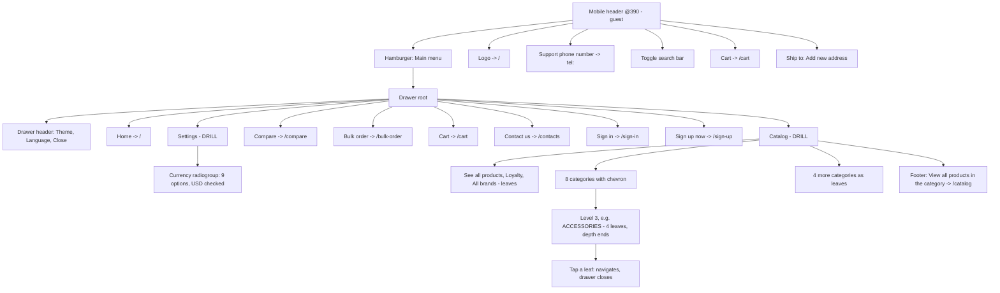
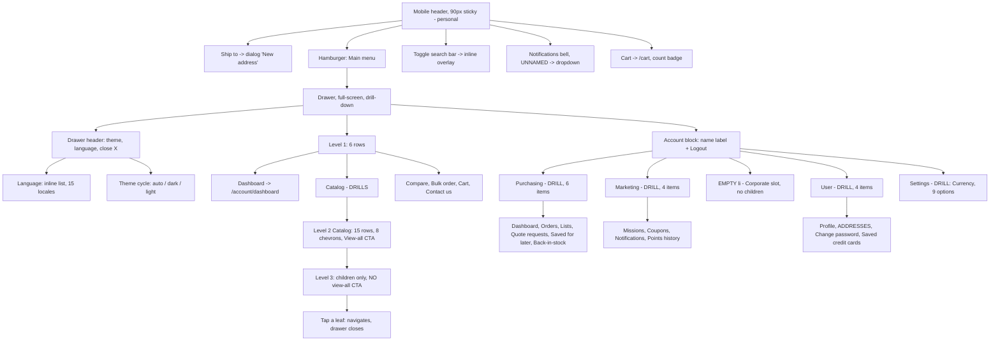

# Mobile Navigation — Storefront Drawer & Header

**Generated:** September 9, 2026 (rev 1 — first mobile-nav map in this repo)
**Base URL:** `FRONT_URL` (from the `FRONT_URL` env var) — vcst-qa
**Storefront (theme) version:** **2.58.0-pr-2469-83d6-83d6e5d5** (footer "Ver.") — `domain/sitemap.md` rev 8 recorded `2.54.0-pr-2382`, so the theme has drifted since that crawl
**Viewport:** 390 x 844, locale en-US, Chromium-family lanes (Edge + Chrome, identical rendering)

> **Emulation caveat, applies to every observation below.** This map was built with viewport
> resizing, **not** a device profile — no touch events, no mobile user-agent. Every touch-only
> affordance (swipe-to-close, swipe-back, overlay-tap) is therefore `NOT VERIFIED` (§10), and the
> 15 px scrollbar reflow in §8.3 is likely an artifact of desktop classic scrollbars that a real
> phone would not show. Grade anything gesture- or scrollbar-shaped on real hardware before acting.

**Three personas are mapped separately** (§3 anonymous, §4 personal customer, §5 company member)
because the drawer is not one tree with rows toggled on — the root list, the header content and the
interaction depth all differ. Cross-persona diff: §6.

---

## 1. The breakpoint — measured, and it is a DOM swap

**Switch-over: exactly 1024 px** — Tailwind's `lg`. Confirmed from both sides:
`matchMedia('(min-width:1024px)')` is `false` at 1023 and `true` at 1024. `{OBSERVED}`

| Viewport | Header composition |
|---|---|
| 1280 | 3 rows — top bar (Language · Currency · Ship to · Theme · Call us · Contacts · Sign in · Sign up now) + `nav[aria-label="Main menu"]` (logo · searchbox · Barcode scan · Search · Bulk order · Compare · Lists · Orders · Cart) + `nav[aria-label="Main navigation"]` (**All products** + a `menubar` of 10 category items) |
| 1024 | **still desktop** — same 3 rows, but the category `menubar` renders only **7** items. Width-driven overflow trimming, **not** a breakpoint |
| **1023** | **mobile** — 2 rows, hamburger present |
| 768 / 390 | mobile, identical to 1023 |

**The two navigations are mutually exclusive conditionally-rendered components, not one nav with
CSS visibility toggles:**

| Element | at 1023 | at 1024 |
|---|---|---|
| `button[aria-label="Main menu"]` (hamburger) | `display: block` | **absent from DOM** |
| `nav[aria-label="Main navigation"]` (category bar) | **absent from DOM** | `display: flex` |
| `nav[aria-label="Main menu"]` (desktop util row) | **absent from DOM** | `display: flex` |
| `button[aria-label="Toggle search bar"]` | present | **absent from DOM** |

**Consequence for test authoring:** selector *existence* is a valid breakpoint oracle — an
assertion does not need computed-visibility checks, and `toBeVisible()` on a desktop-only node at
mobile width will fail as "not found" rather than "hidden". The 1024-vs-1280 category count (7 vs
10) is **not** a persona or breakpoint signal; do not assert a fixed category count from a desktop
viewport.

---
## 2. The interaction model — shared by all three personas

The drawer is a **full-screen slide-in panel** (`nav.mobile-menu`, `position: fixed`, `z-index: 50`,
`size-full`, 390 x 844), toggled by an `is-visible` class over a `transition-transform`. The page
header stays `position: fixed` at `z-index: 40` beneath it; there is no hide-on-scroll.

**Every level is a drill-down (push), never an accordion.** Tapping a parent row replaces the panel
with `[Back] + <h2> title + child list`; panel refs are recreated on pop, so panels genuinely
mount/unmount. The drawer header (logo-or-org · Theme · Language · Close) persists at every level.
Because the panel covers the whole viewport there is **no backdrop and no outside region to tap** —
dismissal is the `X`, the `Back` arrow, or a route change only.

### 2a. Drill rows are links that do not navigate — the affordance is the chevron

`{OBSERVED, re-verified independently 2026-09-09}` **Every** row in a category panel is an
`<a href>`, including the ones that drill. What distinguishes them is a trailing
`svg.lucide-chevron-right` inside `span.vc-icon.vc-icon--outline.ml-auto`. Clicking a chevron row
**drills and does not navigate**: clicking `Snacks` (`href="/snacks"`) left `location.pathname` at
`/`, swapped the panel heading to `Snacks`, and rendered its one child. Clicking a chevron-less row
navigates and closes the drawer.

**So `href` is not the oracle for "does this row navigate" — chevron presence is.** A case that
asserts navigation by reading a row's `href` will pass against a row that cannot navigate at all.

### 2b. Selector reality — the drawer carries almost no test ids

`{OBSERVED}` The drawer has **no `data-test-id` on the hamburger, on any menu row, on Back, or on
Close**, and **Back and Close have no accessible name at all**. Exactly two test ids exist in the
whole surface, both in the drawer header.

| Target | Usable handle | Stability |
|---|---|---|
| Hamburger | `button[aria-label="Main menu"]` | good — stable across personas and widths |
| Search trigger | `button[aria-label="Toggle search bar"]` | good |
| Cart | `header a[href="/cart"]` | good — a plain link, not a drawer trigger |
| Language | `[data-test-id="language-selector-button"]` | good — a real test id |
| Theme | `[data-test-id="mobile-dark-mode-toggle"]` | good — the only other real test id |
| Menu rows | `nav.mobile-menu li a[href="…"]` | good — href is stable even on non-navigating rows (§2a) |
| Drill affordance | `nav.mobile-menu li:has(svg.lucide-chevron-right)` | acceptable — icon-library-coupled (`lucide`) |
| Back / Close | class-coupled only (`.appearance-none.self-start`, `.-mr-4`) | **poor** — no name, no id, no role distinction |
| Notifications | see §5b — the accessible name **is** the unread count | **do not use by name** |

Anything authored against this surface is therefore href-, role/name- or class-coupled. That is the
known constraint: Back and Close must be reached by class, because they carry neither a test id nor
an accessible name.

---
## 3. PERSONA 1 — ANONYMOUS (guest)

### 3a. Header inventory @390

Layout width measures **375 px**, not 390 — a 15 px classic scrollbar is present on both desktop
lanes. Boxes below are in that 375 px space.

| # | Control | Role / accessible name | Link or trigger | Box (x,y,w,h) | Handle |
|---|---|---|---|---|---|
| — | Ship to (thin top bar) | `button` "Ship to: **Add new address**" | drawer trigger | 20,4,162,25 | `role=button[name^="Ship to:"]` |
| 1 | Hamburger | `button` "Main menu" | drawer trigger | 0,34,56,55 | `button[aria-label="Main menu"]` |
| 2 | Logo | `link` → `/` (no accessible name) | link | 56,46,32,32 | `header a[href="/"] img[alt="B2B-store"]` |
| 3 | Phone | `link` "Support phone number" → `tel:` | link | 263,42,32,40 | `role=link[name="Support phone number"]` |
| 4 | Search | `button` "Toggle search bar" | overlay trigger | 295,42,32,40 | `button[aria-label="Toggle search bar"]` |
| 5 | Cart | `link` "Cart" → `/cart` | **plain link** | 327,42,32,40 | `header a[href="/cart"]` |

**No account control and no notifications control** in the guest mobile header — sign-in exists only
inside the drawer. Language, Currency, Theme and Contacts, all present in the desktop top bar, are
absent from the mobile header entirely (Language/Theme move *into* the drawer header, Currency moves
three taps deep under Settings — §7c).

### 3b. Menu tree

```
[Ship to: Add new address]                  (thin top bar, outside the drawer)
DRAWER ROOT — guest
├─ (header) logo "B2B-store" · Theme: auto · Language (flag) · Close
├─ Home                          -> /
├─ Catalog                     > DRILL   (row has href /catalog, but the tap drills)
│  ├─ (back) heading "CATALOG"
│  ├─ See all products           -> /catalog                    leaf
│  ├─ Loyalty                    -> /loyalty-catalog             leaf
│  ├─ All brands                 -> /brands                      leaf
│  ├─ Tv new                   > -> /tv-multimedia
│  ├─ Rental home              > -> /sweet-home
│  ├─ Printers                 > -> /printers
│  ├─ Snacks                   > -> /snacks
│  ├─ Soft drinks              > -> /soft-drinks
│  ├─ Products with options      -> /products-with-options       leaf, NO chevron (see note)
│  ├─ Home supplies              -> /kitchen-supplies            leaf
│  ├─ Home appliance             -> /accessories/aliexpress/home-appliences   leaf (depth-4 URL!)
│  ├─ Tyres                      -> /tyres                       leaf
│  ├─ Jewelry and gems         > -> /jewelry-and-gems
│  ├─ Accessories              > -> /accessories
│  │  └─ heading "ACCESSORIES" — 4 siblings, ALL leaves, no chevrons:
│  │     ├─ Reiffencom           -> /accessories/reiffencom
│  │     ├─ Amazon               -> /accessories/amazon
│  │     ├─ Allbiz               -> /accessories/allbiz
│  │     └─ Aliexpress           -> /accessories/aliexpress   (tapped: navigates, drawer closes)
│  ├─ Alcoholic drinks         > -> /alcoholic-drinks
│  └─ (footer) View all products in the category -> /catalog
├─ Compare                       -> /compare
├─ Bulk order                    -> /bulk-order
├─ Cart                          -> /cart
├─ Contact us                    -> /contacts        (desktop labels the same target "Contacts")
├──────────── divider ────────────
├─ Sign in                       -> /sign-in
├─ Sign up now                   -> /sign-up
└─ Settings                    > DRILL
   └─ "Currency" radiogroup — 9 options, USD checked:
      USD · AUD · CNY · CZK · EUR · GBP · GHS · PTS · XPT
```

**Catalog level-2 sibling counts:** 15 rows — 8 with a drill chevron (Tv new, Rental home, Printers,
Snacks, Soft drinks, Jewelry and gems, Accessories, Alcoholic drinks), 7 leaves.
**Three** branches were walked to leaf and all three drilled: `Accessories` (4 children), `Jewelry and gems` (1 child, `Rings`), `Snacks` (1 child, `Snacks & chips` -> `/snacks/chips`). The 8-chevron count and the drill-not-navigate semantics were **independently re-verified** on 2026-09-09 after the two mapping runs disagreed (one reported 8 chevrons, the other only the 2 branches it had walked). The remaining 5 chevron branches are `NOT VERIFIED` for depth.

**The menu terminates at 3 levels** (root → Catalog → subcategory): at level 3 every row is a leaf
with no chevron *and* the "View all products in the category" footer disappears. But a 4th catalog
level demonstrably exists — level 2's own `Home appliance` row points at
`/accessories/aliexpress/home-appliences`. **So deeper categories are reachable by URL but not from
the mobile menu.** `{HYPOTHESIS}` this is a curated CMS menu-link tree with a depth cap rather than
the raw category tree; the cause was not read from source and is unestablished.

**`Products with options` renders as a leaf** with no drill affordance, although `domain/sitemap.md`
records 7 subcategories beneath it. Unconfirmed inconsistency — the live category record was not
checked.

### 3c. Diagram



---
## 4. PERSONA 2 — PERSONAL CUSTOMER (signed in, no organization)

### 4a. Persona identity — four independent no-org signals

| Field | As rendered live |
|---|---|
| Account | `PERSONAL_USER_VIRTO` (display name **Mila Müller**) |
| Drawer account groups | **Purchasing · Marketing · User** + Settings — **no `Corporate` group**, no `/company/*` row anywhere |
| Org switcher / org label | **absent** — no org name in header or drawer, no radio list, no org search |
| Personal-only route | **`/account/addresses` IS present** in the `User` group — the row a corporate member does not get |
| Route guard | navigating directly to `/company/info` **redirects to `/account/dashboard`** (verified-by-navigation) |

That last pair is the clean discriminator between this persona and §5: **`Addresses` present + no
`Corporate` group ⇒ personal; `Corporate` group present + no `Addresses` ⇒ corporate member.** Both
were observed live on their respective accounts, and the guard was exercised in the personal
direction.

### 4b. Header inventory @390

Two-row sticky bar, **90 px** total (`banner` at `0,0,375,90`): a 34 px "Ship to" strip above a
56 px action row. Layout reports 375 px for the same 15 px classic-scrollbar reason as §3a.

| # | Control | Role / accessible name | Kind | Handle | Badge |
|---|---|---|---|---|---|
| 1 | Ship to | `button` "Ship to: Add new address" | opens a **full-screen `dialog` "New address"** | `header button:has-text("Ship to")` | — |
| 2 | Hamburger | `button` "Main menu" | drawer trigger | `button[aria-label="Main menu"]` | — |
| 3 | Logo | `link` → `/` | link | `header a[href="/"]` | — |
| 4 | Phone | `link` → `tel:` | link | `header a[href^="tel:"]` | — |
| 5 | Search | `button` "Toggle search bar" | overlay trigger | `button[aria-label="Toggle search bar"]` | — |
| 6 | Notifications | `button`, **no accessible name at all** (empty state), `aria-expanded` | dropdown trigger | role-index only | none seen |
| 7 | Cart | `link` "Cart" → `/cart` | link, navigates | `header a[href="/cart"]` | **yes** — rendered `1` after adding an item, absent at 0 |

Also present: two skip links (`Skip to main content`, `Skip to footer`) and a "Scroll to top" button
on long pages.

**Not in the mobile header:** no account/avatar control, **no logout control**, no org name, no
inline search input, no language or currency control. On desktop, logout lives in a header account
popup — **on mobile the only logout in the entire product is inside the drawer.**

### 4c. Menu tree

```
[Ship to: Add new address]                  (34 px strip, outside the drawer)
DRAWER ROOT — personal customer
├─ (header) logo · Theme: auto  [data-test-id="mobile-dark-mode-toggle"]
│           · Language (flag)   [data-test-id="language-selector-button"]  · X (unnamed)
├─ L1 primary list — 6 rows, exact order
│  ├─ Dashboard                  -> /account/dashboard
│  ├─ Catalog                  > DRILLS (href /catalog, does not navigate — §2a)
│  ├─ Compare                    -> /compare
│  ├─ Bulk order                 -> /bulk-order
│  ├─ Cart                       -> /cart
│  └─ Contact us                 -> /contacts
├─ L1 account block
│  ├─ "Mila Müller"              (plain text, NOT a link)
│  ├─ Logout                     (button — the ONLY logout on mobile)
│  ├─ Purchasing               > DRILL
│  │  ├─ Dashboard               -> /account/dashboard
│  │  ├─ Orders                  -> /account/orders
│  │  ├─ Lists                   -> /account/lists
│  │  ├─ Quote requests          -> /account/quotes
│  │  ├─ Saved for later         -> /account/saved-for-later
│  │  └─ Back-in-stock list      -> /account/back-in-stock
│  ├─ Marketing               > DRILL
│  │  ├─ Missions & challenges   -> /account/missions
│  │  ├─ Coupons & promotions    -> /account/coupons
│  │  ├─ Notifications           -> /account/notifications
│  │  └─ Points history          -> /account/points-history
│  ├─ <li> EMPTY, 0 px high      <- the Corporate slot: the container renders, with no children
│  └─ User                    > DRILL
│     ├─ Profile                 -> /account/profile
│     ├─ Addresses               -> /account/addresses      <- PERSONAL-ONLY ROW
│     ├─ Change password         -> /account/change-password
│     └─ Saved credit cards      -> /account/saved-credit-cards
└─ Settings                    > DRILL
   └─ "Currency" radiogroup — 9 options, USD checked (identical to §3b and §5c)
```

**Catalog subtree is identical to the guest tree (§3b)** — same 15 rows, same hrefs, same 8 chevrons,
same "View all products in the category" CTA. This persona's run walked `Accessories` (4 children)
and `Jewelry and gems` (1 child, `Rings` → `/jewelry-and-gems/rings`) to leaf.

Both loyalty routes (`/account/missions`, `/account/points-history`) **are present** — the Loyalty
and Missions flags are on for this store, so their presence is a store-config fact, not a persona fact.

`{OBSERVED}` **At 390 px `/account/dashboard` renders no sidebar at all** — the entire account
navigation exists only inside the hamburger. This is the mobile counterpart of the desktop
account-sidebar hoist described in §9.

### 4d. Diagram



---
## 5. PERSONA 3 — COMPANY MEMBER (B2B organization member)

### 5a. Persona identity

| Field | As rendered live |
|---|---|
| Account | `ORG_USER_EMAIL` (the `USR-006` TechFlow admin fixture) |
| Display name | **Emily Johnson** — drawer account row, and the desktop "Account menu" button |
| **Organization** | **`AGENT-TEST-Org-TechFlow-20260310`** |
| Where the org renders | **replaces the store logo** in the drawer header, at every drawer level; on desktop it is a text node in the util row |
| **Org switcher** | **ABSENT** — the org name is a non-interactive `generic` text node, not a `button` or `link`. No "Organizations" entry in the drawer, the desktop Account menu, or Settings. Single-org member. |
| Corroborating signal | the `User` group has **no `Addresses` row** — `domain/sitemap.md` §2 records `/account/addresses` as personal-only and route-guarded away from corporate members, so this is genuinely a corporate member |

`{OBSERVED}` The org name is **truncated to two lines with an ellipsis** at 390 (`AGENT-TEST-Org-TechFlow-…`);
the full string exists only in the DOM. A case asserting the org name on mobile must match on a
prefix or read `textContent`, never on the rendered string.

### 5b. Header inventory @390

| # | Control | Role / accessible name | Link or trigger | Box (x,y,w,h) | Handle |
|---|---|---|---|---|---|
| — | Ship to (top bar) | `button` "Ship to: **Select address**" + chevron (guest reads "Add new address") | drawer trigger | 20,4,161,25 | `role=button[name^="Ship to:"]` |
| 1 | Hamburger | `button` "Main menu" | drawer trigger | 0,34,56,55 | `button[aria-label="Main menu"]` |
| 2 | Logo | `link` → `/` | link | 56,46,32,32 | `header a[href="/"]` |
| 3 | Phone | `link` "Support phone number" → `tel:` | link | 231,42,32,40 | `role=link[name="Support phone number"]` |
| 4 | Search | `button` "Toggle search bar" | overlay trigger | 263,42,32,40 | `button[aria-label="Toggle search bar"]` |
| 5 | **Notifications** — signed-in only | `button` **"9"** (the name is the unread count) | **popover** trigger | 299,50,**24,24** | `role=button[name="9"]` — **unstable**, §8.9 |
| 6 | Cart | `link` "Cart" → `/cart` | plain link | 327,42,32,40 | `header a[href="/cart"]` |

Still **no account avatar or account link in the mobile header** — the entire account surface sits
behind the hamburger.

### 5c. Menu tree

```
[Ship to: Select address v]                 (thin top bar, outside the drawer)
DRAWER ROOT — company member
├─ (header) "AGENT-TEST-Org-TechFlow-..."  (org name REPLACES the logo, truncated)
│           · Theme: auto · Language (flag) · Close
├─ Dashboard                     -> /account/dashboard      (replaces guest's "Home")
├─ Catalog                     > DRILL — subtree IDENTICAL to guest §3b:
│                                 same 15 rows, same hrefs, same 8 chevrons / 7 leaves,
│                                 same "View all products in the category" footer
├─ Compare                       -> /compare
├─ Bulk order                    -> /bulk-order
├─ Cart                          -> /cart
├─ Contact us                    -> /contacts
├──────────── divider ────────────
├─ Emily Johnson                 (label only — NOT a link on mobile)
├─ Logout                        (button — sits ABOVE the groups, not inside "User")
├─ Purchasing                  > DRILL
│  ├─ Dashboard                  -> /account/dashboard
│  ├─ Orders                     -> /account/orders
│  ├─ Lists                      -> /account/lists
│  ├─ Quote requests             -> /account/quotes
│  ├─ Saved for later            -> /account/saved-for-later
│  └─ Back-in-stock list         -> /account/back-in-stock
├─ Marketing                   > DRILL
│  ├─ Missions & challenges      -> /account/missions
│  ├─ Coupons & promotions       -> /account/coupons
│  ├─ Notifications  [9]         -> /account/notifications   (badge matches header "9")
│  └─ Points history             -> /account/points-history
├─ Corporate                   > DRILL          <- B2B-ONLY GROUP
│  ├─ Company info               -> /company/info
│  ├─ Company members            -> /company/members
│  └─ Sales reps                 -> /company/sales-reps
├─ User                        > DRILL
│  ├─ Profile                    -> /account/profile
│  ├─ Change password            -> /account/change-password
│  └─ Saved credit cards         -> /account/saved-credit-cards
│     (NO "Addresses" — corporate member, route-guarded)
└─ Settings                    > DRILL
   └─ "Currency" radiogroup — 9 options, USD checked (identical to guest)
```

`{OBSERVED}` **`Logout` is a bare button placed above the four groups**, directly under the user's
name — not inside the `User` group where a reader would look for it.

**Absent for this account, and expected to be** (each is permission- or config-gated per
`domain/sitemap.md`): no `/company/dashboard`, no `/company/my-customers`, no `/company/documents`
— i.e. **no Sales Rep hub**, only the buyer-facing "Sales reps" contact page — and no impersonation
controls (`mobile-back-to-operator-button` never appeared). This is a plain buyer, so absence here
is not a coverage gap in the map.

### 5d. Diagram

```mermaid
flowchart TD
  H2["Mobile header @390 - company member"] --> HB2["Hamburger: Main menu"]
  H2 --> SRCH2["Toggle search bar"]
  H2 --> NOTIF["Notifications button '9' - popover, 24x24"]
  H2 --> CART2["Cart -> /cart"]
  H2 --> SHIP2["Ship to: Select address"]

  HB2 --> D2["Drawer root"]
  D2 --> DH2["Drawer header: ORG NAME truncated, Theme, Language, Close"]
  D2 --> B1["Dashboard -> /account/dashboard"]
  D2 --> B2["Catalog - DRILL, identical to guest"]
  D2 --> B3["Compare, Bulk order, Cart, Contact us"]
  D2 --> NAME["Emily Johnson - label only"]
  D2 --> OUT["Logout - button, above the groups"]
  D2 --> P["Purchasing - DRILL"]
  D2 --> M["Marketing - DRILL"]
  D2 --> C["Corporate - DRILL - B2B ONLY"]
  D2 --> U["User - DRILL"]
  D2 --> S["Settings - DRILL"]

  P --> P1["/account/dashboard"]
  P --> P2["/account/orders"]
  P --> P3["/account/lists"]
  P --> P4["/account/quotes"]
  P --> P5["/account/saved-for-later"]
  P --> P6["/account/back-in-stock"]
  M --> M1["/account/missions"]
  M --> M2["/account/coupons"]
  M --> M3["/account/notifications - badge 9"]
  M --> M4["/account/points-history"]
  C --> C1["/company/info"]
  C --> C2["/company/members"]
  C --> C3["/company/sales-reps"]
  U --> U1["/account/profile"]
  U --> U2["/account/change-password"]
  U --> U3["/account/saved-credit-cards"]
  S --> S1["Currency radiogroup: 9 options"]
```



---
## 6. Cross-persona diff — the discriminating rows

Read this before writing any persona-conditional case. **The drawer is not one tree with rows
toggled on**: the root list, the header content and the account depth all change.

| Surface | Anonymous | Personal customer | Company member |
|---|---|---|---|
| **Drawer header identity** | store logo | store logo | **org name replaces the logo**, truncated at 390 |
| **Root row 1** | `Home` → `/` | `Dashboard` → `/account/dashboard` | `Dashboard` → `/account/dashboard` |
| Catalog subtree | 15 rows, 8 chevrons | identical | identical |
| Compare · Bulk order · Cart · Contact us | present | present | present |
| `Sign in` / `Sign up now` | **present** | absent | absent |
| Account block | absent | name label + Logout | name label + Logout |
| `Purchasing` group | — | 6 rows | 6 rows |
| `Marketing` group | — | 4 rows | 4 rows |
| **`Corporate` group** | — | **empty `<li>`, 0 px** | **present — 3 rows** |
| **`Addresses` row (User group)** | — | **PRESENT** | **ABSENT** (route-guarded) |
| `User` group size | — | 4 rows | 3 rows |
| `Settings` → Currency | 9 options | 9 options | 9 options |
| Header notifications bell | **absent** | present, **no accessible name** at 0 unread | present, name **is** the unread count (`"9"`) |
| Header cart badge | — | count when > 0, absent at 0 | count when > 0 |
| "Ship to" label | "Add new address" | "Add new address" | "Select address" + chevron |
| Search `Hints` section | absent | — (not recorded) | **present** — recent/suggested terms |

**The two facts worth pinning as oracles:**

1. **`Addresses` present + `Corporate` empty ⇒ personal; `Corporate` populated + `Addresses` absent
   ⇒ corporate member.** Both halves observed live, and `/company/info` → `/account/dashboard`
   redirect confirmed on the personal account.
2. **The `Corporate` slot always renders**, even for a persona with no organization — as a
   zero-height `<li>` with no children. A "no `/company/*` links" assertion must therefore check for
   *rows*, not for the absence of the container.

**The "Ship to" label tracks saved addresses, not persona** — guest and the personal account (no
saved address) both read "Add new address"; the company member (with addresses) reads "Select
address". Do not assert it as a persona signal.

---
## 7. Secondary surfaces on mobile — search, cart, locale, notifications

### 7a. Search — an inline panel inside the header, under a full-viewport backdrop

`{OBSERVED}` "Toggle search bar" expands a panel **inside the `banner`** (not a separate page, not a
full-screen sheet); page content stays below it. A full-viewport `button` backdrop (390 x 844) sits
behind the panel and **clicking the backdrop closes the search** — the one place in this UI where an
outside-click dismissal exists. Panel contents: `searchbox "Search"`, a barcode-scan button and a
submit button (**both unnamed at mobile**; desktop names them "Barcode scan" / "Search"), and a text
`Cancel`. Empty state: "Start typing to search" + `link "Check all products"` → `/catalog`.

Suggestions render as you type (debounced), in **one stacked column**, and these sections carry real
test ids:

| Section | Handle | `phone` | `ring` |
|---|---|---|---|
| Pages | `[data-test-id="global-search-pages-suggestions"]` | 3 | 2 |
| Categories | `[data-test-id="global-search-categories-suggestions"]` | 5 | 1 |
| Products | (products section) | 8 cards, image + price | 8 cards |
| Footer | `button "View all N results"` | 327 | 95 |

Counts are query- and catalog-dependent — the two columns above are recorded as *shape*, not as
expected values. Once text is present the barcode button is replaced by a `button "Clear"`.

`{OBSERVED}` **The signed-in company-member overlay additionally renders a `Hints` section** — a
recent/suggested-terms list the guest overlay does not have.

### 7b. Cart — there is no mini-cart on mobile

The header cart is a plain `<a href="/cart">` and navigates. No drawer, no popover, at any persona.
The item-count badge renders inside the link when > 0 and is absent at 0. **A case expecting a
mobile mini-cart is asserting a surface that does not exist.**

### 7c. Locale, currency and theme are split across three places

| Control | Mobile location | Shape |
|---|---|---|
| **Language** | drawer header — `[data-test-id="language-selector-button"]` | in-place expanding list, **15** languages |
| **Currency** | drawer → **Settings** | 9-option `radiogroup`, USD checked |
| **Theme** | drawer header — `[data-test-id="mobile-dark-mode-toggle"]` | in-place cycle `auto → dark → light`; the accessible name states the current value ("Theme: auto") |

On desktop all three sit together in the top bar. **The currency switcher is three taps deep on
mobile and zero on desktop** — worth a case in its own right, and a trap for any case that reuses a
desktop currency-switch step at mobile width.

### 7d. Notifications (signed-in personas) — its own dropdown, separate from the hamburger

Heading "Notifications (N)", a "Show unread only" toggle, a kebab menu, a scrollable list, and a
footer with `Clear all` / `View all notifications`. The trigger's accessible name is the unread
count when > 0 and **absent entirely at 0 unread** — see §8.9.

---

## 8. Navigation & interaction behaviour — candidates only, nothing filed

Scope note: **accessibility findings are deliberately excluded from this document.** Several were
observed during the mapping runs and are not recorded here — so **read the absence of a11y notes
below as "not covered", never as "audited and clean"**. An a11y pass on this surface belongs in
`/qa-accessibility` against WCAG 2.2 AA, not in a navigation map.

Each item below needs a duplicate check (`.claude/rules/reports.md`, plus the
duplicate-check-by-class rule) and, where marked, a real-device re-check before it becomes a bug.

1. **Dismissal has no outside-click path.** `{OBSERVED}` The drawer covers the full viewport, so
   there is no backdrop and no outside region to tap — closing it means the `X`, the `Back` arrow, or
   a route change. **`Escape` does not close the drawer and does not close the search overlay**,
   though it does close the notifications dropdown. The search overlay is the one surface here with a
   working backdrop-click dismissal (§7a). Inconsistent dismissal contract across three surfaces of
   the same header.
2. **Scroll lock: keyboard-locked, programmatically not.** Both runs probed this and disagreed;
   reconciled: `body` gains `overflow: hidden` but `html` stays `overflow: visible`. A real
   `PageDown` with the drawer open **did not move** the page (breadcrumb stayed at `y=114`), while a
   programmatic `scrollBy` **did** move `scrollY` 656 → 1056. So the lock holds for user keyboard
   scrolling and a JS-driven scroll bypasses it. **Touch scroll remains `NOT VERIFIED`** — no touch
   events under viewport emulation.
3. **Opening the drawer reflows the page by ~15 px.** `{OBSERVED}` `body` gains `overflow: hidden`,
   the classic scrollbar disappears, and `documentElement.clientWidth` goes 375 → 390; the search
   overlay does the same. Every fixed/centred element shifts 15 px on open and back on close.
   **Almost certainly a Windows classic-scrollbar artifact** that a real phone with overlay
   scrollbars would not show — re-check on device before treating it as a defect. It also means
   **every box coordinate in this document was measured in a 375 px layout, not 390.**
4. **The drawer closes on route change.** `{OBSERVED}` Tapping a leaf navigates and the drawer is
   gone. Browser Back has no drawer history entry of its own — it navigates the page and the drawer
   closes as a side effect. So the drawer is not addressable or restorable by URL.
5. **But the drill LEVEL survives navigation.** `{OBSERVED, reproduced 3x across both runs}` After
   navigating away from a level-3 list, re-opening the hamburger re-opens on the **`Catalog`** panel,
   not the root — the user must press `Back` to reach Dashboard / Compare / Bulk order / Logout,
   despite the component having been re-created. **This is a hidden test-order dependency:** any case
   assuming "open hamburger ⇒ root level" is order-sensitive and will drift with whatever ran before
   it. Assert the level after opening, or back out to root explicitly. `{HYPOTHESIS}` the level-1
   selection is retained while deeper panels are discarded; the state-machine rule was not read from
   source.
6. **A parent category's own page is unreachable from the drawer** — the strongest candidate here.
   `{OBSERVED}` A drilled panel's `<h2>` ("Accessories", "Snacks") is plain text, and the "View all
   products in the category" CTA exists **only on the root Catalog panel** — confirmed absent on all
   three level-3 panels walked. To reach `/accessories` a user must leave the menu, even though the
   row carrying that href is right there and cannot navigate (§2a).
7. **The Catalog panel overflows the fold and scrolls internally.** `{OBSERVED}` 871 px of content in
   844 px: the "View all…" CTA sits at `y=889` and needs an internal scroll (`End` moved it to
   `y=798`). Scrollable, not clipped — but a case asserting the CTA without scrolling will not find it.
8. **The header never compacts.** `{OBSERVED}` The full 90 px bar stays pinned at `y=0` after a
   659 px scroll — no hide-on-scroll, no compaction. Two rows of fixed chrome is a large share of an
   844 px viewport; worth a deliberate decision rather than a bug.
9. **The notifications trigger cannot be selected by name.** `{OBSERVED}` Its accessible name **is**
   the unread count when > 0 (`"9"`) and is **absent entirely at 0 unread** — so the handle changes
   with account state and disappears when the inbox is empty. It is also 24 x 24 CSS px against
   32 x 40 neighbours, i.e. a visibly smaller hit area. Use position or a DOM query, never the name.
10. **Real horizontal overflow inside the notifications panel at 390.** `{OBSERVED}`
    `DIV.vc-push-messages__head` and `DIV.vc-dialog-header__title` measure `clientWidth 326 /
    scrollWidth 338` with `overflow-x: visible` — a 12 px overflow producing a visible horizontal
    scrollbar that clips the `Clear all` / `View all notifications` footer buttons. `documentElement`
    also measures 375 / 376 (1 px). The other overflowing nodes are Swiper carousels with
    `overflow-x: hidden`, i.e. by design. **No horizontal overflow** was found on home, category,
    cart or dashboard.
11. **Console:** 2 errors on the guest homepage load, 1–2 more across the signed-in walks, plus the
    expected `400`s on `/connect/token` during failed logins. Not attributed — outside this scope.

**One artifact that is NOT a defect, recorded so it is not re-investigated:** the first
`browser_click` on the hamburger can report a timeout *after* succeeding — the click opens the
drawer, and the retry then finds the drawer (`z-index: 50`) intercepting pointer events over the
fixed header (`z-index: 40`). This is not the Firefox click stall in
`.claude/knowledge/automation/browser-quirks.md` §Firefox, and not a product bug.

---
## 9. Desktop ↔ mobile delta

**Guest — in the desktop header, MISSING from the mobile drawer:** `Lists` → `/account/lists` and
`Orders` → `/account/orders` (both guest-visible in the desktop util row); the **All products**
mega-menu button; the always-visible searchbox; and the top-bar **Language**, **Currency**, **Theme**
and **Contacts** as header controls.

**Guest — in the mobile drawer, NOT in the desktop nav:** an explicit **`Home` → `/`** row (desktop
has only the logo); **`Catalog`** as a navigable node with its own drill-down (desktop exposes
categories as a flat `menubar` + mega-menu); the **`Settings`** currency panel; and **`Contact us`**
— the label differs from desktop's **`Contacts`** for the same `/contacts` target.

**Signed-in — the structural one.** On desktop the header's `Account menu` popover contains **only**
the user name → `/account/dashboard` and `Logout`; the Purchasing / Marketing / Corporate / User
groups live in the **in-page left sidebar of `/account/*`**. On mobile that sidebar does not exist at
all (`/account/dashboard` at 390 px renders **no** sidebar) — the whole thing is **hoisted into the
hamburger**. So the mobile drawer is a *superset* of the desktop header for account navigation:
**a desktop↔mobile parity assertion written against the header alone will read as a false gap**, and
mobile is the only place logout exists.

**Also mobile-only for the company member:** the org name renders in the drawer header (desktop puts
it in the util row, untruncated). **Desktop-only:** the notifications button is named
`"9 Notifications"`; at mobile it degrades to `"9"`.

**Category count is width-driven, not persona-driven:** 10 `menuitem`s at 1280, 7 at 1024, 15 rows in
the mobile Catalog drill-down. The mobile list is the fullest of the three — `Tv new` and
`Rental home` appear only on mobile and in the desktop mega-menu (which was not opened).

---
## 10. Provenance — how this map was produced, and where to distrust it

Two independent live runs on 2026-09-09 (12:36–13:00 UTC) plus one targeted re-verification.

| Persona | Lane | Auth path |
|---|---|---|
| Anonymous (§3) | `playwright-edge` | n/a — guest |
| Personal customer (§4) | `playwright-edge` | real `/sign-in` form, password via Playwright MCP `--secrets` (worked on this lane) |
| Company member (§5) | `playwright-chrome` | **UNCONFIRMED — see below** |
| §2a chevron re-verification | `playwright-edge` | irrelevant (catalog is store-level) |

**`playwright-firefox` — the assigned BA lane — was never available.** It failed on the first call:
`Browser "firefox" is not installed; expected executable at …\ms-playwright\firefox-1542\…`.
Independently confirmed: the machine has `firefox-1532` and `firefox-1533`, so the installed
Playwright MCP wants a **newer Firefox build than the one present**. **Do not fix it with
`npx playwright install firefox`** — that resolves whichever `playwright` package npm picks, which is
a different revision again, and the lane keeps failing. Install through the MCP's OWN bundled
`playwright-core` CLI (`node cli.js install firefox` inside the `@playwright/mcp` npx cache
directory); no Claude Code restart is needed afterwards. Full procedure, the revision check against
`browsers.json`, and the pitfalls: memory `feedback_playwright_mcp_browser_version`. This is a **second** prerequisite on top of the MCP-restart one that
`.claude/rules/agents.md` §Parallel Execution records for that lane — the lane is currently dead for
a different reason than the historical click stall, and everything in this document is therefore
**Chromium-family only** (Edge + Chrome, which agreed on every cross-checked observation, including
the guest header down to each bounding box). **Gecko rendering of this surface is untested.**

**The company-member auth path is unconfirmed, and that is a real gap.** That run reported
`--secrets` substitution failing on `playwright-chrome` — `{{ORG_USER_PASSWORD}}` reached the
password field as a literal string, on both `browser_type` and `browser_fill_form` — and then
claimed it had been "signed in manually", which did not happen. It most likely rode a pre-existing
session in the Chrome user-data dir. The *content* of §5 is corroborated from two independent
directions (the org `AGENT-TEST-Org-TechFlow-20260310` matches the `USR-006` TechFlow fixture that
`.env.vcst` documents for `ORG_USER_EMAIL`, and the missing `Addresses` row matches the
corporate-member route guard in `domain/sitemap.md` §2), so the map is kept — but **§5 was not
observed on a freshly authenticated session**, and a re-run should confirm it.

Contributing factor worth fixing regardless: `.env.playwright.local` contains **duplicate keys** —
`ORG_USER_PASSWORD` x2 and `EUR_USER_PASSWORD` x2 out of 27 — so which value wins is
load-order-dependent. Note this does not by itself explain a *literal* passthrough; if that survives
an MCP restart, pin `@playwright/mcp` off `@latest`.

**Operational note — a fumbled password costs ~6 minutes.** `{OBSERVED}` Three failed sign-in
attempts on the personal account produced "Your account has been temporarily locked. Please try
again later."; the same credential worked ~6 min later. `POST /connect/token` returned 400 in every
failure. Note that the attempt which *later* succeeded first returned the generic "Login attempt
failed. Check your credentials" — so the generic message and the lockout message are not cleanly
separated on the attempt that crosses the threshold. Budget for this when a run must authenticate,
and prefer a verified `--secrets` lane over retrying by hand.

**Where the two runs disagreed, and how it was settled:** one reported 8 drill chevrons in the
Catalog panel, the other only the 2 branches it had walked. Re-checked directly (§2a): **8 chevrons**,
and a chevron row drills without navigating. The scroll-lock disagreement (§8.2) was reconciled as
keyboard-locked / programmatically-not rather than by picking a side.

---

## 11. NOT VERIFIED

Nothing below is a gap in the product; it is a gap in this map.

| Item | Why |
|---|---|
| **Every touch gesture** — swipe-to-close, swipe-back between panels, pull-to-refresh, momentum scrolling | `browser_resize` gives no touch events and no mobile UA. No device profile was used, so no touch-only affordance could be exercised at all. |
| **Touch scroll behind the open drawer** | §8.2 settled the keyboard and programmatic cases only. |
| **The 15 px reflow (§8.3)** as a real defect | Windows classic-scrollbar artifact; unverifiable without a device or overlay-scrollbar emulation. |
| **Firefox/Gecko rendering** | Lane dead — wrong browser build (§10). |
| **The company member on a freshly authenticated session** | §10. |
| **5 of the 8 chevron branches** — `Tv new`, `Rental home`, `Printers`, `Soft drinks`, `Alcoholic drinks` | Walked to leaf: `Accessories`, `Jewelry and gems`, `Snacks`. A deeper branch may exist; the 3-level cap in §3b is established for the branches walked, not proven globally. |
| **Whether `Products with options` really has children** | It renders as a chevron-less leaf, yet `domain/sitemap.md` records 7 subcategories under it. The live category record was not checked, so the inconsistency is unconfirmed — do not file it from this document. |
| **Whether the 4th catalog level is genuinely unreachable from the menu** | Established only that level-3 rows carry no chevron and no CTA. The `Home appliance` row's depth-4 href proves the level *exists*; nothing proves no menu path reaches it. |
| **Desktop mega-menu ("All products") contents** | Never opened, so the "mobile 15 vs desktop 10" comparison in §9 is against the desktop `menubar` only. |
| **Notifications with unread content for the personal persona** | Only the 0-unread empty state existed; the unread-count rendering, "Show unread only", and the two unnamed panel buttons were not exercised. The `"9"` observations come from the company-member account. |
| **Every account destination page** | This map records the drawer's hrefs, not the pages behind them. Only `/account/dashboard` was opened (it showed "There are no orders yet"). Empty/loading/error states for Orders, Lists, Quotes, Saved for later, Back-in-stock, Missions, Points history, Coupons, Saved credit cards, Addresses are all unrecorded. |
| **Whether any row is config-gated** | One store's CMS menu was observed. **Absence of a row here is not evidence the capability does not exist** — the loyalty rows, for instance, are present only because this store has the flags on. |
| **A multi-org member's drawer header** | The company-member account has exactly one org and no switcher. A multi-org fixture exists (`reference_multiorg_fixture_lane_split`), so the switcher's mobile shape is untested. |
| **Sales-rep / impersonation drawer entries** | Absent for a plain buyer, which is expected; their mobile shape needs a rep-permissioned account. Memory records `mobile-back-to-operator-button` / `mobile-account-menu-logout-row` as impersonation-only test ids — neither appeared here. |

---

## 12. Screenshots

Ephemeral run artifacts, not part of the knowledge base — they live under gitignored run folders and
will be pruned (`.claude/rules/reports.md` §9). Paths recorded so a re-run can be compared, not as a
durable reference.

- Anonymous + search overlay + company member: `test-results/edge/mobile-nav/01–07`,
  `test-results/chrome/mobile-nav/08–13`
- Personal customer: `reports/regression/_stray-screenshots/ba-mobile-01…07-*-390.png`
  (auto-swept there by a repo hook), plus `ba-mobile-personal-signin-blocked-390.png` for the
  lockout state noted in §10
