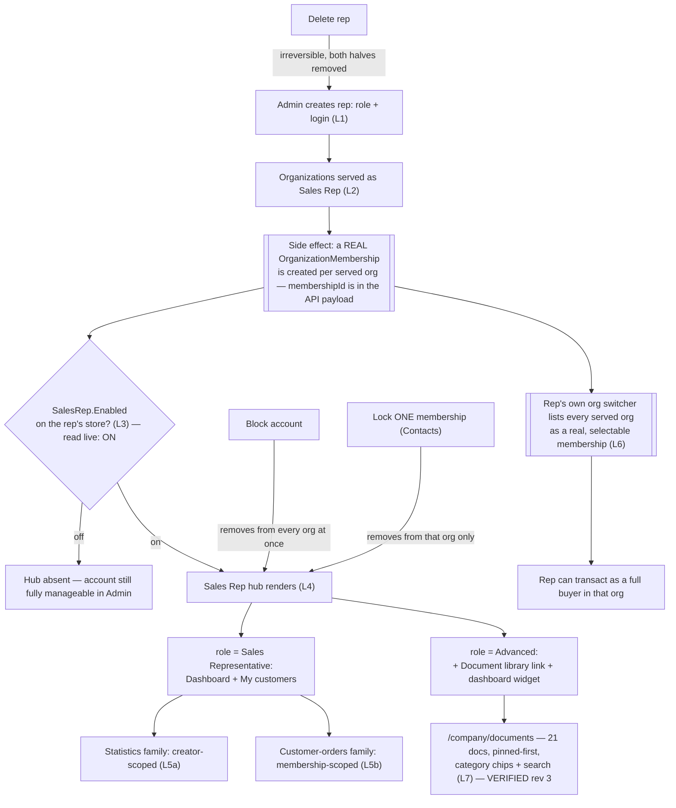

# Sales Rep — domain map

> Refresh with `/qa-domain-map sr`. This file answers **what the feature is and where its surfaces
> are**. It does **not** carry behavioural rules — those are `BL-SR-*` in `oracles/business-logic.md`
> (32 invariants, cited by id below, never restated) — and it can **never ground an assertion as
> `{DOC}`**. It is a pointer index plus a surface inventory: it tells you *where to look* and *what
> exists*, never *what correct looks like*.

**Every claim carries a verdict.** `CONFIRMED` = observed live or read at source this pass ·
`DRIFT` = prior art/docs say otherwise and are wrong · `MISSING` = documented, does not exist ·
`UNVERIFIED` = not established, and **not** to be treated as true.

**Read-only pass.** No create/edit/block/unblock/delete/lock/unlock/assign/upload/save/pin/unpin was
performed. Menus, column pickers and detail blades were OPENED; nothing inside them was actuated. Every
capability confirmable only by mutating is `UNVERIFIED` **with the mutation named**, in §2's "not
manageable from here" rows and in §8.

> **The rev-2 MID-CHANGE call-out is RESOLVED and retired (2026-09-18).** Rev 2 flagged that
> `VirtoCommerce.Customer` and `VirtoCommerce.ProfileExperienceApiModule` were deployed as **PR builds**,
> making D8 and D9 observations of an unmerged state. `GET /api/platform/modules` this pass returns
> `Customer 3.1025.0` and `ProfileExperienceApi 3.1018.0` — **both RELEASE builds**. The only non-release
> build on the environment is now `UCP 3.1006.0-pr-7-1881`, a different domain. **D8's and D9's b2b halves
> are now observations of a released state.** Nothing in §6 rests on an unmerged PR any more.

---

## §0 — Changed since rev 2 (2026-09-10/11 → 2026-09-18)

**This map does not name environments, and that is deliberate.** A hostname dates a claim the moment a
deployment moves, and it invites a reader to treat "it worked on *that* box" as the explanation when the
real variable is almost always a version. The two deployments are labelled by the only property that
distinguishes them:

| Label | The deployment running | Relevant state |
|---|---|---|
| **Env-A** — enumerated **2026-09-18** (this pass) | `SalesRep 3.1008.0`, `Customer 3.1025.0`, `ProfileExperienceApi 3.1018.0`, `XOrder 3.1011.0` — **all release** | Document library **healthy**; **21** documents, 1 pinned; **19** reps; Advanced-role **and** Documents-Manager fixtures now both present |
| **Env-B** — enumerated **2026-09-10 only; NOT revisited** | `SalesRep 3.1007.0`, every in-scope module release | Document library **hard-broken** (D13). **Every Env-B row below is a dated rev-2 observation, not a current one** |

Both ran `XOrder 3.1011.0` — which is precisely why **the SalesRep version, not the environment, is the
discriminator** in D13. **Unless a row names Env-B, it was established on Env-A.**

**Rev 2's claims contradicted out loud.** A refresh that silently drops a claim leaves anyone who cited
it with no signal:

| Rev 2 said | Rev 3 says |
|---|---|
| *"MID-CHANGE — re-read §6 after these PRs merge or revert"* (`Customer` + `ProfileExperienceApi` on PR builds) | **RESOLVED.** Both shipped as releases (`3.1025.0`, `3.1018.0`). Call-out retired; D8/D9 now describe a released state |
| §5a: *"`graphql-schema.md` documents only the main schema and does not cover this scope"* | **STALE.** That file was refreshed **2026-09-17** and now documents `salesRepDocuments`, `salesRepCustomerOrders`, `salesRepOrderSortRules`, `salesRepCustomerSortRules`, `salesRepDocumentCategories`, `salesRepDocument`, `salesRepLayout` (filed under its Cart/CMS/Orders sections). It is a usable second source for field NAMES — still not for arguments or auth posture |
| §7: *"Document library — **0** cases across all 9 suites — a hole"* | **CLOSED. 52 cases**, authored between 2026-09-10 and today: `050m` **26** (`SR-GQL-131`…`SR-GQL-156`), `092b` **9**, `093` **17**. The hole was real when measured and has been filled |
| §7: *"092 and 092b have zero Automated cases between them (40 cases, 0 automated)"* | **DRIFT.** `092b` now holds **12 Automated** of 43. `092` is still **0** of 18 — the claim survives for one suite, not two |
| §7 total: **405** cases | **480**, re-derived by `csv-parse` this pass |
| D12: *"`sales-rep-documents:write` grants no read on the storefront contract"* | **Refuted as a generalization.** On Env-A the two-role fixture `agent-test-sr-docs-writer@` carries `read` **and** `write` and gets `200`. The two observations are reconciled by `§10 A2`, not overwritten — see D12 |
| D10: no-`storeId` returns a superset (5 vs 4) | **Still present but narrower, and absent entirely for one caller.** `agent-test-sr-docs@`: 6 → 7 (delta 1). `agent-test-sr-primary@`: 1 → 1 (**delta 0**) — the delta only appears when a cross-store rep serves the caller's active org |
| D8: an ACME/B2B-store caller sees **4** reps | **6** — and the org must be named. `agent-test-sr-docs@`'s token resolves `organization_id` = **AcmeCorp**; the 4 of rev 2 plus the two new document fixtures, both seeded into AcmeCorp |
| §3b/§3d: `SR_REP_PRIMARY` serves **5** orgs, org switcher pre-selects **AcmeCorp** | **5 HOLDS** (Admin `organizationsCount` 5, sidebar badge 5, My-customers 5 rows, switcher 5 radios). What moved is the **active org**: PRIMARY's token now resolves **AcmeWest**, which is why `customerSalesReps` returns 1. `/company/sales-reps` in AcmeWest context returns exactly **1** row — the same number, independently |
| §2a: Documents library is *"the 7th dashboard tile"* | **DRIFT.** The seven entries are a **secondary navigation list** down the app's left rail, not tiles. The Dashboard pane itself is an empty-state card |
| §2b: the Category field's input shape is `UNVERIFIED` (free-text vs managed dictionary) | **Both.** The detail blade carries a clearable **Category** select over existing values **and** a separate free-text **New category** box, with the helper *"New category has priority over selection"* |
| §2c: two setting groups (General + Statistics), *"not browsed live"* | **Browsed live. Only `Sales Rep > General` exists at store level** — one toggle, `Sales Rep Enabled`, **on**. The four Statistics cache settings are absent from this surface (new **D15**) |
| §9: the b2b map is **rev 1**; its Sales-Rep pointers are at lines 69/213/415/502 and its menu inventory at line 78 | **All six wrong.** The b2b map is **rev 2 (2026-09-16)** and every line citation now lands on unrelated content. Re-anchored throughout to `§` anchors |

**Gap movement:** **G1 CLOSED** · **G2 CLOSED** · **G4 CLOSED** · **G5 CLOSED** · **G6 CLOSED** ·
**G10 CLOSED (and the answer is a finding)**. **G3 stays CLOSED**, **G7/G8/G9 stay OPEN**.
New rows: **D15–D19**, **G11–G14**. No `D*` or `G*` row was renumbered or deleted.

---

## §1 — Purpose and value chain

**Purpose** (`PlatformUserGuide` §Sales Rep overview — [docs.virtocommerce.org/platform/user-guide/sales-rep/overview](https://docs.virtocommerce.org/platform/user-guide/sales-rep/overview), verbatim,
fetched first-hand): *"The **Sales Rep** module turns selected users into sales representatives who serve
a defined set of customer organizations. It provides a back-office application for administrators to
create, assign, and manage reps."* `CONFIRMED` as the declared purpose — unlike the b2b domain this one
is not `UNDECLARED`.

The chain below is reconstructed from source (`SalesRepController.cs`, `SalesRepDocumentsController.cs`,
`ModuleConstants.cs`) + live observation, and is the first written statement of it in this repo. Cite it
as a hypothesis to contradict, not as authority.

| # | Link, in the rep-program owner's words | Mechanism |
|---|---|---|
| 1 | **A user becomes a rep** | Admin `Add`/edit on the rep's blade sets **Sales Rep role** (single-select: *Sales Representative* or *Advanced Sales Representative*) on a Contact+login pair. `POST`/`PUT /api/sales-rep`, gated `customer:{create,update}` **AND** `platform:security:{create,update}` (`BL-SR-014`). The role is applied **both** globally and per membership created in step 2. `CONFIRMED` source + live |
| 2 | **The rep is linked to customers — and this is not read-only** | The blade's **Organizations served as Sales Rep** chip field populates the served-org list every scoped query reads **and** creates a real `OrganizationMembership` (with the rep's role) in each selected org. **Confirmed live 2026-09-18**: `GET /api/sales-rep/{id}` returns an `organizations[]` array carrying an `organizationId` + `organizationName` + **`membershipId`** per entry — the membership id is in the payload, so "served" and "member of" are the same act in the contract, not only in the UI (§6 D9) |
| 3 | **The store turns the feature on** | `Stores → {store} → Settings → Sales Rep → General → Sales Rep Enabled` (`SalesRep.Enabled`). **Read live this pass: the toggle is ON**, and it is the **only** setting under `Sales Rep` at store level (§2c, D15). Gates the **storefront UI only** — it touches no permission (`BL-SR-011`, and `§10 A5`) |
| 4 | **The rep signs in and sees the hub** | `sales-rep:access` (held via the role) **AND** `SalesRep.Enabled` ⇒ a **Sales Rep hub** sidebar section above Purchasing. **Confirmed live, and its SIZE is role-dependent**: a plain *Sales Representative* gets exactly **Dashboard + My customers**; an *Advanced Sales Representative* gets **Dashboard + My customers + Document library** (§3b) |
| 5 | **The rep reads the served portfolio** | Two scoped families answer different questions: the **statistics/rankings family** (`salesRepCustomerOrderStatistics`, `…CartStatistics`, `…Counts`, `salesRepTopSellers`, `salesRepOrders`) is **creator-scoped** — only the rep's **own** orders/carts (`BL-SR-002` half b); the **index-backed customer-orders family** (`salesRepCustomerOrders`, `salesRepCustomerOrder`) is **membership-scoped** — every order in a served org, whoever placed it (`BL-SR-002` half a, deliberately the opposite). `CONFIRMED` live both halves |
| 6 | **The rep can act as a buyer, not just view** | Because step 2 is a real membership, the rep's own storefront org switcher lets them switch **into** any served org and transact with **full buyer rights**. Doc-declared design intent (`VCST-5733` retired finding #21, *"inherited from the LEO client project"*) and **re-observed live 2026-09-18** (§3e, §6 D9) — the single highest-impact link in the chain |
| 7 | **Sales materials reach the rep (a parallel, secondary chain)** | Admin uploads a file (two-step: `POST /api/files/sales-rep-documents` then `POST /api/sales-rep/documents` to register it with a Category + display metadata — the register step sets the file's `Owner`, per `SalesRepDocumentAuthorizationHandler`). **This chain is now VERIFIED END TO END on Env-A** (rev 2 had it `UNVERIFIED` past step 1): 21 documents exist in the Admin blade, the Advanced-role token carries `sales-rep-documents:read`, `salesRepDocuments` answers `200`/21, the storefront `/company/documents` page renders all 21 as a filterable card grid, and the hub dashboard carries a 5-item Document library widget. **Pinning is the ordering key on both layers** (§2b, §3h) |
| 8 | **Access is taken away — three independent axes** | **(a) Block the account** (`POST …/block`, `platform:security:update` only) removes the rep from **every** served org's list at once — but the list-blade's **Blocked** column label reads backwards (§6 D4, re-confirmed with a paired control this pass). **(b) Lock one membership** — a **Contacts**-side per-org lock, not a Sales-Rep-app control — excludes only that org (rev-2 live observation; not re-derivable this pass, G13). **(c) Delete the rep** removes the Contact **and** the login account together, irreversibly (`PlatformUserGuide`, doc-stated, `UNVERIFIED` live — a destructive mutation) |
| 9 | **Reversal is asymmetric, and so is pinning** | Block ↔ Unblock, Lock ↔ Unlock and **Pin ↔ Unpin** are each single reversible toggles rendering exactly one of the pair (§2b). Delete has **no** reverse edge — *"There is no way to keep one without the other. This cannot be undone."* (`PlatformUserGuide`, verbatim) |



### Actors

| Actor | Can do | Verdict |
|---|---|---|
| **Platform admin** | All of §2a/§2b/§2c/§2d — the only actor who can create/edit/block/unblock/delete a rep, pin/unpin a document, set the store toggle, and (per `BL-SR-014`) the only one whose grant needs both `customer:*` and `platform:security:*` halves | `CONFIRMED` live + source |
| **Sales Representative** (basic rep role) | Hub Dashboard + My customers, customer profile, customer orders. **No Document library link, and no Document library dashboard widget** | `CONFIRMED` live 2026-09-18 (`agent-test-sr-primary@`) |
| **Advanced Sales Representative** | Hub **+ Document library** browse/search/filter/open/download, **+ a Document library dashboard widget**. Token carries `sales-rep:access` + `sales-rep-documents:read` | **`CONFIRMED` live 2026-09-18** (`agent-test-sr-docs@`) — rev 2 had this `UNVERIFIED` for want of a fixture on Env-A |
| **Sales Rep Documents Manager** (a *third*, undocumented role) | A real platform role (`f124ddde…`) and a named source constant (`ModuleConstants.Roles.DocumentsManagerRoleName`). The only fixture holding it (`agent-test-sr-docs-writer@`) holds it **composed with** `Sales Representative`, and that composed token carries `sales-rep:access` + `…documents:read` + `…documents:write` and reads the library fine | `CONFIRMED` for the **composed** fixture. What the role grants **alone** on Env-A is still `UNVERIFIED` — see D12 and `§10 A2` |
| **Org buyer / employee (non-rep)** | Sees **no** Sales Rep hub section at all; the sidebar starts at Purchasing | `CONFIRMED` live 2026-09-18 (`ORG_USER_EMAIL`, TechFlow) |
| **Org member of a rep-served org** | Sees the buyer-facing `/company/sales-reps` contact list for their **currently active** org, name/email/phone, read-only | `CONFIRMED` live — TechFlow shows 5 rows; the same page in AcmeWest context shows 1 |

---

## §2 — Surface inventory

### 2a. Admin — the Sales Reps embedded app

**Two addresses, both live and both worth knowing:**
- **Embedded** (the menu route): `#!/workspace/embedded-app/vc-sales-rep`, rendered inside an `<iframe>`
  (`supportEmbeddedMode: true` in `module.manifest`, matching the `092`/`092b` suite split).
- **Standalone**: `/apps/vc-sales-rep/`, with the app's **own hash routes** — `#/dashboard`,
  `#/sales-reps`, `#/documents`, `#/documents/document-details/{id}`. `GET /api/platform/apps` declares
  `relativeUrl: "/apps/vc-sales-rep"`, `permission: "customer:read"`, `placement: "MainMenu"`.
  `CONFIRMED` live 2026-09-18. **This is the address to brief an automated run at** — the iframe route is
  the one where this pass could not land a single click (lane note, covering message).

**Main menu inventory, re-derived live rather than copied from the b2b map: 19 items** — Loyalty
missions · Marketing · Loyalty · Contacts · Catalog · Orders · Notifications · Push Messages · Pricing ·
System Operations · Tasks · **Sales Reps** · Returns · Quotes · Settings · Security · Stores · Developer
tools · More (plus a separate `Home`). **No "Document Library" entry** (§6 D3). `CONFIRMED`.

**In-app navigation (7 entries) — a secondary NAV LIST down the left rail, not tiles** (rev-2 `DRIFT`):
Dashboard · Sales Reps · Blocked Sales Reps · Not assigned Sales Reps · Organizations · Not assigned
Organizations · **Documents library**. The Dashboard pane itself is an empty-state card reading
*"Sales Reps dashboard / Manage your sales representatives, their organizations and accounts."*

**Sales Reps list blade** — toolbar Refresh · Add · Delete (Delete inert until a row is checked).
Search "Search by name or email". Pagination footer **"1–19 of 19"**, cross-confirmed by
`POST /api/sales-rep/search` `totalCount: 19` (rev 2: 16). Columns, **G4 now CLOSED**:

| Visible by default (4) | Hidden by default (4) |
|---|---|
| Name · Email · Organizations · Blocked | Id · User Id · User Name · Modified Date |

Picker footer: **Show All · Reset**. **There is no column for the rep's ROLE, visible or hidden** — the
Advanced/basic distinction is invisible from the list at any setting (§6 D18). `createdDate` is in the
search payload but is not offered as a column either.

**Rep detail blade** — toolbar **Save · Reset · Block** (or **Unblock**, exactly one). Fields:

| Field | Control | Notes |
|---|---|---|
| Email (login) | textbox, required | |
| Password | textbox, masked, show-password toggle | placeholder "Leave blank to keep current password" |
| **Sales Rep role** | single-select combobox, required | picker offers exactly **2** options live (§6 D2). `GET /api/sales-rep/{id}` returns `roleId` + `roleName` — the only place a rep's role is readable without decoding a token |
| Organizations served as Sales Rep | multi-select chips | payload carries `organizationId` + `organizationName` + `membershipId` per chip |
| First / Last / Middle name · Birth date · Salutation · Time zone / Language / Currency · About · Additional emails · Phone numbers · Addresses | textboxes, datepicker, comboboxes, tag inputs, widget | standard Contact profile fields; the Profile section carries considerably more than any prior-art admin guide names |

### 2b. Admin — Documents library blade

**Route:** `/apps/vc-sales-rep/#/documents`. Toolbar **Refresh · Upload · Delete** (Delete inert until a
row is checked). Search "Search by file name". Pagination **"1–20 of 21"** — **page size 20**.

**Columns, G4 CLOSED — 15 available:**

| Visible by default (4) | Hidden by default (11) |
|---|---|
| Name · Category *(with its own filter-icon button)* · Size · Modified date | File Id · Display Name · **Is Pinned** · Content Type · Url · Summary · Page Count · Preview Url · Created By · Modified By · Id |

**`Is Pinned` is hidden by default** while pinning is the grid's own default sort key — exactly the
"hidden-by-default column that is load-bearing" shape. Picker footer: **Show All · Reset**.

**Live document inventory (2026-09-18):** **21** documents — the 5 from 2026-09-10 plus 16
`AGENT-TEST-*` rows created today. Categories (`GET …/documents/categories`): `AGENT-TEST-Catalogs` (7),
`AGENT-TEST-Contracts` (5), `AGENT-TEST-Pricing` (4), `Contracts` (3), `Product catalog` (2). Types span
`.pdf/.docx/.xlsx/.zip/.jpg/.png/.txt`, sizes 17 Bytes → 3 MB, one Cyrillic filename
(`AGENT-TEST-Каталог продукции 2026`). `CONFIRMED` live.

**Pinning — G6 CLOSED, and rev 1's/rev 2's guess about where it lives was wrong.**
- **Pin/Unpin is a button on the DOCUMENT DETAIL BLADE toolbar**, which reads
  **`Save · Reset · Pin|Unpin · Download · Delete`**. It renders **exactly one** of Pin / Unpin — `Unpin`
  on the pinned row, `Pin` on an unpinned one — the same one-of-a-pair idiom as Block/Unblock (§1 L9).
  `CONFIRMED` live on both a pinned and an unpinned document; **neither was actuated.**
- **There is no row context menu.** A right-click on a row only selects it; nothing opens. Rev 2's open
  question *"whether Pin/Unpin appear in the grid's row-context menu"* is answered **no**.
- **A pinned row IS visually distinct**: a pin glyph renders immediately left of the Name.
- **Pinned-first is the grid's default order**, independent of the Modified-date sort: the pinned
  `AGENT-TEST-Product Catalog 2026` (12:26:42) sorts above `AGENT-TEST-Filler 07` (12:26:58).

**Document detail blade fields** (`CONFIRMED` live): a read-only header card — File name (with a
**Copy to clipboard** button) · Size · Content type · Created · Modified — then **Metadata**:
**Category** (required, clearable single-select over existing values) · **New category** (free-text,
placeholder *"Or type a name to create a new category"*, helper *"New category has priority over
selection"*) · **Display name** (helper *"Shown instead of the file name. Leave empty to use the file
name."*) · **Summary** (textarea) · **Page count** (spinbutton) · **Preview URL** (textbox).
⇒ Rev 2's *"Category: free-text vs managed dictionary, `UNVERIFIED`"* is answered: **it is both**, and
the free-text field silently wins over the select.

> **Authoring trap in the 2026-09-10 fixture data, `CONFIRMED` (not a product defect — search behaves
> correctly).** Two of the three legacy contract files begin with a **Cyrillic С (U+0421)**, not a Latin
> C. Measured: `keyword:"Contract"` → **1** hit; `keyword:"Сontract"` → **2**; `keyword:"ontract"` → **3**.
> A search case asserting "all contracts" on the Latin spelling silently checks a third of the corpus and passes.

Read/write are gated by `sales-rep-documents:{read,write}` — a **separate permission pair** from
`customer:*`/`platform:security:*`, and **`BL-SR-014`'s documented matrix mentions neither** (G3, closed).

### 2c. Admin — Stores → Settings → Sales Rep group

`PlatformUserGuide` §Enabling Sales Rep ([docs.virtocommerce.org/platform/user-guide/sales-rep/enabling-sales-rep](https://docs.virtocommerce.org/platform/user-guide/sales-rep/enabling-sales-rep)),
verbatim: *"The app itself is global, but you can enable or disable the feature for each store… In the
search field of the next blade, type **Sales rep** to find the module-related settings… Turn the
**Sales rep enabled** feature to on."*

**Browsed live 2026-09-18 — G5 CLOSED.** `Stores → B2B store → Settings` (widget badge **106**) opens a
settings blade whose category tree carries **`Sales Rep` with exactly ONE child: `General`**. The
rendered group **`Sales Rep > General`** holds exactly one control, a toggle labelled
**"Sales Rep Enabled"**, and it is **ON**. It carries no modified-from-default marker, so it is sitting
at its declared default — which resolves `§10 A5`'s open discrepancy in favour of the backend
`SettingDescriptor` (`DefaultValue = true`) over the storefront comment, **on this surface**.

**The four Statistics cache-expiration settings are NOT here** (`OrderCacheExpirationMinutes`,
`CartCacheExpirationMinutes`, `CustomerCountsCacheExpirationMinutes`, `TopSellerCacheExpirationMinutes`,
all source-confirmed in `ModuleConstants.Settings`, default 5 minutes). Rev 2 implied both groups were
reachable at store level; only General is (§6 **D15**). Where they *are* editable is **G11**.

### 2d. NOT manageable from Admin

- **A timed/atomic account-level lock with an expiry** — `Block` is a flat boolean; no lockout-expiry
  field on the rep blade (contrast the b2b org-membership lock, which the Contacts side does expose a
  `Locked until` field for once already locked — `b2b-organizations.md` rev 2 §2).
- **The per-org membership lock itself** — it lives entirely in **Contacts**, not on the rep's own
  "Organizations served" chip field, which has no lock affordance.
- **Which rep holds which role, from the list** — no such column exists, visible or hidden (D18). Only
  the detail blade (`roleName`) or a token decode answers it.
- **The Statistics cache settings, from the store** — absent from this blade entirely (D15, G11).
- **Which permission "Sales Rep Documents Manager" carries** — not readable from this app; needs the
  platform Security app's role editor, and `permissions[]` comes back `[]` from REST anyway (D12).
- **A rep's layout** (`salesRepLayout`) — no Admin surface at all; entirely a storefront, per-rep,
  self-service mutation.
- **Pinning from the grid** — the toolbar Pin/Unpin exists only once a document's **detail blade** is
  open; there is no multi-select pin and no row menu (§2b).

---

## §3 — Storefront — rep-facing (Sales Rep Hub)

### 3a. Route inventory

| Route | Guard | Live |
|---|---|---|
| `/company/dashboard` | `requiresAuth`; `requiresOrganization` **cleared** for this route (`BL-SR-011`, `§10 A6`) | renders — Sales Rep hub dashboard. `CONFIRMED` both rep roles |
| `/company/my-customers` | same | renders — My customers table. `CONFIRMED` |
| `/company/my-customers/:organizationId` | same | customer profile (per prior art; reached via My-customers row links) |
| `/company/customer-orders` | rep-gated | cross-customer order list — confirmed as the target of the dashboard's "All orders" link |
| **`/company/documents`** | `sales-rep:access` **AND** `sales-rep-documents:read` (`§10 A6`: `checkPermissions` is a variadic AND) | **`CONFIRMED` live 2026-09-18 — G2 CLOSED.** Sidebar entry **"Document library"** renders for `agent-test-sr-docs@` and navigates here; **absent** for a plain rep. **The route was not guessed — it was read off a rendered link** |
| `/company/dashboard` as a **non-rep** | client-side redirect | `CONFIRMED` (rev 2) → `/account/dashboard`, silent, no 403 |

`b2b-organizations.md` rev 2 §3 independently records that the rep routes are the only ones clearing
inherited `requiresOrganization`, and lists `/company/sales-reps` as inheriting both — consistent with
this table and with `§10 A6`.

### 3b. Sales Rep hub sidebar — exactly what renders, and it is ROLE-DEPENDENT

| Role | Section contents | Verdict |
|---|---|---|
| *Sales Representative* (`agent-test-sr-primary@`) | **Dashboard** · **My customers `5`** (badge = served-org count) | `CONFIRMED` live 2026-09-18, unchanged from rev 2 |
| *Advanced Sales Representative* (`agent-test-sr-docs@`) | **Dashboard** · **My customers `1`** · **Document library** | **`CONFIRMED` live 2026-09-18 — new in rev 3** |
| non-rep (`ORG_USER_EMAIL`) | section absent entirely; sidebar starts at **Purchasing** | `CONFIRMED` live |

The section heading is **"Sales Rep hub"**, above Purchasing, in all rep cases.

### 3c. Hub Dashboard (`/company/dashboard`)

**Stats row (6, same order as rev 2, `CONFIRMED` live):** Orders in "New" status · Active carts ·
Orders placed·WEEK · …MTD · …YTD · My customers. **New in rev 3:** the WEEK and MTD tiles carry a
**trend sub-line** with a direction arrow — observed live as `+100% vs last week` and `-81% vs last
month`; the YTD tile carries none. Each tile also carries a secondary line (`$131.00 total` /
`of 2 created in the last 7 days`, `0 not for checkout`, `2 ordered this month`, `0 new customers`).

**Widgets, and the set is role-dependent:**
- **My recent orders** — status-filter chips **All · Cancelled · New · Payment required · Processing**
  (live set unchanged); "All orders" link → `/company/customer-orders`; table columns
  **Order # · Customer · Date · Status · Total**, Date and Total sortable, Order # links to
  `/account/orders/{id}` — i.e. the rep's cross-customer order links resolve into the **ordinary buyer**
  order-detail route, another concrete face of D9. Empty state: *"No orders yet"*.
- **Top sellers** — category chips (All categories + live category names); columns **# · Product ·
  Units · Revenue**, Units/Revenue sortable; product links to `/product/{id}`. Empty state:
  *"No sales in this period"*.
- **Document library (Advanced role ONLY, new in rev 3)** — a right-rail widget listing **5** documents,
  pinned first, each as *"Published <date> · N pages"* with an **Open** button, plus a **Browse all**
  link → `/company/documents`. **Absent for a plain rep** — so the permission gates the widget as well
  as the sidebar link, not just the route. `CONFIRMED` live.
- **Edit layout** button at the foot (drag/hide/reorder, `BL-SR-024..032`, not exercised — a mutation).

### 3d. My customers (`/company/my-customers`)

Table columns, `CONFIRMED` live and matching `StorefrontUserGuide` verbatim: **Customer** (name +
account # + city/state) · **YTD purchases** (+ order count) · **Last year** · **My last order**
(sortable; date + order #, or a dash) · **Actions** (an envelope "Send email" button per customer — the
`sendCustomerCommunication` entry point, §7). Search "Search by name".

Live for `SR_REP_PRIMARY` 2026-09-18 — **5 rows, byte-identical money to rev 2**: AcmeCorp $5,488.40/9
orders · TechFlow $3,212.00/11 · BuildRight $535.00/3 · AcmeWest $123.00/2 · RepOnly-Primary $0.00/0/"—".
The zero-order row renders the documented dash, not an error. For `agent-test-sr-docs@`: **1 row**.

### 3e. Where the rep is *also* an ordinary buyer

`CONFIRMED` live 2026-09-18, and this is §1 L6 made concrete: `SR_REP_PRIMARY`'s **org switcher** (the
header account-menu popover, the same control `b2b-organizations.md` rev 2 §3 documents) lists **all 5
served orgs** under an **"Organizations"** heading, radio-button style — **AcmeWest pre-selected** (rev 2
saw AcmeCorp). None is flagged or disabled; this rep holds no locked membership.

**Two render rules worth knowing before writing a case against this control:**
- The switcher list renders **only when the account has more than one membership**. `agent-test-sr-docs@`
  (1 org) gets a popover holding just their name and a Logout button — **no Organizations block at all**.
- The header label follows the same rule: `AGENT-TEST-Org-AcmeWest-20260310 / Priya Rao` for the
  multi-org rep, bare `Dana Docs` for the single-org one.

### 3f. Monthly-spend widget cross-check

The buyer-side `/account/dashboard` "Monthly spend report" was observed **byte-identical** for
`SR_REP_PRIMARY` and for `ORG_USER_EMAIL` in rev 2 — two unrelated accounts, two unrelated orgs.
Corroborates `b2b-organizations.md` rev 2's finding that this widget is static/mock content ignoring the
signed-in identity. **Not re-taken this pass** — carried forward as a 2026-09-10 observation.

### 3g. NOT manageable from the rep-facing hub

- **Own layout edits cannot be undone except by Reset+Save** (`BL-SR-024`).
- **A rep cannot see or change which role they hold, or which orgs they serve** — both Admin-only writes.
- **A rep cannot browse Document library unless Advanced** — `CONFIRMED` live from both sides this pass.
- **A rep cannot pin, unpin, upload or delete a document from the storefront** — the page offers Open and
  Download only; every write affordance is Admin-side (§2b).
- **No Admin-equivalent bulk view** — the hub is always scoped to the signed-in rep.

### 3h. Document library page (`/company/documents`) — NEW IN REV 3, G1's rendering half

Walked breadth-first as `agent-test-sr-docs@`. All `CONFIRMED` live 2026-09-18.

| Element | What renders |
|---|---|
| Heading / subtitle | **"DOCUMENT LIBRARY"** · *"Catalogs, lookbooks, pricing sheets and sales guides — open or download the latest publication."* |
| **Hero card** | Badge **"Latest publication"**, showing the **pinned** document: title, its Summary text, a meta strip `PDF · 12 pages · 569 byte · Published Sep 18, 2026`, and **Open** + **Download** buttons. The pinned doc therefore appears **twice** on a default page load (hero + first grid card) |
| **Category chips** | `All 21` · `AGENT-TEST-Catalogs 7` · `AGENT-TEST-Contracts 5` · `AGENT-TEST-Pricing 4` · `Contracts 3` · `Product catalog 2` — an exact match to `GET …/documents/categories`. Chips are single-select; **counts recompute against an active search term** (searching narrowed them to `All 1` · `AGENT-TEST-Catalogs 1`, the others disappearing) |
| Search | "Search by name". **Cyrillic matches correctly** (`Каталог` → the Unicode fixture). Submitting a search **resets an active category chip to All** |
| Card grid | **15 per page** (vs the Admin blade's 20), pinned card first. Each card: a file-type badge (`PDF`/`ZIP`/`JPG`/`PNG`/`TXT`/`XLSX`/`DOCX`), a type-coloured icon, display name, category, and `Published <date> · N pages` where a page count exists |
| Pagination | `Previous · 1 · 2 · Next` |
| Per-document actions | **Open** (hero + grid cards) and **Download** (hero). Neither was actuated — whether they serve bytes is **G14** |

**Two observations to carry:** the hero card is a **global pinned/latest slot** — it does not react to the
category filter or the search term (§6 **D17**); and the size unit renders as **"569 byte"** here against
Admin's **"569 Bytes"** (§6 **D19**).

---

## §4 — Storefront — buyer-facing (`/company/sales-reps`)

A **different persona entirely** from §3 — any org member, rep or not, viewing who serves **their own**
company.

**Route/guard:** `/company/sales-reps`, inherits `requiresAuth` + `requiresOrganization`
(`b2b-organizations.md` rev 2 §3 route table records the same). Sidebar entry: **Corporate → Sales reps**,
present for **every** org account including a rep's own buyer identity. Not permission-gated at all —
only `SalesRep.Enabled` plus the inherited org requirement (`§10 A6`).

**Page:** heading "Sales reps", search "Search by name, email or phone", table **Name · Email · Phone**
with Name sortable.

**Live 2026-09-18, two org contexts, and the pair is the point:**

| Viewer / active org | Rows | Who |
|---|---|---|
| `ORG_USER_EMAIL` / **TechFlow** | **5** | `Lena Lock` · `Lena Park` · `Logan Lane` · `Priya Rao` (the only row with a phone) · `Tess Flow` |
| `SR_REP_PRIMARY` / **AcmeWest** | **1** | `Priya Rao` |

**TechFlow is unchanged from rev 2** despite three reps being added to the environment since — the two
new document fixtures serve AcmeCorp only, so they correctly do not appear. And the AcmeWest row count
matches `customerSalesReps(storeId:"B2B-store")` = 1 for the same session **exactly**, which is the
independent confirmation that rev 2's "5 reps" → "1 rep" delta is a **change of active org**, not a
change of served-org count (§0, §6 D8).

**Not manageable / not present from this layer:** no way to request a different rep, no rep detail page,
**no indication of which reps hold the Advanced role** (D18's storefront face), no way to see which
served org each contact belongs to. Matches `StorefrontUserGuide` §Sales reps ([docs.virtocommerce.org/storefront/user-guide/account/sales-reps](https://docs.virtocommerce.org/storefront/user-guide/account/sales-reps)), verbatim:
*"This page is read-only contact information."* Same page: *"The Sales reps page always reflects your
currently active organization. Switch between your companies to view corresponding sales reps."*
`CONFIRMED` — and the TechFlow-vs-AcmeWest pair above is the cleanest demonstration of it in this map.

---

## §5 — API / contract surface

### 5a. GraphQL — the SCOPED schema at `/graphql/sales-rep`

**Rev 2's opening claim here is STALE and is corrected out loud.** It read: *"`.claude/knowledge/api/
graphql-schema.md` documents only the main schema and does not cover this scope."* That file was
**refreshed 2026-09-17** and now documents `salesRepDocuments`, `salesRepCustomerOrders`,
`salesRepOrderSortRules`, `salesRepCustomerSortRules`, `salesRepDocumentCategories`, `salesRepDocument`
and `salesRepLayout` (filed under its Cart/CMS/Orders sections). It is now a usable second source for
**field names**; it is still not a source for **arguments**, **auth posture** or **which endpoint** —
those come from the live introspection below.

**21 queries / 2 mutations, re-confirmed live 2026-09-18** — an identical set to rev 2, cross-matched 1:1
against source query-handler class names (zero unmatched): `customerSalesReps` · `salesRepCartFilterRules`
· `salesRepCustomerFilterRules` · `salesRepCustomerOrder` · `salesRepCustomerOrders` · `salesRepCustomer`
· `salesRepCustomerSortRules` · `salesRepCustomers` · `salesRepDocumentCategories` · `salesRepDocument` ·
`salesRepDocuments` · `salesRepLayout` · `salesRepOrderFilterRules` · `salesRepOrders` ·
`salesRepOrderSortRules` · `salesRepTopSellerFilterRules` · `salesRepTopSellerSortRules` ·
`salesRepTopSellers` · `salesRepCustomerCartStatistics` · `salesRepCustomerCounts` ·
`salesRepCustomerOrderStatistics`. Mutations: `saveSalesRepLayout` · `sendCustomerCommunication`.

**Argument shapes, introspected live** (the 8 names absent from the published dev-guide table, §6 D1):

```
salesRepCustomerOrder(id: String!, cultureName: String)
salesRepCustomerOrders(after, first, organizationId, storeId, cultureName, filter, facet, sort: String)
salesRepCustomerSortRules(storeId, cultureName: String)
salesRepDocumentCategories(keyword: String)
salesRepDocument(id: String!)
salesRepDocuments(after, first, keyword, sort, category: String, pinned: Boolean)
salesRepLayout(scope: String!, storeId: String)
salesRepOrderSortRules(storeId, cultureName: String)
saveSalesRepLayout(command: InputSalesRepLayout!)
```

`SalesRepDocument` type fields (live): `id, fileId, name, displayName, category, isPinned, contentType,
size, createdDate, modifiedDate, url, summary, pageCount, previewUrl` — **every one of which now has a
rendered counterpart**: the Admin column picker offers all 15 as columns (§2b) and the storefront card
grid renders `displayName`, `category`, `pageCount`, `contentType`, `createdDate`, `summary` and
`isPinned`-as-order (§3h). No `organizationId` argument anywhere on the document queries — documents are
**not** customer-scoped.

**Auth posture — `CONFIRMED` live, and the two questions stay distinct:** introspection is **permitted**
unauthenticated (`200`, full schema readable); a real **query** is **refused** unauthenticated (`200`
with `errors[0].extensions.code: "Unauthorized"`). The schema shape is world-readable; the data is not.

**GraphiQL UI — NEW SURFACE ROW, rev 3.** `PlatformDeveloperGuide` §Sales Rep overview states, verbatim:
*"The storefront queries are exposed on a dedicated scoped schema at `POST /graphql/sales-rep`, with a
GraphiQL UI at `/ui/graphiql/sales-rep`."* **`CONFIRMED` live 2026-09-18** — the path serves a full
GraphiQL IDE (query pane, Variables/Headers tabs, run/prettify/merge controls). It is reachable in an
authenticated admin browser session; whether it is reachable anonymously was not probed.

**Rep login is store-bound.** Same guide, new since rev 2, verbatim: *"Rep login accounts are typically
store-bound, so the password grant must include the `storeId` form parameter."* `CONFIRMED` — every
fixture token this pass was minted with `storeId=B2B-store`.

### 5b. Admin REST (`api/sales-rep`, `api/sales-rep/documents`)

Confirmed 1:1 against `SalesRepController.cs`/`SalesRepDocumentsController.cs` and live:
`POST search` (→ **19**) · `GET roles` (→ exactly **2**: `Advanced Sales Representative`,
`Sales Representative`) · `GET dictionaries` · `GET {id}` · `POST` (create, `customer:create` **AND**
`platform:security:create`) · `PUT` · `DELETE` · `POST {id}/block` / `{id}/unblock` / `{id}/password`
(`platform:security:update` **only**, matching `BL-SR-014`). Documents: `POST` (register, step 2 of
upload) · `POST search` (→ **21**) · `GET categories` (→ **5**) · `PUT {id}/metadata` · `POST {id}/pin` /
`{id}/unpin` · `DELETE`.

**`GET /api/sales-rep/search` row shape** (`CONFIRMED` live, useful for fixture assertions):
`id, userId, userName, fullName, email, organizationsCount, isLocked, hasGlobalSalesRepRole, createdDate,
modifiedDate`. **`GET /api/sales-rep/{id}` adds** `roleId, roleName, organizations[{organizationId,
organizationName, membershipId}], storeId, status, emails, phones, addresses` and the profile fields.
Note `isLocked` is the field behind the mislabelled **Blocked** column (D4) and `hasGlobalSalesRepRole`
is a real discriminator — one of the 19 live reps carries `false`.

### 5c. Reachable in only one layer

**REST-only:** rep as a first-class searchable entity across all fields; block/unblock/set-password as
account-only ops; the document's two-step register-a-file flow; **`roleName` for a specific rep**.
**GraphQL-only:** every rep-facing read of a served customer's data; the entire layout persistence
surface (`BL-SR-015..026`); anonymous-safe introspection; `sendCustomerCommunication`.
**Storefront-UI-only:** nothing genuinely — the buyer-facing directory is a thin read over
`customerSalesReps`, and the Document library page is a thin read over `salesRepDocuments` +
`salesRepDocumentCategories`.
**Admin-UI-only:** **pinning** has no storefront affordance at all, and `isPinned` is read-only from the
scoped schema (a `pinned: Boolean` **filter** argument exists; no mutation does).

### 5d. NOT manageable from the API layer alone

- **No org-scoping argument exists on any document query** — a document is either fully readable (once it
  has an owner) or not; there is no per-customer document ACL to query or set.
- **No query resolves "which role does user X hold"** on the scoped schema — `GET roles` lists the
  *catalog* of assignable roles. Only the rep's Admin blade (`roleName`) or a token decode answers it.
- **No mutation to lock/unlock a per-org membership** exists on this scoped schema — that write is on the
  Customer module's REST surface (`b2b-organizations.md` rev 2 §4), even though the Sales Rep contract is
  what *reads* the resulting exclusion (§6 D8).
- **No mutation to pin/unpin** — `POST …/pin` is Admin REST only (§5c).

---

## §6 — Where the layers DISAGREE

Numbered `D1..Dn`; never renumber — a citation contract.

| # | Disagreement | Verdict |
|---|---|---|
| **D1** | **The published developer-guide API reference is stale against the live scoped schema.** `PlatformDeveloperGuide` §SalesRep overview lists **13 queries + 1 mutation**; live introspection returns **21 + 2**. The 8 live-only queries (`salesRepCustomerOrder`, `salesRepCustomerOrders`, `salesRepCustomerSortRules`, `salesRepDocumentCategories`, `salesRepDocument`, `salesRepDocuments`, `salesRepLayout`, `salesRepOrderSortRules`) plus `saveSalesRepLayout` are the entire Customer-Orders (VCST-5733) and Layout (VCST-5367-family) feature sets — both shipped, both undocumented. **Sub-claim CORRECTED, rev 3:** rev 2 additionally asserted the guide names a nonexistent field `salesRepOrderStatuses`. The page fetched first-hand 2026-09-18 does **not** contain that name in its query table; the table lists `salesRepOrderFilterRules` and the other 12. **Treat rev 2's second-drift claim as unsupported** — either the page was corrected between 2026-09-10 and today, or it was misread. The primary 13-vs-21 drift **HOLDS** | `CONFIRMED` (13 vs 21) — `{DOC}` quote + live introspection 2026-09-18. Rev 2's `salesRepOrderStatuses` sub-claim: **withdrawn, `UNVERIFIED`** |
| **D2** | **The role vocabulary is 2 in the documented/UI picker, but 3+ in the platform's own role catalog — and the third is undocumented.** `PlatformUserGuide` §Managing sales reps: *"The **Sales Rep role** field offers two roles: Sales representative… Advanced sales representative…"* Live: the blade picker offers exactly those 2, and `GET /api/sales-rep/roles` returns exactly those 2 (re-confirmed 2026-09-18). But `POST /api/platform/security/roles/search {keyword:"Sales"}` returns **9** roles including **`Sales Rep Documents Manager`** (`f124ddde…`), confirmed by name in source. It is excluded from the app's own picker, which is **permission-filtered** on `sales-rep:access` (D11). Two further non-fixture roles (`Sales Rep`, `Sales Executive`) are decoys (D11); four `AGENT-TEST-SalesRep-*` roles are this repo's own permission-matrix fixtures | `CONFIRMED` doc + source + live (3-way), re-derived 2026-09-18 — GUIDs byte-identical to the rev-2 Env-A record |
| **D3** | **"Document Library" reads as a main-menu item in the docs; live it is one click deeper.** `PlatformUserGuide` §Document Library: *"The **Document Library** menu item lets administrators upload sales materials…"* Live 2026-09-18: the platform main menu's **19** items (re-derived from the rendered menu, not transcribed from a neighbouring map) include **no** "Document Library" entry — it is the 7th entry in the **secondary nav list inside** the Sales Reps app. Rev 2 called that list "dashboard tiles"; it is a nav rail, and the app's Dashboard pane is an empty-state card | `CONFIRMED` — `{DOC}` quote + live, re-taken this pass |
| **D4** | **The "Blocked" column's status icon is labelled backwards.** Re-confirmed 2026-09-18 with a **paired control across all 19 rows**: exactly two reps render `img "Active"` in the Blocked column — `Blake Barr` (`agent-test-sr-blocked@`) and one non-fixture account — and `POST /api/sales-rep/search` returns `isLocked: true` for **exactly those two** and `false` for the other 17, which all render `img "Inactive"`. The label describes the *Blocked flag itself*, not account health, and reads as the opposite of what an operator assumes | `CONFIRMED` live 2026-09-18 (UI ∧ REST paired), matching the prior-art admin guide's own warning verbatim |
| **D5** | **Anonymous introspection vs. anonymous queries on the scoped schema are two different postures, and only one is guarded.** Nothing in the docs distinguishes them | `CONFIRMED` live, re-derived 2026-09-18; not itself a defect — recorded because a reader would otherwise assume "auth required" covers both |
| **D6** | **A CSV fixture-authoring note is stale against live data.** `test-data/sales-rep/sales-reps.csv`'s note for `SR_REP_PRIMARY` reads *"Primary rep serving 4 orgs"*; live the rep serves **5**, agreed by the Admin `organizationsCount`, the sidebar badge, the My-customers row count and the org switcher | `CONFIRMED` live vs. committed fixture note — a documentation-currency issue, re-verified 2026-09-18 |
| **D7** | **`salesRepOrders` (creator-scoped) and `salesRepCustomerOrders` (membership-scoped) look like the same idea and are not.** Resolved as an oracle amendment (`BL-SR-002`'s two-half split, 2026-09-04) | pointer to `BL-SR-002`, not a fresh finding |
| **D8 / resolves `b2b-organizations.md` rev 2 §6 D15** | **The Sales Rep module EXCLUDES a locked-membership rep; the b2b org switcher RETURNS-AND-FLAGS a locked org instead.** **Figure re-derived and the org now NAMED, rev 3:** `agent-test-sr-docs@`'s token resolves `organization_id` = **AcmeCorp**; `customerSalesReps(storeId:"B2B-store")` in that context returns **6** — rev 2's four (`Ava Adams, Cara Cole, Logan Lane, Priya Rao`) **plus** the two document fixtures seeded into AcmeCorp since. `Lena Park` (per-org locked in ACME), `Blake Barr` (blocked) and `Sam Store` (Electronics-bound) remain correctly absent, so the **exclusion behaviour is unchanged** and only the population grew. **A rep-count in this row is meaningless without its org and its `storeId`** — state all three or state none. **The b2b half was NOT re-derived this pass**: it needs a session as `SR_REP_LOCKED`, a reserved fixture this pass was forbidden to sign in as. It stands as a **2026-09-10 observation**, now on a **released** `ProfileExperienceApi 3.1018.0` rather than the PR build — see **G13** | `CONFIRMED` live 2026-09-18 (sales-rep half, org named). b2b half: **rev-2 observation, not re-derived** |
| **D9 — the highest-impact row in this map** | **A "Sales Representative" is, structurally, a full buyer-member of every organization they serve — not a restricted read-only viewer.** Step L2 creates an ordinary `OrganizationMembership`; the API makes this explicit — `GET /api/sales-rep/{id}` returns a **`membershipId` per served org**, not just a name. Live 2026-09-18, `SR_REP_PRIMARY`'s header org-switcher lists all 5 served orgs as selectable Organizations, identical in shape to the b2b domain's ordinary multi-org switcher; and the hub's own "My recent orders" widget links each cross-customer order straight into `/account/orders/{id}`, the **buyer** route. Nothing in either UserGuide states this — both describe the hub as a *view*. The only place it is stated as intentional is a dev-comment captured in `VCST-5733`'s retired finding #21. A suite built only from the published guides would never assert "a rep can place an order, edit an address, or accept a quote as a TechFlow buyer" — and none of the 9 sales-rep suites does (§7) | `CONFIRMED` live 2026-09-18 + contract evidence (`membershipId`) + doc-comment corroboration |
| **D10 — the sharpest contract finding in this map** | **Omitting the `storeId` argument on `customerSalesReps` silently disables store scoping, and the published guide states the opposite.** `PlatformDeveloperGuide`, verbatim: *"Every query requires an authenticated caller and is store- and membership-scoped, so a rep only sees the customers they serve and a buyer only sees their own reps."* Live 2026-09-18, paired control per fixture, same session: `agent-test-sr-docs@` → `(storeId:"B2B-store")` **6**, no argument **7** (the extra being `Sam Store`, whose account belongs to a different store) — **delta 1**. `agent-test-sr-primary@` → `(storeId:"B2B-store")` **1**, no argument **1** — **delta 0**. **Rev 3 sharpens the rule:** store scoping is a property of the **argument**, not the token or server context, and **the omission is only observable when a cross-store rep serves the caller's active org.** A caller whose active org has no cross-store rep sees no difference — which makes the trap *invisible* on exactly the fixtures most likely to be chosen for a smoke case | `CONFIRMED` live 2026-09-18 — two-fixture paired control, plus a verbatim `{DOC}` quote it contradicts |
| **D11 — two "Sales Rep"-looking roles are DECOYS** | **Assigning the role literally named `Sales Rep` does NOT make anyone a sales representative.** The catalog carries **`Sales Rep`** `[652b5344-a37d-4646-a9ba-60cafe083747]` and **`Sales Executive`** `[29593909-8959-4d16-9872-beb8736abaaf]` — hyphenated GUIDs, byte-identical on both environments, i.e. fixed platform/sample-data roles. The three roles the module provisions carry per-env compact 32-hex GUIDs generated at install (`Sales Representative` = `a8bf5373…` on Env-A, re-confirmed byte-identical 2026-09-18). Neither decoy appears in `GET /api/sales-rep/roles`, which is **permission-filtered on `sales-rep:access`**. **Consequence:** an operator picking by name in the platform-wide Security → Roles editor can grant `Sales Rep` and produce an account with no hub, no served customers and no error | `CONFIRMED` live on both envs; the decoys' lack of `sales-rep:access` is established **by exclusion** from the permission-filtered picker, basis stated rather than asserted |
| **D12 — role → permission bindings, and the `write`-implies-`read` question is ENVIRONMENT-DEPENDENT, not settled** | REST cannot answer this: neither `roles/search` nor `roles/{id}` returns a populated `permissions[]` — `[]` on both envs, re-confirmed 2026-09-18. **The JWT `permission` claim is the mechanism.** Env-A, 2026-09-18: `agent-test-sr-primary@` (*Sales Representative*) → `sales-rep:access` only, and `salesRepDocuments`/`salesRepDocumentCategories` → **`Forbidden`** ✅. `agent-test-sr-docs@` (*Advanced*) → `sales-rep:access` + `…documents:read`, both → **`200`** (21 docs / 5 categories) ✅. `agent-test-sr-docs-writer@` (*Sales Representative* **+** *Sales Rep Documents Manager*) → `sales-rep:access` + **`…documents:read`** + `…documents:write`, both → **`200`**. **Rev 2's conclusion — "`write` grants no `read`" — is REFUTED as a general rule, and the two observations are reconciled, not overwritten.** `§10 A2` is what reconciles them: the seeder is **create-if-absent and never update**, and a pre-existing role of the seeded NAME suppresses seeding *whatever its permissions*. Env-B's Documents-Manager role had drifted to `[access, write]`; Env-A's matches source at `[read, write]`. Compounding it, the fixture is **composed of two roles** by design (`document-reps.csv`), so its token is a union and can never isolate what Documents-Manager grants alone. **What is assertable:** the *seeded* mapping on a clean install. **What is NOT:** role CONTENT on a long-lived shared env — that is a precondition to read, never an invariant to assert. Note also the JWT `role` claim is only `__customer` for every rep: **rep-ness is carried purely as permissions**, so no consumer can detect "is this an Advanced rep" from roles | `CONFIRMED` live — three JWT decodes + six gate probes on Env-A 2026-09-18, against rev 2's three decodes + four probes on Env-B 2026-09-10 |
| **D13 — the Document library was HARD-BROKEN on Env-B and healthy on Env-A, and the delta is one SalesRep patch** | **2026-09-10 observation, NOT re-taken — Env-B was not visited this pass.** Both document endpoints returned **`500`** on Env-B with *"Could not load type 'VirtoCommerce.XOrder.Data.Services.IXOrderMapper'…"*; the scoped GraphQL half failed as `extensions.code: "TYPE_LOAD"` for a correctly-authorized Advanced rep. Isolated to documents. A cross-env control pinned the variable: `XOrder` was **3.1011.0 on BOTH**, so `SalesRep` **3.1007.0** (broken) vs **3.1008.0** (healthy) is the discriminator. **Env-A on `3.1008.0` is now verified healthy end to end** (21 docs through REST, GraphQL, Admin blade and storefront page — §1 L7), which strengthens the diagnosis without re-testing Env-B. Whether Env-B has since been upgraded is **`UNVERIFIED`** | `CONFIRMED` as of **2026-09-10**; current Env-B state `UNVERIFIED` |
| **D14 — the fixture password variable differs per environment while the role registry names only one** | `scripts/lib/user-roles.mjs` declares `SALES_REP` with `passwordVar: 'TEST_USER_PASSWORD'`, correct on **Env-A** — re-confirmed 2026-09-18, where all four rep fixtures exercised (`primary`, `docs`, `docs-writer`, and the storefront sign-ins) authenticate on it. On **Env-B** (2026-09-10) the same accounts returned `400 login_failed` on `TEST_USER_PASSWORD` and `200` on `DEFAULT_TEST_PASSWORD`. **Rev 3 adds a second, independent gotcha on the same axis:** the password grant now **requires the `storeId` form parameter** for these store-bound accounts, which the published guide states explicitly (§5a) — a token-minting helper that omits it fails in a way that also reads as a broken fixture | `CONFIRMED` — a repo-side fixture-registry issue routed to `test-data-engineer`, not a product defect |
| **D15 — the Statistics cache settings are declared in source and absent from the surface that is supposed to carry them** | `ModuleConstants.Settings` declares two groups: **General** (`SalesRep.Enabled`) and **Statistics** (`OrderCacheExpirationMinutes`, `CartCacheExpirationMinutes`, `CustomerCountsCacheExpirationMinutes`, `TopSellerCacheExpirationMinutes`, all default 5). Live in `Stores → B2B store → Settings` (106 settings), the category tree shows **`Sales Rep` with exactly one child, `General`**, and the rendered group holds exactly one control. **No `Statistics` node, no cache setting, at store level.** Consequence: the four values that govern how stale every hub statistic can be are **not tunable per store from the surface the `PlatformUserGuide` sends an operator to**, and a hub case that sees a stale figure has no store-level knob to rule out. Where they *are* editable is **G11** | `CONFIRMED` live 2026-09-18 (settings tree + rendered groups) vs. source. Contradicts rev 2 §2c's framing that both groups are reachable here |
| **D16 — raw i18n keys render as storefront navigation labels, intermittently, on the shipped build** | Observed live 2026-09-18 on `Ver. 2.58.0-pr-2467-1f40-1f40b001`: the account sidebar rendered **`Quotes.navigation.route_name`**, **`Back_in_stock.navigation.route_name`** and **`Sales_rep.navigation.link`** as visible link text, in place of "Quote requests", "Back-in-stock list" and "Sales reps". Confirmed in the accessibility tree, not just visually. **It is intermittent and not account-scoped:** the same three labels rendered **correctly** for `agent-test-sr-docs@` minutes earlier and **correctly** for `SR_REP_PRIMARY` on a later page load in the same session, then **incorrectly again** for `ORG_USER_EMAIL`. The hrefs are always right (`/account/quotes`, `/account/back-in-stock`, `/company/sales-reps`), so navigation works and only the label fails — which is why it can survive a suite that asserts on URLs. **Customer-facing.** Not filed from this pass (a map is read-only and its evidence is an enumeration, not a repro) — determinism is **G12** | `CONFIRMED` live 2026-09-18, four observations across three accounts, two rendering each way |
| **D17 — the Document library's "Latest publication" hero ignores the filters below it** | On `/company/documents`, selecting the `AGENT-TEST-Contracts` chip narrows the grid to 5 Contracts cards while the hero card continues to show the pinned **Catalogs** document; searching `Каталог` narrows the grid to 1 card and the hero is again unchanged. So the hero is a **global pinned/latest slot**, not the first result of the current query — and on a default load the pinned document therefore appears **twice** on one page (hero + first grid card). Whether that is intended framing or a filter that forgot a dependency is **not decidable from the surface** — recorded as a boundary, not a verdict. It matters for authoring: a case asserting "filtering by category X shows only X" fails if it reads the whole page rather than the grid | `CONFIRMED` live 2026-09-18 (behaviour); intent `UNVERIFIED` |
| **D18 — a rep's ROLE is invisible in every list surface on both layers, while the role is what gates the feature** | The Admin Sales Reps grid offers **8** columns (4 visible, 4 hidden) and **none of them is the role** — the Advanced/basic distinction cannot be surfaced from the list at any column setting, nor from `POST /api/sales-rep/search`, whose row shape stops at `hasGlobalSalesRepRole` (a boolean that does not distinguish the two rep roles). The buyer-facing `/company/sales-reps` directory likewise gives *"no indication of which reps hold the Advanced role"* (§4). Only the **rep detail blade** (`roleName`) or a **JWT decode** answers it. Consequence: an operator auditing "who can read the document library" has to open **19 blades one at a time**, and a test needing an Advanced rep cannot discover one from any list endpoint — it must be told the fixture by name | `CONFIRMED` live 2026-09-18 (column picker enumerated on both grids + REST row shape + storefront table) |
| **D19 — the same byte count is pluralized in Admin and not in the storefront** | The Admin document grid and detail blade render **"569 Bytes"**; the storefront hero card renders **"569 byte"** for the same document. Trivial in isolation, recorded because it is exactly the class of string a copy-assertion pins and because it shows the two layers format the same `size` field independently rather than sharing a formatter | `CONFIRMED` live 2026-09-18, both layers, same document |

---

## §7 — Coverage shape

**Basis:** `config/test-suites.json` `selections.sales-rep` (9 suites, unchanged) + a `csv-parse`-based
read of each suite's `Automation_Status` column (not `grep`/`wc -l` — CSV rows span multiple physical
lines, which would silently misreport every count below). Re-derived **2026-09-18**.

| Suite | Cases | Automated | Draft | Reviewed | Other |
|---|---|---|---|---|---|
| `050m` GraphQL xAPI — Sales Rep (scoped) | 155 | 98 | 54 | — | 3 Deprecated |
| `050m2` GraphQL, procedural | 1 | 1 | — | — | — |
| `089` My Customers (storefront) | 55 | 32 | 11 | — | 1 Deprecated, **11 `verified`** (lowercase — invalid, see below) |
| `090` My Sales Reps (buyer-facing) | 22 | 1 | 20 | 1 | — |
| `091` Customer Profile (storefront) | 69 | 20 | 21 | 28 | — |
| `092` Admin / VC-Shell App | 18 | **0** | 1 | 17 | — |
| `092b` Admin Embedded App | 43 | **12** | 19 | 12 | — |
| `093` Hub Dashboard (storefront) | 80 | 38 | 17 | 25 | — |
| `097` Customer Orders (storefront) | 37 | 18 | 19 | — | — |
| **Total** | **480** | **220 (46%)** | **162 (34%)** | **83 (17%)** | **15 (3%)** |

**Rev 2's 405 total is superseded** (the corpus grew by 75 cases), and so is its *"092 and 092b have zero
Automated between them"* — **`092b` now has 12**. `092` is still **0 of 18**: *the vc-shell Admin suite*
has never executed in CI. `Reviewed` (83) remains a **third maturity state** distinct from `Draft`: written
and reviewed but never wired to the runner.

**Document library — rev 2's headline hole is CLOSED.** A re-sweep for the actual field/UI names
(`salesRepDocument*`, `Document library`, `Advanced Sales`, `sales-rep-documents`) returns **52 cases**,
not zero: `050m` **26** (`SR-GQL-131`…`SR-GQL-156`), `092b` **9**
(`SR-EMB-024/031/034/035/036/037/038/040/042`), `093` **17** (`SR-HD-083`…`SR-HD-099`). The hole was real
when rev 2 measured it and was filled between 2026-09-10 and today. **Two surfaces this pass established
are worth checking those 52 against**, since they postdate most of them: the **Pin/Unpin control is on the
detail blade, not a row menu** (§2b) and the **storefront page is `/company/documents` with a
filter-independent hero card** (§3h, D17).

**`sendCustomerCommunication` — a mutation with coverage rev 2 did not record.** The 11 lowercase
`verified` rows in `089` are `SR-FE-031`…`SR-FE-041`, contiguous, and every one covers this mutation's
surface: the envelope "Send email" Actions icon on the My-customers table (§3d), the Customer
Communication modal, its Title (≤128) / Message (≤1000) validation, the at-least-one-channel
(Email / Push notification) rule, success/error toasts, the modal subtitle naming the clicked row's org,
and tablet-768px / mobile-375px renders. So **one of only two mutations on the scoped schema carries 11
dedicated storefront cases** — rev 2's coverage shape attributed none, and its §3d described the Actions
column as a surface with nothing attached.

> **ROUTE, do not fix — an authoring defect, not a product finding.** All 11 are simultaneously
> **unpromotable**: `verified` is not in `AUTOMATION_STATUSES`
> (`scripts/test-cases/lint-test-cases.ts:140` = `Draft | Reviewed | Automated | Manual | Semi-Automated
> | Deprecated`), so linting `089` emits **11 × `[High] S-006 invalid Automation_Status "verified"`**.
> This belongs to `test-management-specialist` via `/qa-review-tests --fix`. **`Deprecated` IS valid**
> (4 rows across `050m`/`089`) — do not flag it. This map's author is not the CSV's author, and a suite
> CSV has exactly one writer per change.

**G10 answered, and the answer is a finding.** Of the 9 cases in `050m` whose Steps/Test_Data/Assertions
call `customerSalesReps`, **8 omit the `storeId` argument** (`SR-GQL-001`…`SR-GQL-007`, `SR-GQL-091`) and
**1 passes it**. Read against D10's sharpened rule, those 8 split in two:
- **Cases that can pass for the wrong reason** — any assertion of the form *"a rep bound to another store
  is excluded"* run against a caller whose active org **is served by a cross-store rep** (AcmeCorp, where
  `Sam Store` sits). Without `storeId` the result is a superset that *includes* the rep the case claims is
  excluded, and a count-based or contains-based assertion can still go green.
- **Cases that cannot** — the same assertion run against an org with **no** cross-store rep (AcmeWest,
  delta 0) returns the identical set either way, so omitting `storeId` changes nothing and the case is
  merely under-specified rather than wrong.
The dangerous half is invisible without naming both the **org** and the **store**, which is why D8 now
requires all three figures together. Note `SR_REP_SECOND_STORE` exists in `sales-reps.csv` *specifically*
to test store-scoping of `customerSalesReps`.

**Over-covered relative to risk:** the **layout persistence mechanics** (`BL-SR-015..032`, 18 of the 32
`BL-SR-*` entries) versus **D9's membership-granting side effect** (0 entries, 0 cases anywhere). A rep's
dashboard drag-and-drop order is exhaustively specified; a rep's ability to place a real order as a buyer
in a served org is neither tested nor invariant-stated.

**Selection-group / executability:**
- `selections.sales-rep = {"include":["050m","050m2","089","090","091","092","092b","093","097"]}` — exact
  match confirmed against the manifest, unchanged.
- **`selections.sprint` excludes all 9 by name**, unchanged. Combined with `requiresModules:
  ["sales-rep"]` on every one (silent skip without the module) and no declared `envRiskGate`: this domain
  **never runs** in a sprint-scoped pass, by deliberate exclusion, and needs an explicit `sales-rep`
  selection or `full`.
- **`007` B2B Lists & Shared carries 16 Sales-Rep-subject cases**, `B2C-LIST-040`…`B2C-LIST-055`, and is
  **not** excluded from `sprint`/`full` — so this slice runs on a schedule the other 480 do not.
  `b2b-organizations.md` rev 2 §7 independently reports the same 16; two maps agreeing needs no
  re-derivation.
- **⚠ Two maps disagree about the same manifest, and the manifest is the source of truth.**
  `b2b-organizations.md` rev 2 §7 records Sales Rep as **8 suites / ~387 cases**, listing `050m, 050m2,
  089, 090, 091, 092b, 093, 097` — it **omits `092`**. This map re-derived **9 suites / 480 cases**
  directly from `config/test-suites.json` + `csv-parse` on 2026-09-18. Stated here rather than silently
  preferring our own number: the b2b map is a separate single-writer artifact and **its author owns the
  correction**. Never transcribe a count from one map into another — re-derive it from the artifact both
  point at.

---

## §8 — Open gaps

| # | Gap | State |
|---|---|---|
| **G1** | Advanced Sales Representative role, end to end (does Document library actually render? does `sales-rep-documents:read` actually resolve for it?) | **CLOSED, rev 3.** Both halves. *Permission*: `agent-test-sr-docs@` on Env-A carries `sales-rep:access` + `sales-rep-documents:read` and gets `200`/21 from `salesRepDocuments` (D12). *Rendering*: signed in live, the hub sidebar carries a **Document library** link, the dashboard carries a **Document library widget**, and `/company/documents` renders all 21 as a filterable, searchable, paginated card grid with a pinned hero (§3h). Closed by the Advanced-role fixture arriving on Env-A between rev 2 and today |
| **G2** | The Document library storefront route path | **CLOSED, rev 3 — `/company/documents`.** Read off the rendered sidebar link's `href` and confirmed by navigation, plus the dashboard widget's "Browse all". **Not guessed** |
| **G3** | Whether `Sales Rep Documents Manager` carries `sales-rep-documents:write` (or anything) | **CLOSED (rev 2), REFRAMED (rev 3).** The **mechanism** is settled and is the durable part: neither `roles/search` nor `roles/{id}` returns a populated `permissions[]` on either env, so a **JWT claim decode, not a REST role read, answers this class of question**. The *content* is env-dependent and the Env-A fixture is role-composed, so "what this role grants alone" is now tracked under D12, not here |
| **G4** | Admin Sales Reps / Documents grids' hidden-by-default column sets | **CLOSED, rev 3.** Sales Reps: visible Name/Email/Organizations/Blocked, hidden **Id · User Id · User Name · Modified Date**. Documents: visible Name/Category/Size/Modified date, hidden **File Id · Display Name · Is Pinned · Content Type · Url · Summary · Page Count · Preview Url · Created By · Modified By · Id**. Both pickers carry **Show All · Reset**. Pickers were opened and closed without toggling. Yielded D18 (no role column anywhere) |
| **G5** | Store-level `SalesRep.Enabled` / Statistics-cache settings, read live | **CLOSED, rev 3 — and it produced D15.** `Stores → B2B store → Settings`: `Sales Rep > General` exists with one toggle, **`Sales Rep Enabled` = ON**, sitting at its declared default. **The four Statistics settings are not present at store level at all.** Rev 2's REST 404 was not the obstacle it looked like — the UI answers it |
| **G6** | Document Pin/Unpin controls' actual UI location | **CLOSED, rev 3.** It is a **toolbar button on the document DETAIL blade** (`Save · Reset · Pin\|Unpin · Download · Delete`), rendering exactly one of the pair. **There is no row context menu** — right-click only selects. A pinned row carries a **pin glyph** before its Name and **sorts first regardless of the Modified-date sort**, on both the Admin grid and the storefront page. Open two revs purely for want of data; closed by opening one row's blade. **Nothing was actuated** |
| **G7** | `salesRepCustomerSortRules` / `salesRepOrderSortRules` coverage sweep | **OPEN.** Flagged in rev 2, still not independently swept. Now cheaper than it was: the 2026-09-17 `graphql-schema.md` refresh documents both names, so a sweep can be grounded without re-introspecting |
| **G8** | Whether the two-step document register (`POST /api/files/sales-rep-documents` → `POST /api/sales-rep/documents`) behaves as source implies, live | **OPEN.** A write path; needs `sales-rep-documents:write` and an actual upload. **Narrowed by rev 3:** its *product* is now fully characterised — 21 registered documents render correctly on all four surfaces — so only the write mechanics are unverified, not the result |
| **G9** | D9's structural finding (rep = full member) walked all the way to a placed order | **OPEN.** Rev 3 strengthened the evidence without closing it: the switcher lists the memberships, the API returns a `membershipId` per served org, and the hub's order links resolve into the **buyer** order route. Placing an order as the rep in a served org is a purchase-flow mutation and stays out of scope |
| **G10** | Whether any existing case omits `storeId` on `customerSalesReps` and so asserts cross-store exclusion against a superset | **CLOSED, rev 3 — 8 of 9 `050m` cases omit it** (`SR-GQL-001`…`SR-GQL-007`, `SR-GQL-091`), 1 passes it. Which of the 8 can pass for the wrong reason depends on the caller's active org (§7). Re-running them is a test-management action, not a map action |
| **G11** | Where the four Statistics cache-expiration settings ARE editable, given they are absent from the store Settings blade (D15) | **OPEN, NEW.** Needs the platform-wide **Settings** app (module settings scope), not visited this pass. Until answered, a hub-statistics staleness case has no knob it can name |
| **G12** | Whether D16's untranslated-i18n-key render is deterministic, and what triggers it | **OPEN, NEW.** Observed 4× across 3 accounts on one build — twice broken, twice correct, same session. Needs a repeat-load loop on one account plus a look at whether the locale bundle request fails or races. Customer-facing; worth a bug once reproducible |
| **G13** | D8's b2b half — does the org switcher still RETURN-AND-FLAG a locked org, now on the **released** `ProfileExperienceApi 3.1018.0`? | **OPEN, NEW.** Not re-derivable this pass: it requires a session as **`SR_REP_LOCKED`**, a reserved fixture this pass was forbidden to sign in as. The rev-2 observation stands and is no longer PR-dependent, but it has not been re-taken on the release build |
| **G14** | Whether the storefront Document library's **Open** / **Download** actually serve the file | **OPEN, NEW.** Both affordances render on the hero card and Open renders on every grid card and dashboard-widget row; neither was actuated, to keep the pass read-only. Needs a run that follows the `url`/`previewUrl` and asserts content type and bytes |

---

## §9 — Prior-art verdicts

The 16 prior-art docs remain the detail; this map supersedes them where they disagree.

| Claim | Verdict |
|---|---|
| `ba-vcst-5304…` — the module is deployed on only one of the two QA deployments | **DRIFT**, expected and superseded by deployment expansion: `GET /api/platform/modules` confirms it on **both** (`3.1008.0` / `3.1007.0`). Not a defect |
| `ba-vcst-5304…` §Storefront integration — *"the storefront should detect whether the Sales Rep module is installed… and surface the 'Sales Reps' menu item"* | Read literally this describes the **buyer-facing** contact link; the **rep-facing** hub is a separate, role-gated render whose size varies by role (§3b). Not contradictory, but the guide does not distinguish the two audiences — a documentation note, not a defect |
| `ba-VCST-4907-sales-rep-visibility-admin…` §2 — *"the Blocked column's status icon is labelled 'Active' when the rep is blocked"* | **CONFIRMED**, re-verified 2026-09-18 with a 19-row paired UI∧REST control (D4) — the strongest-standing single claim across all prior art |
| `salesrep-my-sales-reps-maintainer-guide…` — *"A Sales Rep may also appear in your Company members list with the Sales Representative role"* | **CONFIRMED and sharpened** — D9 establishes the mechanism (a real `OrganizationMembership`, with its `membershipId` now visible in the API payload), not just the observable symptom |
| `sales-rep-customer-orders/…-customer-guide.md` — undocumented findings list (chip label English-fallback, breadcrumb one segment short, zero-customers vs zero-orders empty-state collision) | Carried forward as-is; **not re-verified live**. **Worth re-reading against D16** — the "chip label English-fallback" finding may be the same i18n mechanism seen from another surface |
| `ba-VCST-5293-sales-rep-admin-guide…` — Sales Rep role field, "two roles" framing | **DRIFT**, per D2 — the *picker* is 2-wide (confirmed again 2026-09-18), the *platform catalog* is not |
| `sales-rep-hub-dashboard/read-your-dashboard.md` — *"Two links are both called 'Dashboard'… and the top navigation bar has a third"* | **CONFIRMED** live — header "Dashboard" → `/account/dashboard`; hub sidebar "Dashboard" → `/company/dashboard`; and the **Purchasing** section carries a third "Dashboard" → `/account/dashboard`, so three in one viewport for a rep |
| Rev 2 of **this** map — the `PlatformDeveloperGuide` names a nonexistent `salesRepOrderStatuses` | **WITHDRAWN** — the page fetched 2026-09-18 does not carry that name (D1) |

**Re-anchored cross-references to `b2b-organizations.md` (now rev 2, generated 2026-09-16).** Rev 2 of
this map cited that file at lines 69 / 78 / 213 / 415 / 502; **all five now point at unrelated content**,
and no gate caught it because `context:check` ratchets dangling *paths*, not line offsets. The live
anchors: its **§6 D15** is the row this map's **D8** resolves (still worded there as a pointer, so D8's
framing stands); its **§1** carries the main-menu inventory rev 2 pointed at (re-derived live here rather
than transcribed — 19 items, no Document Library entry, §2a/D3); its **§3** route table lists
`/company/sales-reps` inheriting both guards and records that the rep routes are the only ones clearing
inherited `requiresOrganization`, both corroborating §3a/§4 and `§10 A6`; its **§7** disagrees with this
map's suite count (§7, routed to its author). **Cite a sibling map by `§` and by its `rev:`, never by
line number.** Its `excludes:` line still back-references this map as **rev 2** and will need its own
author's edit.

---

## §10 — Amendments

*Rev-2 amendments A1–A7 are source-derived and remain valid. They are folded forward unchanged in
substance — each records something a live enumeration cannot see.*

### A1 (2026-09-11) — the role → permission model, established from MODULE SOURCE

**Sales Rep is the opposite of the b2b case and the contrast is the point:** here the roles ship *in the
module*, so their permissions are a product contract rather than deployment data.

**Three roles, all module-created** — `vc-module-sales-rep`
`src/VirtoCommerce.SalesRep.Core/ModuleConstants.cs` §`Security.Roles`:

| Role (assert the NAME, never the id) | Permissions | Created by |
|---|---|---|
| `Sales Representative` | `sales-rep:access` | `SalesRepRoleResolver.EnsureSalesRepRoleAsync()` — **create-if-NO-role-already-grants-access** |
| `Advanced Sales Representative` | `sales-rep:access` + `sales-rep-documents:read` | `SalesRepRoleSeeder.EnsureDocumentRolesAsync()` |
| `Sales Rep Documents Manager` | `sales-rep-documents:read` + `sales-rep-documents:write` — **no `sales-rep:access`** | same seeder |

All three permissions are the module's own and are `RegisterPermissions`-ed under the group **"Sales
Rep"** (`Module.cs`), with localized descriptions (`sales-rep:access` → *"Open Sales Rep menu"*). Both
seeders run in `PostInitialize` — i.e. **every platform start**, not module install. Role ids are
`Guid.NewGuid()`, which is why D11's per-env GUIDs diverge while the decoys' do not.

### A2 — why a LIVE permission set may legitimately differ from source (this is what reconciles D12)

The seeder is *create-if-absent and never update*, with **two** independent suppression conditions (verbatim):

> *"Matches by permission set, not name/id: any role already carrying every listed permission counts, so
> renames don't re-seed. A role with the seeded NAME also suppresses seeding whatever its permissions — it
> is owned by the administrator (or an earlier seeder version) and is never mutated or collided with."*

So Env-B's `Sales Rep Documents Manager` carrying `[access, write]` where source seeds `[read, write]` is
**not a contradiction**: a role of that name pre-existed and the platform will never correct it. Env-A's
matches source. **Consequence for test design:** the seeded mapping is assertable as product behaviour
*on a clean install*; on a long-lived shared env role CONTENT is an environment precondition to **read**,
never an invariant to **assert**. Rev 3 adds a second reason the two observations differ: the Env-A
fixture is **composed of two roles** by design, so its token is a union and cannot isolate either.

### A3 — `sales-rep:access` is NOT an API authorization check

In the whole `ExperienceApi` project only the three *document* builders authorize on a permission
(`DocumentsRead`). `salesRepCustomers`, `salesRepOrders`, `salesRepCustomer`, `customerSalesReps`, the
statistics and layout families enforce **authentication only** (`EnsureAuthenticatedAsync`), and scope is
**pure data filtering**: `SalesRepOrganizationAccessService.GetGrantingMembershipsAsync()` searches
`OrganizationMembership` rows whose role carries `sales-rep:access`, `OnlyUnlocked = true`. A rep with no
granting membership therefore gets an **empty result, not an error**. The assertable invariant is *"a user
holding `sales-rep:access` on org X sees org X's data"* — **not** *"a user in the role named `Sales
Representative` sees it"*; any custom role carrying the permission is equivalent. *(Rev 3 note: this is
exactly why D12's `Forbidden` responses are confined to the document queries and nothing else.)*

### A4 — the administrator UI-vs-DATA asymmetry

`useUser.checkPermissions()` short-circuits `true` for `isAdministrator`, so an admin renders the
**entire** hub. But the backend filters by membership, not permission — so the admin sees the full UI over
**empty data**. Any hub case that uses an admin fixture will misread this as a data bug.

### A5 — `SalesRep.Enabled` gates UI ONLY, and is not a security control

The setting is read nowhere in the backend; its only consumer is the storefront
(`useSalesRepsConfig.isSalesRepsEnabled()`, plus a hard `return` in the module's `index.ts` that
unregisters every route/link). **Turning it off does not revoke API access — `/graphql/sales-rep` still
answers a rep's queries.** Worth a negative case. **Rev 3 narrows the open discrepancy:** the backend
`SettingDescriptor` declares `DefaultValue = true` while the storefront comment says *"default false"*.
Live, the store toggle renders **ON with no modified-from-default marker** (§2c), which is consistent with
the backend descriptor — but a rendered toggle cannot prove which side of the code is wrong, so the
storefront comment remains `UNVERIFIED`.

### A6 — storefront gates, per surface

The rep hub section and its routes need `isSalesRepsEnabled() && checkPermissions("sales-rep:access")`
(`isSalesRepUser()` is the single source of truth). The **Document library needs BOTH**
`sales-rep:access` **AND** `sales-rep-documents:read` (`checkPermissions` is a variadic AND) — and
`canReadDocuments` is evaluated **once at module init**, not reactively, so a permission change needs a
re-login. A failed route guard **redirects to Dashboard**, it does not 403. The buyer-facing
`/company/sales-reps` is **not permission-gated at all** — only `SalesRep.Enabled` plus the inherited
`requiresOrganization`; its content is scoped purely by the viewer's active org. Rep hub routes
deliberately clear that inherited `requiresOrganization` (VCST-5494), because a rep serves orgs they need
not belong to. *(Rev 3 confirms the variadic AND from both sides live, and adds that the same predicate
gates the dashboard **widget**, not only the sidebar link and route — §3c.)*

### A7 — the docs name the roles but NEVER their permissions

No VirtoOZ page mentions `sales-rep:access`, `sales-rep-documents:read` or `…:write`, and the third role
(`Sales Rep Documents Manager`) appears in no documentation at all — the guides describe exactly two
selectable roles. So a `{DOC}` oracle can ground the role NAMES and what they broadly grant, never a
permission string; those are `{SPEC}` from module source.
