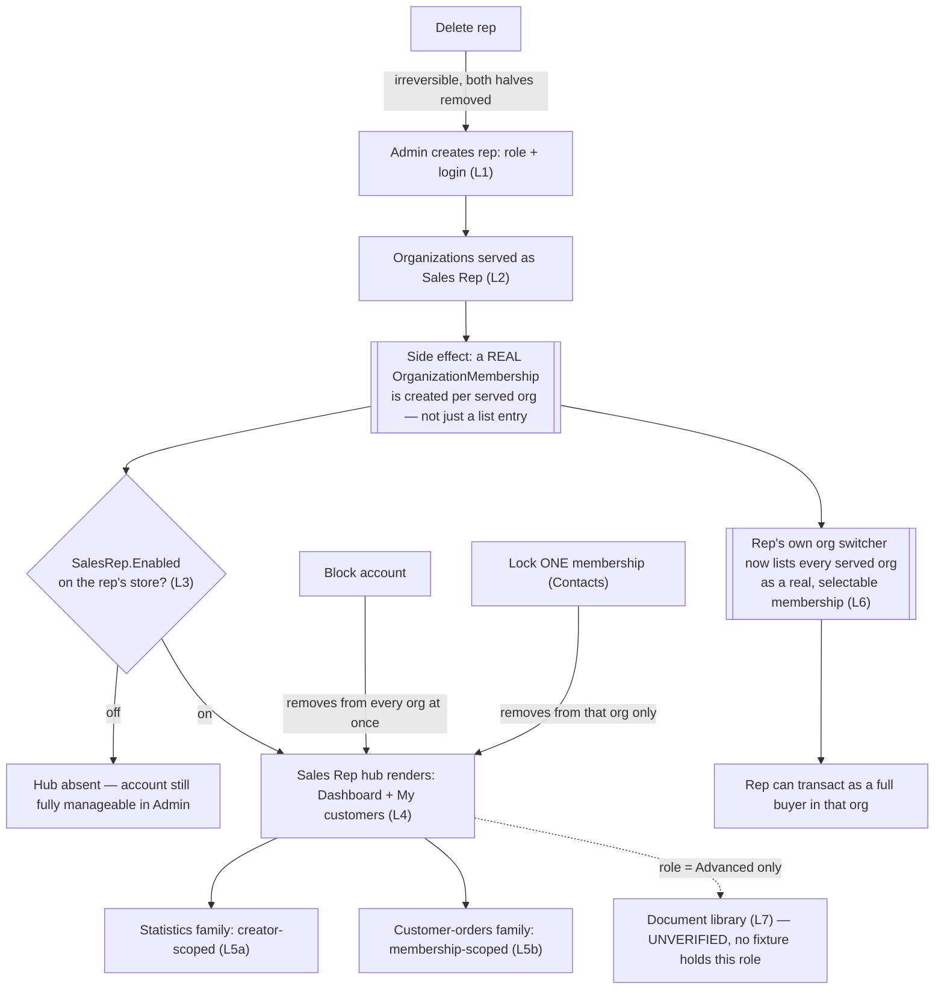

# Sales Rep — domain map

> Refresh with `/qa-domain-map sr`. This file answers **what the feature is and where its surfaces
> are**. It does **not** carry behavioural rules — those are `BL-SR-*` in `oracles/business-logic.md`
> (32 invariants, cited by id below, never restated) — and it can **never ground an assertion as
> `{DOC}`**. It is a pointer index plus a surface inventory: it tells you *where to look* and *what
> exists*, never *what correct looks like*.

**Every claim carries a verdict.** `CONFIRMED` = observed live or read at source this pass ·
`DRIFT` = prior art/docs say otherwise and are wrong · `MISSING` = documented, does not exist ·
`UNVERIFIED` = not established, and **not** to be treated as true.

**Read-only pass.** No create/edit/block/unblock/delete/lock/unlock/assign/upload/save was performed
against the environment. Every capability confirmable only by mutating is `UNVERIFIED` **with the
mutation named**, in §2's "not manageable from here" rows and in §8.

> **MID-CHANGE — re-read this map's §6 after these PRs merge or revert (flagged 2026-09-10).** Two
> modules load-bearing for this domain are deployed on **this env as PR builds, not releases**, read from
> `GET /api/platform/modules` this pass: **`VirtoCommerce.Customer @ 3.1024.0-pr-316-1ac3`** (owns
> organizations, memberships and roles — i.e. the mechanism behind §1 L2 and **D9**) and
> **`VirtoCommerce.ProfileExperienceApiModule @ 3.1018.0-pr-145-4fe6`** (owns the org-side storefront
> contract — i.e. the b2b half of **D8**, whose switcher behaviour this map describes as
> *post-VCST-5317/#145*). They are the only two non-release builds on the environment. **D8 and D9 are
> therefore observations of an unmerged state**: if PR #145 or #316 reverts, the b2b half of D8 may return
> to omitting a locked org rather than returning-and-flagging it, and D9's switcher observation must be
> re-taken. Every other row in §6 rests on `SalesRep @ 3.1008.0`, a release build, and is unaffected.

---

## §0 — Changed since rev 1 (same day, 2026-09-10)

**This map does not name environments, and that is deliberate.** A hostname dates a claim the moment a
deployment moves, and it invites a reader to treat "it worked on *that* box" as the explanation when the
real variable is almost always a version. Where a row genuinely has to distinguish two deployments, they
are labelled by **the only property that distinguishes them**:

| Label | The deployment running | Relevant state |
|---|---|---|
| **Env-A** | `SalesRep 3.1008.0` | Document library **healthy**; 5 documents present; **no** Advanced-role fixture. `Customer` + `ProfileExperienceApi` on **PR builds** (mid-change call-out above) |
| **Env-B** | `SalesRep 3.1007.0` | Document library **hard-broken** (D13); **has** the Advanced-role and Documents-Manager fixtures; every in-scope module on a **release** build |

Both ran `XOrder 3.1011.0` — which is precisely why **the SalesRep version, not the environment, is the
discriminator** in D13. **Unless a row names Env-B, it was established on Env-A.**

Rev 1 enumerated **Env-A** only. Rev 2 adds a targeted **Env-B** pass to answer the
Document-library questions Env-A could not, and re-derives rev 1's riskiest claims. **Four rev-1
statements are contradicted out loud** — a refresh that silently drops a claim leaves anyone who cited
it with no signal:

| Rev 1 said | Rev 2 says |
|---|---|
| `customerSalesReps` returns **5** ACME reps, including `Sam Store` | **4.** Rev 1's figure came from a call that omitted `storeId`; the omission is itself the finding — now **D10** |
| The Documents-library grid is empty — *"zero documents on this environment"* | **5 documents** on Env-A (`Contracts` 3, `Product catalog` 2). Rev 1 was **true when observed**; every row was created later the same day (§2b) |
| `Sales Rep Documents Manager` *"plausibly carries only `sales-rep-documents:write`"* | **Refuted.** It carries `sales-rep:access` **and** `sales-rep-documents:write` (**D12**) |
| `Sales Rep` / `Sales Executive` relationship to this module is `UNVERIFIED` | **Resolved: they are decoys** with no rep capability, identical GUIDs across both envs (**D11**) |

New rows: **D11** (decoy roles), **D12** (role→permission bindings; `write` ≠ `read`), **D13** (Document
library hard-broken on Env-B), **D14** (per-env fixture password). Gap movement: **G3 CLOSED**,
**G1 partly closed and re-diagnosed**, **G6 unblocked**. No `D*` or `G*` row was renumbered or deleted.

**Which environment a claim came from now matters in this map.** Unless a row names an environment,
it was established on **Env-A** (`SalesRep 3.1008.0`, but `Customer` and `ProfileExperienceApi` on **PR
builds** — see the mid-change call-out above). Rows naming **Env-B** were established on
`SalesRep 3.1007.0` with every in-scope module on a **release** build.

---

## §1 — Purpose and value chain

**Purpose** (`PlatformUserGuide` §Sales Rep overview — [docs.virtocommerce.org/platform/user-guide/sales-rep/overview](https://docs.virtocommerce.org/platform/user-guide/sales-rep/overview), verbatim,
fetched first-hand): *"The **Sales Rep** module turns selected users into sales representatives who serve
a defined set of customer organizations. It provides a back-office application for administrators to
create, assign, and manage reps."* `CONFIRMED` as the declared purpose — unlike the b2b domain this one
is not `UNDECLARED`.

The chain below is reconstructed from source (`SalesRepController.cs`, `SalesRepDocumentsController.cs`,
`ModuleConstants.cs`) + live observation this pass, and is the first written statement of it in this
repo. Cite it as a hypothesis to contradict, not as authority.

| # | Link, in the rep-program owner's words | Mechanism |
|---|---|---|
| 1 | **A user becomes a rep** | Admin `Add`/edit on the rep's blade sets **Sales Rep role** (single-select: *Sales Representative* or *Advanced Sales Representative*) on a Contact+login pair. `POST`/`PUT /api/sales-rep`, gated `customer:{create,update}` **AND** `platform:security:{create,update}` (`BL-SR-014`). The role is applied **both** as the account's global role **and** as the role on every membership created in step 2 — confirmed by the blade's own inline copy: *"Role granting sales-rep:access — applied both globally and per served organization."* `CONFIRMED` source + live |
| 2 | **The rep is linked to customers — and this is not read-only** | The same blade's **Organizations served as Sales Rep** chip field does two things at once: it populates the served-org list every scoped query reads, **and** it creates a real `OrganizationMembership` row (with the rep's role) in each selected org. **Confirmed live**: `SR_REP_PRIMARY`'s storefront org switcher lists exactly her 5 served orgs as switchable memberships (§6 D9) — "served" and "member of" are the same act, not two |
| 3 | **The store turns the feature on** | `Stores → {store} → Settings → Sales Rep → General → Sales Rep Enabled` (`SalesRep.Enabled`, default `true`, source-confirmed `ModuleConstants.Settings.General`) gates the **storefront UI only** for that store — it does not touch any permission (`BL-SR-011`). Live REST path `UNVERIFIED` (gap G7) |
| 4 | **The rep signs in and sees the hub** | `sales-rep:access` (held via the role) **AND** `SalesRep.Enabled` on the rep's own store ⇒ a **Sales Rep hub** sidebar section renders above Purchasing. **Confirmed live, and narrower than documented**: for `SR_REP_PRIMARY` (role = *Sales Representative*) the section holds exactly **Dashboard** and **My customers** — no Document library link (§6 D3) |
| 5 | **The rep reads the served portfolio** | Two scoped families answer different questions from the same "my customers" idea: the **statistics/rankings family** (`salesRepCustomerOrderStatistics`, `…CartStatistics`, `…Counts`, `salesRepTopSellers`, `salesRepOrders`) is **creator-scoped** — only the rep's **own** orders/carts count (`BL-SR-002` half b); the **index-backed customer-orders family** (`salesRepCustomerOrders`, `salesRepCustomerOrder`) is **membership-scoped** — every order in a served org counts, whoever placed it (`BL-SR-002` half a, deliberately the opposite of half b). Confirmed live: `SR_REP_PRIMARY`'s My-customers "My last order" column and hub dashboard both read the creator-scoped half; the Customer-orders page reads the membership-scoped half |
| 6 | **The rep can act as a buyer, not just view** | Because step 2 is a real membership, the rep's own storefront org switcher lets them switch **into** any served org and transact with **full buyer rights** — cart, checkout, addresses, lists, quotes — under that org's identity, not a curated read-only lens. Doc-declared design intent (`VCST-5733` retired finding #21: *"a rep who serves the org holds full buyer rights on the buyer page by design, inherited from the LEO client project"*) and now **directly observed live** via the org switcher (§6 D9) — this is the single highest-impact link in the chain |
| 7 | **Sales materials reach the rep (a parallel, secondary chain)** | Admin uploads a file (two-step: `POST /api/files/sales-rep-documents` then `POST /api/sales-rep/documents` to register it with a Category + display metadata — the register step is what sets the file's `Owner`, per `SalesRepDocumentAuthorizationHandler` source). The storefront **Document library** hub page renders only for a rep whose role is **Advanced Sales Representative** (`sales-rep-documents:read`) — confirmed **absent** live for a plain *Sales Representative* (link 4). **No fixture on this env holds the Advanced role** (gap G1) and the Admin Documents-library grid is empty (`No data`) — this whole secondary chain is `UNVERIFIED` end to end past step 1 |
| 8 | **Access is taken away — three independent axes** | **(a) Block the account** (`POST …/block`, `platform:security:update` only) removes the rep from **every** served org's list at once — but the list-blade's own **Blocked** column label reads backwards (§6 D4, `CONFIRMED` live). **(b) Lock one membership** — a **Contacts**-side per-org lock, not a Sales-Rep-app control — excludes only that org; siblings unaffected (`CONFIRMED` live, §6 D8/D9 resolving the b2b map's pointer). **(c) Delete the rep** removes the Contact **and** the login account together, irreversibly (`PlatformUserGuide`, doc-stated, `UNVERIFIED` live — a destructive mutation) |
| 9 | **Reversal is asymmetric** | Block ↔ Unblock and Lock ↔ Unlock are each single reversible actions. Delete has **no** reverse edge — *"There is no way to keep one without the other. This cannot be undone."* (`PlatformUserGuide`, verbatim) |



### Actors

| Actor | Can do | Verdict |
|---|---|---|
| **Platform admin** | All of §2a/§2b/§2d — the only actor who can create/edit/block/unblock/delete a rep, set the store toggle, and (per `BL-SR-014`) is the only one whose grant needs both `customer:*` and `platform:security:*` halves | `CONFIRMED` live + source |
| **Sales Representative** (basic rep role) | Hub Dashboard + My customers, customer profile, customer orders. **No Document library link** | `CONFIRMED` live (`SR_REP_PRIMARY`) |
| **Advanced Sales Representative** (rep role) | Doc claims hub **+ Document library browse/open/download**. The permission (`sales-rep-documents:read`) and the role constant both exist in source; **no seeded fixture holds this role** | `UNVERIFIED` — gap G1, resolvable only by creating a rep with this role (a mutation, out of scope this pass) |
| **Sales Rep Documents Manager** (a *third*, undocumented role) | Exists as a real platform role (`f124ddde9d7d49489e1144038724142a`, confirmed via `/api/platform/security/roles/search`) and as a named constant in source (`ModuleConstants.Roles.DocumentsManagerRoleName`), carrying (by source inference, **role→permission binding not directly queried this pass**) `sales-rep-documents:write` without `sales-rep:access` — i.e. plausibly a **back-office document curator**, not a storefront rep persona at all | `UNVERIFIED` — hypothesis only; no fixture, no direct permission-list confirmation (§6 D2) |
| **Org buyer / employee (non-rep)** | Sees **no** Sales Rep hub section at all; a direct hit on `/company/dashboard` client-side-redirects to `/account/dashboard` | `CONFIRMED` live (`ORG_USER_EMAIL`, TechFlow) |
| **Org member of a rep-served org** (any role, incl. a rep in their own capacity) | Sees the buyer-facing `/company/sales-reps` contact list — every rep serving their **currently active** org, name/email/phone, read-only | `CONFIRMED` live — TechFlow shows exactly the 5 reps whose fixture rows name TechFlow as served, including a rep whose *other* org membership is locked |

---

## §2 — Surface inventory

### 2a. Admin — the Sales Reps embedded app

**Route:** `#!/workspace/embedded-app/vc-sales-rep`, reached from the platform main menu's **Sales Reps**
item (there is **no** separate top-level "Document Library" menu item — see §6 D3). Rendered inside an
`<iframe>` — `supportEmbeddedMode: true` in `module.manifest`, matching the `092`/`092b` suite split
(vc-shell app vs. embedded back-office app). Menu permission gate: `customer:read` (manifest
`<permission>` element). `CONFIRMED` live.

**Dashboard tile row (7):** Dashboard · Sales Reps · Blocked Sales Reps · Not assigned Sales Reps ·
Organizations · Not assigned Organizations · **Documents library**. `CONFIRMED` live.

**Sales Reps list blade** — toolbar Refresh · Add · Delete (multi-select). Columns: checkbox · **Name**
· **Email** · **Organizations** (served-org count) · **Blocked**, plus a **Show/Hide Columns** button
whose hidden set was **not enumerated this pass** (gap, §8 G4). Search: "Search by name or email".
**16 reps total** live (12 `AGENT-TEST-*` fixtures + 4 real accounts), cross-confirmed by two independent
reads (Admin grid pagination footer "1–16 of 16" and `POST /api/sales-rep/search` `totalCount: 16`).

**Rep detail blade** — toolbar **Save · Reset · Block** (or **Unblock**, exactly one). Fields:

| Field | Control | Notes |
|---|---|---|
| Email (login) | textbox, required | |
| Password | textbox, masked, show-password toggle | placeholder "Leave blank to keep current password" |
| **Sales Rep role** | single-select combobox, required | picker offers exactly **2** options live: *Advanced Sales Representative*, *Sales Representative* — see §6 D2 |
| Organizations served as Sales Rep | multi-select chips | e.g. `SR_REP_PRIMARY` → 5 chips (§1 L2) |
| First / Last / Middle name | textboxes | |
| Birth date | datepicker | not in any prior-art doc |
| Salutation | textbox | not in any prior-art doc |
| Time zone / Language / Currency | comboboxes, all "Click to select…" | not in any prior-art doc — standard Contact profile fields, unpopulated on every fixture inspected |
| About | textarea | |
| Additional emails | tag input | |
| Phone numbers | tag input | |
| Addresses | widget, "Add address" | |

All `CONFIRMED` live (`SR_REP_PRIMARY`'s blade). The Profile section carries considerably more fields
than any prior-art admin guide names.

### 2b. Admin — Documents library blade (inside the same app)

Toolbar **Refresh · Upload · Delete**. Search "Search by file name". Columns: checkbox · **Name** ·
**Category** (with its own filter-icon button) · **Size** · **Modified date**, plus **Show/Hide Columns**
(contents not enumerated).

**Live document inventory — CORRECTED SINCE REV 1, and the correction is itself the lesson.** Rev 1 recorded
*“`No data` — zero documents on this environment”*, which was **true when observed**. Re-checked hours
later via `POST /api/sales-rep/documents/search` (`200`): **`totalCount = 5`** on **Env-A**, every row
`createdDate 2026-09-10` — i.e. uploaded *during* this build pass, after the enumeration. Categories
(`GET …/documents/categories`): `Contracts` (3), `Product catalog` (2). Files: `Contract.pdf`,
`Сontract.docx`, `Сontract.txt`, `product-catalog.png`, `product-catalog.zip`. `CONFIRMED` live 2026-09-10
(rev 2). **A same-day observation of an empty grid is not evidence the feature has no data** — re-read this
row before citing it.

> **Authoring trap in the fixture data, `CONFIRMED` live (not a product defect — search behaves correctly).**
> Two of the three contract files begin with a **Cyrillic С (U+0421)**, not a Latin C (U+0043). Measured:
> `keyword:"Contract"` (Latin) → **1** hit (`Contract.pdf`); `keyword:"Сontract"` (Cyrillic) → **2**;
> `keyword:"ontract"` (substring, homoglyph-free) → **3**. A search case asserting “all contracts” on the
> Latin spelling silently checks one fifth of the corpus and passes.
 Source confirms the write path is a **two-step register**, not a single upload call (§1 L7), and
that read/write are gated by `sales-rep-documents:{read,write}` — a **separate permission pair** from
`customer:*`/`platform:security:*`, and **`BL-SR-014`'s documented permission matrix does not mention
either of them** (gap, §8 G3).

**Still not directly observed** (the rows now exist — all five `isPinned: false` — so the blocker is data no longer): whether Pin/Unpin controls
appear in the grid's row-context menu (`SalesRepDocumentsController` exposes `POST {id}/pin`/`unpin`
server-side); the Category field's actual input shape (free-text vs. a managed dictionary — the search
endpoint is keyword-filtered against existing values, which reads as free-text, `UNVERIFIED`).

### 2c. Admin — Stores → Settings → Sales Rep group

`PlatformUserGuide` §Enabling Sales Rep ([docs.virtocommerce.org/platform/user-guide/sales-rep/enabling-sales-rep](https://docs.virtocommerce.org/platform/user-guide/sales-rep/enabling-sales-rep)),
verbatim: *"The app itself is global, but you can enable or disable the feature for each store… In the
search field of the next blade, type **Sales rep** to find the module-related settings… Turn the
**Sales rep enabled** feature to on."* Source-confirmed (`ModuleConstants.Settings`) two setting groups:
**General** (`SalesRep.Enabled`, boolean, default `true`, `IsPublic: true`) and **Statistics** (four cache-expiration integer settings —
`OrderCacheExpirationMinutes`, `CartCacheExpirationMinutes`, `CustomerCountsCacheExpirationMinutes`,
`TopSellerCacheExpirationMinutes`, all default 5 minutes). **Not browsed live this pass** — a
`GET /api/settings/Store/B2B-store/values?names=…` probe 404'd, consistent with the b2b map's own gap G7
note that the settings-read REST path is unresolved. `CONFIRMED` source, `UNVERIFIED` live-UI.

### 2d. NOT manageable from Admin

- **A timed/atomic account-level lock with an expiry** — `Block` is a flat boolean (`platform:security:update`);
  there is no lockout-expiry field on the rep blade (contrast the b2b org-membership lock, which the
  Contacts side does expose a `Locked until` field for once already locked).
- **The per-org membership lock itself** — it lives entirely in **Contacts**, not on the rep's own
  "Organizations served" chip field, which has no lock affordance (matches the prior-art admin guide's
  explicit note).
- **A document's category as a managed dictionary** — no separate "Document categories" blade was found;
  `GET …/documents/categories` reads existing values back, keyword-filtered.
- **Which permission the "Sales Rep Documents Manager" role actually carries** — not readable from this
  blade; would need the platform Security app's own role-permission editor (out of scope this pass).
- **A rep's layout** (`salesRepLayout`) — no Admin surface at all; entirely a storefront, per-rep,
  self-service mutation.

---

## §3 — Storefront — rep-facing (Sales Rep Hub)

### 3a. Route inventory

| Route | Guard | Live |
|---|---|---|
| `/company/dashboard` | `requiresAuth`; `requiresOrganization` **cleared** for this route (`BL-SR-011`) | renders — Sales Rep hub dashboard |
| `/company/my-customers` | same | renders — My customers table |
| `/company/my-customers/:organizationId` | same | customer profile (per prior-art docs; not directly hit this pass, confirmed via My-customers row links) |
| `/company/customer-orders` | rep-gated (per prior-art docs; route confirmed present as a hub-dashboard "All orders" link target) | cross-customer order list |
| *(Document library page)* | role-gated on Advanced (doc-stated) | **route path itself never observed** — no rendered link to click for any fixture on this env (gap G2) |
| `/company/dashboard` as a **non-rep** | client-side redirect | **`CONFIRMED` live** → `/account/dashboard` (silent, no error, no 403) |

### 3b. Sales Rep hub sidebar — exactly what renders

For `SR_REP_PRIMARY` (role *Sales Representative*): a **"Sales Rep hub"** section, above Purchasing,
holding exactly **Dashboard** and **My customers 5** (badge = served-org count). `CONFIRMED` live,
screenshot-verified. **No Document library entry anywhere in the sidebar for this role.**

### 3c. Hub Dashboard (`/company/dashboard`)

Stats row (6, `CONFIRMED` live in this exact order): Orders in "New" status · Active carts · Orders
placed·WEEK · …MTD · …YTD · My customers. Widgets: **My recent orders** (status-filter buttons: All,
Cancelled, New, Payment required, Processing — live set, `CONFIRMED`; "All orders" link → `/company/
customer-orders`) and **Top sellers** (category chips: All categories + 3 live category names; Units/
Revenue columns). **Edit layout** button at the foot of the page (drag/hide/reorder, `BL-SR-024..032`,
not exercised this pass — a mutation).

### 3d. My customers (`/company/my-customers`)

Table columns, `CONFIRMED` live and matching `StorefrontUserGuide` verbatim: **Customer** (name + account # + city/state) · **YTD purchases** (+ order count) · **Last year** · **My last order** (date + order #,
or a dash) · **Actions** (a mail-icon "Send email" button, per customer). Search "Search by name". Live
data for `SR_REP_PRIMARY`: 5 rows (AcmeCorp $5,488.40/9 orders, TechFlow $3,212.00/11 orders, BuildRight
$535.00/3 orders, AcmeWest $123.00/2 orders, RepOnly-Primary $0.00/0 orders/"—"). The zero-order row
renders the documented dash, not an error.

### 3e. Where the rep is *also* an ordinary buyer

`CONFIRMED` live, and this is §1 L6 made concrete: `SR_REP_PRIMARY`'s own **org switcher** (the header
account-menu popover, the same control the b2b map documents at its §3d) lists **all 5 served orgs** as
selectable **Organizations**, radio-button style, with AcmeCorp pre-selected as the account's current
org. This is not a rep-only affordance layered on top — it is the **ordinary b2b org switcher**, because
step L2 created ordinary memberships. A rep can switch into TechFlow and place an order there exactly as
TechFlow's own maintainer could.

### 3f. Monthly-spend widget cross-check

The buyer-side `/account/dashboard` "Monthly spend report" (Budget $58,152 / Totally spent $530,152) was
observed **byte-identical** for `SR_REP_PRIMARY` (in AcmeCorp context) and for `ORG_USER_EMAIL` (in
TechFlow context) — two unrelated accounts, two unrelated orgs. This corroborates, rather than
re-derives, the b2b map's §3e finding that this widget is static/mock content ignoring the signed-in
identity; recorded here because it is now confirmed against a Sales-Rep-adjacent account too.

### 3g. NOT manageable from the rep-facing hub

- **Own layout edits cannot be undone except by Reset+Save** (`BL-SR-024`) — no per-block "restore to
  factory" without a full Reset.
- **A rep cannot see or change which role they hold, or which orgs they serve** — both are Admin-only
  writes (§2d); the hub is read/act, never self-service for the rep's own assignment.
- **A rep cannot browse Document library unless Advanced** — and even then, the route itself is
  `UNVERIFIED` this pass (gap G2).
- **No Admin-equivalent bulk view** — the hub is always scoped to the signed-in rep; there is no
  cross-rep view anywhere in the storefront (that is Admin's Sales Reps list, §2a).

---

## §4 — Storefront — buyer-facing (`/company/sales-reps`)

A **different persona entirely** from §3 — any org member, rep or not, viewing who serves **their own**
company.

**Route/guard:** `/company/sales-reps`, inherits `requiresAuth` + `requiresOrganization` (per the b2b
map's route table, line 213 — resolved here: `CONFIRMED` live, reached fine by `ORG_USER_EMAIL`, an
ordinary TechFlow member). Sidebar entry: **Corporate → Sales reps**, present for **every** org account
including a rep's own buyer identity.

**Page:** heading "Sales reps", search "Search by name, email or phone", table **Name · Email · Phone**.
Live for TechFlow: **5 rows** — `Lena Lock` (agent-test-sr-lockable), `Lena Park` (agent-test-sr-locked),
`Logan Lane` (agent-test-sr-layout), `Priya Rao` (agent-test-sr-primary, only row with a phone number),
`Tess Flow` (agent-test-sr-techflow) — an exact match to the fixture CSV's TechFlow-serving rows,
including `SR_REP_LOCKED` (whose *ACME* membership is locked but whose *TechFlow* membership is not).
`CONFIRMED` live, screenshot-verified.

**Not manageable / not present from this layer:** no way to request a different rep, no rep detail page,
no indication of which reps hold the Advanced role, no way to see *which* served org each phone/email
belongs to when a member belongs to more than one org — purely a name/email/phone directory, matching
`StorefrontUserGuide` §Sales reps ([docs.virtocommerce.org/storefront/user-guide/account/sales-reps](https://docs.virtocommerce.org/storefront/user-guide/account/sales-reps))'s own framing, verbatim:
*"This page is read-only contact information."* Same page, on the org-scoping this map's §1/§3e now
explains mechanically: *"The Sales reps page always reflects your currently active organization. Switch
between your companies to view corresponding sales reps."* `CONFIRMED` — matches the live TechFlow-vs-
ACME contrast (§6 D8).

---

## §5 — API / contract surface

### 5a. GraphQL — the SCOPED schema at `/graphql/sales-rep`

**Not the default `/graphql` endpoint** — `.claude/knowledge/api/graphql-schema.md` documents only the
main schema and does not cover this scope; every field name below is grounded in a **live introspection
this pass** (2026-09-10), not that file.

**21 queries / 2 mutations**, `CONFIRMED` live and cross-matched 1:1 against source query-handler class
names (`vc-module-sales-rep` `Queries/` dir, 21 `*Query.cs` + `*QueryBuilder.cs` + `*QueryHandler.cs`
triples, zero unmatched): `customerSalesReps` · `salesRepCartFilterRules` · `salesRepCustomerFilterRules`
· `salesRepCustomerOrder` · `salesRepCustomerOrders` · `salesRepCustomer` · `salesRepCustomerSortRules` ·
`salesRepCustomers` · `salesRepDocumentCategories` · `salesRepDocument` · `salesRepDocuments` ·
`salesRepLayout` · `salesRepOrderFilterRules` · `salesRepOrders` · `salesRepOrderSortRules` ·
`salesRepTopSellerFilterRules` · `salesRepTopSellerSortRules` · `salesRepTopSellers` ·
`salesRepCustomerCartStatistics` · `salesRepCustomerCounts` · `salesRepCustomerOrderStatistics`.
Mutations: `saveSalesRepLayout` · `sendCustomerCommunication`.

**Argument shapes, introspected live** (the 8 names absent from the published dev-guide table, §6 D1):

```
salesRepCustomerOrder(id: String!, cultureName: String)
salesRepCustomerOrders(after, first, organizationId, storeId, cultureName, filter, facet, sort: String)
salesRepCustomerSortRules(storeId, cultureName: String)
salesRepDocumentCategories(keyword: String)
salesRepDocument(id: String!)
salesRepDocuments(after, first, keyword, sort, category: String, pinned: Boolean)
salesRepLayout(scope: String!, storeId: String)
salesRepOrderSortRules(storeId, cultureName: String)
saveSalesRepLayout(command: InputSalesRepLayout!)
```

`SalesRepDocument` type fields (live): `id, fileId, name, displayName, category, isPinned, contentType,
size, createdDate, modifiedDate, url, summary, pageCount, previewUrl`. No `organizationId` argument
anywhere on the document queries — documents are **not** customer-scoped, consistent with "shared sales
materials" rather than a per-customer artifact.

**Anonymous access — the two questions the brief asked, answered distinctly, `CONFIRMED` live:**
introspection is **permitted** unauthenticated (`200`, full schema readable); a real **query** is
**refused** unauthenticated (`200` with `errors[0].extensions.code: "Unauthorized"`, `message: "Anonymous
access denied…"`, `data.<field>: null`). The schema shape is world-readable; the data is not.

### 5b. Admin REST (`api/sales-rep`, `api/sales-rep/documents`)

Confirmed 1:1 against `SalesRepController.cs`/`SalesRepDocumentsController.cs` source (§2a/§2b tables)
and live: `POST search` · `GET roles` (→ **2** roles live, §6 D2) · `GET dictionaries` (countries list) ·
`GET {id}` · `POST` (create, `customer:create` **AND** `platform:security:create`) · `PUT` (update,
mirrored) · `DELETE` (`customer:delete` **AND** `platform:security:delete`) · `POST {id}/block` /
`{id}/unblock` / `{id}/password` (`platform:security:update` **only**, matching `BL-SR-014`). Documents:
`POST` (register, step 2 of upload) · `POST search` · `GET categories` · `PUT {id}/metadata` ·
`POST {id}/pin` / `{id}/unpin` · `DELETE`.

### 5c. Reachable in only one layer

**REST-only:** rep as a first-class searchable entity across all fields; block/unblock/set-password as
account-only ops; the document's two-step register-a-file flow.
**GraphQL-only:** every rep-facing read of a served customer's data (stats, rankings, orders, top
sellers); the entire layout persistence surface (`BL-SR-015..026`); anonymous-safe introspection.
**Storefront-UI-only (no direct REST/GraphQL equivalent found this pass):** the buyer-facing "who serves
my company" directory is a thin read over `customerSalesReps` — no separate contract, so this row is
really "GraphQL, but only ever called from one direction" rather than a true gap.

### 5d. NOT manageable from the API layer alone

- **No org-scoping argument exists on any document query** — a document is either fully readable (once
  it has an owner) or not; there is no per-customer document ACL to query or set via this contract.
- **No query resolves "which role does user X hold"** — `GetRolesAsync`/`GET roles` lists the *catalog*
  of assignable roles, never a specific rep's current one; that is only visible on the rep's own Admin
  blade (§2a) or by decoding a token's claims.
- **No mutation to lock/unlock a per-org membership exists on this scoped schema** — that write is on the
  Customer module's REST surface (the b2b map §4b), not here, even though the Sales Rep contract is what
  *reads* the resulting exclusion (§6 D8).

---

## §6 — Where the layers DISAGREE

Numbered `D1..Dn`; never renumber — a citation contract.

| # | Disagreement | Verdict |
|---|---|---|
| **D1** | **The published developer-guide API reference is stale against the live scoped schema.** `PlatformDeveloperGuide` §SalesRep overview ([docs.virtocommerce.org/platform/developer-guide/GraphQL-Storefront-API-Reference-xAPI/SalesRep/overview](https://docs.virtocommerce.org/platform/developer-guide/GraphQL-Storefront-API-Reference-xAPI/SalesRep/overview)) lists **13 queries + 1 mutation**; live introspection returns **21 queries + 2 mutations**. The 8 live-only queries (`salesRepCustomerOrder`, `salesRepCustomerOrders`, `salesRepCustomerSortRules`, `salesRepDocumentCategories`, `salesRepDocument`, `salesRepDocuments`, `salesRepLayout`, `salesRepOrderSortRules`) plus the live-only mutation `saveSalesRepLayout` are the entire Customer-Orders (VCST-5733) and Layout (VCST-5367-family) feature sets — both shipped, both undocumented in the API reference. The guide's own text also names a field `salesRepOrderStatuses`, which **does not exist** in the live schema (the real name is `salesRepOrderFilterRules`/`…SortRules`) — a second, independent drift in the same paragraph | `CONFIRMED` — `{DOC}` quote + live introspection, both this pass |
| **D2** | **The role vocabulary is 2 in the documented/UI picker, but 3+ in the platform's own role catalog — and the third is undocumented.** `PlatformUserGuide` §Managing sales reps ([docs.virtocommerce.org/platform/user-guide/sales-rep/managing-sales-reps](https://docs.virtocommerce.org/platform/user-guide/sales-rep/managing-sales-reps)) states flatly: *"The **Sales Rep role** field offers two roles: Sales representative… Advanced sales representative…"* Live: the rep blade's own picker offers exactly those 2, and `GET /api/sales-rep/roles` (the endpoint that feeds it) also returns exactly those 2. But `POST /api/platform/security/roles/search {keyword:"Sales"}` returns **`Sales Rep Documents Manager`** as a real role entity — and source (`ModuleConstants.Security.Roles.DocumentsManagerRoleName`) confirms it by name, distinct from the two the guide describes. It is **excluded from the Sales-Rep app's own role picker** (the picker is **permission-filtered** on `sales-rep:access` — proven, D11). **Rev 1’s guess that this role “plausibly carries only `sales-rep-documents:write`” is REFUTED**: a JWT claim decode on Env-B’s `agent-test-sr-docs-writer@example.com` shows it carries **both** `sales-rep:access` **and** `sales-rep-documents:write` (D12), so an operator wanting a documents-only grant has to leave the Sales Rep app entirely and use the platform-wide Security → Roles editor. Two further non-fixture roles turned up in the same search (`Sales Rep` `[652b5344…]`, `Sales Executive` `[29593909…]`) whose relationship to this module is **`UNVERIFIED`**; the search also returns four `AGENT-TEST-SalesRep-*` roles (`-Full`, `-ReadOnly`, `-MemberOnly`, `-AccountOps`) which are this repo's own seeded permission-matrix fixtures, not product roles | `CONFIRMED` doc + source + live (3-way), re-derived by the orchestrator 2026-09-10; the two extra product roles are `UNVERIFIED` |
| **D3** | **"Document Library" reads as a main-menu item in the docs; live it is a tile inside the Sales Reps app.** `PlatformUserGuide` §Document Library ([docs.virtocommerce.org/platform/user-guide/sales-rep/document-library](https://docs.virtocommerce.org/platform/user-guide/sales-rep/document-library)): *"The **Document Library** menu item lets administrators upload sales materials…"* Live: the platform main menu's 19 items include **no** "Document Library" entry — it is the **7th dashboard tile** inside the Sales Reps embedded app (`#!/workspace/embedded-app/vc-sales-rep`), one click deeper than the doc's phrasing implies | `CONFIRMED` — `{DOC}` quote + live, both this pass |
| **D4** | **The "Blocked" column's status icon is labelled backwards — and this was flagged in prior art, now reconfirmed live.** In the Sales Reps list, `Blake Barr` (`agent-test-sr-blocked@example.com`, whose account **is** blocked) shows the **"Active"** icon in the Blocked column; every **non**-blocked rep in the same grid (`Priya Rao`, `Ava Adams`, etc.) shows **"Inactive"**. The label describes the *Blocked flag itself*, not account health, and reads as the opposite of what an operator would assume | `CONFIRMED` live 2026-09-10, matching the prior-art admin guide's own warning verbatim |
| **D5** | **Anonymous introspection vs. anonymous queries on the scoped schema are two different postures, and only one is guarded.** Nothing in the docs or prior art distinguishes them; both were established live this pass (§5a) | `CONFIRMED` live; not itself a defect — recorded because a reader would otherwise assume "auth required" covers both |
| **D6** | **A CSV fixture-authoring note is now stale against live data.** `test-data/sales-rep/sales-reps.csv`'s note for `SR_REP_PRIMARY` reads *"Primary rep serving 4 orgs"* (`ORG-001;ORG-002;ORG-003;ORG-004`); live, the rep serves **5** — `AGENT-TEST-Org-RepOnly-Primary` was added after the note was written, and the Admin grid / My-customers badge / org switcher all agree on 5 | `CONFIRMED` live vs. committed fixture note — a documentation-currency issue, not a product defect |
| **D7** | **`salesRepOrders` (creator-scoped) and `salesRepCustomerOrders` (membership-scoped) look like the same "my customers' orders" idea and are not.** Already resolved as an oracle amendment (`BL-SR-002`'s two-half split, 2026-09-04) rather than left as an open drift — recorded here only as a pointer, because it is the mechanism behind §1 L5 and the single easiest place to author a false-FAIL case | pointer to `BL-SR-002`, not a fresh finding |
| **D8 / resolves b2b-organizations.md §5 D15** | **The Sales Rep module EXCLUDES a locked-membership rep; the b2b org switcher (post-VCST-5317/#145) RETURNS-AND-FLAGS a locked org instead.** Live, paired control in one window: `SR_REP_PRIMARY`'s token resolves `organization_id` = AcmeCorp; `customerSalesReps(storeId: "B2B-store")` in that context returns exactly **4** reps (`Ava Adams, Cara Cole, Logan Lane, Priya Rao`) — **`Lena Park` (`SR_REP_LOCKED`, locked in ACME) and `Blake Barr` (`SR_REP_BLOCKED`) are both correctly absent**, as is `Sam Store` (`SR_REP_SECOND_STORE`, an ACME-serving rep whose login account is bound to the `Electronics` store). **Corrected out loud:** an earlier draft of this row recorded **5** reps including `Sam Store`; that figure came from a call that **omitted the `storeId` argument** and is wrong for an ACME/B2B-store caller — see **D10**, which is the finding that mistake actually exposes. The b2b switcher, on the same class of predicate, now lists a locked org with a disabled/flagged row rather than omitting it. Two features solving the same "is this membership usable" question, landing on opposite UX answers, with no cross-reference between them anywhere in either codebase or either doc set | `CONFIRMED` live, both halves, this pass — closes b2b map gap and gives it a positive contrast instead of a pointer |
| **D9 — the highest-impact row in this map** | **A "Sales Representative" is, structurally, a full buyer-member of every organization they serve — not a restricted read-only viewer with a curated dashboard bolted on.** Step L2 of the chain (§1) creates an ordinary `OrganizationMembership`; live, `SR_REP_PRIMARY`'s own header org-switcher lists all 5 served orgs as selectable organizations, identical in shape to the b2b domain's ordinary multi-org switcher. Nothing in either UserGuide states this — both describe the hub as a *view* ("gives a rep an overview…", "lets a rep see..."), never as *also granting full transactional membership*. The only place this is stated as intentional is a JIRA dev-comment answer captured in `VCST-5733`'s retired finding #21 ("inherited from the LEO client project"), which this map's live check now confirms structurally rather than by developer assertion alone. A test suite built only from the two published guides would never think to assert "a rep can place an order, edit an address, or accept a quote as a TechFlow buyer" — and none of the 9 sales-rep suites currently does (§7) | `CONFIRMED` live + doc-comment corroboration |
| **D10 — the sharpest contract finding in this map** | **Omitting the `storeId` argument on `customerSalesReps` silently disables store scoping, and the published developer guide states the opposite.** `PlatformDeveloperGuide` §SalesRep overview ([…/SalesRep/overview](https://docs.virtocommerce.org/platform/developer-guide/GraphQL-Storefront-API-Reference-xAPI/SalesRep/overview)), verbatim: *“Every query requires an authenticated caller and is store- and membership-scoped, so a rep only sees the customers they serve and a buyer only sees their own reps.”* Live, one `SR_REP_PRIMARY` token, three calls, same session: `customerSalesReps(storeId: "B2B-store")` → **4** reps; `customerSalesReps(storeId: "Electronics")` → **1** (`Sam Store` only); `customerSalesReps` **with no `storeId` argument at all** → **5**, i.e. the B2B-store four **plus `Sam Store`**, a rep whose login account belongs to a different store. Store scoping is therefore a property of the **argument**, not of the caller's token or the server's own context — so the guide's “is store-…scoped” is true only when the client remembers to say which store. This is the repo's standing xAPI ambient-argument trap (a `200` with wrong data rather than an error) landing on a data-visibility boundary. **Consequence for authoring:** a case that omits `storeId` gets a superset and can PASS a cross-store-exclusion assertion for the wrong reason — note that `SR_REP_SECOND_STORE` exists in `test-data/sales-rep/sales-reps.csv` *specifically* to test “store-scoping of `customerSalesReps`” | `CONFIRMED` live — re-derived independently by the orchestrator 2026-09-10 (three-call paired control), plus a verbatim `{DOC}` quote it contradicts |
| **D11 — the role vocabulary is env-dependent, and two "Sales Rep"-looking roles are DECOYS** | **Assigning the role literally named `Sales Rep` does NOT make anyone a sales representative.** The platform role catalog carries, on **both** environments, two similarly-named roles that have nothing to do with this module: **`Sales Rep`** `[652b5344-a37d-4646-a9ba-60cafe083747]` and **`Sales Executive`** `[29593909-8959-4d16-9872-beb8736abaaf]` — **byte-identical, hyphenated GUIDs on Env-A and Env-B**, i.e. fixed platform/sample-data roles. The three roles the module actually provisions carry **per-env, compact 32-hex GUIDs** generated at install (`Sales Representative` = `a8bf5373…` on Env-A vs `f18edee1…` on Env-B; `Advanced Sales Representative` = `8e72e0a4…` vs `c73e86e2…`; `Sales Rep Documents Manager` = `f124ddde…` vs `7799a8e9…`). Neither decoy appears in `GET /api/sales-rep/roles`, and that endpoint is **permission-filtered on `sales-rep:access`** — established because every role it *does* return was confirmed by JWT decode to carry that permission (D12), and on Env-B it returns **3**, the third being this repo's own seeded `AGENT-TEST-salesrep-role-2`. So the two decoys lack `sales-rep:access` and grant no rep capability. **Consequence:** an operator picking by name in the platform-wide Security → Roles editor (the only place these are visible, since the Sales Rep app's own picker hides them) can grant `Sales Rep` and produce an account with no hub, no served customers and no error — and the `PlatformUserGuide`'s "offers two roles" framing gives no warning that four more Sales-named roles exist in the catalog | `CONFIRMED` live on both envs — identical GUIDs for the decoys, divergent GUIDs for the module roles; the decoys' lack of `sales-rep:access` is established **by exclusion** from the permission-filtered picker, basis stated rather than asserted |
| **D12 — role → permission bindings, finally pinned; and `write` does not imply `read`** | Rev 1 left this `UNVERIFIED` because neither `POST /api/platform/security/roles/search` nor `GET /api/platform/security/roles/{id}` returns a populated `permissions[]` — both give `[]` on both envs, which is *why* rev 1 could not answer it. **Resolved by decoding the `permission` claim of a real token per fixture** on Env-B: `Sales Representative` → **`sales-rep:access`** only; `Advanced Sales Representative` (`agent-test-sr-docs@`) → **`sales-rep:access` + `sales-rep-documents:read`**; `Sales Rep Documents Manager` (`agent-test-sr-docs-writer@`) → **`sales-rep:access` + `sales-rep-documents:write`**. The gate then behaves asymmetrically: `salesRepDocuments` returns **`Forbidden`** for the plain rep (correct — re-confirmed on Env-A too) **and also for the Documents Manager** — so **`sales-rep-documents:write` grants no read on the storefront contract**. Whether a document *curator* being unable to list documents through the storefront is intended (they work in Admin) or an oversight is **not decidable from the surface** — recorded as a boundary, not a verdict. Note also that the JWT `role` claim is only `__customer` for every rep: **rep-ness is carried purely as permissions in the token, never as a role claim**, so no consumer can detect "is this an Advanced rep" from roles | `CONFIRMED` live — three JWT decodes + four gate probes across both envs |
| **D13 — the Document library is HARD-BROKEN on Env-B and healthy on Env-A, and the delta is one SalesRep patch** | Both document endpoints return **`500`** on **Env-B** — `POST /api/sales-rep/documents/search` and `GET /api/sales-rep/documents/categories` — each with *"Could not load type 'VirtoCommerce.XOrder.Data.Services.IXOrderMapper' from assembly 'VirtoCommerce.XOrder.Data, Version=3.1011.0.0'"*. The scoped GraphQL half fails the same way for a **correctly authorized** Advanced rep: `salesRepDocuments` → `extensions.code: "TYPE_LOAD"` (authorization passes, then the resolver crashes). **Isolated to documents** — `sales-rep/search` (`totalCount 21`), `sales-rep/roles` and `sales-rep/dictionaries` are all `200` on the same env and token. **A cross-env control pins the variable:** `XOrder` is **3.1011.0 on BOTH** envs, so XOrder is not it — `SalesRep` is **3.1007.0** on Env-B (broken) versus **3.1008.0** on Env-A (documents `200`, `totalCount 5`). The fault is therefore resolved by the `3.1007.0 → 3.1008.0` bump. **Suspected deployment/product defect — deliberately NOT filed from this pass**, because a map is read-only and its evidence is an enumeration, not a repro | `CONFIRMED` live — paired cross-env control, identical call shape both sides, 2026-09-10 |
| **D14 — the fixture password variable differs per environment while the role registry names only one** | `scripts/lib/user-roles.mjs` declares `SALES_REP` with `passwordVar: 'TEST_USER_PASSWORD'`, and that is correct on **Env-A** (all three rep fixtures authenticate `200`). On **Env-B** the same accounts return **`400 login_failed`** with `TEST_USER_PASSWORD` and **`200`** with **`DEFAULT_TEST_PASSWORD`**. The registry names a single variable for a role whose secret is env-dependent, so a headless run pointed at the second QA env fails auth in a way that reads as a broken fixture rather than a resolver gap — the `.claude/rules/test-data.md` trap about concluding a variable is unset from one layer, in its per-env form | `CONFIRMED` live on both envs — a repo-side fixture-registry issue routed to `test-data-engineer`, not a product defect |

---

## §7 — Coverage shape

**Basis:** `config/test-suites.json` `selections.sales-rep` (9 suites) + a `csv-parse`-based read of each
suite's `Automation_Status` column (not a `grep`/`wc -l` line count — CSV rows span multiple physical
lines, which would silently misreport every count below).

| Suite | Cases | Automated | Draft | Reviewed | Other |
|---|---|---|---|---|---|
| `050m` GraphQL xAPI — Sales Rep (scoped) | 129 | 78 | 48 | — | 3 Deprecated |
| `050m2` GraphQL, procedural | 1 | 1 | — | — | — |
| `089` My Customers (storefront) | 55 | 32 | 11 | — | 1 Deprecated, 11 `verified` (lowercase — a distinct, uncanonical status value) |
| `090` My Sales Reps (buyer-facing) | 22 | 1 | 20 | 1 | — |
| `091` Customer Profile (storefront) | 58 | 20 | 10 | 28 | — |
| `092` Admin / VC-Shell App | 18 | **0** | 1 | 17 | — |
| `092b` Admin Embedded App | 22 | **0** | 10 | 12 | — |
| `093` Hub Dashboard (storefront) | 63 | 25 | 13 | 25 | — |
| `097` Customer Orders (storefront) | 37 | 18 | 19 | — | — |
| **Total** | **405** | **175 (43%)** | **132 (33%)** | **83 (20%)** | **15 (4%)** |

`Reviewed` (83 cases, concentrated in `091/092/092b/093`) is a **third maturity state** the task brief's
approximate table collapsed into "Draft" — a case that has been written and reviewed but never wired to
the runner is not the same risk as one nobody has looked at yet. Both counts as "never executed", but the
distinction matters for triage priority.

**Deliberate zero-coverage, confirmed this pass by grepping for the actual field/UI names (not the
generic word "document", which false-hits on the unrelated *layout persistence* terminology — `BL-SR-015
..032` use "document" to mean the saved-layout JSON, and that is what the ~50 raw "document" hits in `093`
are actually about):**

| Surface | Cases citing it | Basis |
|---|---|---|
| **Document library (Admin + storefront)** — `salesRepDocument*`, "Documents library", "Advanced Sales" | **0**, across all 9 suites | `grep -io "salesRepDocument[a-zA-Z]*\|Documents library\|Document [Ll]ibrary\|Advanced [Ss]ales"` over every sales-rep CSV → zero matches |
| The `Sales Rep Documents Manager` role | **0** | same sweep; the role name appears nowhere in any suite |
| `salesRepCustomerSortRules` / `salesRepOrderSortRules` (2 of the 8 doc-drift queries, D1) | **`UNVERIFIED` this pass** | not independently swept; flagged as a follow-up |

This is a **hole**, not a deliberate exclusion — nothing in `config/test-suites.json`, the module's
settings, or any doc marks the document-library feature as disabled or out of scope, and the module ships
it live (confirmed queries + Admin blade + storefront role-gate all exist and were exercised read-only
this pass). It sits opposite `BL-SR-015..032`, the module's **best-covered** area by invariant count (18
of 32 `BL-SR-*` entries are the layout subsystem) — an extreme skew: the shipped-but-never-touched
Document Library feature has fewer test artifacts than the layout subsystem has *oracle entries alone*.

**Over-covered relative to risk:** the **layout persistence mechanics** (`BL-SR-015..032`, 18 entries, all
promoted 2026-08-04) versus **D9's membership-granting side effect** (0 entries, 0 cases anywhere). A
rep's dashboard drag-and-drop order is exhaustively specified; a rep's ability to place a real order as a
buyer in a served org is not tested or invariant-stated at all.

**Selection-group / executability:**
- `selections.sales-rep = {"include": [...]}` — the 9 suites above, exact match confirmed against the
  manifest.
- **`selections.sprint` excludes all 9 by name** (`config/test-suites.json`, confirmed). Combined with
  `requiresModules: ["sales-rep"]` on every one of the 9 (silent skip on any env without the module) and
  no declared `envRiskGate`, the practical effect is: this domain **never runs** in a sprint-scoped
  regression pass, by deliberate exclusion, and needs an explicit `sales-rep` selection or `full` to run
  at all.
- **`092` and `092b` (the Admin surfaces) have zero Automated cases between them** (40 cases, 0
  automated) — the entire Admin layer of this feature has never executed in CI.
- **`007` B2B Lists & Shared carries exactly 16 Sales-Rep-subject cases**, `B2C-LIST-040`…`B2C-LIST-055`
  (count re-derived this pass by id-range grep, matching the b2b map's own figure exactly) — **not**
  excluded from `sprint`/`full` the way the 9 dedicated suites are, so this slice of Sales-Rep-relevant
  coverage runs on a schedule the other 405 cases do not.

---

## §8 — Open gaps

| # | Gap | State |
|---|---|---|
| **G1** | Advanced Sales Representative role, end to end (does Document library actually render? does `sales-rep-documents:read` actually resolve for it?) | **PARTLY CLOSED, rev 2** — closed by `Env-B`, which *does* carry the missing fixture (`agent-test-sr-docs@example.com`, absent from Env-A). The **permission half is now CONFIRMED**: the role grants `sales-rep:access` + `sales-rep-documents:read` (JWT decode, D12), and the gate correctly refuses a plain rep on both envs. **The rendering half stays OPEN and is now BLOCKED, not merely unfixtured**: on Env-B the authorized read crashes (`TYPE_LOAD`, D13) and on Env-A no account holds the Advanced role. Closing it needs *either* the `SalesRep 3.1008.0` bump on Env-B *or* an Advanced-role fixture seeded on Env-A (a `POST /api/sales-rep` mutation) — then a browser pass on the hub |
| **G2** | The Document library storefront route path | **OPEN.** Never rendered as a link for any reachable fixture; no invented-route guess made |
| **G3** | Whether `Sales Rep Documents Manager` carries `sales-rep-documents:write` (or anything) | **CLOSED, rev 2** — it carries **`sales-rep:access` + `sales-rep-documents:write`**, proven by decoding the `permission` claim of a live token for `agent-test-sr-docs-writer@example.com` on Env-B (D12). Rev 1's stated blocker was correct and remains true — neither `roles/search` nor `roles/{id}` returns a populated `permissions[]` on either env — so the **JWT claim decode, not a REST role read, is the mechanism that answers this class of question**. Refutes rev 1's guess that the role lacked `sales-rep:access` |
| **G4** | Admin Sales Reps / Documents grids' hidden-by-default column sets | **OPEN.** "Show/Hide Columns" exists on both grids; contents not opened this pass |
| **G5** | Store-level `SalesRep.Enabled` / Statistics-cache settings, read live via the Admin Stores UI or a working REST path | **OPEN** — the obvious REST path 404'd (consistent with the b2b map's own unresolved G7); source-confirmed only |
| **G6** | Document Pin/Unpin controls' actual UI location | **OPEN, but unblocked (rev 2)** — rev 1's stated blocker ("no document row exists on this env") no longer holds: Env-A now has **5 documents, all `isPinned: false`** (§2b), so the grid's row-context menu is inspectable. Needs only a browser pass on the Admin Documents-library blade; the server endpoints (`POST {id}/pin`/`unpin`) were already source-confirmed. Do **not** attempt on Env-B — the blade's data call `500`s there (D13) |
| **G7** | `salesRepCustomerSortRules` / `salesRepOrderSortRules` coverage sweep | **OPEN.** Flagged but not independently swept this pass (§7) |
| **G8** | Whether the two-step document register (`POST /api/files/sales-rep-documents` → `POST /api/sales-rep/documents`) actually behaves as the source implies, live | **OPEN.** A write path; needs `sales-rep-documents:write`, out of scope |
| **G9** | D9's structural finding (rep = full member) walked all the way to a placed order | **OPEN.** Observed the switcher lists the memberships; did not place an order as the rep in a served org — that is itself a purchase-flow mutation |
| **G10** | Whether any existing case omits the `storeId` argument on `customerSalesReps` (or its siblings) and so asserts cross-store exclusion against a superset — the **D10** false-pass risk | **OPEN.** Needs a grep of the 9 suites' GraphQL bodies for `customerSalesReps` calls lacking a `storeId` argument, then a re-run of any hit. Not swept this pass; `050m` alone holds 129 cases on this schema |

---

## §9 — Prior-art verdicts

The 15 prior-art docs remain the detail; this map supersedes them where they disagree.

| Claim | Verdict |
|---|---|
| `ba-vcst-5304…` — claims the module was deployed on only one of the two QA deployments and absent from the other (the doc names both by hostname; not quoted here, per this map's no-hostnames rule) | **DRIFT**, expected and superseded by deployment expansion: live `GET /api/platform/modules` confirms `VirtoCommerce.SalesRep` deployed on **both** — `3.1008.0` on Env-A and `3.1007.0` on Env-B. Not a defect — the module simply shipped wider since 2026-07-21 |
| `ba-vcst-5304…` §Storefront integration — *"the storefront should detect whether the Sales Rep module is installed… and if so, surface the 'Sales Reps' menu item"* | Read literally this describes the **buyer-facing** "Sales reps" contact link; the **rep-facing** hub section is a separate, role-gated render (§1 L4). Not contradictory, but the guide does not distinguish the two audiences by name — worth a documentation note, not a defect |
| `ba-VCST-4907-sales-rep-visibility-admin…` §2 — *"the Blocked column's status icon is labelled 'Active' when the rep is blocked"* | **CONFIRMED**, re-verified live this pass (D4) — the strongest-standing single claim across all 14 docs |
| `salesrep-my-sales-reps-maintainer-guide…` — *"A Sales Rep may also appear in your Company members list with the Sales Representative role"* | **CONFIRMED and sharpened** — this map's D9 establishes the mechanism (a real `OrganizationMembership`), not just the observable UI symptom the guide describes |
| `sales-rep-customer-orders/…-customer-guide.md` — undocumented findings list (chip label English-fallback, breadcrumb one segment short, zero-customers vs. zero-orders empty-state collision) | Carried forward as-is; **not re-verified live this pass** — out of this map's scope, which is surface inventory, not case-level re-verification |
| `ba-VCST-5293-sales-rep-admin-guide…` — Sales Rep role field, "two roles" framing | **DRIFT**, per D2 — the *picker* is 2-wide (confirmed), but the *platform's role catalog* is not, and the doc's own framing ("The Sales Rep role field offers two roles") is accurate only for that one field, not for the module's full role surface |
| `sales-rep-hub-dashboard/read-your-dashboard.md` — *"Two links are both called 'Dashboard'… and the top navigation bar has a third"* | **CONFIRMED** live (§3, header "Dashboard" link → `/account/dashboard`; hub sidebar "Dashboard" → `/company/dashboard`) — not independently re-derived beyond confirming both routes exist and differ |

Settled from prior art's own open-question posture: the b2b map's four Sales-Rep pointer rows (lines 69,
213, 415, 502) are **resolved** above (§1 Actors, §4, §6 D8/D9, §7); its line 78 main-menu inventory is
independently re-confirmed (19 items, no separate Document Library entry, §6 D3).
