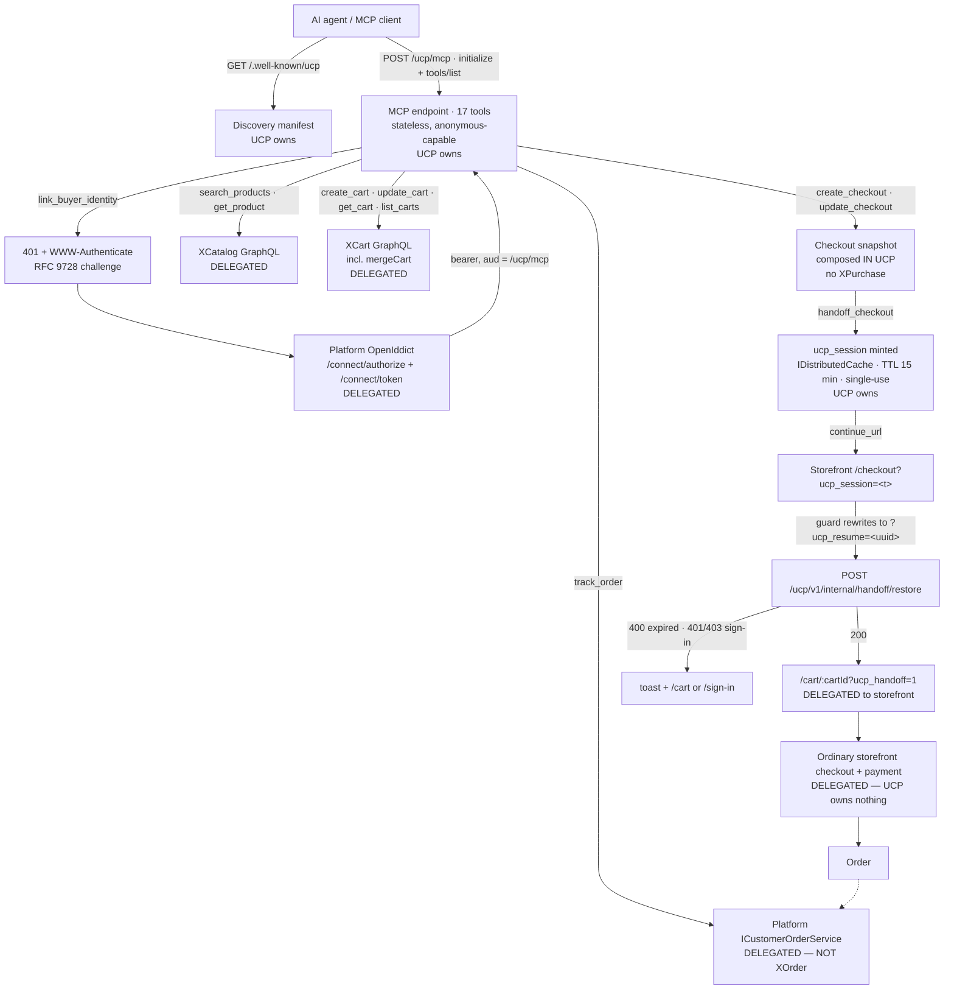

# UCP — Universal Commerce Protocol adapter — domain map

> Refresh with `/qa-domain-map ucp`. This file answers **what the feature is and where its surfaces
> are**. It does **not** carry behavioural rules — those are `BL-*` in `oracles/business-logic.md`,
> and for this domain there are **none yet** (§4) — and it can **never ground an assertion as
> `{DOC}`**. Pointer index plus surface inventory: it says *where to look* and *what exists*, never
> *what correct looks like*.

**Every claim carries a verdict.** `CONFIRMED` = observed live or read at source this pass ·
`DRIFT` = prior art says otherwise and prior art is wrong · `MISSING` = documented, does not exist ·
`UNVERIFIED` = not established, and **not** to be treated as true.

> ## ⚠ MID-CHANGE — read this before citing any row
> **All three repos are deployed on vcst-qa from OPEN, UNMERGED pull requests** (`CONFIRMED`
> 2026-09-17): Platform `3.1071.0-pr-3108-016f` (vc-platform#3108) · UCP module
> `3.1006.0-pr-7-1881` (vc-module-ucp#7) · storefront `2.58.0-pr-2467-8f0b-8f0bff22`
> (vc-frontend#2467 head). All three share the branch name `feat/VCST-5378-unified-buyer-flow`.
> The module manifest pins a Platform **prerelease** (`3.1066.0-alpha.13384-vcst-5378-…`), so this
> stack cannot be reproduced from released packages. **Re-read every `D*` row after these merge or
> revert** — several describe behaviour that exists only on these heads.

---

## §1 — Purpose and value chain

**Purpose (declared, quotable — `CONFIRMED` at source):** vc-module-ucp `README.md:10` —

> "`VirtoCommerce.UCP` is a protocol adapter module. It does not replace the Catalog, Cart, Orders,
> XAPI, Store, or Marketing modules. It provides a compact UCP-oriented HTTP surface for external
> clients while delegating commerce behavior to existing Virto Commerce modules."

and `README.md:3-6`: it "exposes HTTP APIs for Universal Commerce Protocol (UCP) on top of existing
Virto Commerce Platform capabilities… adapted to in-process Virto Commerce XAPI calls and platform
services without an additional HTTP hop inside the platform process. It also exposes a Streamable
HTTP MCP endpoint at `/ucp/mcp`."

**Where the purpose is NOT stated:** neither published guide carries UCP at all (§3 D8). The
statement above is a repo README, so it grounds `{SPEC}`, never `{DOC}`.

### The chain

UCP **owns** links 1, 2, 5 and 6 and **delegates** everything else. The delegation targets are
source-anchored in §2c.

| # | Link, in the customer's words | Mechanism | Owner |
|---|---|---|---|
| 1 | An AI agent finds out this store can be shopped | `GET /.well-known/ucp` → services/capabilities/transport; or MCP `get_store_capabilities` → the same plus stores, endpoints, auth hints, `mcp_tools`, `agent_guidance`, `errors` | **UCP** |
| 2 | The agent shops **anonymously**, or links the buyer's account | Anonymous by default — a `create_cart` mints a synthetic `ucp-anonymous-<32-hex>` buyer. `link_buyer_identity` answers **401 + `WWW-Authenticate: Bearer … resource_metadata=…`** (RFC 9728) → client discovers `/.well-known/oauth-protected-resource/ucp/mcp` → Platform OpenIddict auth-code+PKCE → retries the call with a bearer whose `aud` must equal the MCP URL exactly | **UCP** (challenge) + Platform (OAuth) |
| 3 | The agent finds products | `search_products` / `get_product` → **XCatalog** GraphQL in-process (`UcpSearchProducts`, `UcpGetProduct`) | delegated |
| 4 | The agent builds a cart | `create_cart` / `update_cart` / `get_cart` / `list_carts` → **XCart** (`addItem`, `changeCartItemQuantity`, `removeCartItem`, `addCoupon`, `removeCoupon`, `addOrUpdateCartAddress/Shipment/Payment`). `update_cart` takes the **complete desired line_items state, not a delta**. Country/region normalised through Platform `ICountriesService` (`US`→`USA`, `CA`→`California`+`region_id`) | delegated |
| 4b | An anonymous cart becomes the signed-in buyer's cart | Only via `update_cart` with the saved anonymous `buyer_id` under an authenticated token → **XCart `mergeCart`** (`secondCartId` = anonymous cart, `deleteAfterMerge: true`). UCP verifies ownership three ways and **does not implement a second merge algorithm** | delegated (guarded by UCP) |
| 5 | The agent prepares checkout | `create_checkout` composes a snapshot **in UCP** — there is **no XPurchase dependency**. `checkout.id == cart_id`. `get_payment_handlers` returns a **static** list | **UCP** |
| 6 | The agent hands the buyer a link to pay | `handoff_checkout` / `checkout_and_handoff` → 256-bit CSPRNG base64url `ucp_session` (~43 chars, **not a JWT, not signed**) stored in `IDistributedCache` under `UCP:Handoff:<SHA-256 hex of token>`; returns `continue_url` + `expires_at`. Status flips to `requires_escalation` | **UCP** |
| 7 | The buyer opens the link and sees their cart | Storefront `/checkout?ucp_session=<t>` → global guard swaps it for `?ucp_resume=<uuid>` (token parked in `sessionStorage` `ucp-handoff:<uuid>`, so it never leaks into a `returnUrl`) → `POST /ucp/v1/internal/handoff/restore {ucp_session}` → on success `next({name: Cart/:cartId, query:{ucp_handoff:"1"}})`. **There is no `/ucp/*` storefront route** (§3 D11) | storefront |
| 8 | The buyer pays | The storefront's ordinary checkout. **UCP owns nothing here** — `payment_handlers` only *discovers*; it never executes a payment | delegated |
| 9 | The agent tells the buyer what happened to the order | `track_order` by `order_id` / `order_number` / **`cart_id`** → Platform `ICustomerOrderService` / `ICustomerOrderSearchService`. **Not** XOrder GraphQL — the XOrder executer is wired but has **no caller** | delegated |

### Reverse edges — what undoes a forward effect

| Forward effect | Reversal | Verdict |
|---|---|---|
| `ucp_session` minted | **TTL** (`UCP:HandoffTokenTtlMinutes`, default **15**, floored at 1 — live `expires_at` was mint+15 min) **and single-use** — the cache entry is removed after a *successful* restore. A **failed** restore does **not** consume it (removal runs only after the cart fetch succeeds), which is what makes an anonymous-first/401-retry client strategy legal | `CONFIRMED` — live (replay after a same-replica 200 → 400) + source |
| A minted `ucp_session` | **No revoke/cancel API exists.** Nothing in the module, the Admin UI or the storefront can invalidate an outstanding handoff link before its TTL. **ABSENT IN PRODUCT** — a finding, not a blank | `CONFIRMED` (source: no such route in the controller table; live: no Admin surface) |
| Anonymous cart merged into a buyer cart | `deleteAfterMerge: true` — the anonymous cart is destroyed. **Not reversible.** Re-running is an idempotent no-op, not an undo | `CONFIRMED` at source |
| Cart / order created via UCP | Ordinary Cart/Order module lifecycle — UCP adds nothing and takes nothing away | `CONFIRMED` |

### Actors

| Actor | Can do | Verdict |
|---|---|---|
| **AI agent / MCP client** (e.g. Claude Code) | Everything in §2c **anonymously, with no credential of any kind**: discover, search, read products, create/update/read/list carts, create and update checkouts, discover payment handlers, mint a handoff link, resolve geography, track an order it has the `cart_id` for. Cannot place an order or take a payment | `CONFIRMED` live — every one of these was exercised with no token |
| **Anonymous buyer** | Is *represented* rather than present: a synthetic `ucp-anonymous-<32-hex>` id the agent must carry. Receives a `continue_url`, lands on the storefront cart, pays as a guest if the store allows it | `CONFIRMED` live |
| **Authenticated B2C buyer** | Same, plus personalised pricing and saved data, after `link_buyer_identity`. On restore, the storefront merges the anonymous handoff cart into their own via `mergeCart` and preserves their identity | `UNVERIFIED` live — **G1**. Source + storefront code + unit tests only |
| **B2B org buyer** | Adds org context: `organization_id` comes **only** from the Platform token; the payload's `organization_id` must match, and an *anonymous* restore carrying an `organization_id` is refused **403**. Contract pricing/assortment therefore ride the normal org token path | `UNVERIFIED` live — **G1/G2** |
| **Merchant / Platform admin** | Exactly one thing: flip **Settings → UCP → General → UCP Enabled** — which **gates nothing** (§3 D9). No agent registry, no API keys, no handoff-session list, no revoke. See §2a | `CONFIRMED` live |
| **Storefront** | Consumes the handoff: rewrites the query param, calls restore, merges, redirects, and owns every error message the buyer reads | `CONFIRMED` live + source |

---

## §2 — Surface inventory per layer

### §2a — Back office (Admin SPA)

**There is NO UCP back-office UI.** `CONFIRMED` on both axes.

- **Live (2026-09-17):** the main menu has 20 items — Home · Loyalty missions · Marketing · Loyalty ·
  Contacts · Catalog · Orders · Notifications · Push Messages · Pricing · System Operations · Tasks ·
  Sales Reps · Returns · Quotes · Settings · Security · Stores · Developer tools · More. **No UCP
  entry.**
- **Source:** the module manifest has no `<styles>` and no `<scripts>` section; `Content/` holds
  exactly one file (`logo.svg`, the manifest `<iconUrl>`); there is no `Scripts/`, no `Apps/`, no
  blade, no widget; a full-tree scan for `*.js`/`*.html`/`*.css`/`*.ts` under `src/` returns zero.

**The entire Admin surface, enumerated:**

| Where | What | Verdict |
|---|---|---|
| Settings → **UCP → General** → `UCP Enabled` (toggle) | The only control. Default `false`; **`true` on vcst-qa**. Rendered by the Platform's generic settings blade, not by module code | `CONFIRMED` live |
| Security → permissions, group `UCP` | `ucp:access`, `ucp:create`, `ucp:read`, `ucp:update`, `ucp:delete` | `CONFIRMED` live (5 returned by the permissions API) |

**Not manageable from this layer — and there is nowhere else either:**

| The reader will look for | Where it actually lives |
|---|---|
| Agent / MCP-client registry, API keys | Nowhere. `X-Agent-Api-Key` is *advertised* in the capabilities `headers` block and is **read by nothing** (§3 D13) |
| Outstanding handoff sessions; revoking one | Nowhere — see §1 reverse edges. Sessions are opaque cache entries keyed by a SHA-256 hash |
| Handoff TTL, storefront origin, handoff URL template, default store/currency/culture | `appsettings.json` **`UCP:` section only** (`UcpOptions`) — not exposed as Platform settings, so an operator cannot see or change them from the Admin UI |
| Observability knobs (`InputCaptureMode`, the App Insights bridge) | `appsettings.json` `UCP:Observability:` only, bound through a cached `IOptions` read at startup ⇒ **a change needs an appsettings edit + platform restart** |
| Per-store enable/disable of UCP | Does not exist. `UCP.Enabled` is global **and inert** |

### §2b — Storefront (vc-frontend)

**There is no UCP route.** The handoff rides the **pre-existing checkout route plus a query-param
protocol**. A test that navigates to a `/ucp/…` storefront path hits the catch-all. (`CONFIRMED` —
live walk + source; this corrects a standing assumption, see §3 D11 and §6.)

| Address | What it is | Guard | Verdict |
|---|---|---|---|
| `/checkout/:cartId?` (name `Checkout`) | The handoff **entry point** when `?ucp_session=<token>` is present | `meta: { layout: "Secure", redirectable: false }` — **no `requiresAuth`**, so an anonymous handoff is possible where the store allows anonymous users | `CONFIRMED` live |
| `?ucp_session=<token>` → `?ucp_resume=<uuid>` → `?ucp_handoff=1` | The three-stage query protocol. The raw token is parked in `sessionStorage` under `ucp-handoff:<uuid>` so it never travels through a sign-in `returnUrl` | — | `CONFIRMED` live (observed on the wire) |
| `/cart/:cartId?ucp_handoff=1` | Where a **successful** restore lands — *not* `/checkout` | — | `CONFIRMED` at source |
| `/cart` (bare) | Where a **400** lands, with the `expired` toast | — | `CONFIRMED` live |
| `/sign-in?returnUrl=<fullPath>&reauthenticate=1` | Where **401** and **403** land | — | source-only (`UNVERIFIED` live — G1) |
| **`/oauth/authorize`** (name `OAuthAuthorize`) | **The one genuinely new route.** Establishes a Platform browser session for OAuth consent when Platform is private: `GET /connect/session` → `POST /connect/session?returnUrl=…` → full-page `location.replace` into `/connect/authorize` | `meta: { requiresAuth: true }`, **no feature flag** | `CONFIRMED` live — anonymous hit redirects to `/sign-in?returnUrl=/oauth/authorize` |

**The five user-facing strings**, `common.ucp.*`, present in all 14 locale files:

| Key | Shown when | Verdict |
|---|---|---|
| `expired` — *"This checkout link has expired, has already been used, or is unavailable in this tab. Request a new checkout link from your shopping assistant."* | HTTP **400**, **or** the tab-local continuation is missing (a different tab/browser, or blocked storage, is synthesised as a 400) | `CONFIRMED` live — this is the message a fresh, never-used link produced (§3 D3) |
| `wrong_account` | HTTP **403** | source-only |
| `restore_failed` | anything else (404/410/5xx/network, and the two plain `Error`s) | source-only |
| `authorization_failed` / `authorization_retry` | the `/oauth/authorize` failure page | source-only |

**401 shows no toast at all** — a silent bounce to sign-in, by design. A case asserting a visible
error on 401 asserts the wrong behaviour.

**Absent from this layer:** any UCP status/settings UI, any indication to the buyer that the cart
came from an agent, and any surface naming "UCP" — the customer-facing term is **"shopping
assistant"**.

**Proxying:** the storefront origin proxies `/ucp/*`, `/connect/(authorize|session|token)`,
`/revoke/token` and the `.well-known` family to Platform. `CONFIRMED` live — `/.well-known/ucp`,
`/ucp/mcp` and `/connect/session` all answer `200` on the storefront host, and the restore call the
page makes goes to the **storefront** origin, not to Platform directly.

### §2c — API / MCP (the primary surface)

**`GET /.well-known/ucp`** — `CONFIRMED` live. Advertises UCP version **`2026-04-08`**, one service
`com.virtocommerce.ucp` over transport `mcp` at `{BACK_URL}/ucp/mcp`, capabilities
`com.virtocommerce.ucp.{catalog,cart,checkout,order,geography}`, and **`payment_handlers: {}` —
empty** (§3 D1).

**`POST /ucp/mcp`** — MCP Streamable HTTP, JSON-RPC 2.0, `Accept: application/json, text/event-stream`,
responses as SSE `data:` frames. `initialize` reports protocol **`2025-11-25`**, serverInfo
**"Virto Commerce UCP Instructions"** v1.0, plus a ~4 KB `instructions` block. **Stateless** —
`options.Stateless = true`, no session id, so a bearer must be resent on every call.
**`initialize` and `tools/list` succeed with no credential.** `CONFIRMED` live.

**17 tools** (`tools/list`, `CONFIRMED` live). `R` = required args.

| Tool | R | Other args |
|---|---|---|
| `get_store_capabilities` | — | *(none)* |
| `link_buyer_identity` | — | *(none — deliberately has no buyer selector)* |
| `search_products` | `query` | `store_id, currency, language, price_min, price_max, limit` |
| `get_product` | — | `id, product_id, store_id, currency, language` |
| `create_cart` | `line_items` | `store_id, currency, language, buyer_id, cart_name, cart_type, coupons` |
| `list_carts` | — | `store_id, currency, language, buyer_id, cart_name, cart_type, cursor, limit, sort` |
| `get_cart` | `cart_id` | `store_id, currency, language, buyer_id` |
| `update_cart` | `cart_id, line_items` | `store_id, currency, language, buyer_id, cart_name, cart_type, coupons` |
| `create_checkout` | `cart_id` | `store_id, currency, language, buyer_id, buyer, buyer_email, buyer_name, buyer_phone, shipping_address, billing_address, payment_handler, notes` |
| `update_checkout` | `checkout_id` | same set as `create_checkout` plus `cart_id` |
| `checkout_and_handoff` | `cart_id` | same set as `create_checkout` |
| `handoff_checkout` | `checkout_id` | same set as `update_checkout` |
| `get_payment_handlers` | `checkout_id` | — |
| `track_order` | — | `order_id, order_number, cart_id, store_id, currency, language, buyer_id` |
| `list_countries` | — | `query, limit` |
| `resolve_country` | `query` | — |
| `list_regions` | `country_id` | — |

Every tool result carries a model-visible `Trace ID: <32-hex>` text part **and** `_meta.trace_id`.
`CONFIRMED` live.

**REST routes.** Every one is **anonymous — there is not a single `[Authorize]` attribute in the
module**; the only auth attribute anywhere is `[AllowAnonymous]` on the OAuth-metadata controller.
Authorization is entirely a function of the *resolved buyer context*, never of an ASP.NET policy.

| Route | Verb | Advertised in discovery? | Verdict |
|---|---|---|---|
| `/.well-known/ucp` | GET | yes | `CONFIRMED` live 200 |
| `/.well-known/oauth-protected-resource/ucp/mcp` | GET | via `auth.protected_resource_metadata` | `CONFIRMED` live 200 — served by **vc-module-ucp**, not vc-platform |
| `/ucp/v1/catalog/search` | POST | yes | `CONFIRMED` live (GET → 405) |
| `/ucp/v1/catalog/products/{id}` | GET | yes | source |
| `/ucp/v1/carts` | POST, GET | yes | `CONFIRMED` live — bare GET → 400 *"buyer_id is required for anonymous continuation."* |
| `/ucp/v1/carts/{cartId}` | GET, PUT, **PATCH** | **PUT only** | **PATCH `CONFIRMED` live** — reached the handler (business 400), not 405. §3 D7 |
| `/ucp/v1/checkouts` | POST | yes | `CONFIRMED` live |
| `/ucp/v1/checkouts/{id}` | PATCH | yes | source |
| `/ucp/v1/checkouts/{id}/payment-handlers` | GET | yes | `CONFIRMED` live — static list, no data access |
| `/ucp/v1/checkouts/{id}/handoff` | POST | yes | `CONFIRMED` live |
| `/ucp/v1/orders/{orderId}` | GET | yes | source |
| **`/ucp/v1/orders?cart_id=`** | GET | **no** | **`CONFIRMED` live** — returned `order_not_found` 404, i.e. a real route. §3 D7 |
| `/ucp/v1/geography/countries`, `…/resolve`, `…/{id}/regions` | GET | yes | `CONFIRMED` live |
| `/ucp/v1/internal/handoff/restore` | POST | yes, as `storefront_restore` | `CONFIRMED` live — **anonymous 200 with a valid anonymous-payload token** |

**Error envelope:** `{code, message, correlation_id, details}`. Declared codes: `invalid_request`,
`identity_required`, `buyer_context_mismatch`, `missing_store_id`, `product_not_found`,
`cart_not_found`, `order_not_found`, `xapi_invalid_response`. `CONFIRMED` live.

**`/ucp/v1/internal/handoff/restore` status matrix** (source-anchored; the 400 rows `CONFIRMED` live):

| Condition | Code | HTTP |
|---|---|---|
| `ucp_session` absent or blank | `invalid_request` *"ucp_session is required."* | **400** ✔ live |
| Cache **miss**, corrupt payload, **or** expired — all three collapse to one message | `invalid_request` *"ucp_session is invalid or expired."* | **400** ✔ live |
| Payload was minted **authenticated** and the restore carries no matching buyer | `identity_required` | **401** |
| Bearer identifies the MCP **client**, not a buyer | `identity_required` | **401** |
| Buyer/org present but ≠ the payload's | `buyer_context_mismatch` | **403** |
| `X-Buyer-User-Id` / `X-Buyer-Organization-Id` header present | `buyer_context_mismatch` | **403** |
| Anonymous restore whose payload carries an `organization_id` | `buyer_context_mismatch` | **403** |
| The cart no longer exists | `cart_not_found` | **404** |
| Cart is empty | `invalid_request` | **400** |
| XAPI GraphQL error | *(the raw GraphQL envelope, unmasked)* | **200** |

**Whether restore needs auth is decided by the TOKEN, not by the request** — `requires_authentication`
is stamped into the payload at mint time from whether the handoff itself was authenticated.

**Payment handlers** (from `get_store_capabilities` and `/ucp/v1/checkouts/{id}/payment-handlers`,
`CONFIRMED` live): `hosted_checkout` **available**; `native_card` and `google_pay` both
`available: false, reason: "not_available"`. So the only live path is hand the buyer back to the
storefront.

**Money is in minor units** — `price.amount: 4470` alongside `formatted_amount: "$44.70"`.
`CONFIRMED` live.

---

## §3 — Where the layers DISAGREE

**Ids are a citation contract — never renumber.**

| # | Disagreement | Verdict |
|---|---|---|
| **D1** | **`payment_handlers` is empty in discovery and populated everywhere else.** `GET /.well-known/ucp` returns `"payment_handlers": {}` — an empty **object**. The MCP `get_store_capabilities` tool and `GET /ucp/v1/checkouts/{id}/payment-handlers` both return a populated **array** of three handlers (`hosted_checkout` true, `native_card` false, `google_pay` false). Same logical field, two shapes and two contents. An agent that trusts the manifest concludes the store takes no payment at all, while the manifest simultaneously advertises the `checkout` capability | `CONFIRMED` live, both sides, same session |
| **D2** | **The advertised handoff URL points at the Platform host; the issued one points at the storefront.** Discovery advertises `handoff_url_template = https://vcst-qa.govirto.com/checkout?ucp_session={token}` (**Platform**). The `continue_url` actually minted is `https://vcst-qa-storefront.govirto.com/checkout?ucp_session=<t>` (**storefront**). Root cause, source-confirmed: the two are built by **different code with different precedence** — the profile resolves `UCP:HandoffUrlTemplate` → `UCP:StorefrontOrigin` → store `SecureUrl`/`Url` → **request origin**, while the minted URL resolves `UCP:HandoffUrlTemplate` → store `SecureUrl`/`Url` → `UCP:StorefrontOrigin` → a *relative* path, with **no request-origin fallback**. On vcst-qa both options are unset and **no store is marked default** (all five report `is_default: false`), so the profile has no store to read and falls through to the host the request arrived on. It fails **silently**, producing a plausible-looking URL | `CONFIRMED` live (both values) + source (both precedence chains) |
| **D3** | **A fresh, never-used handoff link fails on first use — and the cause is not the token.** Walked live: `checkout_and_handoff` → open `continue_url` in the browser → the page POSTs `{"ucp_session":"<the exact fresh token>"}` to restore → **HTTP 400 `"ucp_session is invalid or expired."`** → redirect to `/cart` with the `expired` toast. The session store is `IDistributedCache`, and the module registers `AddDistributedMemoryCache()` as the fallback — so with no Redis configured the store is **per process**. A 4-trial mint/restore experiment on vcst-qa correlated **100%**: every restore landing on the minting replica returned 200, every restore landing on the other replica returned 400, and — decisively — a token that 400'd on the wrong replica then returned **200** on the right one, proving it had not been consumed. Two platform replicas ⇒ roughly a coin flip per link. **This is the top functional risk in the domain** | `CONFIRMED` — live (4/4 trials, replica identified by Kestrel connection-id prefix) + source (`AddDistributedMemoryCache()` fallback; README recommends Redis in production). The *deployment* cause (whether vcst-qa has Redis wired) is **UNVERIFIED** — G3 |
| **D4** | **The 401-retry design is sound; the failure above never reaches it.** The storefront really does attempt restore **anonymously first** and retry **authenticated on 401 only** (refreshing an expired token, and rethrowing if no bearer materialises). The module really does return **401** for an authenticated-payload restore without a matching buyer, and really does **not consume** a session on failure — so the pattern is legal by construction. But a cross-replica cache miss returns **400**, not 401, and the client correctly does not retry a 400. **So the retry logic is not the defect** — a prior framing that "restore returns 400 with no retry" reads as a client bug and is wrong. Correct statement: 400 and 401 are *different branches*, and D3 puts a healthy link into the 400 branch | `CONFIRMED` — live 400 + source (both the client fallback and the server's 401 branch, each pinned by unit tests) |
| **D5** | **Three version vocabularies for one protocol.** Discovery says `ucp.version = "2026-04-08"` and names capabilities `com.virtocommerce.ucp.catalog`. Every runtime REST/MCP response envelope says `ucp.version = "1.0"` and names the *same* capability `dev.ucp.shopping.catalog.search`. `get_store_capabilities` returns **both** in one payload (`ucp.version: "2026-04-08"` beside a sibling `ucp_version: "1.0"`). The MCP transport reports a fourth number, protocol `2025-11-25`. Nothing tells a reader which is authoritative | `CONFIRMED` live, all four in one session |
| **D6** | **The three checkout tools return three different envelope shapes.** `create_checkout` → `{ucp, checkout}` at top level. `handoff_checkout` → **double-wrapped** `{result:{ucp, checkout}, last_checkout, next_step_after_payment}`. `checkout_and_handoff` → a third shape, `{ok, cart_id, buyer_id, checkout:{ucp,checkout}, handoff:{…}, continue_url, next_step_after_payment}` — the only one with `continue_url` at the top level. A client that reads `result.checkout.continue_url` uniformly gets `undefined` from two of the three | `CONFIRMED` live, all three |
| **D7** | **Routes and verbs exist that discovery does not advertise.** `PATCH /ucp/v1/carts/{cartId}` is a real handler (discovery lists PUT only) and `GET /ucp/v1/orders?cart_id=` is a real route (discovery lists only `/ucp/v1/orders/{orderId}` … while the operations list *does* name the `?cart_id=` form, so discovery contradicts itself on this one). Both reached the handler live with a business-level error, not 405 | `CONFIRMED` live + source |
| **D8** | **UCP is absent from every published guide — while a sibling agentic-commerce adapter is publicly marketed.** `PlatformUserGuide` and `StorefrontUserGuide` were both queried first-hand (2026-09-17) and return nothing on UCP; the Storefront checkout page documents only the manual flow with no mention of an assistant or handoff. The general corpus instead returns **onX** (Order Network eXchange, Commerce Operations Foundation) — *also* MCP-based, marketed at `virtocommerce.com/features/onx-integration` as "AI Agent → MCP → onX Server → Virto Adapter → xOrder/xCatalog". So two MCP agentic-commerce adapters exist and only the other one is documented. UCP is unmerged, so *absent* documentation is expected; the hazard is a reader who finds onX and assumes it is this | `CONFIRMED` — VirtoOZ queried this pass, quotes above |
| **D9** | **`UCP.Enabled` and the five `ucp:*` permissions are inert.** Both are registered and localised and both render in the Admin UI, and **nothing reads either**. The README states the intent for the permissions ("reserved for the module's administrative capabilities") and admits the setting is "not yet enforced by the current preview endpoints". Toggling the switch off would not disable anything. Do not write a case that assumes either gates access | `CONFIRMED` — live (both visible in Admin) + source (no reader exists) |
| **D10** | **The module's own two statements of its Platform floor disagree.** `README.md:249-264` says "Minimum Virto Commerce Platform version: `3.1039.0`"; the manifest pins `3.1066.0-alpha.13384-vcst-5378-unified-buyer-flow`, a prerelease. A reader following the README would build against a Platform that cannot satisfy the MCP audience check | `CONFIRMED` at source |
| **D11** | **There are no UCP storefront routes, and the file that looked like it defined them never did.** `client-app/router/routes/ucp-handoff.ts` exists on `dev` as a 65-line *helper* module (`applyUcpHandoffBuyer` / `restoreUcpHandoffCart`) with zero `RouteRecordRaw`, zero `path:`, zero route names — and PR #2467 **deletes it entirely**, moving the logic to `client-app/shared/checkout/ucp/handoff.ts`. The handoff rides `/checkout/:cartId?` plus the query-param protocol (§2b). The one new route in the PR is `/oauth/authorize` | `CONFIRMED` — source (file deleted in the PR) + live (walk produced no `/ucp/*` navigation; `/oauth/authorize` renders) |
| **D12** | **`/.well-known/oauth-protected-resource` (bare) 404s; only the path-suffixed form exists.** `/.well-known/oauth-protected-resource/ucp/mcp` returns 200. An RFC 9728 client that probes the bare path first gets nothing. It is served by **vc-module-ucp**, not by vc-platform — PR #3108 adds no well-known endpoint at all, which contradicts the natural reading of "Support OAuth resources" | `CONFIRMED` live + source (all 11 PR #3108 files reviewed) |
| **D13** | **Advertised request headers that nothing honours.** Capabilities publish `headers.agent_api_key: "X-Agent-Api-Key"` and `auth.anonymous_catalog: true`. There is no agent-API-key store, no Admin surface to mint one, and no code path reads the header; `UCP:AnonymousCatalog` is published but gates nothing. Conversely `X-Buyer-User-Id` / `X-Buyer-Organization-Id` are *actively rejected* with 403 — a header contract in which the advertised header is inert and the unadvertised one is enforced | `CONFIRMED` — live (headers block) + source |

---

## §4 — Coverage shape

**Basis:** `config/test-suites.json` (the one suite whose definition mentions UCP) and a full parse
of its CSV, both this pass.

| Suite | UCP-relevant | Total |
|---|---|---|
| `094` UCP Observability (`regression/suites/Backend/ucp/094-ucp-observability.csv`) | **23** of 23 | 23 |
| **Everything else in the corpus** | **0** | — |

That is the **entire** UCP corpus: 23 cases, all backend, all API-layer.

**What the 23 cases are about.** Sections: Observability → Correlation (3), Input capture (3), Config
(3), Exceptions (2), Data safety (2), Dependencies / Export / Counters / Outcomes / Retention (1
each); REST → Error contract / Diagnosability / Compatibility (1 each); MCP → Error contract / Scope
(1 each). Priority: 3 Critical, 11 High, 9 Medium.

**Every one of them tests whether the feature is *observable*. None tests whether it *works*.**

| Zero coverage | Count | Deliberate or hole? |
|---|---|---|
| The handoff chain — mint → `continue_url` → storefront restore → cart | **0** | **Hole.** This is the feature, and D3 is a live failure sitting in it |
| Identity linking / `link_buyer_identity` / the OAuth challenge | **0** | **Hole** |
| Anonymous → authenticated cart merge (`mergeCart`) | **0** | **Hole** — the one irreversible operation in the domain |
| Org-scoped UCP (contract pricing, assortment, approval, PO/invoice through a handoff) | **0** | **Hole** — and the prior art (§6) already wrote 7 scenarios for it |
| Any storefront-layer case | **0** | **Hole** — 100% of the corpus is backend |
| Catalog / cart / checkout / geography tool behaviour | **0** | **Hole** |
| Back office | **0** | **Deliberate** — there is no Admin UI to test (§2a) |

**Oracles: there are none.** `BL-UCP-*` does not exist (0 occurrences; the BL domains are A, AUTH,
B, BOPIS, CART, CAT, CHK, CR, CROSS, GQL, IMPEX, LOY, NOTIF, ORD, PAY, PLAT, PRICE, PROFILE, SEO,
SHIP, SR, SRCH, STORE, UI, WL). There is no `ECL` UCP section — none of the 54 sections mentions UCP
or MCP outside Appendix C's "Agentic QA" note. Across all 23 cases the `Business_Rule` column is
populated **once** (`BL-GQL-001`) and `Edge_Case_Refs` is populated **zero** times.

So the flow is currently judged only against **general** oracles it inherits by delegation:
`BL-CART-*` (the XCart path), `BL-CHK-*` (the checkout the buyer lands in), `BL-B2B-*` (org
scoping), `BL-AUTH-*` (the Platform token). **None of them knows the handoff exists**, so no existing
invariant can fail when D3 does.

**Executability.** Suite `094` is **excluded from the `backend` selection group**
(`selections.backend.exclude` lists `094`) and belongs to no other group, so it runs only when named
explicitly. `requiresModules`: `VirtoCommerce.UCP`, `VirtoCommerce.OpenTelemetry`,
`VirtoCommerce.ApplicationInsights` — all three installed on vcst-qa. **19 of 23 are `Draft` and have
never run**; the other 4 are `Manual` and need an isolated stand (the observability settings bind
through a cached `IOptions` read at startup, so each variation is an appsettings edit plus a restart).
`UCPO-005`, `UCPO-014` and `UCPO-018` intentionally document defects that are OPEN. Every telemetry
assertion also needs App Insights **read** access, without which it is unverifiable rather than
failing, and adaptive sampling (~1-in-8) means a single request may leave no trace at all.

**Net:** the domain has 23 cases, 0 of which have ever executed, 0 of which touch the value chain,
and 0 oracles.

---

## §5 — Open gaps

| # | Gap | State |
|---|---|---|
| **G1** | **The authenticated and organization-scoped handoff was never exercised live.** Everything in §1 links 2, 4b and the 401/403 restore branches is source-and-unit-test only. | **OPEN** — needs a driver for `link_buyer_identity`: an MCP client that can complete a Platform auth-code + PKCE round trip and obtain a bearer whose `aud` equals `{BACK_URL}/ucp/mcp` exactly. No tooling in this repo does this today. Nearest lever: `/connect/authorize` with a PKCE pair plus the new `/oauth/authorize` storefront page |
| **G2** | **No evidence that org context survives the handoff.** Whether contract pricing, assortment, approval rules and PO/invoice terms hold across mint → restore is untested and unobserved; the restore payload carries an `organization_id` field that was `null` in every response seen this pass. | **OPEN** — blocked on G1, plus a B2B fixture whose contract price demonstrably differs from list (the `@td()` registry has `AGENT-TEST-Tier-Priced-Fixture`, but its org-vs-anonymous price delta is unconfirmed) |
| **G3** | **D3's deployment cause is not established.** Confirmed: the cache is per-replica in effect. Not confirmed: whether vcst-qa has a Redis `IDistributedCache` wired at all, or has one that is misconfigured. | **OPEN** — needs the environment's `appsettings`/Helm values, or a Platform-side diagnostic. Until then D3 is "reproduces on vcst-qa", not "is a product defect" |
| **G4** | **TTL expiry was never observed.** `expires_at` was mint + 15 min; no run waited it out, and a naturally expired token is indistinguishable at the API from a cross-replica miss (both are 400 with the same message) — which is itself why this matters. | **OPEN** — needs a 16-minute wait on a token pinned to the minting replica, else the result is ambiguous |
| **G5** | **No `BL-UCP-*` invariant and no `ECL` section exist.** The candidates this pass surfaces — single-use, TTL, restore's status matrix, the `mergeCart` ownership triple-check, `organization_id` only from the token, anonymous+org ⇒ 403 — are all source-grounded and live-observable but none is written down. | **OPEN** — a `/qa-review-oracles` pass can triangulate them; **this map must not state them as rules** |
| **G6** | **The `X-Agent-Api-Key` header has no product behind it.** Advertised, unimplemented, unmanageable (D13). Whether it is planned or vestigial is unknown. | **OPEN** — needs a product answer, not a test |
| **G7** | **Concurrency behaviour of the single-use guarantee is unobserved.** The code uses an in-process `AsyncLock` plus a Platform `IDistributedLockService` (30 s lock, 5 s try, 50 ms retry). Two simultaneous restores of one token were never raced. | **OPEN** — needs a parallel-request harness; note the distributed lock's correctness is coupled to G3 |
| **G8** | **`checkout_and_handoff` was the only path walked to a `continue_url` end to end at the storefront.** The `create_checkout` → `handoff_checkout` two-step produced a `continue_url` but was not opened in a browser. | **OPEN** — cheap to close; kept honest rather than assumed equivalent |

---

## §6 — Prior-art verdicts

**This map supersedes the entries below where they disagree.**

| Claim | Verdict |
|---|---|
| `/qa-test` `1c-map` brief — *"Storefront routes added by vc-frontend PR #2467: `client-app/router/routes/ucp-handoff.ts` — read it and record the actual route paths"* | **DRIFT.** That file defines no routes and is **deleted** by PR #2467. There are no UCP storefront routes at all — see D11 and §2b |
| `/qa-test` `1c-map` brief — *"the ticket's design says restore is attempted anonymously first and only a 401 triggers an authenticated retry, but a measured trace shows restore returning 400 with no retry at all"* | **PARTIALLY DRIFT.** Both observations are real and both halves of the design exist and are correct (client retries on 401; server returns 401 for an authenticated payload). The 400 is a *different branch* — a cross-replica cache miss — which the client rightly does not retry. Framing it as a missing retry points at the wrong layer. See D4, and D3 for the real cause |
| `/qa-test` `1c-map` brief — *"`tools/list` … returns 17 tools"* incl. the named list | **CONFIRMED** verbatim, with input schemas now recorded (§2c) |
| `/qa-test` `1c-map` brief — *"`payment_handlers: {}` (empty)"* | **CONFIRMED**, and sharpened: empty only in the discovery manifest; populated in both other surfaces (D1) |
| vc-module-ucp `README.md:249-264` — *"Minimum Virto Commerce Platform version: `3.1039.0`"* | **DRIFT** — the manifest pins a `3.1066.0-alpha…` prerelease (D10) |
| vc-module-ucp `README.md:179` — `UCP.Enabled` *"not yet enforced by the current preview endpoints"* | **CONFIRMED** — and it is worse than "not yet enforced": nothing reads it at all (D9) |
| `reports/tickets/Sprint26-18/VCST-5378/UCP Authenticated User Flow — Test Scenarios (VCST-5378).md` — 22 scenarios TS-01..TS-22 | **CONFIRMED as prior art, NOT as coverage.** These are well-shaped scenarios (happy path, attribution, org contract pricing, approval, PO/invoice, replay, tampering, stock conflict, cross-user, org-membership revocation) and **none of them exists as a case in any suite** — see §4. TS-04 (expiry), TS-15 (reuse after completion), TS-16 (tamper) and TS-21 (cross-user) map directly onto the restore status matrix in §2c and should be authored against it |
| The same doc — *"Claude … returns a **signed** `continue_url`"* (and TS-16 "modify a parameter (cart id, user id, **signature**)") | **DRIFT.** `ucp_session` is **not signed** — it is a 256-bit opaque random bearer key into a server-side cache entry, and it carries no cart id or user id to tamper with. TS-16 as written tests a mechanism that does not exist; the real tamper test is "an unknown token ⇒ 400", and the real integrity property is that the payload never leaves the server |
| `094`'s manifest note — *"19 cases are still Draft and UCPO-005/014/018 intentionally document defects that are OPEN"* | **CONFIRMED** by a full CSV parse this pass (19 `Draft` + 4 `Manual`) |

**Open questions this map resolves:** whether UCP has an Admin surface (no — §2a); which links UCP
owns versus delegates (§1); what the storefront route surface actually is (D11); why a fresh handoff
link fails (D3); why the advertised and issued handoff URLs disagree (D2); and where the flow's
oracles are (nowhere — §4, G5).

---

## §7 — Amendments

Written by `/qa-test` `5-docs-map`, one row per write-back, **append-only**. An amendment sets
`amended:` and never `generated` or `rev`.

| Date | By | What moved |
|---|---|---|
| 2026-09-17 | /qa-test VCST-5378 | **D3 root cause CONFIRMED and quantified.** vcst-qa runs two Platform pods (`vcst-qa-platform-7b9b7999d6-j2wfv`, `…-ssqc8`); App Insights shows the SAME handoff token returning 400 on one pod and 200 on the other within 2 s. No Redis exists in the subscription, so `IDistributedCache` is the per-process `AddDistributedMemoryCache()` fallback. First-attempt success on fresh anonymous sessions: **17/32 ≈ 53%**. A token that 400'd succeeded on the next call, proving the 400 is a lookup miss, not consumption. `IDistributedLockService` has the same per-process limit, so single-use is unenforced across pods |
| 2026-09-17 | /qa-test VCST-5378 | **NEW — the authenticated flow works on the STOREFRONT host only, and discovery advertises the wrong one.** All three legs must be storefront-origin: token minted at `{FRONT}/connect/token` (so `iss` matches), `resource={FRONT}/ucp/mcp` (so `aud` matches), MCP at `{FRONT}/ucp/mcp` — then `link_buyer_identity` returns 200. The Platform host is a dead end: `/.well-known/ucp` advertises it, but the sole registered OAuth app (`37bc5cf0-…`, "Claude Desktop QA") holds only `rsrc:https://vcst-qa-storefront.govirto.com/ucp/mcp`, so a token request for the advertised Platform resource returns `invalid_target`. Mixing hosts gives `401 invalid_token` (issuer and resource path are validated too). `get_store_capabilities` on the Platform host self-contradicts: `storefront_origin` is the request origin while `stores[].url` is the real storefront |
| 2026-09-17 | /qa-test VCST-5378 | **NEW — checkout `status` is a hardcoded constant, not an approval evaluation.** `UcpCheckoutService.cs`: `CreateCheckout`/`UpdateCheckout` set `incomplete` (l.69, l.98); `HandoffCheckout`/`RestoreHandoff` set `requires_escalation` (l.141, l.248). No approval, threshold or spending-limit logic exists in the service, and a $5,133.32 org cart returned `incomplete`. Org approval rules are therefore **NOT IMPLEMENTED** in UCP, and `requires_escalation` is emitted on every handoff regardless of amount or policy |
| 2026-09-17 | /qa-test VCST-5378 | **Identity integrity VERIFIED live** (storefront host, authenticated B2B buyer): spoofed anonymous `buyer_id`, foreign real `buyer_id` and legacy `X-Buyer-*` headers each rejected `403 buyer_context_mismatch`; authenticated `create_cart` carries the Platform user id; `list_carts` is buyer-scoped; anonymous ids match `ucp-anonymous-<32 hex>`. **Contract pricing and assortment scoping remain NOT VERIFIABLE** — no contract binds org `105c2c4e-…`, 0 of 99 price-list assignments condition on its groups, 0 target the fixtures' catalog, and `pricelists/evaluate` returns an identical set with and without those groups (fixture gap, not a product verdict) |
