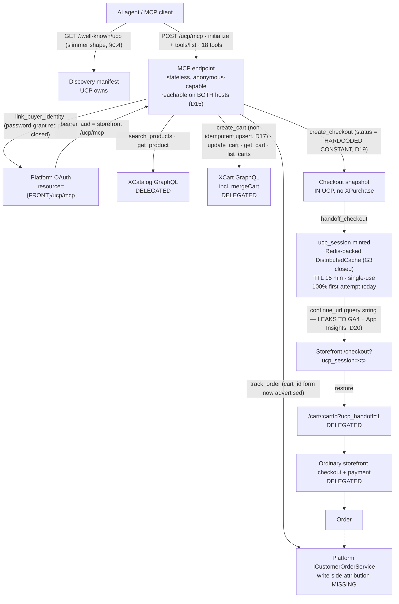

# UCP — Universal Commerce Protocol adapter — domain map

> Refresh with `/qa-domain-map ucp`. This file answers **what the feature is and where its surfaces
> are**. It does **not** carry behavioural rules — those are `BL-*` in `oracles/business-logic.md`,
> and for this domain there are **still none** (§4, §5 G5) — and it can **never ground an assertion as
> `{DOC}`**. Pointer index plus surface inventory: it says *where to look* and *what exists*, never
> *what correct looks like*.

**Every claim carries a verdict.** `CONFIRMED` = observed live or read at source this pass ·
`DRIFT` = prior art says otherwise and prior art is wrong · `MISSING` = documented, does not exist ·
`UNVERIFIED` = not established, and **not** to be treated as true.

> ## ⚠ STILL MID-CHANGE — read this before citing any row
> All three PRs are still **OPEN and unmerged** (re-checked this pass): vc-module-ucp#7 @ `612c78b`
> (was `1881623` at rev 1) · vc-platform#3108 @ `b6ef79b0` (was `016f4d9`) · vc-frontend#2467 @
> `195127f5` (was `8f0bff2`). Deployed build moved with them: Platform `3.1072.0-pr-3108-b6ef` (was
> `3.1071.0-pr-3108-016f`) · UCP `3.1006.0-pr-7-612c` (was `…-1881`) · storefront
> `2.59.0-pr-2467-1951-195127f5` (was `2.58.0-pr-2467-8f0b`). **Re-read every row again after these
> merge or revert** — several rows below describe behaviour that exists only on these heads, and one
> row this pass (D2) shows exactly how a correct fix can look like "NOT FIXED" if you measure it
> against the wrong intermediate build (see §6).

---

## §0 — Changed since rev 1 (2026-09-17 → 2026-09-23, 6 days)

This is not a trickle of amendments — the ground moved. Read this section before trusting any single
row below in isolation.

1. **A real value-chain suite now exists.** Rev 1's headline finding was "23 cases, all telemetry, 0
   touching the chain." That is no longer true: suite `102` (36 cases, `UCPA-001..036`) exercises
   discovery, anonymous shopping, B2C/B2B identity linking, cart attribution, contract pricing,
   assortment scoping, handoff mint/restore reliability, single-use, TTL, tamper, envelope shapes,
   stock boundaries and the merge path. Today's machine-lane run: **31 pass / 0 fail / 1 blocked (by
   design)**. Suite `094` (23 cases) still exists but its manifest `domain` field is now
   `observability`, not `ucp` — **it no longer counts toward this domain's coverage at all**, which
   changes §4's basis.
2. **Four of rev 1's eight gaps are CLOSED.** G1 (authenticated/org handoff never exercised), G2 (org
   context / contract pricing undecidable), G3 (D3's cross-replica cache-miss cause), G4 (TTL expiry
   never observed) — each closed this week with a citable mechanism, not a guess. Detail in §5.
3. **D2 (advertised vs issued handoff host) is RESOLVED, and the resolution is itself a cautionary
   tale.** The fix (`IUcpPublicOriginResolver`) shipped, was measured "NOT FIXED" by a QA re-test
   against an intermediate build (`pr-7-9bc9`), and then measured FIXED against the build that actually
   deployed (`pr-7-612c`) two hours later. Both measurements were honest and both were about different
   artifacts wearing the same PR number. See §6.
4. **The discovery manifest's own SHAPE changed**, not just its values. `/.well-known/ucp` no longer
   carries `resource` / `authorization_server` / `storefront_origin` / `handoff_url_template` at all —
   those moved to the RFC 9728 protected-resource document and to `get_store_capabilities`
   respectively. Suite `102`'s own authoring note records this directly: an earlier form of `UCPA-002`
   "asserted four fields that have never existed on this build and failed on all four." Any rev-1 claim
   about the bare manifest's field list is **DRIFT** unless restated below.
5. **D1 got WORSE, not better.** Rev 1 framed it as a cross-endpoint disagreement (manifest empty,
   two other surfaces populated). This pass — and independently, `SBTM-VCST-5378-2026-09-22.md` O5 /
   `coverage.md` I3 — found the contradiction lives **inside one response**: `get_store_capabilities`
   itself carries `ucp.payment_handlers: {}` (empty) *and* a top-level `payment_handlers: [3 items]` in
   the same payload. Confirmed independently, live, this pass (Part 3 below). **RESTATE, do not close.**
6. **Two new security-relevant findings, both this week.** VCST-6053 (HIGH, filed 2026-09-22, open): the
   handoff token travels in a URL query string and leaks live to Google Analytics and to Virto's own
   App Insights telemetry — new **D20**. And the checkout `status` field is confirmed by source read to
   be a hardcoded constant with no approval/threshold logic behind it at all — a finding the suite's
   own authors already expected this map to carry as "D-checkout-status" — new **D19**.
7. **Two new soft-enforcement findings from stock-boundary testing** (`UCPA-030..036`, Archetype
   BOUNDARY/PARITY): `create_cart` silently drops an unaddable line under a "success" envelope (new
   **D16**, generalizes SBTM O7) and stock enforcement is applied **per line entry**, not per
   consolidated cart quantity — splitting an over-stock request across two entries bypasses the hard
   refusal entirely (new **D18**). Plus a confirmed non-idempotent upsert semantic for authenticated
   `create_cart` (new **D17**, SBTM O12).
8. **A three-way tool/capability-count mismatch, new this pass**: `tools/list` returns 18 (including
   `logout_buyer`), `get_store_capabilities.mcp_tools` advertises 17 (missing `logout_buyer`), and the
   MCP `initialize` instructions prose enumerates 16 (missing **both** `link_buyer_identity` *and*
   `logout_buyer` — while the same prose repeatedly instructs the client to call
   `link_buyer_identity`). New **D14**.
9. **`BL-UCP` (business-logic.md Domain 25) is now formally declared** (2026-09-17) — but still
   deliberately EMPTY. Four strong candidates are staged and evidenced (`BL-AUDIT-2026-09-22.md`); all
   four are **UNGROUNDED** this run under the "docs-absent is a missing axis, not N/A" rule, because
   UCP has not shipped, not because the rules are undocumentable. G5 persists, sharper.
10. **`domain-checklists.md` gained §36** (UCP — Agentic Commerce, 42 items) — a new artifact this map
    did not have to build from scratch at rev 1.
11. **This refresh RESTORES rev 1's per-tool hole/deliberate breakdown rather than dropping it.** Rev 1's
    §4 separated deliberate absences from holes; this pass's first draft enumerated only what suite 102
    covers and never what it doesn't — the exact silent-blank failure §4's own gate exists to catch.
    Re-derived below, exhaustively: **8 of 18 MCP tools are never called by any case in suite 102**, and
    — a distinct, newly-derived finding, not a restatement — **the 19 REST-declared operations have a
    different and narrower gap shape of their own**, which does not mirror the tool-level one.

---

## §1 — Purpose and value chain

**Purpose (declared, quotable — `CONFIRMED` at source, unchanged):** vc-module-ucp `README.md:10` —

> "`VirtoCommerce.UCP` is a protocol adapter module. It does not replace the Catalog, Cart, Orders,
> XAPI, Store, or Marketing modules. It provides a compact UCP-oriented HTTP surface for external
> clients while delegating commerce behavior to existing Virto Commerce modules."

**Where the purpose is still NOT stated:** neither published guide carries UCP at all (§3 D8,
re-queried live this pass — unchanged).

### The chain

UCP **owns** links 1, 2, 5 and 6 and **delegates** everything else — unchanged in shape from rev 1.
What changed is how much of this chain is now actually exercised: rev 1 could source only links 1, 3,
4, 6-7 live; this pass (via suite `102`) sources every link **except** 8 (payment) and the write half
of 9 (order attribution, still `MISSING` — see coverage.md §3a).

| # | Link, in the customer's words | Mechanism | Owner | Rev-2 status |
|---|---|---|---|---|
| 1 | An AI agent finds out this store can be shopped | `GET /.well-known/ucp` (now a SLIMMER shape — §0.4) or MCP `get_store_capabilities` | **UCP** | `CONFIRMED` live both hosts, byte-identical |
| 2 | The agent shops **anonymously**, or links the buyer's account | `link_buyer_identity`; **the automated recipe this repo uses is a direct Platform `password` grant** (`storeId` camelCase + `resource={{FRONT_URL}}/ucp/mcp`), not a browser-driven RFC 9728 challenge round trip — see G1/G10 below for the distinction | **UCP** (challenge) + Platform (OAuth) | `CONFIRMED` live (password-grant path, 100% of suite 102's authenticated cases today); the browser challenge path is developer-reported working (vc-platform#3108, vc-frontend#2467 PR bodies) but not independently re-driven this pass (G10) |
| 3 | The agent finds products | `search_products` / `get_product` → XCatalog GraphQL in-process | delegated | `CONFIRMED` live + suite |
| 4 | The agent builds a cart | `create_cart` / `update_cart` / `get_cart` / `list_carts` → XCart. `create_cart` is a **non-idempotent upsert** into the buyer's single default cart when authenticated (new **D17**) | delegated | `CONFIRMED` live + suite, sharpened |
| 4b | An anonymous cart becomes the signed-in buyer's cart | `update_cart` with the saved anonymous `buyer_id` under an authenticated token → XCart `mergeCart` | delegated (guarded by UCP) | `CONFIRMED` — `UCPA-014`: merge, then idempotent no-op replay, then source cart 404s |
| 5 | The agent prepares checkout | `create_checkout` composes a snapshot in UCP; `checkout.id == cart_id`. **`status` is a hardcoded constant, not an approval evaluation** (new **D19**) | **UCP** | `CONFIRMED` at source, confirmed by a live $5,133.32+ org cart still returning `incomplete` (rev-1 §7, carried forward) |
| 6 | The agent hands the buyer a link to pay | `handoff_checkout` / `checkout_and_handoff` mint a `ucp_session` into `IDistributedCache`, keyed by SHA-256 hash. **This link now travels the query string into Google Analytics and Virto's own telemetry while still LIVE** (new **D20**, VCST-6053) | **UCP** | `CONFIRMED` — 74 GA hits + 141 App Insights rows for one token, HAR-evidenced |
| 7 | The buyer opens the link and sees their cart | Storefront `/checkout?ucp_session=<t>` → guard → restore → `/cart/:cartId?ucp_handoff=1` | storefront | `CONFIRMED` live this pass (same "expired" toast text on a bogus token; suite confirms the success path 31/32 today) |
| 8 | The buyer pays | Ordinary storefront checkout | delegated | unchanged, out of scope |
| 9 | The agent tells the buyer what happened to the order | `track_order` by id/number/`cart_id` | delegated | `cart_id` form now formally advertised in discovery (D7 partially resolved); write-side attribution still `MISSING` — coverage.md §3a |

### Reverse edges — what undoes a forward effect

| Forward effect | Reversal | Verdict |
|---|---|---|
| `ucp_session` minted | TTL (default 15 min, floored at 1) **and** single-use — removal only after a *successful* restore. **Now measured 100% first-attempt reliable** (was 53% on 2026-09-17) | `CONFIRMED` — G4 CLOSED, G3 CLOSED (see §5) |
| A minted `ucp_session` | **Still no revoke/cancel API.** `logout_buyer` reports `logged_out:true` but a handoff minted before it remains fully redeemable after it (`UCPA-026`, confirmed live 2026-09-23). Four plausible revoke-shaped routes (`DELETE .../handoff/{tok}`, `.../revoke`, `.../cancel`, `.../invalidate`) all 404 (SBTM O1) | `CONFIRMED` — ABSENT IN PRODUCT, a finding, not a blank |
| The token **while still valid** | **Leaves the browser in cleartext to a third party.** Nothing "reverses" this — VCST-6053 is a leak, not a state transition, and it is the top new finding this pass | `CONFIRMED` — new, filed, open |
| Anonymous cart merged into a buyer cart | `deleteAfterMerge: true`, not reversible; replay is an idempotent no-op | `CONFIRMED`, unchanged |
| Cart / order created via UCP | Ordinary Cart/Order module lifecycle | `CONFIRMED`, unchanged |

### Actors

| Actor | Can do | Verdict |
|---|---|---|
| **AI agent / MCP client** | Everything anonymously with no credential; with a Platform password-grant bearer, everything as a linked B2B or B2C buyer, decisively including contract pricing and assortment scoping (new fixtures, §5 G2 CLOSED) | `CONFIRMED` live — every case in suite 102 exercised this today |
| **Anonymous buyer** | Represented by a synthetic `ucp-anonymous-<32hex>` id; receives a `continue_url`; lands on the storefront cart | `CONFIRMED` live |
| **Authenticated B2C buyer** | Linked with no `organization_id` invented (`UCPA-004/008`); cart attributed to the buyer, never an org | `CONFIRMED` live — **closed rev-1's `UNVERIFIED` mark** |
| **B2B org buyer** | `organization_id` derives only from the token (`UCPA-005`); assortment scoping and contract pricing are now decisively provable (`UCPA-016/017`); org context survives the handoff, verified by an actual contract-priced storefront line (`UCPA-018`) | `CONFIRMED` live — **closed rev-1's `UNVERIFIED` mark (G2)** |
| **Merchant / Platform admin** | Still exactly one control: **Settings → UCP → General → UCP Enabled**, still gates nothing (D9, unchanged, re-confirmed live this pass) | `CONFIRMED` live |
| **Storefront** | Consumes the handoff, owns every buyer-facing error message; the "expired" toast text is byte-identical to rev 1 | `CONFIRMED` live this pass |

---

## §2 — Surface inventory per layer

### §2a — Back office (Admin SPA)

**Still NO UCP back-office UI. Re-confirmed live this pass**, logged in as `admin`, Platform build
`3.1072.0-pr-3108-b6ef` (matches the pinned suite build exactly).

- **Main menu, live 2026-09-23: 20 items, identical to rev 1's list** — Home · Loyalty missions ·
  Marketing · Loyalty · Contacts · Catalog · Orders · Notifications · Push Messages · Pricing · System
  Operations · Tasks · Sales Reps · Returns · Quotes · Settings · Security · Stores · Developer tools ·
  More. **No UCP entry.**
- **Settings → UCP → General → `UCP Enabled`** — the only control, re-confirmed present, unchanged in
  position and label. (Its current on/off value was not re-read this pass — low stakes, since D9 says
  it gates nothing either way.)
- **Security → permissions, group `UCP`** (`ucp:access/create/read/update/delete`) — carried forward
  from rev 1, **not independently re-clicked this pass** (`UNVERIFIED-live-this-pass`, low risk given
  no code path was found reading them at rev 1 or since).

**Not manageable from this layer — unchanged from rev 1** (agent/API-key registry, outstanding handoff
sessions, handoff TTL/storefront origin, observability knobs, per-store UCP enable/disable): see rev 1
table, none of it has an Admin surface today.

### §2b — Storefront (vc-frontend)

**Still no `/ucp/*` route.** Re-confirmed live this pass:

| Address | What it is | Verdict |
|---|---|---|
| `/checkout/:cartId?` + `?ucp_session=<token>` | The handoff entry point, no `requiresAuth` | `CONFIRMED` live — unchanged |
| `/cart` + the "expired" toast | Where a 400 restore lands | `CONFIRMED` live this pass — **verbatim identical toast text** to rev 1: *"This checkout link has expired, has already been used, or is unavailable in this tab. Request a new checkout link from your shopping assistant."* |
| `/cart/:cartId?ucp_handoff=1` | Where a successful restore lands | `CONFIRMED` — suite 102 today, 31/32 machine-lane pass; not independently re-walked in-browser by this map pass |
| `/oauth/authorize` | Anonymous hit → `/sign-in?returnUrl=/oauth/authorize` | `CONFIRMED` live this pass, byte-identical to rev 1's behaviour |
| `/sign-in?returnUrl=...`, `/cart` | 401/403 landing | unchanged |

Storefront footer version confirmed live: `Ver. 2.59.0-pr-2467-1951-195127f5`, matching the pinned
build exactly.

**One correction of record, from PR #2467's own body:** *concurrent restores now share one request,
successful restores are cached, and failed requests remain retryable* — a client-side de-duplication
behaviour this map did not carry at rev 1. Not independently re-tested this pass; noted as
developer-reported.

### §2c — API / MCP (the primary surface)

**`GET /.well-known/ucp`** — re-confirmed live this pass, **byte-identical on both hosts**. The manifest
**SHAPE changed** since rev 1 (§0.4): it now carries only `ucp.version`, `status`, `services`,
`capabilities`, `payment_handlers` — the `resource`/`authorization_server`/`storefront_origin`/
`handoff_url_template` fields rev 1 recorded here are **gone from this document entirely**, moved to
the RFC 9728 protected-resource doc and `get_store_capabilities` respectively. `payment_handlers: {}`
— still empty. **D1 still holds, restated below.**

**`POST /ucp/mcp`** — confirmed reachable, anonymously, on **BOTH** hosts this pass (new **D15**):
`initialize` and `tools/list` succeed identically whether called against `{{FRONT_URL}}/ucp/mcp` or
`{{BACK_URL}}/ucp/mcp`. Only *authenticated* calls are host-locked to the storefront (the Platform
host's own OAuth app only grants `rsrc:` for the storefront resource — §6). MCP transport
`protocolVersion` is now **`2025-06-18`** (was `2025-11-25` at rev 1 — a value drift, not re-derived
further this pass).

**The tool surface — now generated at `.claude/knowledge/api/ucp-schema.md`, cite it, do not
re-transcribe it.** Three counts disagree in one session (new **D14**):

| Surface | Count | What's missing |
|---|---|---|
| `tools/list` | **18** | — (ground truth) |
| `get_store_capabilities.mcp_tools` | **17** | `logout_buyer` |
| `initialize.instructions` prose "Available tools:" line | **16** | `link_buyer_identity` *and* `logout_buyer` — while the same prose repeatedly instructs the client to call `link_buyer_identity` before buyer-sensitive operations |

`logout_buyer` (the 18th tool) also carries **no `capability` field** in the operations list, unlike
all 17 others (coverage.md I8). It takes no arguments, returns `logged_out: true`, and — per its own
description and SBTM O1/`UCPA-026` — revokes the Platform OAuth authorization **and its refresh
tokens, including other sessions**, while leaving any already-minted handoff fully redeemable. It is
the widest-blast-radius tool on the surface and the least-tested (coverage.md §4).

**REST routes** — cite `.claude/knowledge/api/ucp-schema.md`'s "Declared operations" table (19 rows,
generated, `ucp:schema:check` clean) rather than re-deriving it. Two disagreements confirmed live this
pass:

- `PATCH /ucp/v1/carts/{cartId}` is **still** a real, reachable handler (`400 invalid_request` on an
  anonymous call with no `buyer_id`) and **still not advertised anywhere** in discovery — D7's PATCH
  half is unchanged.
- `GET /ucp/v1/orders?cart_id={cartId}` **is now formally advertised** as its own named operation
  (`track_order`, capability `order`, "After hosted checkout, track the created order by the original
  cart_id") in both the live `get_store_capabilities` payload and the generated `ucp-schema.md` — **D7's
  self-contradiction on this route is RESOLVED.**

`GET /ucp/v1/checkouts/{id}/payment-handlers` on a fabricated, never-existing `checkout_id` still
returns **`200`** with the identical static 3-handler list — re-confirmed live this pass, unchanged.

**D1, restated and sharpened (new evidence this pass, confirming SBTM O5 / coverage.md I3):** the
contradiction is not merely cross-endpoint. A single `get_store_capabilities` response carries **both**
`ucp.payment_handlers: {}` (nested, empty object) **and** a top-level `payment_handlers: [3 items]`
(`hosted_checkout` available; `native_card`/`google_pay` not) — captured live this pass, one call, one
payload.

**Stores exposed via anonymous discovery, live this pass:** `B2B-store`, `Electronics`, `QA-STORE`,
`test_del` ("Test delete store"), `TS-FULL-001` — all five report `is_default: false`. `test_del`'s
name suggests leftover test data still resolvable through an external-facing MCP surface; not a
security defect, worth a data-hygiene look (Part 3, Step-5 routing).

**Money is in minor units**, unchanged, re-confirmed live.

---

## §3 — Where the layers DISAGREE

**Ids are a citation contract — never renumbered. D1–D13 carried forward from rev 1 with verdicts
updated in place; D14–D20 are new this pass.**

| # | Disagreement | Verdict |
|---|---|---|
| **D1** | **`payment_handlers` disagrees inside a SINGLE response, not only across endpoints.** `get_store_capabilities` itself carries `ucp.payment_handlers: {}` (empty) *and* a sibling top-level `payment_handlers: [3]` (populated) in one payload. `/.well-known/ucp` still shows only the empty form. **RESTATE, do not close** (SBTM O5, coverage.md I3, re-confirmed independently live this pass) | `CONFIRMED`, sharpened |
| **D2** | **RESOLVED.** `IUcpPublicOriginResolver` now resolves ONE origin (`UCP:PublicOrigin` → store `SecureUrl`/`Url` → request origin) and feeds it into the manifest, the OAuth-metadata endpoints, and `HasExpectedAudience` alike. Walked live end to end starting from the platform host: manifest → 401 challenge → protected-resource metadata → AS metadata → token at the advertised resource → `link_buyer_identity` → 200, correct buyer + org, no host mixing. **Residual risk, explicitly recorded at the fix's own close-out:** `UCP:PublicOrigin` is not set as a Platform Setting on vcst-qa — the origin currently resolves from the store's own `Url`, so a deployment whose store URL is unset or wrong could reproduce the original symptom. See §6 for the "NOT FIXED" verdict that was correct for a different build | `CONFIRMED` fixed + residual risk named |
| **D3** | **RESOLVED (symptom), root cause developer-reported.** First-attempt anonymous-handoff success measured at **100% (10/10 today, 17/17 on 2026-09-22)**, up from 53% (17/32) on 2026-09-17. vc-platform#3108's own PR body reports a Redis-backed `IDistributedCache` (`AddCaching` registers Redis when `ConnectionStrings:RedisConnectionString` is set) plus "local two-node handoff checks passed in both directions... Handoff also survived restarting both nodes" and "exactly one successful concurrent restore." **This repo did not independently inspect vcst-qa's own Redis wiring** — the root-cause attribution rests on the PR's self-report, corroborated (not proven) by our own 100% measured reliability | `CONFIRMED` symptom, `source-only` (developer-reported) root cause |
| **D4** | **Unchanged — the 401-retry design was always sound; D3's failure was never in it.** Carried forward verbatim from rev 1 | `CONFIRMED`, unchanged |
| **D5** | **Still holds, all four vocabularies re-confirmed live this pass, one value drifted.** Discovery: `ucp.version = "2026-04-08"`, `com.virtocommerce.ucp.*` capability names. `get_store_capabilities`: same, plus sibling `ucp_version: "1.0"`. The `payment-handlers` REST endpoint (checked live this pass, not the catalog endpoint rev 1 checked): `ucp.version: "1.0"`, capability named `dev.ucp.shopping.checkout` — the SAME `dev.ucp.shopping.*` vocabulary rev 1 found on a different endpoint, now observed on a different one. MCP transport protocol is now `2025-06-18` (was `2025-11-25` — value drift, not re-derived further) | `CONFIRMED`, refined |
| **D6** | **Still holds, re-confirmed live TODAY via `UCPA-027`** and independently via SBTM O6: `create_checkout` → `{ucp, checkout, messages}` (no url anywhere) · `handoff_checkout` → double-wrapped `{result: {checkout: {continue_url}}, last_checkout, next_step_after_payment}` · `checkout_and_handoff` → `continue_url` at **top level** *and* `handoff.checkout.continue_url` (same url, verified by direct comparison, not by inference). A client reading one path uniformly gets `undefined` from the other two. Now formally documented as "THE ENVELOPE RULE" in `graphql-test-cases-runner.md`, having cost 7 of 10 non-passing cases in an earlier run | `CONFIRMED`, unchanged shape, now with a documented authoring rule |
| **D7** | **Half resolved.** `GET /ucp/v1/orders?cart_id=` is now formally advertised as its own named operation in both `get_store_capabilities` and the generated `ucp-schema.md` contract — the prior self-contradiction on this route is gone. `PATCH /ucp/v1/carts/{cartId}` remains real (confirmed live this pass, reaches the handler with a business 400) and remains undocumented anywhere in discovery | `CONFIRMED`, `orders?cart_id=` half RESOLVED, PATCH half unchanged |
| **D8** | **Unchanged, re-queried live this pass.** `PlatformUserGuide` and `StorefrontUserGuide` both return nothing on UCP; the general corpus still returns **onX** (Order Network eXchange) as the publicly marketed MCP-based agentic-commerce adapter, same URL, same quoted flow ("AI Agent → MCP → onX Server → Virto Adapter → xOrder/xCatalog") | `CONFIRMED`, unchanged |
| **D9** | **Unchanged, re-confirmed live this pass.** `UCP.Enabled` still renders in Settings, still not independently confirmed to be read by any code path this pass (carried forward from rev-1 source read); toggling it would not disable anything as of rev 1's finding | `CONFIRMED` at rev 1, `UNVERIFIED-live-this-pass` for the "nothing reads it" half specifically |
| **D10** | **Not re-derived this pass.** Carried forward: the module's own README states a Platform floor of `3.1039.0` while the manifest pins a `3.1066.0-alpha…` prerelease. Plausible this still holds given the PRs remain unmerged and prerelease-pinned, but not independently re-read this pass | carried forward, `UNVERIFIED-live-this-pass` |
| **D11** | **Unchanged, re-confirmed live this pass.** No UCP storefront routes exist; the handoff still rides `/checkout/:cartId?` plus the query-param protocol; `/oauth/authorize` is still the one genuinely new route, re-walked live this pass with the identical anonymous-redirect behaviour | `CONFIRMED`, re-confirmed |
| **D12** | **Unchanged, re-confirmed live this pass on both hosts.** `/.well-known/oauth-protected-resource` (bare) → 404 on both hosts; the path-suffixed `/.well-known/oauth-protected-resource/ucp/mcp` → 200 on both hosts, byte-identical | `CONFIRMED`, re-confirmed |
| **D13** | **Half fixed, half unchanged.** The legacy `X-Buyer-User-Id`/`X-Buyer-Organization-Id` header advertisement is now genuinely gone from discovery — `headers.buyer_context` is an empty array `[]` (confirmed live this pass; those headers are still *actively rejected* with 403 when sent, per `UCPA-019/024`, so the invariant those headers threaten is still enforced). `headers.agent_api_key: "X-Agent-Api-Key"` is still advertised and still read by nothing — confirmed this pass via a fresh GitHub `search_code` (1 hit total, the constant declaration, no reader) | `CONFIRMED`, half-fixed half-open (G6) |
| **D14** | **NEW — a three-way tool/capability-count mismatch.** `tools/list` (18) vs `get_store_capabilities.mcp_tools` (17, missing `logout_buyer`) vs `initialize` prose (16, missing `link_buyer_identity` AND `logout_buyer` — while instructing the client to call the former). `logout_buyer` also carries no `capability` field, unlike every other operation. Confirmed live this pass, three separate calls, one session | `CONFIRMED` live |
| **D15** | **NEW — the MCP transport itself is host-agnostic; only token minting for an authenticated call is host-locked.** `initialize`/`tools/list` succeed identically on `{{BACK_URL}}/ucp/mcp` and `{{FRONT_URL}}/ucp/mcp`. This refines rev 1's actor table, which read as if the whole transport were storefront-only — only the OAuth resource grant is | `CONFIRMED` live, both hosts, this pass |
| **D16** | **NEW (generalizes SBTM O7) — `create_cart` reports overall `success` while silently dropping a line it could not add.** A configurable product requiring a config section, and a deliberately all-zero `product_id`, both return `ucp.status: "success"`, an empty `cart.line_items`, and the failure ONLY in nested `messages[]` (`CONFIGURATION_SECTION_REQUIRED` / `CART_PRODUCT_UNAVAILABLE`). `search_products` reports the configurable parent as ordinary `product_type: "Physical"`, so the failure is not foreseeable from the catalog listing | `CONFIRMED` live, `UCPA-025` |
| **D17** | **NEW (SBTM O12) — authenticated `create_cart` is a non-idempotent upsert into the buyer's SINGLE default cart.** Two identical calls return the SAME `cart.id` with the line quantity raised (not doubled-as-a-new-cart, not held at the original quantity) — an agent "starting fresh" silently appends to whatever the buyer already had in their cart | `CONFIRMED` live, `UCPA-028` |
| **D18** | **NEW — stock enforcement (`PRODUCT_FFC_QTY`) is applied per REQUESTED LINE ENTRY, not per consolidated per-product cart quantity.** One `create_cart` call carrying the SAME product across two line entries whose quantities sum to one-over-stock — or two sequential authenticated calls using the documented upsert semantics (D17) to the same effect — both land on a materially SOFTER path than a single over-limit entry: the line is created/raised to the over-stock quantity, top-level and cart-level `messages[]` stay EMPTY, and the only signal is a line-level `PRODUCT_QTY_CHANGED` message marked `recoverable`. Framed as OBSERVED, not asserted-wrong — no doc says composition must be rejected identically — but it is a genuine at-risk path for `BL-CART-002` (see G9) | `CONFIRMED` live, twice independently, `UCPA-035` |
| **D19** | **NEW — checkout `status` is a hardcoded constant, not an approval evaluation** (the row `UCPA-035`'s own authoring notes already expect this map to carry, citing it as "D-checkout-status"). Source: `UcpCheckoutService.cs` — `CreateCheckout`/`UpdateCheckout` set `incomplete`; `HandoffCheckout`/`RestoreHandoff` set `requires_escalation` — unconditionally, with no approval, threshold or spending-limit logic anywhere in the service. A $5,133.32+ org cart returned `incomplete` regardless. Approval rules and payment terms remain the sole responsibility of the existing storefront checkout, which UCP never reaches on this path (`BL-B2B-004`: the platform has no native per-order spending limit at all — approval is quote-based) | `CONFIRMED` at source, carried and formalized from rev-1 §7 |
| **D20** | **NEW — the live handoff token leaks in cleartext to Google Analytics and to Virto's own App Insights telemetry, while still valid.** `handoff_url_template`/`continue_url` carry `ucp_session` as a **query-string** parameter. Opening the link fires the storefront's GA4 tag, which beacons document location/referrer (`dl`/`dr`) — **including the raw token** — to `region1.google-analytics.com`; Application Insights auto-collects that same outbound call as a dependency, retaining it 90 days. Measured: one HAR session, 74 GA hits + 19 storefront hits carrying the token; a 6-hour App Insights window, 141 rows containing `ucp_session` plus 186 URL-encoded variants. **The token is still LIVE when it leaves** — the anonymous-first/401-retry restore design means a *failed* restore does not consume it, so an abandoned handoff link stays valid in three parties' stores for its whole TTL. Filed **VCST-6053, High, open, 2026-09-22** | `CONFIRMED` live, HAR + App Insights evidence, filed |

---

## §4 — Coverage shape

**Basis, corrected out loud:** rev 1 counted 23 cases, all in `094`, all telemetry, 0 touching the
chain. That basis has **changed on two axes since 2026-09-17**: (a) suite `102` was authored and now
carries 36 chain-touching cases, and (b) `094`'s own manifest `domain` field was reassigned from `ucp`
to `observability` — **so `094` no longer counts toward this domain's coverage at all**, regardless of
its content. Basis for the table below: `config/test-suites.json` (both suite entries, read in full
this pass) + a full parse of `regression/suites/Backend/ucp/102-ucp-agentic-commerce.csv` (36 rows) +
today's machine-lane run `reports/regression/REG-2026-09-23-M7/suite-101-results.machine.json`
(written before the suite was renumbered 101 -> 102 on 2026-09-23 — main had already taken 101 for
Platform Sign-in Log; the artifact keeps the name the run gave it).

| Suite | Domain (manifest) | UCP-relevant | Total | Status |
|---|---|---|---|---|
| `102` UCP Agentic Commerce | `ucp` | **36** of 36 | 36 | 34 `Automated`, 2 `Draft` (`UCPA-013` blocked pending an isolated guest-checkout stand; `UCPA-029` still Draft) |
| `094` UCP Observability | **`observability`** (reassigned, not `ucp`) | **0** — out of scope for this domain now | 23 | unchanged from rev 1 otherwise |

**Today's live run (`REG-2026-09-23-M7`, machine lane, 32 of 36 cases — the 4 browser-lane cases run
separately):** **31 pass, 0 fail, 1 blocked**. The one blocked case (`UCPA-021`, TTL expiry) is blocked
**by design** in a normal batch run — it needs a real ~16-minute wait that exceeds the runner's default
`GQL_MAX_WAIT_SECONDS` ceiling (300s); proven separately at a raised ceiling as **5/5 PASS** (see §5,
G4 CLOSED). This is a working suite, not an aspirational one.

**What suite 102 covers that suite 094 never did (all first-time-ever for this domain, this week):**
the full handoff chain end to end (`UCPA-001`, the suite's own designated "must pass for the feature to
be considered working" case) · anonymous shopping with no credential · B2C and B2B identity linking ·
cart attribution for both personas · checkout-snapshot integrity · handoff-mint host parity ·
first-attempt restore reliability (both anonymous and authenticated, N≥10 and N≥5 respectively) ·
assortment scoping and contract pricing against dedicated fixtures · org context surviving the handoff
· cross-buyer and cross-identity restore refusal · single-use and TTL enforcement · tamper resistance ·
argument validation · the anonymous-to-authenticated merge · six net-new SBTM-sourced scenarios
(silent-drop, revocation-absence, envelope-shape, upsert-non-idempotency, arrival-shape) · a five-case
stock-boundary block (availability contract, at-limit, one-over, absurd-quantity, negative/zero,
per-line-entry-split, and the reachable half of a stock-conflict scenario).

### §4a — Per-tool coverage: 8 of 18 MCP tools are never called, and none of the eight is deliberate

**Basis — derived, not transcribed, and self-checked:** a full-text scan of
`regression/suites/Backend/ucp/102-ucp-agentic-commerce.csv` for every `[MCP-OP <label>]` marker,
resolving each to the tool name on its following non-blank line. **137 markers found, 137 resolved to
one of the 18 tools `ucp:schema:check` declares, zero orphaned** — an exhaustive count, not a sample.
(A first-pass line-anchored version of this same method undercounted by matching only markers that sit
alone on their own CSV line, missing ones embedded at the tail of a wrapped multi-line cell — e.g.
`get_store_capabilities` reads as called once with that method, twice with the exhaustive one. The
table below uses the exhaustive count.)

| Tool | Capability | Calls in suite 102 | Verdict |
|---|---|---|---|
| `create_cart` | cart | 43 | covered |
| `search_products` | catalog | 38 | covered |
| `checkout_and_handoff` | checkout | 23 | covered |
| `link_buyer_identity` | identity_linking | 17 | covered |
| `logout_buyer` | *(none declared)* | 5 | covered |
| `update_cart` | cart | 3 | covered |
| `create_checkout` | checkout | 3 | covered |
| `get_store_capabilities` | profile | 2 | covered |
| `get_cart` | cart | 2 | covered |
| `handoff_checkout` | checkout | 1 | covered (thinly — see G8, only the two-step path, never opened in a browser) |
| `get_product` | catalog | **0** | **HOLE** — catalog is exercised only through `search_products`; no case ever reads a single product by id |
| `list_carts` | cart | **0** | **HOLE** — coverage.md names this precisely: "the buyer-scoping oracle: it is how you prove one buyer cannot see another's carts" — nothing proves that today |
| `update_checkout` | checkout | **0** | **HOLE** — "the only way to set buyer/address data on a checkout; every address-dependent handoff depends on it" (coverage.md) |
| `get_payment_handlers` | checkout | **0** in-suite | **HOLE in-suite.** Its only prior-art scenario tie (TS-11, PO/invoice) is itself unreachable on this env (coverage.md §3d). Independently confirmed live THIS PASS, outside the suite (§2c) — static 3-handler list, no data access, reachable even on a fabricated `checkout_id` — but that is a domain-map probe, not suite coverage |
| `track_order` | order | **0** in-suite | **HOLE, and adjacent to a deeper product gap.** Its only scenario tie (TS-02, order attribution) is unreachable — no tool writes an attribution artifact at all (§1 link 9, coverage.md §3a). The `?cart_id=` route form was independently probed live THIS PASS (§2c, D7) — real, reachable, returns a business 400 — again a domain-map probe, not a suite case; even a bare read-by-cart_id is untested by any case |
| `list_countries` | geography | **0** | **HOLE** — whole geography capability, 0 of 3 tools covered |
| `resolve_country` | geography | **0** | **HOLE** — same capability |
| `list_regions` | geography | **0** | **HOLE** — same capability. Coverage.md flags all three geography tools together as the single cheapest coverage win available: `handoff_checkout` refuses a physical-goods handoff until `shipping_address` (and, where the country has regions, a resolved `region_id`) is set, so a country/region-resolution failure would currently surface only as an opaque handoff refusal |

**None of the eight is Deliberate.** `coverage.md`'s own gap analysis ("direction B: tools no scenario
exercises") frames all eight as unintentional holes, and no suite note anywhere in `102` states a reason
to skip any of them on purpose — unlike, say, §2a's Admin-UI absence, which IS deliberate (there is no
UI to test). An area left out on purpose and an area nobody got to must not read the same, and here
they don't: this is eight rows of the latter.

### §4b — The 19 REST operations do NOT have the same shape of gap. They have a narrower, different one.

**This does not mirror §4a — verified independently, not assumed.** A full-text scan of every literal
`[REST-OP]` request line in the same CSV (method + path, host tokens normalized) returns exactly five
distinct patterns, with these counts: `GET {HOST}/.well-known/ucp` (2) ·
`GET {HOST}/.well-known/oauth-protected-resource/ucp/mcp` (2) · `POST {HOST}/ucp/mcp` (2, the raw
JSON-RPC transport calls in `UCPA-002`) · `POST {HOST}/ucp/v1/internal/handoff/restore` (22) ·
`DELETE {HOST}/ucp/v1/internal/handoff/{token}` (1, `UCPA-026`'s revoke probe — expected and confirmed
404, not one of the 19 declared operations at all). **Not one literal HTTP request anywhere in suite
102 ever targets `/ucp/v1/carts*`, `/ucp/v1/catalog/*`, `/ucp/v1/checkouts*`, `/ucp/v1/geography/*` or
`/ucp/v1/orders*`** — every case that touches those areas does so exclusively through the MCP tool
wrapper (§4a).

Sorting the 19 declared operations (`.claude/knowledge/api/ucp-schema.md`) against that fact:

| Shape | Operations | Count | Verdict |
|---|---|---|---|
| Declared method `MCP` — no REST form exists to test | `checkout_and_handoff`, `link_buyer_identity` | 2 | not a REST hole — fully covered via their only transport (23 + 17 tool calls) |
| REST-only — no MCP tool wraps it | `storefront_restore` (`POST /ucp/v1/internal/handoff/restore`) | 1 | **the single most heavily REST-exercised operation in the whole suite** — 22 literal calls |
| Has a REST verb, AND is literally REST-exercised | `get_store_capabilities` (`GET /.well-known/ucp`) | 1 | covered, both as a literal REST call (`UCPA-002`, both hosts) and as an MCP tool |
| Has a REST verb, exercised ONLY via its MCP wrapper — **never once as a literal HTTP request** | `get_cart`, `update_cart`, `create_cart`, `search_products`, `handoff_checkout`, `create_checkout` | 6 | **functionally exercised, but the REST SURFACE ITSELF is untested** — the module's own design claim (MCP tools are "adapted to in-process XAPI calls," implying REST and MCP share handlers) is asserted by architecture, never independently regression-verified at the REST layer by this suite |
| Has a REST verb, **zero coverage by either transport** | `list_carts`, `get_product`, `get_payment_handlers`, `update_checkout`, `list_regions`, `resolve_country`, `list_countries`, `track_order` (both route forms) | 9 op-rows / 8 distinct tools | **HOLE**, and identical to §4a's tool-level hole list for these eight — the one place the two axes DO agree |

**The verdict this section exists to give: no, REST coverage is not "the same 8 tools, restated."** It
is worse and differently shaped — **15 of the 19 declared operations have never once been invoked as a
literal HTTP request in this suite**, 6 of which get real functional coverage only through MCP. This
matters concretely because the domain already has one proven case of REST and MCP disagreeing at the
route level (§3 D7: `PATCH /ucp/v1/carts/{cartId}` is a real, reachable REST-only route that no MCP
tool or discovery document advertises) — so "the REST twin behaves the same as the tool" is a live
assumption in 6 of these rows, not a verified fact, and untested in the other 9.

**Oracles: still zero.** `business-logic.md` Domain 25 (`BL-UCP`) remains **declared and deliberately
empty** — re-read at source this pass:

> "The Universal Commerce Protocol adapter... currently ships zero invariants of its own, so its flow
> is judged only against the general oracles it inherits by delegation."

**`BL-AUDIT-2026-09-22.md` ran a full three-axis pass against four strong candidates and applied
nothing:**

| Candidate | Verdict this run | Why |
|---|---|---|
| UCP-001 handoff single-use; only success consumes | UNGROUNDED | docs absent, treated as a missing axis (feature unshipped), not `N/A` |
| UCP-002 identity only from the Platform token | UNGROUNDED | same rule |
| UCP-003 handoff bound to the buyer, not the org | UNGROUNDED | same rule — **and this is the one that was actually violated in production three days before this audit ran** (cross-buyer restore returned 200 on 2026-09-17, 403 on 2026-09-22) |
| UCP-004 anonymous + organization ⇒ 403 | UNGROUNDED | weakest of the four — needs a fresh `{OBSERVED}` before promotion |

`bl:lint`: 221 invariants parsed, 24 findings (0 High), identical before and after — the audit wrote
nothing to either oracle. No `ECL` section covers UCP or MCP outside Appendix C's agentic-QA
methodology note (unchanged from rev 1).

**Suite 102's own `Business_Rule` citations are all delegated** — `BL-CART-002/005/007/008`,
`BL-CHK-001`, `BL-B2B-001/002`, `BL-AUTH-001/015/017` — every one verified this pass to actually exist
in `business-logic.md` at the cited number. **Zero `BL-UCP-*` citations anywhere in the corpus.**

**`domain-checklists.md` §36** (UCP — Agentic Commerce, MCP) now carries **42 items**, new since rev 1
— its own header states the same "zero invariants of its own" fact and lists the same promotion
candidates as `BL-AUDIT-2026-09-22.md`.

**Executability:** suite `102` is excluded from the `backend`/`full` selection groups pending
`/qa-test-lifecycle` promotion, same posture as `094` at rev 1. `requiresModules: VirtoCommerce.UCP`
only (094 additionally needs the two OTel/AppInsights modules — consistent with its domain reassignment
away from `ucp`).

**Net:** the domain now has 36 chain-touching cases (up from 0), 31 of them passing today, 4 of them
run only on the browser lane, **8 of 18 tools never called by any case**, **15 of 19 REST operations
never called as a literal HTTP request**, and 0 oracles of its own.

---

## §5 — Open gaps

**G1–G4 CLOSED this pass, with the mechanism that closed each named. G5–G8 carried forward, refined.
G9–G11 are new.**

| # | Gap | State |
|---|---|---|
| **G1** | Authenticated/org-scoped handoff never exercised live | **CLOSED.** `SBTM-VCST-5378-2026-09-22.md`: "the token recipe is `reference_connect_token_org_scoped` (`storeId` camelCase + `resource={FRONT}/ucp/mcp`); no browser, no PKCE." This is a **password-grant shortcut**, not the RFC 9728 401-challenge round trip a production MCP client would use — that distinct mechanism is tracked separately as **G10** |
| **G2** | No evidence org context survives the handoff | **CLOSED.** `UCP_CONTRACT_PRODUCT` / `UCP_CONTRACT_CONTROL_PRODUCT` / `UCP_ORG_ONLY_PRODUCT` / `UCP_CONTRACT_BUYER` fixtures seeded 2026-09-22 specifically to close this; `UCPA-016/017/018` now decisively prove assortment scoping, a real priced delta, and org context surviving into the storefront cart line | 
| **G3** | D3's deployment cause not established | **CLOSED (symptom), root-cause SOURCE-ONLY.** vc-platform#3108's own PR body: Redis-backed `IDistributedCache`, two-node handoff checks including "exactly one successful concurrent restore" and surviving a restart of both nodes. Not independently inspected on vcst-qa's own infra by this repo — corroborated, not proven, by our own 100% measured reliability today |
| **G4** | TTL expiry never observed | **CLOSED.** `UCPA-021` proven PASS 5/5 at `GQL_MAX_WAIT_SECONDS=1000` (a real ≥16-minute wait per trial) on 2026-09-23. Caveat unchanged: an expired, a consumed and a forged token still return byte-identical 400 payloads — this closes "was TTL ever observed," not "is the cause distinguishable" |
| **G5** | No `BL-UCP-*` invariant, no `ECL` section | **OPEN, sharper.** Domain 25 is now formally declared-and-empty (was informal at rev 1); four candidates staged and fully evidenced in `BL-AUDIT-2026-09-22.md`, all four UNGROUNDED this run under the docs-absent-is-missing-axis rule, none promoted. `domain-checklists.md` §36 (42 items) exists now too. Zero citations either way |
| **G6** | `X-Agent-Api-Key` has no product behind it | **OPEN, re-confirmed.** Still advertised (`headers.agent_api_key`), a fresh `search_code` this pass returns exactly 1 hit in vc-module-ucp — the constant's declaration, no reader anywhere |
| **G7** | Concurrency of the single-use guarantee unraced | **OPEN for this repo's own tooling.** vc-platform#3108's PR body self-reports "exactly one successful concurrent restore" in their own two-node test — a developer claim, not independently reproduced here. Needs a parallel-request harness this repo does not have |
| **G8** | Only `checkout_and_handoff` ever walked to a storefront `continue_url` | **OPEN, re-confirmed.** `UCPA-027` proves the `create_checkout`→`handoff_checkout` two-step's envelope shape and URL equivalence at the **MCP layer**, but no case opens that resulting `continue_url` in a browser — every browser-lane case (`UCPA-001/013/018/029`) uses `checkout_and_handoff` |
| **G9** | *(new)* Whether an over-stock line assembled via D18's per-entry split is actually blocked at checkout completion | **OPEN.** `UCPA-035`'s own `Cross_Layer_Checks` explicitly defers this: whether `BL-CART-002`'s own enforcement point (Place Order) catches the line is untested anywhere in the corpus, since no machine-lane path reaches a real completed checkout |
| **G10** | *(new)* The production RFC 9728 401-challenge → discovery → auth-code+PKCE round trip, as a real MCP client would drive it | **OPEN for independent verification.** G1 closed via the password-grant shortcut only. vc-platform#3108 and vc-frontend#2467 both self-report a completed walk via `mcp-remote`/Claude Code for both B2C and B2B, returning the correct buyer and organization — developer-reported, not reproduced by this repo's own tooling |
| **G11** | *(new)* TS-17's "stock depleted after cart reservation, before restore" half | **OPEN.** `UCPA-036` deliberately authors only the reachable half (cart built at exactly available stock, clean handoff); the depletion half needs a real consuming order or an Admin inventory PATCH against a DEDICATED (non-shared) low-stock fixture — the current fixture is explicitly shared across suites/lanes and must not be mutated mid-run |

---

## §6 — Prior-art verdicts

**This map supersedes the entries below where they disagree.**

| Claim | Verdict |
|---|---|
| Rev 1's own D2 entry ("advertised handoff URL points at the Platform host; issued one points at storefront") | **RESOLVED**, not merely restated — see D2 above and the fix mechanism (`IUcpPublicOriginResolver`) |
| A 2026-09-22 11:09 QA re-test comment: *"F2 (D2's fix): NOT FIXED — reproduces byte-for-byte"* | **DRIFT, but an honest one.** That comment measured UCP `pr-7-9bc9`; the environment moved to `pr-7-612c` minutes to hours afterward, and the SAME checks against `pr-7-612c` pass cleanly end to end. Recorded as the class this repo should watch for: a PR-tracked, still-open feature redeploys mid-investigation, and a correct verdict against one build reads as a false "still broken" against the next. Always cite the exact build string alongside a NOT-FIXED verdict on an unmerged PR |
| SBTM O11 (2026-09-22, same-day): *"org price == anonymous price, 8 of 8 SKUs — Sc.15/16 stay UNDECIDABLE"* | **SUPERSEDED within the same day**, by the orchestrator's own note on the same finding: the 8-SKU sample predated the dedicated `UCP_CONTRACT_*` fixture (seeded concurrently by a different lane). Re-measured on the dedicated fixture: contract product 29.99 anon vs 11.11 contracted, control identical in both contexts. Sc.15/16 are now decidable and PASS (`UCPA-016/017`) |
| SBTM O3 (2026-09-22): *"a signed-in buyer opening an ANONYMOUS handoff gets 200... who then owns the cart is unresolved"* | **Tightened, not contradicted, by the time suite 102 was authored.** `UCPA-024`'s own note: "originally SBTM finding O3... reproduced 3x across two runs, the product now refuses cross-identity redemption... 403 buyer_context_mismatch... safer than originally observed, not a regression." Read this as the product firming up between an exploratory pass and a regression-authoring pass, not as two contradictory observations of one static behaviour |
| Rev 1's D5 fourth vocabulary, quoted as `"dev.ucp.shopping.catalog.search"` specifically | **Not re-observed verbatim this pass** (this pass's own live check of the payment-handlers endpoint returned `"dev.ucp.shopping.checkout"` instead, on a different endpoint). The underlying phenomenon — a `dev.ucp.shopping.*` vocabulary co-existing with the discovery manifest's `com.virtocommerce.ucp.*` vocabulary — is CONFIRMED again, just on a different endpoint than rev 1 happened to check. Do not treat the exact string as stable across endpoints |
| `reports/tickets/Sprint26-18/.../UCP Authenticated User Flow — Test Scenarios (VCST-5378).md` TS-01..TS-22 | **Unchanged verdict from rev 1 — CONFIRMED as prior art, several now decidable.** `coverage.md`'s tool×scenario matrix (this week) newly establishes which of the 22 are reachable at all: TS-02 (order attribution) and TS-10/TS-13 (approval rules) are **unwritable as UCP scenarios** — no tool writes attribution, and no approval logic exists in the service (D19) — so they are storefront-checkout scenarios wearing UCP clothing, not UCP gaps |
| `094`'s manifest note (rev 1): "23 cases, all telemetry, 0 touching the chain" | **DRIFT as a statement about the DOMAIN, current as a statement about SUITE 094 SPECIFICALLY.** 094 itself is unchanged in content; what changed is that its manifest `domain` field is now `observability`, removing it from this map's scope entirely (§0.1, §4) |

**Open questions this rev resolves:** whether the handoff is now reliable (yes, 100% today — G3/G4) ·
whether org context survives the handoff (yes, decisively — G2) · whether the authenticated flow can be
driven at all without a browser (yes, via password grant — G1, with G10 now naming the narrower,
still-open question) · why a "fixed" bug can still look broken (build drift, §6) · what the single
highest-severity NEW finding is (D20, the token-in-URL leak, filed VCST-6053).

---

## §7 — Amendments

Written by `/qa-test` `5-docs-map`, one row per write-back, **append-only**. Rev 1's four amendment
rows (D3 quantified, authenticated-flow-storefront-host-only, checkout-status-hardcoded, identity
integrity verified) are **folded into the body above** (D3, D19, and the Actors/§1 chain respectively)
rather than left as a stale trailing section — this refresh re-derived and confirmed each of them
directly. This table starts fresh for post-rev-2 write-backs.

| Date | By | What moved |
|---|---|---|
| *(none yet — first write-back after this refresh lands here)* | | |
