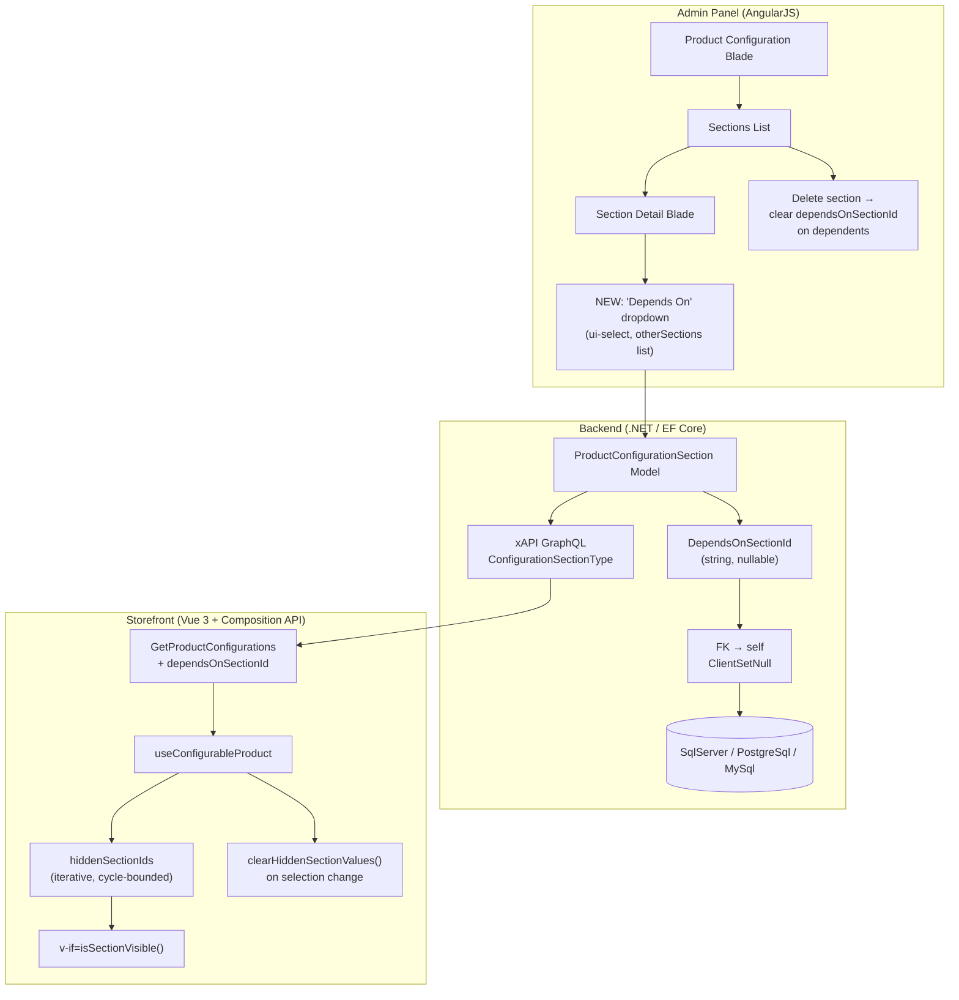

# BA Analysis Report — VCST-4713: Conditional Sections in Product Configuration

**Date:** 2026-03-31
**Scope:** JIRA VCST-4713 + Backend PR vc-module-catalog#871 + Frontend PR vc-frontend#2225
**Status:** Ready for Test | **Assignee:** Anton Zorya (ToxaKZ)
**VC Module Version:** VirtoCommerce.Catalog 3.1014.0-pr-871 | vc-theme-b2b-vue 2.45.0-pr-2225
**Reviewers Requested:** OlegoO (both PRs), Andrew-Orlov, goldenmaya, muller39, vas11yev1work (frontend)

---

## Executive Summary

VCST-4713 introduces **conditional section visibility** for configurable products — a section can depend on another section, becoming visible only when the parent section has a value selected. This enables real-world dependency modeling (e.g., "Installation Services" appears only after selecting "Ski Bindings"). The implementation spans the full stack: database schema (3 DB providers), core model, Admin SPA (AngularJS), GraphQL xAPI, and storefront Vue component. The feature is backward-compatible (additive field, no breaking changes). Primary risks are **lack of circular dependency validation** in the admin UI and **missing test data/test cases** for the new behavior.

---

## 1. System Architecture Overview

### Data Model Change

```
ProductConfiguration
  └── ProductConfigurationSection[]
        ├── id (PK)
        ├── configurationId (FK → ProductConfiguration)
        ├── dependsOnSectionId (FK → ProductConfigurationSection, nullable)  ← NEW
        └── options[]
```

`DependsOnSectionId` is a **self-referencing FK** on `ProductConfigurationSection` — a section points to a sibling section within the same configuration. This creates a directed dependency graph layered on top of the existing flat list.

**Constraints:**
- One-to-many: a section can be depended upon by multiple other sections
- One dependency per section: each section has at most one `DependsOnSectionId`
- `DeleteBehavior.ClientSetNull` — EF Core sets FK to null when parent section is deleted
- `StringLength(128)` — matches VC standard GUID/ID length
- No database-level constraint enforces DAG (acyclic graph)

### Architecture Diagram



### Data Flow: Backend → GraphQL → Frontend

1. **Admin saves** configuration with `dependsOnSectionId` → persisted to DB via EF Core `Patch()`
2. **GraphQL query** `GetProductConfigurations` returns `dependsOnSectionId` on each section
3. **Frontend composable** `useConfigurableProduct` computes `hiddenSectionIds` reactively
4. **Vue component** `product-configuration.vue` renders sections with `v-if="isSectionVisible(section.id)"`
5. **On selection change**, `clearHiddenSectionValues()` removes stored values/errors for hidden sections

---

## 2. Implementation Analysis

### 2.1 Backend Changes (vc-module-catalog#871 — 29 files)

| Area | Files | Changes |
|------|-------|---------|
| Core Model | `ProductConfigurationSection.cs` | +1 line: `DependsOnSectionId` property |
| Entity + Mapping | `ProductConfigurationSectionEntity.cs` | +7 lines: property, navigation, ToModel/FromModel/Patch |
| DbContext | `CatalogDbContext.cs` | +2 lines: FK relationship with ClientSetNull |
| DB Migrations | 6 files (SqlServer, PostgreSql, MySql) | Column + index creation |
| Admin UI (JS) | 3 files | Dropdown template, section blade, delete cleanup |
| Catalog JS | `catalog.js` | +4 lines: template registration |
| Localizations | 13 files (all supported languages) | Labels + placeholders for "Depends On" |

**Admin UI Flow:**
1. Open Product → Configuration tab → Add/Edit section
2. New "Depends On" dropdown shows all other sections in the same configuration (excluding self)
3. Select parent section or clear to remove dependency
4. On section delete: remaining sections with `dependsOnSectionId` referencing deleted section get it cleared

### 2.2 Frontend Changes (vc-frontend#2225 — 4 files)

| File | Changes | Purpose |
|------|---------|---------|
| `getProductConfigurationsQuery.graphql` | +1 line | Request `dependsOnSectionId` field |
| `types.ts` | +2 lines | Add `dependsOnSectionId?: Maybe<string>` to type |
| `product-configuration.vue` | +111 / -109 | Wrap VcWidget in `<template>` with `v-if` conditional |
| `useConfigurableProduct.ts` | +58 / -1 | Core logic: hiddenSectionIds, clearHiddenSectionValues, validation skip |

**Key Algorithm — `hiddenSectionIds` computed:**
```
Iterative until stable (bounded by section count):
  For each section with dependsOnSectionId:
    If parent is hidden OR parent has no value selected → hide this section
  Handles transitive chains: A→B→C (if B hidden, C also hidden)
  Bounded iterations prevent infinite loops from circular data
```

**Behavioral changes on selection:**
- `selectSectionValue()` → `clearHiddenSectionValues()` → `createConfiguredLineItem()`
- Hidden sections: values removed from `selectedConfigurationValue`, validation errors deleted
- `validateSection()` skips hidden sections
- `updateWithDefaultValues()` skips hidden sections

---

## 3. API Surface

### 3.1 REST API Endpoints (`CatalogModuleConfigurationsController`)

All endpoints are under `/api/catalog/products/configurations`, require Bearer token authentication.

| Method | Path | Permission | Description |
|--------|------|------------|-------------|
| `GET` | `/api/catalog/products/configurations/{id}` | `catalog:configurations:read` | Get single configuration with full sections/options |
| `POST` | `/api/catalog/products/configurations/search` | `catalog:configurations:read` | Search by productIds, pagination |
| `POST` | `/api/catalog/products/configurations` | `catalog:configurations:update` | Create/update configuration (clears options for Variation-type, deactivates if empty sections) |
| `PATCH` | `/api/catalog/products/configurations/{id}` | `catalog:configurations:update` | Partial update via JSON Patch (RFC 6902) |

After PR#871 merges, `dependsOnSectionId` flows through **all four endpoints** automatically via JSON serialization. No controller changes needed — the property is on the core model.

**Important:** The POST endpoint has inline business logic (options clearing, deactivation on empty sections) that is **NOT replicated** in the PATCH endpoint. This is a pre-existing inconsistency that also applies to any future `dependsOnSectionId` validation.

### 3.2 GraphQL (xAPI)

**Architecture note:** `vc-module-x-catalog` only exposes `isConfigurable: Boolean` on `ProductType`. The full section-level GraphQL type (`ConfigurationSectionType` with `dependsOnSectionId`) is registered in a **separate module** (likely `vc-module-x-cart`), not in x-catalog. This means the backend PR (vc-module-catalog#871) adds the model field, and the GraphQL schema update comes from a different module that must also be updated.

**Modified type:** `ConfigurationSectionType`
```graphql
type ConfigurationSectionType {
  # ... existing fields ...
  dependsOnSectionId: String  # NEW — nullable, ID of parent section
}
```

**Modified query (vc-frontend#2225):** `GetProductConfigurations`
```graphql
query GetProductConfigurations($productId: String!, $storeId: String!) {
  productConfiguration(productId: $productId) {
    sections {
      id
      name
      type
      dependsOnSectionId  # NEW
      # ... other fields ...
    }
  }
}
```

### 3.3 Backward Compatibility — FULLY COMPATIBLE

| Layer | Impact |
|-------|--------|
| REST response | New nullable field — existing clients unaffected |
| REST request (POST/PATCH) | Omitting `dependsOnSectionId` valid — defaults to null |
| GraphQL schema | Additive field — existing queries without it unaffected |
| Database | Nullable column — existing rows get NULL, no data migration |
| Admin UI | "Depends On" dropdown defaults to empty/cleared |

### 3.4 REST API Example — Setting Conditional Section

```json
POST /api/catalog/products/configurations
{
  "productId": "abc123",
  "isActive": true,
  "sections": [
    {
      "name": "Ski Bindings",
      "type": "Product",
      "isRequired": true,
      "displayOrder": 1,
      "dependsOnSectionId": null
    },
    {
      "name": "Installation Services",
      "type": "Product",
      "isRequired": false,
      "displayOrder": 2,
      "dependsOnSectionId": "<id-of-Ski-Bindings-section>"
    }
  ]
}
```

### 3.5 JSON Patch Example

```json
PATCH /api/catalog/products/configurations/{id}
[
  {
    "op": "replace",
    "path": "/sections/1/dependsOnSectionId",
    "value": "section-id-here"
  }
]
```

---

## 4. Risk Analysis

### Critical Risks

| # | Risk | Severity | Location | Detail |
|---|------|----------|----------|--------|
| 1 | **No circular dependency validation** | High | Admin UI | A→B→C→A is possible. Frontend handles it (bounded iteration) but behavior is undefined — all sections in the cycle become hidden | 
| 2 | **No server-side graph validation** | High | Backend | POST & PATCH endpoints accept any `DependsOnSectionId` — cross-configuration refs, non-existent IDs, self-references all pass |
| 3 | **No test data with conditional sections** | High | Test infrastructure | 21 configurable products in test-data, none with `dependsOnSectionId` set — cannot test without seed data |

### Medium Risks

| # | Risk | Severity | Detail |
|---|------|----------|--------|
| 4 | POST vs PATCH validation parity | Medium | POST has inline business logic (options clearing, deactivation) not replicated in PATCH — any future validation will need to be in the service layer |
| 5 | GraphQL schema lives in separate module | Medium | `ConfigurationSectionType` is in `vc-module-x-cart`, not x-catalog — requires coordinated release |
| 6 | Section ordering vs dependency direction | Medium | Dependent section can appear above its parent — confusing UX |
| 7 | Import/Export compatibility | Medium | `DependsOnSectionId` may not be included in catalog export schema — lost on re-import |
| 8 | Cart reconfiguration with stale values | Medium | Cart may retain values for sections that are now hidden due to changed dependencies |
| 9 | Patch null-semantics | Medium | Unclear if `Patch()` treats `null` as "clear dependency" vs "leave unchanged" |
| 10 | No transition/animation on section appear/disappear | Medium | Sections snap in/out — potentially jarring UX |

### Low Risks

| # | Risk | Detail |
|---|------|--------|
| 11 | No visual dependency graph in admin | Flat dropdown makes complex dependencies hard to reason about |
| 12 | Default values not applied on visibility transition | `updateWithDefaultValues()` may not fire when section goes from hidden→visible |
| 13 | Concurrent edit race condition | Last-write-wins can recreate orphaned references |
| 14 | No customer-facing hint about conditional sections | No affordance explaining "select X to see more options" |
| 15 | No explicit DELETE endpoint for sections | Deletion is via POST with modified sections array — implicit pattern not documented in Swagger |

---

## 5. User Flow Analysis

### 5.1 Admin Flow — Category Manager Configures Conditional Sections

```
1. Navigate to Admin → Catalog → Product detail
2. Open Configuration tab → Sections list
3. Create parent section (e.g., "Ski Bindings" — Product type, required)
4. Create dependent section (e.g., "Installation Services" — Product type, optional)
5. Edit "Installation Services" → "Depends On" dropdown → Select "Ski Bindings"
6. Save configuration
7. Verify on storefront: "Installation Services" hidden until "Ski Bindings" has selection
```

**Gap:** No preview/simulation capability in admin. Category Manager must switch to storefront to verify.

### 5.2 Storefront Flow — Customer Experiences Conditional Visibility

```
1. Customer navigates to configurable product PDP
2. Sees only sections with no dependency (or met dependencies)
3. Makes selection in "Ski Bindings" section
4. "Installation Services" section appears (rendered by v-if)
5. Customer optionally configures "Installation Services"
6. If customer deselects "Ski Bindings" (or selects "None"):
   - "Installation Services" disappears
   - Previously selected value in "Installation Services" is cleared
   - Validation errors for "Installation Services" are removed
   - Total price recalculates without "Installation Services" option
7. Customer adds to cart — only visible sections' values are submitted
```

---

## 6. Test Coverage Gap Analysis

### Existing Test Coverage (No conditional section tests exist)

| Suite | ID | Cases | Covers Conditional? |
|-------|----|-------|---------------------|
| Configurable Products Admin | 052 | 15 | No |
| Configurable Products UI | 072 | ~50 | No |
| Configurable Products E2E | 072b | ~45 | No |
| Configurable Products Cross | 072c | ~44 | No |

### Required New Test Cases

**Admin (suite 052):**
1. Set "Depends On" on a section — verify dropdown shows other sections only
2. Clear "Depends On" — verify dependency removed
3. Delete a section that others depend on — verify `dependsOnSectionId` cleared on dependents
4. Self-dependency prevention (if implemented)
5. Circular dependency A→B→A behavior
6. Save and reload — verify `dependsOnSectionId` persists

**Frontend (suite 072 or new 072d):**
1. Section hidden when parent has no value — initial load
2. Section appears when parent value selected
3. Section disappears when parent value deselected/cleared to "None"
4. Hidden section's value cleared on parent deselect
5. Transitive chain: A→B→C — hide C when A has no value
6. Required hidden section does not block form submission
7. Price recalculation excludes hidden section's option
8. Multiple sections depending on same parent
9. Non-required parent with "None" selected — dependent hidden

**E2E (suite 072b):**
1. Add-to-cart with conditional section visible + configured
2. Add-to-cart with conditional section hidden (not in cart item)
3. Reconfigure from cart — conditional visibility correct

### Required Test Data

A new seed product is needed (e.g., CFG-022):
- **3+ sections** with dependency chain: Section A (parent, required), Section B (depends on A), Section C (depends on B)
- Mix of required and optional dependent sections
- Product and Text section types in the chain

---

## 7. Recommendations

### Immediate (before merge)

| # | Action | Priority | Owner |
|---|--------|----------|-------|
| 1 | Add circular dependency detection in admin UI save handler | High | Dev (ToxaKZ) |
| 2 | Add server-side validation: `DependsOnSectionId` must reference a section in the same configuration | High | Dev |
| 3 | Create seed product with conditional sections for QA testing | High | QA |
| 4 | Write test cases for suites 052 and 072/072d | High | QA |

### Post-merge improvements

| # | Action | Priority |
|---|--------|----------|
| 5 | Add CSS transition on section show/hide for smoother UX | Medium |
| 6 | Add "Select [parent] to see more options" hint on storefront | Medium |
| 7 | Verify import/export includes `DependsOnSectionId` | Medium |
| 8 | Add dependency indicator on admin sections list (badge/icon) | Low |
| 9 | Add admin preview capability for conditional visibility | Low |

---

## 8. Open Questions

1. **Circular dependency policy**: Should the system prevent it (validation error) or handle it gracefully (treat as no dependency)? The frontend currently hides all sections in a cycle — is this intentional?
2. **Cross-configuration references**: Is there a scenario where `DependsOnSectionId` should reference a section in a different product's configuration? Current admin UI restricts to same configuration, but the DB does not.
3. **Cart persistence**: When a customer reconfigures a product already in the cart, does `clearHiddenSectionValues()` fire against the cart's stored selections?
4. **Patch null behavior**: When a Category Manager clears the "Depends On" dropdown, does the Patch method set `DependsOnSectionId` to `null` in the database, or does it leave the old value?
5. **Test data**: Does the QA environment already have any product with `dependsOnSectionId` configured, or do we need to create seed data from scratch via the admin UI after deploying the PR artifacts?
6. **Import/Export**: Does the catalog import/export module include `DependsOnSectionId` in its schema? If not, migrations between environments will lose dependency relationships.

---

## Appendix: PR Artifacts for QA Deployment

| Component | Artifact URL | Version |
|-----------|-------------|---------|
| Backend (Catalog Module) | `https://vc3prerelease.blob.core.windows.net/packages/VirtoCommerce.Catalog_3.1014.0-pr-871-c972.zip` | 3.1014.0-pr-871-c972 |
| Frontend (Theme) | `https://vc3prerelease.blob.core.windows.net/packages/vc-theme-b2b-vue-2.45.0-pr-2225-655d-655d1d46.zip` | 2.45.0-pr-2225-655d |

Both artifacts must be deployed together — the frontend depends on the `dependsOnSectionId` GraphQL field exposed by the backend PR.
