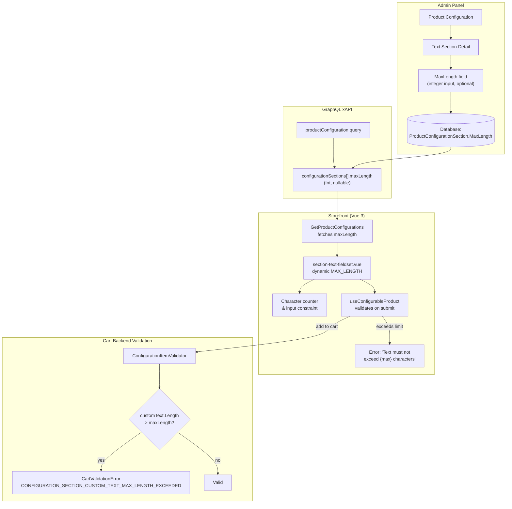

# BA Analysis Report — VCST-4806: Product Configuration MaxLength Validation

**Date:** 2026-04-14
**Scope:** JIRA VCST-4806 + Backend PR vc-module-x-cart#107 + Frontend PR vc-frontend#2235
**Origin:** Catalog module contribution vc-module-catalog#869 (merged 2026-03-12, release 3.1007.0)
**Status:** Tested | **Assignee:** Anton Zorya (ToxaKZ)
**VC Module Versions:** VirtoCommerce.Catalog 3.1007.0+ | VirtoCommerce.XCart 3.1006.0-pr-107 | vc-theme-b2b-vue 2.46.0-pr-2235
**Reviewers:** Andrew-Orlov, ivan-kalachikov, muller39 (frontend) | artem-dudarev (x-cart)

---

## Executive Summary

VCST-4806 adds **MaxLength validation** for Text-type configuration sections in configurable products. Administrators can now set a character limit on custom text input per section (e.g., max 50 characters for an engraving). Validation is enforced at three layers: **storefront UI** (real-time client-side), **xAPI backend** (cart validation on add-to-cart/update), and **GraphQL schema** (new `maxLength` field exposed in `ConfigurationSectionType`). The feature was initiated by a community contribution to `vc-module-catalog` (PR #869) that added the `MaxLength` property to `ProductConfigurationSection` and the Admin UI field. VCST-4806 completes the E2E story by wiring validation into the cart module and storefront. The default fallback is 255 characters when no MaxLength is set.

---

## 1. Feature Overview

### What Changed

| Layer | Module | Change |
|-------|--------|--------|
| **Catalog (Admin)** | `vc-module-catalog` 3.1007.0 | Added `int? MaxLength` property to `ProductConfigurationSection`. Admin UI shows MaxLength input for Text-type sections. DB migrations for SQL Server, PostgreSQL, MySQL. |
| **Cart (Backend)** | `vc-module-x-cart` PR #107 | Added `CustomTextMaxLengthExceeded` validation error. `ConfigurationItemValidator` now checks text length against `section.MaxLength`. Error code: `CONFIGURATION_SECTION_CUSTOM_TEXT_MAX_LENGTH_EXCEEDED`. |
| **Storefront (Frontend)** | `vc-frontend` PR #2235 | GraphQL query fetches `maxLength`. `section-text-fieldset.vue` uses dynamic max length (was hardcoded 255). `useConfigurableProduct.ts` validates on submit. Localized error message in 13 languages. |

### Data Flow



---

## 2. User Documentation

### For Store Administrators

#### Setting MaxLength on a Text Configuration Section

When creating or editing a configurable product, you can limit how many characters a customer can type into a Text-type configuration section (e.g., engraving, monogram, custom message).

**Steps:**

1. Navigate to **Catalog > Products** in the Admin Panel.
2. Open a configurable product and go to the **Product Configuration** blade.
3. Click an existing **Text**-type section (or create a new one with Type = "Text").
4. In the section detail form, locate the **Max Length** field.
5. Enter the maximum number of characters allowed (e.g., `50` for a 50-character limit).
6. Leave the field **empty** to use the default limit of 255 characters.
7. Click **Save**.

**Notes:**
- MaxLength applies only to **Text**-type sections (not Product, File, or Variation types).
- The value is a positive integer. Setting it to `0` or leaving it blank means no custom limit (default 255).
- The limit applies to the **custom text input** field on the storefront — both free-text and predefined text options that allow custom input.

#### What the Customer Sees

When a customer configures a product on the storefront:

- The text input field enforces the character limit in real time.
- If the customer types beyond the limit and attempts to add the item to the cart, a validation error appears: **"Text must not exceed [N] characters"** (localized in the customer's language).
- The same validation runs server-side when adding the item to the cart, preventing bypass.

### For Storefront Customers

#### Entering Custom Text on a Configurable Product

Some products allow you to add personalized text — for example, an engraving, a custom greeting, or printed text.

1. On the product page, click **Customize** to open the product configuration.
2. Find the text section (e.g., "Engraving Text", "Custom Message").
3. Type your text in the input field.
4. If the store has set a character limit, you will see a validation message if your text is too long: **"Text must not exceed [N] characters"**.
5. Shorten your text to fit within the limit, then proceed to add the product to your cart.

**Tip:** The character limit is set by the store and may vary per section. If no limit is shown, the default maximum is 255 characters.

---

## 3. API Reference

### GraphQL — productConfiguration Query

The `configurationSections` response now includes a `maxLength` field:

```graphql
query GetProductConfigurations(
  $configurableProductId: String!
  $storeId: String!
  $cultureName: String
  $currencyCode: String
) {
  productConfiguration(
    configurableProductId: $configurableProductId
    storeId: $storeId
    cultureName: $cultureName
    currencyCode: $currencyCode
  ) {
    configurationSections {
      id
      name
      type
      isRequired
      allowCustomText
      allowTextOptions
      maxLength          # NEW — Int, nullable
      options {
        id
        text
        quantity
        product { id name code }
      }
    }
  }
}
```

| Field | Type | Description |
|-------|------|-------------|
| `maxLength` | `Int?` | Maximum allowed character count for custom text input. `null` means no custom limit (default 255). Only relevant for `Text`-type sections. |

### Cart Validation Error

When server-side validation fails due to text exceeding `maxLength`:

| Error Code | Message | Trigger |
|------------|---------|---------|
| `CONFIGURATION_SECTION_CUSTOM_TEXT_MAX_LENGTH_EXCEEDED` | "Configuration section CustomText exceeds the maximum allowed length of {N} characters" | `customText.Length > section.MaxLength` during add-to-cart or cart update |

This error is returned alongside existing validation errors like `CONFIGURATION_SECTION_CUSTOM_TEXT_REQUIRED`.

---

## 4. Validation Logic Summary

### Three-Layer Validation

| Layer | Where | Behavior |
|-------|-------|----------|
| **UI (client-side)** | `section-text-fieldset.vue` | `MAX_LENGTH` computed from `section.maxLength ?? 255`. Input visually constrained. |
| **Submit (client-side)** | `useConfigurableProduct.ts` | On "Add to Cart" click, checks `customText.length > section.maxLength`. Shows localized error: "Text must not exceed {max} characters". Prevents submission. |
| **Server (backend)** | `ConfigurationItemValidator.cs` | `ValidateSectionTypeText()` checks `section.MaxLength.HasValue && customText.Length > section.MaxLength.Value`. Returns `CartValidationError` with code `CONFIGURATION_SECTION_CUSTOM_TEXT_MAX_LENGTH_EXCEEDED`. |

### Edge Cases

| Scenario | Behavior |
|----------|----------|
| MaxLength not set (null) | Default 255-character limit on frontend; no backend maxLength check (only existing required check) |
| MaxLength = 0 | Treated as "not set" (falsy check); default 255 applies |
| Empty text + MaxLength set | No maxLength error (empty string doesn't exceed limit); required-section error if section is required |
| Text with predefined options | MaxLength applies to custom text input; predefined option text is not validated against MaxLength |
| Cart already contains item exceeding new limit | Backend validation fires on next cart update/re-validation |

---

## 5. Localization

The frontend error message `"Text must not exceed {max} characters"` is localized in **13 languages**:

| Language | Translation |
|----------|-------------|
| English | Text must not exceed {max} characters |
| German | Der Text darf {max} Zeichen nicht überschreiten |
| Spanish | El texto no debe superar {max} caracteres |
| French | Le texte ne doit pas dépasser {max} caractères |
| Italian | Il testo non deve superare {max} caratteri |
| Japanese | テキストは {max} 文字を超えることはできません |
| Norwegian | Teksten kan ikke overstige {max} tegn |
| Polish | Tekst nie może przekraczać {max} znaków |
| Portuguese | O texto não deve exceder {max} caracteres |
| Russian | Текст не должен превышать {max} символов |
| Finnish | Teksti ei voi ylittää {max} merkkiä |
| Swedish | Texten får inte överstiga {max} tecken |
| Chinese | 文本长度不能超过 {max} 个字符 |

Locale key: `shared.catalog.product_details.product_configuration.max_length_exceeded`

---

## 6. Related Artifacts

| Artifact | Link | Status |
|----------|------|--------|
| JIRA Ticket | [VCST-4806](https://virtocommerce.atlassian.net/browse/VCST-4806) | Tested |
| Catalog PR (origin) | [vc-module-catalog#869](https://github.com/VirtoCommerce/vc-module-catalog/pull/869) | Merged (2026-03-12) |
| X-Cart PR (backend) | [vc-module-x-cart#107](https://github.com/VirtoCommerce/vc-module-x-cart/pull/107) | Open (pending review) |
| Frontend PR | [vc-frontend#2235](https://github.com/VirtoCommerce/vc-frontend/pull/2235) | Open (pending review) |
| Catalog Release | [vc-module-catalog 3.1007.0](https://github.com/VirtoCommerce/vc-module-catalog/releases/tag/3.1007.0) | Released |

---

## 7. Test Scenarios

| # | Scenario | Expected Result |
|---|----------|----------------|
| 1 | Admin: Set MaxLength=50 on a Text section, save | MaxLength persisted, visible on reload |
| 2 | Admin: Leave MaxLength empty on a Text section | No MaxLength stored (null), default 255 applies on storefront |
| 3 | Storefront: Type 51 chars in a section with MaxLength=50, submit | Client-side error "Text must not exceed 50 characters", cannot add to cart |
| 4 | Storefront: Type exactly 50 chars in a section with MaxLength=50, submit | Accepted, added to cart successfully |
| 5 | Storefront: Type 256 chars in a section with no MaxLength set | Client-side error at 255-char default limit |
| 6 | API: Add to cart with customText exceeding maxLength | GraphQL returns `CONFIGURATION_SECTION_CUSTOM_TEXT_MAX_LENGTH_EXCEEDED` error |
| 7 | Storefront: Required Text section, empty input, MaxLength=50 | "Section is required" error (required check takes priority) |
| 8 | Storefront: Non-required Text section, empty input, MaxLength=50 | Accepted (empty string doesn't violate maxLength) |
| 9 | Localization: Switch language to German, trigger maxLength error | Error shows in German: "Der Text darf 50 Zeichen nicht überschreiten" |
| 10 | Admin: MaxLength field not shown for Product/File/Variation sections | MaxLength input only visible for Text-type sections |
