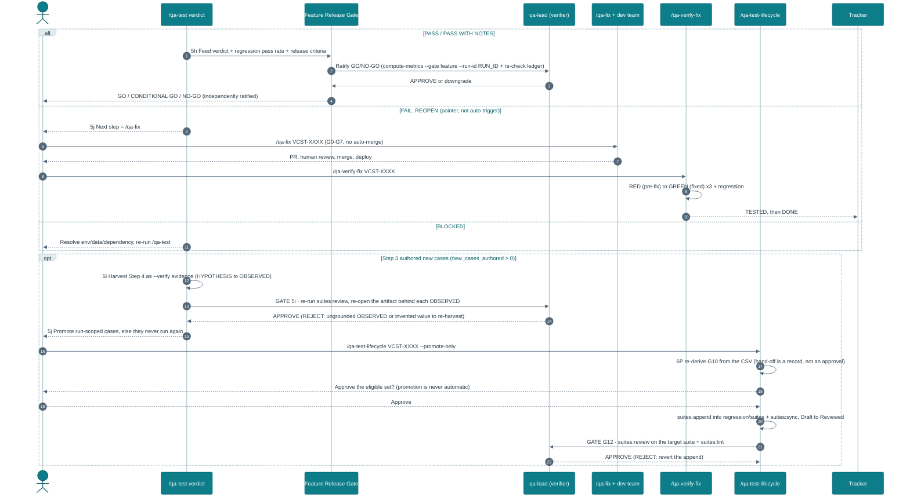
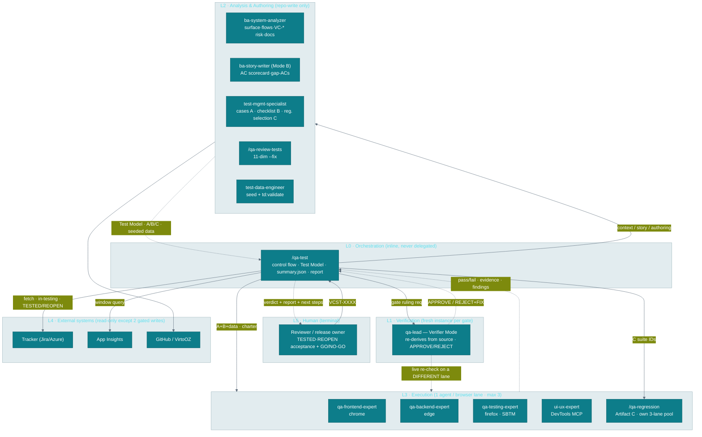

# `/qa-test` — Test Flow

Sequence of the `/qa-test VCST-XXXX` pipeline: **Gather Context · Story · Test Model → Plan →
Write·Review·Provision → Execute → Report**. The exploratory charter is folded into Execute, and story analysis is a sub-part of Step 1 (`1d`) — neither is
a step of its own. Canonical spec:
[`.claude/commands/qa-test.md`](../.claude/commands/qa-test.md).

### Diagram 1 — the `/qa-test` run (Steps 1–5)

```mermaid
%%{init: {'theme':'base','themeVariables':{'fontFamily':'ui-monospace, SFMono-Regular, Menlo, monospace','background':'#eef4f6','primaryColor':'#0d7d8a','primaryBorderColor':'#0a5f6a','primaryTextColor':'#ffffff','lineColor':'#5b6b7a','textColor':'#2b3a45','actorBkg':'#0d7d8a','actorBorder':'#0a5f6a','actorTextColor':'#ffffff','actorLineColor':'#a9c4c8','signalColor':'#54687a','signalTextColor':'#2b3a45','noteBkgColor':'#d3e8ea','noteBorderColor':'#0d7d8a','noteTextColor':'#0e2a2e','sequenceNumberColor':'#ffffff','labelBoxBkgColor':'#e2ecef','labelBoxBorderColor':'#9fb6bd','labelTextColor':'#2b3a45','loopTextColor':'#0a5f6a','activationBkgColor':'#bfe0e3','activationBorderColor':'#0d7d8a'}}}%%
sequenceDiagram
    autonumber
    actor User
    participant Orch as /qa-test
    participant V as qa-lead (verifier)
    participant TR as Tracker
    participant BA1 as ba-system-analyzer
    participant BA2 as ba-story-writer
    participant TMS as test-mgmt-specialist
    participant RT as /qa-review-tests
    participant TDE as test-data-engineer
    participant EX as Execution agents
    participant REG as /qa-regression
    participant SB as qa-testing-expert
    participant AI as App Insights

    User->>Orch: /qa-test VCST-XXXX
    note over Orch,V: Each step = DOER then GATE then V (fresh qa-lead, re-derives from source). REJECT to reason+fix, re-verify, max 2, then STOP

    note over Orch,BA1: Step 1 · sub-parts 1a-1e (each consumes the prior)
    note over Orch: 1a · Fetch, then classify
    Orch->>TR: Fetch ticket (type, priority, ACs, PR diff)
    Orch->>Orch: Classify TYPE (drives the 1c gate)
    note over Orch: 1b · Pre-flight, resolve SPRINT, dedup (all sprints)
    note over Orch,BA1: 1c · Gather context (gated)
    alt New feature / P0-P1 / cross-layer / unclear
        Orch->>BA1: Gather context (read-only)
        BA1-->>Orch: surface, flows, risk (VC-*), docs grounding
    else P2/P3 single-layer bug/tweak
        Orch->>Orch: Gather context inline
    end
    note over Orch,BA2: 1d · Review the story (advisory)
    opt Ticket has ACs
        Orch->>BA2: Review ACs vs PR diff (no writes)
        BA2-->>Orch: AC scorecard, gap-ACs, AC-vs-impl
    end
    Orch->>Orch: 1e · Build TEST MODEL (AC table = a field of it)
    Orch->>V: GATE 1 · Test Model complete?
    V-->>Orch: APPROVE (REJECT: re-decompose ACs, missing condition/risk to fix)

    note over Orch: Step 2 · Plan — enrich the model
    Orch->>Orch: Load BL, ECL, E2E scenarios (+ VirtoOZ docs if inline)

    note over Orch,TDE: Step 3 · Write, Review, Provision
    Orch->>TMS: Hand off Test Model
    alt New feature / Story
        TMS->>TMS: Author new cases/scenarios (A)
    else Bug / enhancement
        TMS->>TMS: Map existing + gap-author (A)
    end
    TMS->>TMS: Checklist (B) + regression selection (C)
    TMS->>RT: Review + auto-fix new cases (--fix)
    RT-->>TMS: Fixed cases (or flag unshippable)
    opt Cases need un-fixtured data
        TMS->>TDE: generate + seed data
        TDE-->>TMS: seeded, green td:validate
    end
    TMS-->>Orch: Artifacts A + B + C + aliases
    Orch->>V: GATE 3 · re-run suites:review + td:validate (hard STOP)
    V-->>Orch: APPROVE (REJECT: uncovered condition or blocker to fix)

    note over Orch,REG: Step 4 · Execute (2 tracks + exploratory charter, one 3-browser budget)
    Orch->>TR: Transition to in-testing (Jira, unconfirmed - precondition)
    Orch->>EX: Ticket cases + checklist + data (NO suite IDs)
    Orch->>REG: Artifact C as its own run (suite IDs)
    Orch->>SB: Exploratory charter folded in (probe risk areas first; P0/P1 + revenue)
    EX-->>Orch: Pass/fail, evidence, bugs
    REG-->>Orch: RUN_ID + pass rate (feeds the release gate)
    SB-->>Orch: Findings (bug/question/observation/risk)
    Orch->>V: GATE 4 · re-open evidence, re-run 1 case on a diff lane, every risk area probed?
    V-->>Orch: APPROVE (REJECT: PASS with no evidence, or a skipped risk area, to fix)

    note over Orch,AI: Step 5a-5c · Correlate, reconcile, validate
    opt App Insights configured
        Orch->>AI: Query window, dedup (label, not filter), triage
        AI-->>Orch: Correlated signals
    end
    Orch->>Orch: 5b reconcile ACs live (from working context) + 5c evidence checks

    note over Orch,TR: Step 5d-5f · Triage, then verdict, then file
    Orch->>Orch: 5d classify + provenance + severity + dedup (files nothing)
    Orch->>Orch: 5e verdict (keyed off 5d provenance)
    Orch->>V: GATE 5 · re-classify sample (live repro, diff lane), ratify verdict
    V-->>Orch: APPROVE (REJECT: mislabel or under-grade to re-triage, hard STOP before file)
    opt Confirmed non-duplicate bugs
        Orch->>TR: 5f file via /qa-bug (confirm, with Fix Routing)
    end
    Orch->>TR: TESTED (pass) / REOPEN (fail)
    Orch-->>User: Verdict + report + next steps
```

### Diagram 2 — after the verdict (Steps 5h / 5i)



## Decision gates encoded in the flow

- **Every step is independently verified** — the load-bearing addition: each step runs
  `DOER → GATE → INDEPENDENT VERIFIER`. The verifier is a **fresh `qa-lead-orchestrator` instance in
  §Verifier Mode**, never the pipeline's inline orchestrator and **never the step's own doer**. It
  re-derives evidence from source (re-runs `suites:review`/`td:validate`/`compute-metrics --gate feature`,
  re-opens the evidence, or delegates a live re-check to a specialist on a **different browser lane**),
  returns `APPROVE`/`REJECT`, and on REJECT gives reason + fix → the doer fixes → re-verify (≤2, then
  STOP). Steps 3 and 5 are **hard STOPs** (don't dispatch Step 4 / don't file at 5f until APPROVE). The
  release gate (5h) is independently ratified. **Doer ≠ checker, always.**
- **Step 1 ordering** — `1a`–`1e` are sequential dependencies, not a menu: the fetch (`1a`) must precede
  the type gate, the BA delegation, the dedup glob and the story review; `{SPRINT}` is resolved in `1b`
  *before* the duplicate check that globs it (and the check spans **all** sprints, not just the current).
- **Step 1c delegation gate** — `ba-system-analyzer` runs only when the ticket type/priority/scope warrant
  it (New feature / P0–P1 / cross-layer / ≥2 domains / critical revenue flow / unclear surface); otherwise
  context is gathered inline.
- **Step 2 docs gate** — the VirtoOZ docs query is skipped when the BA already returned docs grounding.
- **Step 3 test-quality gate** — newly authored cases pass `/qa-review-tests --fix` (11 dimensions)
  before they reach execution; test data is seeded (green `td:validate`) before hand-off. This is the **same
  mechanism `/qa-test-lifecycle` Phases 3–4 run** — the skills own it (`/qa-test-cases-generator`,
  `/qa-review-tests`, `/qa-generate-data`), and neither command restates a dimension, code or enum. Only two
  things differ: the rows land in a **run-scoped** ticket CSV, and `/qa-test` may **never promote**.
- **Step 4 execution split** — ticket cases go to the specialist agents; **Artifact C runs as its own
  `/qa-regression <ids>` run**, never inside a ticket agent's prompt (one-agent-per-suite + the 3-lane
  pool + the long-runner cap). Both tracks share the max-3-browser budget; if they don't fit, ticket cases
  go first because they own the verdict.
- **Step 4 tracker gate** — Jira-only in-testing transition, deliberately unconfirmed (precondition for
  the Step 5f close); the test-window start anchors the Step 5a App Insights correlation.
- **Step 5 order** — `5d` triage runs **before** `5e` verdict, because PASS/FAIL are expressed in terms of
  a finding's provenance, which only exists once triage assigns it. `5d` files nothing; `5f` files.
- **Step 5d triage gate** — every finding is classified (real bug / test-defect / by-design), given a
  **provenance** relative to the ticket (**PRE-EXISTING** → link, don't re-file · **IN-SCOPE** → fails
  this ticket · **OUT-OF-SCOPE incidental** → own ticket, doesn't fail this one), given a severity, and
  **deduped across all sprints + the tracker** before a bug is filed via `/qa-bug`; a test-defect routes
  to `/qa-review-tests --fix`, never a ticket. Only an in-scope P0/P1 (or an out-of-scope P0 revenue
  break) fails the verdict.
- **Step 5j loop (pointer, not auto-trigger)** — FAIL/REOPEN → `/qa-fix` → human merge/deploy →
  `/qa-verify-fix` (RED→GREEN re-test) → TESTED/DONE; BLOCKED → resolve → re-run `/qa-test`; new cases
  authored → **`/qa-test-lifecycle VCST-XXXX --promote-only`** (its Phase **6P**) to promote them out of the
  run-scoped ticket folder. `/qa-test` states the next command and stops; it never fixes.
- **Promotion is execute → harvest → promote, and only the lifecycle promotes.** Cases are authored `Draft`
  (Step 3), executed as `Draft` (Step 4), and **5i harvests that execution as the `--verify` evidence** that
  upgrades assertions `{HYPOTHESIS}`→`{OBSERVED}` — `--verify` is the sole emitter of `{OBSERVED}` and needs
  a live browser, so promoting before execution is impossible and executing without harvesting strands the
  coverage. 6P then **re-derives eligibility from the CSV** (the `summary.json` `promotion` block is a
  hand-off *record*, never an approval) and writes via `suites:append` + `suites:sync` after human approval.

## Quality gates that apply to a story

The gates are **layered** — the story run produces a verdict, and the **Feature Release Gate** turns that
verdict (plus the team-level release criteria) into the global **GO / NO-GO**:

| Layer | Gate | Verdict | Where |
|-------|------|---------|-------|
| Test artifacts | `/qa-review-tests` 11-dimension quality gate (enforced in Step 3 via `--fix`) | per-dimension | [`skills/qa-review-tests`](../.claude/skills/qa-review-tests/) |
| The story run | Step 5c evidence checks + Step 5d triage + Step 5e verdict — every AC condition carries PASS evidence, all reconciled SATISFIED-live, all `BL-*` verified, no **in-scope** P0/P1 bug, exploratory clean, no correlated App-Insights REAL_BUG | PASS / PASS WITH NOTES / FAIL / BLOCKED | [`commands/qa-test.md`](../.claude/commands/qa-test.md) §5c–5e |
| **Feature release (team go/no-go)** | **Feature Release Gate** — consumes the story verdict + open-bug ledger + change-scoped regression + NFRs + smoke. Owned by `qa-lead-orchestrator`. *"Can we release this feature?"* | **GO / CONDITIONAL GO / NO-GO** | [`skills/qa-metrics/quality-gates.md`](../.claude/skills/qa-metrics/quality-gates.md) **§1a** |
| Release (folds many features) | Smoke / Sprint Release / Full Release / Hotfix gates | PASS·FAIL / APPROVED·CONDITIONS·BLOCKED | [`skills/qa-metrics/quality-gates.md`](../.claude/skills/qa-metrics/quality-gates.md) |
| Bug auto-fix (if the story spawns a fix) | G0–G7 auto-fix ladder | open PR | [`.claude/rules/quality-gates.md`](../.claude/rules/quality-gates.md) |

**The feature go/no-go in one line:** a `/qa-test` **PASS**/**PASS WITH NOTES** feeds a **GO** only if
0 open P0, P1s deferred-with-acceptance, change-scoped regression ≥95%, NFRs clean, and smoke PASS all
hold; any P0 bug / unmet AC / `BL-*` violation / regression <93% / new security finding, or a `/qa-test`
FAIL/BLOCKED, is a **NO-GO**.

---

## Layer, role & hand-off schema

The two sequence diagrams above show *when* things happen. This section shows *who owns what* — the
agent layers, their roles, the typed hand-offs between them, and the exit criteria / DoD that close the
run. The invariant that shapes every layer: **doer ≠ checker, always**, and L0 never delegates the
orchestration itself.

### Diagram 3 — the five agent layers (swimlane)



### Layer model

| Layer | Name | Members | Write scope | Governing rule |
|---|---|---|---|---|
| **L0** | Orchestration | `/qa-test` (inline) | in-context + `summary.json`, screenshots, `test-cases.csv` | Runs the pipeline inline — never hands it to another orchestrator |
| **L1** | Verification | `qa-lead-orchestrator` §Verifier Mode — **fresh per gate** | none (rules only) | Re-derives from source; `APPROVE`/`REJECT`; when-in-doubt → REJECT |
| **L2** | Analysis / Authoring | `ba-system-analyzer`, `ba-story-writer` (B), `test-management-specialist`, `test-data-engineer`, `/qa-review-tests` | **repo only**; BA read-only externally | Context & authoring; no JIRA/GitHub writes |
| **L3** | Execution | `qa-frontend-expert`, `qa-backend-expert`, `qa-testing-expert`, `ui-ux-expert`, `/qa-regression` | evidence artifacts only | One agent per lane; max 3 concurrent (incl. regression lanes) |
| **L4** | External systems | Tracker, App Insights, GitHub, VirtoOZ MCP | — | Read-only except the 2 gated tracker writes |
| **L5** | Human (terminal) | Reviewer / release owner | — | Owns acceptance + release; `/qa-test` never ships/merges/fixes |

### Role schema (per agent)

| Agent | Layer | Step(s) | Consumes | Produces | Lane |
|---|---|---|---|---|---|
| `/qa-test` | L0 | all | user invocation | Test Model, dispatches, `summary.json`, chat report | — |
| `qa-lead` verifier | L1 | 1, 3, 4, 5d/e, 5h | doer artifact + `{step, gate_criteria, source_of_truth, cmd?}` | `APPROVE`/`REJECT` + `REASONS`+`FIX` | delegates re-check to a **different** lane |
| `ba-system-analyzer` | L2 | 1c (gated) | ticket fields + PR diff | affected surface, flows, `VC-*` risk, docs grounding | firefox (RO) |
| `ba-story-writer` (B) | L2 | 1d (advisory) | existing ACs + PR diff | AC scorecard, gap-ACs, AC↔impl (static) | none |
| `test-management-specialist` | L2 | 3 | Test Model | Artifact A (cases), B (checklist), C (selection) | chrome (seq) |
| `/qa-review-tests` | L2 | 3 | authored cases | fixed cases / unshippable flag | — |
| `test-data-engineer` | L2 | 3 (cond.) | gap fixtures needed | seeded data, `@td()` aliases, green `td:validate` | none |
| `qa-frontend-expert` | L3 | 4 | A + B + `@td()` + BL/ECL | pass/fail + evidence + bugs | chrome |
| `qa-backend-expert` | L3 | 4, 5a | same; triage oracle at 5a | same; App-Insights classification | edge |
| `qa-testing-expert` | L3 | 4 | exploratory charter | findings (bug/question/observation/risk) | firefox |
| `ui-ux-expert` | L3 | 4 (UI) | component scope | a11y / design findings | DevTools MCP |
| `/qa-regression` | L3 | 4 (track 2) | Artifact-C suite IDs | `RUN_ID` + pass rate | own pool |

### Hand-off rules (load-bearing)

- **Artifact C never enters a ticket-agent prompt** — it runs as its own `/qa-regression <ids>` run
  (one-agent-per-suite + the 3-lane pool + the long-runner cap).
- The verifier's live re-check must use a **lane the doer did not use**.
- A REJECT's `FIX` goes back to the **step's doer**, never to the verifier; the verifier re-checks from
  scratch (re-runs the deterministic core, re-reads the source).
- **≤2 revise iterations** per gate, then **STOP for a human** — a persistent REJECT never silently
  proceeds.

### Gate / exit-criteria schema (per step)

| Step | Gate (pass criteria) | Independent verification | Type |
|---|---|---|---|
| **1** Test Model | type classified; ACs → atomic conditions; BL/ECL/domains; risk areas present | V re-decomposes ACs from ticket/PR | soft |
| **2** Plan | every domain has BL/ECL/E2E loaded + agent routed | folded into Gate 3 | none standalone |
| **3** Artifacts + data | new cases pass 11-dim (0 blocker/critical); every condition maps to a case; data green `td:validate` | V **re-runs** `suites:review` + `td:validate` | **HARD STOP** |
| **4** Execution + explore | every condition has PASS/FAIL evidence; regression `RUN_ID`+rate exist; exploratory charter ran + every risk area probed (P0/P1) | V re-opens evidence; re-runs 1 case on a diff lane; confirms every risk area touched | required (P0/P1) |
| **5d/5e** Triage + verdict | each finding classified + provenance + severity + deduped; verdict follows table | V re-classifies a sample via live repro (diff lane) | **HARD STOP before 5f** |
| **5h** Release gate | §1a criteria → GO/CONDITIONAL/NO-GO | V re-evaluates `compute-metrics.ts --gate feature --run-id <RUN_ID>` (scope required; exit 2 = CANNOT EVALUATE, not a failure) + open-bug ledger | ratify/downgrade |
| **5i** Promotion evidence *(only if new cases authored)* | every `{OBSERVED}` traces to a real Step-4 artifact; every surviving `{HYPOTHESIS}` resolved or reworded as a question; eligible/blocked split matches the review | V **re-runs** `suites:review` + re-opens the evidence behind a sample of the upgrades | required (never skipped) |
| **6P** Promotion *(in `/qa-test-lifecycle`)* | G10 re-derived from the CSV + human approval; G12 integrity (unique IDs, clean `suites:append` dry-run, `suites:lint` green) | V re-runs `suites:review` on the **target** suite + `suites:lint` | **HARD STOP** — REJECT reverts the append |

### End of flow — DoD

A `/qa-test` run is **Done** when all hold:

1. **All step gates APPROVED** (or explicitly skipped for a trivial P2/P3); no gate left at REJECT.
2. **Every atomic condition** (story ACs + gap-ACs) carries PASS/FAIL evidence and is reconciled live (5b).
3. **Every finding triaged** (class + provenance + severity + dedup, 5d); confirmed bugs filed with
   confirmation + `## Fix Routing` (5f).
4. A **verdict** (5e) issued, consistent with the triage table.
5. **`summary.json`** persisted with the regression block (`run_id`, `pass_rate`) and `new_cases_authored`.
6. **Tracker transitioned** to TESTED/REOPEN — the terminal reach; never Done/Cancelled.
7. **Feature Release Gate fed** (5h) and independently ratified GO/CONDITIONAL/NO-GO.
8. **Promotion evidence harvested** (5i) when `new_cases_authored > 0` — assertions grounded to
   `{OBSERVED}` from this run's own artifacts, each surviving `{HYPOTHESIS}` resolved or reworded, and the
   eligible/blocked split recorded in `summary.json` `promotion`.
9. **Close-out pointers stated** (5j), never auto-triggered: FAIL/REOPEN → `/qa-fix` → human merge/deploy
   → `/qa-verify-fix`; BLOCKED → resolve → re-run `/qa-test`; `new_cases_authored > 0` →
   `/qa-test-lifecycle VCST-XXXX --promote-only` (Phase 6P) to promote cases.
