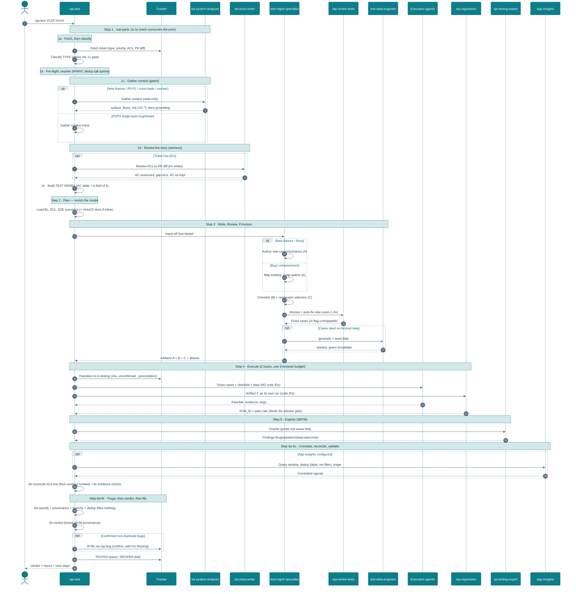
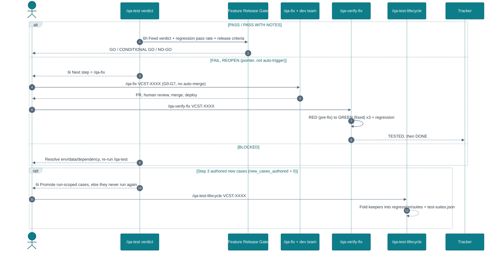

# `/qa-test` — Test Flow

Sequence of the `/qa-test VCST-XXXX` pipeline: **Gather Context · Story · Test Model → Plan →
Write·Review·Provision → Execute → Explore → Report**. Story analysis is a sub-part of Step 1 (`1d`), not
a step of its own. Canonical spec:
[`.claude/commands/qa-test.md`](../.claude/commands/qa-test.md).

### Diagram 1 — the `/qa-test` run (Steps 1–6)

### Diagram 2 — after the verdict (Steps 6h / 6i)

## Decision gates encoded in the flow

- **Step 1 ordering** — `1a`–`1e` are sequential dependencies, not a menu: the fetch (`1a`) must precede
  the type gate, the BA delegation, the dedup glob and the story review; `{SPRINT}` is resolved in `1b`
  *before* the duplicate check that globs it (and the check spans **all** sprints, not just the current).
- **Step 1c delegation gate** — `ba-system-analyzer` runs only when the ticket type/priority/scope warrant
  it (New feature / P0–P1 / cross-layer / ≥2 domains / critical revenue flow / unclear surface); otherwise
  context is gathered inline.
- **Step 2 docs gate** — the VirtoOZ docs query is skipped when the BA already returned docs grounding.
- **Step 3 test-quality gate** — newly authored cases pass `/qa-review-tests --fix` (11 dimensions)
  before they reach execution; test data is seeded (green `td:validate`) before hand-off.
- **Step 4 execution split** — ticket cases go to the specialist agents; **Artifact C runs as its own
  `/qa-regression <ids>` run**, never inside a ticket agent's prompt (one-agent-per-suite + the 3-lane
  pool + the long-runner cap). Both tracks share the max-3-browser budget; if they don't fit, ticket cases
  go first because they own the verdict.
- **Step 4 tracker gate** — Jira-only in-testing transition, deliberately unconfirmed (precondition for
  the Step 6f close); the test-window start anchors the Step 6a App Insights correlation.
- **Step 6 order** — `6d` triage runs **before** `6e` verdict, because PASS/FAIL are expressed in terms of
  a finding's provenance, which only exists once triage assigns it. `6d` files nothing; `6f` files.
- **Step 6d triage gate** — every finding is classified (real bug / test-defect / by-design), given a
  **provenance** relative to the ticket (**PRE-EXISTING** → link, don't re-file · **IN-SCOPE** → fails
  this ticket · **OUT-OF-SCOPE incidental** → own ticket, doesn't fail this one), given a severity, and
  **deduped across all sprints + the tracker** before a bug is filed via `/qa-bug`; a test-defect routes
  to `/qa-review-tests --fix`, never a ticket. Only an in-scope P0/P1 (or an out-of-scope P0 revenue
  break) fails the verdict.
- **Step 6i loop (pointer, not auto-trigger)** — FAIL/REOPEN → `/qa-fix` → human merge/deploy →
  `/qa-verify-fix` (RED→GREEN re-test) → TESTED/DONE; BLOCKED → resolve → re-run `/qa-test`; new cases
  authored → `/qa-test-lifecycle` to promote them out of the run-scoped ticket folder. `/qa-test` states
  the next command and stops; it never fixes.

## Quality gates that apply to a story

The gates are **layered** — the story run produces a verdict, and the **Feature Release Gate** turns that
verdict (plus the team-level release criteria) into the global **GO / NO-GO**:

| Layer | Gate | Verdict | Where |
|-------|------|---------|-------|
| Test artifacts | `/qa-review-tests` 11-dimension quality gate (enforced in Step 3 via `--fix`) | per-dimension | [`skills/qa-review-tests`](../.claude/skills/qa-review-tests/) |
| The story run | Step 6c evidence checks + Step 6d triage + Step 6e verdict — every AC condition carries PASS evidence, all reconciled SATISFIED-live, all `BL-*` verified, no **in-scope** P0/P1 bug, exploratory clean, no correlated App-Insights REAL_BUG | PASS / PASS WITH NOTES / FAIL / BLOCKED | [`commands/qa-test.md`](../.claude/commands/qa-test.md) §6c–6e |
| **Feature release (team go/no-go)** | **Feature Release Gate** — consumes the story verdict + open-bug ledger + change-scoped regression + NFRs + smoke. Owned by `qa-lead-orchestrator`. *"Can we release this feature?"* | **GO / CONDITIONAL GO / NO-GO** | [`skills/qa-metrics/quality-gates.md`](../.claude/skills/qa-metrics/quality-gates.md) **§1a** |
| Release (folds many features) | Smoke / Sprint Release / Full Release / Hotfix gates | PASS·FAIL / APPROVED·CONDITIONS·BLOCKED | [`skills/qa-metrics/quality-gates.md`](../.claude/skills/qa-metrics/quality-gates.md) |
| Bug auto-fix (if the story spawns a fix) | G0–G7 auto-fix ladder | open PR | [`.claude/rules/quality-gates.md`](../.claude/rules/quality-gates.md) |

**The feature go/no-go in one line:** a `/qa-test` **PASS**/**PASS WITH NOTES** feeds a **GO** only if
0 open P0, P1s deferred-with-acceptance, change-scoped regression ≥95%, NFRs clean, and smoke PASS all
hold; any P0 bug / unmet AC / `BL-*` violation / regression <93% / new security finding, or a `/qa-test`
FAIL/BLOCKED, is a **NO-GO**.
