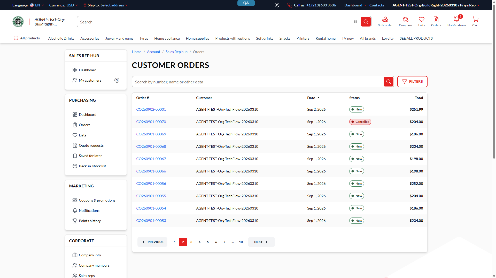
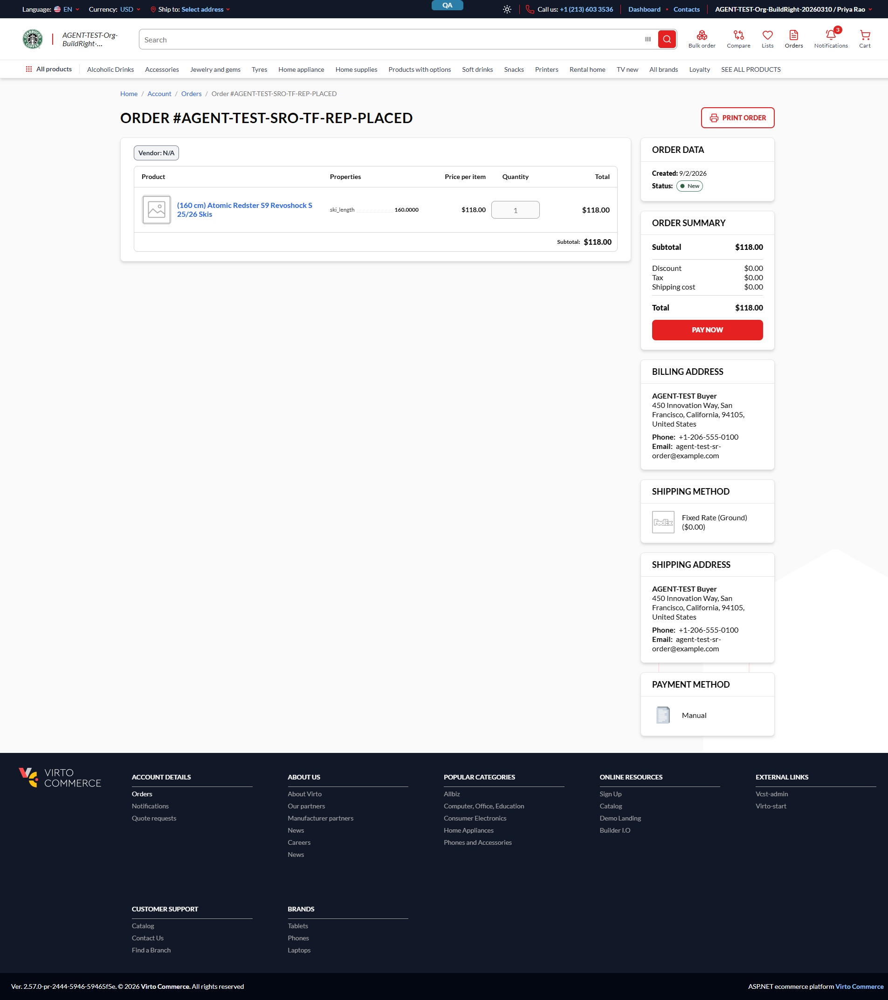
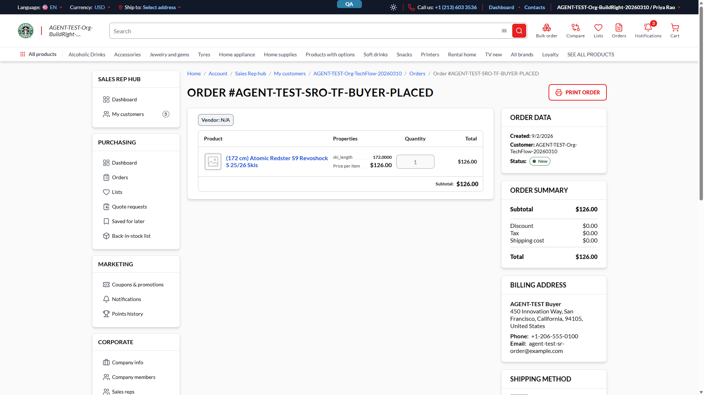

# See a customer's complete order history

### Introduction

As a **sales representative**, you can now see every order a customer has ever placed — not only the
ones you placed for them yourself — right from the **Sales Rep hub**, without switching to that
customer's own buyer account. You can also see every order across **all** the customers you serve in
one combined list.

*The **Customer orders** list — every order placed by any customer you serve, newest first, with working paging.*

!!! note "Who sees this?"
    Order history in the Sales Rep hub is visible only to signed-in users assigned as a sales
    representative, and only for the customers they are assigned to serve.

### Prerequisites

- You are signed in with a storefront account that has the **sales representative** role.
- The **Sales Rep hub** appears in the left-hand account menu.
- You are assigned to serve at least one organization (your **My customers** list shows which ones).

### See one customer's full history

1. Open the customer's profile from **Sales Rep hub → My customers**, as described in
   [View a customer's profile](../sales-rep-view-customer-profile/view-customer-profile.md).
2. In the **Recent orders** panel, click **All orders →**.
3. You land on that customer's own order list — the breadcrumb reads
   **Home / Account / Sales Rep hub / My customers / {customer} / Orders**, and every order for that
   organization appears, whether you placed it, a colleague placed it, or the customer placed it
   themselves.
4. Click the customer's name in the breadcrumb to go back to their profile; you return to the
   **Orders** tab you left.

### See orders across every customer you serve

1. On the **Sales Rep hub** dashboard, find the **My recent orders** widget and click **All orders →**.
2. You land on the combined **Customer orders** list shown above — every order from every customer you
   serve, with a **Customer** column so you can tell them apart. The breadcrumb here never names a
   single customer.

### Filtering, searching, and sorting

*Every filter you apply — order status, customer, created-date range — appears as its own chip above
the table. Click the **×** on a chip to remove just that filter, or click **Reset filters** to clear
everything at once.*

- Click **Filters** to open the drawer: pick one or more order statuses, a customer (on the combined
  list only), and a created-date range (a preset or your own start/end dates).
- Use the search box to find an order by its **order number**; press **Enter** or click the search
  icon.
- Click **Date** or **Total** in the column header to sort by that column; sorting reverses on a
  second click. Order #, Customer, and Status are not sortable.

!!! note "A status checkbox disappeared from the drawer"
    This is expected: the drawer only offers a status you can actually filter to. If none of the
    customer's current orders have a given status (for example, everything is already **New**), that
    checkbox is hidden rather than shown disabled.

### Opening an order

What you can do on an order depends on who placed it.

*An order **you placed** opens on the same order page a buyer would see, with its normal actions —
here, **Pay now** on a still-unpaid order.*

*An order **you did not place** opens inside the Sales Rep hub instead, showing the same order detail
read-only — **Print order** is the only action available.*

!!! note "Why can't I act on this order?"
    You can view every order a customer places, but you can only take payment/shipping actions on
    orders you placed yourself. This keeps the customer's own orders under their (or their placing
    colleague's) control.

### Troubleshooting

- **My search finds nothing** — the search box matches by order number only; it does not search
  customer names or product names.
- **The customer I want isn't in the list** — the combined list only shows customers you are assigned
  to serve; check **My customers** first.

---
*Ticket VCST-5733, verified on `vcst-qa`. Not documented — recorded findings not yet resolved, so not
described as expected behaviour here: a filter chip can briefly show the raw English status name
instead of its translated label right after a search narrows the results to zero on a non-English
page; closing only the start-date chip of a custom date range can leave the Filters drawer's preset
selector out of step with what is actually applied; a sales rep who is not yet assigned any customers
currently sees the same "No orders yet" message as a rep with customers but no orders; and the
all-customers list's breadcrumb is shorter by one segment than intended. None of these block the
features described above. Evidence: `reports/tickets/Sprint26-17/VCST-5733/`.*
