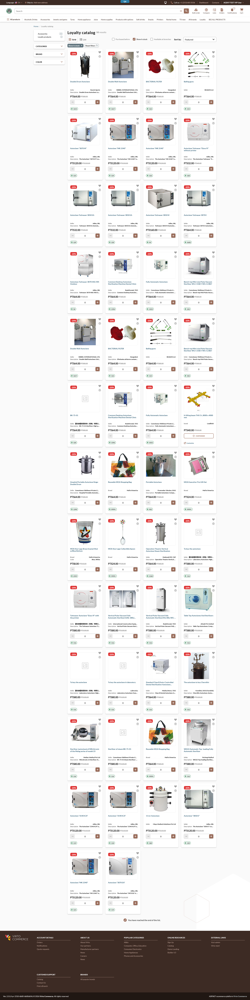
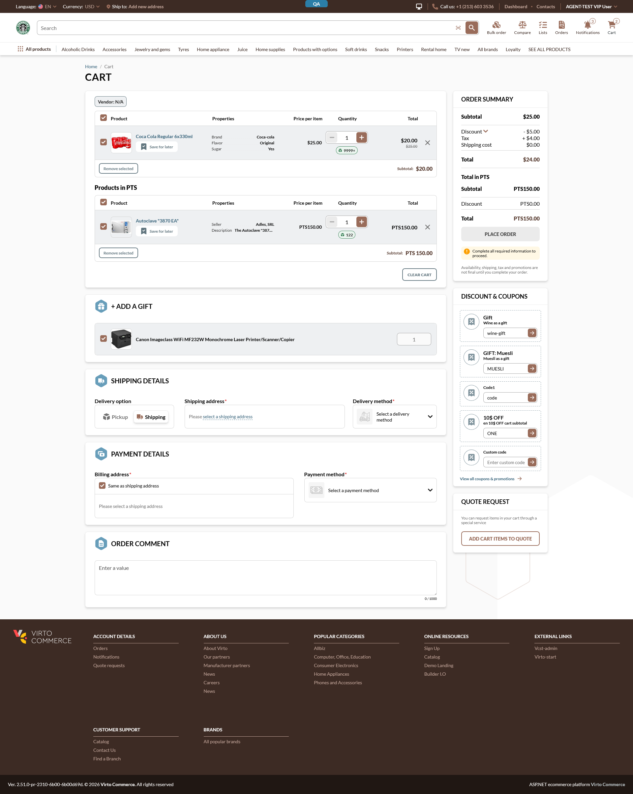
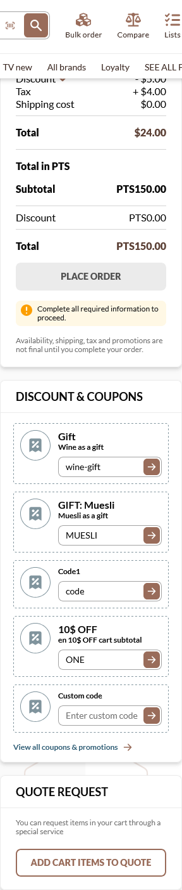
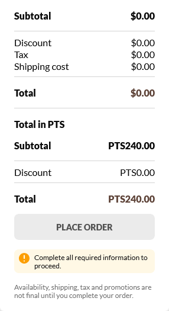
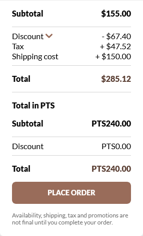

# Shopping with Loyalty Points

### Introduction

If your store runs a loyalty program, you can buy products with the points you have earned — and put them in the **same cart** as products you pay for with money. The cart keeps the two apart, showing a separate total for your money items and your points items, so it is always clear what each one costs.

*Products in the loyalty catalog show their price in points instead of money.*

### Prerequisites

- You are **signed in** to your account.
- Your store offers a loyalty program and you have a **points balance**. You can check your balance any time under **Account → Points history**.

### Add a loyalty product to your cart

1. Open the **loyalty catalog** from the store menu.
2. Pick a product. Its price is shown in points (for example, **PTS 80**) instead of money.
3. Click **Add to cart**.
4. The product is added to your cart alongside anything you are already buying with money. You do **not** need a separate cart for points.

!!! note "Can I mix points products and money products in one cart?"
    Yes. A cart can hold both at once. Money items and points items are listed and totalled separately, so each is paid for in its own currency.

### Review your mixed cart

1. Click **Cart** in the top menu to open the cart.
2. Your items are grouped into two sections — the products you pay for with **money** and the products you pay for with **points**.

   
   *Each product stays in its own currency — changing one does not affect the other.*

3. In the order summary you will see a separate **money total** and a **points total** (for example, **Total in PTS**).

   
   *Your points total is calculated and shown on its own, never mixed into the money total.*

4. You can change quantities, select or remove items, and your cart is kept if you reload the page or sign back in later.

!!! note "Do coupons and promotions apply to my points items?"
    No. Discount codes and promotions apply only to the products you pay for with **money**. Your points items are never discounted by a money coupon, and adding more points items does not change your money discount.

### Buy points-only

You do not have to buy money items as well. If you remove every money item, the cart simply becomes a points-only cart and still displays its points total cleanly.

*A cart can contain only points items — the money total simply shows as zero.*

### Check out

1. From the cart, click **Proceed to checkout** and complete the delivery and billing steps as usual.
2. At the payment step, choose **Pay with points** to pay for your order with your loyalty points balance.
3. Click **Place order**.
4. On success you will see: **"Your order has been successfully placed"**.

*A mixed cart proceeds through checkout like any other order.*

!!! note "Where do I see the points I spent?"
    Open **Account → Points history**. It lists the points earned and redeemed for each order, plus your remaining balance.

### Troubleshooting

- **My points product shows no money price** — that is expected. Loyalty products are priced in points only, so they show a points price and no money amount.
- **A discount code did not lower my points total** — that is by design. Coupons and promotions apply only to money items; points items are never discounted.
- **I can't find the loyalty catalog** — the loyalty program must be enabled for your store and your account. If you don't see it, contact your store administrator.
