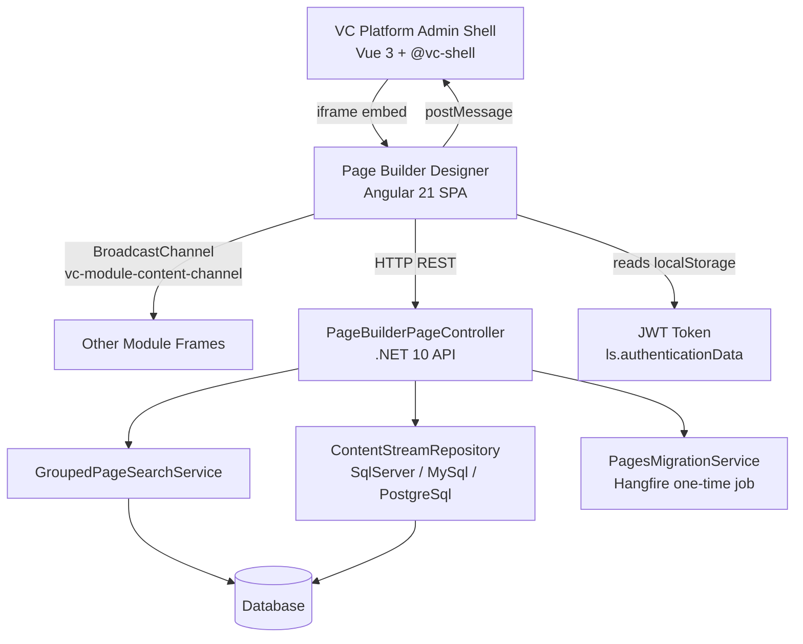
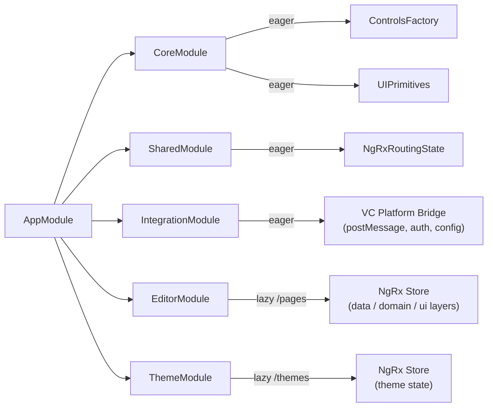
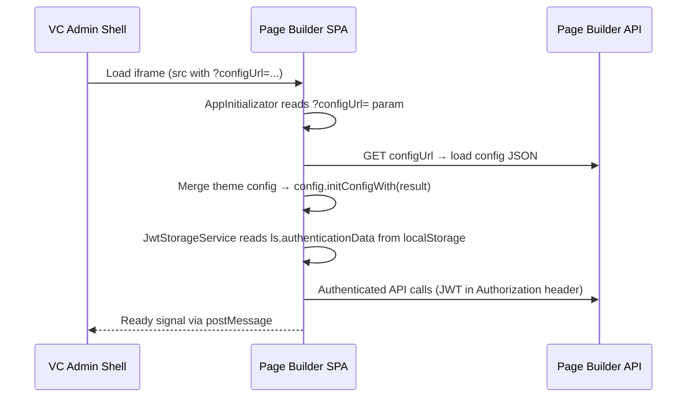
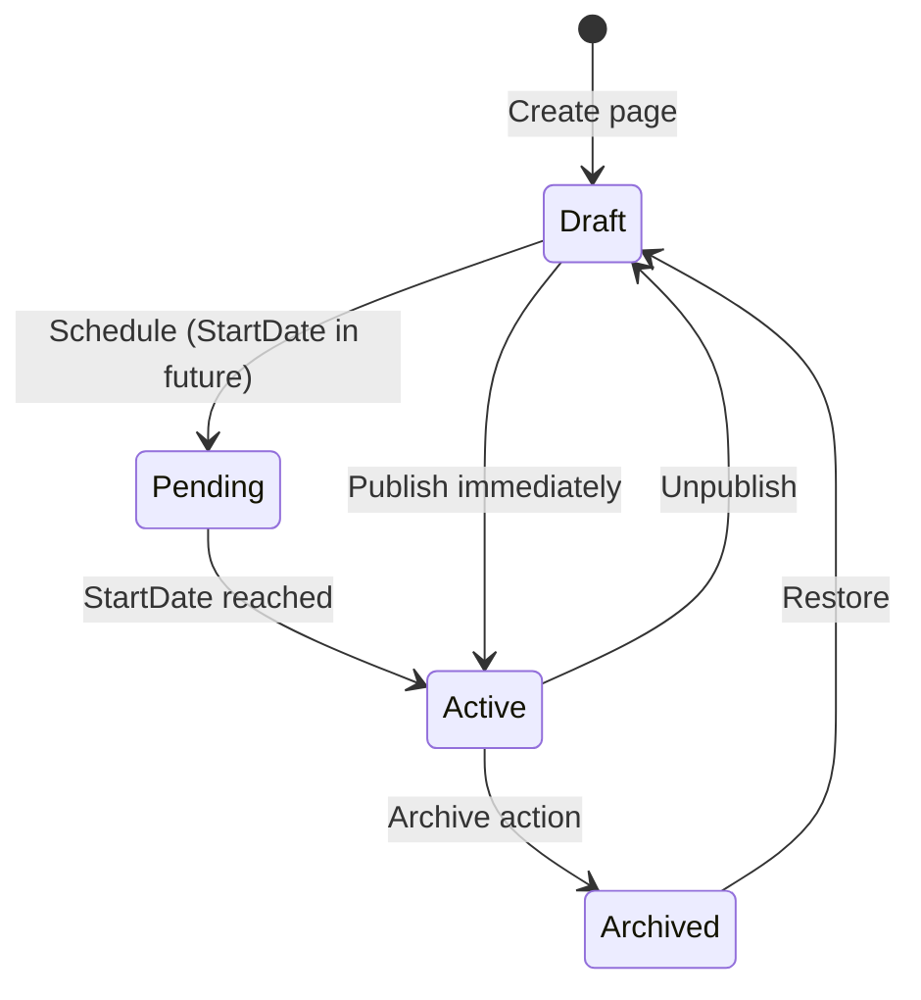

# BA Analysis Report: vc-module-pagebuilder
## PR #105 — Angular 21 Migration + Monorepo Consolidation

**JIRA:** VCST-4756 — "Update page-builder to Angular 18 or more"
**PR:** https://github.com/VirtoCommerce/vc-module-pagebuilder/pull/105
**Assignee:** Basil Kotov
**Status:** Tested
**Files Changed:** 695
**Report Date:** 2026-03-30
**Prepared by:** ba-doc-writer (BA Team)
**Sources:** ba-system-analyzer findings + ba-api-specialist findings

---

## Table of Contents

1. [Executive Summary](#1-executive-summary)
2. [System Architecture Overview](#2-system-architecture-overview)
3. [Migration Impact](#3-migration-impact)
4. [User Flow Analysis](#4-user-flow-analysis)
5. [API Analysis](#5-api-analysis)
6. [Control Reference Documentation](#6-control-reference-documentation)
7. [Security Observations](#7-security-observations)
8. [User Documentation](#8-user-documentation)
9. [Implementation Roadmap](#9-implementation-roadmap)
10. [Open Questions](#10-open-questions)

---

## 1. Executive Summary

This PR delivers two major changes simultaneously: a **monorepo consolidation** and a **major Angular framework upgrade**. The Angular designer application — previously maintained in a separate repository — has been brought into the `vc-module-pagebuilder` repo. The Angular version was advanced to **21.2.x** (the JIRA ticket title "Angular 18 or more" understates the actual outcome). The backend was also extended with first-class database columns for page metadata, a streaming content repository layer, and a server-side lifecycle filtering service.

**Business impact:** Platform teams gain a unified development workflow (one repo, one CI pipeline), a modern reactive frontend stack with zoneless change detection and signal-based components, and a richer page lifecycle model (Drafts / Pending / Active / Archived) that enables editorial workflows previously impossible without custom scripting.

**Risk level:** Medium-high. The scope is large (695 files), the DB schema changes require a migration, and a one-time Hangfire data migration job moves metadata from JSON content blobs into new columns. If the Hangfire job is interrupted mid-run, it must be re-triggered manually. One routing discrepancy between the settings documentation and the live controller was identified and needs verification before production deployment.

**Recommendation:** Approve with the open questions resolved and the security items addressed. The codebase quality is high overall; the issues identified are addressable without re-architecture.

---

## 2. System Architecture Overview

### 2.1 High-Level Module Layout

```
vc-module-pagebuilder/
├── VirtoCommerce.PageBuilderModule.Core/        .NET 10 — domain models, interfaces, events
├── VirtoCommerce.PageBuilderModule.Data/        .NET 10 — EF Core, services, auth handlers
├── VirtoCommerce.PageBuilderModule.Data.SqlServer/
├── VirtoCommerce.PageBuilderModule.Data.MySql/
├── VirtoCommerce.PageBuilderModule.Data.PostgreSql/
└── VirtoCommerce.PageBuilderModule.Web/
    ├── Scripts/                                 AngularJS (legacy blade integration)
    ├── Apps/page-builder-designer/              Angular 21 SPA  <-- THIS PR
    └── Apps/page-builder-shell/                 Vue 3 + @vc-shell (admin shell wrapper)
```

### 2.2 Runtime Topology



### 2.3 Angular Designer Application Architecture

The SPA follows a strict module-based decomposition aligned with functional domains.



### 2.4 Routing Structure

```
/ (SidebarComponent — shell layout)
├── /pages   → EditorModule (lazy)
├── /themes  → ThemeModule (lazy)
└── /**      → redirect to /pages
```

Hash-based routing (`withHashLocation()`) is used throughout to support iframe embedding without interfering with the parent shell's URL.

### 2.5 SPA Deployment Model

The Angular app builds to `dist/template-builder/` and is served as static assets embedded in the .NET module. The VC platform admin shell hosts it in an `<iframe>`, using `postMessage` for two-way communication and `BroadcastChannel('vc-module-content-channel')` for broadcast events to sibling frames.

### 2.6 Application Initialization Flow



---

## 3. Migration Impact

This table captures the before/after state across every dimension changed by this PR.

| Dimension | Before PR | After PR |
|-----------|-----------|----------|
| Designer location | Separate repository | Monorepo under `Apps/page-builder-designer/` |
| Angular version | Unknown (pre-migration baseline) | Angular 21.2.x |
| TypeScript version | Unknown | ~5.9.3 |
| NgRx version | Unknown | 21.0.1 |
| Change detection | Zone.js | Zoneless (`provideZonelessChangeDetection()`) |
| Component inputs | `@Input()` decorators | `input()` / `model()` signal primitives |
| Template control flow | `*ngIf`, `*ngFor` structural directives | `@if`, `@for` built-in control flow |
| Async data pattern | `AsyncPipe` | `toSignal()` |
| Dependency injection | Constructor injection | `inject()` function |
| HTTP interceptors | Class-based | Functional (`withInterceptors([...])`) |
| CI build | Separate composite action (`.github/actions/build-page-builder`) | Unified via `vc-build Compile` |
| Developer AI tooling | None | 5 Claude agents + 6 skills + 36 Google Angular skill docs |
| Backend — page metadata | Embedded in JSON content blob | Dedicated DB columns (StartDate, EndDate, Visibility, UserGroups, OrganizationId) |
| Backend — page search | Basic search | Lifecycle filtering: Drafts / Pending / Active / Archived |
| Backend — content storage | Standard ORM | Streaming read/write via raw ADO.NET (8KB chunked writes) |
| Module version | Pre-3.1001.0 | 3.1001.0 |
| Platform dependency | Pre-3.1002.0 | >=3.1002.0 |

---

## 4. User Flow Analysis

### 4.1 Page Creation Flow

**Current State:**
1. Admin navigates to Page Builder in the VC admin shell.
2. The admin shell loads the Angular SPA in an iframe.
3. SPA initializes: reads config URL, fetches config, reads JWT from localStorage.
4. User lands on `/pages` (EditorModule, lazy loaded).
5. User clicks to create a new page.
6. User fills in metadata: name, language, start/end date, visibility, user groups, organization.
7. User edits page content using the block-based canvas (dynamic control system).
8. User saves — content streams to the backend via `POST /api/page-builder-pages/grouped/{groupId}/content`.
9. Page is created in Draft state.

**Pain Points Identified:**
- JWT is read from localStorage with a developer-acknowledged `// todo: dangerous!` comment. If localStorage is compromised, all auth tokens are at risk.
- Two `console.log` calls remain in `app.initializator.ts` — these leak initialization details to the browser console in production.
- The `AppInitializator` has no visible loading state specification — users may see a blank iframe while config loads.

**Proposed Improvement — Initialization Loading State:**

```
As an admin user, I want to see a loading indicator while the Page Builder initializes
so that I know the application is loading and not broken.
```

Acceptance criteria:
- Given the admin navigates to Page Builder, when the iframe is loading config, then a spinner or skeleton is displayed.
- Given config loading fails, when the error occurs, then a clear error message is shown with a retry option.

### 4.2 Page Lifecycle Flow



The new `GroupedPageSearchService` exposes server-side filtering on each lifecycle state. This is a significant capability addition — editors can now filter page lists by status and schedule future content activation.

**Key lifecycle endpoints:**
- `POST /api/page-builder-pages/grouped/publishing/{groupId}` — publish or unpublish
- `POST /api/page-builder-pages/grouped/archive` — archive (soft delete)
- `DELETE /api/page-builder-pages/grouped/{groupId}` — hard delete

### 4.3 Page Content Editing Flow

The dynamic control system maps JSON block schema field types to Angular components:

**Eager controls (always loaded):** checkbox, list/collection, number, slider, object, select, string, search

**Lazy controls (loaded on demand):**
- `text` — CKEditor 4 rich text editor
- `calendar` — datetime picker (wraps angular-material-components, supports natural language like "next month")
- `color` — ngx-color color picker
- `markdown` — EasyMDE editor with Turndown HTML-to-Markdown conversion
- `files` — file attachment control
- `images` — image selection control

**Content save mechanism:** Large content is streamed to the backend using `POST /api/page-builder-pages/grouped/{groupId}/content`. The backend writes in 8KB chunks via SQL `UPDATE ... SET Column .WRITE()` using raw ADO.NET — provider-specific implementations exist for SqlServer, MySql, and PostgreSql.

### 4.4 Theme Editing Flow

Theme editing is isolated in the lazy-loaded ThemeModule at `/themes`. It has its own NgRx store separate from the editor store, allowing independent state management. Users can configure theme settings that apply across all pages in the store.

---

## 5. API Analysis

### 5.1 Module Version

| Property | Value |
|----------|-------|
| Module version prefix | 3.1001.0 |
| Minimum platform version | >=3.1002.0 |

### 5.2 Page Management API

**Controller:** `PageBuilderPageController`
**Base route:** `api/page-builder-pages`

| Method | Path | Permission | Description |
|--------|------|------------|-------------|
| POST | `/search` | `builder:read` | Search grouped pages with lifecycle filters |
| GET | `/grouped/{groupId}` | `builder:read` | Get a single page group |
| PUT | `/grouped` | `builder:update` | Update an existing page group |
| POST | `/grouped` | `builder:create` | Create a new page group |
| POST | `/grouped/archive` | `builder:delete` | Archive page groups (soft delete) |
| POST | `/grouped/publishing/{groupId}` | `builder:publish` | Publish or unpublish a page |
| DELETE | `/grouped/{groupId}` | `builder:delete` | Hard delete a page group |
| GET | `/grouped/publish-status/{groupId}` | `builder:read` | Get current publish status |
| GET | `/grouped/{groupId}/content` | `builder:read` | Stream page content (large payload) |
| POST | `/grouped/{groupId}/content` | `builder:update` | Save page content (chunked write) |

### 5.3 Settings & Reference Data API

**Controller:** `PageBuilderPageSettingsController`
**Base route:** `api/page-builder-pages`

| Method | Path | Permission | Description |
|--------|------|------------|-------------|
| GET | `/languages` | `platform:setting:query` | Get available store languages |
| GET | `/user-groups` | `platform:setting:query` | Get allowed member groups |
| POST | `/organizations` | `customer:read` | Search organizations |
| GET | `/organizations/{id}` | `customer:read` | Get a single organization |

### 5.4 Search Request Structure

`POST /api/page-builder-pages/search` accepts:

| Filter | Description |
|--------|-------------|
| `Lifecycle` | Filter by page state: Drafts, Pending, Active, Archived |
| `Status` | Page status |
| `ActiveOn` | Date filter for scheduled pages |
| `Keyword` | Text search |
| `Language` | Language filter |
| Default sort | CreatedDate DESC, Id ASC |

### 5.5 Key Settings

| Setting | Key | Description |
|---------|-----|-------------|
| Store URL | `StoreUrl` | Base URL for preview links |
| Preview path | `StorePreviewPath` | Path for designer preview (default: `/designer-preview`) |
| Migration flag | `MetadataFromContentMigrated` | Gating flag for the one-time Hangfire migration job |

Settings are resolved at Angular app startup through `AppInitializator` using a request-chain-with-fallback mechanism starting from `?configUrl=` in the URL parameters.

### 5.6 API Health Assessment

**Strengths:**
- Clear permission model with granular builder permissions (`builder:read`, `builder:update`, `builder:create`, `builder:delete`, `builder:publish`).
- Streaming content endpoints are a good design choice for large page content — avoids timeout issues with large JSON payloads.
- Lifecycle filter support on the search endpoint covers common editorial workflow needs.
- No breaking changes to the existing `api/pagebuilder` route prefix — backward compatibility preserved.

**Risks:**
- No API versioning is present. Any future breaking change to `api/page-builder-pages` will require coordinated client updates.
- The routing discrepancy noted in settings docs (`?id=` query string) vs. controller implementation (`/{groupId}` path parameter) needs verification. If the docs reflect actual client usage, the SPA may be generating incorrect URLs.
- `PagesMigrationService.MigrateGroup` has a bare `catch (Exception)` block that silently discards errors. Combined with the `finally` block that marks migration complete regardless of success, a partially-failed migration will not be re-attempted automatically.

---

## 6. Control Reference Documentation

### 6.1 Calendar Control

The calendar control provides date and time input in page block schemas.

**Wrapper:** `ngv-datepicker` (internal custom library)
**Underlying library:** angular-material-components datetime-picker

**Supported modes:**

| Mode | Description | Example value |
|------|-------------|---------------|
| `date` | Date only (no time) | `2026-04-01` |
| `datetime` | Date and time | `2026-04-01T14:30:00` |
| `time` | Time only | `14:30:00` |
| `month` | Month and year | `2026-04` |
| `year` | Year only | `2026` |

**Natural language support:** The control accepts natural language date strings via the `chrono-node` library. Supported expressions include:

- `today`
- `tomorrow`
- `next week`
- `next month`
- `in 7 days`
- `in 3 hours`

**Schema definition example:**

```json
{
  "type": "calendar",
  "name": "publishDate",
  "label": "Publish Date",
  "mode": "datetime"
}
```

**Usage notes for content editors:**
- Date and time are entered in a single picker — no separate fields.
- Natural language input is accepted in the text field before the picker opens.
- The clock view is part of the custom `ngv-datepicker` library — it is not the standard Angular Material timepicker.

### 6.2 String Control

The string control handles single-line and multi-line plain text input in page block schemas.

**Supported modes:**

| Property | Type | Default | Description |
|----------|------|---------|-------------|
| `multiline` | boolean | `false` | When true, renders a textarea instead of an input |
| `minRowsCount` | number | `1` | Minimum visible rows (multiline only) |
| `maxRowsCount` | number | — | Maximum rows before scroll (multiline only) |

**Schema definition examples:**

Single-line:
```json
{
  "type": "string",
  "name": "heroTitle",
  "label": "Hero Title"
}
```

Multi-line:
```json
{
  "type": "string",
  "name": "description",
  "label": "Description",
  "multiline": true,
  "minRowsCount": 3,
  "maxRowsCount": 10
}
```

**Usage notes for content editors:**
- Single-line inputs do not accept Enter/Return — pressing Enter moves focus to the next field.
- Multi-line inputs grow vertically up to `maxRowsCount`, then scroll.
- For rich text (HTML formatting), use the `text` control type (CKEditor 4) instead.

---

## 7. Security Observations

### 7.1 JWT in localStorage

**Location:** `JwtStorageService` reads from `localStorage` key `ls.authenticationData`
**Severity:** Medium
**Developer acknowledgment:** A `// todo: dangerous! check that this is security` comment is present in the source.

**Risk:** JWT stored in localStorage is accessible to any JavaScript running on the page (including third-party scripts). If the page builder canvas executes user-provided content or loads external scripts, a stored XSS attack could extract the token.

**Recommended action:** Evaluate moving to HttpOnly cookie-based auth or a memory-only token strategy for the iframe context. At minimum, document the accepted risk and ensure the CSP headers on the admin shell prevent third-party script injection.

### 7.2 Console Logging in Production Code

**Location:** `app.initializator.ts` — two `console.log` calls
**Severity:** Low

**Risk:** Initialization details (config URLs, resolved settings) may be logged to the browser console in production, which could expose internal configuration to users who open DevTools.

**Recommended action:** Remove both `console.log` calls before the next production release. Replace with structured debug logging gated behind a development-mode flag if the information is needed for diagnostics.

### 7.3 Silent Error Discard in Migration Service

**Location:** `PagesMigrationService.MigrateGroup` — bare `catch (Exception)` block
**Severity:** Medium

**Risk:** The `finally` block marks the migration as complete regardless of whether it succeeded. A partial migration failure will be silently swallowed, and the `MetadataFromContentMigrated` flag will be set to true — preventing re-runs. Pages whose metadata was not migrated will have null values in the new DB columns, which may cause search and filtering to return incorrect results.

**Recommended action:**
1. Only set `MetadataFromContentMigrated = true` if the migration completed without errors.
2. Log exceptions to the platform's structured logging system.
3. Provide a manual re-trigger mechanism in the admin UI or via a direct API call for recovery scenarios.

---

## 8. User Documentation

### 8.1 Page Builder Designer — Content Editor Guide

#### Getting Started

The Page Builder Designer opens inside the VirtoCommerce admin portal. You access it from the left navigation menu. It loads in its own panel — wait a moment for it to initialize before clicking.

**What you can do in the designer:**
- Create and edit landing pages and content templates.
- Schedule pages to go live on a specific date and time.
- Control which customer groups or organizations can see a page.
- Manage your pages across their full lifecycle: Draft, Pending, Active, Archived.

---

#### Creating a Page

1. Click **Pages** in the left sidebar of the designer.
2. Click the **Create** or **+** button.
3. Fill in the page details:
   - **Name** — The internal name for the page (visible to admins only).
   - **Language** — Select the language this page is written in.
   - **Start Date** — When the page should go live. Leave blank to publish immediately.
   - **End Date** — When the page should stop being shown. Leave blank to keep it live indefinitely.
   - **Visibility** — Who can see this page: everyone, logged-in customers, or specific groups.
   - **User Groups** — If Visibility is set to specific groups, select the groups here.
   - **Organization** — Restrict the page to customers from a specific organization (B2B use).
4. Click **Save** to create the page in Draft state.
5. Add content blocks to the canvas using the block panel on the right.
6. Click **Save** after editing content.

**Tip:** You can type natural language into date fields — for example, "next Monday" or "in 7 days" — and the system will interpret it.

---

#### Page Lifecycle States

| State | Meaning |
|-------|---------|
| **Draft** | Saved but not visible to customers. |
| **Pending** | Scheduled — will go live at the Start Date. |
| **Active** | Currently visible to customers (or the target group). |
| **Archived** | Hidden from customers. Can be restored. |

**To publish a page immediately:** Open the page and click **Publish**.

**To schedule a page:** Set a Start Date in the future and save. The page moves to Pending and goes live automatically at that time.

**To unpublish a page:** Open an Active page and click **Unpublish**. The page returns to Draft.

**To archive a page:** Select the page in the list and click **Archive**. Archived pages are hidden from customers but not deleted.

Warning: **Delete** permanently removes the page. This cannot be undone.

---

#### Editing Page Content

The canvas uses a block-based system. Each block represents a section of the page.

**To add a block:**
1. Click the area where you want to insert a block.
2. Select a block type from the panel.
3. Fill in the block's fields using the editor on the right.

**Common field types:**

| Field Type | What It Does |
|------------|--------------|
| **Text (single-line)** | Short text like a headline or button label. |
| **Text (multi-line)** | Longer plain text like a description or caption. |
| **Rich Text** | Formatted text with bold, italic, links, and lists (opens CKEditor). |
| **Markdown** | Markdown-formatted text with a preview (opens EasyMDE). |
| **Calendar** | Date or date-and-time input. Supports natural language like "next month". |
| **Color** | Color picker for selecting hex or named colors. |
| **Image** | Image selector linked to the media library. |
| **File** | File attachment control. |
| **Select** | Dropdown list with predefined options. |
| **Checkbox** | True/false toggle. |
| **Number** | Numeric input (integer or decimal). |
| **Slider** | Numeric value selected via a slider control. |
| **Search** | Linked content search (e.g., select a product or category). |
| **List** | Repeating collection of sub-fields. |

**Tip:** Rich text and markdown editors load only when you click into that field — you may see a brief pause the first time you open one.

---

#### Managing the Page List

Use the search and filter bar at the top of the Pages list to find pages quickly.

**Filtering by lifecycle state:** Use the **Status** dropdown to show only Draft, Pending, Active, or Archived pages.

**Filtering by date:** Use the **Active On** date filter to find pages that are (or were) live on a specific date.

**Filtering by keyword:** Type in the search box to filter by page name.

Pages are sorted by creation date (newest first) by default.

---

#### Editing Themes

Click **Themes** in the left sidebar to open the theme editor. Theme settings control the visual appearance of all pages in the store. Changes to themes apply globally — not to individual pages.

Warning: Saving theme changes affects all published pages immediately. Preview your changes before saving.

---

### 8.2 Admin Guide — Page Builder Module Administration

#### Module Version and Platform Requirements

| Property | Value |
|----------|-------|
| Module version | 3.1001.0 |
| Minimum VC platform version | 3.1002.0 |

Ensure your platform version meets the minimum before installing or upgrading this module.

#### Permissions

Grant the following permissions to admin roles as appropriate:

| Permission | Allows |
|------------|--------|
| `builder:read` | View pages and page content |
| `builder:update` | Edit pages and page content |
| `builder:create` | Create new pages |
| `builder:delete` | Archive or delete pages |
| `builder:publish` | Publish and unpublish pages |

**Tip:** Content editors who should not delete pages need `builder:create`, `builder:read`, `builder:update`, and `builder:publish` — but not `builder:delete`.

#### Key Settings

Access these in **Settings** > **Page Builder**:

| Setting | Description |
|---------|-------------|
| **Store URL** | Base URL of the storefront. Used to generate preview links. |
| **Store Preview Path** | Path for the designer preview. Default: `/designer-preview`. |
| **Metadata From Content Migrated** | Read-only flag. Set automatically when the one-time data migration completes. |

#### One-Time Data Migration

This release includes a **one-time Hangfire job** (`PagesMigrationService`) that migrates page metadata (start/end dates, visibility settings, user groups, organization) from the JSON content blob into dedicated database columns.

**This migration runs automatically on first startup after the upgrade.**

**Important:** Do not stop the application while the migration is running. If the job is interrupted:
1. Check the Hangfire dashboard for job status.
2. The `MetadataFromContentMigrated` setting will only be set to `true` if the job completes without error.
3. If pages show incorrect lifecycle states after the upgrade, the migration may have partially failed — contact the development team to re-trigger the job.

**Batch size:** 20 pages per batch. For stores with thousands of pages, the migration may take several minutes.

#### Database Schema Changes

This release adds new columns to the pages table. A database migration must run before the module starts serving requests. The migration is applied automatically by EF Core on startup.

**Supported databases:** SQL Server, MySQL, PostgreSQL (provider-specific content streaming implementations are included for each).

---

## 9. Implementation Roadmap

Prioritized improvements based on findings from both analysis agents.

### Priority: High

#### 9.1 Fix Silent Migration Error Handling

**Problem:** `PagesMigrationService.MigrateGroup` swallows exceptions and marks migration complete in a `finally` block. A partial failure leaves the system in an inconsistent state with no recovery path.

**Action:**
- Move `MetadataFromContentMigrated = true` to inside the success path only.
- Log caught exceptions to the platform structured logger.
- Add a manual re-trigger API endpoint (`POST /api/page-builder-pages/migrate`) protected by an admin-only permission.

**Effort:** S (1-3 days)
**Priority:** High — data integrity risk

#### 9.2 Remove Production Console Logging

**Problem:** Two `console.log` calls in `app.initializator.ts` expose initialization details in the browser console in production.

**Action:**
- Remove both `console.log` calls.
- If debug logging is needed, gate it behind `isDevMode()`.

**Effort:** S (less than 1 day)
**Priority:** High — security hygiene

#### 9.3 Verify and Resolve Routing Discrepancy

**Problem:** Settings documentation references `?id=` query string parameter format, but the controller uses `/{groupId}` path parameters. If any existing client code follows the docs pattern, API calls will silently fail (404).

**Action:**
- Trace all client-side calls from the SPA to confirm actual parameter format used.
- Update the settings docs to match the controller, or update the controller to support both forms.
- Add an integration test covering the routing.

**Effort:** S (1-2 days)
**Priority:** High — API correctness

### Priority: Medium

#### 9.4 Address JWT localStorage Security Risk

**Problem:** JWT is read from localStorage with a developer-acknowledged security concern comment. This is a known XSS vector.

**Action:**
- Evaluate a move to memory-only token storage for the iframe context.
- At minimum, ensure the VC admin shell CSP headers block third-party script injection.
- Document the accepted risk and threat model.

**Effort:** M (1-2 weeks) for full solution; S (1-3 days) for CSP review and documentation

**Priority:** Medium — no active exploit, but represents a systemic weakness

#### 9.5 Add API Versioning

**Problem:** The new `api/page-builder-pages` endpoints have no versioning. Future breaking changes will require synchronized client/server deployments with no graceful degradation period.

**Action:**
- Add `[ApiVersion("1.0")]` and route versioning to `PageBuilderPageController`.
- Document the versioning strategy in the module README.

**Effort:** S (1-3 days)
**Priority:** Medium — future-proofing; not urgent today

#### 9.6 Add Iframe Loading State

**Problem:** The Angular SPA shows no visible loading indicator during config initialization. Users may see a blank iframe and be unsure whether the application is loading or broken.

**Action:**
- Add a loading spinner or skeleton screen displayed before `config.initConfigWith(result)` completes.
- Add an error state with a retry button for config load failures.

**User Story:** As an admin, I want to see a loading indicator when the Page Builder initializes so that I know it is loading and not broken.

**Acceptance Criteria:**
- Given I navigate to Page Builder, when the iframe is initializing, then a spinner is displayed.
- Given config loading fails, when the error occurs, then a user-readable error message and retry button appear.

**Effort:** S (1-3 days)
**Priority:** Medium — UX quality

### Priority: Low

#### 9.7 Upgrade CKEditor 4 to CKEditor 5

**Problem:** The `text` rich text control uses CKEditor 4, which reached end-of-life in June 2023. Security patches are no longer provided.

**Action:**
- Evaluate CKEditor 5 (MIT license) or an alternative such as TipTap or Quill.
- Update the `text` lazy control implementation.
- Validate that existing content saved as CKEditor 4 HTML renders correctly in the new editor.

**Effort:** L (3+ weeks, including content compatibility validation)
**Priority:** Low — no active exploit; medium-term technical debt

#### 9.8 Consolidate AngularJS Scripts Layer

**Problem:** The `Scripts/` directory contains legacy AngularJS code for blade integration. This runs alongside the Angular 21 SPA and Vue 3 shell, creating a three-framework codebase.

**Action:**
- Audit which AngularJS blade functionality is still required.
- Migrate remaining AngularJS blades to the Vue 3 shell over time.
- Document the deprecation plan.

**Effort:** L (3+ weeks)
**Priority:** Low — operational but increases maintenance surface

---

## 10. Open Questions

| # | Question | Owner | Impact |
|---|----------|-------|--------|
| 1 | Does the routing discrepancy (`?id=` vs `/{groupId}`) reflect actual SPA client code, or is it only a docs error? | Backend developer | High — may cause API 404s in production |
| 2 | Was the one-time Hangfire migration tested against a production-scale dataset (thousands of pages)? What is the expected runtime for large stores? | QA + backend | High — deployment planning |
| 3 | What is the intended resolution for the `// todo: dangerous! check that this is security` comment on localStorage JWT reading? Is there a planned alternative, or is this accepted risk? | Security / architecture | Medium — risk acceptance documentation needed |
| 4 | Are there any existing VC platform admin integrations or third-party extensions that call the old `api/pagebuilder` routes? Will those continue to work unchanged? | Platform team | Medium — backward compatibility |
| 5 | CKEditor 4 is end-of-life. Is there a tracked item for upgrading the `text` control to a supported editor? | Product owner | Low-Medium — security debt |
| 6 | The `ngv-datepicker` and `ngv-markdown` packages appear to be internal libraries bundled with this module. Are they published separately, or are they intended to be private? Does this create any licensing or maintenance burden? | Architecture | Low — maintainability |
| 7 | The AI developer tooling (5 Claude agents + 6 skills + 36 Google Angular skill docs) is committed to the repo. What is the governance model for updating these as Angular or the module evolve? | Engineering lead | Low — process |

---

*Report generated by ba-doc-writer on 2026-03-30.*
*Sources: ba-system-analyzer (system and architecture analysis) + ba-api-specialist (API surface and backend analysis) for PR #105 on VirtoCommerce/vc-module-pagebuilder.*
