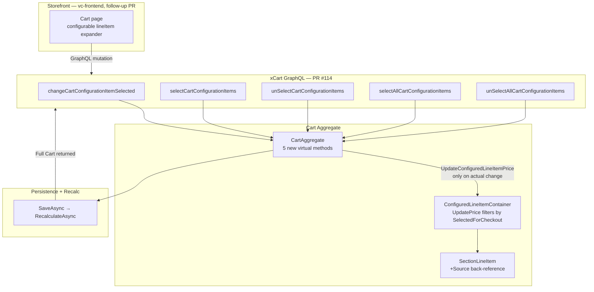

# BA Analysis Report — Virto Commerce

**Date:** 2026-05-07
**Scope:** vc-module-x-cart PR #114 — five new GraphQL xAPI mutations toggling `ConfigurationItem.SelectedForCheckout` on configured (configurable-product) line items.
**PR URL:** https://github.com/VirtoCommerce/vc-module-x-cart/pull/114
**Build artifact:** `VirtoCommerce.XCart_3.1013.0-pr-114-8518.zip` (vc3prerelease blob)
**VC Version:** xCart `3.1013.0` pre-release (PR open against `dev`)
**Analysts:** ba-api-specialist, ba-system-analyzer, ba-doc-writer (orchestrated)

---

## Executive Summary

PR #114 adds the cart-engine plumbing for **selective checkout of configurable-product placements**. Today, when a B2B buyer adds a configurable bundle (e.g. mattress cover + 2 pillows + blanket + custom embroidery file) to the cart, every placement is unconditionally priced into the line. After this PR, the storefront can let the buyer include or skip individual placements before checkout, with the line price recalculating in real time.

The change is **backend-only**. Five new GraphQL mutations (`changeCartConfigurationItemSelected`, `selectCartConfigurationItems`, `unSelectCartConfigurationItems`, `selectAllCartConfigurationItems`, `unSelectAllCartConfigurationItems`) plus two shared input types (`ConfigurationSectionKeyInput`, `ConfigurableProductOptionKeyInput`) ship in this PR; the vc-frontend UI that consumes them is in a follow-up release.

The most consequential new behavior is a **repricing asymmetry**: configuration-item selection changes the parent lineItem's `listPrice`, while line-item-level selection (the existing `changeCartItemSelected` family) does not. Frontend price-display components and any caching layer must respect this asymmetry — assuming "selection mutations never touch line prices" will produce a P0-revenue defect for configurable products.

Five business-logic invariants drafted (`PROPOSED-BL-CART-010..014`); the highest-priority immediate action is authoring 12–15 runner-native test cases in `regression/suites/Backend/graphql/050i-graphql-configurations.csv` against the pre-release build.

---

## 1. System Architecture Overview



**Key dependencies:**
- **Authorization:** `CartCommandBuilder` base — same auth + `IDistributedLockService` (cart-scoped lock) as all other cart mutations.
- **Registration:** `ISchemaBuilder` auto-discovery (modern path). `PurchaseSchema.cs` (legacy `FieldBuilder` flow) untouched — legacy lineItem-level selection still uses the old registration path.
- **Repricing:** `ConfiguredLineItemContainer.UpdatePrice` is the pivot — it filters placements by `selectedForCheckout` when summing into `lineItem.ListPrice`.
- **Persistence:** All five mutations end with `SaveAsync → RecalculateAsync`, propagating any reprice into cart subtotal/tax/shipping totals.

**Data flow:** Client → GraphQL → `<MutationName>CommandBuilder` → MediatR command → `<MutationName>CommandHandler` → `CartAggregate.<Action>Async()` → conditional `UpdateConfiguredLineItemPrice` → `SaveAsync` → response.

---

## 2. User Flow Analysis

### Hypothesized Flow (post-frontend integration)

```mermaid
sequenceDiagram
    actor User
    participant CartUI as Cart Page (/cart)
    participant xAPI as xCart GraphQL
    participant Agg as CartAggregate
    participant Recalc as RecalculateAsync

    User->>CartUI: Expand "Configurable Hat" lineItem
    CartUI->>CartUI: Render section checkboxes (state from configurationItems[].selectedForCheckout)

    alt Single checkbox toggle
        User->>CartUI: Uncheck "Embroidery file" section
        CartUI->>xAPI: changeCartConfigurationItemSelected
        xAPI->>Agg: ChangeConfigurationItemSelectedAsync(lineItemId, sectionKey, false)
        Agg->>Agg: UpdateConfiguredLineItemPrice (flag flipped)
        Agg->>Recalc: SaveAsync → RecalculateAsync
        Recalc-->>CartUI: Cart with new listPrice + totals
        CartUI->>User: Line price drops; subtotal/tax recalculate
    end

    alt "Select all" header click
        User->>CartUI: Click "Include all parts"
        CartUI->>xAPI: selectAllCartConfigurationItems(lineItemId)
        xAPI->>Agg: ChangeAllConfigurationItemsSelectedAsync(lineItemId, true)
        Note over Agg: No-change short-circuit if already all selected
        Agg-->>CartUI: Cart (totals unchanged or restored)
    end
```

### Current Flows (pre-PR)

| Flow | Today | After PR #114 |
|---|---|---|
| Toggle single placement on/off | Call `updateConfigurationItem` with full `productId`/`quantity` payload — re-validates entire item, reloads catalog | Call `changeCartConfigurationItemSelected` — boolean flip only, no catalog reload |
| Toggle subset of placements | N round trips to `updateConfigurationItem` | One batch call to `selectCartConfigurationItems` / `unSelectCartConfigurationItems` |
| "Select all" / "Unselect all" | Client enumerates + N round trips | One batch call to `selectAllCartConfigurationItems` / `unSelectAllCartConfigurationItems` |

### 🔴 Identified Pain Points

#### Resolved by PR #114

| ID | Description | Severity |
|---|---|---|
| PP-R-001 | `updateConfigurationItem` requires `productId`/`quantity` as `NonNull` and re-validates the entire item just to flip a boolean — wasteful on every selection toggle | **High** |
| PP-R-002 | Bulk selection requires N round trips and N reprice computations | **Medium** |
| PP-R-003 | "Select all" / "Unselect all" requires the client to enumerate every section and issue per-section calls | **Medium** |

#### Introduced by PR #114

| ID | Description | Severity |
|---|---|---|
| PP-N-001 | **Repricing asymmetry**: configuration-item selection changes `lineItem.listPrice`; line-item-level selection does not. UIs/caches that assume symmetry will display stale prices | **High** (P0-revenue) |
| PP-N-002 | **Silent no-op on unmatched section keys** in batch operations: response is HTTP 200, `errors[]` empty, even when half the keys never matched a config item — can mask client bugs where the section key drifted | **Medium** (P1-data) |
| PP-N-003 | **DX awkwardness**: a UI that programmatically picks one of three behaviors (explicit boolean / hardcoded select / hardcoded unselect) wires three different mutation field names. Slightly ergonomic friction; mitigated by a clear decision tree in the developer docs | **Low** |

### ✅ Recommended Improvements

1. **Add a frontend-level invariant test** (Storybook or Playwright) that re-asserts `lineItem.listPrice` after every selection toggle. Catches the asymmetry blind spot at the storefront layer.
2. **Server-side response telemetry**: emit a structured log when a batch selection mutation processes ≥1 unmatched key. Lets ops detect drift between client-cached section keys and current cart state without escalating to a hard error.
3. **Schema description annotations**: add GraphQL field descriptions on `selectCartConfigurationItems` / `unSelectCartConfigurationItems` builders so introspection tools surface "Hardcodes selectedForCheckout = true/false" — useful because the input type is shared and its name does not encode the direction. (Backend follow-up.)

---

## 3. User Stories

User stories are out-of-scope for this PR-driven analysis (no `ba-story-writer` was dispatched — the work is a backend implementation of an already-specified feature). When the vc-frontend integration PR opens, run `/ba-stories` against the cart-page UI epic to generate full Agile stories with BDD acceptance criteria covering:

- Per-placement checkbox interaction
- "Include all" / "Skip all" header controls
- Live price recalculation on toggle
- Saved-cart persistence of selection state
- Mobile / accessibility (keyboard, screen reader, touch targets)
- Checkout exclusion: only `selectedForCheckout = true` placements are charged

---

## 4. API Analysis

### Endpoint Inventory (delta from PR #114)

| Method | Path | Field | Auth | Status |
|---|---|---|---|---|
| POST | `/xapi/graphql` | `changeCartConfigurationItemSelected` | Cart-scoped | **NEW** |
| POST | `/xapi/graphql` | `selectCartConfigurationItems` | Cart-scoped | **NEW** |
| POST | `/xapi/graphql` | `unSelectCartConfigurationItems` | Cart-scoped | **NEW** |
| POST | `/xapi/graphql` | `selectAllCartConfigurationItems` | Cart-scoped | **NEW** |
| POST | `/xapi/graphql` | `unSelectAllCartConfigurationItems` | Cart-scoped | **NEW** |

Full mutation reference (request/response schemas, examples, error codes, comparison sections): [`pr-114-api-docs.md`](./pr-114-api-docs.md).

### API Health Assessment

**Consistency findings:**

1. ✅ **Naming** (`unSelect` capitalization) matches the existing `changeCartItemSelected` lineItem-level family — internally consistent, no new convention introduced.
2. ✅ **`selectedForCheckout` absent from batch input types** is by design — direction is encoded in the mutation field name; allowing a contradicting boolean would be ambiguous. Same pattern as the legacy lineItem family.
3. ✅ **Single-`lineItemId` scoping** is sound — gives the handler an exact reprice target and bounds "select all" to a meaningful unit (one configurable lineItem matches one storefront UI block).
4. ✅ **Test-data files match schema**: all five `.graphql` request templates in `test-data/graphql/mutations/*.graphql` validate against the documented input types — no mismatches.
5. ⚠️ **Shared input type ambiguity**: `selectCartConfigurationItems` and `unSelectCartConfigurationItems` share `InputChangeCartConfigurationItemsSelectedType`. Introspection tools will show identical inputs for both — the direction is recoverable only from the field name. Add GraphQL field description strings to make this explicit.
6. ℹ️ **No `changeCartConfigurationItemsSelected` plural variant** with explicit boolean. Deliberate: the select/unSelect directional pair covers every known UI use case. Not a gap.

### Recommended API Improvements

1. Add GraphQL `Description` attributes to the 5 mutation builder field registrations so introspection surfaces direction semantics for the shared-input pair.
2. Document the no-change short-circuit explicitly in the public xAPI reference once the docs site catches up — it is a non-trivial performance guarantee (batch UIs that resend full state on every interaction won't trigger repeated reprice).
3. Future-proof `ConfigurableProductOptionKeyInput`: it currently exposes only `productId`. If new section types require additional discriminators (e.g. `variantCode`), adding optional fields is backward-compatible.

---

## 5. User Documentation

Two documents were produced:

1. **End-user feature article** — `pr-114-user-docs.md` — describes the customer benefit, what the cart will look like, four scenario walkthroughs, and eight FAQs. Written in plain English; the word "mutation" does not appear. Includes a clear "Coming soon — backend ready, storefront UI in progress" status banner.
2. **Developer integration quick-start** — `pr-114-developer-quickstart.md` — TL;DR, decision tree for picking the right mutation, four-stage E2E walkthrough with a TypeScript fetch wrapper, response-reading guidance, six documented pitfalls (incl. repricing asymmetry, no-change short-circuit, silent no-op for unmatched keys, `option.productId` discriminator), and a migration table from `updateConfigurationItem`.

Full mutation reference for engineers building integrations lives in `pr-114-api-docs.md`.

---

## 6. Implementation Roadmap

| # | Item | Effort | Priority | Owner |
|---|---|---|---|---|
| 1 | Author runner-native GraphQL test cases (12–15) for the 5 mutations in `regression/suites/Backend/graphql/050i-graphql-configurations.csv` | M | **P0 — now** | test-management-specialist |
| 2 | Add 2–3 cart-repricing smoke cases to `regression/suites/Frontend/cart/028-cart-core.csv` (configurable line, deselect, verify price drop) | S | P1 — now | test-management-specialist |
| 3 | Add a schema-presence probe for `configurationItems[].selectedForCheckout` in `regression/suites/Frontend/configurable-products/072c-cross-cutting.csv` | S | P2 — now | test-management-specialist |
| 4 | Promote any approved `PROPOSED-BL-CART-010..014` entries into `business-logic.md` (per-entry user approval required) | S | P1 — after user review | user → orchestrator |
| 5 | vc-frontend integration: cart page section checkboxes + "Select all" / "Unselect all" header controls | L | P0 — separate PR | frontend team |
| 6 | E2E suite updates (`072` UI, `072b` E2E) once vc-frontend lands | M | P1 — after frontend PR | test-management-specialist |
| 7 | Admin-side regression in `052` for orders containing partially-included configured lines | M | P2 — after E2E flow testable | test-management-specialist |
| 8 | Storefront frontend repricing-asymmetry invariant test (PP-N-001 mitigation) | S | P1 — with frontend PR | qa-frontend-expert |
| 9 | Server-side telemetry log for batch mutations with ≥1 unmatched key (PP-N-002 mitigation) | S | P2 — backend follow-up | platform team |
| 10 | GraphQL `Description` annotations on the 5 mutation builders (introspection clarity) | XS | P2 — backend follow-up | xCart team |

---

## 7. Open Questions

1. **vc-frontend timeline**: is the storefront UI integration tracked as a JIRA epic? The end-user doc and E2E suites need a target sprint to schedule against.
2. **Order admin display**: when a placed order contains a configurable line with some sections excluded, how does the admin order detail page render the excluded placements? (Visible but greyed? Hidden? Carried over with a "not charged" tag?) Affects suite 052 test design and warehousing/fulfilment downstream.
3. **Saved cart / wishlist parity**: do the new mutations operate identically against `cartType: "Wishlist"`? Inputs allow it; behavior parity not explicitly tested in the PR's 13 unit tests. Worth a confirm-and-document pass.
4. **Promo / coupon interaction**: if a coupon's minimum-order amount is met only when ALL placements are included, does deselecting a placement push the cart below the minimum and revoke the coupon? Crosses into BL-CART-003 / BL-CHK-007 territory.
5. **Inventory constraints**: a deselected placement no longer counts toward stock reservation. Is the existing `BL-CART-002` (out-of-stock mid-session) re-evaluated immediately on deselect→reselect? Not addressed by the PR.

---

## 8. Proposed Business Invariants

| Proposed ID | Domain | Severity | Title | Source |
|---|---|---|---|---|
| PROPOSED-BL-CART-010 | CART | P0-revenue | Configuration-item selection reprices the parent configurable lineItem | PR #114 §Repricing semantics; `ConfiguredLineItemContainer.UpdatePrice` |
| PROPOSED-BL-CART-011 | CART | P1-data | Unmatched section key in batch selection is a silent no-op, not a hard error | PR #114 §Validation errors; `CartAggregateTests` "unmatched section no-op" |
| PROPOSED-BL-CART-012 | CART | P1-data | All 5 selection mutations are scoped to exactly one `lineItemId`; "all" never crosses lineItem boundaries | PR #114 §Scoping |
| PROPOSED-BL-CART-013 | CART | P1-data | No-change short-circuit — repricing MUST NOT execute when no flag actually flips | PR #114 §Key business behavior; `CartAggregateTests` "no-change short-circuit" |
| PROPOSED-BL-CART-014 | CART | P1-data | `(sectionId, type)` is sufficient for Text/File section lookup; Variation requires `option.productId` | PR #114 §Identification; `ConfigurationSectionKeyInput.cs`, `ConfigurableProductOptionKeyInput.cs` |

**Stale BL-* flagged:** 0. Configuration-item selection is a new dimension of cart behavior; no existing `BL-CART-001..009` invariant becomes inaccurate.

Full drafts: [`bl-proposals-2026-05-07.md`](./bl-proposals-2026-05-07.md)

> These are drafts. `.claude/agents/knowledge/business-logic.md` has not been modified. Review the proposals file, assign final IDs, approve per entry, and direct promotion manually. Claude will never promote on its own, in bulk, or on inferred approval.

---

## Artifacts Produced

| File | Purpose | Audience |
|---|---|---|
| `reports/ba/ba-report-2026-05-07.md` | This synthesis report | All stakeholders |
| `reports/ba/pr-114-context.md` | PR diff briefing (raw context for sub-agents) | Internal / archival |
| `reports/ba/pr-114-api-docs.md` | Full mutation reference (5 mutations + 2 input types) | Integration engineers |
| `reports/ba/pr-114-system-analysis.md` | Flow analysis, pain points, suite mapping, BL drafts | QA leads, engineering managers |
| `reports/ba/pr-114-user-docs.md` | End-user feature explainer, FAQs | Storefront shoppers (when feature ships) |
| `reports/ba/pr-114-developer-quickstart.md` | Integration guide with examples + pitfalls | Frontend / integration engineers |
| `reports/ba/bl-proposals-2026-05-07.md` | 5 BL invariant drafts pending user approval | User (per-entry approval gate) |
