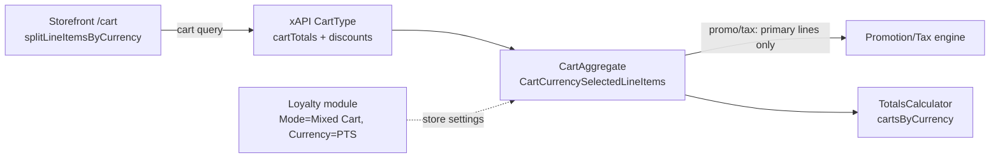

# BA Analysis Report — Loyalty "Mixed Cart" (VCST-5101)

**Date:** 2026-06-09
**Scope:** Story VCST-5101 (under Epic VCST-5099 "Loyalty – Mixed Cart") — add a loyalty (points-currency) product to the same cart as regular catalog products and check out in one flow. Status: *Testing*.
**Build:** vcst-qa @ Platform 3.1035.0 · vc-theme-b2b-vue 2.51.0-pr-2310 · XCart 3.1018.0-pr-120 · Cart 3.1005.0-pr-188 · vc-frontend PR #2310 · store B2B-store · loyalty currency `PTS`, mode "Mixed Cart".

---

## Executive Summary

Mixed Cart lets a shopper hold regular (USD) lines and loyalty (PTS) lines in **one** cart, with totals split per currency and tax/promotion applying to primary-currency lines only. The feature is functionally working — per-currency `cartTotals`, add-with-currency mutation, and the split-by-currency summary all verify PASS. **One High/revenue defect remains:** a cart-subtotal **percentage coupon** over-discounts the USD bucket by folding the PTS line's value into the discount base (grows $8 per +PTS80). Code grounding **refines** the original root-cause hypothesis: the per-line promotion mapping *is* correctly currency-filtered (`CartCurrencySelectedLineItems`) — the leak is specifically the `%`-coupon reward computing against the `Cart.SubTotal` **scalar**, which is still summed across currencies. Two secondary items: configurable products are inconsistently presented (not excluded) in `/loyalty-catalog`, and a cosmetic Apollo cache warning. No loyalty business-invariant domain exists yet — 6 are proposed.

---

## 1. System Architecture Overview

Mixed Cart spans four layers; the per-currency split is enforced at the xAPI aggregate.

| Layer | Repo / PR | Key change | File (cited by ba-system-analyzer) |
|-------|-----------|-----------|------------------------------------|
| Totals calc | vc-module-cart #188 | `cartsByCurrency` dictionary; new runtime-only `CartTotal` model (per-currency `Sub/Tax/Discount/Total`) | `DefaultShoppingCartTotalsCalculator.cs`, `Core/Model/CartTotal.cs` |
| xAPI aggregate | vc-module-x-cart #120 | `CartCurrencySelectedLineItems` (primary-currency filter) gates promo/tax/`extendedPriceTotal`; `cartTotals: [CartTotalType]`; `addItem.itemCurrencyCode`; `CartProducts` key `{productId}:{CURRENCY}` | `CartAggregate.cs`, `Schemas/CartType.cs`, `Mapping/CartMappingProfile.cs` |
| Loyalty | vc-module-loyalty (dev) | Store settings `Loyalty.Mode` (`Loyalty Store`/`Mixed Cart`/…) + `Loyalty.Currency`; per-product point factors | `ModuleConstants.cs`, `LoyaltyPointsCalculator.cs`, `LineItemTypeHook.cs` |
| Storefront | vc-frontend #2310 | `splitLineItemsByCurrency()`; `order-summary.vue` reads `cartTotals[isDefaultTotalCurrency]`; `currencyCode` added to cart fragments | `core/utilities/line-items/index.ts`, `order-summary.vue`, `shortLineItem.graphql` |

---

## 2. User Flow Analysis

### Current flow (verified live by QA)
Browse `/loyalty-catalog` (PTS prices) → add PTS loyalty item → cart shows **"Products in PTS"** group + **"Total in PTS"** block alongside the USD block (`isDefaultTotalCurrency=true`) → add regular USD item → both currencies bucket correctly → checkout is **not blocked**, Place Order enables (PTS line not excluded at checkout). Persistence across reload, guest→sign-in merge, remove-all-primary (PTS-only cart renders cleanly), and line independence all PASS.

### 🔴 Identified Pain Points

| # | Pain point | Severity | Evidence |
|---|-----------|----------|----------|
| P1 | **Cart-% coupon over-discounts** by folding the PTS line into the USD discount base (+$8 per +PTS80; API `discounts[0].amount=$36.40=10%×$364`). Violates Task-1 AC "tax & promotion on primary-currency lines only". | **High / revenue** | `cart-resp-coupon-pts-leak.json`; `BUG-mixed-cart-coupon-pts-leaks-into-usd-discount.md` |
| P2 | **Configurable products not excluded** from loyalty namespace: PDP browsable in `/loyalty-catalog`, shows USD price in a PTS catalog, cards read "From PTS0.00". Add-to-cart is correctly disabled, but presentation is inconsistent. No exclusion code found in any of the 4 PRs. | Medium / UX | exploratory-session Focus #7 |
| P3 | **Loyalty points computed on PTS lines** — `LineItemTypeHook.CalculatePoints` has no currency guard, so a PTS line could show "earn points" on a points purchase. | Medium / UX | `LineItemTypeHook.cs` (ba-system-analyzer) |
| P4 | **Apollo "Missing field 'currencyCode'"** warning on every cart mutation (client-side only; xAPI returns the field correctly). | Low / cosmetic | `BUG-mixed-cart-currencyCode-apollo-cache-write.md` |
| P5 | **Pre-PR persisted carts** have empty (runtime-only) `cartTotals`; `order-summary.vue` falls back to legacy scalar `cart.subTotal` (cross-currency) — no cache-bust on enabling Mixed Cart. | Medium / data | `order-summary.vue` fallback (ba-system-analyzer) |

### Refined root cause for P1 (BA value-add)
The original bug hypothesis ("discount base sums all line `ListTotal`s") is **partially refuted by code**: `CartMappingProfile.cs` maps `CartAggregate → PromotionEvaluationContext` by iterating `cartAggr.CartCurrencySelectedLineItems` (explicit comment: *"Tax and Promotion are computed only on primary-currency lines"*) — so per-line promo entries **are** currency-filtered, and the automatic −20% promo is correct (PTS discount=0). The leak is narrower: the same mapping sets `promoEvalcontext.CartTotal = cartAggr.Cart.SubTotal`, and a **cart-subtotal percentage coupon** is evaluated against that **scalar**. If `Cart.SubTotal` (via the totals calculator's `selectedItemsWithoutGifts` / upstream `SelectedLineItems`) is still summed across currencies, the % coupon applies to the inflated cross-currency base even while per-line entries are filtered. The API response ($36.40, server-side) confirms the defect is server-side, not a cache artifact.

> **Recommendation:** update `BUG-mixed-cart-coupon-pts-leaks-into-usd-discount.md` root-cause section to target `promoEvalcontext.CartTotal = Cart.SubTotal` + the upstream `SelectedLineItems`/`selectedItemsWithoutGifts` currency filter; fix should make the `%`-coupon base mirror `CartCurrencySelectedLineItems` (the per-line path already does).

### ✅ Recommended Improvements (prioritized)
1. **Fix P1** — scope the cart-subtotal coupon base to primary-currency lines (mirror `CartCurrencySelectedLineItems`); add a mixed-cart promotion/coupon regression case (coverage gap — none exists). **[S]**
2. **Product decision on P2** — exclude configurables from `/loyalty-catalog` route + hide PTS price card, or define intended presentation. **[S/M]**
3. **Guard P3** — skip loyalty-points computation when `lineItem.Currency == Loyalty.Currency`. **[S]**
4. **Fold P4** into vc-frontend PR #2310 (add `currencyCode` to the batcher's optimistic write). **[S]**
5. **Cache-bust P5** — force recalculation when Mixed Cart is enabled and `cartTotals` is empty. **[M]**

---

## 3. User Stories

**Epic VCST-5099 — Loyalty: Mixed Cart**

**US-1 (VCST-5101) — Add a loyalty product to a mixed cart**
*As a shopper, I want to add a points-priced loyalty product to the same cart as my regular products so I can check out once.*
- **AC1** *(Given* a cart with a USD line *When* I add a PTS loyalty product *Then* a separate PTS line is created — never merged with a USD line of the same product) — `addItem(itemCurrencyCode:"PTS")`, key `{productId}:PTS`. **PASS**
- **AC2** *(Given* a mixed cart *Then* `cart.cartTotals` has one entry per currency, exactly one `isDefaultTotalCurrency=true` = cart currency, each block totalling only its own lines). **PASS**
- **AC3** *(Given* a primary-currency-only cart *Then* `cartTotals` has exactly one element). **PASS**
- **AC4** *(Given* a mixed cart *When* any promotion or coupon applies *Then* the discount base = primary-currency lines only, independent of PTS quantity). **❌ FAIL (P1)**
- **AC5** *(Given* a mixed cart *Then* the summary visually splits line items + totals by currency ("Products in PTS" / "Total in PTS")). **PASS**
- **AC6 (constraint)** Configurable products are excluded from the loyalty/mixed flow. **⚠ PARTIAL (P2)** — add-to-cart disabled, but still browsable/priced in PTS catalog.
- **DoD:** AC1–AC6 green on `LOYALTY_VIP_USER`; mixed-cart promotion regression case added; xAPI `CartTotalType` documented; no console errors.

**US-2 (proposed) — Configurable exclusion is explicit and consistent**
*As a merchant, I want configurable products to be cleanly excluded from the loyalty catalog so shoppers aren't shown USD/"From PTS0.00" prices they can't act on.* (Derived from P2; needs product-owner confirmation of intended behavior.)

---

## 4. API Analysis

### Endpoint inventory (xAPI — verified against `graphql-schema.md` + live introspection 2026-06-09)

| Operation | Type | Key fields / inputs | Notes |
|-----------|------|---------------------|-------|
| `cart` | Query | `storeId!`, `currencyCode!` (= primary/display currency), `userId` → `CartType` | Returns **all** lines regardless of `lineItem.currencyCode`; `currencyCode` arg sets cart identity, not a filter |
| `CartType.cartTotals` | Field | `[CartTotalType]` = `{isDefaultTotalCurrency, total, subTotal, taxTotal, discountTotal}` (MoneyType) | **Field name confirmed `cartTotals`.** 1 element if single-currency; N if mixed. `CartTotalType` is **missing from `graphql-schema.md`** → add it |
| `CartType.discounts` | Field | `[DiscountType]` = `{description, amount, coupon}` | **No `currency` field** — flat, primary-currency scalar. Carries the un-scoped coupon amount (P1) |
| `LineItemType.currencyCode` | Field | `String` | Per-line currency (PTS/USD); line money fields denominated in it |
| `addItem` | Mutation | `InputAddItemType`: …, `itemCurrencyCode: String` (optional), `currencyCode` (cart) | `itemCurrencyCode` pins the line currency; omit → inherits cart currency; **undocumented** distinction |
| `changeCartItemQuantity` / `addCoupon` / `removeCoupon` / `clearCart` | Mutation | standard cart identity + op fields | Coupon discount computed cart-wide, not per-currency (P1) |
| `loyaltyBalance` / `loyaltyPointsHistory` | Query | `userId`, … | Present in schema; not exercised this run |

### API health
- **Confirmed High (P1):** server response `discounts[0].amount = $36.40 = 10% × ($155 + $240-as-USD)`; correct value is 10% × $155 = $15.50. `DiscountType` has no currency field, so the schema cannot represent currency-scoped discounts today.
- **Confirmed Low (P4):** xAPI returns `currencyCode` present/non-null on every line; the warning is client-side only.
- **Test-harness noise (not API defects):** several runner cases use JMESPath `[?currencyCode==PTS]` (unquoted) → false failures; should be `[?currencyCode=='PTS']`. Affects `050b1`/`050b4`.

### Recommended API improvements
- **R1:** Scope the coupon/% discount base to `CartCurrencySelectedLineItems`; consider per-currency `discounts` (a `discounts` list on `CartTotalType`, or a `currency` field on `DiscountType`) so multi-currency carts can represent currency-scoped discounts.
- **R2:** Document `CartTotalType` in `graphql-schema.md`.
- **R3:** Add a schema description distinguishing `itemCurrencyCode` (line) from `currencyCode` (cart).
- **R4:** Fix the JMESPath quoting in `050b1`/`050b4` runner cases.
- **R5:** Add a promotion-on-mixed-cart regression case (`050b4` or new), fixture `addCoupon` with a `LOYALTY_VIP_USER` variant.

---

## 5. User Documentation (Admin — enabling Mixed Cart)

**Configure Mixed Cart (PlatformUserGuide style)**
1. In the Admin panel open **Stores → \<your store\> → Settings → Loyalty**.
2. Set **Mode** to **Mixed Cart** and **Loyalty Currency** to your points currency code (e.g. `PTS`) — the code must match a registered platform currency, case-insensitively.
3. Ensure loyalty is **Enabled** and per-product point factors are configured in the Loyalty module.
4. Shoppers can now add loyalty (points) products and regular products to one cart; the cart and order summary show a separate block per currency, and discounts/taxes apply to the store's primary currency only.

> **Note (known issue):** percentage coupons on a mixed cart currently over-discount the primary-currency total (VCST-5101 P1) — fix pending. Configurable products are not yet excluded from the loyalty catalog presentation.

---

## 6. Implementation Roadmap

| Priority | Item | Effort |
|----------|------|--------|
| P0 | Fix P1 coupon discount-base scoping + add regression case | S |
| P1 | P3 loyalty-points currency guard; P4 Apollo fragment write | S |
| P1 | P2 configurable exclusion (pending product decision) | S–M |
| P2 | P5 cache-bust for pre-PR carts; per-currency `discounts` schema | M |
| P2 | Doc: `CartTotalType` in schema ref; `itemCurrencyCode` description | S |

---

## 7. Open Questions
1. Should configurable products be excluded from `/loyalty-catalog` entirely, or shown with PTS pricing? (P2 — product owner)
2. Is the `Cart.SubTotal` scalar guaranteed currency-filtered upstream (`SelectedLineItems` / `selectedItemsWithoutGifts`), or does the % coupon read a cross-currency sum? (root-cause confirm for the P1 fix)
3. Should `DiscountType` gain a `currency` field for true per-currency discount representation?
4. Apollo `LineItemType` cache key — does it include `currencyCode`, or only the line `id`? (determines whether a cross-currency cache collision is possible)
5. Is configurable exclusion in scope for VCST-5101 or deferred to a follow-up?

---

## 8. Proposed Business Invariants

No loyalty/mixed-cart BL domain exists today; 6 new invariants proposed under a new **`BL-LOY-*`** domain, plus 1 stale flag.

| Proposed ID | Domain | Severity | Title | Source |
|-------------|--------|----------|-------|--------|
| PROPOSED-BL-LOY-001 | LOY | P0-revenue | Promotion/coupon scoped to primary-currency lines only | `CartMappingProfile.cs` (#120) |
| PROPOSED-BL-LOY-002 | LOY | P1-data | `addItem itemCurrencyCode` stores line at that currency; no cross-currency merge | `CartAggregate.cs` (#120) |
| PROPOSED-BL-LOY-003 | LOY | P1-data | `cartTotals` = one entry per distinct line currency; default = cart currency | `CartType.cs` (#120) |
| PROPOSED-BL-LOY-004 | LOY | P0-revenue | Loyalty lines excluded from promo context even when selected for checkout | `CartMappingProfile.cs` (#120) |
| PROPOSED-BL-LOY-005 | LOY | P2-ux | Loyalty-currency line shows no "earn points" indicator | `LineItemTypeHook.cs` (loyalty) |
| PROPOSED-BL-LOY-006 | LOY | P1-data | Currency switch converts primary lines, preserves loyalty lines | `ChangeCartCurrencyCommandHandler.cs` (#120) |

**Stale BL-\* flagged:** 1 — `BL-CART-004` (currency switching) is superseded by Mixed Cart's multi-currency model; revise to scope it to primary-currency items.

Full drafts: [`reports/ba/bl-proposals-2026-06-09.md`](./bl-proposals-2026-06-09.md)

> These are drafts. `.claude/agents/knowledge/business-logic.md` has **not** been modified. Review the proposals file, assign final IDs, and promote manually per-entry.
