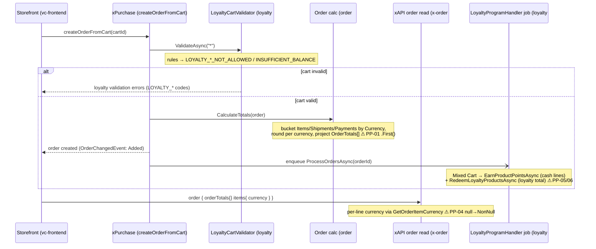

# BA Analysis Report — Virto Commerce

**Date:** 2026-06-23
**Scope:** VCST-5104 "[Loyalty][Mixed Cart][E2E] Create Order" (Story, High, status=Testing) under Epic VCST-5099 "Loyalty – Mixed Cart" — flow analysis + API surface + order-layer business invariants
**Source:** 4 open PRs on branch `feat/VCST-5104` (base `dev`), read from GitHub source — order #497, x-order #43, loyalty #10, frontend #2335
**Env:** vcst-qa @ Orders 3.1010.0-alpha.1429-vcst-5104 · XOrder 3.1006.0-pr-43 · Loyalty 3.1004.0-pr-10 · Theme 2.52.0-pr-2335

---

## Executive Summary

VCST-5104 lets a single cart hold cash-priced and loyalty-points-priced lines and check out as one order, splitting totals by currency end-to-end (xAPI `orderTotals`, storefront summary, Admin currency column) and decrementing the loyalty balance at order time. The flow is functionally verified on vcst-qa (mixed order placed, USD + PTS totals correct, redeem + earn both posted exactly once). The dominant risk is currency-registration coupling: three independent code paths assume the loyalty currency (e.g. `XPT`) is a registered platform currency, and each crashes differently if it is not. This report maps the create-order flow, ranks 7 pain points, assesses the API contract, and proposes 5 order-layer business invariants (drafts in `bl-proposals-2026-06-23.md`).

---

## 1. System Architecture / Flow

Four modules collaborate on one create-order flow. Cart validation is synchronous; balance earn/redeem is an async Hangfire job fired after commit.



**Currency bucketing (order #497):** `DefaultCustomerOrderTotalsCalculator` collects distinct currency codes across items/shipments/payments, sums + rounds each bucket, then projects `CustomerOrder.OrderTotals[]` (one `OrderTotal{CurrencyCode,Total,SubTotal,TaxTotal,DiscountTotal}` per currency), gated by response group `WithOrderTotals` (bit 9).
**xAPI read (x-order #43):** the aggregate carries `AllCurrencies`; line-item money + `currency` resolve per-line (`GetOrderItemCurrency`, falling back to order currency only when the line currency is empty); `orderTotals` exposes `isDefaultTotalCurrency`.
**Earn/redeem (loyalty #10):** async job, `[DisableConcurrentExecution]`, per-user lock; dedup keyed by `(objectType, objectId, operationType)` so Earned + Redeemed both post once per order; gateway-paid orders skipped.

---

## 2. Flow Analysis — Pain Points

| # | Issue | Severity | Source |
|---|-------|----------|--------|
| PP-01 | Totals calculator `allCurrencies.First(c => c.Code == orderCart.Currency)` throws `InvalidOperationException` if a line currency isn't a registered platform currency; also case-sensitive `==`. Crashes order **save**, not just reads. | **High** | order #497 `DefaultCustomerOrderTotalsCalculator.CalculateTotals` |
| PP-04 | Per-line `currency` resolver returns `AllCurrencies?.FirstOrDefault(...)` = **null** into a `NonNullGraphType<CurrencyType>` field → whole `items`/`order` query errors. Mixed-cart PTS line is the exact trigger if loyalty currency unregistered. | **High** | x-order #43 `OrderLineItemType.cs:78` / `GetOrderItemCurrency` |
| PP-06 | `RedeemLoyaltyProductsAsync` reads `order.OrderTotals` but `ProcessOrdersAsync` loads orders with no explicit response group — if default omits `WithOrderTotals`, redeem **silently no-ops** → loyalty products effectively free. | Medium | loyalty #10 `ProcessOrdersAsync` / `GetNoCloneAsync` |
| PP-05 | TOCTOU: balance checked at cart-validation (pre-commit); deducted in background job (post-commit). Per-user lock dedups per orderId, not across two concurrent orders → both can pass one balance. | Medium | loyalty #10 validator vs `RedeemLoyaltyProductsAsync` |
| PP-08 | `cart.loyaltyPoints` line-item batch loader lacks the anonymous-user guard that the cart-level resolver has → guest `userId` passed to calculator (Bugbot High; did not reproduce live but the guard gap is real in source). | Medium | loyalty #10 `LineItemTypeHook` vs `ShoppingCartHook` |
| PP-03 | Admin order-items blade currency column header uses raw `{{ 'Currency' | translate }}` instead of `orders.blades.customerOrder-items.labels.currency` (key exists in en.json) → untranslated in non-English admin. | Low | order #497 `customerOrder-items.tpl.html` |
| PP-07 | `EarnProductPointsAsync` passes null `ProductId` line items into the calculator (no null filter). | Low | loyalty #10 `EarnProductPointsAsync` |

Supporting API-health findings: stale "Cart total"/"Cart subtotal" descriptions on `OrderTotalType` (should read "Order…"); `OrderTotalAggregate.Currency` exists but is not exposed as an `OrderTotalType.currency` field (recoverable only via `total{currency{code}}`); null `PointsCurrency` → `new Money(0, null)` in `loyaltyPoints` (B4); alpha cross-PR package chain — loyalty #10 and x-order #43 pin different Orders alphas, so all four must deploy together.

---

## 3. Recommended Improvements (prioritized)

1. **[P0]** PP-04 — fall back to `order.Currency` on the registration-miss branch of `GetOrderItemCurrency`/`GetConfiguratonItemCurrency` (extend the existing empty-currency fallback). Effort: S.
2. **[P0/High]** PP-01 — `.FirstOrDefault` + `EqualsIgnoreCase` + null-skip in the totals calculator. Effort: S.
3. **[High]** PP-06 — pass `WithOrderTotals` (or `Full`) explicitly in `ProcessOrdersAsync` order load; add a test proving redeem fires. Effort: S.
4. **[Medium]** PP-05 — reserve balance inside the lock at deduction time, or post-deduction negative-balance alert. Effort: M.
5. **[Medium]** PP-08 — add the anonymous guard to `LineItemTypeHook` batch loader. Effort: S.
6. **[Low]** PP-03 (i18n key), PP-07 (null-ProductId filter), B4 (null `PointsCurrency` guard), stale descriptions, expose `OrderTotalType.currency`. Effort: S each.

**Prereq for all of it:** the loyalty currency (`XPT`/`PTS`) MUST be registered in `/api/platform/currencies` — PP-01 and PP-04 both stem from this coupling; document it as a store-setup precondition.

---

## 4. API Analysis (summary)

**New/changed surface:** GraphQL `CustomerOrderType.orderTotals: [OrderTotalType]` (`isDefaultTotalCurrency`, total/subTotal/taxTotal/discountTotal as MoneyType); `OrderLineItemType` 13 money fields + `currency` now per-line (`GetOrderItemCurrency`); `OrderConfigurationItemType` price/salePrice/extendedPrice per-line; `CartType.loyaltyPoints: MoneyType` (auth-only, null for guest); `LoyaltyCartValidator` codes `LOYALTY_INSUFFICIENT_BALANCE{required,available}` / `LOYALTY_ONLY_POINT_PRODUCTS_NOT_ALLOWED` / `LOYALTY_POINT_PRODUCTS_NOT_ALLOWED` / `LOYALTY_PAYMENT_METHOD_NOT_ALLOWED`; REST `CustomerOrder.orderTotals` under `WithOrderTotals = 1<<9` (in `Full`).

**Health headline:** three currency-registration crash paths (PP-01 domain, PP-04 GraphQL, B4 cart) all stem from the loyalty currency not being a registered platform currency. Contract is otherwise additive/back-compatible (no field removed; `orderTotals` opt-in via response group; cart mutations surface loyalty rules as typed `validationErrors`).

**Example query** (mixed order, USD default + PTS):

```graphql
query($orderId: String!) {
  order(id: $orderId) {
    currency { code }
    orderTotals { isDefaultTotalCurrency total { amount currency { code } } subTotal { amount } taxTotal { amount } discountTotal { amount } }
    items { sku quantity currency { code } extendedPrice { amount currency { code } } }
  }
}
```
Mixed response → `orderTotals` has 2 entries: `{isDefaultTotalCurrency:true, …USD}` + `{isDefaultTotalCurrency:false, …XPT}`; each item carries its own `currency.code`.

---

## 6. Implementation Roadmap

| Effort | Items |
|--------|-------|
| **S (this PR cycle)** | PP-01, PP-02, PP-04, PP-06 fixes; i18n key; null guards (PP-07/B4); stale descriptions |
| **M (next sprint)** | PP-05 balance-reservation / TOCTOU hardening; register loyalty currency as a documented store-setup step; expose `OrderTotalType.currency` |
| **Coverage** | Register suites `075b-loyalty-mixed-cart-order` + `083b-loyalty-mixed-cart-order` in `config/test-suites.json` (loyalty selection currently resolves only 075+083); add negative-path cases for PP-02/PP-04 |

---

## 7. Open Questions

1. Is the loyalty currency (`XPT`/`PTS`) guaranteed-registered at store provisioning, or operator-configured? (Decides whether PP-01/PP-04 are edge or common.)
2. Intended UX for insufficient balance / invalid loyalty cart at place-order — inline cart error vs checkout-step block?
3. Does the Orders service default response group include `WithOrderTotals`? (Confirms or refutes PP-06.)
4. Is `ILoyaltyLogicService.GetUserBalanceAsync` present on the base branch? (x-order/loyalty compile dependency, API §C2.)

---

## 8. Proposed Business Invariants

5 order-layer invariants drafted — `BL-LOY-001..006` cover only the cart layer, so the order-creation layer is currently uncovered.

| Proposed ID | Domain | Severity | Title | Source |
|-------------|--------|----------|-------|--------|
| PROPOSED-BL-ORD-010 | ORD | P1-data | OrderTotals = one entry per currency, unique default flag | order #497 + x-order #43; live 2026-06-22 |
| PROPOSED-BL-ORD-011 | ORD | P0-revenue | Placed-order items retain per-line currency, non-null | x-order #43 `OrderLineItemType` (at risk — PP-04) |
| PROPOSED-BL-LOY-007 | LOY | P0-revenue | Earn + redeem each post exactly once, dedup per op type | loyalty #10 handler; live 2026-06-22 |
| PROPOSED-BL-LOY-008 | LOY | P0-revenue | Insufficient balance blocks order with typed `LOYALTY_INSUFFICIENT_BALANCE{required,available}` | loyalty #10 `LoyaltyCartValidator`; verified working 2026-06-22 |
| PROPOSED-BL-LOY-009 | LOY | P1-data | Only cash lines earn points; loyalty lines earn zero | loyalty #10 earn path; refines BL-LOY-005 |

**Stale BL-\* flagged:** 0.

Full drafts: [`reports/ba/bl-proposals-2026-06-23.md`](./bl-proposals-2026-06-23.md)

> These are drafts. `.claude/agents/knowledge/business-logic.md` has not been modified. Review the proposals file, assign final IDs, and promote per-entry.
