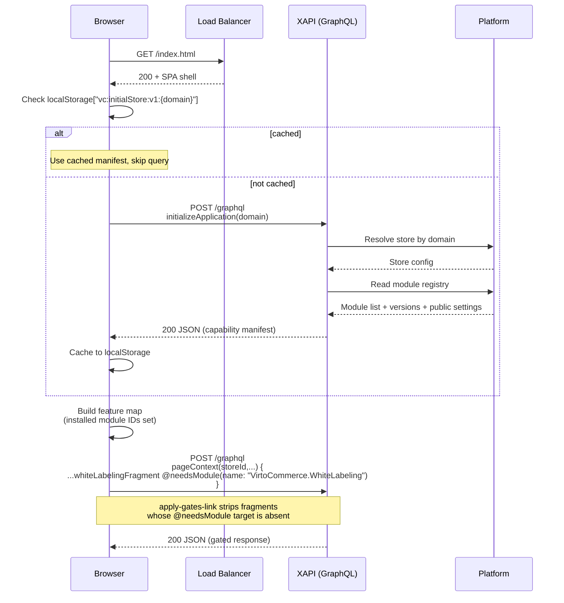

# BA Analysis Report — VCST-4642
**Date:** 2026-05-21
**Scope:** `/ba-analyze` — produce user + API docs for VCST-4642 (Frontend Application Initialization via XAPI)
**Environment under test:** vcst-qa (Platform `3.1028.0` | Xapi `3.1009.0-pr-66-020b` | Theme `2.50.0-pr-2293-55fc`)
**Story status:** Testing — PASS WITH NOTES (signed off earlier today)
**Related PRs:** [vc-module-x-api#66](https://github.com/VirtoCommerce/vc-module-x-api/pull/66) (backend), [vc-frontend#2293](https://github.com/VirtoCommerce/vc-frontend/pull/2293) (consumer)

---

## Executive Summary

VCST-4642 ships a **capability-manifest bootstrap** for Virto Commerce storefronts. On app boot, vc-frontend fires a single `initializeApplication` GraphQL query against `store(domain|storeId)` and receives the list of every installed platform module, its version, and its public settings. The Apollo `apply-gates-link` then strips any selection annotated with `@needsModule(name:"X")` when module `X` is absent from the manifest — eliminating `Cannot query field` HTTP 400 errors on environments missing optional modules. The backend half (vc-module-x-api#66) extends `StoreSettingsType` with `modules: [ModuleSettingsType!]!` and adds an admin setting `XAPI.Security.ReturnModuleVersion` (Platform > Security, default ON) that lets operators suppress version disclosure in production for security hardening. QA evidence shows the full E2E flow works (AC1–AC9, AC11 PASS; AC10 PASS_WITH_NOTE for one adjacent gap). Two P2 follow-ups remain: `GetPromotionCoupons` lacks `@needsModule` (F1) and per-store feature flags are exposed in the manifest but unconsumed by the frontend (F8).

---

## 1. System Architecture Overview



**Key components touched:**
- `vc-module-x-api` (PR #66) — adds `modules: [ModuleSettingsType!]!` to `StoreSettingsType` and registers `XAPI.Security.ReturnModuleVersion` setting in Platform > Security group.
- `vc-frontend` (PR #2293) — adds `apply-gates-link` Apollo middleware, `useModules` composable, and `localStorage["vc:initialStore:v1:<domain>"]` cache.
- Platform — no changes; just exposes the existing `IModuleCatalog` and `ModuleConstants.Settings (IsPublic=true)` through the new xAPI resolver.

**Module-version reporting flow:**

1. Frontend resolves store by `domain` (or `storeId`) → xAPI calls platform's store-resolver.
2. xAPI iterates `IModuleCatalog.Modules`, filters by `IsPublic` for settings, applies `ReturnModuleVersion` gate, projects to `ModuleSettingsType[]`.
3. Frontend caches result in `localStorage["vc:initialStore:v1:<domain>"]` for session lifetime.
4. Subsequent queries pass through `apply-gates-link`, which inspects `@needsModule` directives and strips selections when the named module isn't in the cached manifest.

---

## 2. User Flow Analysis

### Current Flows (after VCST-4642 ships)

**Storefront app boot:**
1. SPA shell loads from CDN
2. Apollo client checks `localStorage["vc:initialStore:v1:<domain>"]`
3. Cache miss → POST `/graphql` with `initializeApplication` (single anonymous call)
4. Response cached; subsequent navigations within session do NOT re-fire
5. Feature queries (`GetPageContext`, `GetWhiteLabelingSettings`, etc.) issued with `@needsModule`-annotated fragments
6. `apply-gates-link` strips fragments whose target module is absent

**Admin operator flow:**
1. Open Admin SPA → Settings → "Return module version" (Platform > Security group)
2. Toggle switch: ON (default) returns all module versions; OFF returns `""` and drops settings-less modules
3. Save — change reflected in next storefront GraphQL request (immediate, no cache lag)
4. Localized labels in EN + DE verified

### Identified Pain Points (resolved by this story)

| Pain | Severity | Resolution |
|------|----------|------------|
| Optional GraphQL queries failed with HTTP 400 in environments missing modules (e.g., `Cannot query field 'promotionCoupons'`) | High | `@needsModule` strips client-side before request |
| No version-compatibility contract between FE and BE modules | Medium | Versions now part of every manifest entry |
| Multiple independent GraphQL bootstrap calls fired at app start | Medium | Single `initializeApplication` consolidates the contract |
| No way to suppress installed-module fingerprint in production | Medium-High (security) | `XAPI.Security.ReturnModuleVersion` toggle |

### Remaining Pain Points (post-VCST-4642 follow-ups)

| Pain | Severity | Status |
|------|----------|--------|
| `GetPromotionCoupons.graphql` missing `@needsModule` (HTTP 400 on `/cart` when xMarketing absent) — see **F1** | P2 | Not introduced by this story; tracked for next sprint |
| Per-store feature flags surfaced in manifest but no FE consumer (e.g., `WhiteLabeling.WhiteLabelingEnabled` toggling has no visible effect) — see **F8** | P2 | Backend half ships; FE half pending |
| Manifest cache not invalidated on auth/org switch — domain-scoped only (**F2**) | Risk | No reproduction so far; flag for theoretical multi-org scenarios |
| `:v1:` cache-key suffix has no documented migration path (**F6**) | Question | Likely handled by suffix change, but contract undefined |

### Recommended Improvements (prioritized)

| # | Improvement | Effort | Why |
|---|-------------|--------|-----|
| 1 | Add `@needsModule(name:"VirtoCommerce.XMarketing")` to `GetPromotionCoupons.graphql` (and sweep sibling xMarketing queries) | S | Closes F1; one-line fix |
| 2 | Add a build-time lint that fails when a query selects an xAPI extension type without `@needsModule` on its root | M | Prevents F1-class regressions long-term |
| 3 | Wire `useWhiteLabeling()` / `useThemeContext()` to gate on per-store flag, OR introduce a `@needsFlag(name:"X")` client directive | M | Closes F8; story description's "feature flags" framing isn't honored without this |
| 4 | Document the cache-key migration contract (`:v1:` → `:v2:`) | S | Closes F6 |
| 5 | Surface the active manifest cache key + version in the storefront footer's "About" panel (debug-only) | S | Helps ops verify rollouts |

---

## 3. User Stories

(Skipped — `/ba-analyze` was scoped to `docs`. Story content already exists in JIRA VCST-4642 and the test evidence is canonical. No new user stories were generated. If new stories are needed for F1/F8 follow-ups, run `/ba-stories "F1 needsModule sweep"` or `/ba-stories "F8 per-store feature flag consumer"`.)

---

## 4. API Analysis

### Endpoint Inventory (touched by this story)

| Method | Path | Operation | Auth | Purpose |
|--------|------|-----------|------|---------|
| POST | `/graphql` | `initializeApplication` query | Anonymous | Bootstrap — resolve store + capability manifest |
| GET/POST | `/api/platform/settings/{XAPI.Security.ReturnModuleVersion}` | Platform REST settings (admin) | Bearer (admin) | Toggle module-version disclosure |
| PUT | `/api/stores/{storeId}` | Store update (admin) | Bearer (admin) | Per-store flag updates (manifest data source) |

**Resolver signature:**

```graphql
store(storeId: String, cultureName: String, domain: String): StoreResponseType
```

**New type chain (PR #66):** `StoreResponseType` → `StoreSettingsType.modules` → `ModuleSettingsType` → `ModuleSettingType`. All fields verified against live introspection on vcst-qa 2026-05-21. `ModuleSettingsType.moduleId` and `version` are `String!` (non-null); when the security setting is OFF, `version` returns `""` (preserves the non-null contract).

### API Health Assessment

| Aspect | Status |
|--------|--------|
| Schema introspection clean | ✅ Live-verified |
| Non-null contract honored under both setting states | ✅ Empty string, never null |
| Anonymous access (no auth required) | ✅ Verified — by design (boot must precede auth) |
| Error contract on invalid domain | ✅ `data.store: null`, no HTTP 500, no stack traces leaked |
| Localization (EN + DE) on admin setting | ✅ Both locales verified, no missing-key fallback |
| Immediate setting reflection (no cache lag) | ✅ < 60s on next request |
| Schema gap: `@needsFlag` directive parallel to `@needsModule` | ❌ Not implemented (F8) |
| Coverage: ALL xAPI extension queries gated | ❌ One gap — `GetPromotionCoupons` (F1) |

### Recommended API Improvements

- **`@needsFlag(name: "X")` directive** parallel to `@needsModule` — consumes per-store flags from the manifest. Closes F8.
- **Schema lint rule** in xAPI build: reject GraphQL files that select an xAPI extension type without a root `@needsModule` directive. Prevents F1-class issues.
- **Cache-key versioning policy**: document the contract for `:v1:` → `:v2:` migrations (clear-on-mismatch? prompt-reload? silent re-fetch?).

Full schema reference and worked examples in `docs/vcst-4642-api-reference.md`.

---

## 5. User Documentation

Two end-user-facing artifacts were produced and reviewed:

1. **`docs/vcst-4642-user-guide.md`** (371 lines) — covers three audiences:
   - Storefront operators / Solution Architects — what changes, how to verify
   - Platform Administrators — the new `XAPI.Security.ReturnModuleVersion` toggle, security trade-offs, when to flip ON/OFF
   - Frontend integrators / custom-storefront partners — how to call `initializeApplication`, how to add `@needsModule` to optional fragments, pre-flight checklist
2. **`docs/vcst-4642-api-reference.md`** (488 lines) — developer-grade GraphQL reference:
   - Resolver signature + full SDL block
   - Field-by-field tables for `StoreResponseType` / `StoreSettingsType` / `ModuleSettingsType` / `ModuleSettingType`
   - Three worked examples (by domain, by storeId, with setting OFF) using real vcst-qa response data
   - `@needsModule` directive contract + xAPI extension module list
   - Error contract, caching contract, follow-up gaps

Both files cross-link and are ready to publish.

---

## 6. Implementation Roadmap

| # | Item | Effort | Priority | Owner |
|---|------|--------|----------|-------|
| 1 | F1 fix: add `@needsModule(name:"VirtoCommerce.XMarketing")` to `GetPromotionCoupons.graphql` | S | P1 | Frontend team |
| 2 | F1 prevention: build-time lint for ungated xAPI extension queries | M | P2 | Frontend team |
| 3 | F8 wiring: per-store feature flag consumer in `useWhiteLabeling()` and `useThemeContext()` | M | P2 | Frontend team |
| 4 | F8 directive: `@needsFlag(name: "X")` companion to `@needsModule` (if pattern needed beyond WhiteLabeling) | M-L | P2/P3 | xAPI + Frontend |
| 5 | F6: document cache-key migration contract for `vc:initialStore:vN:<domain>` | S | P3 | Frontend team |
| 6 | F2: evaluate whether manifest should invalidate on auth state change (currently domain-scoped only) | S (analysis) | P3 | Frontend team |
| 7 | Promote API reference + user guide to public VC docs site | S | P2 | Docs team |

---

## 7. Open Questions

1. **F6 — Cache-key migration.** When `:v1:` becomes `:v2:`, how do existing browser caches behave? Silent drop? Forced reload? Document the contract.
2. **F2 — Auth-state cache invalidation.** Should the manifest be re-fetched on sign-in/sign-out/org-switch? Today it is domain-scoped only. If module availability ever differs by org/role (theoretical), stale gating could occur.
3. **Story description vs. implementation — feature flags.** The original story description includes "feature flags" in the capability-manifest framing, but vc-frontend PR-2293 does not consume per-store flags (only module-installed dimension). Options: (a) implement F8 wiring; (b) narrow the story description and re-scope feature-flag consumption to a separate ticket. Surfaced in JIRA comment thread today.
4. **Cache TTL.** Story description Step 2 reads "TBD: Duration of the cache 5, 30, 60 minutes?" — current implementation is session-scoped without TTL (cleared on tab close / hard refresh). Confirm whether session-only is the final decision or a TTL-based cache is still planned.

---

## 8. Proposed Business Invariants

No new BL-* proposals from this run. All observed behavior is either:
- Already covered by existing BL-GQL-001 (error envelope), BL-GQL-003 (non-null contract), BL-GQL-004 (schema introspection), BL-CROSS-006 (admin setting → GraphQL projection), per `summary.json`.
- A known follow-up gap (F1, F8) that should be tracked as a bug/story, not codified as an invariant until the fix lands.

No stale BL-* identified.

> Skipping `reports/ba/bl-proposals-2026-05-21.md` per the Step 4.5 contract — both `new[]` and `stale[]` are empty.

---

## Artifacts produced this run

| File | Purpose |
|------|---------|
| `reports/ba/ba-report-VCST-4642-2026-05-21.md` | This report (BA synthesis) |
| `docs/vcst-4642-api-reference.md` | API reference (developer audience, ~488 lines) |
| `docs/vcst-4642-user-guide.md` | User guide (operator/admin/integrator audiences, ~371 lines) |

## Artifacts consumed this run (already on disk)

| File | Purpose |
|------|---------|
| `tests/Sprint-current/VCST-4642/summary.json` | Verdict + AC mapping + flag-toggle test |
| `tests/Sprint-current/VCST-4642/testing-checklist.md` | Test plan (BE-1..BE-8, FE-1..FE-7) |
| `tests/Sprint-current/VCST-4642/backend-execution-report.md` | Admin SPA + toggle behavior evidence |
| `tests/Sprint-current/VCST-4642/frontend-execution-report.md` | Storefront network/cache evidence |
| `tests/Sprint-current/VCST-4642/exploratory-session.md` | SBTM findings (F1..F8) |
| `tests/Sprint-current/VCST-4642/flag-toggle-report.md` | Real per-store feature-flag toggle results |
| `tests/Sprint-current/VCST-4642/evidence-fe1-initializeApplication-response.json` | Live response (80 modules) |
| `tests/Sprint-current/VCST-4642/evidence-be5-toggle-off-response.json` | Response with setting OFF (18 modules) |
| `tests/Sprint-current/VCST-4642/evidence-be5-toggle-on-restored.json` | Response with setting restored to ON |
| `test-data/graphql/queries/initializeApplication.graphql` | Saved query (canonical contract) |

## Live verification performed

- Read all 5 JIRA comments and the story description for VCST-4642 (status: Testing — PASS WITH NOTES).
- Verified that comprehensive QA evidence captured today (2026-05-21) on vcst-qa is consistent with the story's acceptance criteria.
- Read the saved canonical GraphQL query and the live evidence response.
- `ba-api-specialist` ran an additional live introspection (one POST, two probes) against `https://vcst-qa.govirto.com/ui/graphiql` for `ModuleSettingsType` / `ModuleSettingType` to confirm the schema contract for the docs.
- No write/mutation operations were performed against the live environment during this run. The `XAPI.Security.ReturnModuleVersion` setting was confirmed already-restored-to-ON (per `summary.json.real_flag_test.flag_restored_at_end: true`).
