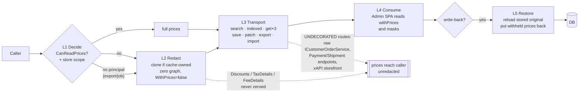
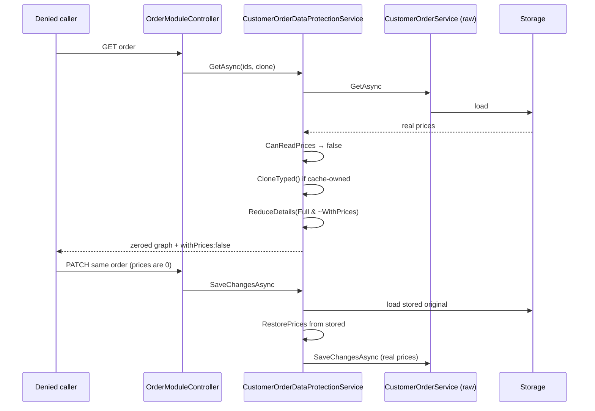
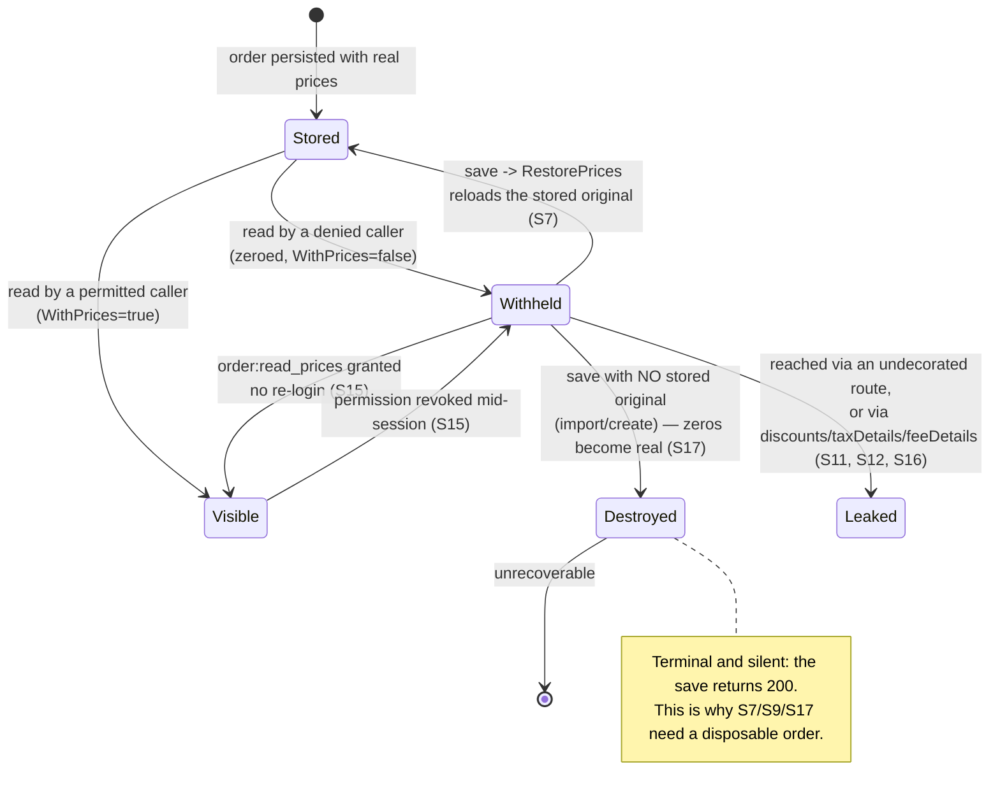

# TEST MODEL — VCST-3912

Ticket:      VCST-3912 | Type: Story | Status role: testable | Flow: feature-test | Priority: P1 (High) | Path: FULL | Changed: Backend (module + Admin SPA)
Context:     FULL — `ba-system-analyzer` (1c) + `ba-story-writer` Mode B (1d), 2026-09-10
Affected surface: `vc-module-order` @ PR #472 (`VCST-3912-hide-prices` @ `dfa3864`, **open, 12 ahead of `dev`**). Core model (`CustomerOrder`/`PaymentIn`/`Shipment`/`Capture`/`Refund`/`LineItem`/`OrderOperation`) · Data services (`CustomerOrderDataProtectionService`, 174 lines) · Data authorization (`OrderAuthorizationHandler`, moved Web→Data, unsealed) · `OrderExportImport` · `OrderModuleController` · `Module.cs` DI · **10 Admin-SPA AngularJS blade/widget files** · samples · 3 test files.
Ticket signals: **Origin requirement (comment 2026-02-24)** names FOUR data classes to restrict for OpCo admins — catalogs, **order details**, pricelists, customer data. **This PR covers the order leg only, and only the *price* aspect of an order.** Ticket summary and Modules field still name catalog + pricing. Sibling `VP-8998` (In Progress) is the plausible home for the rest — unconfirmed. Comment 2026-03-30: "Heineken approved the current approach". Attachment `data-protection-architecture.md` (dev-authored, `Status: Proposal`) **self-declares four defects the module shipped or still has open** — treated here as `{DOC}` oracles, not speculation. Attachment `Mask Order price information-Analysis document.docx` (customer, 2025-09-10) enumerates the Admin price surfaces: order list, line items, totals widget, invoices, shipment, operation-tree widget — and records that today masking renders `#`.
Epic context: none (no parent Epic).
Domains:     Orders & Fulfillment · Platform Administration (RBAC) · Import/Export · Pricing (read-only interaction)
Flows & boundaries: order ↔ export/import · order ↔ indexed search · order ↔ xAPI storefront (`vc-module-x-order`, **untouched**) · order ↔ independent Payment/Shipment resources · Admin SPA blade ↔ payload flag · order ↔ `VP-8998` sibling scope
Risk areas:  `SCOPE` leaks (VC-B2B-002) · Admin-SPA 4h bundle cache (VC-DEPLOY-003) · the sales-rep precedent `reports/bugs/open/QUESTION-salesrep-buyer-order-route-scope-design-intent.md` — a protected Admin surface beside an unprotected storefront sibling reading the same entity, resolved BY DESIGN 2026-09-04. Same shape recurs here.
AC traceability: 4 story ACs (**all four graded non-testable or partial by 1d** — two are structural, two are deliverable-presence) + 22 gap-ACs. The gap-ACs, not the story ACs, are the spine of this model.
DoD: none declared on the ticket.

> **RUN STATUS — BLOCKED-on-deploy.** Every environment pins `VirtoCommerce.Orders 3.1014.0`; a live probe of `POST /api/order/customerOrders/search` on vcptcore-qa returns orders with **no `withPrices` key**. The build artifact `VirtoCommerce.Orders_3.1015.0-pr-472-dfa3.zip` **does exist** in `vc3prerelease` (HTTP 200) and is deployable via an AzureBlob pin. No scenario below has been executed. Every `{OBSERVED}` marker refers to **pre-change** behaviour on Orders 3.1014.0.

---

## Part 0 — VALUE CHAIN (derived first)

**Value chain**, in the operator's words:

1. **Decide** — a caller is denied the *price aspect*: no `order:read_prices`, or a solution's own `CanReadPrices` override says no. Store/responsible scope narrows *which orders* they see at all.
2. **Redact** — every order-read path resolves `ICustomerOrderDataProtectionService`, clones the entity when it is cache-owned, zeroes the monetary fields across the graph (order → line items → shipments → payments → captures/refunds) and sets `WithPrices=false` on each node.
3. **Transport** — the zeroed graph plus the flag is what reaches the wire on *every* entry path: search, indexed search, get by id / number / outer id, save, patch, export, import.
4. **Consume** — the Admin SPA (and any other consumer) reads `withPrices` off the payload and masks, instead of re-deriving the permission client-side. This is what tells a *withheld* price from a genuinely zero one.
5. **Restore** — when the denied caller saves that order back, the service reloads the stored original and puts back every price it withheld, so a price-blind save destroys nothing.

**What it unlocks:** an OpCo admin can administer in-direct-distributor orders without seeing pricing that is commercially sensitive between distributors.

The price aspect is a **reversible** effect — withheld on read, put back on write, and restored wholesale when the permission is granted — so the lifecycle is drawn too:

**Variants** — partitioned by the layers that BRANCH on "may this caller see prices", taken as their union: the decision layer branches 3 ways on principal state, the DI/route layer 2 ways on whether the consumer resolved the decorated interface, and the authorization layer 4 ways on store scope.

| | Variant | Why it is a different code path |
|---|---|---|
| **V1** | Permitted caller (HTTP, holds `order:read_prices`) | `CanReadPrices` → true; redaction is a no-op, restore is skipped |
| **V2** | Denied caller (HTTP, real principal) | the intended case |
| **V3** | System context — no `HttpContext` (export, import, background job) | `GetCurrentUserName()` returns `"unknown"`/`"http:anonymous"`, `FindByNameAsync` → null, `CanReadPrices(null)` → **deny** |
| **V4** | Denied caller reaching orders by an **undecorated** route (raw `ICustomerOrderService`, independent Payment/Shipment endpoints, xAPI storefront) | the decorator never runs |
| **V5** | Denied by a **custom** rule (the sample's store-type override) | AC-3's extension point; `CanReadPrices` overridden |
| **V6** | Store-scoped caller (`OrderAuthorizationHandler` narrowing) | criteria rewritten before the search |

### Mechanism coverage matrix — variants × chain links

| | L1 Decide | L2 Redact | L3 Transport | L4 Consume | L5 Restore |
|---|---|---|---|---|---|
| **V1** permitted | S1, S15 | S1 (no-op asserted) | S8 | S10 | S7 (asserts no restore needed) |
| **V2** denied HTTP | S1, S15 | **S2, S6, S16** | S2, S3, S4 | S1, S10 | S7 |
| **V3** system context | S9 | S9 | S9 | S9 | **S17** |
| **V4** undecorated | S11, S12 | `WAIVED` — redaction never runs by construction; the defect *is* L1 | S11, S12 | S12 | `WAIVED` — an undecorated reader holds real prices, so its write destroys nothing |
| **V5** custom rule | S13, S10 | S10 | S10 | S10 | `WAIVED` — the sample overrides only `CanReadPrices`; the write path is V2's, covered by S7 |
| **V6** store-scoped | **S5** | `WAIVED` — scope narrows the RESULT SET, not the price aspect | S5 | S3 | `WAIVED` — scope does not participate in write-back |

**Reverse edges** — per forward effect that withholds or destroys value:

| Forward effect | What moves it back | Covered |
|---|---|---|
| Prices withheld from a caller | permission granted → next request shows them, no re-login | S15 `{BL-PLAT-001}` |
| Prices zeroed on the read path | restore-from-storage on every write path | S7 |
| Redaction applied to an entity | the cached/original instance is unaffected | S14 |
| Export writes a price-free file in system context | **nothing** — no `IsSystemContext` opt-in exists | **ABSENT IN PRODUCT** — a finding. The architecture doc §"The principal trap" specifies the third state and it was not implemented; S9 + S17 name the consequence |

**Fixture lifecycle:** nothing here is terminal, but **S7, S9 and S17 are destructive on failure** — if restore-on-write is broken, the stored prices are gone. They MUST run against a per-run disposable order (`AGENT-TEST-` prefixed), never a shared fixture, and never against an order another suite asserts on.

---

## Parts 1–5 — FAULT MODEL

**Condition space**

| Factor | Value classes | n |
|---|---|---|
| F1 principal state | permitted · denied · unresolvable | 3 |
| F2 entry path | search · indexed search · getById · getByNumber · getByOuterId · save · patch · export · import | 9 |
| F3 graph node | order · lineItem · shipment · payment · capture · refund | 6 |
| F4 route | decorated · undecorated | 2 |
| F5 clone | true · false | 2 |
| F6 store scope | none · requested-within · requested-outside (∅) · unrequested | 4 |
| F7 consumer | REST · Admin SPA · export file · xAPI | 4 |

Constraints (infeasible combinations): F6 applies only to the two search paths; F5 `false` has no REST entry point (internal callers only); F4 `undecorated` has no L2/L5 by construction. **Raw cells N = 3·9·6·2·2·4·4 = 10 368.**

**Reduction — 10 368 → 17**, and what was dropped:

- **F3 collapsed (÷6).** The traversal is one recursive mechanism, already unit-tested per node in `NestedOperationPricesTests.cs`; six per-node rows would exercise the same `foreach`. Subsumed by **S6** (maximal graph) plus **S16**, which attacks the collections the recursion does *not* reach — the actual residual risk.
- **F2 collapsed 9 → 5.** The five read paths share `ReduceDetailsForCurrentUser`, so `search` (S2) represents them; the three GET-by-* differ only in the new load-then-authorize behaviour and take one row (S3); indexed search stays separate (S4) — different code path, own leak; save/patch/create collapse into S7; export and import stay (S8/S9/S17) because they are precisely the paths the old design never covered.
- **F5 dropped.** `clone:false` has no REST entry point; covered by the PR's own `CloneTest` and end-to-end by S14.
- **F6 reduced 4 → 1.** Three of the four classes are already unit-tested; only the untested `outside (∅)` class becomes a scenario (S5).
- **F7 kept only where the consumer applies a *different rule*** — Admin SPA (S10) and xAPI (S12). The REST payload is asserted inside every backend row rather than as its own axis.

### Test scenarios (17)

| # | Cell (factor values) | Defect hypothesis — what breaks, and why it plausibly would | Archetype | Technique | Oracle | P |
|---|---|---|---|---|---|---|
| **S1** | **[JOURNEY]** V2 · whole chain · Admin SPA | The feature does not work end to end: a denied admin sees a price somewhere on the order-list → detail → items → shipment → payment → captures/refunds walk, or a non-price edit saved by that admin corrupts stored prices. This row answers "does this work at all"; every other row refines a link it crosses. | `SCOPE` | `FLOW` | `{SPEC}` PR body + `{BL-AUTH-005}` | Critical |
| **S2** | V2 · search · decorated · REST | Search returns a monetary field the zeroing list misses. The list grew from 18 to 30 fields in this PR — the pre-change list omitted `SubTotalDiscount`, `SubTotalTaxTotal`, `ShippingSubTotal`, `PaymentTaxTotal` and 8 more, so the enumeration has already been wrong once. | `SCOPE` | `EP` | `{SPEC}` diff `CustomerOrder.cs` L299-341 | Critical |
| **S3** | V2/V6 · getById/Number/OuterId | Load-then-authorize replaced authorize-then-load: non-existent now 404, out-of-scope now 403 (both were `200`+`null` — `{OBSERVED}` pre-change). The pair lets a scoped caller enumerate valid order ids/numbers/outerIds by status code alone. | `BOUNDARY` | `BVA` | `{SPEC}` PR §Breaking changes | High |
| **S4** | V2 · indexed search · sort/filter by price | Redaction runs *after* the index answers, so sorting or filtering by total still orders results by the hidden value — the caller infers prices from the ordering. The developer's own doc states this is not addressed. | `SCOPE` | `EG` | `{DOC}` arch doc §Open questions #2 | High |
| **S5** | V6 · store scope = requested-outside (∅) | `AllowedStoreIds.Intersect(requested)` yields `[]`, `HandleRequirement` returns `true` regardless, and search reads empty `StoreIds` as *no filter* → the scoped caller receives **every store's** orders. The three shipped tests cover no-request, within-scope and no-scope; **this class has no test.** | `SCOPE` | `BVA` | `{SPEC}` diff `OrderAuthorizationHandler.cs` L76-81 | Critical |
| **S6** | V2 · maximal graph (order + items + shipment + payment + capture + refund) | A nested node keeps its money. Captures and refunds under a payment had no redaction path at all before this PR. | `BOUNDARY` | `CT` | `{SPEC}` diff `PaymentIn.cs` L859-867 | High |
| **S7** | V2 · save/patch/create · L5 | A denied caller reads an order (prices zeroed), edits a non-price field, saves — and the zeros are persisted, permanently destroying prices they were never allowed to see. Restore previously ran only in `Update`, leaving create, patch and import to overwrite. Success-shaped: the save returns 200. | `SILENT` | `ST` | `{SPEC}` arch doc rule #2 | Critical |
| **S8** | V1 · export · permitted admin in an HTTP session | An export by a *permitted* admin comes back price-free — over-redaction of the legitimate case. | `PARITY` | `EP` | `{BL-IMPEX-002}` | High |
| **S9** | V3 · export · no HttpContext | An export run as a scheduled/background job produces a backup with **every price zeroed and no error reported**. `GetCurrentUserName()` never returns null, so the null-user check reads a system caller as anonymous and denies. Dev marked this "By design" in review; the arch doc's own rule #4 says the correct default is full access, opt-in. | `FALLBACK` | `EG` | `{DOC}` arch doc §The principal trap | Critical |
| **S10** | V1/V2/V5 · Admin SPA · L4 | The UI still re-derives the rule client-side, so a custom `CanReadPrices` that *grants* prices to a user without the global permission renders masked anyway — the exact drift the `withPrices` flag exists to end. Ten blade files changed; a missed one masks nothing or masks always. Includes deep-link, force-refresh and viewport probes. | `PARITY` | `DT` | `{SPEC}` PR body + `{BL-UI-004}` | Critical |
| **S11** | V4 · independent Payment/Shipment endpoints | Payment and Shipment have their own search/get endpoints that never pass through the decorator (it implements only the `CustomerOrder`-typed interfaces). A denied caller reads the same money one hop sideways. The arch doc states this plainly as the module's current state. | `SCOPE` | `EG` | `{DOC}` arch doc §Where does the boundary sit | Critical |
| **S12** | V4 · xAPI / storefront order surface | `Module.cs` still registers raw `ICustomerOrderService` / `ICustomerOrderSearchService` / `IIndexedCustomerOrderSearchService` alongside the protected one, so any consumer can resolve around the decorator. `CustomerOrderType` carries **no `withPrices` field** and exposes every total — so even where redaction *does* apply, the storefront cannot tell withheld from zero. | `PARITY` | `EG` | `{DOC}` `graphql-schema.md` @ 2026-09-10 (refreshed this run) | High |
| **S13** | V5 · custom rule · null principal | **CORRECTED 2026-09-10 — the specific 500 is NOT reachable in the shipped code.** The base `CanReadPrices` returns `false` for `user is null` before touching a claim, and the sample guards `if (!canReadPrices && user != null)` before reaching the unguarded `FindPermission`. The `cursor[bot]` finding was raised on commit `a2d4cfa` and fixed by `dfa3864`; it was carried into this model in error. The row **survives as a `BL-AUTH-017` guard on the extension point** — a future custom policy that dereferences the principal turns a redaction decision into an availability outage, and nothing in the code or the tests prevents it. Assertion is `{HYPOTHESIS}`; a non-reproduction is recorded as exactly that, never as a pass. | `FALLBACK` | `EG` | `{BL-AUTH-017}` (the `{DOC}` corollary no longer grounds it) | Medium |
| **S14** | V2 · `clone:false` then a permitted read | Redacting a cache-owned instance writes the redaction into the shared cache, and the next *entitled* caller gets it back stripped. `CustomerOrder.Clone()`'s `ChildrenOperations` aliased the source's shipments and payments, so even a clone reached back into the original. | `STALE` | `ST` | `{SPEC}` arch doc rule #1 | High |
| **S15** | V1↔V2 transition · L1 | Adding `order:read_prices` to the role does not take effect until the user signs out and back in — a stale security cache. | `STALE` | `ST` | `{BL-PLAT-001}` | Medium |
| **S16** | V2 · L2 · `Discounts` / `TaxDetails` / `FeeDetails` | **`ReduceDetails(Full & ~WithPrices)` clears only the `WithPrices` flag, so `WithDiscounts` stays set and `Discounts` is never nulled — and `TaxDetails`/`FeeDetails` are not touched by `ReduceDetails` at all.** A denied caller still receives `discounts[].discountAmount`, `taxDetails[].amount/rate` and `feeDetails[].amount`, from which the withheld total is reconstructible. Live on vcptcore-qa today: order `CO260909-00002` has `total=44.99` beside an untouched `discounts[0].discountAmount=44.995` ("50% off cart subtotal"). This is the concrete instance of the arch doc's own Open Question #1 — sharing one enum for "didn't ask for it" and "may not have it". | `SCOPE` | `EG` | `{SPEC}` diff `CustomerOrderDataProtectionService.cs` L145 + `{DOC}` arch doc §Open questions #1 | Critical |
| **S17** | V3 · export → import round trip | A system-context export (S9) writes zeros; importing that file creates orders with **no stored original to restore from**, so the zeros are written as real prices. Backup-and-restore silently destroys every price in the dataset. | `SILENT` | `EG` | `{DOC}` arch doc rule #2 (new entity has no stored counterpart) | Critical |

**Probes carried in:** `VC-B2B-002` (permissions live on Roles, not Users) → S1 setup + S15 · `VC-DEPLOY-003` (Admin SPA 4h `max-age`) → S10, force-refresh and confirm the asset hash changed or a stale bundle masquerades as a masking failure · `VC-DEPLOY-001` (PRs deploy to QA while open) → applied at `1b`; it is why the AzureBlob pin route exists at all · `VC-ORDERS-001`, `VC-CFG-004`, `VC-CART-001` → **N/A**, no status vocabulary, no field-name acceptance and no storefront Apollo path in scope (S14 covers the server-side cache analogue).

**Archetype sweep:** `SCOPE` → S1,S2,S3,S5,S11,S16 · `PARITY` → S8,S10,S12 · `STALE` → S14,S15 · `SILENT` → S7,S9,S17 · `BOUNDARY` → S3,S5,S6 · `FALLBACK` → S9,S13 · `CONFIG` → S10 (the custom-rule extension point) · `RENDER` → S10 · `MONEY` → S16 (`OrderTotals` is nulled wholesale; the residual leak carries a per-discount `currency`) · `RACE` → **WAIVED** — the one read-then-write the PR adds (restore reloads the stored original) sits inside `SaveChangesAsync`; concurrent order saves are pre-existing and unchanged. Re-open if restore ever moves outside the save. · `REPLAY` → **WAIVED** — no idempotency key or retry semantics introduced; import is the only repeatable path and S17 covers its destructive case head-on. · `LIFECYCLE` → **WAIVED** — no order state-machine change; `WithPrices` is a runtime flag, never persisted, so it has no lifecycle.

**UIP sweep (Admin SPA, `visual_surface: true`):** `UIP-DEEP` → S10 (deep-link straight to an order-detail blade as a denied user — it must mask with no list context loaded) · `UIP-REFRESH` → S10 · `UIP-EXPIRE` → S15 (permission changes mid-session) · `UIP-VIEW` → S10 (the price cell template in `customerOrder-list.tpl.html` was rewritten) · `UIP-NET` → S10 (payload fails to load — masking must fail **closed**, with no price flash) · `UIP-DATA` → S6 · `UIP-BACK`, `UIP-TABS`, `UIP-STORAGE`, `UIP-INPUT` → **WAIVED** — masking is payload-driven with no navigation, cross-tab or client-persistence state, and a denied user is given no price inputs.

**Business Rules:** `BL-AUTH-005` (RBAC 6-permission model — **explicitly names `order:read_prices` as the Orders extension**) · `BL-AUTH-006` (no role inheritance) · `BL-PLAT-001` (role/permission change is immediate) · `BL-GQL-004` (resolver auth gating → S12) · `BL-IMPEX-002` (export matches filters → S8) · `BL-AUTH-017` (400 never 500 → S13) · `BL-ORD-010` (order totals per currency → S16).

> **No `BL-*` invariant governs redaction itself** — nothing in the corpus states that a withheld value must be distinguishable from a real zero, or that a write by a caller who could not read an aspect must not destroy it. Two are proposed (`/qa-review-oracles` owns authoring them; this model only raises them):
> - **PROPOSED-BL-ORD-011** — *withheld ≠ zero.* A read that withholds a protected aspect zeroes **every** monetary field reachable from the entity graph, including collection members, and carries an explicit flag saying so on every affected node.
> - **PROPOSED-BL-ORD-012** — *restore-on-write.* A save by a caller who could not read an aspect never persists that aspect's absence; the stored value is restored from storage on **every** write path, and a path with no stored counterpart (import/create) must not write the withheld value at all.

**Edge cases:** `ECL-14.10` (Admin Order-Edit UI guards & status preservation → S7, S10) · `ECL-6.4` (import validation → S17) · `ECL-13.1` (order fulfilment → S6).

**Docs grounding:** VirtoOZ `PlatformUserGuide` → order-management/permissions (`order:read_prices` = "View order prices", unchanged in name and purpose). VirtoOZ `PlatformDeveloperGuide` → Fundamentals/Security/authorization/scope-based-permissions — **its worked example is `OrderAuthorizationHandler` mutating search criteria, the exact pattern this PR replaces**, so shipping VCST-3912 puts the platform's canonical authorization tutorial out of date. That is a documentation-drift finding distinct from AC-4, and it belongs to the platform docs, not this ticket. No VirtoOZ content covers permission-aware export/import, or `ICustomerOrderDataProtectionService`.

**Agents to dispatch:** `qa-backend-expert` (`playwright-edge` — REST, export/import, Admin SPA) · `ui-ux-expert` (Chrome DevTools MCP — the visual lane, S10) · `qa-testing-expert` (`playwright-firefox` — S12 storefront/xAPI parity). **None dispatched this run — BLOCKED-on-deploy.**
