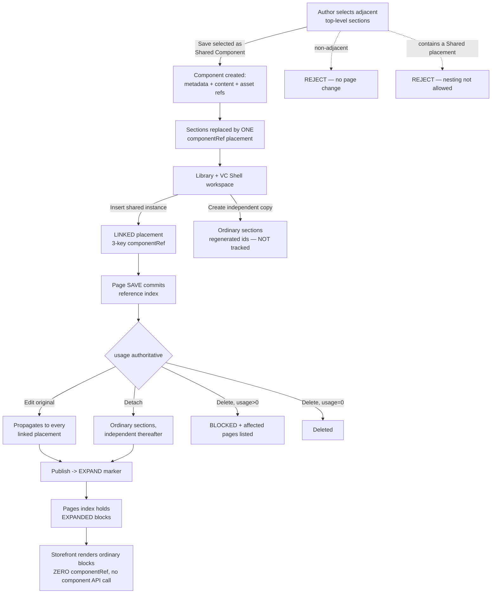
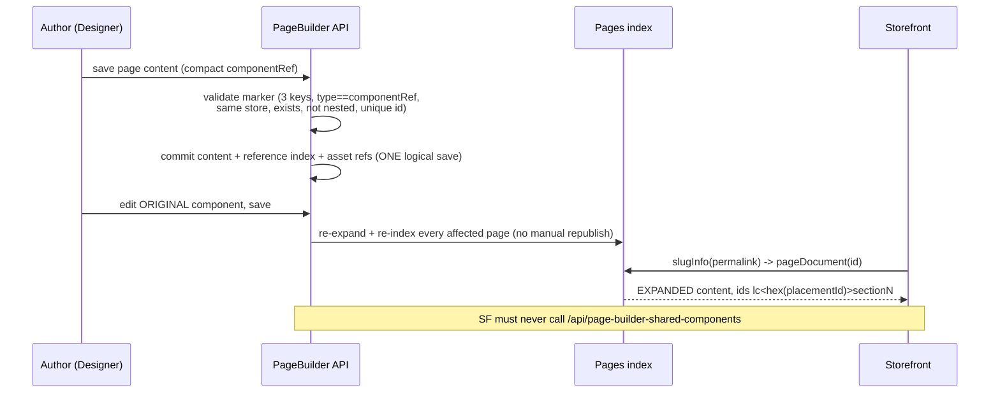
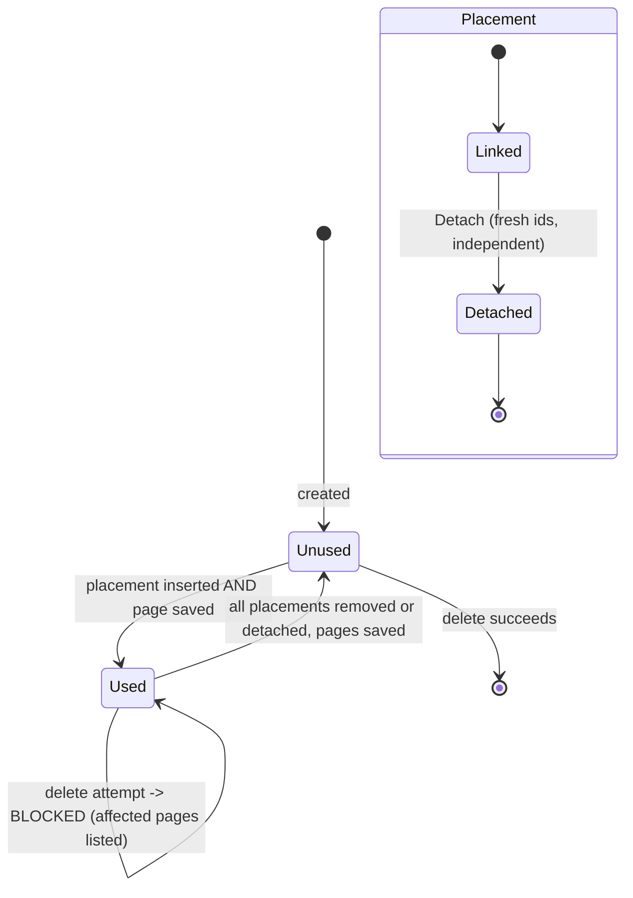

TEST MODEL — VCST-4933
Ticket:      VCST-4933 | Type: Story | Status role: testable | Flow: feature-test | Priority: P1 (High) | Path: FULL | Changed: Both
Context:     FULL: ba-system-analyzer (1c) + ba-story-writer (1d) + orchestrator control run
Prior model: none — first model for this surface
Domain map:  .claude/knowledge/domain/page-builder.md @ rev 1 (generated 2026-09-17, built by 1c-map this run)
             Registers, but fails `domain:check` DOMAIN-005: `page-builder` is not a `bl:extract` domain
             token — there is no BL-CMS-* invariant family. Recorded; blocks nothing.
Chain position: inserts a REUSE sub-chain (L1-L10 below) between the domain chain's "content authored"
             (L2) and "publish -> Pages index" (L6). TOUCHES domain L2, L6, L7 (delivery), L9
             (retirement, via the delete guard). DOES NOT touch L1 (page creation), L4 (scheduling /
             personalization), L5 (Draft->Published itself) or L8 (clone/save/load). Builder.io
             ingestion is out of scope entirely.
Affected surface: vc-module-pagebuilder PR #159 (.NET API + Angular Designer + VC Shell app
             `page-builder-shell`) + vc-frontend PR #2410 (storefront preview companion). Both live:
             PageBuilderModule 3.1025.0-pr-159-7361, storefront 2.58.0-pr-2410-3aa8. Every surface
             resolves to the domain map's inventory.
Ticket signals:
  - Dev delivery comment (2026-07-31): a full Chrome UI lifecycle plus .NET 175/175, Angular 755/755,
    VC Shell 39/39 green. A claim, not evidence. Its 13-section QA plan is the richest condition source.
  - OPEN QA findings 2026-08-19, none resolved: (3) paste not validated before "Paste section" is
    enabled; (4) false "Select only independent sections..." after removing blocks; (5) usage counter
    says "1 page", excluding the master; (6) empty panel after Detach. (1) and (7) are screenshot-only
    and UNRECOVERABLE — all 16 attachments unfetchable (expired Jira token). STATED GAP.
  - OPEN 2026-09-11: "not displayed in Preview" — re-observe on VALID fixtures.
  - Terminology contradicts across three artifacts; the LIVE ROUTE (`SharedComponent`) settles it.
Epic context: parent VCST-4931. Sub-tasks VCST-5183 MVP / 5184 Production ready / 5185 Tuning are ALL
             still `To do` while this Story is `Ready for test`. Operator ruling 2026-09-17: test all 8
             ACs; a failure plausibly owned by 5184/5185 is FILED but FLAGGED possibly-deferred, not
             auto-failing. Linked: causes VP-9060.
Domains:     CMS / Page Builder (primary); Assets; Pages indexing; Storefront delivery; Platform RBAC
Flows & boundaries: Designer <-> storefront preview iframe (postMessage); Page Builder <-> Pages index;
             authoring content (compact marker) <-> delivered content (expanded); Assets <-> component
             asset references; VC Shell workspace <-> backend API
Risk areas:  VC-CMS-001, VC-CMS-002 (never author content via REST — this run measured the cost);
             no BL-CMS-* family exists, so this domain has ZERO invariant oracles (finding, below)
AC traceability: 8 ACs -> 27 atomic conditions (1d). STATIC SUSPICIONS, to confirm live: AC1
             NOT-CONFIRMED (panel ordering never itemised), AC2/AC5/AC6/AC7 OK, AC3 **NOT-FOUND**
             (create-from-selection + both rejection paths absent from the delivery claim), AC4 OK for
             propagation / NOT-ASSESSABLE for UI affordances, AC8 **NOT-FOUND** (no concurrency or
             atomicity verification exists anywhere). AC4 and AC8 cannot be failed as written — itself
             a finding.

--- Part 0 — VALUE CHAIN ---

Value chain (in the content manager's words):
  L1  I pick several adjacent sections on a page that I want to reuse
  L2  I save them as a Shared Component -> the sections are replaced by ONE linked placement
  L3  the component appears in the Shared Blocks Library and in the Shared Components workspace
  L4  I insert it on another page — either LINKED to the original, or as an independent copy
  L5  I save the page -> the usage becomes authoritative (count + Where-used)
  L6  I edit the ORIGINAL once -> every linked placement reflects it
  L7  on publish, Page Builder expands the marker BEFORE Pages indexing
  L8  the shopper sees ordinary resolved blocks; the storefront never calls the component API
  L9  I detach one placement -> it becomes ordinary sections and stops tracking the original
  L10 I cannot delete a component that is still used; once usage reaches zero, deletion succeeds

Chain diagrams:

Variants (derived from the layers that BRANCH, union across API + Designer + VC Shell + storefront):
  VA arity:      single-section component | multi-section component (3 sections)
  VB placement:  linked instance | independent copy | detached-former-linked
  VC usage:      unused | used on ONE page | used on MANY including the ORIGINATING/master page
  VD scope:      same-store | cross-store
  VE actor:      Administrator | store-scoped user with all 4 perms | read-only | missing create |
                 missing update | missing delete | no read | non-admin WITHOUT matching user.StoreId
  VF page state: Draft | Published

Mechanism coverage matrix — columns = chain links L1..L10, rows = variants. Cells were filled AFTER
the axes existed; every cell holds a scenario # or GAP or WAIVED.

| Variant \ Link | L1 select | L2 create | L3 library | L4 insert | L5 save/usage | L6 edit orig | L7 expand | L8 deliver | L9 detach | L10 delete |
|---|---|---|---|---|---|---|---|---|---|---|
| VA single-section | 2 | 2 | 5 | 6 | 9 | 12 | 16 | 17 | 19 | 21 |
| VA multi-section | 1 | 1 | 5 | 7 | 9 | 12 | 16 | 17 | 19 | 21 |
| VB linked | – | – | 5 | 6 | 9 | 12 | 16 | 17 | 19 | 21 |
| VB independent copy | – | – | 5 | 8 | WAIVED: a copy holds no reference, so it never enters the usage index | 13 | 16 | 17 | N/A by construction | WAIVED: no reference to guard |
| VB detached | – | – | – | – | 20 | 14 | 16 | 17 | 19 | 22 |
| VC unused | – | 2 | 5 | – | – | 12 | GAP | GAP | – | 21 |
| VC used on ONE | – | – | 5 | 6 | 9 | 12 | 16 | 17 | 19 | 22 |
| VC used MANY + master | 3 | 3 | 5 | 7 | 10 | 11 | 16 | 18 | 20 | 22 |
| VD same-store | 1 | 1 | 5 | 6 | 9 | 12 | 16 | 17 | 19 | 21 |
| VD cross-store | 25 | 25 | 25 | 25 | 25 | – | – | – | – | 25 |
| VE Administrator | 1 | 1 | 5 | 6 | 9 | 12 | 16 | 17 | 19 | 21 |
| VE scoped full-perm | 23 | 23 | 23 | 23 | 23 | 23 | GAP | GAP | 23 | 23 |
| VE read-only | 24 | 24 | 24 | 24 | 24 | 24 | – | – | 24 | 24 |
| VE missing C/U/D | 24 | 24 | 24 | 24 | 24 | 24 | – | – | 24 | 24 |
| VE no StoreId match | 26 | 26 | 26 | 26 | 26 | 26 | – | – | 26 | 26 |
| VF Draft page | 1 | 1 | 5 | 6 | 9 | 12 | 15 | 15 | 19 | 22 |
| VF Published page | 1 | 1 | 5 | 6 | 9 | 12 | 16 | 17 | 19 | 22 |

Cell vocabulary: a scenario number, `GAP`, `WAIVED + reason`, or `-` = the variant STRUCTURALLY cannot
reach that link (each named in the Condition-space constraints, so it is a decision on record, not a
blank). #28 (concurrency) is CROSS-CUTTING — it stresses L5/L6/L10 at once — so it is in the scenario
table and Archetype sweep but deliberately not in the grid.

Two GAP cells are deliberate, argued, and routed to 3x: **VC unused x L7/L8** (an unused component is
never expanded, but "its content must NOT leak into a delivered page" is falsifiable and unchecked) and
**VE scoped-full x L7/L8** (delivery runs under the indexing identity; whether an author losing
permission after publish affects delivered content is undefined by every AC).

Reverse edges: insert (usage +1) -> remove + SAVE (-1) #20, or DETACH + SAVE (-1) #19/#20 · create ->
  delete at usage 0 #21 · asset ref added -> asset replaced/removed in original, refs update #27 ·
  **edit original -> NO un-propagate, no version history, no cross-page undo: ABSENT IN PRODUCT
  (finding #12a)** — editing an original mutates every page linking it with no rollback · **detach ->
  NO re-attach: ABSENT IN PRODUCT (finding #19a)**.

Fixture lifecycle: usage count is NOT terminal (reversible), so a component may be shared between
cases. **DELETION IS TERMINAL** — #21/#22 each need their OWN per-run component. Published is
effectively terminal here, so #15's Draft-vs-Published pair needs two distinct pages seeded up front.

--- Part 0r — ROLE SCENARIOS (the matrix carries 8 ROLE variants, so this part is REQUIRED) ---

Roles in scope: Administrator -> {{ADMIN}} / secret ADMIN_PASSWORD_VCPTCORE (working). The other six -
store-scoped all-4-perms * read-only * missing-create * missing-update * missing-delete * no-read *
and non-admin WITHOUT matching user.StoreId (the control role, must 403 everywhere) - were all
FIXTURE-GAP at model time, routed to 3a. [3a seeded all seven; every token confirmed.]

BSC-1 - "I can reuse my USP bar, but only where I am allowed to" * Role: store-scoped author with all
  four perms, manages B2B-store only while a second store exists. Opens the workspace -> sees own
  store's rows ONLY; inserts a linked instance -> linked, usage +1 on save; targets another store's
  component as LINKED -> not offered, and rejected server-side if forced.
  Outcome: isolation holds at BOTH the list layer and the save-validation layer.
  Not allowed: linking or reading another store's component - asserted at the SERVER with this role's
  own token, never as a missing button.

BSC-2 - "I can look but not touch" * Role: read-only, reviews content before a campaign. Workspace:
  grid + details readable, no Rename, no Delete. Opens the original: real section tree visible, form
  inert, no save affordance. "Save selected as Shared Component": not offered, create refused at the
  server.
  Outcome: read fully available, every mutation refused.
  Not allowed: create / update / rename / delete - all asserted server-side with this token.

BSC-3 - "I am not scoped to this store at all" * Role: non-admin whose user.StoreId does NOT match.
  The control that separates broken gating from correct gating: every store-scoped route 403s, AND
  the unrelated control route POST /api/page-builder-pages/search (which the token demonstrably holds
  builder:read for) ALSO 403s.
  Outcome: a uniform 403 here is CORRECT, not a defect. Step 2 is MANDATORY before any permission
  finding may be filed (contract fact 3).

--- Parts 1-5 — FAULT MODEL ---

Condition space:
  F1 component arity       : single-section | multi-section                        (2)
  F2 placement kind        : linked | independent copy | detached                  (3)
  F3 usage state           : 0 | 1 | many-including-master                         (3)
  F4 store scope           : same | cross                                          (2)
  F5 actor                 : admin | scoped-full | read-only | missing-C | missing-U | missing-D | no-read | no-StoreId (8)
  F6 page state            : Draft | Published                                     (2)
  F7 selection shape       : adjacent | non-adjacent | contains-nested-shared      (3)
  F8 marker well-formedness: valid 3-key | extra field | missing field | wrong type | dangling id | duplicate placement id (6)
  Constraints (infeasible): copy with usage>0 (a copy holds no reference); detached still counted on
    that page; cross-store+linked is a REJECT path not a state; non-adjacent reaches no post-create
    link; no-read reaches no link at all.   Raw cells N = 2*3*3*2*8*2*3*6 = 20,736

Reduction: base-choice + EP on F5/F8 + pairwise across F1xF2xF3xF6; F7/F8 lifted out as dedicated
  negative partitions (they terminate the chain, so never combine downstream). Dropped: full F5 x
  every-link (subsumed by BSC-1..3, asserted at the server per role); F1 x F8 (marker validity is
  arity-independent); F6 x F4 (store scope decided before publish). N 20,736 -> M 30.

Test scenarios (30 rows — 28 numbered plus the two ABSENT-reverse-edge rows 12a and 19a):
  | # | Cell | Defect hypothesis | Archetype | Technique | Oracle | P |
  |1|multi-section, adjacent, admin, Draft|selection->create silently reorders or drops the unselected sections|state-corruption|FLOW|{SPEC} AC3|Critical|
  |2|single-section, adjacent|the single-section path is an unhandled special case of the multi-section code|boundary|BVA|{SPEC} AC3|High|
  |3|selection spans the ORIGINATING page, used-many|the master page is not counted as a usage|off-by-one|FLOW|{HYPOTHESIS} needs a product ruling|Critical|
  |4|selection AFTER removing some blocks|stale selection state yields a FALSE "Select only independent sections"|state-corruption|ST|{OBSERVED 2026-08-19 #4}|High|
  |5|library panel|Shared Blocks Library is not FIRST, or ordinary groups are lost|ordering|FLOW|{SPEC} AC1|High|
  |6|insert linked, same store|the placement is not actually linked (a copy in disguise)|wrong-binding|DT|{SPEC} AC2|Critical|
  |7|insert linked, multi-section|a multi-section component renders as N items instead of ONE boundary|rendering|FLOW|{SPEC} AC2 + architecture comment|High|
  |8|insert independent copy|ids are NOT regenerated, so the copy collides with the original|id-collision|EG|{SPEC} AC2|Critical|
  |9|insert then SAVE|usage does not become authoritative on save|persistence|ST|{SPEC} AC6|Critical|
  |10|insert but DO NOT save|usage moves before save (premature)|persistence|ST|{SPEC} AC6, 1c D2|High|
  |11|edit original used on master + 1 other|the counter reports 1 and excludes the master|off-by-one|FLOW|{OBSERVED 2026-08-19 #5}|Critical|
  |12|edit original, save|does not propagate to every linked placement|propagation|FLOW|{SPEC} AC4|Critical|
  |12a|edit original|NO un-propagate and no version history exists (reverse edge ABSENT)|missing-reverse|EG|{SPEC gap}|Medium|
  |13|edit original while an independent copy exists|the copy changes too, and it must not|wrong-binding|DT|{SPEC} AC2|Critical|
  |14|edit original after a detach|the detached copy changes too, and it must not|wrong-binding|DT|{SPEC} AC5|Critical|
  |15|Draft page holding a placement|draft-only edits leak to the PUBLISHED route, or publish fails to expand|visibility|ST|{SPEC} AC7, 1c D3|Critical|
  |16|publish|componentRef survives into the Pages index|expansion|FLOW|{OBSERVED — HOLDS, see Probes}|Critical|
  |17|storefront GET|the delivered document contains componentRef, or the storefront calls the component API|contract|FLOW|{OBSERVED — HOLDS}|Critical|
  |18|two placements of ONE component on one page|the expanded ids collide between the two placements|id-collision|EG|{SPEC} dev plan section 6|High|
  |19|detach one placement|detach leaves the panel EMPTY and not immediately editable|ux-dead-end|FLOW|{OBSERVED 2026-08-19 #6}|High|
  |19a|detach|NO re-attach path exists (reverse edge ABSENT)|missing-reverse|EG|{SPEC gap}|Medium|
  |20|detach or remove, then SAVE|usage does not decrement|persistence|ST|{SPEC} AC5/AC6|High|
  |21|delete an UNUSED component|deletion is refused even though usage is 0|guard-inverted|BVA|{SPEC} AC6|High|
  |22|delete a USED component|deletion succeeds, leaving dangling references on live pages|guard-missing|BVA|{SPEC} AC6|Critical|
  |23|scoped author holding all 4 perms|a correctly-scoped author is still refused|gating-false-positive|DT|{SPEC} AC8 / BSC-1|High|
  |24|read-only, or missing exactly one perm|a mutation the role lacks still succeeds at the SERVER|gating-missing|DT|{SPEC} AC8 / BSC-2|Critical|
  |25|cross-store linked reference|accepted, so a component leaks across stores|isolation|EG|{SPEC} AC8|Critical|
  |26|no matching user.StoreId + the CONTROL probe|a uniform 403 is misread as a gating defect|false-positive-guard|DT|{contract fact 3}|High|
  |27|malformed markers (the 6 partitions of F8)|a malformed marker is accepted or partially persisted|input-validation|EP+EG|{SPEC} dev plan section 11|High|
  |28|CONCURRENCY: save one page from 2 sessions; delete while another session inserts; save a stale original|a mixed version is committed — content, references and asset references diverge|atomicity|EG|{SPEC} AC8 — NO oracle is stated by the story; AC8 is unfalsifiable as written|Critical|

Probes carried in:
  VC-CMS-002 (never author content via REST) -> hit HARD. The prior session's REST-authored fixtures
    used block type `Text` (capitalised, no renderer) and rendered blank; an A/B control proved that is
    a FIXTURE defect, not a Shared-Components one. So #16/#17 and the 2026-09-11 "not displayed in
    Preview" finding must be re-observed on valid lowercase-block fixtures.
  VC-CMS-001 (CMS pages in search suggestions only) -> N/A, no search surface in scope.

Archetype sweep: state-corruption #1,#4 · boundary #2,#21,#22 · off-by-one #3,#11 · ordering #5 ·
  wrong-binding #6,#13,#14 · rendering #7 · id-collision #8,#18 · persistence #9,#10,#20 · propagation
  #12 · missing-reverse #12a,#19a · visibility #15 · expansion #16 · contract #17 · ux-dead-end #19 ·
  gating #23,#24,#26 · isolation #25 · input-validation #27 · atomicity #28. WAIVED: perf/load — no
  perf AC, no stated budget.

UIP sweep (Designer + VC Shell are UI): BACK WAIVED (single-route SPA canvas) · DEEP -> #5 · REFRESH
  -> #9/#10 · TABS -> #28 · EXPIRE -> GAP (token expiry mid-edit, routed to 3x) · STORAGE WAIVED (no
  client persistence claimed) · NET -> #28 · INPUT -> #27 · VIEW -> visual lane 4v · DATA -> #18.

Business Rules: **NONE EXIST.** `bl:extract:list` = 16 BL domains, none CMS; `domain:check` DOMAIN-005
  fails for that reason. ZERO invariant oracles — every scenario is {SPEC}/{OBSERVED}/{HYPOTHESIS}
  only. The run's FIRST FINDING, and the Loyalty-Missions shape: a corpus that records behaviour
  instead of judging it. Adjacent: BL-UI-001..007, BL-A11Y-001..004. Proposed family, routed to Oracle
  Feedback, not authored here:
    BL-CMS-001 a delivered page document contains ZERO componentRef markers
    BL-CMS-002 a component's usage count equals the number of SAVED pages holding a reference,
               INCLUDING the originating page — blocked on the #3/#11 product ruling
    BL-CMS-003 deleting a component whose usage is greater than 0 is refused and names the affected pages
    BL-CMS-004 an independent copy and a detached placement never track the original again
Edge cases: ECL chapters 6 (data & integration), 7 (frontend/UI), 8 (content data), 13 (workflow),
  14 (VC platform-specific), 15 (accessibility) — loaded at 2-load.
Docs grounding: VirtoOZ and Context7 both unavailable (OAuth, non-interactive) — STATED GAP. Public
  docs are unlikely for an unmerged PR; the PR #159/#2410 bodies are the closest source of truth.
Agents to dispatch: qa-backend-expert (API + workspace) · qa-frontend-expert (Designer + delivery) ·
  ui-ux-expert (visual 4v) · test-data-engineer (3a) · /qa-exploratory (3x)
