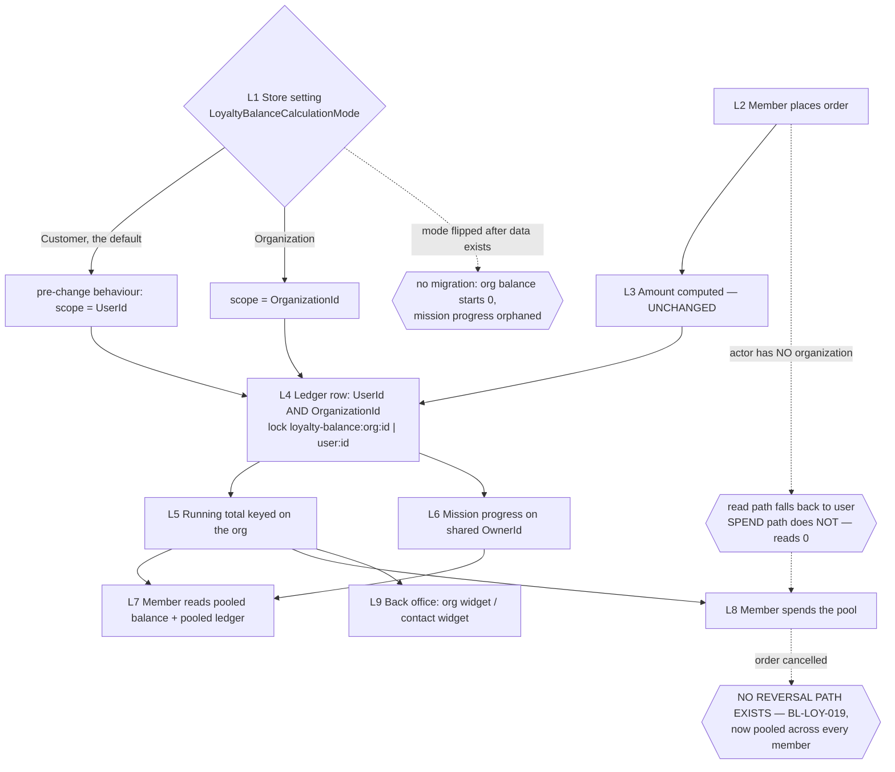

TEST MODEL — VCST-5024

Ticket:      VCST-5024 | Type: Story | Status role: testable | Flow: feature-test | Priority: P2 (Medium) | Path: FULL | Changed: Both (module + xAPI + Admin SPA + storefront)
Context:     ba-system-analyzer (1c) + ba-story-writer Mode B (1d) + live REST/GraphQL probes by the orchestrator
Prior model: none for THIS surface slice. The nearest neighbours are reports/ba/test-models/VCST-5319-2026-08-28.md and
             VCST-5346-2026-09-02.md (loyalty MISSIONS, user scope). Neither declares a Part 0 for the BALANCE-SCOPE
             mechanism, so Part 0 below is derived here for the first time and is the declaration for this surface.
Domain map:  .claude/knowledge/domain/loyalty-missions.md @ rev 2 (generated 2026-09-11).
             STALE ROWS this deploy invalidates — carried as drift, to be written back at 5h-map, not edited now:
             D11 (says org-level loyalty is not deployed — it is, since ~12:19 UTC 2026-09-11), D10 (version + its
             "deployed == source anchor" argument), §2a (a 5th Admin widget now registers; balance/{userId} moved to
             balance/user/{userId}), §1 link 1b (six loyalty settings, not five), §2c (the no-organizationId fact
             survives, its stated reason does not), D1 (docs now also omit a REQUIRED argument), D2 (1c found the two
             guide pages describe two DIFFERENT widgets, not one at two levels of detail — rev 2's resolution is wrong).
Chain position: L1–L9 of the domain chain's L1–L10. This ticket re-keys the SCOPE of L4–L8 and adds L1's mode switch.
             It does NOT touch: how many points an order is worth (L3 arithmetic), loyalty-catalog browsing, product
             point factors, mission AUTHORING, the daily Loyalty.ExpireMissions sweep (L10), or reversal — which
             remains ABSENT IN PRODUCT.
Affected surface: vc-module-loyalty PR #17 @116e902c (63 files) — Core/ModuleConstants.cs, Core/Extensions/StoreExtensions.cs,
             Data/Services/LoyaltyLogicService.cs, Data/Services/LoyaltyMissionLogicService.cs,
             Data/Services/LoyaltyBalanceOperationLogSearchService.cs, Data/Handlers/LoyaltyProgramHandler.cs,
             Data/Provider/LoyaltyPaymentMethod.cs, ExperienceApi/Authorization/CanAccessLoyaltyAuthorizationHandler.cs,
             ExperienceApi/Queries/GetLoyalty{Balance,History}Query*.cs, ExperienceApi/Validators/LoyaltyCartValidator.cs,
             Web/Controllers/Api/LoyaltyBalanceOperationLogController.cs, Web/Scripts/widgets/organization-loyalty-widget.*,
             3 × AddOrganizationId migrations · vc-frontend PR #2475 @d710e94f (6 files, storeId only).
             Every surface resolves to the domain map's §2a/§2b/§2c inventory except two it does NOT enumerate, which is
             a MISSING-surface finding against the map (clause 11b): the organizationDetail2 loyalty widget, and the
             split balance/user + balance/organization REST routes.
Ticket signals: (comments) The implementer's 2026-09-02 comment — "the distributed lock is still keyed by UserId, not
             OrganizationId … lost-update" — is STALE at the tested head: both locks are owner-keyed at 116e902c
             (loyalty-balance:org:{id} / loyalty-mission:{missionId}:{ownerId}), with explanatory comments. Fixed in
             CODE, unverified in BEHAVIOUR. The same comment's second half — "Need to figure out missions progress
             behavior when working at Organization mode" — was never answered in the ticket; the PR decided it
             unilaterally (shared OwnerId). (attachments) none — no gap, none exist.
Epic context: Parent VCST-5099 "Loyalty - Mixed Cart", still Draft, no Epic-level ACs, no sibling stories listed.
             So there is no integration surface from Done siblings and no dependency from in-progress ones. This story
             is a standalone slice; the Epic supplies no oracle. Stated rather than skipped.
Domains:     loyalty (primary) · b2b-organizations (the scope key) · cart/checkout (the spend path) · auth (the claim)
Flows & boundaries: order → ledger write → balance read → cart validation → checkout payment · org membership → JWT
             organization_id claim → ambient scope · store setting → six read sites · Admin contact widget ↔ Admin org widget
Risk areas:  ECL-14.3 token staleness on a MONEY surface · ECL-14.3 multi-org cross-contamination · BL-LOY-015
             attribution (already VIOLATED, escalates here) · BL-LOY-019 no reversal, now pooled · scope split between
             read path and spend path · a mode flip with no migration
AC traceability: 0 declared ACs. 3 description sentences → 21 atomic conditions (1d). Impl verdicts: S1 COVERED ·
             S2 DRIFT (redemption authorization not visibly implemented) · S3 DRIFT (written, then unreachable).
             13 of the 21 conditions have NO governing sentence — designed from the mechanism, per clause 4.
DoD:         No DoD declared on the ticket. 1d assembled one; its two hard misses — 1 test file touched across 63
             (+2 lines, cart validator only), and a BREAKING contract change (storeId now required) — are carried to 5b.

--- Part 0 — VALUE CHAIN ---

Value chain:
  L1  A store declares WHOSE points these are — Loyalty.LoyaltyBalanceCalculationMode ∈ {Customer, Organization},
      default Customer, IsPublic=false, read at exactly one place (StoreExtensions.IsOrganizationBalanceCalculationMode).
  L2  A member of an organization places an order → OrderChangedEvent, EntryState.Added → Hangfire.
  L3  The earn/redeem amount is computed — UNCHANGED by this ticket.
  L4  The ledger row is written carrying BOTH UserId and OrganizationId, under a scope-keyed distributed lock.
  L5  The running-total balance is keyed on the organization, so every member reads and moves ONE number.
  L6  Mission progress accrues against a shared OwnerId → one progress row, one completion, one reward per org.
  L7  Any member SEES the pooled balance and the pooled ledger (xAPI loyaltyBalance / loyaltyPointsHistory, storefront
      /account/points-history, /account/missions).
  L8  Any member SPENDS the pool (LoyaltyCartValidator, LoyaltyPaymentMethod).
  L9  The back office reads the pool (new organizationDetail2 widget, balance/organization/{id}) and the contact
      (existing customerDetail1 widget, balance/user/{id}).



```mermaid
sequenceDiagram
  participant M1 as Member A
  participant M2 as Member B
  participant API as xAPI
  participant HJ as Hangfire
  participant DB as Ledger
  M1->>API: place order (JWT carries organization_id)
  API->>HJ: OrderChangedEvent Added
  HJ->>DB: lock loyalty-balance:org:{orgId}; read total; insert row {UserId:A, OrganizationId:org}
  M2->>API: place order (same org)
  API->>HJ: OrderChangedEvent Added
  HJ->>DB: lock loyalty-balance:org:{orgId}; read total; insert row {UserId:B, OrganizationId:org}
  M2->>API: loyaltyBalance(storeId) — scope is AMBIENT, from the token claim, never an argument
  API-->>M2: pooled total = A + B
  Note over M2,DB: B's storefront ledger now contains A's rows, with no field naming A
```

```mermaid
stateDiagram-v2
  [*] --> CustomerMode: store created (default)
  CustomerMode --> OrganizationMode: admin edits the setting
  OrganizationMode --> CustomerMode: admin edits it back
  note right of OrganizationMode
    No migration either way.
    Balance rows and mission
    progress under the OTHER
    scope become unreachable,
    not merged.
  end note
  state MissionProgress {
    [*] --> InProgress
    InProgress --> Completed: target reached, reward granted ONCE per OwnerId
    Completed --> [*]: terminal; no reverse edge
  }
```



Variants (union across the layers that branch — store setting, scope resolver, auth handler, accrual source):
  V1 Actor org shape:      no-org (personal) · single-org member · multi-org member
  V2 Scope mode:           Customer · Organization
  V3 Accrual source:       order earn-program · mixed-cart redeem · points-as-payment gateway · mission reward · registration bonus
  V4 Membership state:     Approved · Locked · removed
  V5 Pre-existing data:    none (fresh) · rows written under the OTHER scope (the flip case)

Mechanism coverage matrix — rows = variants, columns = chain links. Derived from Part 0, then scenarios mapped in.

| Variant \ Link | L1 mode | L2 order | L3 amount | L4 write+lock | L5 balance | L6 mission | L7 read | L8 spend | L9 back office |
|---|---|---|---|---|---|---|---|---|---|
| R1 single-org member, Organization | 1 | 1 | WAIVED — L3 untouched by the diff | 1 | 1 | 7 | 1,5 | 1 | 6,20 |
| R2 second member, same org, Organization | 1 | 1 | WAIVED — as above | 10 | 1 | 7 | 5 | 11 | 4 |
| R3 no-org actor, Organization | 3 | 2 | WAIVED — as above | 3 | 3 | GAP — no mission case for a no-org actor | 3 | **2** | GAP — contact widget for a no-org actor unmeasured |
| R4 multi-org member, Organization | 17 | 18 | WAIVED — as above | 18 | 17 | GAP — per-org mission progress for a multi-org actor | 17 | GAP — spend after an org switch unmeasured | GAP |
| R5 Locked / removed member, Organization | 12 | WAIVED — placing an order while locked is BL-B2B, not this ticket | WAIVED | WAIVED | 12 | GAP | 12,14 | GAP — whether a locked member can SPEND the pool | GAP |
| R6 any actor, Customer mode | 16 | 16 | WAIVED — as above | 16 | 16 | 16 | 16,15 | 16 | 16 |
| R7 pre-existing rows, mode flipped | 8 | WAIVED — no new order needed to observe the strand | WAIVED | WAIVED | 8 | 8 | 8 | GAP — spending after a flip unmeasured | 9 |

Reverse edges:
  - balance accrual → **ABSENT IN PRODUCT** (BL-LOY-019, pre-existing). This ticket adds none and widens the blast
    radius from one person's balance to a pool any member can spend. Reported as a finding, not covered by a case.
  - mission completion → **ABSENT IN PRODUCT** (Completed is terminal; the daily sweep expires InProgress only).
  - the mode switch itself → reversible as a SETTING (scenario 9) but **NOT as data**: flipping back does not
    re-home rows written under the other scope. That asymmetry is scenario 8/9's whole point.
Fixture lifecycle: a mission's Completed state is TERMINAL per OwnerId, so scenario 7 needs a per-run mission, not a
  shared one. A loyalty balance CANNOT be reset on this platform (no write API — project_loyalty_balance_cannot_be_reset),
  so every balance assertion must be RELATIVE (delta against a value read immediately before), never absolute.

--- Part 0r — ROLE SCENARIOS (required: the matrix carries 4 role variants) ---

Roles in scope:
  org member A            → FIXTURE-GAP: two members of ONE org who can both order. Routed to 3a.
  org member B            → FIXTURE-GAP: as above. MULTI_ORG_TF_BR* is ONE account in TWO orgs — the inverse shape.
  no-org personal account → @td(LOYALTY_ZERO_USER.email) is ephemeral and per-run but is seeded WITH an org; a
                            genuinely org-less loyalty account is a FIXTURE-GAP. Routed to 3a.
  locked member           → FIXTURE-GAP (a member locked in the org under test). Routed to 3a.
  platform admin          → @td(ADMIN_DEFAULT) — available.

BSC-1 — "My colleague and I both buy for the company, and the points land in one company pot"
  Role: org member B · Situation: member A has already earned; B checks and then spends.
  | # | Action | Sees | Can do | Expected |
  | 1 | open /account/points-history | the pooled balance and a ledger containing A's rows | read | balance = A + B {SPEC} |
  | 2 | add a PTS line and check out | the pool as available funds | redeem | order places; pool decrements {SPEC} |
  Outcome: one shared wallet, spendable by either member.
  Not allowed: reading a NAMED other member's personal balance — loyaltyBalance(userId:<A>) must be refused at the
    SERVER with B's own token, not merely absent from the UI (scenario 14).

BSC-2 — "I shop for myself on a store that has been switched to company points"
  Role: no-org personal account · Situation: same store, no organization.
  | # | Action | Sees | Can do | Expected |
  | 1 | open /account/points-history | their OWN personal balance (read path falls back) | read | personal total {SPEC} |
  | 2 | add a PTS line and check out | — | redeem | the order SHOULD place — they have the points {SPEC} |
  Outcome: a personal shopper is unaffected by a setting about organizations.
  Not allowed: being blocked from spending points they demonstrably hold (scenario 2 — the P0 hypothesis).

BSC-3 — "I was locked out of the company but my session is still open"
  Role: locked member · Situation: membership locked; token minted before the lock, not yet expired.
  | # | Action | Sees | Can do | Expected |
  | 1 | call loyaltyBalance with the pre-lock token | — | — | refused, or the pooled figure withheld {HYPOTHESIS} |
  Outcome: losing org membership loses access to org money.
  Not allowed: reading the org's pooled balance and full ledger after the lock (scenario 12).
  NOTE: expectation is {HYPOTHESIS}, inherited — the domain map's verdict on lock-vs-live-session is UNVERIFIED and
  ECL-14.3 records claims are never live-pushed. It is NOT laundered into {SPEC}.

--- Parts 1–5 — FAULT MODEL ---

Condition space:
  mode {Customer, Organization} × actor org shape {none, one, many} × membership state {approved, locked}
  × accrual source {earn, mixed-redeem, payment-gateway, mission reward, registration} × pre-existing data {fresh, flipped}
  × surface {xAPI, storefront, Admin contact, Admin org}
  Constraints: locked ⇒ no new order (BL-B2B territory, excluded); Customer mode collapses org shape to irrelevant;
  registration bonus is order-independent. Raw cells = 2×3×2×5×2×4 = 480.
Reduction: 480 → 22. Collapsed (a) accrual SOURCE to {earn, mixed-redeem, mission reward, registration} and asserted
  the source-independent scope key once at L4 — justified because all five sources funnel into the single method
  LogLoyaltyProgramOperationAsync, so the scope key cannot differ between them; the payment-gateway path is kept
  separately ONLY because it resolves the store differently (scenario 2's second citation). (b) Dropped surface as a
  factor where the domain map shows one renderer; kept it where the layers DISAGREE (scenarios 4 vs 6 — the whole
  point). (c) Dropped Customer mode × every org shape to ONE backward-compat baseline (16), because
  IsOrganizationBalanceCalculationMode is an exact-match on one string and cannot branch per actor.
  The reduction is attackable here: if accrual source and scope key DO interact, scenarios 1/10/22 will not see it.

Test scenarios (22 rows — one per surviving cell)

| # | Cell (factor values) | Defect hypothesis — what breaks here, and why it plausibly would | Archetype | Technique | Oracle | P |
|---|---|---|---|---|---|---|
| 1 | Org mode · 2 members · earn ×2 then redeem | [JOURNEY] The whole mechanism does not deliver: two members' earns do not sum into one pool, or the pool is not spendable by the second member | CONFIG | FLOW | {SPEC} 3 sentences | Critical |
| 2 | Org mode · no-org actor · spend | Cart validator and payment gateway branch on the STORE setting with no null-check on cart.OrganizationId; GetOrganizationBalanceAsync(null) returns 0, so a personal shopper with points is blocked from checkout | FALLBACK | EP | {BL-LOY-008} | Critical |
| 3 | Org mode · no-org actor · read | Read path DOES fall back to user, so the read and the spend disagree for one actor — the pair with 2 is what makes the asymmetry decidable rather than a guess | PARITY | EP | {SPEC} | Critical |
| 4 | Org mode · member · Admin balance/user/{id} | BuildOwnerQuery ANDs `OrganizationId == null` onto the user predicate, so every org-scoped row is excluded from every user-scoped read — sentence 3's "stats" half returns 0 for a member who earned thousands | SILENT | EG | {SPEC} sentence 3 | High |
| 5 | Org mode · member · storefront ledger | loyaltyPointsHistory returns colleagues' rows and LoyaltyOperationLogType exposes no member field, so a buyer cannot tell which rows are theirs | SCOPE | EG | {BL-LOY-015} | High |
| 6 | Org mode · Admin balance/organization/{id} | The pooled figure disagrees with the sum of member amounts, or with what the storefront shows the members | PARITY | CT | {SPEC} | High |
| 7 | Org mode · mission · 2 members | Shared OwnerId makes a mission complete once per ORG: the first member to finish consumes it and colleagues can never earn it — BL-LOY-018 silently becomes mode-conditional | LIFECYCLE | ST | {BL-LOY-018} | Critical |
| 8 | Flip Customer→Organization with existing rows | No migration: org balance reads 0 and mission progress restarts at 0, stranding real balances and permitting a second reward for an already-completed mission | CONFIG | ST | {SPEC} | Critical |
| 9 | Flip Organization→Customer | The restore is symmetric for the SETTING but not for DATA; also the run's own restore-verification step | CONFIG | ST | {SPEC} | High |
| 10 | Org mode · 2 concurrent earns | The lock is now org-keyed, but concurrency is unverified in behaviour: a lost update would silently drop one member's points | RACE | ST | {SPEC} ticket comment | Critical |
| 11 | Org mode · 2 concurrent redeems | Two members spending the same pool at once overdraw it below zero | RACE | BVA | {BL-LOY-008} | Critical |
| 12 | Org mode · locked member · pre-lock token | Membership is checked by Contains() over the org list with NO status check, so Locked/Invited pass — a locked member keeps reading the org's money for the life of the token | SCOPE | ST | {HYPOTHESIS} — ECL-14.3 | High |
| 13 | Org mode · caller supplies organizationId | Scope is ambient; confirm the schema itself refuses a caller-chosen org rather than trusting the handler | SCOPE | EG | {SPEC} schema | Medium |
| 14 | Org mode · member reads another member's userId | The first auth guard (query.UserId != userId) must refuse, not return empty data — empty reads as clean | SCOPE | EG | {SPEC} | High |
| 15 | Either mode · storeId omitted | storeId became REQUIRED on two queries — a breaking change for every non-first-party consumer | PARITY | EG | {SPEC} schema | High |
| 16 | Customer mode · every actor shape | Upgrade safety: an untouched store must behave exactly as before. The baseline captured BEFORE the flip | CONFIG | FLOW | {SPEC} default | Critical |
| 17 | Org mode · multi-org member · switch org | Scope comes from the token claim; switching active org must change which pool is read, with no bleed | SCOPE | ST | {HYPOTHESIS} — ECL-14.3 | High |
| 18 | Org mode · multi-org contact · registration | CreateLoyaltyContextByUser uses Organizations.FirstOrDefault() over an unordered collection, ignoring DefaultOrganizationId — the bonus lands in an arbitrary org | FALLBACK | EG | {SPEC} | Medium |
| 19 | Org mode · Nth member's first order | EvaluateIsFirstOrder still scopes to CustomerId, so every new member triggers a first-order award into one shared pool | PARITY | EP | {SPEC} | High |
| 20 | Org mode · Admin org widget | The widget pre-sets balance=0 and early-returns without an entity id, so a failed request renders a literal 0 indistinguishable from a real zero | SILENT | EG | {SPEC} | Medium |
| 21 | Org mode · storefront copy | IsPublic=false means the storefront cannot know the mode, so a shared company pool renders under personal-possessive wording the published guide explicitly endorses | RENDER | EG | {DOC} StorefrontUserGuide | Medium |
| 22 | Org mode · one order | Regression guard: the (ObjectId, ObjectType, OperationType) dedup is NOT org-scoped and was not changed — assert BL-LOY-007 still holds. A PASS is the informative result | REPLAY | CT | {BL-LOY-007} | High |

Probes carried in: no in-domain defect-shaped VC-* entry targets balance scoping (the catalog's loyalty entries are
  mixed-cart pricing and mission accrual). N/A, stated rather than left blank.
Archetype sweep (closed vocabulary, vc-bug-catalog §Defect archetypes — all 12 resolved):
  SCOPE → 5,12,13,14,17 · PARITY → 3,6,15,19 · RACE → 10,11 · REPLAY → 22 · SILENT → 4,20 ·
  CONFIG → 1,8,9,16 · FALLBACK → 2,18 · LIFECYCLE → 7 · RENDER → 21 ·
  STALE → WAIVED: no cache, index or projection is added or re-keyed; the one staleness vector (the JWT
  organization_id claim) is a permission-scope leak, covered as SCOPE at 12/17, not as a stale read.
  MONEY → WAIVED: currency, rounding and culture are untouched — L3 amount computation is byte-identical in the
  diff, and BL-LOY-002/003/013 already own that surface; none of them changes scope.
  BOUNDARY → WAIVED as a row of its own: the one boundary that matters (spending exactly the pooled balance, and
  one point past it) is asserted inside 11 rather than duplicated, per the §6 cull rule.
UIP sweep: BACK/DEEP/REFRESH/TABS → WAIVED, no new storefront route or view · EXPIRE → 12 (token staleness is the
  ticket's real expiry risk) · STORAGE → WAIVED, no client persistence added · NET → 20 (failed request renders 0) ·
  INPUT → WAIVED, no new input · VIEW → 21 · DATA → 5,8.
Business Rules: BL-LOY-007 (22) · BL-LOY-008 (2,11) · BL-LOY-015 (5) · BL-LOY-018 (7) · BL-LOY-019 (reverse edges,
  reported not covered) · BL-B2B-001 (17)
Edge cases: ECL-13.3 double-counting (22) · ECL-14.3 role/claim not live-pushed (12,17) · ECL-14.3 multi-org
  cross-contamination (17,18) · ECL-14.3 org context null on first request (3)
Docs grounding: NONE EXISTS. 1c ran 13 VirtoOZ queries across four guides — zero hits. Worse, the feature CONTRADICTS
  two currently-correct published statements: StorefrontUserGuide points-history ("buyers can view THEIR accumulated
  loyalty points") and the PlatformDeveloperGuide loyaltyBalance reference (arguments userId + orderId only, now also
  missing the required storeId). Neither divergence is declared intentional. Scenario 21 asserts against {DOC}.
Agents to dispatch: qa-backend-expert (playwright-edge — Admin + REST + GraphQL) · qa-frontend-expert
  (playwright-chrome — storefront journeys) · ui-ux-expert (Chrome DevTools — visual lane, scenario 21) ·
  test-data-engineer (browserless — the four fixture gaps in Part 0r)
