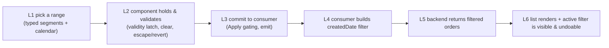

# Test Model — VCST-5097 `[UI Kit] Date Picker component (Range)`

- **Flow / type / path:** `feature-test` · Story · **FULL** · shape class **`ui-kit`**
- **Env:** vcptcore-qa1 — storefront `2.58.0-pr-2402-da56-da56daba` (ground truth, footer marker); Storybook `https://vcptcore-qa1-storybook.govirto.com`
- **Prior round:** 2026-09-15 on `b93b860e` (6/7 pass, item 3 open). **This build is a NEW head** — `da56daba` ≠ `b93b860e`.
- **Oracle:** the ticket has **no description and no ACs**. The oracle is PR #2402 + the two scope comments (Maya 2026-09-14, QA 2026-09-16) + `BL-UI-*` / `BL-A11Y-*`.
- **Diff since `b93b860e`: UNAVAILABLE** — no GitHub CLI and no GitHub MCP in this session. Stated as a gap, not assumed empty. Scope is therefore the **full stated re-test list**, not a delta.

## Part 0 — Value chain

**Chain position — this ticket is a SLICE.** It owns **L1–L3** (the component) and the **L3→L4 seam** at two
consumers. It does **not** own L5 (XOrder filtering, covered by VCST-3250) and owns L6 only as far as the
filter chrome. Links NOT touched: L5 arithmetic, order-detail rendering, pagination.

## Test object

| | |
|---|---|
| **Purpose** | one range-selection primitive (`VcDateRangeInput` / `VcDateRangePicker` / `VcRangeCalendar`) shared by every date filter in the theme |
| **Operations** | type a segment · open calendar · pick start/pick end (forward **and backward**) · clear · escape · apply · reset |
| **Variants** | layout `split` (desktop) vs `combined` (mobile) · bounded (min/max) vs unbounded · clearable vs not · light vs dark |
| **Consumers on this env** | storefront `/account/orders`; sales-rep hub customer-orders page; Storybook |
| **Constraints** | max 3 browser lanes; no GitHub diff; buyer fixture has a thin order set |

## Condition space

Factors: **surface** (storefront-desktop, storefront-mobile, sales-rep, Storybook) × **theme** (light, dark)
× **interaction** (forward range, backward range, clear, escape-after-clear, escape-without-clear, bounds,
clearable, details-row, focus-ring, double-ring) × **viewport** (1920, 375).
Raw N ≈ 4 × 2 × 10 × 2 = **160**. **Reduction 160 → 24**: dropped the theme cross for interactions whose
mechanism is theme-independent (range paint, revert logic, bounds clamp), dropped 1920×mobile-only and
375×desktop-only combinations as impossible, and kept both themes only where the defect class is colour
(focus ring, error text, zebra).

## Mechanism coverage matrix

| Mechanism ↓ / Variant → | storefront desktop `split` | storefront mobile `combined` | sales-rep | Storybook |
|---|---|---|---|---|
| Forward range select + apply | #1 | #2 | #12 | #18 |
| **Backward range select** | #3 (N/A band — two single calendars) | #4 | #13 | #19 |
| Double focus ring on combined field | WAIVED — no combined field at 1920 | #5 | #14 | #20 |
| Clear → Escape revert | #6 | #6m | #15 | #21 |
| Escape without Clear (control) | #7 | — | — | #22 |
| Bounds clamp (min/max) | WAIVED — consumer sets no bounds | WAIVED — same | #16 (premise to re-check) | #23 |
| Clearable on bound fields | WAIVED | WAIVED | #17 | #24 |
| Details row reserve (topDelta) | #8 | #8m | #16d | #25 |
| Focus ring contrast ≥3:1 both themes | #9 | — | #16f | #26 |
| **Parity: Customers-orders ≡ Orders** | #10 (reference) | #11 (reference) | **#27 · #28 · #29** | — |

**Reverse edges:** clear → does the consumer's list reset to unfiltered? (#30). Apply → back-nav → is the
range restored? — **ABSENT IN PRODUCT**, already tracked as VCST-5213; not re-filed.

## Scenario table (each row: cell · defect hypothesis · archetype · technique · oracle)

Full row detail lives in the checklist (Artifact B). Summary of the eight that carry the run:

| # | Cell | Defect hypothesis | Archetype | Technique | Oracle |
|---|---|---|---|---|---|
| 1 | L1→L6 storefront desktop | a committed range returns the wrong set | happy-path | FLOW | `{OBSERVED}` — exact count against a known fixture |
| 4 | L1 mobile backward | band unpainted, caps outward | state-transition | ST | `{SPEC}` PR #2402 item 2 |
| 5 | L2 mobile combined | nested focus ring after #2468 | visual-regression | EG | `{BL}` BL-UI-007 |
| 6 | L2 clear→escape | applied range not restored | state-transition | ST | `{HYPOTHESIS}` — product decision pending |
| 16 | L3 sales-rep bounds | premise false (no min/max set) | spec-drift | EP | `{OBSERVED}` |
| 25 | L2 details row | topDelta ≠ 0 at narrow width | layout-shift | BVA | `{BL}` BL-UI-003 |
| 26 | L2 focus ring | <3:1 contrast | a11y | EG | `{BL}` BL-A11Y-002 / WCAG 1.4.11 |
| 27 | L6 parity | Customers-orders diverges from Orders | consistency | CT | `{HYPOTHESIS}` — **no AC and no ticket declares this parity** |

**Archetype sweep:** happy-path #1 · boundary #25 · state-transition #4/#6 · error-handling #21 ·
a11y #26 · visual-regression #5 · consistency #27 · spec-drift #16. All eight present.
**UIP sweep:** UIP-focus #5/#26 · UIP-shift #25 · UIP-state #6 · UIP-contrast #26 · UIP-target #29 (VcCheckbox 18×18, known).
**Probes carried in:** `VC-*` date-filter entries — VCST-4892 (`0` as first digit), VCST-5153, VCST-5211, VCST-5717 (popover retains unapplied values), VCST-5718 (identical accessible names).

## Known-open, carried as context (not re-filed unless they changed)

VCST-5955 (deferred review follow-ups) · VCST-5934/5935/5936 · VCST-5213 · VCST-5717 · VCST-5718 ·
VCST-5994 (error state visual-only on date-range fields) · VCST-5869 (sales-rep filters drawer not a real dialog).

## The parity question — stated as the run's own finding

The operator asks that **Customers-orders become the same as Orders** (layout, mobile, filters) and whether
tickets exist. **Tracker search returns none.** Nothing in VCST-5097, VCST-5649, VCST-5733, VCST-5868/5869
or VCST-5955 declares that parity. So the surface's purpose here is **UNDECLARED** — recorded as the run's
first finding, and #27–#29 below characterise the divergence so a ticket can be written against measurement.
