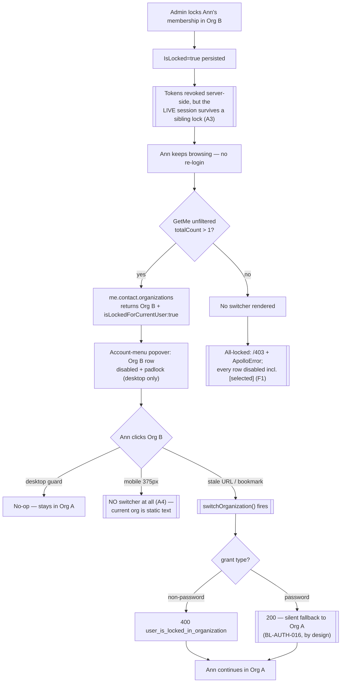

# TEST MODEL — VCST-5317

**Ticket:** VCST-5317 | Type: Story | Status role: `testable` | Flow: `feature-test` | Priority: Medium (P2 declared, **treated P1** — cross-layer + breaking + P0-smoke reach) | Path: **FULL** | Changed: **Both**
**Context:** `ba-system-analyzer` (1c) + `ba-story-writer` review (1d), 2026-09-09
**Amends:** `reports/ba/Organization roles/test-model-VCST-5281-2026-08-03.md` — the surface model for org membership status/lock. **Not a fork.** Its `EffectiveStatus` entity model, lock-as-independent-OR'd-predicate, D1–D20 table (D8–D11 = the lock cells) and Layer Map are carried, not re-derived. This model adds the **lock axis in the switcher's read path**.

**Affected surface**
- `vc-module-profile-experience-api` **PR #145, OPEN** — `Schemas/ContactType.cs:295-315` (the deleted `continue`), `Schemas/OrganizationType.cs:55-60,240-278` (new `isLockedForCurrentUser`, `DataLoader`-batched)
- `vc-frontend` **PR #2469, OPEN** — `fragments/organizationFields.graphql`, `top-header-organizations.vue`, `top-header.vue`, 13 locale files. **`multi-organisation-menu.vue` (mobile) NOT touched.**
- Untouched but load-bearing: `useUser.ts:382` (visibility gate), `useUserOrganizations.ts:37-70` (list loader), `Data/Handlers/RevokeTokenOrganizationMembershipChangedEventHandler.cs:16-39`, `vc-module-customer` `OrganizationIdRequestValidator.cs:25-28,102-115`
- **Deployed:** `ProfileExperienceApiModule 3.1018.0-pr-145-4fe6` (byte-match to PR #145's artifact) + storefront **`Ver. 2.58.0-pr-2469-83d6-83d6e5d5`**, printed in the page footer on every page (A1 — the earlier "no version endpoint" gap is CLOSED; the DOM names the PR). Platform 3.1064.0. **Never released** — ahead of `ledger_through: 3.1054.0`.

**Ticket signals (1a).** No attachments. One comment (2026-08-04): *"Partly implemented in VCST-5281"* — the only AC it leaves standing is AC-5. Line 1 of the description is an **unresolved either/or**: `> Hide or provide clear error message`, quoted from the VCST-5028 AC review and never decided. That is the root cause of the AC contradiction, open three months.

**Epic context:** none (no parent). Related: VCST-5028 (Done) — this is `EPIC-5028-10` in `VCST-5028-per-org-roles-stories.md:977-1105`.

**Domains:** b2b (organizations, membership) · auth (org-scoped lockout, `/connect/token`) · gql (xAPI contract) · storefront UI (header)
**Flows & boundaries:** membership ↔ xAPI list ↔ switcher render ↔ token grant ↔ session lifetime; switcher ↔ cart/address/list reset (BL-B2B-001); switcher ↔ impersonation (082)
**Risk areas:** `VC-EXEC-003` (never force a disabled control — now directly in scope) · `VC-API-001` (`/api/members/`, not `/api/customer/members/`) · open High `BUG-backend-provisioned-membership-not-linked-to-contact-organizations` (threatens 3a's seed path — `me.contact.organizations` is the switcher's source) · open High `BUG-graphql-changeorganizationcontactrole-forbidden` (**xAPI lock mutations are `Forbidden` → lock setup must use REST**) · open Medium `BUG-org-switcher-search-returns-nonmatching-orgs` (same surface, still reproducing) · fixed `BUG-org-user-temporary-lockout-shown-as-permanent-VCST-5374` (**the exact `IsLocked` vs `IsCurrentlyLocked` distinction AC-3 exercises**, regression-guarded by `PRF-GQL-080`)

**AC traceability:** 33 atomic conditions (6 story ACs + 14 gap-ACs) — 1d's §5 table is the spine. **DoD:** none declared; 1d derived the project default, 6 items `confirm-at-5b`.

---

## Part 0 — VALUE CHAIN (derived FIRST)

| # | Link | In the user's words |
|---|---|---|
| L1 | **Lock write + token revoke** | An admin blocks Ann in Org B → the membership row persists `IsLocked=true` and her tokens are revoked server-side. **A3: this does NOT evict her live storefront session** — measured, a sibling-org lock left the session fully working |
| L2 | **xAPI list membership** | Ann's `me.contact.organizations` **returns** Org B (post-#145; pre-#145 it silently vanished) |
| L3 | **xAPI lock flag** | that Org B item carries `isLockedForCurrentUser: true` |
| L4 | **Visibility gate** | `GetMe`'s **unfiltered** `contact.organizations.totalCount > 1` decides whether Ann sees a switcher at all |
| L5 | **Row render** | Org B's row draws greyed out with a padlock — **inside the Account-menu popover** (`listbox "Organizations"`), NOT a top-header control (A2), and **desktop only**. The tooltip is declared but **was not observed in the a11y tree** (finding F2) |
| L6 | **Click guard** | clicking Org B does nothing; Ann stays in Org A |
| L7 | **Token refusal** | reached anyway (bookmark / stale client) → `/connect/token` refuses `user_is_locked_in_organization` |
| L8 | **Sibling access preserved** | Ann keeps working in Org A **without re-authenticating** (A3); her global account is untouched. Only an ACTIVE-org lock forces re-auth, and that rehomes her to the unlocked sibling |



```mermaid
sequenceDiagram
  participant Ad as Admin (REST)
  participant DB as OrganizationMembership
  participant EH as RevokeToken…EventHandler
  participant SF as Storefront
  participant XA as xAPI
  participant TK as /connect/token
  Ad->>DB: POST .../{id}/lock
  DB-->>EH: Modified, IsCurrentlyLocked
  EH->>EH: TerminateAllUserSessions(userId)
  Note over EH: global — not scoped to Org B
  SF->>XA: GetMe { contact { organizations { totalCount } } }
  XA-->>SF: totalCount (UNFILTERED — includes locked)
  SF->>XA: GetOrganizations(statuses:[Approved]) + isLockedForCurrentUser
  XA-->>SF: Org B present, flag true
  Note over XA: 60s bound is GetLockedOrganizationIdsAsync ONLY;<br/>REST onlyLocked has no time bound (locked at t+162s)
  SF->>TK: switchOrganization() [non-password]
  TK-->>SF: 400 user_is_locked_in_organization
```

```mermaid
stateDiagram-v2
  [*] --> Unlocked
  Unlocked --> PermLocked: lock (LockoutEnd null)
  Unlocked --> TimedLocked: lock (LockoutEnd future)
  PermLocked --> Unlocked: unlock (explicit write)
  TimedLocked --> Unlocked: LockoutEnd passes (PASSIVE — no write);<br/>xAPI flag flipped at t+9s, render agreed throughout
  PermLocked --> [*]: membership deleted (also revokes tokens)
```



**Variants** — derived from the layers that BRANCH on `IsCurrentlyLocked`, taking the **union**: xAPI `ContactType`/`OrganizationType` (lock kind), `useUser.ts` gate (locked-vs-total count), `top-header-organizations.vue` vs `multi-organisation-menu.vue` (viewport), `OrganizationIdRequestValidator` (grant type), and whether the locked org is the **active** one.

| V | Variant |
|---|---|
| V1 | not locked — baseline |
| V2 | permanent lock (`LockoutEnd: null`), non-current org, multi-org user |
| V3 | timed lock, `LockoutEnd` in the **future** |
| V4 | timed lock, `LockoutEnd` in the **past** (expired) |
| V5 | the locked org **is** the current/active org |
| V6 | all memberships locked, **single**-org user |
| V7 | all memberships locked, **multi**-org user |
| V8 | 1 active + 1 locked — the `isMultiOrganization` flip boundary |
| V9 | **mobile** viewport (≤500px), any locked variant |
| V10 | anonymous caller |

### Mechanism coverage matrix — rows = variants, columns = chain links

Axes derived from Part 0 above, **before** any scenario existed. Scenarios mapped in afterwards.

| | L1 kill | L2 listed | L3 flag | L4 gate | L5 render | L6 guard | L7 token | L8 sibling |
|---|---|---|---|---|---|---|---|---|
| **V1** | WAIVED — no lock | 1 | 1 | 1 | 1 | WAIVED — nothing to guard | WAIVED — no refusal | 1 |
| **V2** | 2 | 3, **17** | 3, **9** | 4 | 5 | 6 | 7, **17** | 2 |
| **V3** | 2 | 3 | 3 | 4 | 5 | 6 | 7 | 2 |
| **V4** | WAIVED — expiry is passive, no event | 8 | 8 | 8 | 8 | **WAIVED — vacuous** (A5): measured, the row renders ENABLED with no padlock and render/flag agreed at every sample (~20 s and ~60 s, fresh load). The guard has nothing to block | WAIVED — not currently locked | 8 |
| **V5** | 2 | 3 | 3 | 4 | 5 | 6 | 7 | **UNREACHABLE** — see the 3a corrections below: re-auth rehomes the user off a locked active org, so V5 collapses into V2 and owns no distinct cell |
| **V6** | 11 | 11 | 11 | 11 | 11 | WAIVED — no second org to guard against | 11 | WAIVED — no sibling exists |
| **V7** | 12 | 12 | 12, **9** | **12** | **10, 12** | 12 | 12 | **10** |
| **V8** | 13 | 13 | 13 | **13** (end state only — the false→true FLIP needs an account whose unfiltered count was 1; see corrections) | 13 | WAIVED — covered at V2 | WAIVED — covered at V2 | 13 |
| **V9** | WAIVED — server-side, viewport-independent | 14 | 14 | 14 | **14** | **14** | 14 | 14 |
| **V10** | WAIVED — no session | 15 | 15 | 15 | 15 | WAIVED | WAIVED | WAIVED |

**Reverse edges**

| Forward effect | What moves it back | Covered |
|---|---|---|
| lock → row disabled | `POST .../{id}/unlock` (explicit write) | **16** (also `CUST-088` Critical) |
| timed lock → row disabled | `LockoutEnd` passes — **passive, no write** | **8** — measured 2026-09-09: the entity path flipped at **t+9 s** past `LockoutEnd` and the user-visible `isLockedForCurrentUser` flipped with no write, so a **~2 min** settle is sufficient. The 60 s `AbsoluteExpirationRelativeToNow` bounds **only** `GetLockedOrganizationIdsAsync`; the generic REST `onlyLocked` search cache is region-token-only with **no** time bound and still reported the row locked at **t+162 s**. So: settle ~2 min on the xAPI flag, and **never assert on the REST `onlyLocked` search after a passive expiry** |
| lock → tokens revoked server-side | **NO reverse edge is needed — the session never dies (A3).** Measured: locking a SIBLING membership left the live session fully working (13 `POST /graphql` all 200, normal client-side nav, no `/sign-in` redirect, no lost cart); the locked row simply re-rendered `[disabled]` on the next account-menu open, **with no re-login** | **P4** — a **negative** result, not an absent edge. `TerminateAllUserSessions` revokes tokens but does not evict a live storefront session for a sibling lock, so BL-AUTH-012 holds **and so does the session**. No existing case guards that; P4 promotes one |
| lock on the **active** org → eviction | **ABSENT IN PRODUCT** — no defined landing state; `/403` with no switcher is the open P0 (`BUG-multiorg-no-self-recovery-when-pinned-org-blocked-VCST-5281`) | **10** |

### Corrections from 3a's live provisioning (2026-09-09) — what the model got wrong

Every variant was provisioned, measured and torn down on `vcst-qa`. Five things this model asserted before the fixtures existed did not survive contact with them, and one of them was an error in the brief this model wrote.

| # | Model said | Live says | Consequence |
|---|---|---|---|
| 1 | The plans bound the locked org to **BuildRight** as the "non-current" org | **BuildRight is the ACTIVE org on both lane accounts**; TechFlow is the non-current one. `contact.organizationId` = BuildRight for both | **11 case bindings were inverted** and every gate passed anyway, because a resolving `@td()` says nothing about whether it names the right entity. Re-pointed to the lane-scoped `@td(<LANE>.org_techflow_id)` / `org_buildright_id` fields, which keep identity and org ids together |
| 2 | `PRF-GQL-078`'s `totalCount = 2` breaks the moment a lane locks a membership → **RE-BASE** | It **survives**. Post-#145 the lock filter is gone, so a locked membership is still counted. Measured: locked TechFlow on the backend lane, `totalCount` stayed **2** | **This model's own claim was wrong.** `PRF-GQL-078` is **CONFIRMED**, not RE-BASE — it needs **extending** for the `statuses` variant, never duplicating |
| 3 | V5 (locked org **is** the active org) is a distinct variant | **Unreachable.** Locking the active org kills all sessions; re-authentication then falls back and **rehomes the user to the unlocked sibling**, so the user is never sitting in a locked active org | V5 collapses into V2. Scenario **10's dead-end is reached through V7**, or through an explicit org-scoped grant — which is the L7 refusal case, not a render case |
| 4 | Scenario 9: the shared fragment leaks the flag onto the active-org row | `contact.organization` was **never** observed carrying `isLockedForCurrentUser: true` — it is either an unlocked org or `null` | Scenario 9 **inverted** to assert the invariant holds, guarding the fragment's blast radius instead of hunting a leak that does not occur |
| 5 | The 60 s cache floor bounds the read path after a passive expiry | It bounds **only** `GetLockedOrganizationIdsAsync`. The xAPI flag flipped at **t+9 s**; the REST `onlyLocked` search still said locked at **t+162 s** (region-token-only, no time bound) | Settle ~2 min on the xAPI flag; **never assert on REST `onlyLocked` after a passive expiry**. Not a storefront defect — the user-visible flag was correct throughout |

Two further live facts worth carrying: **`/lock` with a past `LockoutEnd` yields V4 in ONE call** (`isLocked: true`, `isCurrentlyLocked: false`) with no waiting; and **`/lock` on an unknown membership id returns `200 OK` with a null body, not `404`** — so always read back rather than trusting the status. Also, **unlock does NOT terminate sessions** and neither does a past-`LockoutEnd` lock: the handler guards on the **post-state** (`IsCurrentlyLocked`), not on a transition, and any edit while already locked **re-fires** it.

**V8's honest limit.** The end state is exact — `selectable = 1 of 2` with `totalCount = 2`, genuinely on the "exactly one selectable org" boundary. But the `isMultiOrganization` **false→true flip itself is not observable** on a 2-org account, because the gate reads the unfiltered `totalCount`, which is 2 both before and after locking. Observing the flip needs an account whose unfiltered count was 1 — stated here rather than left for a green case to imply.

**Fixture lifecycle.** Nothing here is terminal — lock is fully reversible via `unlock`, so shared fixtures are legitimate **provided the lane split holds**. `aliases.json` mandates `MULTI_ORG_TF_BR` = **backend lane**, `MULTI_ORG_TF_BR_ALT` = **frontend lane**, because a membership row is keyed on (userId, orgId) and carries the `isLocked` both lanes mutate. Two hard constraints: **`IMPERSONATE_TARGET_BLOCKED` (USR-021) is the only currently-locked membership on the environment and must NOT be unlocked** — suite 082 depends on it, and it is single-org (the V6 shape, not V2). **No alias declares a lock field** — lock is runtime-only, never seeded. (The earlier claim that `PRF-GQL-078`'s `totalCount = 2` breaks on a lock is **retracted** — see §Corrections #2: it survives, and the case is `CONFIRMED`.)

---

## Parts 1–5 — FAULT MODEL

**Condition space**
- `lock kind` → {none, permanent, timed-future, timed-expired} (4)
- `locked org is active` → {yes, no} (2)
- `org count / locked count` → {1org-1locked, 2org-1locked, 2org-2locked, 12org-1locked} (4)
- `viewport` → {desktop, mobile} (2)
- `grant type` → {password, non-password} (2)
- `caller` → {authenticated, anonymous} (2)
- `statuses arg` → {absent, ["Approved"], ["Locked"]} (3)

Constraints: `lock kind=none` ⇒ active/grant/statuses cells vacuous · `anonymous` ⇒ every lock cell vacuous · `1org-1locked` ⇒ `active=yes` forced · `timed-expired` ⇒ behaviourally ≡ `none` downstream of L3.
**Raw N = 4·2·4·2·2·2·3 = 768.**

**Reduction → M = 17.** One-factor-at-a-time on the four independently-branching layers, plus explicit boundary cells where a layer's own predicate changes (L4's count gate, L7's `allowFallback`). **Dropped, and why:** `statuses arg` collapses to `["Approved"]` alone for UI rows — it is the only value the frontend ever sends (`useUserOrganizations.ts:50`). **Corrected after the Step-3 verifier (2026-09-09): the original justification here was false.** `PRF-GQL-078` covers `["Approved"]`, `["approved"]` and `["NotARealStatus"]` — **not** `absent` and **not** `["Locked"]`. `absent` is covered by the NEW `PRF-GQL-083`; **`["Locked"]` is covered by nothing in the corpus** (0 occurrences in `050d`) and it is a **real supported value** — PR #145's own `ContactTypeTests` asserts `…ByStatusAsync(context, [OrgId], ["Locked"])` contains the org, so post-#145 it is the only way to filter *on* lock through that argument even though lock is not a status (BL-B2B-013). Closed as the one-op extension to `PRF-GQL-078`, not a duplicate; `12org-1locked` is dropped as an independent row and folded into scenario 14's search/threshold check, since >10 orgs changes only the search-bar affordance, not the lock predicate; `timed-future` merges with `permanent` at every link except L1's event (both read `IsCurrentlyLocked = true`), giving the V2/V3 row identity in the matrix.

**Test scenarios (17)**

| # | Cell | Defect hypothesis — what breaks, and why it plausibly would | Archetype | Technique | Oracle | P |
|---|---|---|---|---|---|---|
| 1 | **V1 · every link** — the `Technique:FLOW` journey | Baseline drifts unnoticed: all orgs listed, none flagged, gate on. Without it every later row is uninterpretable | `SCOPE` | FLOW | `{OBSERVED}` this run | P1 |

**Scenario 1's carrier — dispositioned after the Step-3 verifier (2026-09-09).** The verifier correctly found scenario 1 uncovered: `plan-frontend.json` had no case for it, neither sweep generated one, and `FLOW-001` reported **0 of 64** rows in `006` marked `Technique:FLOW` / `[JOURNEY]`. Clause 5 makes this row mandatory and this model's own justification for it is *"without it every later row is uninterpretable"*, so it is authored rather than waived: **`B2C-ORG-065`**, a V1 end-to-end journey (sign in → open the Account-menu popover → both orgs listed, neither flagged → switch to the sibling org → the org-scoped context resets per `BL-B2B-001` → switch back), carrying `Technique:FLOW`. `B2C-ORG-001` was considered as the carrier and **rejected**: it asserts only that the control is visible and names the current org, which is a render check, not a journey across the chain. `B2C-ORG-001`'s own disposition is separately corrected to **CONFIRMED** — 3x measured that its "2+ memberships" gate still holds, because the gate reads the unfiltered count that the lock no longer reduces (its assertion text is now *ambiguous* between "memberships" and "accessible orgs", which is a wording defect, not a broken assertion).
| 2 | V2/V3 · L1+L8 | Lock write does **not** kill sessions, or kills the global account too → `ApplicationUser.LockoutEnd` set, violating a `[P0-revenue]` invariant | `SCOPE` | ST | `{BL}` BL-AUTH-012 | **P0** |
| 3 | V2/V3 · L2+L3 | Locked org **still omitted** (PR #145 not actually live on the queried path), or present with `isLockedForCurrentUser` false/`undefined` → client renders it selectable | `SILENT` | DT | `{SPEC}` PR #145 body + `OrganizationType.cs:55-60` | **P0** |
| 4 | V2/V3 · L4 | Gate reads the **filtered** count, so a 2-org user with 1 locked loses the switcher entirely — the pre-#145 behaviour surviving in the client | `PARITY` | BVA | `{SPEC}` `useUser.ts:382` | P1 |
| 5 | V2/V3 · L5 | Row renders enabled, or padlock/tooltip absent, or the tooltip shows a raw i18n key | `RENDER` | EP | `{SPEC}` PR #2469 diff | P1 |
| 6 | V2/V3 · L6 | Click guard reads `organizations.value` while the row came from `displayedOrganizations` → **a locked non-current org paged out by an active search phrase has `target === undefined` and slips past the guard** | `BOUNDARY` | EG | `{SPEC}` PR #2469 `top-header-organizations.vue` | **P0** |
| 7 | V2/V3 · L7 | `switchOrganization()` (non-`password`) is **not** refused, or returns a global-lockout code instead of `user_is_locked_in_organization`, or >1 `errors[]` entry | `FALLBACK` | DT | `{BL}` BL-AUTH-013/016 | **P0** |
| 8 | V4 expired, all links | Flag reads raw `IsLocked` not `IsCurrentlyLocked` → org stays disabled forever after a timed lock lapses. **Precedent: `BUG-org-user-temporary-lockout-shown-as-permanent-VCST-5374`, this exact predicate, already filed once** | `BOUNDARY` | BVA | `{BL}` `OrganizationMembership.cs:22` + unit `IsLockedForCurrentUser_ExpiredLockout_ReturnsFalse` | P1 |
| 9 | **V2/V7 · L3** shared fragment | **Re-scoped 2026-09-09 after 3a (finding 4).** The original premise — the active-org row inheriting the flag — is **not reachable**: `contact.organization` is either an unlocked org (the auth layer rehomes off a locked one) or `null` (all-locked), and was never observed carrying `isLockedForCurrentUser: true`. This now asserts the invariant **HOLDS**, guarding the shared-fragment blast radius rather than hunting a leak that does not occur | `PARITY` | ST | `{OBSERVED}` 3a live probe + `{SPEC}` `organizationFields.graphql` | P1 |
| 10 | **V7** · L4+L5+L8, reverse | **Re-scoped 2026-09-09 after 3a (finding 3): the dead-end is reachable through V7, NOT V5.** Locking the *active* org kills all sessions, and re-authentication then **falls back and rehomes the user to the unlocked sibling** — so V5 silently degenerates into V2 and the user is never actually sitting in a locked active org. Measured instead: an all-locked multi-org user gets `totalCount = 2` (switcher renders) with **0 of 2 selectable**, and sign-in returns 200 with `contact.organization = null`. `AUTH-043` (High) asserts the current-org row is the `[selected]` escape hatch; under V7 no such row exists | `LIFECYCLE` | EG | `{OBSERVED}` 3a live probe + open P0 `BUG-multiorg-no-self-recovery…` | **P0** |
| 11 | V6 single-org all-locked | Sign-in refused outright instead of succeeding with no org context (BL-AUTH-015), or account pages unreachable | `FALLBACK` | BVA | `{BL}` BL-AUTH-015 | P1 |
| 12 | V7 multi-org all-locked | **AC-6 is unreachable through locking**: every org is returned, `totalCount > 1` renders the switcher, every row disabled → a hard dead-end, not the empty state AC-6 specifies. The only empty state in the component is *search* "no results" | `FALLBACK` | EG | `{SPEC}` `ContactType.cs` + #2469 | P1 |
| 13 | V8 flip boundary | 1 active + 1 locked flips `isMultiOrganization` **false→true**, so a switcher **starts appearing** for a user who previously had none — an unintended UX change #2469 never touched, and the case `B2C-ORG-010` asserts against | `BOUNDARY` | BVA | `{SPEC}` `useUser.ts:382` + `GetMe` unfiltered | P1 |
| 14 | V9 mobile ≤500px | **Re-scoped 2026-09-09 after 3x (A4). The P0 framing is REFUTED.** The hypothesis was "locked rows stay tappable with no padlock and no guard"; live at 375px **there are no rows at all** — the hamburger panel renders the current org as non-interactive text plus an account block (name / Logout / Purchasing), with no `Organizations` listbox. So nothing reaches L7, and the real defect is a **missing capability**: a multi-org buyer on a phone cannot switch org, locked or not | `FALLBACK` | EP | `{OBSERVED}` 3x live probe at 375px | **P2** |
| 15 | V10 anonymous | Flag resolver queries memberships for an anonymous caller (perf + info leak) instead of returning `false` without querying | `SCOPE` | EG | `{SPEC}` `OrganizationType.cs:252-256` | P2 |
| 16 | reverse: unlock | `unlock` does not re-enable the row, or needs a re-login (cache not busted by the region token) | `STALE` | ST | `{OBSERVED}` `CUST-088` | P1 |
| 17 | **V2 · L2/L7** — `organizationsIds` blast radius, REFUTED 2026-09-09 (A6) | PR #145 removed the lock filter from **`organizationsIds`** too. Does anything downstream now treat a locked org as accessible? `OrganizationIdRequestValidator.GetAvailableOrganizationIds` (`:162-170`) reads `contact.organizations`, and the prior model's open finding is that **`OrganizationIdClaimProvider` re-resolves independently and was never patched**. **Grounded and REFUTED.** `me.contact.organizationsIds` does return the locked id, but `organization(id: <locked>)` is refused (`errors[0].extensions.code = Forbidden`, `data.organization` null) — **and the discriminator that makes this meaningful: the same query shape against the unlocked ACTIVE org returns 200 with data.** So the refusal is lock-specific, not a blanket customer-principal denial; the authorization path re-evaluates the lock per org. No claim-provider bypass reachable. `organizationsIds` is now a **membership** list, not an **access** list. **Any promoted case must carry BOTH legs** — a lone Forbidden proves nothing | `SCOPE` | EG | `{OBSERVED}` 3x live probe, both legs | **P1** (de-escalated from P0) |

**Probes carried in:** `VC-EXEC-003` (never force a disabled/blocked control) → governs **5, 6, 10, 14** as a method constraint, not a scenario. `VC-API-001` (`/api/members/` path) → 3a setup. `VC-UI-002` (mobile hamburger re-mounts header controls) → **14**. `VC-B2B-001/002/003/004`, `VC-AUTH-001/002/003` → **N/A**: all `BY-DESIGN`/`CONVENTION`, none defect-shaped on this surface. **Catalog gap to propose:** neither the `storeId`-masks-`user_is_locked_in_organization` trap nor the switcher-empties-on-global-status trap is encoded in `vc-bug-catalog.md`; both live only in suite CSVs.

**Archetype sweep** (re-derived 2026-09-09 from the current scenario table, after the re-scoping — the previous line still carried pre-normalisation names and contradicted the table on scenarios 9/10/14/17): `SCOPE` 1, 2, 15, 17 · `SILENT` 3 · `PARITY` 4, 9 · `RENDER` 5 · `BOUNDARY` 6, 8, 13 · `FALLBACK` 7, 11, 12, 14 · `LIFECYCLE` 10 · `STALE` 16. **WAIVED:** `RACE` — no multi-writer path (lock is a single admin write; `DataLoader` batches reads only) · `REPLAY` — no idempotency surface · `MONEY` — no monetary effect in this chain · `CONFIG` — no flag or setting governs the lock behaviour (see the Toggle-sweep N/A below).

**Toggle sweep: N/A + reason.** No feature flag, store setting or config toggle governs the switcher's lock behaviour — the `statuses` argument is a *query argument*, not an on/off toggle, and the `toggle` sweep source is a fixed hypothesis table that does not model it. The `statuses`-value reduction is recorded in **Reduction** above and its uncovered values are already held contract-side by `PRF-GQL-078` (extend, never duplicate). **Date-range sweep: N/A** — `LockoutEnd` is a single instant, not a range; its boundary is scenario 8.

**UIP sweep** (UI in scope): `UIP-BACK` → 10 (back-nav out of a `/403`) · `UIP-REFRESH` → 4, 13 · `UIP-TABS` → **GAP**: two tabs, lock lands between them — folded into 2's session-termination check · `UIP-EXPIRE` → 8 (the >60 s settle) · `UIP-VIEW` → 14 · `UIP-NET` → 1d's `gap-AC-5` (org-list query fails → degraded switcher, header intact) · `UIP-DEEP` → 7 (stale/bookmarked org URL) · `UIP-INPUT` → 14 (search composing with the filter) · `UIP-STORAGE` **WAIVED** — the switcher persists no client state; last-active-org lives server-side · `UIP-DATA` **WAIVED** — covered by the V-variants themselves.

**Business Rules:** BL-B2B-001 `[P0]` · BL-B2B-005 `[P1]` · BL-B2B-007 (**not** BL-B2B-001 — 1d's correction to AC-5's citation) · BL-B2B-013 `[P1]` · BL-AUTH-012 `[P0]` · BL-AUTH-013 `[P1]` · BL-AUTH-015 `[P0]` — **its `Verify` clause "Confirm the switcher lists only accessible orgs" is now STALE for the lock axis**; staged as a `bl_proposal`, not applied, because the governing PRs are unmerged · BL-AUTH-016 `[P0]`
**Known oracle remaps to land at 5g (durable record — the Step-3 verifier required this, since the only prior record was an ephemeral scratchpad plan):**
- **`BL-GQL-002` is mis-cited on `PRF-GQL-083`, `PRF-GQL-089`, `PRF-GQL-090`.** It is a `[P2-ux]` **latency** rule, not a contract rule, and the mis-citation originated in this run’s own authoring plans, not in the authored rows. Each affected row carries a **correct co-citation** (`083` → `BL-B2B-013`, `089` → `BL-B2B-007`, `090` → `BL-B2B-013`), so none is untraceable and no assertion, runner behaviour or verdict changes. Route: `/qa-review-tests` **Dim 6** citation remap — never a CSV edit from here.
- **`BL-B2B-013` scope clarification** → `/qa-review-oracles bl`: its “never appears in the status set” should be scoped explicitly to the **persisted `Status` column**, so it does not read as a prohibition on the `statuses` **query-argument** vocabulary. Grounded: PR #145’s diff shows `"Locked"` never touches `Status` in either branch, and the pre-#145 test `OrganizationsStatusFilter_LockedMembership_MatchesOnlyLockedFilter` asserted `Contains` — so the overload was the asserted contract before #145. `ba-system-analyzer` is the sole writer; this is a proposal, not an edit.

**Step-4 triage instruction (from the verifier’s Limitation 1) — load-bearing, do not drop.** `PRF-GQL-087` waits `[WAIT seconds=15]` while its checklist carrier `G8` mandates a ~2 min settle. 15 s sits above the measured 9 s passive-expiry flip and far above the 156 ms write-path settle, but **below the 60 s `GetLockedOrganizationIdsAsync` bound**. If an earlier case in the same run (`083`/`084`/`085`/`086`) populated that cache with TechFlow locked, a stale `true` at 15 s would be read by `087`’s `Failure_Signals` as **VCST-5374 recurring**. The in-case REST read-back (`isLocked=true` / `isCurrentlyLocked=false`) makes the contradiction visible. **Treat a `true` flag at 15 s as a cache artifact and confirm against the REST read-back BEFORE filing anything.**

**Staged proposals (response-only, NOT applied):** `PROPOSED-BL-B2B-014` — a locked membership is surfaced, never silently omitted, and never selectable. `PROPOSED-BL-AUTH-018` — switcher visibility and switcher list contents must be computed from the same predicate (today they are not: `useUser.ts:382` unfiltered vs `useUserOrganizations.ts:50` filtered).

**Edge cases:** `ECL-14.3` (B2B Organization Context) — **row 1 is CONTRADICTORY and rows 2/4 UNGROUNDED** per the 2026-09-03 audit, so it cannot ground an assertion as `{DOC}` · `ECL-14.8` (module version-schema drift) — applies directly: two unmerged PR builds on a shared non-prod env; **PR #145 ships no EF migration**, so the exposure is purely that the contract flips back if either PR is reverted · `ECL-10.2` (degraded dependency) → `gap-AC-5` · `ECL-15.x` (a11y) → the visual lane. **The story set's `ECL-7.2` citation is wrong** (that is Form Input Edge Cases) → REMAP recommendation to `/qa-review-tests` Dim 6, never a CSV edit here.

**Docs grounding — the published guide says the opposite of the build.** VirtoOZ `StorefrontUserGuide` → *Switch between your companies*: **"Only companies you currently have access to appear here."** That is the HIDE contract, customer-facing, and the deployed build contradicts it. The guide documents no lock label, no disabled entry, no padlock, no tooltip, and **nothing at all about the all-locked state** — which is precisely AC-6's *"exact UX is a product decision to confirm"*. `PlatformUserGuide` → *Manage Organization Membership Status* documents the **status** axis correctly and **no lock axis whatsoever**. A doc update is part of finishing this ticket (5h → `ba-doc-writer`, Customer audience).

**Agents to dispatch:** `qa-backend-expert` (`playwright-edge`) — L1/L2/L3/L7/L8, scenarios 2,3,7,8,11,15,17 · `qa-frontend-expert` (`playwright-chrome`) — L4/L5/L6, scenarios 1,4,5,6,9,10,12,13,16 · `ui-ux-expert` (Chrome DevTools) — visual lane, `visual_surface: true`; a11y on the new disabled affordance + padlock + tooltip (Coffee + Red themes), `vs. DESIGN` **SKIPPED** (no Prototype link) · `qa-testing-expert` — scenario **14** (mobile), sequenced **not** concurrent, on a free chrome/edge lane (never firefox for click-driven work) · `test-data-engineer` — 3a, REST-only lock setup (xAPI mutations are `Forbidden`).

**The decision this model cannot make.** Whether the product's answer is **hide** or **disable** is a product call, not a QA one — and it is a **cross-product consistency** call, because Sales Rep already *excludes* per-org-locked orgs across four Critical cases (`SR-GQL-012/017/024/124`, `050m`) plus `SR-CP-021`, while the switcher now *returns-and-flags*. PR #2469 made that choice without recording it. The run tests the **as-built** behaviour and reports the divergence; it does not ratify it.
