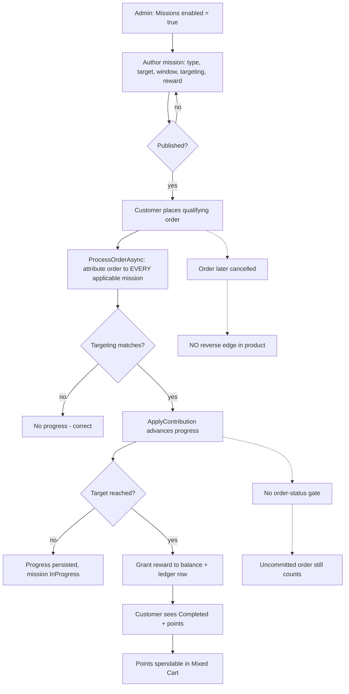
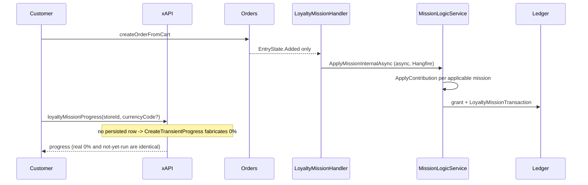
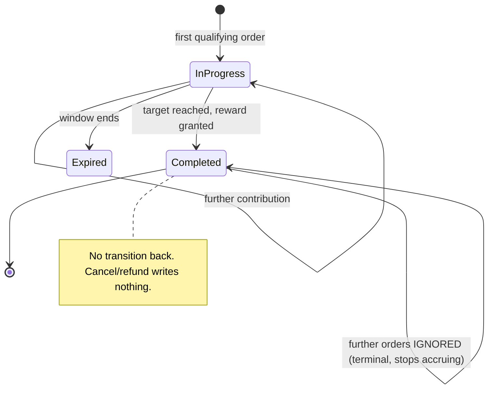

# TEST MODEL — VCST-5319

**Ticket:** VCST-5319 `[Missions][Backend] Implement initial missions backend` | **Type:** Story | **Status role:** testable (`Testing`) | **Flow:** feature-test | **Priority:** Medium | **Path:** FULL | **Changed:** Backend (+ its GraphQL read surface)

**Build under test:** Platform `3.1061.0`; `VirtoCommerce.Loyalty_3.1006.0-pr-14-da8a` = **`da8abc6`** (PR #14). **Three commits ahead of `1be73b4`**, which every earlier analysis this sprint was read at — `916b9dc` → `bcbb401` → `da8abc6`, all currency work.

**Context:** `ba-system-analyzer` (1c) + `ba-story-writer` Mode B (1d)

**Affected surface:** `vc-module-loyalty` — Core models (`LoyaltyMission`, `LoyaltyMissionProgress`, `Missions/{OrderValue,OrderCount,PerSku}Goal`, `LoyaltyMissionConditionAndRewardTreePrototype`) · Data (`LoyaltyMissionLogicService`, `LoyaltyMissionHandler`, `LoyaltyMissionValidator`) · REST (`LoyaltyMission{,GoalItem,Progress}Controller`) · Admin SPA (`loyalty-mission-{list,details,goal-item-list,banner}`) · xAPI (`GetMissionProgressQuery{,Builder,Handler}`, `LoyaltyUserMissionType`, `DataLoaderContextAccessorExtensions`). **Cross-repo:** `vc-module-marketing` `PromotionPolicyBase.cs:30`.

**Ticket signals:** Dev comment (upd. 2026-08-20) — to-do list all struck through except *"Review via AI tools"*; completed items include the transactional rewrite of `ApplyMissionInternalAsync`, an `IsPublic` decision, the `LoyaltyProgramOperationLog` → `LoyaltyBalanceOperationLog` rename, currencyCode validation, and backend save-validation. **Two subtasks `Ready for test`, both High:** VCST-5841 (currency filter) and VCST-5842 (page renders nothing). No attachments.

**Epic context:** Parent **VCST-5320** (`Missions & Challenges`) is `Draft` with **no description and no ACs** — supplies no epic-level criteria to reconcile against. Sibling **VCST-5346** `[Missions][Frontend]` is `In progress` and is the consumer of this backend; prior `/qa-test` run 2026-08-27 verdict **FAIL**.

**Domains:** Loyalty, Missions, Orders, B2B (targeting)

**Risk areas:** two accrual paths in one module disagreeing (`LoyaltyProgramHandler` currency-aware, `LoyaltyMissionLogicService` not) · a settle-many-per-event subsystem with no per-entity attribution (`BL-LOY-015`, VIOLATED) · an optional argument load-bearing for a crash fix.

**AC traceability:** 24 atomic conditions — 16 story + 8 gap-ACs (1d). **Reconciled against 1c where the two disagree:** 1d marked AC-1 and AC-4 NOT-FOUND from a diff summary; 1c located both in source (`LoyaltyMissionLogicService.cs:60` for the store toggle; all four CMS fields present and GraphQL-exposed). 1c wins — it read the deployed tree.

**DoD:** none declared on this ticket ⇒ `dod_pct: null` (not 0).

---

## Part 0 — VALUE CHAIN

**Value chain:** an admin enables missions on the store → authors a mission (type, target, window, targeting, reward) and publishes it → a targeted customer places a qualifying order → a background pass attributes that order to every applicable mission and advances progress → progress crosses the target → the reward is granted to the balance and written to the ledger → the customer sees the mission complete and the points arrive → **the points are spendable**.

**Variants** (different code paths through the same links, so matrix rows): `OrderValueGoal` · `OrderCountGoal` · `PerSkuGoal(ALL)` · `PerSkuGoal(ANY)`.

**Mechanism coverage matrix** — variants × chain links. No blank cells.

| Variant | Author+publish | Targeting | Accrue | Complete+grant | Ledger attribution | Customer sees | Spendable | Reverse |
|---|---|---|---|---|---|---|---|---|
| OrderValue | 2 | 5 | **1**, 3 | 1 | 8 | 1 | WAIVED — covered end-to-end by `083d` MSN-E2E-004 (frontend sibling) | 7 |
| OrderCount | 2 | 5 | 1 | 1 | 8 | 1 | WAIVED — as above | 7 |
| PerSku(ALL) | 2 | GAP — no ALL/ANY targeting variance; subsumed by row below | 4, 6 | 4 | 8 | 6 | WAIVED — as above | 7 |
| PerSku(ANY) | 2 | GAP — as above | 4, 6 | 4 | 8 | 6 | WAIVED — as above | 7 |

**Reverse edges** — per forward effect that moves points:
- progress advance → **ABSENT IN PRODUCT** (`LoyaltyMissionHandler:22` handles `EntryState.Added` only; `Modified` never processed) → scenario 7 documents the absence.
- reward grant → **ABSENT IN PRODUCT** (operation types are exactly `Earned`/`Redeemed`; no cancel/revert/refund/rollback identifier in `src/` at `da8abc6`) → scenario 7.
- mission completion → **ABSENT IN PRODUCT** (`Completed` is terminal and stops accruing; measured: `MSN-ZEROTARGET` 24→25 while a Completed mission stayed frozen at 2 of 2) → scenario 7.

**Fixture lifecycle:** `Completed` is **terminal** — a completed mission never accrues again and there is no reset path. Every scenario that must observe an *advance* requires a **per-run mission on a per-case account** (`ProcessOrderAsync` advances every mission applicable to that user, so accounts are the isolation axis, not missions). Fixtures exist and are seeded: `MSN_E2E_ORDERVALUE_{003,005,006,008}` + `MSN_E2E_USER_{003,005,006,008}`, targets measured live against a 20% tax on (subTotal − discount + shipping).

---

## Parts 1–5 — FAULT MODEL

**Condition space:**
- goal type → {OrderValue, OrderCount, PerSkuALL, PerSkuANY}
- accrual basis → {merchandise only, + shipping, + tax, − discount}
- line currency → {cash only, mixed cash+PTS}
- order status → {uncommitted (New/Pending), committed (Completed), cancelled-after}
- targeting → {group match, group non-match, CustomerIDs (unimplemented), untargeted+public=false}
- settlement read → {before job, after job}
- `currencyCode` arg → {passed, omitted}

Constraints: PerSku goals carry `MissionCurrencyCode == null`, so accrual-basis classes do not apply to them; `CustomerIDs` has no implementation, so only its absence is testable. **Raw cells = 4 × 4 × 2 × 3 × 4 × 2 × 2 = 1536.**

**Reduction: 1536 → 8.** Dropped by subsumption, named: *accrual basis* collapses to one boundary pair (merchandise vs total) because a single order carrying shipping + tax + discount discriminates all four classes at once (scenario 3); *settlement read* folds into every scenario as a settle-and-retry rather than a factor, since `CreateTransientProgress` makes a single read undecidable regardless of cell; *goal type* × *targeting* does not interact — targeting is evaluated before `ApplyContribution` is reached, so one goal type exercises it (scenario 5); PerSku ALL/ANY differ only in the completion predicate, already covered by `075d` MSN-026, so they collapse to one accrual row here (scenario 4). `currencyCode` {passed, omitted} survives as its own row because the omitted case is a *crash*, not a value difference (scenario 6).

**Test scenarios** — authored from in Step 3.

| # | Cell | Defect hypothesis | Archetype | Technique | Oracle | P |
|---|---|---|---|---|---|---|
| 1 | OrderCount, cash, committed, group-match, after-settle | **[JOURNEY]** The whole chain is never exercised end to end; a link works in isolation while the join to the next silently does not — progress advances but the grant never lands, or lands without becoming visible | LIFECYCLE | FLOW | `{SPEC}` AC-2.b + AC-3.e | Critical |
| 2 | any type, author+publish | Save-validation added late (dev comment item 5) rejects a valid mission or accepts an invalid one — End before Start, zero/negative reward, no goal | BOUNDARY | EP | `{SPEC}` AC-2/AC-3 | High |
| 3 | OrderValue, order with shipping+tax+discount | Goal accrues `order.Total`, so shipping and tax inflate progress and a discount deflates it — a $250 mission completes on ~$200 of merchandise | MONEY | BVA | `{SPEC}` AC-2 (basis undefined) → gap `PROPOSED-BL-LOY-016` | Critical |
| 4 | PerSku, mixed cash+PTS lines | `ApplyContribution:420-431` counts `order.Items` with no currency filter, while the sibling handler filters `!x.Currency.EqualsIgnoreCase(loyaltyCurrency)` — points-priced spend counts as cash spend | MONEY | EG | `{BL}` BL-LOY-009 (by analogy) | Critical |
| 5 | OrderCount, group non-match + `public=false` untargeted | Targeting leaks — a non-member accrues, or a private untargeted mission is visible/accruable (`Mission.Public` is declared but never set by any server path) | SCOPE | DT | `{SPEC}` AC-3 → gap `PROPOSED-BL-LOY-019` | High |
| 6 | PerSku, `currencyCode` **omitted** | VCST-5842's fix is incomplete by construction: `CurrencyCode` is `Argument<StringGraphType>` (`:50`, optional) while `StoreId` is `NonNullGraphType` (`:45`); a PerSku mission's `MissionCurrencyCode` is null, so the `??` fallback yields null and `vc-module-marketing` `PromotionPolicyBase.cs:30`'s unguarded `.First()` throws — blanking all 24 missions via VCST-5843 | CONFIG | EG | `{OBSERVED}` VCST-5842 + `{DOC}` source | Critical |
| 7 | any type, cancelled-after-completion | No reverse edge exists at any layer — progress, completion state and granted points all survive cancellation, and the points stay spendable | LIFECYCLE | ST | `{SPEC}` gap `PROPOSED-BL-LOY-017` (undeclared — a failure here is an open product question) | High |
| 8 | OrderCount, one order completing ≥2 missions | Ledger rows are not attributable — mission grants carry `object === null` (no order reference at all) while product-earn rows carry `type: CustomerOrder` + `orderNumber`; two same-amount grants are indistinguishable | SILENT | EG | `{BL}` BL-LOY-015 (VIOLATED) | High |
| 9 | new user, no order history, missions exist | A brand-new account has NO persisted progress row, so every mission it sees is fabricated by `CreateTransientProgress` — the first-run view is entirely synthetic. Zero-target and zero-reward missions render a 0/0 percentage on that path; `isStarted:false` on every row means a store filtering `isStarted:true` shows a new customer an EMPTY missions page | FALLBACK | EP | `{SPEC}` AC-6 (summary must report state) | High |

**Probes carried in:** `VC-LOY-001` (PTS currency scope) → N/A, catalog-side, pre-Missions. `VC-LOY-002` (per-product points; per-group gap) → N/A, different subsystem. No `VC-*` entry covers Missions — all Missions history lives in `reports/bugs/open/`, not yet promoted to the catalog.

**Archetype sweep:** MONEY → 3, 4 · LIFECYCLE → 1, 7 · SCOPE → 5 · CONFIG → 6 · SILENT → 8 · BOUNDARY → 2 · **STALE** → WAIVED, the settle-and-retry is folded into every scenario rather than isolated (see Reduction) · **RACE** → WAIVED here, concurrency/dedup is `075d` MSN-021's ground and gap-AC-6 proposes the invariant · **REPLAY** → WAIVED, no idempotent-replay surface on the backend read path · **PARITY** → WAIVED, admin-vs-storefront parity belongs to the VCST-5346 story · **RENDER**, **FALLBACK** → WAIVED, frontend-only archetypes.

**UIP sweep:** N/A — backend/API story, no UI surface of its own. The sweep applies to VCST-5346.

**Business Rules:** `BL-LOY-009` (loyalty-currency lines earn zero — the analogy scenario 4 rests on) · `BL-LOY-015` (per-entity attribution, **VIOLATED**) · `BL-LOY-007` (dedup by objectType/objectId/operationType) · `BL-ORD-009` (order status is an admin-editable dictionary — **not** a fixed enum, and there is no "Pending approval") · `BL-B2B-004` (approval is quote-based; asserting a native order-approval workflow is a documented violation signal).

**Edge cases:** `ECL-13.3` (points never expire; no reversal operation type) · `ECL-14.7` (Hangfire timing — accrual is async, absence is not evidence) · `ECL-1.3` (discount stacking) · `ECL-14.3` (B2B org context).

**Docs grounding:** **VirtoOZ documents Missions nowhere.** The entire documented loyalty GraphQL surface is `loyaltyBalance` + `loyaltyPointsHistory`; `loyaltyMissionProgress` does not appear, and there is no Missions page in the Platform User Guide. Silence is total, not partial — so docs give no tiebreaker on whether `CustomerIDs` targeting was ever intended. That is a PO question, not an inference.

**Knowledge-surface coverage (Step 2) — Missions is absent from all four.** `E2E-*` scenario catalog: **no loyalty/missions scenario exists** (catalog is keyed `E2E-<DOMAIN>-NNN`; Missions absent), so Artifact C cannot inherit a pre-mapped suite list and must derive suites directly. `/qa-checklist`: **no loyalty domain section** in `domain-checklists.md` or `backend-admin-checklists.md`. `vc-bug-catalog.md`: no `VC-*` Missions entry (both `VC-LOY-*` are pre-Missions). VirtoOZ: total silence. **Net: the only oracle surface that covers Missions is `BL-LOY-015`, added 2026-08-28.** A feature with 119+ existing cases is invisible to every knowledge artifact those cases should have been authored from — that is the systemic finding behind the four defects, not a separate one.

**Agents to dispatch:** `qa-backend-expert` (`playwright-edge`) — GraphQL + Admin SPA. `test-data-engineer` — fixtures already seeded, verify only.

---

## Findings that need no execution

Recorded here because they are already established from source at the deployed SHA and Step 5 should not re-derive them:

1. **`CustomerIDs` targeting does not exist.** Zero hits across mission models, search criteria and the condition tree, which offers only `UserGroupIsCondition`/`AnyUserGroupCondition`. AC-3 names it. Either a silent descope or a real gap — needs the author, not a test.
2. **Customer Mission Summary is unmet as specified**: `CustomerId` not echoed on the row · `IsCompleted` has no DB column (only a `Status` string) · `IsActive` absent entirely · `OrderTotalValueCompleted`/`OrderQuantityCompleted` collapsed into a shared `currentValue` · `SkusCompleted` reshaped into `items[]` · `CompletedPercentage` → `percentage`. Six of nine renamed, reshaped or absent.
3. **Periodicity is decorative.** A non-`None` value is accepted and never branched on, so "per mission period" — load-bearing in all three goal-type ACs — has no implementation behind it.
4. **`Mission.Public` is inert** despite the dev comment marking that decision resolved.
5. **The mission subsystem has no B2B/organization dimension — and that is a product question, not a test.** `LoyaltyMissionProgress` carries `MissionId` + `UserId` only; a grep for `organization` across the whole mission path returns zero hits; accrual keys on `order.CustomerId`; and `loyaltyMissionProgress` takes **no `organizationId` argument**, unlike nearly every other xAPI operation on this platform. Consequences: a new org member inherits nothing, org purchasing never aggregates (an org-level target is completable only by one individual acting alone), and a multi-org buyer carries one progress record across every org they buy for. **Deliberately NOT a scenario.** A case asserting org aggregation would assert a capability the platform never claimed — the exact anti-pattern named in the `BL-B2B-004` violation signal, and the same error as asserting a native pending-approval order status. Whether a mission is a personal or an organizational achievement was never decided; it was settled by a missing column. Route to the PO alongside AC-3, which names CustomerIDs and Customer group and never organization.
