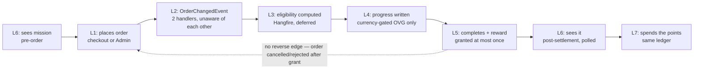
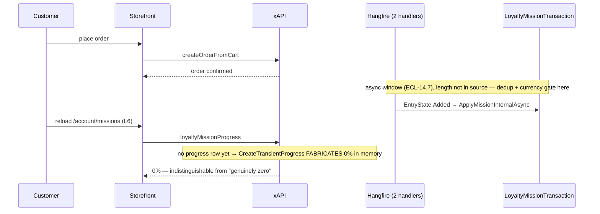
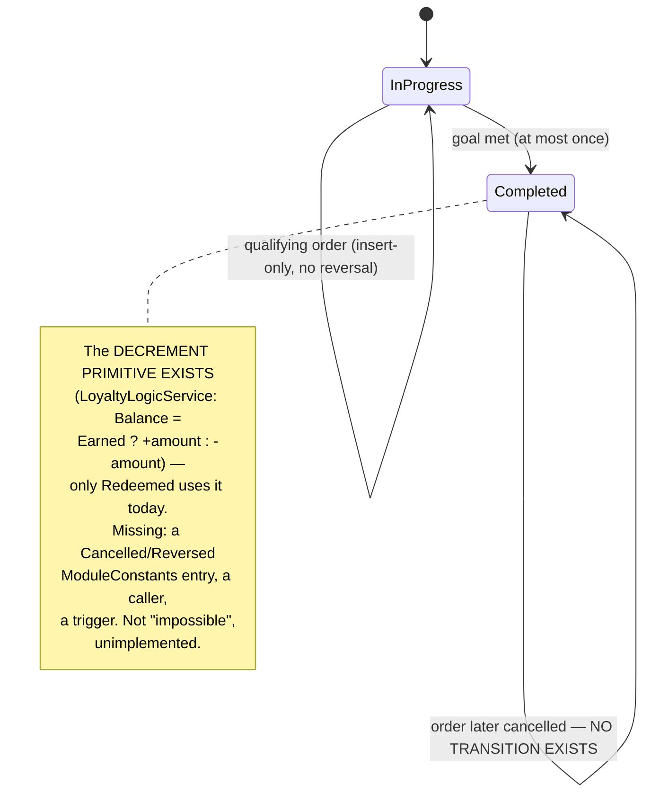

TEST MODEL — VCST-5346 (Loyalty Missions — restructure)
Ticket: VCST-5346 (Sub-task of Epic VCST-5320; sibling VCST-5319 backend) | Type: Story | Status role: testable | Flow: feature-test | Priority: P0 | Path: FULL | Changed: Both
Context: `ba-system-analyzer` (source-grounded, SHA `1be73b4`) + SBTM session (2026-08-28, ~35 min)
Affected surface: `vc-module-loyalty` (`LoyaltyMissionLogicService.cs`, `LoyaltyMissionHandler.cs`, `LoyaltyProgramHandler.cs`, `LoyaltyLogicService.cs`, `ModuleConstants.cs`) · Admin SPA (AngularJS blades) · `vc-frontend` PR #2396 (`client-app/modules/loyalty`, GraphQL `loyaltyMissionProgress`/`loyaltyBalance`/`loyaltyPointsHistory`)
Ticket signals: 127 cases exist, authored from a screen inventory, not the mechanism. SBTM found 8 net-new scenarios + 6 defects at the seams. BA report: **zero mission-specific `BL-*` invariants exist.** 5 bugs open, 3 rejected.
Epic context: VCST-5320. Sibling VCST-5319 (backend mission CRUD + accrual) is Done — this story is the storefront/E2E slice consuming its output.
Domains: Loyalty, Cart, Checkout, Orders, Admin (Loyalty Missions blade)
Flows & boundaries: missions ↔ checkout (accrual) · missions ↔ points-history (reward) · missions ↔ loyalty-catalog + Mixed Cart (spend) · missions ↔ order cancellation (reversal, absent)
Risk areas: two independent `OrderChangedEvent` handlers (`LoyaltyMissionHandler`, `LoyaltyProgramHandler`) both filter `EntryState.Added` and run unaware of each other — a module-wide gap, not mission-specific, that missions inherits in full
AC traceability: none on file (retroactive rebuild); traced through the 127 cases' own `References` + the SBTM's 8 scenarios + the BA report's proposals
DoD: n/a

--- Part 0 — VALUE CHAIN (source-grounded, SHA `1be73b4`) ---
Value chain — 7 links, verified against source, not inferred from UI:
  L1. Customer places any order — checkout OR Admin-created; nothing in the mission path distinguishes them
  L2. `OrderChangedEvent` fires; **two independent handlers** both filter `EntryState.Added`, unaware of each other (`LoyaltyMissionHandler.cs:22`, `LoyaltyProgramHandler.cs:44`)
  L3. Eligibility computed, deferred to Hangfire — `Loyalty.Missions.Enable` gate → search Published + in-window missions for the store → evaluate condition tree (only `UserGroupIsCondition`/`AnyUserGroupCondition`) → extract goal node
  L4. Progress written under a per-(mission,user) lock — currency gate (OVG only, self-disables if `CurrencyCode` empty, but the save-time validator makes an empty one unreachable in practice — MSN-004) → dedup on `(missionId, orderId, userId)` via `LoyaltyMissionTransaction` → insert-only update
  L5. Completion + reward granted **at most once** — `IsCompleted` → sum `FixedAmountReward` → `LoyaltyBalanceOperationLog` row (`Earned`/`LoyaltyMission`) under a per-user balance lock
  L6. Customer sees it — **POLLED, not pushed**: next visit to `/account/missions` calls `GetUserMissionsAsync`. Crossed TWICE per journey (once pre-order, once post-settlement) — same surface, different reads
  L7. Points become spendable — **same ledger, no separate bucket**: a mission-granted point is bit-for-bit identical to a program-granted one, spent via Mixed Cart redemption at a later checkout

Variants — each a DIFFERENT code path (confirmed, not analogous):
- **OrderValueGoal** — currency-gated (self-disables only if `CurrencyCode` empty, unreachable via the API per MSN-004); contributes server-recomputed `order.Total` (not merchandise subtotal); generic % / generic completion.
- **OrderCountGoal** — **no `CurrencyCode` field on the type at all** — never currency-checked, period; contributes exactly `1` per qualifying order regardless of value or currency (a $0 all-PTS order counts identically to a $10,000 cash order).
- **PerSkuGoal ALL** — no currency filter; sums `lineItem.Quantity` unconditionally (`:420`); `CurrentValue = Σ Min(current,target)` clamped per row; completion needs every row met.
- **PerSkuGoal ANY** — same contribution path; **`Percentage` is BINARY** (`completed ? 100 : 0`, `:442-443`) — CONFIRMED correct, not a suspicion (this reverses the earlier suspicion in `MSNF-016`'s original framing).

Mechanism coverage matrix (variant × link; # = scenario below):

| Variant | L1 | L2 | L3 | L4 | L5 | L6 | L7 |
|---|---|---|---|---|---|---|---|
| OVG | #1 | #1,#2 | #1,#3 | #2,#3 | #4 | #1,#6b | #5 |
| OCG | #6 | #6,#7 | #6 | #7 | #6,#9 | #6 | **#6** |
| PSA | #10 | #10,#11 | #10 | #12 | #10 | #10 | WAIVED — same reward mechanism as OCG #6, `GetRewardAmount` reads only `IsCompleted`, not `all` |
| PSN | GAP | #12 | #12 | GAP | GAP | GAP | WAIVED — same reasoning as PSA; ANY diverges from ALL only at L3 (#12 proves it directly) |

PSN L1/L4/L5/L6 are a genuine, named GAP (not WAIVED): no case starts at L6, drives an ANY mission through checkout to completion, and confirms the reward lands. Accepted as a decision, not evidence-in-hand — `#12` proves the ALL/ANY *divergence* but never the ANY *reward path* end to end.

Reverse edges:
- **L5 → (undo)**: **ABSENT IN PRODUCT**, module-wide (both handlers share the gap, not missions-specific — corrects the SBTM's framing). The decrement primitive exists (`Earned ? + : -`); missing pieces are a `Cancelled`/`Reversed` `ModuleConstants` entry, a caller, and a trigger. Covered by scenario #13 (rewrite of MSN-E2E-008) — documents the absence, asserts nothing that doesn't exist.
- **L2/L3 → (status gate)**: the program's condition tree offers `OrderStatusCondition` (compiles, wired); the mission's condition tree offers only the two group conditions — **a wire-up gap in mission authoring**, not a runtime filter difference (both handlers filter `Added` only, identically). Scenario #14 tests the reachable half: cancelling an order inside the async window still lets `EntryState.Added` enqueue and complete the job, because nothing downstream re-checks status.

**Fixture-lifecycle hazard on L4-L5 (found live, 2026-08-28, run `REG-2026-08-28-1154`):** a mission is a **terminal** entity once `Completed` — `LoyaltyMissionLogicService` never reopens a completed row, confirmed by a live control pair. The shared fixtures `MSN_ORDERCOUNT` and `MSN_ORDERVALUE` were both observed already at 100%/frozen (`MSN_ORDERCOUNT` at 2 of 2; `MSN_ORDERVALUE` at $5,842,446 against a $250 target), so any journey case bound to a SHARED, cumulative mission is a **one-shot**: it can pass exactly once, on whichever run first completes the mission, and reports a false BLOCKED/vacuous-pass forever after — silently converting the whole journey suite into decoration after its first green run. This is not a corner case of L4/L5, it is the generic shape of any case whose hypothesis requires observing an ADVANCE (not just a static read): the fixture must be freshly-minted per run, never shared across cases that each need their own uncompleted starting state, and never reused by a case that only needs a STATIC read (075d's API-contract cases and 083c's card-rendering guards are unaffected — they read whatever state the mission is in, they don't need it to move). The corrected pattern, landed live in `083d-loyalty-missions-e2e.csv`: `npm run seed:missions-e2e` mints a fresh per-run `MSN_E2E_*` mission set each run, `npm run td:validate:missions-e2e` guards it before dispatch, and a case that finds its target mission already `Completed` at start self-diagnoses `BLOCKED:PRECONDITION_UNMET` rather than reporting a false verdict. A further wrinkle the live suite documents: even a per-run mission can be **contended within one seed cycle** if more than one case needs to be the order that crosses it from `InProgress` to `Completed` — `MSN_E2E_ORDERVALUE` is shared read-for-progress across four cases (003/005/006/008) but only one of them can be the completing order per cycle, so each of the others must also self-diagnose the same way. The scenario table's defect hypotheses (#1-#14) are unaffected — this is an EXECUTABILITY property of the fixtures they run against, not a change to what any scenario is testing — but any future case authored against this feature's L3-L5 must mint its own dedicated fixture or explicitly justify sharing one, or it inherits this defect silently.

**Measurement hazard — a total is not an oracle for one entity's contribution (found live, 2026-08-28, peer-session runs):** where one event settles many entities — `ProcessOrderAsync` advances EVERY mission applicable to the order's user, so one order completes several missions at once — any aggregate (a balance, a history length, a count of rows or cards, a sum) can be moved by something other than the thing under test. `075d`'s own `MSN-019`/`MSN-020`/`MSN-021` asserted exactly this shape (`currentBalance = BAL_BEFORE + reward`, `history.items.length = COUNT_BEFORE`) and all three broke against a real settlement: one order granted `+300` (`MSN_ORDERCOUNT`, under test) alongside `+250`/`+200`/`+100`/`+0` from four co-completing siblings, a real delta of `1058` against an expected `300`. Attribution needs TWO axes, not one — the entity's own id AND the event's id — because amount alone collides: a same-amount row from a sibling mission is a realistic false match, not a theoretical one. Where the schema exposes no entity-identifying field at all (confirmed live via introspection: `LoyaltyOperationLog`/`LoyaltyOperationLogObject` carry `amount`/`createdDate`/`orderId`/`orderNumber` but no mission id), the best available proxy is the entity's own distinguishing VALUE (here, its configured reward) filtered against the event id — corroborating, not identical to, a true per-entity key. This generalizes past missions: any suite reading a shared counter, balance, or list length as its oracle is vulnerable the moment more than one thing can move that counter in the same event.

**Measurement hazard — an asserted ABSENCE needs a positive control in the same event, or it is indistinguishable from the mechanism never firing:** a case asserting "the PTS line did NOT count toward the quantity target" (MSN-E2E-007's hypothesis) reads identically whether the currency filter correctly excluded it OR the accrual job simply never ran — both produce "nothing moved", and the case reports no defect for the wrong reason either way. The mitigation is a control pair inside the SAME order: a second, cash-priced line whose SKU counts toward a DIFFERENT mission, so that mission's own counter moving proves settlement genuinely ran while the flat PTS-target quantity proves the currency filter (not the whole job) is what suppressed it. Neither counter moving is not a pass — it is inconclusive and must be reported as such, not scored green. Credit for the control-pair TECHNIQUE belongs to run `REG-2026-08-28-1154` (the `MSN-ZEROTARGET` 24→25 pair, surfaced incidentally while diagnosing why `MSN-ORDERCOUNT` sat frozen at 2 of 2) — not to any fixture's design; it was a diagnostic side-effect that turned out more reusable than the setup that produced it.

The two ABOVE hazards compose with the fabricated-0% hazard already on record: that one says a `0%`/unchanged read is ambiguous between "nothing accrued" and "the job has not run yet"; the control-pair hazard gives the mitigation shape for exactly that ambiguity — a second, independent observation in the SAME event that must move if settlement ran at all. A reader holding all three can design the right control for a new case without being told case by case.

--- Parts 1–5 — FAULT MODEL ---
Condition space: goal type (4) × link (7) × accrual currency (session/mismatched/points-priced) × order status at accrual (New/cancelled-before-settle/cancelled-after-grant) × toggle (Missions on/off, base Loyalty on/off) × targeting (public/private × any-group/VIP-group) × window (active/expired/endingSoon/openEnded) × progress-read timing (pre-settlement fabricated-0% vs genuine) → raw ≈ 4×7×3×3×2×2×4×2 = **8,064**.

Reduction: 8,064 → 20 matrix cells + 14 scenarios. Dropped/subsumed: (a) currency × goal-type collapses to "OVG alone is gated, OCG/PSA/PSN are never checked" (proven from source, not per-variant testing needed beyond #2/#11); (b) toggle/window × goal-type collapse to gate-level properties independent of goal math (MSN-008/009/010/017/018 prove them once); (c) targeting/public is an orthogonal 3-cell matrix already isolated in the fixture set (`MSN_GROUP_VIP`/`MSN_GROUP_VIP_PRIVATE`/`MSN_PUBLISHED_PRIVATE`), reused not re-derived; (d) UI-state (loading/empty/error/viewport/a11y/i18n) is goal-type-agnostic (one render path for whichever card the API returns), swept once by 083c's existing guards, not per variant; (e) the pre-settlement-fabricated-0% timing hazard is folded into every journey's assertions (settle-and-retry) rather than given its own matrix row, since it applies identically to every variant and link L4-L6.

Test scenarios:

| # | Cell | Defect hypothesis | Archetype | Technique | Oracle | P |
|---|---|---|---|---|---|---|
| 1 | OVG, L1-L3+L6, journey start | A journey never starting at L6 pre-order can't catch a mission that's invisible or miscounted before the customer acts | SILENT | FLOW | {SPEC} | Critical |
| 2 | OVG, L2/L4, accrual currency | Points-priced spend or a currency mismatch inflates/deflates the `order.Total`-based goal, self-disabled gate aside | MONEY | EG | {HYPOTHESIS} — PROPOSED-BL-LOY (currency-exclusion, mirrors BL-LOY-009) | Critical |
| 3 | OVG, L3/L4, percentage cap | Progress from `order.Total` could exceed 100 without a cap | BOUNDARY | BVA | {DOC} source | High |
| 4 | OVG, L5, reward on value-goal completion | A spend-threshold reward could double-grant or under-grant | MONEY | DT | {SPEC} | Critical |
| 5 | OVG, L7, spend the value-goal reward | A mission-granted point might not compose with Mixed Cart redemption the way a program-granted one does | MONEY | FLOW | {BL} BL-LOY-007, BL-LOY-010 | Critical |
| 6 | OCG, L1-L7, full journey incl. spend | A bigger balance number (L5) is not proof the points are genuinely spendable (L7) | SILENT | FLOW | {SPEC}+{BL} BL-LOY-007 | Critical |
| 7 | OCG, L2/L4, toggle blocks accrual | A qualifying order placed while off could silently advance once re-enabled | CONFIG | ST | {SPEC} (MSN-018) | Critical |
| 8 | OCG, L4, zero-target boundary | A 0-target goal could auto-complete on empty history | BOUNDARY | BVA | {SPEC} (MSN-016) | High |
| 9 | OCG, L5, dedup on re-read | Repeated reads of a settled reward could double-count | REPLAY | EG | {BL} PROPOSED-BL-LOY (dedup — SATISFIES per source, positive oracle) | Critical |
| 10 | PSA, L1-L6, journey + reward | A journey stopping at "modal write ≠ progress" (today's MSN-E2E-002) never proves the reward actually lands once checkout completes it | SILENT | FLOW | {SPEC} | Critical |
| 11 | PSA, L2, modal write ≠ accrual | A cart write from the modal must not be mistaken for accrual by UI or job | SILENT | EG | {BL} BL-CART-001 | Critical |
| 12 | PSA/PSN, L3, ALL vs ANY divergence | Buying only one of two targets must complete ANY and leave ALL incomplete | LIFECYCLE | DT | {DOC} source `:442-443` (CONFIRMED, not hypothesis) | High |
| 13 | reverse edge, L5→(undo) | A cancelled order should not leave a permanent, unbounded point grant | LIFECYCLE | ST | {HYPOTHESIS} PROPOSED-BL-LOY (reversal) | High |
| 14 | reverse edge, L2/L3→(status gate) | Cancelling inside the async window should not still let the job complete — proves the wire-up gap is exploitable, not just theoretical | LIFECYCLE | RACE | {HYPOTHESIS} — no invariant exists to violate; the absence is the finding | High |

Probes carried in: `vc-bug-catalog.md` names no `VC-*` entry for Loyalty Missions (feature predates the catalog) — N/A.
Archetype sweep: MONEY ✓(#2,4,5) · SILENT ✓(#1,6,11) · BOUNDARY ✓(#3,8) · CONFIG ✓(#7) · REPLAY ✓(#9) · LIFECYCLE ✓(#12,13,14) · RACE ✓(#14) · RENDER — WAIVED, covered by 083c's existing guards (not re-derived) · PARITY — WAIVED, no sibling surface for missions to diverge against · STALE — WAIVED, the settlement-lag/fabricated-0% hazard is RACE/async, not cache-staleness · SCOPE/FALLBACK — WAIVED, no multi-tenant or default-value surface here.
UIP sweep (UI only): UIP-NET ✓ (MSNF-006/007/008) · UIP-DEEP ✓ (MSNF-002) · UIP-DATA ✓ (MSNF-020, MSNF-054/055) · UIP-VIEW partial (MSNF-023 viewport only) — GAP · UIP-BACK, UIP-TABS, UIP-EXPIRE, UIP-STORAGE, UIP-INPUT — **GAP, none exist**; named, not authored here (scope is the chain restructure, not a full UIP burn-down — follow-up for `/qa-sbtm`).
Business Rules: BL-LOY-007, BL-LOY-009 (analogy target), BL-LOY-010 — zero mission-specific `BL-*` exist. Five proposals from source triangulation, cited as `PROPOSED-BL-LOY` (final numbers TBD at `/qa-review-oracles bl` ratification — the ad-hoc `PROPOSED-BL-LOY-015/016/017` already stamped in 075d/083c predate this model and will need reconciling against whichever numbers ratification assigns; not fixed here): **currency-exclusion** `[P0-revenue]` (VIOLATES — #2,#11), **reversal** `[P0-revenue]` (VIOLATES, mechanism absent — #13), **status-gate authoring** `[P1-data]` (VIOLATES, wire-up gap — #14), **public-flag customer-visibility** `[P2-ux]` (VIOLATES as literally stated, product intent unclear — MSN-015/MSNA-003/MSNA-014), **dedup-per-operation** `[P0-revenue]` (**SATISFIES** — #9, the model's one positive oracle).
Edge cases: ECL-13.3 (strengthen to name missions), ECL-14.7 (settlement lag — now source-confirmed as a fabricated-0%-in-memory hazard, not just a timing nuisance), ECL-5.4, ECL-1.3.
Docs grounding: no VirtoOZ documentation exists for Missions — confirmed absent.
Agents to dispatch: `qa-backend-expert` (075d/075e), `qa-frontend-expert` (083c/083d journeys), `test-data-engineer` (PTS-priced PerSku-target fixture — MSN-E2E-007's blocker, the one real data gap).
