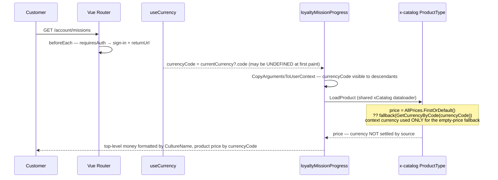

TEST MODEL — VCST-5346 (Loyalty Missions — L6 display link, re-test of build `80d1e3b9`)
Ticket: VCST-5346 (Story under Epic VCST-5320; sibling VCST-5319 backend) | Type: Story | Status role: testable | Flow: feature-test | Priority: Medium (surface carries P0-revenue invariants) | Path: FULL | Changed: Frontend
Context: `ba-system-analyzer` @ vc-frontend `80d1e3b9` + vc-module-loyalty PR#14 `da8abc6b` (both read at the DEPLOYED SHAs) + `ba-story-writer` Mode B
Supersedes: `VCST-5346-2026-08-28.md` — that model's Part 0 (7-link chain, 4 goal variants, accrual fault model, fixture/measurement hazards) is **unchanged and still authoritative for L1–L5**. This model re-derives only what the new build moved: **L6, the surface the customer reads.** Scenarios #1–#14 there are not restated; this file numbers from #15.
Affected surface: `vc-frontend` PR #2396 `client-app/modules/loyalty/{index.ts, api/graphql/queries/getLoyaltyMissionProgress/*, api/graphql/types.ts}` + `client-app/core/api/graphql/types.ts`; consumers `sku-mission-modal.vue`, `order-mission-modal.vue`, `mission-card.vue`, `useMissions.ts`, `useMissionCard.ts`, `pages/missions.vue`
Ticket signals: comment 2026-08-27 pins the build pair (Loyalty `3.1006.0-pr-14`, vc-frontend PR #2396). Attachment `Virto Rewards Missions (standalone).html` (864 KB) + Claude Design project `e3742011-…` are the **acceptance oracle in practice** — of 16 sub-tasks filed by the 2026-08-27 run, **10 were Cancelled**, and the cancelled set is exactly where the ticket's literal AC text and the design disagree. 5 remain To do (5822, 5824, 5826, 5831, 5832); 2 are Done (5842 backend, 5843 frontend).
Epic context: VCST-5320 (Draft). VCST-5319 (backend accrual) ran 2026-09-01, verdict FAIL — its output is this story's input, so an L1–L5 defect surfaces here as wrong data, not as a frontend bug. Attribute before filing.
Domains: Loyalty, Cart, Checkout, Orders, Auth/routing, i18n, a11y
Flows & boundaries: missions ↔ session currency (new) · missions ↔ router auth guard (new) · missions ↔ nav menu schema (new, one-shot at bootstrap) · missions ↔ points-history · missions ↔ PDP price
Risk areas: `vc-bug-catalog.md` names no `VC-*` for Loyalty Missions (feature postdates the catalog) — N/A. Live risk is the **two generated type files now out of sync on one schema** (`StoreAssetUrl: any` landed in the loyalty codegen artifact, not the core one), which silently removed `imgSrc` type-checking.
AC traceability: 25 atomic conditions (3 story ACs → 12; 13 gap-ACs). **AC-1 (notification) = NOT-FOUND at both layers** — operator decision on this run: test AC-2/AC-3, record AC-1 as unimplemented and route it to the PO with design frames F4/F5/F8 as its spec. Not a FAIL of this run's scope.
DoD: none declared on the ticket (1d proposed a minimum set; carried as advisory only).

--- Part 0 — VALUE CHAIN (L6 expanded; L1–L5, L7 unchanged from 2026-08-28) ---

Value chain — the same 7 links; this build moves only L6, so L6 is split into the four reads it actually performs:
  L1–L5. order → `OrderChangedEvent` → eligibility (Hangfire) → progress write (dedup + currency gate) → reward granted at most once  *(unchanged)*
  **L6a. Route reached** — the customer can arrive at `/account/missions` at all: route registered, auth guard redirects an anonymous visitor with a `returnUrl`, nav link present.
  **L6b. Payload survives** — the GraphQL response is turned into cards. A partially-successful payload must not be discarded.
  **L6c. Money reads true** — every money field on card and modal is in the session currency and agrees with the same SKU's PDP.
  **L6d. Meaning reads true** — name/description/goal/reward/days-left/progress and the SKU "targets met" counter say what the customer's actual state is.
  L7. points spendable — same ledger  *(unchanged)*

```mermaid
flowchart LR
  A[anonymous /account/missions] -->|meta.requiresAuth inherited<br/>from Account parent| G{router beforeEach}
  G -->|redirect| S[/sign-in?returnUrl=…/]
  S --> L6a[L6a: route reached]
  L6a --> Q[loyaltyMissionProgress<br/>+ currencyCode]
  Q --> L6b{errors[] non-empty?}
  L6b -->|Apollo errorPolicy 'none'<br/>DATA DISCARDED| E[whole-page error view]
  L6b -->|clean| L6c[L6c: money reads true<br/>card + modal vs PDP]
  L6c --> L6d[L6d: meaning reads true]
  L6d --> L7[L7: spend the points]
```



Variants (L6 axis — different code paths through the same display link, so matrix ROWS):
- **Card** — `mission-card.vue`; money via `useMissionCard`/`presentOrderValue`.
- **Order-value modal** — `order-mission-modal.vue`; renders the target the card omits.
- **SKU modal** — `sku-mission-modal.vue`; the only surface with per-product prices, a stepper and a client-computed `cartSubtotal`.
- **Points-history page** — `points-history.vue`; governed by no AC, and **BL-LOY-015 is VIOLATED backend-side** (ledger rows carry no mission attribution), so it structurally cannot answer "which mission paid this".

Mechanism coverage matrix (variant × L6 sub-link; # = scenario below):

| Variant | L6a route | L6b payload | L6c money | L6d meaning |
|---|---|---|---|---|
| Card | #15, #19 | #17 | #16, #18 | #20, #22 |
| Order-value modal | #15 | #17 | #18 | #20 |
| SKU modal | #15 | #17 | **#16**, #21 | #22 |
| Points-history | #15, #19 | WAIVED — same `graphqlClient` defaults as #17, one policy, one proof | GAP — no case reads a points-history row's currency; named, not authored (no AC governs the page) | #23 |

Reverse edges (per forward effect on money/points):
- **L6c → (a wrong price is corrected on currency switch)**: covered by #16's control pair — switching the session currency must move BOTH the modal row price and the PDP price together, or the arg changed nothing.
- **L6b → (the error view is recoverable)**: covered by #17 — "Try again" must repaint from a payload that carries data, not merely re-throw.
- **L5 → (undo)**: **ABSENT IN PRODUCT** — unchanged from 2026-08-28, now ratified as **BL-LOY-019 VIOLATED**. Not re-tested here (backend link, owned by VCST-5319); recorded so its absence is not read as coverage.

Fixture lifecycle: the `MSN_E2E_*` set is **terminal-once-completed and was found consumed at pre-flight** — recorded `InProgress 0%` at its 2026-09-01T21:10Z seed, live-read `Completed 100% (234/…)` on all five ORDERVALUE missions before this run. Re-minted, then re-minted again when the dual-currency fixture landed; the handle in force is **`20260902085919-b156`** (`td:validate:missions-e2e` green). The second re-seed was forced, not cosmetic: re-seeding inside the 6 h sweep floor left the previous generation's missions alive, so `MSN_E2E_ORDERCOUNT` and `MSN_E2E_ORDERVALUE_008` collided with their own predecessors on one order and made the balance deltas unattributable — the exact hazard the 2026-08-28 model records under *an aggregate is not an oracle for one entity's contribution*. A `--max-age-hours 0` sweep cleared 22 stale missions and 16 stale accounts first. Any case that must observe an ADVANCE binds to this run's handle and self-diagnoses `BLOCKED:PRECONDITION_UNMET` if it finds its mission already `Completed`.

--- Parts 1–5 — FAULT MODEL (L6) ---

Condition space: surface (4: card / order modal / SKU modal / points-history) × auth state (3: anonymous deep-link / signed-in-this-session / signed-in-after-reload) × session currency (3: store default USD / switched EUR / unresolved-at-first-paint) × culture (2: en-US / de-DE) × payload health (3: clean / partial-with-nested-errors / total failure) × goal variant (4: OVG/OCG/PSA/PSN) × viewport (2: 1920 / 375) → raw = 4×3×3×2×3×4×2 = **1,728**.

Reduction: 1,728 → **9 scenarios**. Dropped/subsumed: (a) **goal variant × L6 collapses to 1** — one render path serves whichever card the API returns, so variant matters at L6 only where the SKU modal exists (kept in #16/#21/#22), not per-goal; (b) **viewport collapses out** — 375 px is already covered by the open VCST-5831 and by 083c's existing responsive guards, not re-derived here; (c) **culture × currency does NOT collapse** — `AfterMediatorSend` formats top-level money by `CultureName` while product price resolves off `currencyCode`, so the mismatched cell is the whole point of #18 and is kept; (d) **payload health × surface collapses to one proof** — `errorPolicy` lives on the single shared `graphqlClient`, so #17 settles it for every loyalty query; (e) **auth state × surface collapses to the route pair** — the guard is global `beforeEach`, so #15 proves it once and #19 covers only the menu asymmetry the fix introduced.

Test scenarios:

| # | Cell | Defect hypothesis — what breaks, and why it plausibly would | Archetype | Technique | Oracle | P |
|---|---|---|---|---|---|---|
| 15 | any surface, anonymous deep-link, clean payload | **[JOURNEY]** A customer who is sent a mission link while logged out must land on the mission after signing in. If the route is registered but the guard or `returnUrl` is wrong, they sign in and land somewhere else — the whole share/deep-link path is dead while every page-level check passes. Traverses L6a→L6b→L6c→L6d on the customer's own surface | SILENT | FLOW | {BL} BL-GQL-004(c) + source `router/index.ts:26-42`, `common/index.ts:23-37` | Critical |
| 16 | SKU modal, currency switched EUR, clean payload | Product prices in the modal disagree with the same SKU's PDP. `currencyCode` reaches the resolver context but `x-catalog ProductType.cs:316` consumes it **only for the empty-price fallback** — the rendered price is `AllPrices.FirstOrDefault()`, so the fix may be inert. **The demanded positive control now EXISTS** (seeded 2026-09-02 after a Step-3 gate REJECT): `MSN_E2E_PRODUCT_A` is dual-priced `10 USD / 34 EUR` and `MSN_E2E_PRODUCT_B` stays single-priced as the in-modal control, both already goal items of `MSN_E2E_PERSKU`. The amounts differ deliberately — every currency here is registered at `exchangeRate: 1`, so one reading pair separates correct selection (`10`/`34`), 1:1 conversion (`10`/`10`) and `FirstOrDefault()` (the same row twice). Before this fixture the case could not fail on its own hypothesis | MONEY | EG | {BL} BL-PRICE-005 + BL-LOY-002 | Critical |
| 17 | any surface, payload partial (nested `items[].product` errors) | 12 fully-populated missions are discarded and the customer sees only "we couldn't load your missions". `graphqlClient.defaultOptions` sets `fetchPolicy` on all three ops and **no `errorPolicy`**, so Apollo's default `"none"` throws and drops `data`; `missions.vue`'s `catch` paints the whole-page error view. VCST-5843 is marked Done but the fix is **not on this branch** | SILENT | EG | {DOC} source `core/api/graphql/client.ts:17-21`, `useMissions.ts:24-38`, `missions.vue loadData()` | Critical |
| 18 | card + order modal, culture en-US × currency EUR | Two money fields in one card disagree because they are formatted through different inputs — `AfterMediatorSend` keys on `CultureName`, product price on `currencyCode`. A customer sees a goal in one currency and their progress toward it in another | MONEY | DT | {BL} BL-PRICE-005; would become {SPEC} if the design declared a currency-formatting contract — it does not | High |
| 19 | card, signed in during the session (no reload) | Deep link works but the Missions / Points-history **nav links are absent** until a full reload. `initLoyalty` runs once at bootstrap (`app-runner.ts:266`) and `mergeMenuSchema` stayed behind the one-shot `isAuthenticated` check that `80d1e3b9` lifted off the routes only — an inconsistency **created by the fix** | CONFIG | ST | {DOC} source `modules/loyalty/index.ts` diff + `app-runner.ts:266` | High |
| 20 | card + order modal, clean payload, OVG | The card states spend-so-far but never the target, so AC-2's "I must see the goal" is unmet on the surface the customer looks at first. **Design F1/F2 puts the target in the modal**, so this is a spec conflict, not a defect — report as UNSPEC-advisory unless the PO says the ticket text governs | RENDER | EP | {SPEC} design F1/F2 — contradicts the ticket's AC-2 text; escalate, never obey one silently | Medium |
| 21 | SKU modal, mixed-currency row set, clean payload | `cartSubtotal` sums `row.price.actual.amount` across rows and labels the total with `itemsToAdd[0]`'s currency — the first non-zero row only. If #16 shows rows are not normalised, the subtotal is both wrong and mislabelled; if they are, this is unreachable. Conditional on #16, and must be reported as such | MONEY | BVA | {BL} BL-LOY-003 (per-currency totals, cart-level analogue) | High |
| 22 | card vs SKU modal, same mission, non-empty cart | Card and modal disagree on progress: the modal's "targets met" seeds from backend progress rather than the modal's own stepper quantities. Design F3 specifies "1 of 4" derived from the modal. Open as VCST-5824 — re-confirm on this build, do not re-file | RENDER | ST | {SPEC} design F3 + VCST-5824 | Medium |
| 23 | points-history, clean payload | A row cannot name the mission that granted it. **BL-LOY-015 is VIOLATED backend-side** — ledger rows carry no mission attribution — so the page cannot answer the one question it exists for. Assert and report; do not expect green, and do not file against the frontend | SILENT | EG | {BL} BL-LOY-015 (VIOLATED) | Medium |

Probes carried in: `vc-bug-catalog.md` names no `VC-*` entry for Loyalty Missions — **N/A**, and the reason is the feature's age, not an unchecked sweep.
Archetype sweep: MONEY ✓(#16,#18,#21) · SILENT ✓(#15,#17,#23) · CONFIG ✓(#19) · RENDER ✓(#20,#22) · BOUNDARY — WAIVED, L6 reads state it does not compute; the boundary cases (0-target, 0-reward, expired) live at L3/L4 and are covered by #3/#8 in the 2026-08-28 model · REPLAY — WAIVED, a re-read of a settled reward is L5 (#9 there) · LIFECYCLE — WAIVED, no L6 entity has a lifecycle of its own · RACE ✓(#16's first-paint arm — `currentCurrency` may be undefined at bootstrap, which reproduces the original defect with no code change) · PARITY ✓(#22, card vs modal is the sibling-surface divergence) · STALE ✓(#19, one-shot bootstrap read) · FALLBACK ✓(#18, `useCurrency` fallback chain).
UIP sweep: UIP-DEEP ✓(#15,#19) · UIP-NET ✓(#17) · UIP-REFRESH ✓(#19, reload is the workaround that reveals it) · UIP-DATA ✓(#16 currency switch) · UIP-VIEW — WAIVED, 375 px covered by open VCST-5831 + 083c's responsive guards · UIP-BACK, UIP-TABS, UIP-EXPIRE, UIP-STORAGE, UIP-INPUT — **GAP**, named not authored; 083c already carries `MSNF-UIP-EXPIRE-001` and `MSNF-UIP-STORAGE-001` as Draft, so the gap is narrower than in the previous model but real.
Business Rules: **BL-LOY-015…019 were ratified since the previous model** — its five `PROPOSED-BL-LOY` items are now real invariants, so scenarios that cited `{HYPOTHESIS}` now cite `{BL}`. In scope here: BL-LOY-015 (VIOLATED, #23), BL-LOY-002, BL-LOY-003, BL-PRICE-005, BL-GQL-004, BL-A11Y-002/003, BL-UI-004/006. Still true: **zero DISPLAY-layer mission invariants exist** — which is exactly why #20's card-vs-modal dispute has no tiebreaker and must escalate rather than resolve.
Edge cases: ECL-13.3 (Loyalty & Points) · ECL-14.7 (background-job timing — the fabricated-0% read) · ECL-14.8 (module/schema drift — the two out-of-sync generated type files) · ECL-15.1 (screen-reader interaction, #22's modal).
Docs grounding: no VirtoOZ documentation exists for Missions — confirmed absent, so `{DOC}` here always means source, never product docs.
Agents to dispatch: `qa-frontend-expert` (083c/083d, playwright-chrome) · `qa-backend-expert` (075d, playwright-edge) · `test-data-engineer` (done — fixtures re-minted at pre-flight).
