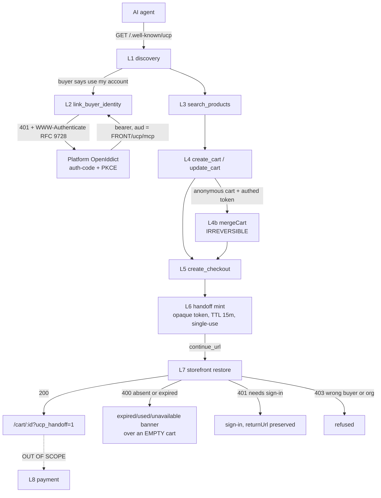
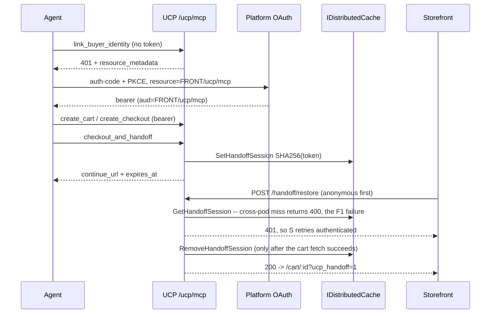
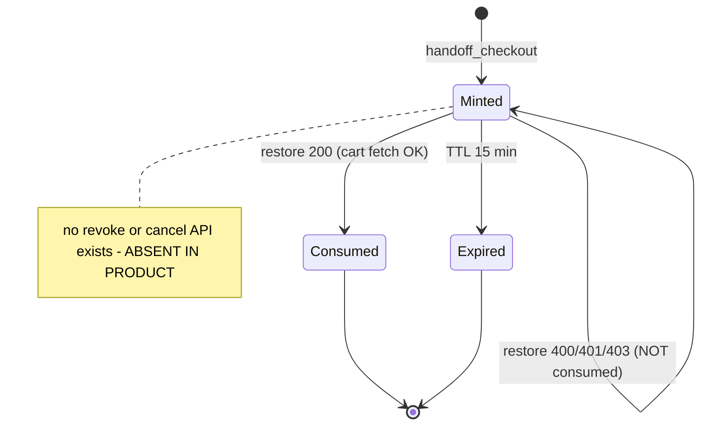

TEST MODEL — VCST-5378
Ticket:      VCST-5378 | Type: Story | Status role: testable | Flow: feature-test | Priority: P1 (High) | Path: FULL | Changed: Both (Platform + UCP module + storefront)
Context:     FULL — ba-system-analyzer (1c, PR-diff reconciliation) + ba-story-writer (1d, Mode B)
Prior model: none — first model for this surface. Part 0 below is derived fresh from the domain map's chain.
Domain map:  .claude/knowledge/domain/ucp.md @ rev 1 (generated 2026-09-17, amended 2026-09-17) — STALE
             relative to the deployed heads; never auto-refreshed. Amendments routed to 5-docs-map.
Chain position: L1-L7 of the domain chain L1-L9. TOUCHES L1 discovery, L2 identity linking, L3 search,
             L4 cart, L4b anon->auth merge, L5 checkout prepare, L6 handoff mint, L7 storefront restore.
             DOES NOT TOUCH L8 payment (UCP owns nothing there; the QA Steps stop before payment) or
             L9 track_order (no tool change this round; no AC names it).
Affected surface: vc-module-ucp #7 @612c78b (30 files, +1490/-296) · vc-platform #3108 @b6ef79b (17 files)
             · vc-frontend #2467 @195127f5 (26 files). All three OPEN and UNMERGED, all on branch
             feat/VCST-5378-unified-buyer-flow. Every surface resolves to a domain-map entry (§2a/2b/2c);
             one surface the map does NOT enumerate: the storefront route /oauth/authorize (new in #2467;
             the map names it under D11 but gives it no §2b row) -> MISSING, clause 11b.
Ticket signals (from 1a comments + attachments):
  - Dev "Implementation architecture" comment: one MCP resource at /ucp/mcp, no buyer_mode, identity only
    from the validated Platform ClaimsPrincipal, merge delegated to XCart mergeCart, restore single-use
    and serialised through the Platform distributed-lock abstraction.
  - Dev "QA Steps - Claude" + "QA Steps - ChatGPT" comments are the de-facto ACs (no AC field exists).
  - QA findings F1-F6 (2026-09-17), dev fix round (2026-09-21), QA re-test (2026-09-22 11:09) which
    reported F2 NOT FIXED. THAT RE-TEST IS SUPERSEDED: it measured UCP pr-7-9bc9; the env now runs
    pr-7-612c and F2 does not reproduce (this run, 5 independent probes, both hosts).
  - Attachments opened: ucp-f1-02-expired-banner.png, ucp-f1-banner-2x.png, ucp-f1-context-1x.png,
    ucp-f1-handoff-failure.gif (F1 buyer-facing evidence). 20260917-1030-52.6353176.mp4 (17.8 MB)
    NOT opened — stated gap, not a silent skip.
Epic context: parent Epic VCST-5201 "Universal Commerce Protocol (UCP)", status Draft. Sibling
             VCST-5126 "UCP - MVP" is Done (this story clones it) = the integration seam this story
             builds on. No in-progress sibling blocks this story.
Domains:     Agentic Commerce/UCP (BL-UCP, declared EMPTY), Cart, Checkout, B2B organizations, Auth/OAuth
Flows & boundaries: MCP <-> XCatalog · MCP <-> XCart (incl. mergeCart) · UCP <-> Platform OpenIddict ·
             UCP <-> IDistributedCache/IDistributedLockService · UCP -> storefront restore -> storefront cart
Risk areas:  cross-pod cache partitioning (D3/F1) · dual origin resolution chains (D2/F2) · identity
             spoofing across the handoff (F4) · unhandled argument errors to an LLM caller (F5)
AC traceability: 16 atomic conditions C1-C16 (1d). Impl verdicts: 9 SATISFIED · 1 DRIFT (wording) ·
             2 NOT-FOUND · 3 UNVERIFIABLE (fixture gap) · 1 CONTRADICTS-as-worded.
DoD: 12 items (1d). All marked confirm-at-5-verdict; the story declares no DoD field of its own.

--- Part 0 — VALUE CHAIN (derived FIRST) ---
Value chain:
  L1 An AI agent discovers this store can be shopped -> GET /.well-known/ucp + get_store_capabilities
     -> persisted: nothing -> visible: the agent's tool list -> unlocks every later link.
  L2 The buyer says "use my account" -> link_buyer_identity -> 401 RFC 9728 challenge -> Platform OAuth
     -> persisted: an MCP session bound to buyer+org -> visible: the agent names the buyer
     -> unlocks L4b and org pricing.
  L3 The agent finds a product -> search_products/get_product -> XCatalog -> persisted: nothing
     -> visible: SKU, price, stock -> unlocks L4.
  L4 The agent builds a cart -> create_cart/update_cart -> XCart -> persisted: a real Cart row
     -> visible: line items and totals -> unlocks L5.
  L4b An anonymous cart becomes the signed-in buyer's cart -> update_cart carrying the anonymous buyer_id
     under an authed token -> XCart mergeCart (deleteAfterMerge) -> persisted: one merged cart, source
     destroyed -> visible: the buyer's cart holds the agent's items -> unlocks L5 as the buyer. IRREVERSIBLE.
  L5 The agent prepares checkout -> create_checkout/update_checkout, snapshot composed IN UCP
     -> persisted: a checkout snapshot, checkout.id == cart_id -> visible: totals, status -> unlocks L6.
  L6 The agent hands the buyer a link -> handoff_checkout/checkout_and_handoff -> 256-bit opaque
     ucp_session in IDistributedCache under SHA-256(token) -> persisted: a cache entry, TTL 15 min,
     single-use -> visible: continue_url + expires_at -> unlocks L7.
  L7 The buyer opens the link -> storefront guard parks the token in sessionStorage, POSTs
     /ucp/v1/internal/handoff/restore -> persisted: the buyer's session now owns the cart
     -> visible: /cart/{cartId}?ucp_handoff=1 with the right lines -> unlocks L8 (out of scope).

Chain diagrams:

Variants (ROLE kinds — the branching layer is UcpBuyerContextAccessor, which forks three ways):
  V1 Anonymous agent (no token; synthetic ucp-anonymous-<32hex> buyer)
  V2 Authenticated B2C buyer (Platform token, no organization claim)
  V3 Authenticated B2B org buyer (Platform token + organization claim)

Mechanism coverage matrix (rows = variants, columns = chain links; axes derived from Part 0):
  |    | L1 | L2 | L3 | L4 | L4b | L5 | L6 | L7 |
  | V1 | 1  | 2  | 5  | 6  | WAIVED — L4b is anon->auth by definition; V1 has no target identity | 9 | 10 | 11 |
  | V2 | 1  | 3  | 5  | 7  | 13  | 9  | 10 | 14 |
  | V3 | 0,1 | 0,4 | 0,15 | 0,8 | 13 | 0,16 | 0,10 | 0,17 |
  Scenario 0 is the end-to-end journey and therefore touches every V3 column; the per-link rows refine it.
  Negative/boundary cells live in scenarios 12 and 18-22 and attribute to the L6/L7 columns above.

Reverse edges:
  ucp_session minted -> TTL 15 min AND single-use (removed only after a SUCCESSFUL restore) -> covered by 19, 20
  ucp_session minted -> explicit revoke/cancel -> ABSENT IN PRODUCT (a finding, carried from domain map §1)
  anonymous cart merged into buyer cart -> NO reversal; deleteAfterMerge destroys the source -> covered by 13
  cart/order created via UCP -> ordinary Cart module lifecycle, UCP adds nothing -> WAIVED: not UCP behaviour

Fixture lifecycle: a ucp_session is TERMINAL once restored — every restore scenario needs its OWN freshly
  minted token, never a shared one. A merged anonymous cart is TERMINAL (source destroyed) — scenario 13
  needs a per-run anonymous cart. Per .claude/rules/test-data.md DISPOSABLE FIXTURES rules 1-4.

--- Part 0r — ROLE SCENARIOS (required: 3 role variants) ---
Roles in scope:
  V1 Anonymous agent -> no fixture needed (synthetic id minted per cart)
  V2 Authenticated B2C buyer -> FIXTURE-GAP: no B2C-store fixture account is registered in
     test-data/aliases.json for UCP. Routed to 3a. Every prior pass used the B2B account only.
  V3 Authenticated B2B org buyer -> @td(ACME_ADMIN.email) = test-john.mitchell-20260310@test-agent.com,
     org @td(ORG_ACME.platform_id) = AGENT-TEST-Org-AcmeCorp. Second buyer for cross-account:
     @td(ACME_BUYER.email) = test-sarah.chen-20260310@test-agent.com.
     Contract-pricing sub-fixture -> FIXTURE-GAP: domain map §7 records 0 of 99 price-list assignments
     conditioning on this org's groups, so org price == list price and scenarios 15/16 are UNDECIDABLE on
     this data (.claude/rules/test-data.md SECOND RULE — equal values on both sides of the distinction
     under test are a data defect, not a neutral choice).

BSC-1 — "I want the agent to shop for me under my company's account"
  Role: V3 B2B org buyer · Situation: buyer asks Claude to build a cart on the org's behalf, then pays himself.
  | # | Action | Sees | Can do | Expected |
  | 1 | asks the agent to use his account | an OAuth sign-in prompt | complete Platform sign-in | link_buyer_identity 200, buyer_id = Platform user id, organization_id = AcmeCorp |
  | 2 | asks for a product | SKUs, prices, stock | pick one | prices are the org's, not anonymous list |
  | 3 | asks to prepare checkout | totals + a continue_url | open the link | restore lands on his own cart, org context intact |
  Outcome: the buyer pays in the storefront on a cart the agent built, as himself, under his org.
  Not allowed: another buyer restoring this handoff (403, asserted at the SERVER with that buyer's own
    token, not merely as an absent button) · an anonymous restore carrying an organization_id (403) ·
    X-Buyer-* headers overriding the token identity (403) · a tool argument overriding buyer or org (403).

BSC-2 — "I started anonymously, then signed in"
  Role: V1 -> V2/V3 · Situation: the agent built a cart before the buyer authenticated.
  | # | Action | Sees | Can do | Expected |
  | 1 | agent builds an anonymous cart | ucp-anonymous-<32hex> buyer id | keep shopping | cart exists, unowned |
  | 2 | buyer signs in, agent replays the anonymous buyer_id | one cart | continue | mergeCart runs; items carried at the same total; source cart consumed, no orphan |
  Outcome: one cart, owned by the buyer, holding what the agent assembled.
  Not allowed: replaying ANOTHER buyer's anonymous id to take their cart (403) · the merge running twice
    and duplicating lines (must be an idempotent no-op).

--- Parts 1–5 — FAULT MODEL ---
Condition space:
  F1 identity            : anonymous | B2C authed | B2B org authed                            (3)
  F2 discovery entry host: storefront origin | platform origin                                (2)
  F3 restore actor       : same buyer | different buyer | anonymous-on-authed | authed-on-anon (4)
  F4 session state       : fresh | already-consumed | TTL-expired | forged/unknown             (4)
  F5 argument validity   : complete | missing required field | unknown store_id                (3)
  F6 cart content        : single line | line went out of stock after mint                     (2)
  Constraints: F3 != same-buyer is infeasible with F1=anonymous on the org branch; F4=already-consumed
  requires a prior successful restore; F4=TTL-expired requires a >=16 min wait on a fresh token.
  Raw cells N = 3*2*4*4*3*2 = 576.
Reduction: FLOW first (one end-to-end journey per identity variant, non-negotiable), then EP on F1/F3/F4
  as the story's own subject, pairwise across F2/F5/F6, and error-guessing seeded from F1-F6.
  DROPPED: F6 multi-line (subsumed by single line for the handoff mechanism — line count is XCart's
  concern, already covered by BL-CART-*); the F2 x F5 interaction (host never reaches argument
  validation); F4=forged x F1 (the token is opaque and carries no identity, so forging is
  identity-independent). N 576 -> M 22.

Test scenarios (23 rows — row 0 is the journey; 1-22 refine it)
| # | Cell (factor values) | Defect hypothesis | Archetype | Technique | Oracle | P |
|---|---|---|---|---|---|---|
| 0 | F1=B2B org authed, F2=storefront, F3=same buyer, F4=fresh, F5=complete, F6=single line — the WHOLE chain L1->L7 in one pass | the links each work and the feature still does not: the buyer is discovered, linked, shopped, checked out and handed off, but arrives at a storefront cart that is empty, is not his, or is not his organization's. This is the only row that can fail when every other row passes | journey | FLOW | {OBSERVED} one continuous run: discovery -> link_buyer_identity 200 -> search -> create_cart -> checkout_and_handoff -> open continue_url -> /cart/{id}?ucp_handoff=1 carrying the same line items, totals and org as the agent assembled | P0 |
| 1 | F2=both hosts, L1 | discovery answers from request origin, so one host advertises a flow it cannot serve (F2/D2) | config-drift | FLOW | {OBSERVED} both hosts agree on resource, AS, storefront_origin, handoff_url_template | P1 |
| 2 | F1=anon, L2 | the anonymous path demands a token it does not need | wrong-gate | EP | {SPEC} architecture comment: no token means anonymous | P1 |
| 3 | F1=B2C, L2 | the 401 challenge points at metadata that cannot mint a usable token | broken-chain | FLOW | {OBSERVED} link_buyer_identity 200, buyer_id = Platform user id, no org invented | P1 |
| 4 | F1=B2B, L2 | the org claim is not carried from the token into the MCP session | missing-propagation | FLOW | {SPEC} identity only from ClaimsPrincipal | P1 |
| 5 | F1=anon or B2C, L3 | search returns nothing on this catalog (term live-discovered, never hardcoded) | env-drift | EP | {OBSERVED} at least one buyable SKU | P2 |
| 6 | F1=anon, L4 | the anonymous buyer id is not the documented shape | contract | BVA | {SPEC} ucp-anonymous-<32 hex> | P2 |
| 7 | F1=B2C, L4 | the cart is not attributed to the Platform user | wrong-owner | FLOW | {SPEC} buyer_id equals the Platform user id | P1 |
| 8 | F1=B2B, L4 | the cart is attributed to the user but not the org | wrong-owner | FLOW | {SPEC} organization_id equals the token org | P1 |
| 9 | F1=any, L5 | the checkout snapshot totals disagree with the cart | data-integrity | FLOW | delegated BL-CART-* | P2 |
| 10 | F1=any, L6 | the continue_url host disagrees with the advertised handoff_url_template (D2) | config-drift | FLOW | {OBSERVED} advertised equals issued | P1 |
| 11 | F1=anon, F3=same, F4=fresh, L7 | a fresh link fails on first attempt (F1 cross-pod cache miss) | infra-partition | FLOW | {OBSERVED} first-attempt success over at least 10 fresh links | P0 |
| 12 | F1=anon, F4=fresh, L7, guest checkout disabled | the anonymous restore silently drops the handoff instead of preserving it through sign-in | lost-continuation | EG | {SPEC} returnUrl preserved | P2 |
| 13 | F1=anon->B2B, L4b | the merge duplicates lines, changes the total, or orphans the source cart | irreversible-op | FLOW | {SPEC} mergeCart deleteAfterMerge, same total | P1 |
| 14 | F1=B2C, F3=same, F4=fresh, L7 | the authenticated restore needs TWO cache hits (anon attempt plus authed retry), so it fails worse than anonymous | infra-partition | FLOW | {OBSERVED} first-attempt success over at least 5 fresh links | P0 |
| 15 | F1=B2B, L3 | the assortment is not scoped to the org | missing-scope | EP | UNDECIDABLE on current data — FIXTURE-GAP | P1 |
| 16 | F1=B2B, L5 | the contract price is not applied; org price equals list price | missing-scope | DT | UNDECIDABLE on current data — FIXTURE-GAP | P1 |
| 17 | F1=B2B, F3=same, F4=fresh, L7 | org context is lost across the handoff (G2) | missing-propagation | FLOW | {OBSERVED} the storefront resumes in org context | P1 |
| 18 | F3=different buyer, F4=fresh, L7 | another buyer restores this handoff (F4 was 200; expected 403) | authz | EG | {SPEC} 403 buyer_context_mismatch | P1 |
| 19 | F3=same, F4=already-consumed, L7 | a restored link replays and reopens the cart | single-use | ST | {SPEC} single-use; 400 on replay | P1 |
| 20 | F3=same, F4=TTL-expired, L7 | expiry is indistinguishable from a cache miss — same 400, same message (G4) | observability | BVA | {SPEC} TTL 15 min; cause distinguishable | P2 |
| 21 | F3=same, F4=forged/unknown, L7 | a forged token is trusted, or the error reveals internals | tamper | EG | {SPEC} unknown token gives 400, no cart exposed | P1 |
| 22 | F5=missing required or unknown store | an LLM caller gets an unhandled error with only a trace id (F5) | error-contract | EG | {OBSERVED} structured invalid_request naming the field | P2 |

Probes carried in: no vc-bug-catalog VC-* entry targets UCP or MCP (0 hits) -> N/A — and that absence is
  itself G5's point. The F1-F6 findings from the 2026-09-17 pass serve the same role and are carried in as
  scenarios 1, 10, 11, 14, 18, 22.
Archetype sweep: wrong-gate 2 · wrong-owner 7,8 · missing-propagation 4,17 · missing-scope 15,16 ·
  config-drift 1,10 · infra-partition 11,14 · single-use 19 · tamper 21 · authz 18 · error-contract 22 ·
  irreversible-op 13 · lost-continuation 12 · data-integrity 9 · observability 20 · contract 6 · env-drift 5.
  WAIVED: concurrency-race — G7 needs a parallel-request harness this run does not build. Stated, not silent.
UIP sweep (UI only — the L7 storefront surface): BACK 12 · DEEP 11,14 (a continue_url IS a deep link) ·
  REFRESH 19 (re-opening a consumed link) · TABS WAIVED (the token is tab-local in sessionStorage by
  design — domain map §2b; the buyer-facing copy already says "unavailable in this tab") · EXPIRE 20 ·
  STORAGE 12 · NET WAIVED (no offline requirement declared) · INPUT 22 · VIEW WAIVED (no responsive
  requirement in scope) · DATA 17.
Business Rules: NONE EXIST FOR THIS DOMAIN. BL-UCP (business-logic.md Domain 25) is declared and
  deliberately EMPTY. Judged against delegated BL-CART-* (XCart), BL-CHK-* (the checkout the buyer lands
  in), BL-B2B-* (org scoping) and BL-AUTH-* (the Platform token) — none of which knows the handoff exists.
  Three promotion candidates surfaced at 1d (PROPOSED-BL-UCP-001 single-use; -002 organization_id only
  from the token; -003 anonymous-plus-org gives 403) are proposals only; promotion is /qa-review-oracles'
  three-source bar, not this run's.
Edge cases: no ECL section mentions UCP or MCP (domain map §4). ECL-* inherited by delegation only.
Docs grounding: NONE. VirtoOZ carries no UCP page (domain map D8, queried first-hand 2026-09-17); the
  sibling onX adapter IS documented and must not be mistaken for this. Every oracle above is therefore
  {SPEC} (repo README / PR / architecture comment) or {OBSERVED}, never {DOC}.
Agents to dispatch: qa-backend-expert (MCP wire + Admin, playwright-chrome) · qa-frontend-expert
  (storefront restore + banner, playwright-edge) · ui-ux-expert (visual lane, Chrome DevTools MCP)
