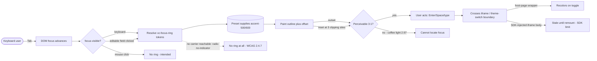
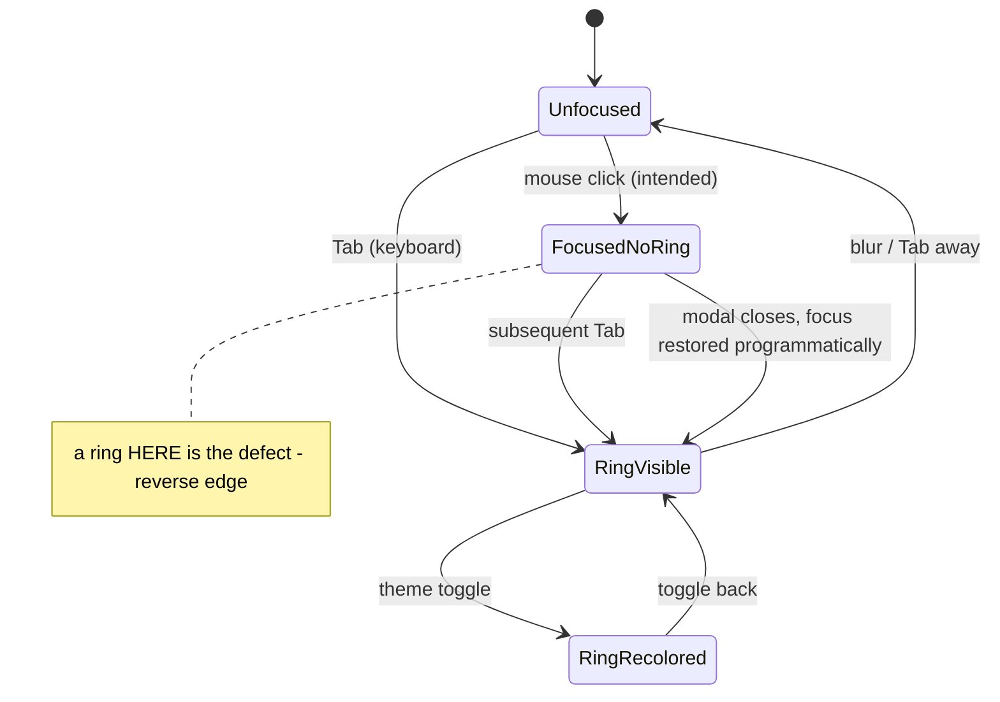

TEST MODEL — VCST-5653

Ticket:      VCST-5653 | Type: Story | Status role: testable | Flow: feature-test | Priority: P2 (Medium — raise-to-High argued 2026-08-28, never actioned) | Path: FULL | Changed: Frontend (storefront theme + UI kit)
Context:     FULL — ba-system-analyzer (1c), ba-story-writer review (1d), reachability probe (1r)
Prior model: none for THIS surface — first model for the design-system / focus-indicator surface.
             `VCST-5346-2026-08-28.md` / `-09-02.md` are Loyalty Missions (zero focus/contrast matches);
             the real predecessor is the VCST-5346 **design report** finding **N3** (recovered from git),
             which root-caused the pre-fix ring at 1.63:1 to the token contract itself. Part 0 below is
             therefore newly derived, not carried forward.
Domain map:  ABSENT — no `.claude/knowledge/domain/` file covers the design-system / UI-kit token layer.
             `/qa-domain-map design-system` recommended (not built here: the chain is single-layer, so
             `2g` did not trigger the FULL all-layer build).
Chain position: L1–L7 of L1–L7 — this ticket owns the WHOLE chain, because the change replaces the
             mechanism at every link. It does NOT touch: focus ORDER (2.4.3), focus TRAPPING (2.1.2),
             accessible NAME (4.1.2), or any non-focus contrast (1.4.3). Those stay BL-A11Y-001/-002/-004
             territory and are out of scope for this verdict.
Affected surface: `vc-frontend` @ PR #2468 (`8e45ee74`), 44 files / +193 −163, built as
             `vc-theme-b2b-vue-2.58.0-pr-2468-8e45-8e45ee74`, live on vcst-qa (deploy PR #6468, merged
             2026-09-10 14:10 +03). PR is **OPEN** — QA is testing a pre-merge branch.
             Token layer `_ui-kit-tokens.scss` · `_dark.scss` · `preflight.scss` · `_colors.scss` ·
             new mixin `ui-kit/styles/_focus-ring.scss` · new `ui-kit/utilities/css.ts` (`readCssVar`) ·
             12 mixin call sites · 12 deleted Tailwind `ring-*` utilities · 8 deleted dark partials ·
             payment (CyberSource / Datatrans / Skyflow) · sales-rep `layout-block.vue` ·
             `storybook-styles/preflight.scss` + `package.json`.
             Surfaces the (absent) map would have had to list: the UI-kit token layer, payment-iframe
             styling as a cross-cutting surface, and sales-rep keyboard-sort focus.
Ticket signals: **No ACs** — the AC field reads "1. No requirements."; the de-facto spec is the PR body +
             the two WCAG criteria in the title + BL-A11Y-001/-003. QA comment 2026-08-28 established the
             root cause (`--focus-color` = primary-500 @ 30% ⇒ 1.63:1) and argued P2→P1; priority unchanged.
             Attachment `vcst-5653-focus-zones.zip` **opened**: 42 PNGs = 7 presets × light/dark ×
             {header, footer, main}. Coffee-light footer shows a blue-grey ring on the `#3d2b24` field —
             the visual counterpart of the declared 2.97:1. Coffee-light main (ring on a product title
             over white) and header (ring on the search button) both read as clearly visible.
Epic context: none — no parent Epic. Related: VCST-5533 (Bug, Done) — the audit this was split from.
             VCST-5934 (Bug, Draft, opened 2026-09-10) is the SAME root cause measured on the OLD
             mechanism (`primary-500` @ 0.8 ⇒ 1.82:1, default preset, vcptcore Storybook); its own
             suggested fix is what this PR implements, and its "only 3 of 14 combinations measured"
             caveat is discharged by this model's 88-cell derivation. It is NOT the coffee-light follow-up.
Domains:     cross-cutting (a11y / design system), branding (presets), purchase-flow (payment + checkout
             address list), sales-rep
Flows & boundaries: runtime theme toggle ↔ payment iframe styling · white-labeling preset merge
             (`BL-WL-002`, per-field org override) ↔ ring colour · keyboard journey ↔ checkout
Risk areas:  `VC-UI-001` (only Coffee + Red are WCAG-gated) · VCST-5346 N3 (the predecessor) · N4
             (primary==danger collision, still open, NOT fixed here) · no VC-* entry exists for
             iframe theme-switch staleness — novel ground
AC traceability: 14 atomic conditions reconstructed by 1d as gap-ACs (the ticket supplies none).
             Impl verdicts: 5 SATISFIED-pending-live, 1 DRIFT (the PR's "0 contrast failures" vs its own
             2.97 note), 8 NOT-FOUND-against-the-ticket (real, intentional, ungoverned behaviour).
DoD: no DoD section on the ticket. 1d's derived list: Documentation **NOT DONE** (four public custom
             properties removed with no changelog/migration note anywhere but the diff); BA sign-off
             **NOT DONE** (no ACs to sign off on); cross-browser + review state + console-clean → confirm at 5b.

--- Part 0 — VALUE CHAIN (derived FIRST) ---

Value chain:
  L1 A sighted keyboard-only user presses Tab → the browser advances DOM focus to the next control.
  L2 CSS decides whether this focus counts as *visible*: `*:focus-visible` matches (keyboard), or does
     not (mouse) — the gate that makes the ring keyboard-only.
  L3 The mixin resolves the ring's values through the token chain:
     `--vc-focus-ring-color` → `var(--color-vc-focus-ring, var(--color-accent-500|600))`, where
     `accent-*` is supplied by the **platform-served preset**, not the app bundle.
  L4 The ring paints — `outline` + `outline-offset`, outset by default, offset inverted at the three
     clipping sites — without displacing a neighbour (outline is out-of-flow, so this holds by construction).
  L5 The ring is PERCEIVABLE: ≥3:1 against the adjacent surface, on a gated preset, in both modes.
  L6 The user, now able to see where focus is, presses Enter/Space/types → the keyboard journey
     completes (search → filter → PDP → cart → checkout → pay). This is the link that pays for the rest.
  L7 The same token crosses two boundaries it does not control: a third-party payment iframe, and a
     runtime theme switch.

Chain diagrams:

Variants (union across every layer that branches — token, component, processor, browser):
  V1 preset — **coffee, red = WCAG-GATED**; black-gold, default, mercury, purple-pink, watermelon = visual-only
  V2 mode — light, dark
  V3 focus origin — keyboard Tab · mouse click · programmatic focus-restore
  V4 geometry — outset (default) · inset (menu-item, scrollbar, product-image carousel button)
  V5 **carrier** (the discriminating axis — each is a different code path to the same ring):
     (a) element itself `@include focus-ring` · (b) native-sibling `input:focus-visible + &`
     (checkbox, radio-with-indicator) · (c) **global `preflight.scss` fallback ONLY** — button, chip and
     nav-button deleted their local rules and added none · (d) unconditional `[aria-pressed="true"]`
     (sales-rep layout-block, deliberately not focus-visible-gated) · (e) **no carrier reachable** —
     radio `no-indicator` rings a `display:none` span
  V6 input kind — editable (rings on click, browser carve-out) · readonly (must not)
  V7 payment injection — CyberSource host-page wrapper · Datatrans host wrapper + SDK `.focused` class ·
     Skyflow SDK config object read at mount
  V8 reduced motion — no-preference · reduce (gates the bundled VcButton pressed transition, not the ring)
  V9 tenant override — `color_vc_focus_ring` set · unset

Mechanism coverage matrix (rows = V5 carrier × V7 processor × V4 geometry; columns = chain links):

| Variant \ Link | L1 | L2 | L3 | L4 | L5 | L6 | L7 |
|---|---|---|---|---|---|---|---|
| (a) element `@include` | 1 | 3 | 5,6 | 12 | 5,6,7 | 1 | WAIVED — no boundary |
| (b) native-sibling | 10 | 10 | 10 | 12 | 10 | 10 | WAIVED — no boundary |
| (c) global fallback ONLY | 9 | 3 | 9 | 12 | 9 | 9 | WAIVED — no boundary |
| (d) `[aria-pressed]` uncond. | 21 | **21** | 21 | 21 | 21 | 21 | WAIVED — no boundary |
| (e) no carrier (radio) | 11 | 11 | **GAP — nothing to resolve** | 11 | **11** | 11 | WAIVED |
| inset geometry (×3 sites) | 8 | 8 | 8 | **8** | 8 | 8 | WAIVED |
| CyberSource | 13 | 13 | 13 | 13 | 13 | 13 | **13** |
| Datatrans | 14 | **14** | 14 | 14 | 14 | 14 | 14 |
| Skyflow | 15 | 15 | 15 | 15 | 15 | 15 | **15** |
| gated preset × mode (2×2) | 1,2 | 1,2 | 5,6,7 | 12 | **5,6,7,2** | 1,2 | 13 |
| ungated presets (5) | WAIVED — VC-UI-001: visual-diff only; an a11y failure there is known-unsupported, not a bug ||||||

Reverse edges (per forward effect):
  ring appears on keyboard focus → **mouse click must NOT ring** → covered by #3
  ring on editable click (intended) → **readonly must NOT ring** → covered by #4
  ring painted → **theme toggle must re-resolve it** (both directions) → covered by #13
  focus moved programmatically → **does the restored focus ring?** → covered by #16
  four public tokens removed → **a fork/tenant that overrode one gets nothing** → covered by #17;
    the platform behaviour is a declared breaking change, so the *finding* is a missing release note,
    not a product bug
  ring resolved from preset → **a preset lacking an accent ramp ⇒ `outline` with no colour ⇒ currentColor**
    → covered by #17 (derived: all 7 shipped presets DO define `color_accent_500/600`, so this is
    reachable only via a malformed tenant preset)

Fixture lifecycle: nothing here is terminal — focus state is transient and re-observable, so no per-run
  fixture is needed. The one durable side effect is **the store's active theme preset**, which is shared
  mutable config on vcst-qa: the Coffee window must be opened and closed inside one serialized phase
  (scenarios #5–#7), never concurrently with the Red-preset scenarios, or both sets observe the wrong preset.

--- Parts 1–5 — FAULT MODEL ---

Condition space: V1 gated preset (2) × V2 mode (2) × V3 origin (3) × V4 geometry (2) × V5 carrier (5) ×
  V6 input kind (2) × V7 processor (3) × V8 motion (2) × V9 override (2) = 2880 raw cells.
  Constraints: V6 applies only to carriers (a)/(b); V7 only at L7; V8 touches no ring; V9 is a single
  substitution at L3 that cannot interact with V4/V5/V6.

Reduction: **carrier-first, then exhaustive on preset × mode.** V5 is the only axis where each value is a
  distinct code path, so all 5 carriers are mandatory rows and none collapses into another. V1×V2 is
  covered exhaustively (4 cells) because it is cheap and it is the ticket's subject. V3 folds in as the
  reverse-edge scenarios rather than multiplying through. V4 is one dedicated scenario over 3 sites.
  V7 cannot collapse — three different injection mechanisms. V8/V9 are one scenario each.
  2880 → **21 scenarios**.

Test scenarios (21):

| # | Cell (factor values) | Defect hypothesis — what breaks here, and why it plausibly would | Archetype | Technique | Oracle | P |
|---|---|---|---|---|---|---|
| 1 | Red light, carrier (a), Tab | A control loses its ring entirely because its local rule was deleted and the global `*:focus-visible` never reaches it (specificity / layer order) | missing-state | FLOW | BL-A11Y-001 | P1 |
| 2 | Red dark, same | `accent-600` under `html.dark` fails to apply, or the `:root`-level override in `_dark.scss` loses to a component rule | missing-state | FLOW | BL-A11Y-003 | P1 |
| 3 | Any preset, mouse click, non-editable | A ring still paints on click — the `:focus` → `:focus-visible` migration missed a scope | wrong-state | EG | {SPEC} PR body | P2 |
| 4 | Editable vs readonly, mouse click | Readonly input rings (or editable does not) — the browser carve-out is misread as a code guarantee | boundary | BVA | {SPEC} | P3 |
| 5 | **Coffee light — header-top / footer-top / mobile-menu** | Ring measures **2.97:1** on `#3d2b24`, below the 3:1 bar, on a GATED preset. Derived from the preset source of truth; the PR declares it and calls it "tracked separately" | contrast | EP | BL-A11Y-003 | **P1** |
| 6 | Coffee light — body / header-bottom / footer-bottom / card | Control cells — derived 3.90–4.51, must PASS. If one of these fails too, the gap is wider than declared | contrast | EP | BL-A11Y-003 | P2 |
| 7 | Coffee dark — all 7 surfaces | Regression guard on "dark already passes" — derived 4.53–5.19 | contrast | EP | BL-A11Y-003 | P2 |
| 8 | Inset sites: menu-item (open dropdown), VcScrollbar, product-image carousel button | The inverted offset still clips, or the inset ring overlaps the control's own content/label | clipping | EG | BL-UI-004 | P2 |
| 9 | **VcButton / VcChip / VcNavButton** | All three deleted their local focus rules (nav-button lost `focus-visible:ring-2 ring-primary ring-offset-2` with **no replacement**) and now depend entirely on the global preflight rule. If Tailwind's `@layer base` loses to a utility class, these three ring with nothing | missing-state | FLOW | BL-A11Y-001 | **P1** |
| 10 | VcCheckbox / VcRadioButton (with indicator) | The `input:focus-visible + &` sibling pattern breaks when the input is `display:none` rather than visually hidden — the selector still matches but the ring lands on a zero-area box | missing-state | DT | BL-A11Y-001 | P1 |
| 11 | **Radio `no-indicator` — checkout pickup list** (`select-address-map-list.vue:27`, `:no-indicator="!selectable"`) | The ring is applied to the SAME span the variant sets `display:none`, so the variant has **no focus indicator at all** — WCAG 2.4.7 absence, not a contrast shortfall. Declared only in a code comment, contradicting the PR's "114/114 carry a ring". Pre-existing, so it grades against the PR's CLAIM rather than as a regression | missing-state | EG | BL-A11Y-001 | **P1** |
| 12 | Layout stability, representative controls | Focus displaces a neighbour. `outline` is out-of-flow so this should hold by construction — the check is that no call site substituted a `border` / `box-shadow` | layout-shift | ST | BL-UI-003 | P2 |
| 13 | CyberSource on `/cart`, Tab + **theme toggle mid-step** | The host-page wrapper's ring stays stale after a runtime theme switch — the exact freeze `readCssVar` was introduced to fix (`useCssVar` wrote the read value back as an inline style that then outranked the cascade) | stale-state | ST | BL-A11Y-001 | P1 |
| 14 | Datatrans secure fields | The wrapper rings off the SDK's `.focused` class, which fires on **mouse** focus too — so this surface rings on click while the rest of the app deliberately does not. A consistency question, and arguably unavoidable across an iframe boundary | inconsistent-state | EG | {SPEC} | P3 |
| 15 | Skyflow (only if configured on this store) | The iframe-internal ring is read once at mount into an SDK config object; after a theme toggle it stays at the old colour until remount. **Expected** per the component's own comment — file only if the colour is wrong AT MOUNT, or if the hardcoded `#1b789b` fallback is what renders | stale-state | EG | {OBSERVED} | P3 |
| 16 | Modal open → Escape → focus returns to trigger | Focus returns correctly but paints no ring, because a mouse-initiated open makes the programmatic restore non-`:focus-visible` — DOM-correct and invisible, which is worse than either alone | missing-state | ST | BL-A11Y-001 + ECL-15.1 | P2 |
| 17 | Tenant `color_vc_focus_ring` override | An org override is accepted with **no contrast validation**, so a tenant can reintroduce the exact 1.63:1 bug this ticket fixed. Also: a preset defining no accent ramp yields `outline` with no colour | config-gated | DT | BL-WL-002 | P2 |
| 18 | `prefers-reduced-motion: reduce` | The bundled VcButton pressed transition animates anyway — bundled scope creep, not this ticket's subject, but it ships in this PR | nfr | EG | {SPEC} | P3 |
| 19 | axe-core, gated presets, 3 representative surfaces **+ a negative control on purple-pink** | A green axe run that proves nothing, because the harness silently audited the previous preset (async dynamic import) or never ran at all | false-green | EG | BL-A11Y-003/-004 | P1 |
| 20 | Storybook UI-kit sweep, sampled across the 87-story inventory, both gated presets | A kit primitive rings in the app but not in isolation (or vice versa) — and this PR fixed a Storybook preflight that had been *silently deleting the focus rule*, so Storybook's own history of lying about this is the reason to check it | missing-state | FLOW | BL-A11Y-001 | P2 |
| 21 | Sales-rep `layout-block.vue` keyboard sort | The ring is bound to `[aria-pressed="true"]` unconditionally, so a **mouse**-initiated grab also rings — the one place the keyboard-only promise is knowingly broken. Deliberate (a `:focus-visible` gate would flicker as `useKeyboardSort` restores focus), so the question is whether it is *defensible*, not whether it differs | inconsistent-state | EG | BL-A11Y-001 | P3 |

Probes carried in: `VC-UI-001` (Coffee + Red gating) → constrains #5–#7, #19–#20. No VC-* probe exists for
  iframe theme-switch staleness or for CSS-custom-property removal — #13/#15 and #17 are novel ground.

Archetype sweep: missing-state → #1, #9, #10, #11, #16, #20 · contrast → #5, #6, #7 · stale-state → #13, #15 ·
  clipping → #8 · layout-shift → #12 · inconsistent-state → #14, #21 · config-gated → #17 ·
  false-green → #19 · boundary → #4 · wrong-state → #3 · nfr → #18.
  WAIVED: data-integrity, concurrency, permission — a focus ring persists nothing and reads no entitlement.

UIP sweep: BACK → WAIVED (focus is transient, no URL state) · DEEP → #20 (a Storybook deep link is how the
  preset is selected) · REFRESH → WAIVED (nothing persisted) · TABS → WAIVED · EXPIRE → WAIVED ·
  STORAGE → #13 (`localStorage['vc-color-mode']` drives the mode the ring resolves against) ·
  NET → WAIVED (no request) · INPUT → #4 · VIEW → #8 (the mobile menu is one of the three failing surfaces,
  and the inset sites are viewport-sensitive) · DATA → WAIVED.

Business Rules: BL-A11Y-001 (keyboard operability & focus management, P1) · BL-A11Y-003 (colour contrast
  & non-colour status, P1) · BL-UI-003 (no state-induced layout shift) · BL-UI-004 (content boundary) ·
  BL-WL-002 (per-field preset merge). Out of scope: BL-A11Y-002, BL-A11Y-004, BL-UI-007 (admin chrome).

Edge cases: ECL-15.1 (modal open/close not announced — adjacent at #16) · ECL-7 (frontend/UI patterns).

Docs grounding: none available, and this is CONFIRMED rather than a gap — all four `BL-A11Y-*` invariants
  carry `Docs: N/A`, because Virto documentation states **no storefront WCAG conformance target**. The
  oracle is the external WCAG 2.2 SC 1.4.11 / 2.4.7 text plus the derived preset matrix; the PR body is `{SPEC}`.

Derived oracle (re-runnable, nothing transcribed): `focus-ring-matrix.mjs` computes all 88 preset × mode ×
  surface cells from `client-app/assets/presets/*.json` @ `8e45ee74`. 7 cells fail the 3:1 bar — coffee
  light × {header-top, footer-top, mobile-menu} at 2.97 (GATED, in scope), black-gold light ×
  {footer-top 1.99, footer-bottom 2.20, mobile-menu 2.30} and purple-pink light × footer-top 2.87
  (all ungated ⇒ informational under VC-UI-001). Red passes all 14 of its cells (3.52–10.45).

Agents to dispatch: qa-frontend-expert (playwright-chrome — the checklist: #1–#4, #8–#12, #16, #21) ·
  ui-ux-expert (Chrome DevTools — the visual lane: #5–#7, #19, #20, #18) ·
  qa-backend-expert (playwright-edge — the Admin SPA preset switch bracketing #5–#7, plus #13–#15 payment)
