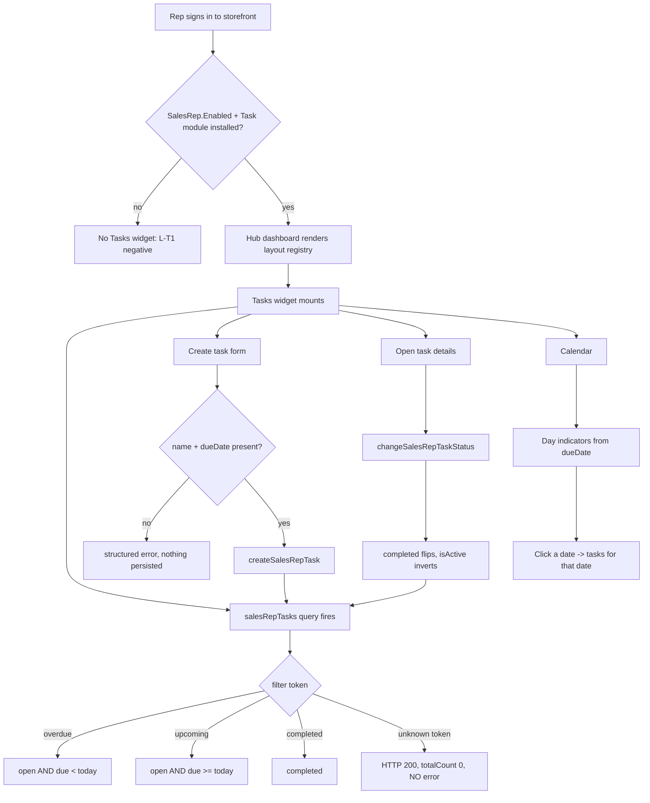
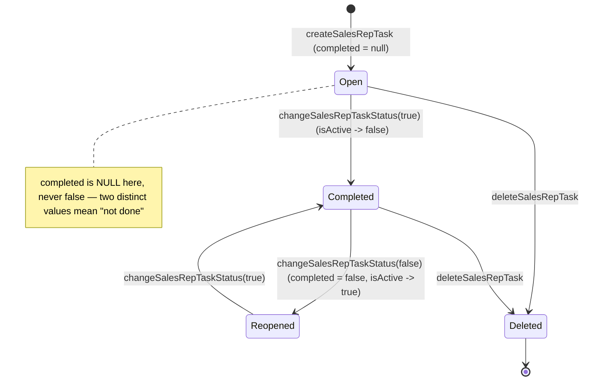

# TEST MODEL — VCST-5732

Ticket:      VCST-5732 | Type: Story | Status role: testable | Flow: feature-test | Priority: P2 (Medium) | Path: **FULL** | Changed: **Both** (backend `VirtoCommerce.SalesRep` + `VirtoCommerce.TaskManagement`, storefront theme)
Context:     FULL — `ba-system-analyzer` (1c, live enumeration, `playwright-edge`); backend contract established inline by the orchestrator against the live scoped schema.
Prior model: `reports/ba/test-models/VCST-5317-2026-09-09.md` (Sales Rep hub layout) — its Part 0 covers the **layout/widget** mechanism this widget is hosted by; it carries **nothing** on Tasks. First model for the Tasks surface.
Domain map:  `.claude/knowledge/domain/sales-rep.md` @ rev 2 (generated 2026-09-10, amended 2026-09-11) — **PRESENT but does NOT enumerate a Tasks surface.** The map predates this feature by 5 days. This is a §2-surface gap routed to `5h-map`, not an `ABSENT` map, so no `1c-map` build was dispatched.
Chain position: This ticket adds a **new terminal branch** to the Sales Rep domain chain. It touches L3 (store turns the feature on) and the rep-facing hub surface of L5; it introduces L-T1…L-T6 below. It **does not touch** L1 (a user becomes a rep), L2 (rep↔customer linking), L4 (served-org scoping of customer data), the Documents library, or the buyer-facing `/company/sales-reps` surface.
Affected surface:
  - `vc-module-sales-rep` — scoped xAPI `/graphql/sales-rep` (5 task queries + 4 task mutations). **Deployed as a PR build: `3.1009.0-pr-16-e348`.**
  - `VirtoCommerce.TaskManagement 3.1005.0` (release) — the underlying task store.
  - `vc-frontend` storefront — Tasks widget on the Sales Rep hub dashboard; theme rebuilt 2026-09-17 13:29 UTC.
  - **Domain map gap:** none of the above is enumerated in `sales-rep.md` §2/§3/§5.
Ticket signals: **No comments.** Two attachments (`image-20260812-152338.png`, `image-20260812-152352.png`) — design mockups referenced from the description's `### Design` block; they are the `{SPEC}` oracle for the visual lane. Technical note: *"Based on Task module. Visible if the Task module is installed."*
Epic context: parent **VCST-5142 "Sales Rep Hub"** (In progress). The hub dashboard, its configurable-layout mechanism and its statistics widgets are already shipped and covered by suites 093 / 091 / 050m; this story adds one more **block** to that same layout registry, so every `BL-SR-024..032` layout invariant applies to the Tasks widget as a block, unchanged.
Domains:     Sales Rep (`sr`), Task Management (new), B2B Organizations (adjacent — rep identity only)
Flows & boundaries: rep authentication ↔ scoped xAPI · hub layout registry ↔ Tasks block · task store ↔ date/timezone classification ↔ calendar rendering
Risk areas:  silent-empty-on-unknown-token (the module's established `BL-SR-020` shape) · date-boundary classification · partial-update field loss · tri-state `completed`
AC traceability: **9 story ACs → 14 atomic conditions** (A1–A14 below), each with an Impl verdict.
DoD: none declared on the ticket.

---

## Part 0 — VALUE CHAIN (derived first)

**In the rep's words:** *"I open my dashboard, see what I owe people today and what I have let slip, add a follow-up so I do not forget it, tick it off when it is done, and the calendar tells me at a glance which days are heavy."*

| # | Link | Mechanism |
|---|---|---|
| **L-T1** | **The widget is there at all** | Tasks registers as a block in the hub layout registry; `SalesRep.Enabled` store setting gates the hub (`BL-SR-011`); ticket declares a second gate — *"visible if the Task module is installed"* |
| **L-T2** | **The rep creates a task** | `createSalesRepTask(name, description, type, priority, dueDate)` → persisted row owned by the calling rep. `name` and `dueDate` are **server-required**; `priority` is **server-validated** to a five-value vocabulary (Lowest/Low/Normal/High/Highest, case-insensitive and normalised on store); `type` is **NOT validated** |
| **L-T3** | **The task is classified into a group** | `salesRepTasks(filter:)` — server knows exactly three: `overdue` (open ∧ due < today), `upcoming` (open ∧ due **≥** today), `completed`. The story asks for **five** groups |
| **L-T4** | **The rep reads a task** | `salesRepTask(id)` — ownership-scoped; a foreign id resolves `null` |
| **L-T5** | **The rep completes it** | `changeSalesRepTaskStatus(id, completed)` → `completed` flips and `isActive` is its inverse; reversible |
| **L-T6** | **The calendar tells the rep which days are heavy** | per-date indicators derived from `dueDate`; clicking a date filters to that date |

**Variants** (different code paths through the same link — matrix rows; union across the branching layers):

| Variant | Branches at | Why it is a row, not an input class |
|---|---|---|
| **V1 Overdue task** | server `filter` + client group | own predicate (`open ∧ due < today`) |
| **V2 Task due today** | **client only** — the server has no `today` filter and folds today into `upcoming` | the layers **disagree** here; this is the single highest-risk row |
| **V3 Future task** | server + client | |
| **V4 Completed task** | server + client | must be excluded from V1/V2/V3 regardless of its due date |
| **V5 Completed-but-future / completed-but-today** | classification precedence | proves completion **outranks** date, in both directions |
| **V6 Task with no/partial fields** | `updateSalesRepTask` | reachable only via update; **create forbids it** |

### Mechanism coverage matrix — variants × chain links

Columns are the six chain links (derived from Part 0); rows are the six variants. Cells are scenario numbers from Part 1, or `GAP`/`WAIVED`.

| | L-T1 widget | L-T2 create | L-T3 classify | L-T4 read | L-T5 complete | L-T6 calendar |
|---|---|---|---|---|---|---|
| **V1 Overdue** | 1 | 2 | **3** | 9 | 11 | 13 |
| **V2 Due today** | 1 | 2 | **4** | 9 | 11 | 13 |
| **V3 Future** | 1 | 2 | **5** | 9 | 11 | **14** |
| **V4 Completed** | 1 | WAIVED — a task cannot be created completed (no `completed` field on `InputCreateSalesRepTask`) | **6** | 9 | 11, 12 | 15 |
| **V5 Completed ∧ dated open** | 1 | WAIVED — same reason as V4 | **7** | 9 | 12 | 15 |
| **V6 Partial/empty fields** | GAP — unreachable from the widget if the edit form sends every field; resolved by scenario 10's payload capture | 8 | **10** | 10 | WAIVED — status change is id+flag only, carries no field payload | **10** |

**Reverse edges** — this feature moves no money, points, stock or entitlement. The one state that advances is completion:

| Forward effect | Reversed by | Covered |
|---|---|---|
| open → completed | `changeSalesRepTaskStatus(completed:false)` — **present, confirmed live** (`completed:false`, `isActive:true`) | **12** |
| task exists → deleted | `deleteSalesRepTask` — present, but **the story never mentions deletion**; whether the UI exposes it is itself a question | **16** |
| create → undo | **ABSENT IN PRODUCT** — no draft/undo; a mistyped task must be edited or deleted. Recorded as a finding-shaped absence, not a blank |

**Fixture lifecycle:** `completed` is **reversible**, so no fixture state here is terminal — the 14-row fixture is re-runnable. `dueDate`, however, is **wall-clock relative**: the fixture is seeded at offsets from *today*, so it decays. `AGENT-TEST-TASK Alpha/Sierra/Delta` stop being "today" at the next UTC midnight. **Re-seed before any run that asserts group membership** — the seeder is idempotent (it tears down its own `AGENT-TEST-TASK` rows first).

---

## Parts 1–5 — FAULT MODEL

**Condition space**
- `dueDate` relative to today → {far past, yesterday, today-early, today-late, tomorrow, +7d, far future, **absent**} (8)
- `completed` → {null (never touched), true, false (explicitly reopened)} (3)
- `priority` → {Lowest, Low, Normal, High, Highest, invalid} (6)
- `type` → {one of 8 valid, invalid string, absent} (3)
- `filter` token sent by the client → {upcoming, overdue, completed, **unknown**, none} (5)
- `sort` → {due-date ±, name ±, recent, unknown, none} (5)
- actor → {owning rep, other rep, anonymous} (3)
- Constraints: `completed ∈ {true,false}` is unreachable at create; `dueDate absent` is unreachable at create; anonymous reaches no link past L-T1.
- Raw cells **N = 8 × 3 × 6 × 3 × 5 × 5 × 3 = 32 400**

**Reduction** — EP on `priority`/`type`/`sort` (collapsed to valid-representative + one invalid, since the matrix shows neither branches classification), BVA held at full resolution on `dueDate` (it is the only factor the classification predicate reads), DT on `completed × dueDate` (the V4/V5 precedence question), and ST on the completion lifecycle. **Dropped:** the `priority × type` cross-product entirely — no link branches on either, so 12 combinations collapse to 2 checks that the values round-trip. `sort × filter` cross-product dropped — sorting was confirmed correct in all five orders inline, so it carries one regression row, not 25. **N 32 400 → M 16.**

### Test scenarios

| # | Cell (factor values) | Defect hypothesis — what breaks, and why it plausibly would | Archetype | Technique | Oracle | P |
|---|---|---|---|---|---|---|
| **1** | actor=rep, module installed, `SalesRep.Enabled=true` | The rep reaches the hub and **no Tasks widget is there** — the block never registered, so the whole story is undelivered. Plausible: it is a brand-new block in a registry that silently drops unknown types (`BL-SR-025`) | journey | **FLOW** | `{SPEC}` mockups + `{BL}` BL-SR-025/026 | Critical |
| **2** | create with every field valid | A created task does not appear, or appears in the wrong group, because the widget does not refetch after the mutation | stale-read | FLOW | `{OBSERVED}` create→list | Critical |
| **3** | open ∧ due < today | Overdue shows ≠ 2, or shows a completed-past task. Backend returns exactly {Zulu, Mike} — **confirmed inline** | wrong-filter | EP+BVA | `{OBSERVED}` server = 2 | High |
| **4** | open ∧ due = today | **The highest-risk row.** The server has **no `today` filter** and folds today into `upcoming` (8, not 5). The client must separate "My Today's tasks" from "Upcoming" itself. Expected UI: Today = 3 {Alpha, Sierra, Delta}, and those 3 must **not** also be counted under Upcoming | layer-disagreement | DT | `{SPEC}` AC group list vs `{OBSERVED}` server semantics | **Critical** |
| **5** | open ∧ due > today | Upcoming shows 8 (server semantics leaking through) instead of the 5 future tasks | layer-disagreement | EP | `{OBSERVED}` server = 8, spec = 5 | High |
| **6** | completed, any due date | Completed shows ≠ 4 | wrong-filter | EP | `{OBSERVED}` server = 4 | High |
| **7** | completed ∧ due=today (Tango); completed ∧ due future (Foxtrot) | **Completion must outrank date.** Tango leaking into "Today" or Foxtrot into "Upcoming" is the classic precedence bug. Server excludes both correctly — so a leak here is purely client-side | precedence | DT | `{OBSERVED}` server excludes both | High |
| **8** | create with name="" / no dueDate / priority invalid / type invalid | Client-side validation disagrees with the server's. Server: name **required**, dueDate **required**, priority **validated against five values** (`Urgent`/`Critical`/`Medium` rejected), **type NOT validated** (`'ZZZ'` accepted). A form offering a free-text Type would persist garbage | weak-validation | BVA+EG | `{OBSERVED}` server errors | Medium |
| **9** | actor=other rep / anonymous, task id known | Cross-rep read/write. **Confirmed inline: fully denied** — foreign `salesRepTask(id)` → `null`; update/complete/delete → *"Task not found."*; anonymous → `Unauthorized`. This row is a **regression guard**, not a suspicion | idor | EG | `{BL}` BL-SR-002 analogue, `{OBSERVED}` | **Critical** |
| **10** | `updateSalesRepTask` with fields OMITTED | **`updateSalesRepTask` is a full replace wearing a partial-update shape.** Confirmed inline: sending `{id, name}` alone wiped `description`→null, `type`→null, **`dueDate`→null**, and reset `priority` High→Normal. A null `dueDate` is a state **create forbids**, and an unclassifiable task falls out of every group and off the calendar. Whether a user can reach it depends entirely on what the edit form sends — **capture the payload** | destructive-default | DT | `{OBSERVED}` API | **Critical if UI-reachable, else High** |
| **11** | open task → mark completed from the UI | Completing does not move the task between groups without a reload, or the counts do not follow | stale-read | ST | `{OBSERVED}` | High |
| **12** | completed → reopened | Reversal. Note the tri-state: a never-touched task has `completed: null`, a reopened one has `completed: false`. **A client testing `=== false` shows a never-touched task as nothing** | tri-state | ST | `{OBSERVED}` API | High |
| **13** | calendar, 09-12 / 09-16 / today | Past-due days carry no indicator, or overdue days are indistinguishable | missing-affordance | FLOW | `{SPEC}` mockups | Medium |
| **14** | calendar, **2026-09-24 has TWO tasks**; **09-25…09-30 have ZERO** | A day indicator cannot represent >1 task, or an empty day renders one anyway. This is why the fixture puts Romeo+Charlie on one date and leaves a six-day hole after it | off-by-one | BVA | `{SPEC}` + `{OBSERVED}` fixture | Medium |
| **15** | click a date with tasks / a date with none | Clicking filters to the wrong date (timezone off-by-one) or the empty-day click has no empty state | off-by-one | BVA | `{SPEC}` AC 9 | Medium |
| **16** | delete a task from the UI | The story never mentions deletion but the mutation exists. If the UI exposes delete with no confirmation, a mis-tap is unrecoverable (no undo — see Reverse edges) | irreversible-action | EG | `{HYPOTHESIS}` — resolve live | Medium |

**Probes carried in:** `VC-*` catalog has no Sales-Rep or Task entry — **N/A, and that absence is itself recorded**: this is a greenfield surface with no historical defect corpus.

**Archetype sweep:** journey ✓1 · stale-read ✓2,11 · wrong-filter ✓3,6 · layer-disagreement ✓4,5 · precedence ✓7 · weak-validation ✓8 · idor ✓9 · destructive-default ✓10 · tri-state ✓12 · off-by-one ✓14,15 · missing-affordance ✓13 · irreversible-action ✓16 · **concurrency — WAIVED**: single-rep-owned rows with no shared counter; no contention path exists. · **i18n — WAIVED**: `reference_vcptcore_qa_locales_and_reviews` records vcptcore-qa carries no ru/pl locale, so plural/format checks are unrunnable on this env.

**UIP sweep:** BACK ✓11 (complete, then browser-back) · DEEP ✓15 (a date-filtered URL) · REFRESH ✓2,11 · TABS — **WAIVED**, no cross-tab state · EXPIRE ✓9 (token expiry → the module re-checks account state per query, `SR_REP_LOCKABLE`) · STORAGE — **WAIVED**, tasks are server-state, the only client-persisted thing is the layout (`BL-SR-024`, already covered by 093) · NET ✓2 (create under a dropped connection) · INPUT ✓8 · VIEW ✓1,13 (widget at mobile width) · DATA ✓3–7,14.

**Business Rules:** `BL-SR-002` (anonymous denied) · `BL-SR-011` (store setting gates storefront UI only) · `BL-SR-020` (free-form string fails silently to empty — **the `filter`/`sort` unknown-token behaviour observed here is the same shape, on a new field**) · `BL-SR-024`–`BL-SR-028`, `BL-SR-031`, `BL-SR-032` (the Tasks widget as a layout block: draft-vs-save, registry ownership, hide/restore, hidden-widget query suppression, rail unmount). **No `BL-*` invariant exists for task classification** — that is a genuine oracle gap and the run should propose one.

**Edge cases:** `ECL-4.2` (permission/feature gating) · date-boundary and empty-state patterns.

**Docs grounding:** VirtoOZ carries no Sales-Rep **Tasks** page (the module is pre-GA); `PlatformUserGuide` §Sales Rep overview grounds only the rep concept. **No `{DOC}` oracle is available for this feature** — the mockups are the only `{SPEC}`.

**Agents to dispatch:** `ba-system-analyzer` (1c, `playwright-edge`) · `qa-frontend-expert` (4a, `playwright-chrome`) · `ui-ux-expert` (4v, Chrome DevTools MCP) · `test-data-engineer` (3a, browserless).

---

## REV 2 — 2026-09-21 · the re-test's delta (rev 1 above is unchanged and still the fault model)

Rev 1 was written for the **first** pass. This run is a **re-test of a developer disposition**, so the
model's *inputs* moved while its fault model did not. What changed, and nothing else:

| Rev 1 said | Rev 2 |
|---|---|
| `Ticket signals: **No comments.**` | **Four comments now.** Two QA reports (2026-09-18 01:22 manual, 10 items; 02:38 deep, 28 items — **38 findings**), an attachment-only follow-up, and the developer's per-item disposition (2026-09-18 20:24): **19 fixed · 11 kept by design with a stated mitigation · 1 partial (D11) · 4 deferred to a shared-UI-kit ticket (D6, D8, D14, D16) · 2 out of scope (D27, D28)**. All frontend work in `vc-frontend` PR #2464; **backend modules untouched**, so no contract refresh is owed. |
| Env: `vcptcore-qa1`, theme `2.58.0-pr-2464-595d` | Env: **`vcptcore-qa`**, theme **`2.58.0-pr-2464-2971-2971a77b`** — same PR, **newer build**, footer read live before dispatch. Modules identical (`SalesRep 3.1009.0-pr-16-e348`, `TaskManagement 3.1005.0`). **The env move is the run's one structural risk**: every rev-1 `{OBSERVED}` figure was taken on qa1. |
| 16 scenarios drive the run | The **38 dispositions** drive it; rev 1's scenarios 1–16 survive as the regression floor (checklist §A3). Scenario **10** (`updateSalesRepTask` is a full replace wearing a partial-update shape) is now **confirmed reachable from the UI** — it was filed as deep #1, High, and is the item this run must prove fixed on the *persisted* value. |
| `No BL-* invariant exists for task classification` | **Still true.** Rev 1 said the run should propose one; it did not. Carried forward as an open oracle gap, not as a new finding. |

**A fifth chain link is now in question that rev 1 did not model.** Rev 1's L-T3 asked *"is a task
classified into the right group"*. The build answers with **four** chips whose scopes are not uniform —
the former `All` is now **the selected date** (a day scope) while its three siblings are **global** — so
the question became *"does the rep understand which scope they are looking at"*. That is a comprehension
failure mode, not a classification one, and it is the shape behind D2, D5 and M8 alike. The dev kept it by
design; the run verifies the **mitigation** (a date-labelled chip), never re-litigates the decision.

**Two things the fixes themselves put at risk** — neither existed when rev 1 was written, both now in §A3:
a **Notes cap of 1000 with a counter** and a **Title clamped to two lines** (new boundaries: 1000/1001,
256/257), and a **count string that now disagrees with the row count on purpose** — "6 tasks (5 shown)" —
which is a correct fix whose own off-by-one is invisible to the rev-1 matrix.

**Still undecided, and it is not QA's to decide.** The ACs ask for five groups (`My Today's tasks`,
`Active`, `Upcoming`, `Overdue`, `Completed`); the UI has four, the backend three, and **both mockups on
the ticket show the four that were built**. The build agrees with the design, so the disagreement is
between the story text and the mockups. Raised to the reporter on 2026-09-18; **no reply as of this run**.
Re-flagged, never filed.
