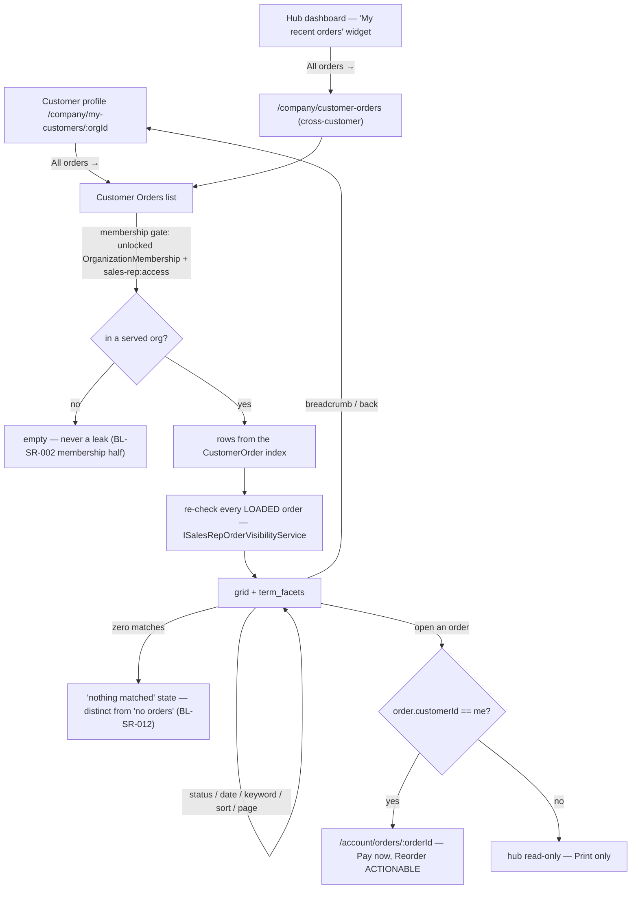
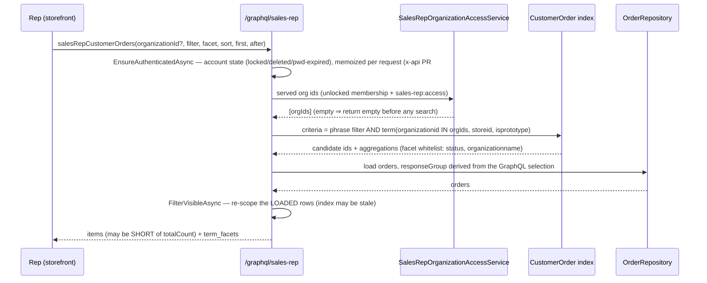

TEST MODEL — VCST-5733

Ticket:      VCST-5733 | Type: Story | Status role: testable (Ready for test) | Flow: feature-test | Priority: P2 (Medium) | Path: **FULL** | Changed: **Both** (module xAPI + storefront)
Context:     FULL — `ba-system-analyzer` (1c) + `ba-story-writer` review (1d) + orchestrator live probes (A–Q, this env, 2026-09-02)
Affected surface:
  - `vc-module-sales-rep` **PR #14** (open, unmerged) — `SalesRepCustomerOrdersQueryHandler.BuildSearchCriteria` / `.SanitizeFacet`, `SalesRepCustomerOrderQueryHandler`, `ISalesRepOrderVisibilityService.IsVisibleAsync`/`FilterVisibleAsync`, `SalesRepCustomerOrderResponseGroupParser`, `ModuleConstants.OrderFacets`, `ResolveFieldContextAuthorizationExtensions.EnsureAuthenticatedAsync`
  - `vc-frontend` **PR #2444** (open, unmerged) — routes `/company/customer-orders`, `/company/my-customers/:organizationId/orders`, `…/orders/:orderId`; new `shared/account/composables/useOrderView.ts` (extracted from `useUserOrder`, which now delegates)
  - `vc-module-x-api` **PR #84** (open, unmerged) — memoizes `IUserManagerCore.CheckCurrentUserState`, the account gate PR #14 introduces. Its own body: that call site *"arrives with VCST-5733"*.
  - Deployed on this env (probed): `SalesRep 3.1007.0-pr-14-5569`, `Xapi 3.1021.0-pr-84-0180`, `XOrder 3.1010.0` (≥3.1009.0 floor ✓), platform `3.1063.0` (≥3.1052.0 floor ✓), theme `2.57.0-pr-2444-5946` declared in `vc-deploy-dev@vcst-qa`. **All three PRs are live — this run tests three unmerged branches at once.**
Ticket signals:
  - **Attachment 1** (design, reporter): customer profile `MERCURY123`, breadcrumb `Home / Account / Sales Rep hub / My customers / Mercury123` with a hand-drawn `/ Orders` appended, and the `All orders →` link in RECENT ORDERS underlined. Entry point + required breadcrumb.
  - **Attachment 2** (assignee): page `CUSTOMER ORDERS`, breadcrumb `Home / Account / Sales Rep hub / Orders`, Customer column + `Select customer` filter, status facets `Completed (14) New (9) Foo (1)`, `PerfOrg 002002 (10)`, `Created date`, paging `1 2 3`. **This is the CROSS-CUSTOMER route** (`/company/customer-orders`), per PR #2444's own route table — *not* evidence of an AC-3 breadcrumb defect. 1d's strongest DRIFT verdict is therefore **retired on the route it was raised against and must be re-raised on `/company/my-customers/:orgId/orders`**.
  - **Dev comment (3 asks on `salesRepOrders`)** — all three **resolved by a parallel new API**, not by editing the old query. `salesRepOrders` stays creator-scoped on purpose and now backs a widget renamed *"My recent orders"* (13 locales). So 1d's AC-2 `CONTRADICTS` verdict is also **retired**: the creator clause the dev flagged is not in this feature's path.
  - Screenshot count arithmetic (statuses 24 vs customer 10) is **not reproducible on this env** — probe A shows whitelisted facet counts summing exactly to `totalCount`. Kept as an FE-side hypothesis (#14) only.
Epic context: parent **VCST-5142 "Sales Rep Hub"** (In progress). Epic Page 3 is a *cross-customer* "All Orders" view; Page 4 is Customer Detail with an Orders tab — PR #2444 ships **both** as two routes over one component, which resolves the Epic/story tension 1d flagged. Done siblings = integration seams: **VCST-5308** (customer profile — hosts the `All orders →` link), **VCST-5485/5367** (hub dashboard + saved layout — owns the renamed widget), **VCST-5649** (widget order-status settings), **VCST-5281** (multi-org invite/status). In-progress siblings **VCST-5337/5732** are not dependencies. **VCST-5591** (widget visual rework, In progress) overlaps the visual axis.
Domains:     Sales Rep Hub (storefront), Orders, B2B multi-org, GraphQL xAPI (scoped `/graphql/sales-rep` **and** default `/graphql`)
Flows & boundaries: customer profile ↔ customer-orders list ↔ order detail; hub read-only order page ↔ buyer-facing `/account/orders/:orderId` (**two pages, two authorization rules, one order**); dashboard widget ↔ list; `useOrderView` extraction ↔ pre-existing buyer order page (regression surface outside this ticket's own UI)
Risk areas:  VCST-5592 (UTC-vs-local on this Epic's date surfaces — PR #2444 deliberately wrote its OWN rolling-window date presets rather than reusing the calendar-aligned shared component) · VCST-5589 (stale Apollo cache between hub routes) · VCST-5586 (empty vs 0 in count/facet display) · VCST-5558 (stored XSS on a sales-rep input — this page adds a keyword search box) · index-lag (`totalCount` is an index **upper bound**; a page may return a row short — BY DESIGN, PR #14) · facet scope-leak class (whitelist is the defence)
AC traceability: **25 atomic conditions** from 1d (5 story ACs decomposed + 11 gap-ACs). Three of five story ACs are untestable as phrased (AC-1/3/5 name "customer context" with no observable); AC-4 is compound (page+search+sort). Impl verdicts re-based on the PR spec above: AC-2 `CONTRADICTS`→**open**, AC-1/AC-3 `DRIFT`→**open on the correct route**, AC-5 `NOT-FOUND` stands (no PR text describes a return control or what state it keeps).
DoD:         **The ticket declares no DoD.** A DoD would have pinned the one thing this story most needs: which of the three dev-comment questions had to be answered before merge. Recorded as a gap, not invented.

--- Part 0 — VALUE CHAIN (derived FIRST) ---

Value chain (one line per link, rep's words):
  L1  I open a customer I serve and click "All orders →"                    → I land on that customer's order list
  L2  the list is read from the order search index, scoped to the orgs I serve → I see EVERY order of that customer, not just the ones I placed
  L3  I narrow it — status, created-date, keyword, sort, page               → the list and its option counts follow what I chose
  L4  the breadcrumb keeps the customer, and I can go back                  → I stay in that customer's context
  L5  I open one order                                                      → my own order opens actionable on the buyer page; anyone else's opens read-only in the hub
  Unlocks: analysing a customer's purchasing history without leaving the hub.

Variants (different code paths through the same links — matrix ROWS):
  V1 cross-customer route, no `organizationId`      V2 customer-scoped route, `organizationId` set
  V3 rep serving several orgs (multi-org customer)  V4 rep whose membership on one served org is LOCKED
  V5 rep serving zero customers                      V6 order authored by the rep vs by a buyer/colleague

Mechanism coverage matrix (variants × links — no blank cells):
| | L1 entry | L2 scope | L3 refine | L4 context | L5 open |
|---|---|---|---|---|---|
| **V1** cross-customer | 1 | 2 | 8,9,10,11,12,13,14 | 5 | 18,19 |
| **V2** customer-scoped | 1 | 3 | 15 | 4,6,7 | 18 |
| **V3** multi-org rep | 1 | 3,16 | 14 | 6 | 18 |
| **V4** locked membership | WAIVED — entry is the same control; the lock is a scope fact, not an entry one | 16 | WAIVED — refinement operates inside an already-empty scope; #16 asserts the scope | WAIVED — as L1 | 20 |
| **V5** zero customers | 17 | 17 | WAIVED — nothing to refine; #17 asserts the empty state | WAIVED — no customer to return to | WAIVED — no order to open |
| **V6** own vs others' order | WAIVED — L1 is per-customer, not per-order | 2 | WAIVED — authorship is not a filter axis | WAIVED — L4 is list-level | 18,19,21 |

Reverse edges: this feature **moves no money, points, stock or entitlement** — it is a read-only surface (PR #14: *"No mutations — the surface is read-only"*; PR #2444: others' orders open Print-only). So there is no forward effect needing a reverse edge. The one *state* it writes is UI-local (filter/page/sort), whose reverse is #7 (return to profile) and #13 (paging reset). **Not ABSENT-IN-PRODUCT — genuinely not applicable**, and stated so rather than left blank.
Fixture lifecycle: **no terminal state** — orders already exist and are read, not consumed, so shared fixtures are safe here and per-run fixtures are NOT required (contrast the loyalty precedent). Two exceptions needing their own state: **#20** requires a membership locked at query time (`SR_REP_LOCKED` already provides this — ACME locked, TechFlow live) and **#21** requires an account locked *after* a token was issued, which no fixture provides (`SR_REP_BLOCKED` is refused at `/connect/token`, probe M) → **3a must lock mid-session or #21 is NOT-RUN, never a silent pass.**

--- Parts 1–5 — FAULT MODEL ---

Condition space:
  route            = {cross-customer, customer-scoped}                       (2)
  scope            = {served, unserved, served-but-locked, none}             (4)
  refinement       = {none, status×1, status×N, date-range, keyword, sort, page} (7)
  facet arg        = {whitelisted, scope-prefixed, unknown, absent}          (4)
  cursor source    = {pageInfo.endCursor, last edges.cursor, non-numeric}    (3)
  order authorship = {rep's own, buyer's, colleague rep's}                   (3)
  caller state     = {ok, membership-locked, account-locked, anonymous}      (4)
  Constraints: scope=none ⇒ refinement/facet/cursor unobservable · route=customer-scoped ⇒ no customer filter · authorship only observable at L5
  Raw cells = 2×4×7×4×3×3×4 = **8 064**

Reduction: **8 064 → 25.** Factors are near-independent and the surface is read-only, so a full cross is waste. Applied: (a) **FLOW first** — one journey row traverses L1→L5 whole (#1); (b) `facet arg` and `cursor source` are *security/correctness invariants of their own*, tested at one point each rather than crossed with route/refinement (#9–#12) — they are properties of the handler, and the handler does not branch on route; (c) `refinement` collapsed by EP+BVA to one row per axis plus the two interaction rows the mechanism actually couples (count-vs-selection #10, paging-reset #13); (d) `route` dropped from every row except those where it changes an observable (#1,#4,#5,#15) — one component serves both routes, so route is not a code path for L2/L3; (e) `caller state` × `scope` collapsed to the four distinct authorization verdicts (#2,#3,#16,#17,#20,#21); (f) `order authorship` kept in full (3 values, #18/#19/#21) because it is the one factor that selects a genuinely different destination *and* a different authorization rule. **Dropped and subsumed:** currency/locale (BL-SR-013 covered by #22 as a sweep, not a cross), store isolation (`SR_REP_SECOND_STORE` — subsumed by the `storeid` permanent term filter proven in #9).

Test scenarios (25 rows):
| # | Cell (factor values) | Defect hypothesis — what breaks here, and why it plausibly would | Archetype | Technique | Oracle | P |
|---|---|---|---|---|---|---|
| 1 | **[JOURNEY]** profile → All orders → list → filter+sort+page → open own order → back | The chain is assembled from two PRs and one shared component serving two routes; the rep lands on the cross-customer list (or a generic `/account/orders`) instead of the customer's, so the feature's whole premise silently fails while every per-screen check passes | SCOPE | FLOW | {SPEC} PR#2444 route table | Critical |
| 2 | V1 cross-customer, served, no filter | Creator clause not removed on the new path ⇒ rep sees only orders they placed (the pre-feature behaviour, 1 of 34) — the exact defect the story exists to fix | SCOPE | EP | {OBSERVED} probe A: 92 across 4 orgs, incl. `Cancelled(8)` | Critical |
| 3 | V2/V3 customer-scoped, `organizationId` = served | `organizationId` widens instead of narrowing, or is dropped ⇒ another customer's orders appear on a customer-scoped page | SCOPE | EP | {OBSERVED} probe E: 60, rows all TechFlow | Critical |
| 4 | V2 breadcrumb on `/company/my-customers/:orgId/orders` | The customer segment is dropped (as it correctly is on the cross-customer route) ⇒ AC-3 fails and the rep cannot tell whose orders they are reading | PARITY | EG | {SPEC} PR#2444: `Account / Sales Rep hub / My customers / {customer} / Orders` | High |
| 5 | V1 breadcrumb on `/company/customer-orders` | The customer-scoped breadcrumb leaks onto the cross-customer route, naming a customer that isn't the scope | PARITY | EG | {OBSERVED} attachment 2 | Medium |
| 6 | V2/V3 breadcrumb customer segment click → profile | The segment is inert or rebuilds the URL without `:orgId` ⇒ AC-5's return path is broken | RENDER | ST | {SPEC} AC-5 | High |
| 7 | V2 return to profile after filter+page-N | Return lands on the profile but the Orders context/tab is lost, or returns to the cross-customer list | LIFECYCLE | ST | {SPEC} AC-5 (gap: AC never says WHICH state) | Medium |
| 8 | L3 keyword search by order number | `salesRepCustomerOrders` has **no `keyword` arg** (schema-confirmed) — search must ride the `filter` phrase; an unescaped or mis-composed phrase makes search silently match nothing or everything | SILENT | EP | {OBSERVED} refreshed `graphql-schema.md` | High |
| 9 | facet = `organizationid` (scope-prefix) | `SanitizeFacet` fails open ⇒ aggregation strips the rep's own `organizationid` term filter and counts orders across the ENTIRE index — a cross-tenant count leak | SCOPE | EG | {OBSERVED} probe B: dropped, no facet, totalCount unchanged | Critical |
| 10 | facet = `status`, WITH statuses already selected | Counts are computed after the selection ⇒ every unselected status reads 0 and the filter becomes a one-way door the rep cannot widen | STALE | DT | {SPEC} dev ask #2 + `ApplyMultiSelectFacetSearch` | High |
| 11 | facet = unknown/garbage name | Rejected with an error instead of dropped ⇒ FE breaks on a facet the BE later renames | FALLBACK | EG | {OBSERVED} probe D: dropped silently | Low |
| 12 | facet = `isprototype` | Dropped-check regression ⇒ prototype orders counted into a customer-facing figure | SCOPE | EG | {OBSERVED} probe C: dropped | Medium |
| 13 | page N, then change a filter | Paging not reset ⇒ page 3 of a 1-page result shows an empty grid that reads as "no orders" | BOUNDARY | BVA | {BL} BL-SR-012 + PROPOSED-BL-SR-035 | High |
| 14 | **which cursor the FE sends on page 2** | The list pages by the last `edges.cursor` instead of `pageInfo.endCursor` ⇒ **one row is duplicated at every page boundary** and one is never shown. Reproduced at the API in probe I | BOUNDARY | BVA | {OBSERVED} probes H/I/J — `edges.cursor`=2 repeats `CO260902-00011`; `endCursor`=3 clean | Critical |
| 15 | created-date range, boundary + timezone | PR#2444 wrote its OWN rolling-window presets instead of the shared calendar-aligned ones; a local→UTC conversion error drops or double-counts boundary-day orders — the exact shape of VCST-5592 on this Epic | BOUNDARY | BVA | {BL} BL-SR-001 (inclusive UTC instants, no server truncation) | High |
| 16 | V4 rep with a LOCKED membership on one served org | The lock is honoured on the old queries but not on the index-backed one ⇒ a revoked rep keeps reading that customer's orders | SCOPE | DT | {OBSERVED} probes O/P/Q: 60 TechFlow-only; ACME→**0**; control rep→**16** | Critical |
| 17 | V5 rep serving zero customers | Blank grid or spinner instead of the module's "no data" state; or the zero-match state shown for a no-data condition | FALLBACK | EP | {OBSERVED} probe N: totalCount 0, facets `[]` · {BL} BL-SR-012 | Medium |
| 18 | V6 open an order the rep did NOT place | Opens on the buyer page with Pay now / Reorder live ⇒ a rep can **act** on a customer's order they may only read | SCOPE | ST | {SPEC} PR#2444: others' open read-only, Print only | Critical |
| 19 | V6 open an order the rep DID place | Wrongly routed to the hub read-only page ⇒ the rep loses Pay now / Reorder on their own order | PARITY | ST | {SPEC} PR#2444 | Medium |
| 20 | direct URL to `…/orders/:orderId` for an order outside the served scope | `salesRepCustomerOrder` returns the order instead of `null` ⇒ direct-object-reference read of another customer's order | SCOPE | EG | {SPEC} PR#14: *null for an order outside the rep's served organizations* | Critical |
| 21 | typed URL to `/account/orders/:orderId` for a customer's order the rep did not place | The **buyer page's** own gate (admin OR `CustomerId==caller` OR own-org membership) admits a serving rep it should refuse — two pages, two rules, one order; neither PR's text covers this seam | SCOPE | EG | {HYPOTHESIS} → must become {OBSERVED}; 1c names it uncovered by any suite | Critical |
| 22 | keyword search + filter chips, `<script>`/HTML payload, and `cultureName=de-DE` | The search box is a new reflected-input surface on a sales-rep page — the exact class of VCST-5558 (stored XSS via an unescaped sales-rep field); and a raw `New`-style enum or an `sales-rep.*` i18n key surfaces instead of `statusDisplayValue`/`localizedName` | MONEY | EG | {BL} BL-SR-013 · VCST-5558 precedent | High |
| 23 | deep-link / refresh a filtered+sorted+paged URL | Filter state lives only in component memory ⇒ refresh drops the customer scope entirely (worst case: the cross-customer list) or errors; a shared link opens a different view than the sender saw | LIFECYCLE | ST | {HYPOTHESIS} → {OBSERVED}; UIP-DEEP/UIP-REFRESH | High |
| 24 | facet request fails or is slow while the grid succeeds | The FILTERS drawer renders zero options (reads as "this customer has only these statuses") or keeps stale counts from the previous customer — the VCST-5589 stale-cache shape on a new route | STALE | EG | {HYPOTHESIS} → {OBSERVED}; VCST-5589 precedent | Medium |
| 25 | 375px viewport, FILTERS drawer + date inputs + checkbox list | The drawer is the densest new control cluster in the hub; at 375px it overflows, clips the Apply/Reset buttons, or traps focus — and WCAG 2.2 AA has never been asserted anywhere on this pipeline before | RENDER | EG | {BL} BL-A11Y-001..004, BL-UI-002 | High |

Probes carried in: no `VC-*` catalog entry names this surface (module is pre-GA and post-dates the catalog's order entries) → **N/A, by absence of an entry, not by waiver**. The four historical *sibling* shapes are carried instead: VCST-5592→#15, VCST-5589→#7, VCST-5586→#17, VCST-5558→#22.
Archetype sweep (closed vocabulary, vc-bug-catalog §Defect archetypes — all 12 resolved): `SCOPE` #1,#2,#3,#9,#12,#16,#18,#20,#21 · `PARITY` #4,#5,#19 · `STALE` #10,#24 · `BOUNDARY` #13,#14,#15 · `SILENT` #8 · `FALLBACK` #11,#17 · `LIFECYCLE` #7,#23 · `RENDER` #6,#25 · `MONEY` #22 (culture/i18n half; the XSS half rides the same row via EG) · `RACE` **WAIVED** — read-only surface, no mutation to interleave · `REPLAY` **WAIVED** — no idempotency key and no effect to apply twice · `CONFIG` **WAIVED-WITH-CAVEAT** — the two config axes (`SalesRep.Enabled`, `OrderFullTextSearchEnabled`) are gate-checked in pre-flight rather than as rows: the first is BL-SR-011, already covered corpus-wide by 089 SR-FE-003; the second is a deploy prerequisite proven live before this run (probe: 92 rows returned), and a run against a stand missing it is BLOCKED, not FAILED.
UIP sweep (UI): UIP-BACK #6,#7 · UIP-DEEP #20,#21 · UIP-REFRESH #23 (deep-link/refresh of a filtered URL) · UIP-TABS **WAIVED** (read-only, no cross-tab state) · UIP-EXPIRE #21 (account/token state) · UIP-STORAGE **WAIVED** (no persisted client state beyond the saved layout, owned by VCST-5367) · UIP-NET #24 (facet request fails while the grid succeeds — does the drawer show empty options or stale ones?) · UIP-INPUT #22 · UIP-VIEW #25 (375px — the FILTERS drawer + checkbox/date controls are the first thing to break) · UIP-DATA #17
Business Rules: **BL-SR-002 `[P0-security]` — MUST BE AMENDED BEFORE IT IS USED AS AN ORACLE HERE.** As written it says every sales-rep figure *"counts only the carts/orders the calling rep created"*; `salesRepCustomerOrders` **deliberately returns orders the rep did not create** (PR #14's entire purpose). Its **membership half holds and is CONFIRMED** (probes F, O, P, Q, N). Judging this feature against the creator half would manufacture a false FAIL on #2 — so #2 asserts the membership half plus the *inversion* of the creator half. → **`/qa-review-oracles bl` proposal: split BL-SR-002 into a creator+membership rule scoped to the statistics/`salesRepOrders` family, and a membership-only rule for the customer-orders family.** Also: BL-SR-001 (#15) · BL-SR-011 (route gate, #1) · BL-SR-012 (#13,#17) · BL-SR-013 (#22 locale sweep) · BL-SR-005's list-vs-statistics cancelled-order split corroborates #2 (`Cancelled(8)` present in the list scope, correctly). Proposed new: **PROPOSED-BL-SR-033** (customer-scoped view resolves to the navigated-from org), **-034** (facet counts ignore their own axis' selection), **-035** (filter change resets paging), **-036** (a read-only surface never routes to an actionable page for an order the caller may not act on — #18/#21).
Edge cases: ECL-3.2 (filter & sort — reset/persistence, #13) · ECL-1.x layout at 375px (#25). **No ECL section covers "index-backed list whose totalCount is a stale upper bound"** → candidate ECL pattern, `/qa-review-oracles ecl` proposal.
Docs grounding: **none** — VirtoOZ carries no `vc-module-sales-rep` documentation (module pre-GA; every `BL-SR-*` entry stamps *docs N/A*). The two PR bodies are the authoritative spec, which is why every `{SPEC}` oracle above cites a PR line rather than a doc. Recorded as a gap: a `{DOC}` oracle is unavailable for this whole domain.
Agents to dispatch: `qa-backend-expert` (playwright-edge — API/GraphQL rows #2,#3,#8–#12,#16,#20) · `qa-frontend-expert` (playwright-chrome — storefront rows #1,#4–#7,#13–#15,#17–#19,#21,#23) · `ui-ux-expert` (Chrome DevTools MCP — visual axis, #22,#24,#25) · `test-data-engineer` (3a — the #21 mid-session account lock, which no fixture provides)
