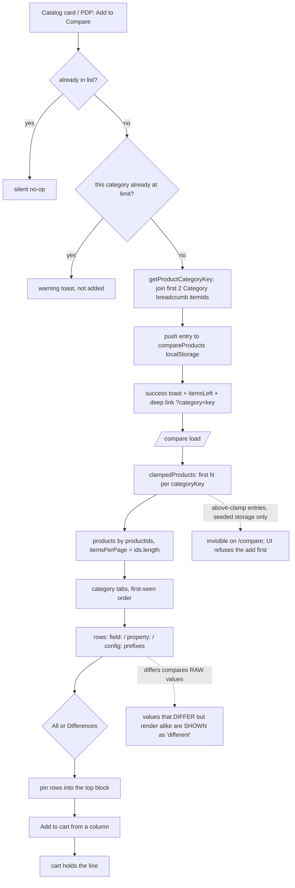
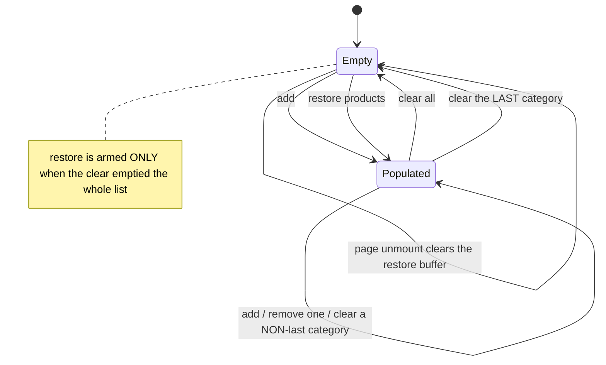

TEST MODEL — VCST-5735

Ticket:      VCST-5735 | Type: Story | Status role: testable | Flow: feature-test | Priority: P2 (Medium) | Path: FULL | Changed: Frontend
Context:     ba-system-analyzer (1c) + direct reading of PR #2452 at head `d1e45b04`
Affected surface: `vc-frontend` PR #2452 (OPEN, 30 files +4062/−601), live on vcst-qa as theme
  `2.57.0-pr-2452-d1e4-d1e45b04` (footer-verified); Platform 3.1063.0. New `compare-table.vue` (689 L),
  new `useCompareAddToCart` / `useCompareTableRowPins`, rewritten `useCompareProducts` /
  `useCompareProductsPage`, `product-card-compare.vue` REMOVED, `+breadcrumbs { itemId }` in 5 catalog
  `.graphql` docs. All 13 locales updated and the stale `clear_list_modal` key removed — i18n is clean.
Ticket signals: **the AC field reads `1. No requirements.`** — no acceptance criteria, no DoD, no comments.
  One design screenshot; a Figma link; and a **Claude Design prototype that IS readable via DesignSync**,
  making it this run's only `{SPEC}` oracle (extracted to scratchpad `vcst-5735-design-spec.md`).
  PR declares breaking changes for forks, and frames the storage-key change as a *fork* concern only.
Epic context: none — no parent Epic.
Domains:     catalog-search (storefront). Blast radius: catalog listing, global search, recently-browsed,
  PDP recommendations, related products.
Flows & boundaries: compare ↔ catalog card · ↔ PDP · ↔ cart · ↔ configurable products · ↔ localStorage
  (guest/auth, multi-tab, sign-out) · ↔ currency/culture · ↔ org switch · the 5 shared GraphQL docs.
Risk areas:  VC-CART-004 (`SILENT` addItem no-op) · VC-CART-006 (B2B stepper IS add-to-cart) · VC-LIST-001
  (a refused add at the limit is the guard working — do NOT file) · VC-UI-004 (state-dependent layout bugs
  are not duplicates) · VC-UI-005 (BL-UI-001..006 uncovered since `048b` removed) · VC-DEPLOY-001 (PR
  deployed while open). Sibling precedent **VCST-5831**: a 375 px multi-product grid truncated every
  product name so the customer could not tell which control belonged to which product.
AC traceability: 74 atomic conditions derived by 1d from the 11 bullets + gap-ACs (the ticket supplies
  none) — 8 SATISFIED · 6 DRIFT · 2 CONTRADICTS · 19 NOT-FOUND · rest live-only. DoD: none declared.

--- Part 0 — VALUE CHAIN (derived FIRST) ---

Value chain:
  L1  the customer clicks "Add to Compare" on a catalog card or PDP → the product is remembered, tagged
      with the category it sits in, and refused if that category is already full
  L2  → an `ICompareProductEntry {productId, categoryKey, localId?}` is appended to the compare list
  L3  → the list persists to `localStorage["compareProducts"]`, surviving reload, new tabs and sign-in
  L4  → on `/compare` the entries are clamped per category, their products fetched by id, grouped into
      category tabs, and rendered one column per entry × one row per characteristic
  L5  → the customer narrows to Differences, pins rows, removes or clears — the table answers "which one"
  L6  → the customer adds the winner to the cart from the table, and the cart really holds that line


<!-- Part 0 annotations corrected after Step 3x: `differs` compares RAW values, not formatted ones, and
     the above-clamp path is unreachable through the UI (the add is refused with a toast). The chain
     itself is unchanged — only these two mechanism notes, which were wrong and would otherwise be read
     as fact by whoever authors from this model. -->




```mermaid
sequenceDiagram
  participant U as Customer
  participant LS as localStorage
  participant P as /compare page
  participant X as xAPI
  U->>LS: add entry {productId, categoryKey}
  U->>P: open /compare
  P->>LS: read compareProducts, clamp per category
  P->>X: products(productIds, itemsPerPage = ids.length)
  X-->>P: products (deduped by id — entry↔product re-paired locally)
  loop per CONFIGURED entry only
    P->>X: createConfiguredLineItem(storeId, currencyCode, cultureName read ONCE at setup)
    X-->>P: configured price
    Note over P: on rejection → Logger.error only,<br/>row silently falls back to the BASE price (scenario 13)
  end
  P-->>U: tabs + rows; differs computed over RAW values (scenario 10 — corrected at 3x)
```

Variants: V1 plain product · V2 configurable (localId + config sections; **file sections stripped** from
the identity key) · V3 ≥2 Category breadcrumbs · V4 exactly 1 · V5 zero (→ `uncategorized` tab) ·
V6 guest vs signed-in · V7 desktop vs mobile (<`md`)

Mechanism coverage matrix (variants × links — no blank cells):

| | L1 add | L2 entry | L3 persist | L4 render | L5 interact | L6 cart |
|---|---|---|---|---|---|---|
| V1 plain      | 1 | 1 | 8 | 1 | 6,7 | 2,14 |
| V2 config     | 16 | 16 | 16 | 17,18 | WAIVED — pin/filter are row-level, variant-independent | 12,13 |
| V3 ≥2 cats    | 1 | 1 | 8 | 1 | 6 | 14 |
| V4 exactly 1  | 6 | 6 | 6 | 6 | WAIVED — same row engine as V3 | WAIVED — same as V1 |
| V5 zero cats  | 6 | 6 | 6 | 6 | WAIVED — one tab, same row engine | WAIVED — same as V1 |
| V6 guest/auth | 15 | 15 | 15 | 15 | WAIVED — no auth branch in the row engine | 14 |
| V7 mobile     | WAIVED — add happens on catalog/PDP, not this surface | n/a | n/a | 3,9 | 3 | 3 |

Reverse edges (per forward effect):
  add → remove one column ......................... covered by 7
  add → clear category / clear all ................ covered by 3 (and its mobile absence IS the finding)
  clear all → restore products .................... covered by 5
  pin → unpin ..................................... covered by 6
  add to cart → remove from cart .................. ABSENT IN PRODUCT — the cart owns removal, correctly.
  lower `product_compare_limit` → re-admit ........ **ABSENT IN PRODUCT — a finding.** Clamping is one-way:
      entries above a lowered clamp are unreachable except via Clear all (scenario 4).
  re-categorize a product → re-key its entry ...... **ABSENT IN PRODUCT — a finding.** `categoryKey` is
      persisted at add time and never re-derived (scenario 11).

Fixture lifecycle: no terminal state — compare is fully reversible, so fixtures are reusable. **But
`localStorage["compareProducts"]` is per-profile shared state and two suites on one lane WILL collide** —
every case clears the key in Preconditions rather than assuming an empty list.

--- Parts 1–5 — FAULT MODEL ---

Condition space:
  storage state  : empty | v1 legacy payload | v2 payload | above-clamp payload | corrupt JSON
  product kind   : plain | configurable | configurable differing only by a file section
  qty constraints: uniform across products | **divergent** (min/max/pack/available differ)
  category depth : ≥2 Category crumbs | exactly 1 | zero | parent-vs-child pair
  per-cat fill   : below limit | exactly at limit | above limit
  filter         : All | Differences
  viewport       : ≥`md` | <`md`
  session        : guest | signed-in | signed-in then org switch
  currency       : store default | switched while on /compare
  Raw cells = 5·3·2·4·3·2·2·3·2 = 8,640

Reduction: 8,640 → 18. Dropped, and what subsumes them:
  - `viewport` collapses to two rows (3, 9) — the row engine is viewport-independent; what changes below
    `md` is which controls exist at all, and 3 covers the functional loss while 9 covers geometry.
  - `session` collapses to 15 — there is no auth branch anywhere in the compare path; the only
    session-sensitive claim is BL-CROSS-008's org swap.
  - `per-cat fill` "exactly at limit" folds into 4 — the refused add is VC-LIST-001's guard working and
    must not be filed; only the ABOVE-limit state is a defect surface.
  - `filter` × pinning folds into 6 — pinned rows are filter-exempt by construction, so one row exercises
    both factors.
  - `qty constraints: divergent` is NOT dropped (2) — it is the sole trigger of the recursive-update
    hypothesis and nothing else subsumes it.
  - `corrupt JSON` folds into 8 — same parse path as the legacy payload.

Test scenarios (18 rows):

| # | Cell | Defect hypothesis — what breaks, and why it plausibly would | Archetype | Technique | Oracle | P |
|---|---|---|---|---|---|---|
| 1 | [JOURNEY] plain · ≥2 cats · 2 tabs · All→Differences · pin · add to cart | The chain never completes end to end: the product lands under the wrong tab, the row engine hides the row being decided on, or the cart does not actually gain the line (VC-CART-004). **No case in the corpus crosses this chain today.** | SILENT | FLOW | {SPEC} prototype + BL-CART-007 | Critical |
| 2 | ≥2 plain products in one tab with **divergent** min/max/pack/available quantities | `isAddToCartDisabled` is called per product per render **from the template**, and it WRITES four refs then READS `quantitySchema` — a `computed` over those same refs. Reading a computed during render subscribes the render effect to its deps; writing them in the same render is the textbook Vue recursive-update pattern. It converges only if the values stop changing between passes, so divergent constraints plausibly never settle → `Maximum recursive updates exceeded`, CPU spin, frozen table. Uniform constraints look fine, which is exactly why it could ship. | RENDER | ST | {HYPOTHESIS} → PROPOSED-BL-CAT-018 | Critical |
| 3 | <`md`, populated list | **A mobile customer cannot clear a category and cannot clear the list.** `compare-table__clear-category` is `hidden` below `md`, `compare-products__actions` (holding Clear all) is `hidden` below `md`, and the overflow (⋯) menu the description says should hold those secondary actions was never built. The only removal path left is the per-product trash control. This is functional loss, not styling. | FALLBACK | ST | {SPEC} ticket bullet 9 → PROPOSED-BL-CAT-017 | Critical |
| 4 | above-clamp payload (reached by lowering `product_compare_limit`, or via 5) | `clampedProducts` truncates per category and is what the page renders, but `isInCompareList` reads the RAW array. So the catalog card shows "Remove from Compare" (`:active`/`:aria-pressed` bind to it) for a product that never appears on `/compare`, re-adding is a silent no-op, and only Clear all recovers. | SILENT | ST | {HYPOTHESIS} → PROPOSED-BL-CAT-014 | Critical |
| 5 | clear all → add product X in a second tab → restore | `restoreProducts` appends `lastRemovedEntries` with **no dedupe and no limit re-check**. `useLocalStorage` syncs cross-tab, so restoring after the list changed underneath duplicates X or pushes the category above its limit — landing in scenario 4's stuck state. | RACE | ST | {HYPOTHESIS} → PROPOSED-BL-CAT-014 | High |
| 6 | exactly 1 product in a tab, Differences on; and V5 zero-category products | `differs` requires `>1` product, so with one product nothing differs and Differences renders an empty board that reads as a loading failure — the spec supplies a dedicated message. Same row covers the `uncategorized` tab rendering with a real label (a zero-category product is NOT lost). | FALLBACK | BVA | {SPEC} "Add one more product to this category to see differences." | High |
| 7 | 3 products, remove the middle column | Removal is index-based in a transposed grid; it can drop the wrong entry, or orphan `localProductConfigurations` for a configurable neighbour. Reverse edge for L1. | LIFECYCLE | ST | {SPEC} prototype remove semantics | High |
| 8 | v1 legacy payload in localStorage; and corrupt JSON | Both old keys are **deleted from the codebase**, not renamed, and nothing reads them. Every existing customer's compare list silently resets to empty on deploy, the orphaned keys stay in the browser forever, and "Restore products" cannot help because the buffer is in-memory and empty on a fresh load. | SILENT | EG | {HYPOTHESIS} → PROPOSED-BL-CAT-013 | High |
| 9 | <`md`, ≥3 products in one tab | Locked label column + 2 product columns must fit, the DOCUMENT must not scroll (BL-UI-004 exempts the table's own scroller, not the page), and names must stay legible at `w-28` (112 px). VCST-5831 is this exact shape on a sibling surface. | RENDER | ST | BL-UI-004 + BL-UI-005 + BL-UI-006 | High |
| 10 | two products whose values differ but **format identically** | `differs` is computed over FORMATTED strings — price via `formattedAmount`, numbers via `n()`, availability via a signature bucketed on `MAX_DISPLAY_IN_STOCK_QUANTITY`. Two genuinely different values that render alike are judged identical and HIDDEN by the Differences filter — the filter silently removes the row the customer needed. | MONEY | EP | {HYPOTHESIS} → PROPOSED-BL-CAT-016 | High |
| 11 | parent-category product + child-category product; then re-categorize a product in Admin | `"electronics"` ≠ `"electronics/laptops"`, so a parent product never shares a tab with its children — and since the tab label is the LAST crumb's title, **both tabs can carry the same visible label**. Worse, the key is persisted at add time while the label is derived at render time, so re-categorizing yields two identically-named tabs with split contents, permanently. | PARITY | EG | {HYPOTHESIS} → PROPOSED-BL-CAT-015 | High |
| 12 | configurable product on the compare table | Configurable and has-variations products branch to a PDP **link**, never to add-to-cart, so `addToCart(id, qty)` is never called without a configuration. That satisfies BL-CAT-006 by routing around it rather than validating — the safe shape. Verify the round trip: the link carries `localId`, and the PDP restores from a parallel localStorage key with **no consistency check**, so an orphaned `localId` gives a "customize" link to a PDP with nothing preselected. | FALLBACK | ST | BL-CAT-006 | High |
| 13 | configured entry whose `createConfiguredLineItem` mutation fails | The watcher swallows a rejected mutation to `Logger.error`, so a failed configured price falls back to the BASE product price with no user-visible error — the customer compares and may buy against a price that is not the configured one. | SILENT | EG | {HYPOTHESIS} → PROPOSED-BL-CAT-018 | High |
| 14 | plain product at MOQ / pack-size, Add to cart from the table | v1 had a quantity stepper; v2 has one CTA, so a single click must add a VALID quantity (`minQuantity \|\| 1`, rounded up to a pack multiple). This is a THIRD add-to-cart surface after PDP and quick-add (VC-CART-006). Assert the RENDERED cart, not the response (VC-CART-004). Include MOQ-not-a-multiple-of-pack-size. | BOUNDARY | BVA | BL-CART-006 + BL-CART-007 + BL-CAT-001 | Critical |
| 15 | signed-in, populated list, switch organization | BL-CROSS-008 requires cart/pricing/lists to swap ATOMICALLY; a partial swap is called a critical bug. `compareProducts` is localStorage-backed and nothing in the diff writes it on org change, so the previous org's comparison — and its prices — persist across the switch. Same mechanism leaks a list between users on a shared machine at sign-out. | SCOPE | ST | BL-CROSS-008 | Critical |
| 16 | same configurable product added twice, configurations differing ONLY in a file section | `withoutFileSections` strips file sections before computing identity, so two visibly different configurations are the SAME entry and the second add is a silent no-op with no feedback. | SILENT | EP | {HYPOTHESIS} → PROPOSED-BL-CAT-019 | Medium |
| 17 | configurable product with two configuration sections sharing a display label | `add-to-compare-catalog.vue` dropped `id` from the properties payload and config rows are now keyed by **label**, so two sections with the same display name collapse into one row — one section's value is simply not shown. | SILENT | EP | {HYPOTHESIS} → PROPOSED-BL-CAT-019 | Medium |
| 18 | currency (and culture) switched while on `/compare` | `globals` (storeId, currencyCode, cultureName) are read ONCE at setup and products refetch only when `productIds` changes. Row labels are reactive via `t()`, but fetched products, formatted prices and configured line-item prices may not refresh. BL-PRICE-005: no exchange-rate conversion, and a product with no price list in the target currency is unavailable — the open P1 `£0.00` bug shows a multi-product price grid is the vulnerable shape. | MONEY | ST | BL-PRICE-005 + BL-CROSS-004 | High |

Accessibility findings are tracked but do NOT gate this story (`triage.md` §7a — a `BL-A11Y-*` failure on a
feature ticket files as its own standalone ticket at real severity):
  A1 the header lives in a **separate `<table>`** from the body, so `scope="col"` cannot associate across
     the boundary; and every table element is overridden to `block`/`flex`, stripping implicit roles. A
     screen-reader user gets an unlabelled value sequence with no product↔attribute association — the one
     thing a comparison table exists to convey (WCAG 1.3.1). **ECL-15.1 §15 states outright that this
     violates no `BL-A11Y-*` rule as written**, so it is also a `PROPOSED-BL` candidate.
  A2 both horizontal scrollers are `overflow-x-auto` with no `tabindex="0"`, no `role`/label, and the
     header scroller hides its scrollbar → not keyboard-reachable (WCAG 2.1.1).
  A3 neither tab set is a `tablist` (both use `aria-pressed`, no `role="tab"`/`aria-selected`, no arrow keys).
  A4 the tooltip trigger is a bare `VcIcon`, not focusable — and is `hidden` below `md` entirely, so MOQ /
     dpi / PoE explanations are unreachable on mobile (ECL-7.4 r5, an already-`[OBSERVED]` pattern).
     Credit where due: focus IS handled deliberately on the compact/full swap, on remove, and in the empty
     state — better than most surfaces here, so report the cluster without implying a11y was ignored.

Probes carried in: VC-CART-004 → 1,14 · VC-CART-006 → 14 · VC-LIST-001 → 4 (guard; do NOT file the refused
  add) · VC-UI-004 → 6,9 · VC-UI-005 → 9 · VC-LOY-001 → N/A: it enumerates the currency-revert surfaces and
  compare is NOT among them, so compare's currency behaviour is *unspecified* rather than known — which is
  why 18 observes rather than asserts a revert.

Archetype sweep: SILENT 1,4,8,13,16,17 · RENDER 2,9 · FALLBACK 3,6,12 · RACE 5 · LIFECYCLE 7 · MONEY 10,18 ·
  PARITY 11 · BOUNDARY 14 · SCOPE 15 · CONFIG → 4 (the `product_compare_limit` drop is the config path) ·
  STALE WAIVED — no cache/index/projection layer is added; products are fetched fresh per page load ·
  REPLAY WAIVED — no idempotency key and no retried effect on this surface.

UIP sweep: UIP-DATA → 6,9 · UIP-STORAGE → 4,5,8 · UIP-TABS → 5 · UIP-VIEW → 3,9 · UIP-DEEP → 1 (the
  `?category=` deep link the add-toast now emits) · UIP-REFRESH → 5 (the restore buffer is page-scoped, so
  a refresh must NOT resurrect) · UIP-NET → 13 · UIP-BACK WAIVED — no submit/settlement step in this chain ·
  UIP-EXPIRE WAIVED — compare is anonymous-capable, no token gates it · UIP-INPUT WAIVED — no form input.

Business Rules: BL-CROSS-008 · BL-CROSS-004 · BL-CART-001/006/007 · BL-CAT-001/006 · BL-PRICE-005 ·
  BL-SRCH-002 · BL-UI-003/004/005/006 · BL-A11Y-001..004. **NO `BL-*` invariant exists for compare
  itself** — every rule above is borrowed from an adjacent domain, so the corpus records compare's
  behaviour rather than judging it. Seven are proposed at 5e; none is minted here.
  **Proposed to /qa-review-oracles at 5e — none minted here; each is the oracle a {HYPOTHESIS} row awaits:**
  -013 a compare selection survives a release (migrate the prior payload or resolve to a clean empty list) ·
  -014 the limit is enforced at add and no entry is ever counted as in-list while unrenderable · -015 every
  entry is reachable in exactly one tab, uniquely labelled · -016 Differences hides a row only when the
  underlying VALUES are equal, not their formatting · -017 every control the description promises is
  reachable at every viewport · -018 the surface renders without recursive-update errors and never silently
  substitutes a base price for a configured one · -019 configurations a customer can tell apart are distinct.
Edge cases: ECL-3.2 r4 (browser-storage persistence) · ECL-12.1 r1 (currency is a stored preference applied
  via full reload) · ECL-7.4 r5 (a hover-only affordance is unreachable on touch — scenario A4) ·
  ECL-1.4 / 1.6 · ECL-15.1 r2 (structure not exposed — A1).
Docs grounding: the published guide describes v1 only and states "Only 5 products can be compared at a
  time" — a **global** cap. Per-category is deliberate here, so the DOC is now wrong in the way that most
  matters: an administrator sizing `product_compare_limit` from it gets `5 × N categories`. Feeds 5h.
Agents: qa-frontend-expert (chrome) · ui-ux-expert (DevTools) · test-data-engineer (3a) · `/qa-exploratory ticket VCST-5735` (3x).

## Step 3x — discovery groundings (2026-09-03, chrome, signed-out, 25-min box)

Part 0 is unchanged. This amends scenario rows only: `{HYPOTHESIS}` → `{OBSERVED}` where the lane reached
them, and marks what it did not. **Four of five source-derived hypotheses were REFUTED**, two in the
direction that matters — which is the entire argument for running this lane before authoring.

| # | Was | Now | Grounding |
|---|---|---|---|
| 2 | loop predicted with divergent qty constraints | **REFUTED (observable half)** | 3 plain products with genuinely divergent min/max/available in one tab: table painted fully, all 16 rows, stayed interactive, zero Vue warnings. **Caveat that must travel with it:** this is a PRODUCTION build where `checkRecursiveUpdates` is dev-only, so the warning could not appear regardless. The write-during-render pattern is NOT settled — it needs a dev build or a unit test, not this lane. Case is re-scoped to the observable claim only. |
| 4 | above-clamp entry becomes a ghost | **REFUTED via the UI** | The clamp is enforced at ADD time with feedback: the 6th add is refused, the button never enters the pressed state, and a toast says *"Only 5 products from the same category can be compared"*. The ghost state is unreachable through the storefront. Residual, NOT REACHED: a pre-existing over-limit payload (stale storage, or a limit lowered afterwards). |
| 5 | restore duplicates after a cross-tab add | **REFUTED — structurally impossible** | `Restore products` exists ONLY in the empty state, and any add (including one propagated from another tab) replaces the empty state and removes the button. Restore and a non-empty list cannot coexist. Round-trip verified exact: badge 6, 1 + 5 across two tabs, no duplicate, nothing over limit. |
| 6 | single-product tab shows guidance under Differences | **REFUTED** | With 1 product the All/Differences toggle is **disabled** and all 15 rows render — no empty board. But the counter then reads *"Differ: 0 of 15 rows"* above 15 visible rows. Self-contradictory copy, not a functional break. Case rewritten to that. |
| 10 | Differences HIDES a row whose values format alike | **REFUTED as predicted; GROUNDED INVERTED** | `differs` compares **RAW** values, not formatted ones — the opposite of the source reading (1c §3.5 was wrong). The real defect is the mirror image and arguably worse: two products with `availableQuantity` 10105 and 20003292 both render `9999+`, and the Availability row is **SHOWN** under Differences and counted in *"Differ: 12 of 15 rows"*. A customer filtering to Differences sees two identical `9999+` cells and concludes the filter is broken. |
| 3 | mobile cannot clear | **GROUNDED — exactly as predicted** | At 375 px both `Clear all` and `Clear category` are absent from the DOM and no ⋯ menu exists. Per-product remove survives. Because `Restore products` lives only in the empty state, restore is effectively desktop-gated too. |
| 8, 11, 15 | legacy payload · parent-vs-child tabs · org switch | **NOT REACHED** | Out of box. They remain `{HYPOTHESIS}` and are authored as such — unexplored, **not** clean. |
| — | sticky header collapse / site-header overlap | **NOT REACHED** | The genuine gap: this is the v1 regression surface (`overflow:hidden` killing `position:sticky`) and it went unprobed. Carried into Step 4's visual lane. |

Net-new scenarios discovered (Fate: all PROMOTE — authored in this run):
  N1 `Clear all` is **confirmation-gated** — a modal with a live count ("All 6 products will be removed"),
     Cancel and OK. Not predicted; changes the shape of every clear-related case, and compounds row 3
     (the mobile user cannot even reach this modal).
  N2 **Cross-tab sync is live and immediate**, not reload-gated — an add/remove in one tab re-renders
     `/compare` in another within a second. This is also what makes row 5's predicted race impossible.
  N3 **The header counter is tab-scoped while the nav badge is global** — "3 of 5 added in Laser Printers"
     beside a badge reading 7. Defensible, but two disagreeing numbers on one screen invite a false report.
  N4 **Restore is not a strict round-trip** — the active tab changes across clear→restore (Laser → Inkjet).

Oracle feedback → `/qa-review-oracles` proposals (never a direct edit): N2 and the raw-value comparison in
row 10 are both candidate `[OBSERVED]` additions; PROPOSED-BL-CAT-016 must be **restated** — it was written
as "hides only when values are equal" and the true risk is the inverse, that it SHOWS rows no customer can
tell apart.
