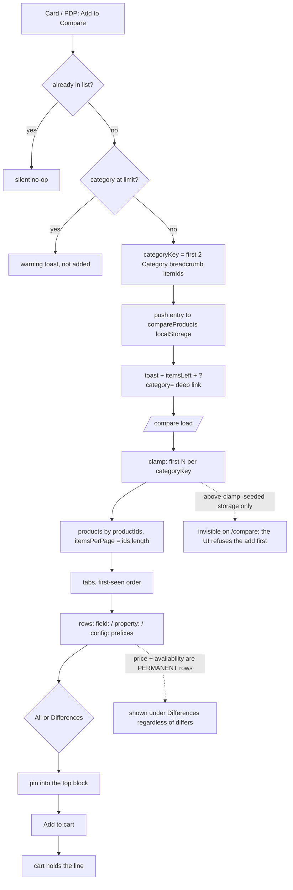
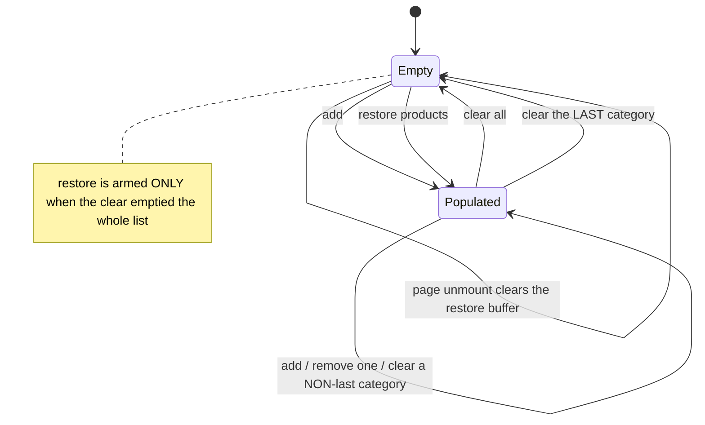

TEST MODEL — VCST-5735

Ticket:      VCST-5735 | Type: Story | Status role: testable | Flow: feature-test | Priority: P2 (Medium) | Path: FULL | Changed: Frontend
Context:     ba-system-analyzer (1c) + direct reading of PR #2452 at head `d1e45b04`
Affected surface: `vc-frontend` PR #2452 (OPEN, 30 files +4062/−601), live on vcst-qa as theme
  `2.57.0-pr-2452-d1e4-d1e45b04` (footer-verified); Platform 3.1063.0. New `compare-table.vue` (689 L) +
  `useCompareAddToCart`/`useCompareTableRowPins`; `useCompareProducts`/`useCompareProductsPage` rewritten;
  `product-card-compare.vue` REMOVED; `+breadcrumbs { itemId }` in 5 catalog `.graphql` docs. All 13
  locales updated, stale `clear_list_modal` key removed — i18n clean, no budget goes there.
Ticket signals: **the AC field reads `1. No requirements.`** — no ACs, no DoD, no comments. A design
  screenshot, a Figma link, and a **Claude Design prototype readable via DesignSync**, this run's only
  `{SPEC}` oracle (extract: scratchpad `vcst-5735-design-spec.md`). The PR declares breaking changes for
  forks, framing the storage-key change as a *fork* concern only. Epic: none. Domains: catalog-search.
  **Blast radius:** catalog listing, global search, recently-browsed, PDP recommendations, related products.
  **Boundaries:** compare ↔ card · PDP · cart · configurable products · localStorage (guest/auth,
  multi-tab, sign-out) · currency · org switch.
Risk areas: VC-CART-004 (`SILENT` addItem no-op) · VC-CART-006 (B2B stepper IS add-to-cart) · VC-LIST-001
  (a refused add at the limit is the guard working — do NOT file) · VC-UI-004 (state-dependent layout bugs
  are not duplicates) · VC-UI-005 (BL-UI-001..006 uncovered since `048b`) · VC-DEPLOY-001. Sibling
  precedent **VCST-5831**: a 375 px multi-product grid truncated every name. AC traceability: 74 atomic
  conditions from 1d (11 bullets + gap-ACs) — 8 SATISFIED · 6 DRIFT · 2 CONTRADICTS · 19 NOT-FOUND.

--- Part 0 — VALUE CHAIN (derived FIRST) ---

Value chain:
  L1 the customer clicks "Add to Compare" on a card or PDP → the product is remembered, tagged with the
     category it sits in, and refused if that category is already full
  L2 → an `ICompareProductEntry {productId, categoryKey, localId?}` is appended to the list
  L3 → it persists to `localStorage["compareProducts"]`, surviving reload, new tabs and sign-in
  L4 → on `/compare` entries are clamped per category, fetched by id, grouped into tabs, and rendered one
     column per entry × one row per characteristic
  L5 → the customer narrows to Differences, pins, removes or clears — the table answers "which one"
  L6 → the winner goes to the cart from the table, and the cart really holds that line






```mermaid
sequenceDiagram
  participant U as Customer
  participant LS as localStorage
  participant P as /compare
  participant X as xAPI
  U->>LS: add {productId, categoryKey}
  U->>P: open /compare
  P->>LS: read + clamp per category
  P->>X: products(productIds, itemsPerPage = ids.length)
  X-->>P: products deduped by id — entry↔product re-paired locally
  loop per CONFIGURED entry only
    P->>X: createConfiguredLineItem(context read ONCE at setup)
    Note over P: on rejection → Logger.error only,<br/>row falls back to the BASE price (scenario 13)
  end
  P-->>U: tabs + rows; price + availability always shown (PERMANENT_ROW_KEYS) — scenario 10
```

Variants: V1 plain · V2 configurable (localId + config sections; **file sections stripped** from the
identity key) · **V8 hasVariations** · V3 ≥2 Category crumbs · V4 exactly 1 · V5 zero (→ `uncategorized`)
· V6 guest vs signed-in · V7 desktop vs mobile (<`md`)

> **Variants are partitioned by RENDER branch, not by entry identity — corrected after V8 was missed.**
> `compare-table.vue` branches three ways (`isConfigurable` → customize link · `hasVariations` →
> variations link + count · else → add-to-cart), while `useCompareProducts.ts` branches only two ways
> (configurable-with-sections vs everything else) because its job is *entry identity*. The first draft
> took its variants from the identity layer, so V8 had no row to be uncovered in.

Mechanism coverage matrix (variants × links — no blank cells):

| | L1 add | L2 entry | L3 persist | L4 render | L5 interact | L6 cart |
|---|---|---|---|---|---|---|
| V1 plain      | 1 | 1 | 8 | 1 | 6,7 | 2,14 |
| V2 config     | **19** | **19** | **19** | **19**,17,18 | WAIVED — pin/filter are row-level, variant-independent | 12,13 |
| **V8 variations** | **20** | **20** | **20** | **20,21** | WAIVED — row-level, variant-independent | **20** — no add-to-cart control exists by design |
| V3 ≥2 cats    | 1 | 1 | 8 | 1 | 6 | 14 |
| V4 exactly 1  | 6 | 6 | 6 | 6 | WAIVED — same row engine as V3 | WAIVED — same as V1 |
| V5 zero cats  | 6 | 6 | 6 | 6 | WAIVED — one tab, same row engine | WAIVED — same as V1 |
| V6 guest/auth | 15 | 15 | 15 | 15 | WAIVED — no auth branch in the row engine | 14 |
| V7 mobile     | WAIVED — add happens on catalog/PDP, not this surface | n/a | n/a | 3,9 | 3 | 3 |

Reverse edges: add → remove one column (7) · add → clear category / clear all (3 — its mobile
unreachability IS the finding) · clear all → restore (5) · pin → unpin (6). **ABSENT IN PRODUCT, all three
stated so the blank reads as a decision:** add to cart → remove from cart (the cart owns removal, correct,
not a finding) · lower `product_compare_limit` → re-admit (**a finding** — clamping is one-way, so entries
above a lowered clamp are unreachable except via Clear all, scenario 4) · re-categorize → re-key the entry
(**a finding** — `categoryKey` is persisted at add time and never re-derived, scenario 11).

Fixture lifecycle: no terminal state, so fixtures are reusable — **but `localStorage["compareProducts"]` is
per-profile shared state and two suites on one lane WILL collide**, so every case clears the key first.

--- Parts 1–5 — FAULT MODEL ---

Condition space:
  storage state  : empty | v1 legacy payload | v2 payload | above-clamp payload | corrupt JSON
  product kind   : plain | configurable | **hasVariations** | two configs of ONE parent | configs
                   differing only by a file section
  qty constraints: uniform across products | **divergent** (min/max/pack/available differ)
  category depth : ≥2 Category crumbs | exactly 1 | zero | parent-vs-child pair
  per-cat fill   : below limit | exactly at limit | above limit
  filter         : All | Differences
  viewport       : ≥`md` | <`md`
  session        : guest | signed-in | signed-in then org switch
  currency       : store default | switched while on /compare
  Raw cells = 5·3·2·4·3·2·2·3·2 = 8,640

Reduction: 8,640 → 18. Dropped, and what subsumes them: `viewport` → two rows (3 the functional loss,
9 the geometry) since the row engine is viewport-independent and only *which controls exist* changes below
`md` · `session` → 15, there being no auth branch anywhere in the compare path · `per-cat fill` "exactly at
limit" → 4, because the refused add is VC-LIST-001's guard working and must not be filed, so only the
ABOVE-limit state is a defect surface · `filter` × pinning → 6, pinned rows being filter-exempt by
construction · `corrupt JSON` → 8, same parse path as the legacy payload. **NOT dropped:** `qty
constraints: divergent` (2) — the sole trigger of the recursive-update hypothesis, subsumed by nothing.

Test scenarios (18 rows):

| # | Cell | Defect hypothesis — what breaks, and why it plausibly would | Archetype | Technique | Oracle | P |
|---|---|---|---|---|---|---|
| 1 | [JOURNEY] plain · ≥2 cats · 2 tabs · All→Differences · pin · add to cart | The chain never completes end to end: the product lands under the wrong tab, the row engine hides the row being decided on, or the cart does not actually gain the line (VC-CART-004). **No case in the corpus crosses this chain today.** | SILENT | FLOW | {SPEC} prototype + BL-CART-007 | Critical |
| 2 | ≥2 plain products in one tab with **divergent** min/max/pack/available quantities | `isAddToCartDisabled` is called per product per render **from the template**, and it WRITES four refs then READS `quantitySchema` — a `computed` over those same refs. Reading a computed during render subscribes the render effect to its deps; writing them in the same render is the textbook Vue recursive-update pattern. It converges only if the values stop changing between passes, so divergent constraints plausibly never settle → `Maximum recursive updates exceeded`, CPU spin, frozen table. Uniform constraints look fine, which is exactly why it could ship. | RENDER | ST | {HYPOTHESIS} → PROPOSED-BL-CAT-018 | Critical |
| 3 | <`md`, populated list | **A mobile customer cannot clear a category and cannot clear the list.** `compare-table__clear-category` is `hidden` below `md`, `compare-products__actions` (holding Clear all) is `hidden` below `md`, and the overflow (⋯) menu the description says should hold those secondary actions was never built. The only removal path left is the per-product trash control. This is functional loss, not styling. | FALLBACK | ST | {SPEC} ticket bullet 9 → PROPOSED-BL-CAT-017 | Critical |
| 4 | above-clamp payload (reached by lowering `product_compare_limit`, or via 5) | `clampedProducts` truncates per category and is what the page renders, but `isInCompareList` reads the RAW array. So the catalog card shows "Remove from Compare" (`:active`/`:aria-pressed` bind to it) for a product that never appears on `/compare`, re-adding is a silent no-op, and only Clear all recovers. | SILENT | ST | {HYPOTHESIS} → PROPOSED-BL-CAT-014 | Critical |
| 5 | clear all → add product X in a second tab → restore | `restoreProducts` appends `lastRemovedEntries` with **no dedupe and no limit re-check**. `useLocalStorage` syncs cross-tab, so restoring after the list changed underneath duplicates X or pushes the category above its limit — landing in scenario 4's stuck state. | RACE | ST | {HYPOTHESIS} → PROPOSED-BL-CAT-014 | High |
| 6 | exactly 1 product in a tab, Differences on; and V5 zero-category products | `differs` requires `>1` product, so with one product nothing differs and Differences renders an empty board that reads as a loading failure — the spec supplies a dedicated message. Same row covers the `uncategorized` tab rendering with a real label (a zero-category product is NOT lost). | FALLBACK | BVA | {SPEC} "Add one more product to this category to see differences." | High |
| 7 | 3 products, remove the middle column | Removal is index-based in a transposed grid; it can drop the wrong entry, or orphan `localProductConfigurations` for a configurable neighbour. Reverse edge for L1. | LIFECYCLE | ST | {SPEC} prototype remove semantics | High |
| 8 | v1 legacy payload in localStorage; and corrupt JSON | Both old keys are **deleted from the codebase**, not renamed, and nothing reads them. Every existing customer's compare list silently resets to empty on deploy, the orphaned keys stay in the browser forever, and "Restore products" cannot help because the buffer is in-memory and empty on a fresh load. | SILENT | EG | {HYPOTHESIS} → PROPOSED-BL-CAT-013 | High |
| 9 | <`md`, ≥3 products in one tab | Locked label column + 2 product columns must fit, the DOCUMENT must not scroll (BL-UI-004 exempts the table's own scroller, not the page), and names must stay legible at `w-28` (112 px). VCST-5831 is this exact shape on a sibling surface. | RENDER | ST | BL-UI-004 + BL-UI-005 + BL-UI-006 | High |
| 10 | two products whose values differ but **format identically** | `differs` is computed over FORMATTED strings — price via `formattedAmount`, numbers via `n()`, availability via a signature bucketed on `MAX_DISPLAY_IN_STOCK_QUANTITY`. Two genuinely different values that render alike are judged identical and HIDDEN by the Differences filter — the filter silently removes the row the customer needed. | MONEY | EP | {HYPOTHESIS} → PROPOSED-BL-CAT-016 | High |
| 11 | parent-category product + child-category product; then re-categorize a product in Admin | `"electronics"` ≠ `"electronics/laptops"`, so a parent product never shares a tab with its children — and since the tab label is the LAST crumb's title, **both tabs can carry the same visible label**. Worse, the key is persisted at add time while the label is derived at render time, so re-categorizing yields two identically-named tabs with split contents, permanently. | PARITY | EG | {HYPOTHESIS} → PROPOSED-BL-CAT-015 | High |
| 12 | configurable product on the compare table | Configurable and has-variations products branch to a PDP **link**, never to add-to-cart, so `addToCart(id, qty)` is never called without a configuration. That satisfies BL-CAT-006 by routing around it rather than validating — the safe shape. Verify the round trip: the link carries `localId`, and the PDP restores from a parallel localStorage key with **no consistency check**, so an orphaned `localId` gives a "customize" link to a PDP with nothing preselected. | FALLBACK | ST | BL-CAT-006 | High |
| 13 | configured entry whose `createConfiguredLineItem` mutation fails | The watcher swallows a rejected mutation to `Logger.error`, so a failed configured price falls back to the BASE product price with no user-visible error — the customer compares and may buy against a price that is not the configured one. | SILENT | EG | {HYPOTHESIS} → PROPOSED-BL-CAT-018 | High |
| 14 | plain product at MOQ / pack-size, Add to cart from the table | v1 had a quantity stepper; v2 has one CTA, so a single click must add a VALID quantity (`minQuantity \|\| 1`, rounded up to a pack multiple). This is a THIRD add-to-cart surface after PDP and quick-add (VC-CART-006). Assert the RENDERED cart, not the response (VC-CART-004). Include MOQ-not-a-multiple-of-pack-size. | BOUNDARY | BVA | BL-CART-006 + BL-CART-007 + BL-CAT-001 | Critical |
| 15 | signed-in, populated list, switch organization | BL-CROSS-008 requires cart/pricing/lists to swap ATOMICALLY; a partial swap is called a critical bug. `compareProducts` is localStorage-backed and nothing in the diff writes it on org change, so the previous org's comparison — and its prices — persist across the switch. Same mechanism leaks a list between users on a shared machine at sign-out. | SCOPE | ST | BL-CROSS-008 | Critical |
| 16 | same configurable product added twice, configurations differing ONLY in a file section | `withoutFileSections` strips file sections before computing identity, so two visibly different configurations are the SAME entry and the second add is a silent no-op with no feedback. | SILENT | EP | {HYPOTHESIS} → PROPOSED-BL-CAT-019 | Medium |
| 17 | configurable product with two configuration sections sharing a display label | `add-to-compare-catalog.vue` dropped `id` from the properties payload and config rows are now keyed by **label**, so two sections with the same display name collapse into one row — one section's value is simply not shown. | SILENT | EP | {HYPOTHESIS} → PROPOSED-BL-CAT-019 | Medium |
| 18 | currency (and culture) switched while on `/compare` | `globals` (storeId, currencyCode, cultureName) are read ONCE at setup and products refetch only when `productIds` changes. Row labels are reactive via `t()`, but fetched products, formatted prices and configured line-item prices may not refresh. BL-PRICE-005: no exchange-rate conversion, and a product with no price list in the target currency is unavailable — the open P1 `£0.00` bug shows a multi-product price grid is the vulnerable shape. | MONEY | ST | BL-PRICE-005 + BL-CROSS-004 | High |

Accessibility findings are tracked but do NOT gate this story (`triage.md` §7a — each files as its own
standalone ticket at real severity): **A1** the header is a *separate* `<table>` so `scope="col"` cannot
associate across it, and every table element is overridden to `block`/`flex`, stripping implicit roles — a
screen reader gets an unlabelled value sequence with no product↔attribute association, the one thing a
comparison table exists to convey (WCAG 1.3.1); ECL-15.1 §15 says this violates no `BL-A11Y-*` rule as
written, so it is a `PROPOSED-BL` candidate too · **A2** both scrollers lack `tabindex`/`role`/label and
the header one hides its scrollbar (WCAG 2.1.1) · **A3** neither tab set is a `tablist` · **A4** the
tooltip trigger is a bare `VcIcon`, not focusable, and `hidden` below `md` (ECL-7.4 r5). Credit where due:
focus IS handled deliberately on the compact/full swap, on remove and in the empty state.

Probes carried in: VC-CART-004 → 1,14 · VC-CART-006 → 14 · VC-LIST-001 → 4 (guard; do NOT file the refused
  add) · VC-UI-004 → 6,9 · VC-UI-005 → 9 · VC-LOY-001 → N/A: it enumerates the currency-revert surfaces and
  compare is NOT among them, so compare's currency behaviour is *unspecified* — which is why 18 observes
  rather than asserts a revert.
Archetype sweep: SILENT 1,4,8,13,16,17 · RENDER 2,9 · FALLBACK 3,6,12 · RACE 5 · LIFECYCLE 7 · MONEY 10,18 ·
  PARITY 11 · BOUNDARY 14 · SCOPE 15 · CONFIG → 4 (the `product_compare_limit` drop) · STALE WAIVED — no
  cache/index/projection layer added, products fetched fresh per load · REPLAY WAIVED — no idempotency key
  or retried effect here.
UIP sweep: UIP-DATA → 6,9 · UIP-STORAGE → 4,5,8 · UIP-TABS → 5 · UIP-VIEW → 3,9 · UIP-DEEP → 1 (the
  `?category=` deep link) · UIP-REFRESH → 5 (the restore buffer is page-scoped, so a refresh must NOT
  resurrect) · UIP-NET → 13 · UIP-BACK WAIVED — no submit/settlement step · UIP-EXPIRE WAIVED — compare is
  anonymous-capable · UIP-INPUT WAIVED — no form input.

Business Rules: BL-CROSS-008 · BL-CROSS-004 · BL-CART-001/006/007 · BL-CAT-001/006 · BL-PRICE-005 ·
  BL-SRCH-002 · BL-UI-003/004/005/006 · BL-A11Y-001..004 · **BL-B2B-001** (org switching isolates cart,
  addresses and lists — a stronger oracle for row 15 than BL-CROSS-008 alone, since compare IS a list).
  **NO `BL-*` invariant exists for compare itself** — every rule above is borrowed, so the corpus records
  compare's behaviour rather than judging it. **Seven proposed at 5e, none minted here**, each the oracle a
  `{HYPOTHESIS}` row awaits: -013 a selection survives a release · -014 the limit is enforced at add and no
  entry is counted in-list while unrenderable · -015 every entry reachable in exactly one uniquely-labelled
  tab · -016 Differences hides only on equal VALUES · -017 every promised control reachable at every
  viewport · -018 no recursive-update errors, no silent base-for-configured price · -019 distinguishable
  configurations are distinct entries.
Edge cases: ECL-3.2 r4 (browser-storage persistence) · ECL-12.1 r1 (currency is a stored preference applied
  via full reload) · ECL-7.4 r5 (hover-only affordance unreachable on touch — A4) · ECL-1.4/1.6 ·
  ECL-15.1 r2 (structure not exposed — A1).
Docs grounding: the published guide is v1 only and states "Only 5 products can be compared at a time" — a
  **global** cap. Per-category is deliberate here, so the DOC is now wrong in the way that matters most:
  an admin sizing `product_compare_limit` from it gets `5 × N categories`. Feeds 5h. **Agents:**
  qa-frontend-expert (chrome) · ui-ux-expert (DevTools) · test-data-engineer (3a) · 3x discovery.

## Step 3x + authoring — groundings and corrections

Part 0 unchanged; this amends scenario rows only. **Four of five reachable hypotheses were REFUTED**, which
is the whole argument for running this lane before authoring — authored blind, five cases would have
asserted behaviour the product does not have.

| # | Outcome | Grounding |
|---|---|---|
| 3 | **GROUNDED** | At 375 px both clears are **present in the DOM and CSS-hidden** (`Clear all`'s wrapper; the `Clear category` button itself). No ⋯ menu exists. Per-product remove survives; Restore is desktop-gated. A **stylesheet responsive-visibility defect, not an unimplemented feature** — corrected at the Step-3 gate, where a computed-style check on a second lane disproved an earlier "absent from the DOM" reading. |
| 2 | REFUTED (observable half) | 3 divergent-constraint products painted fully and stayed interactive, zero Vue warnings. **Production build — the recursive-update warning is dev-only, so it could not appear either way.** The write-during-render pattern is UNSETTLED; it needs a unit test. |
| 4 | REFUTED via the UI | The clamp fires at ADD time: the 6th add is refused with a toast. The ghost state is unreachable through the storefront; a pre-existing over-limit payload was not probed. |
| 5 | REFUTED (impossible) | Restore exists only in the empty state and any add removes it, so Restore and a non-empty list cannot coexist. Clear all is additionally confirmation-gated. |
| 6 | REFUTED | At N=1 the toggle is **disabled** and all rows render — no empty board. The counter then reads `Differ: 0 of 15` above 15 rendered rows. |
| 10 | Observation real, **mechanism unsettled** | Three states kept apart: the customer-visible complaint (a row under Differences whose two cells read alike) is REAL; the mechanism is that price and availability are **`PERMANENT_ROW_KEYS`**, shown by design — which already explains it; so raw-vs-capped is **NOT established** (`getAvailabilitySignature` caps at the same threshold the cell renders, which would HIDE the row). CMP-010 asserts only the invariant that can bite: no **non-permanent** surviving row may render two indistinguishable cells. |
| 8, 11, 15 | NOT REACHED | Legacy payload · parent-vs-child tabs · org switch — unexplored, **not** clean. |
| — | NOT REACHED | The sticky collapse and site-header overlap went unprobed — the v1 regression surface this ticket exists to fix. Carried to Step 4's visual lane. |

**Fixture gap, stated rather than papered over:** the code-grounded indistinguishable-cells shape needs two
OUT-OF-STOCK products in one tab with differing `isAvailable`; none is seeded, so that shape is uncovered.

Net-new, all PROMOTE (authored this run): Clear all is confirmation-gated with a live count · cross-tab sync
is live, not reload-gated · the header counter is tab-scoped while the nav badge is global · Restore is not
a strict round-trip (the active tab changes) · `Differ: 0 of 15` renders above 15 rows. Authoring added a
sixth: **`__row-pin` and `__row-info` are hidden below `md` and browser zoom crosses that breakpoint — at
400% a desktop user loses pinning, tooltips and Clear category** (CMP-031). Oracle feedback →
`/qa-review-oracles` proposals only: a `Differ: 0 of N` readout beside a disabled toggle has **no oracle**
(spec rule 3 sanctions it), so CMP-006 asserts only that M matches the rendered count.

### Coverage gaps closed after the matrix was re-derived from the CHAIN

Two mechanisms had no scenario. **Both matrices showed no blank cell**, which is how they survived — the
V2 row was filled from the rewritten scenario table (17,18) instead of from the chain, so a dropped
mechanism could not present as a hole. The matrix stopped being an independent check and became a
restatement of the list it was meant to check. Rows 19–21 close it; V8 above closes the variant axis.

| # | Cell | Defect hypothesis | Archetype | Technique | Oracle | P |
|---|---|---|---|---|---|---|
| 19 | ONE configurable parent added TWICE with two genuinely different configurations (`CFG_LAPTOP`: RAM $0/$250/$100 × Storage $75/$0/$150) | **The headline capability of compare-for-configurables, and nothing asserted it.** GraphQL dedupes products by id, so `ICompareDisplayProduct {product, entry}` exists solely to re-pair each entry with its product and render one column PER ENTRY. If that pairing collapses, the customer configures a laptop two ways, adds both, and compares a product with itself — or sees one column and assumes the second add failed. Row 16 tests only the degenerate sibling (configs differing ONLY by a file section, which are *meant* to collapse), and it already found a silent no-op there, so the general path has real reason to be suspect. | SILENT | ST | {SPEC} prototype: one column per entry | **Critical** |
| 20 | a `hasVariations` parent in a compare tab | The third render branch. It must show a **variations link carrying `variations.length + 1`** and **no add-to-cart control** — so CMP-014's MOQ/pack premise does not apply to it, and a stray add-to-cart here would bypass variant selection entirely. | FALLBACK | EG | {SPEC} `pages.catalog.variations_button` | High |
| 21 | a `hasVariations` parent beside plain products, price row + Differences | `getDisplayPrice` returns **`minVariationPrice`** for a variations product and feeds BOTH the price cell (with a "From" label) and the `differs` signature — `items.map(({product}) => getDisplayPrice(product).actual.formattedAmount)`. So the price row compares **minimum-variation** prices against plain products' actual prices. Two products can therefore read as equal-priced when their real prices differ, or vice versa, on a **permanent** row the Differences filter always shows. | MONEY | EP | {HYPOTHESIS} → PROPOSED-BL-CAT-016 | High |

**Fixture status:** 19 needs none — `CFG_LAPTOP` already carries two required sections with priced options,
so two configurations produce different totals and different config rows. 20/21 need a **seeded variation
parent whose `minVariationPrice` differs from its `price`** — `INV_VARIATION_MASTER` reports both as
`$59.99`, and a 54-product catalog sample found **zero** variation parents with any spread, so a case built
on what exists would pass vacuously whichever branch ran. Seeding is in flight; if the spread cannot be
created, 21 is **UNCOVERED and says so** rather than running against an undiscriminating fixture.

**Also uncovered, stated:** the PR unit-tests a fallback for `hasVariations` true with `minVariationPrice`
**missing**. No storefront fixture reaches that state and it may not be reachable at all — recorded as a
question about testability, not assumed benign.
