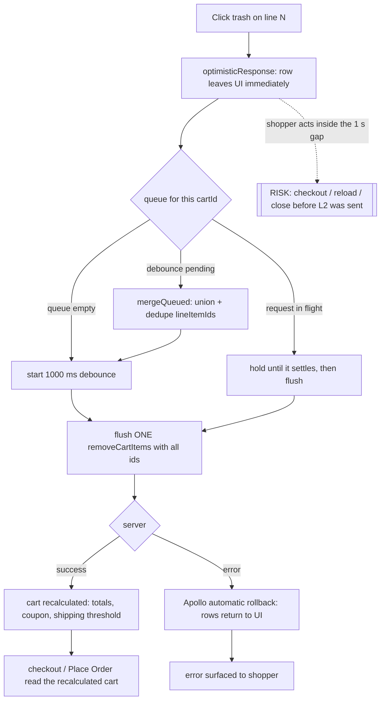
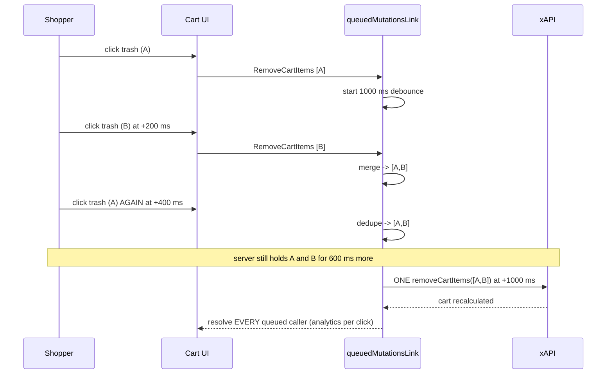
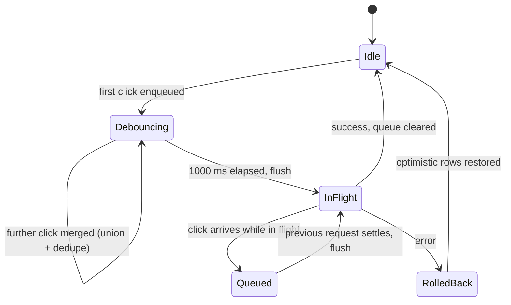

TEST MODEL — VCST-5738

Ticket:      VCST-5738 | Type: Review task | Status role: fix-ready | Flow: feature-test | Priority: Medium (P2) | Path: FULL | Changed: Frontend
Context:     inline (see Deviation note at the foot) — not `ba-system-analyzer`
Affected surface: `vc-frontend` @ PR #2442 (open, unmerged, APPROVED 2026-08-25) — storefront. Code site
             `client-app/core/api/graphql/config/links/queued-mutations/queued-mutations.ts` (+20/-2): adds
             `removeCartItemsConfig` and registers a SECOND target on the shared `queuedMutationsLink`,
             which already serves `UpdateShortCartItemQuantity`. Deployed & CONFIRMED live on vcst-qa from
             the served bundle `/assets/index-Nzn__LiE.js` — not merely PINNED.
Ticket signals: NO description beyond the PR link, NO ACs, NO STR, NO attachments, NO comments (auto-created
             wrapper) — all load-bearing signal is the PR body, an unusually complete RCA. Origin: ~78
             `LockError "Service is busy."` in 30 days, ~90% on `RemoveCartItems`; one burst = 21
             failures/minute with 21 DISTINCT Operation Ids (concurrent, not retries). TWO gaps the AUTHOR
             declares: (a) could NOT reproduce two clicks inside one 1 s window via automation (round-trip
             latency > 1 s) — merge/partition proven by UNIT TEST ONLY; (b) NOT load-tested against a live
             lock, and the two backend contributors (recalc cost, lock wait/hold) are out of scope.
Epic context: none — no parent Epic, no issue links, no sub-tasks.
Domains:     purchase-flow (cart)
Flows & boundaries: cart <-> checkout · cart <-> mini-cart · cart <-> SharedCart route (`_useFullCart(cartId?)`) ·
             `RemoveCartItems` <-> `UpdateShortCartItemQuantity` (now SIBLING targets on ONE link) ·
             cart <-> coupon/promotion engine · cart <-> shipping threshold
Risk areas:  VC-CART-005 `RACE` — "quick adds/removes can leave the visible total out of sync with the
             server total for 1-2 s during async settle"; this PR ADDS a 1 s debounce to that SAME surface,
             so it may WIDEN that window · VC-CART-001 `STALE` Apollo cache · VC-EXEC-005 `CONVENTION`
AC traceability: none — a Review task declares no ACs, so `1d` was skipped. The 8 atomic conditions below
             are gap-ACs derived from the PR's own claims; each is a claim the PR makes about itself:
               G1 at most ONE `RemoveCartItems` in flight at any click speed · G2 merged request carries
               the UNION of clicked ids, deduped · G3 no id ever re-sent (each flush clears its own queue) ·
               G4 two different `cartId`s never merge · G5 own cart (no `cartId`) always routes to the one
               default queue · G6 EVERY queued caller's promise resolves when the batch settles (per-click
               analytics survive) · G7 the original `optimisticResponse` survives, with Apollo's automatic
               rollback on failure · G8 it eases off under load (slower server => fewer, bigger requests)
             Deliberately NOT an AC: "the production `LockError` disappears" — the PR explicitly disclaims it.
DoD:         none declared.

--- Part 0 — VALUE CHAIN (derived FIRST) ---

Value chain — `purchase-flow` had `UNDECLARED` purpose in `functionality-map.md` (1 of 13 domains had one); this establishes the removal sub-chain:

  L1  I click the trash icon on a cart line          -> the row disappears at once (optimistic)
  L2  my click is queued, merged with any other
      clicks in the 1 s window, sent as ONE mutation -> the server cart drops exactly those lines
  L3  the server recalculates the cart               -> subtotal, discounts, coupon validity,
                                                        free-shipping threshold, tax all follow
  L4  checkout and Place Order read THAT cart        -> the order contains exactly what I left in it
  L5  I reload, or come back later                   -> the cart still shows what I removed
  Unlocks: correcting a cart before paying — and paying for exactly what I chose.

The change inserts a 1000 ms gap between L1 and L2, so L1 is now unconditionally ahead of the server. Every hypothesis below is a consequence of that gap, or of the merge that fills it.

Variants — from the layer that BRANCHES: `queuedMutationsLink` itself. It branches on one thing of its own (`getPartitionKey`) and is shared with a sibling target, so the union is:

  V1  Own cart — `cartId` undefined => partition key `""` (the default queue)
  V2  Shared cart — a concrete `cartId` => its own independent queue (the SharedCart route)
  V3  Interleaved with `UpdateShortCartItemQuantity` — the sibling target on the SAME link

Mechanism coverage matrix — columns = chain links, rows = variants (both from Part 0, never read back off the scenario table). No blank cells:

|        | L1 optimistic UI | L2 queue+merge+send | L3 recalculation | L4 checkout reads | L5 persistence |
|--------|------------------|---------------------|------------------|-------------------|----------------|
| **V1** | 1, 13            | 1, 2, 3, 12, 16     | 1, 9, 10         | **4**             | 5, 6, 15       |
| **V2** | 7                | 7                   | GAP — no fixture can reach a shared cart's totals (see Fixture lifecycle) | GAP — SharedCart has no checkout of its own | 7 |
| **V3** | 11               | 11                  | 11               | WAIVED — quantity-change -> checkout is pre-existing coverage (028 CART-016..018), unchanged by this PR | WAIVED — same |

Reverse edges — per forward effect:

  - line removed from cart -> re-add restores it -> covered by 6
  - batched mutation FAILS -> Apollo automatic optimistic rollback restores ALL merged rows -> covered by 8
  - removal drops cart below a coupon's minimum-order threshold -> does re-adding restore the coupon?
    -> UNVERIFIED — candidate `ABSENT IN PRODUCT`; a finding to report, not a blank (probed by 10)
  - removal drops cart below the free-shipping threshold -> shipping cost returns -> covered by 9

Fixture lifecycle: cart state is per-session and non-terminal, so V1/V3 need no disposable fixture. V2 is
the exception and is why `data_surface: true` — NO shared-cart fixture exists in `test-data/` or
`scripts/seed-data/` (grepped), so the very partition key `getPartitionKey` was added for is undecidable
from data. Step 3a must supply one or V2's L3 stays `GAP`.

--- Parts 1-5 — FAULT MODEL ---

Condition space:
  F1 clicks in one window     : 1 · 2-3 · >10
  F2 inter-click timing       : <1000 ms (merges) · >1000 ms (separate) · while a request is in flight
  F3 duplicate id             : no · same id clicked twice
  F4 partition                : own cart · shared cart
  F5 shopper next act         : nothing · reload inside 1 s · go to checkout inside 1 s · place order inside 1 s
  F6 server outcome           : success · error
  F7 cart composition         : plain multi-line · coupon AT its minimum threshold · cart AT the
                                free-shipping threshold · mixed-currency (loyalty) lines
  Constraints: F3=duplicate requires F1>=2 · F5=place-order requires a checkout-eligible cart ·
               F4=shared cart has no checkout of its own (so F5 is limited to nothing/reload there)
  Raw cells N = 3*3*2*2*4*2*4 = 1152

Reduction: 1152 -> 16. EP on F1 (the >10 class exists only because the PR REMOVED the previous 10-id
`overflowed` cap, so "no cap" is an untested claim rather than a boundary). F2 keeps all three classes —
they are three DIFFERENT code paths (fresh debounce / merge / queue-behind-in-flight), not value classes of
one. Collapsed: F6=error probed once (8), rollback being Apollo-generic and not per-variant; F7's coupon and
shipping classes probed once each (10, 9) against L3 rather than crossed with F1-F2, since recalculation is
downstream of the merge and cannot see how many requests produced it; mixed-currency DROPPED, subsumed by
9/10 (`BL-LOY-*` owns that split and this PR touches no currency code). F5 is NOT collapsed: it is the only
factor that reads the 1 s gap from the shopper's side, and it carries the highest-severity hypothesis.

Test scenarios (16 rows — Step 3 authors from these):

| # | Cell (factor values) | Defect hypothesis — what breaks here, and why it plausibly would | Archetype | Technique | Oracle | P |
|---|---|---|---|---|---|---|
| 1 | [JOURNEY] remove 3 of 5 lines in a burst, then buy the rest | The whole chain: a merged removal must leave the server cart, the recalculated totals AND the placed order agreeing. mechanism: L1 is optimistic and L2 is deferred, so UI/server/order can disagree at three separate seams | RACE | FLOW | {BL} BL-CHK-006 | Critical |
| 2 | F1=2-3, F2<1000 ms, F3=duplicate | Merged request omits an id, or re-sends one. mechanism: `mergeQueued` unions the two `command.lineItemIds` arrays and keeps only the first request other command fields | REPLAY | EP | {OBSERVED} + VC-EXEC-005 second source | Critical |
| 3 | F1=2, F2=while-in-flight | Two `RemoveCartItems` concurrent against one per-user lock — the exact production failure. mechanism: the queue-behind path is the PR core claim (G1) and is unit-tested only | RACE | ST | {OBSERVED} + VC-EXEC-005 | Critical |
| 4 | F5=checkout/place-order inside 1 s | Shopper pays for a line they removed. mechanism: `optimisticResponse` hides the line at L1 while the server still holds it for up to 1 s; nothing in the diff couples checkout navigation to the pending queue | MONEY | EG | {BL} BL-CHK-006 | Critical |
| 5 | F5=reload inside 1 s | Removal silently lost — row returns after reload, no error anywhere. mechanism: a queued mutation not yet flushed dies with the page; the leave-guard uses `hasQueuedMutations` but the PR states it is NOT wired to a per-field guard here | SILENT | EG | {OBSERVED} | High |
| 6 | F1=1 on a single-line cart | Last-line removal must reach a genuine server-side empty cart, not just an empty-looking UI | LIFECYCLE | BVA | {OBSERVED} · amends 028 CART-010 | High |
| 7 | F4=shared cart (V2) | Removal on a shared cart merges into the own-cart queue and removes from the WRONG cart. mechanism: exactly what `getPartitionKey` was added to prevent — the PR own stated risk (G4/G5) | SCOPE | DT | {BL} BL-CART-005 | Critical |
| 8 | F6=error after a 3-id merge | Rollback restores only some rows, or surfaces N error toasts for one failed batch. mechanism: every queued caller gets its own `observer.next()`/`complete()` (G6), so one failure fans out to N callers | FALLBACK | EG | {OBSERVED} | High |
| 9 | F7=cart AT free-shipping threshold | Batched removal crosses the threshold but shipping is not recalculated — one recalc for N removals instead of N | MONEY | BVA | {BL} BL-SHIP-003 | Critical |
| 10 | F7=coupon AT minimum-order threshold | Batched removal drops the cart below the coupon minimum and the coupon stays applied — and re-adding may not restore it (the unresolved reverse edge) | MONEY | BVA | {BL} BL-CART-003 | Critical |
| 11 | V3 interleaved remove + quantity change | The two sibling targets on one link interfere — a quantity change is lost, or merged into a removal. mechanism: both now share `queuedMutationsController`; only `RemoveCartItems` got a partition key | PARITY | ST | {OBSERVED} | High |
| 12 | VC-CART-005 probe: rapid removals, read totals after 2 s | The pre-existing `RACE` window WIDENS: the debounce adds up to 1 s to the settle the entry already describes | STALE | EG | {OBSERVED} · VC-CART-005 · ECL-1.3 | High |
| 13 | F1=>10, viewport sweep | Rows vanishing one-by-one from an optimistic list shift content under the cursor / break layout | RENDER | ST | {BL} BL-UI-001..005 | Medium |
| 14 | F1=2-3, analytics observed | Per-click analytics collapse to the last click in the burst — the regression the PR says it FIXED versus the earlier batcher (G6) | SILENT | EP | {OBSERVED} | Medium |
| 15 | UIP-TABS: two tabs, one cart | Both tabs key the same empty-string partition in separate JS contexts, so the merge cannot see across them — two concurrent requests survive, defeating G1 | RACE | ST | {OBSERVED} | High |
| 16 | UIP-NET: throttled server (G8) | Under load it does NOT ease off — the claim is that a slower server yields fewer, bigger requests | RACE | EG | {OBSERVED} | Medium |

Probes carried in: VC-CART-005 -> 12 · VC-CART-001 -> 12 · VC-EXEC-005 -> a filing CONSTRAINT on 2, 3, 15
(no network-payload finding filed without a second-source real-user repro) · VC-CART-003 -> N/A (legacy-cart
data-state) · VC-CART-002 / -004 / -006 -> N/A (add / consolidation / stepper, not the removal transport).

Archetype sweep: RACE -> 1, 3, 12, 15, 16 · REPLAY -> 2 · MONEY -> 4, 9, 10 · SILENT -> 5, 14 · SCOPE -> 7 ·
LIFECYCLE -> 6 · FALLBACK -> 8 · PARITY -> 11 · STALE -> 12 · RENDER -> 13 ·
BOUNDARY -> WAIVED (the PR introduces no numeric threshold; it REMOVED the previous 10-id cap, and that
absence is probed as an equivalence class at 13/16 rather than as a boundary) ·
CONFIG -> WAIVED (no store setting or feature flag gates `queuedMutationsLink`; `functionality-map.md`
attributes only `checkout_purchase_order_enabled` and `product_quantity_control` to this domain, neither
of which reaches this link).

UIP sweep: REFRESH -> 5 · TABS -> 15 · NET -> 16 · VIEW -> 13 · BACK -> WAIVED (removal is not a
submit-then-back flow; no navigation is part of the chain) · DEEP -> WAIVED (`/cart` takes no per-line deep
link) · EXPIRE -> WAIVED (session expiry on the cart is `BL-AUTH-*` surface, unchanged here) ·
STORAGE -> WAIVED (the queue is in-memory only; nothing is persisted to localStorage by this diff) ·
INPUT -> WAIVED (a trash icon takes no typed input) · DATA -> covered by 9/10 (cart composition IS the
data axis here).

Business Rules: BL-CHK-006 (order total formula) · BL-CART-003 (coupon + sale / minimum order) ·
BL-CART-005 (cart isolation per organization) · BL-SHIP-003 (free-shipping recalculates on cart change) ·
BL-UI-001..005 (layout stability, scenario 13).
Oracle GAP — a finding, not a blank: NO `BL-CART-*` invariant covers line-item REMOVAL. All 15 cart
invariants cover quantity, stock, coupons, currency, org isolation, pack size, configuration items. The
operation this PR changes has no correctness rule of its own, so every row above borrows an adjacent one.
Route to `/qa-review-oracles bl` as MISSING (business value `high` — a removal that does not persist is
P0-revenue — so it promotes at any demand).

Edge cases: ECL-1.3 stale-cart-total (via the VC-CART-005 cross-ref).

Docs grounding: VirtoOZ not consulted, deliberately — 028's CART-009/CART-010 already record
`Docs: N/A — implementation-detail` against this exact mutation, so intended behaviour is defined by source
+ contract. Contract grounded instead: `removeCartItems` -> `InputRemoveItemsType` in `graphql-schema.md`
refreshed THIS RUN (2026-09-04), fixtures 74/74 no drift — `lineItemIds`/`cartId` confirmed against live
introspection, not assumed.

Agents to dispatch: `qa-frontend-expert` (playwright-chrome — L1/L2/L4/L5, scenarios 1-12, 14-16) ·
`ui-ux-expert` (Chrome DevTools MCP — scenario 13, `visual_surface: true`) ·
`test-data-engineer` (browserless — the missing shared-cart fixture for V2).

--- Deviation note (stated, not hidden) ---
`1c` was run INLINE, not dispatched to `ba-system-analyzer`: the PR body is a complete RCA, the diff is 2
files, the contract was refreshed this run, and `2-map` shows one unrelated prior BA doc and zero prior
models. NOT covered as a result, and recorded as such: an independent live exploration of adjacent cart
flows. `1d` SKIPPED — a Review task declares no ACs; the 8 gap-ACs replace it.
