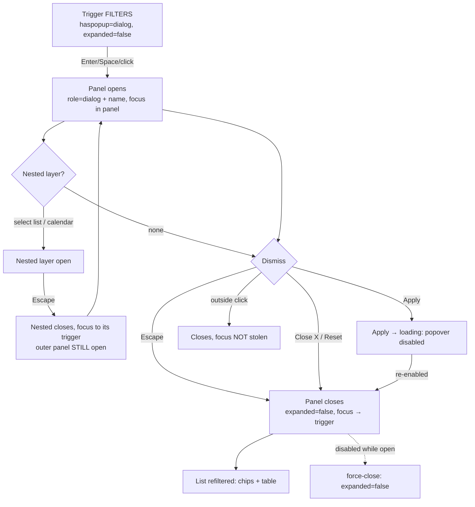
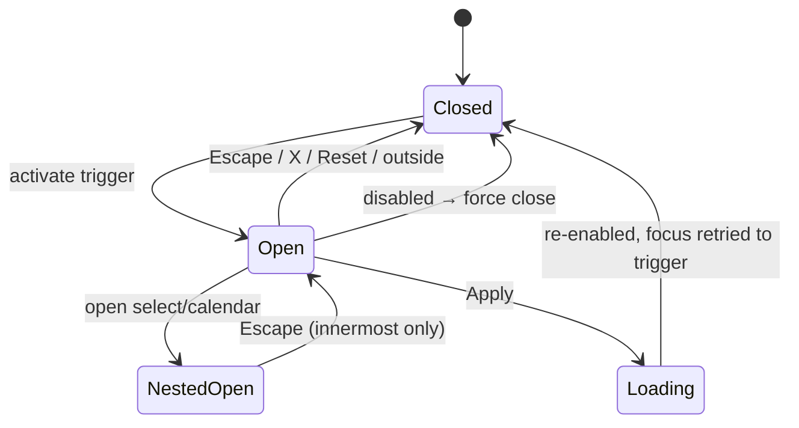

TEST MODEL — VCST-5869
Ticket:      VCST-5869 | Type: Story | Status role: fix-ready (READY FOR TEST → Testing at 1a) | Flow: feature-test | Priority: P1 (High) | Path: FULL (P1; reach exceeds diff — shared VcPopover/VcSelect) | Shape class: ui-kit | Changed: Frontend
Context:     ba-system-analyzer (1c, source + prior art; no live pass) + 1r REACHABLE (orchestrator-side)
Prior model: reports/ba/test-models/VCST-5733-2026-09-02.md (customer-orders surface; Part 0 = orders list, NOT the filters a11y contract) — carried as context only. First model for the popover a11y contract.
Domain map:  .claude/knowledge/domain/sales-rep.md @ rev 3 (generated 2026-09-18) — PRESENT, fresh (stale_after 60d)
Chain position: The rep-facing Customer-orders slice of the Sales-Rep chain (rep reads the served portfolio, L5b) — this ticket touches ONLY the *operate the filters control* sub-link (open → announce → operate nested layers → dismiss → refilter). It does NOT touch: rep creation/role grant, membership scope (BL-SR-002), the orders index/GraphQL contract, statistics, documents, layout. The changed CODE is wider than the chain: shared ui-kit (VcPopover, VcSelect, date pickers) reaches every popover/select consumer in the storefront — that reach is covered as regression rows, not as chain links.
Affected surface: vc-frontend (Layer 1 storefront) — modules/sales-rep/components/sales-rep-orders-filters.vue (route /company/customer-orders); shared/account/components/orders/orders-desktop-filters.vue + orders-filter.vue (route /account/orders ≥640px); ui-kit popover / select / date-picker / useCalendarPopover. Map MISSING (11b): the customer-orders page body + FILTERS panel + its controls, the customer-scoped orders route, the /account/orders filters (buyer domain) — reported to 5-docs-map as unmapped_surfaces.
Ticket signals: (1) Ticket table: role=dialog, aria-modal PRESENT, accessible name, Escape closes, focus returns to trigger. (2) Comment 2026-09-17 (A. Mitricheva, vcptcore-qa1, theme pr-2402): same defect on /account/orders desktop; mobile drawer "behaves the same"; Escape correctly closes nested calendar and returns focus to its input (so calendar handling must not regress). (3) Comment 2026-09-21: PR #2486 linked. (4) VIS-01 (1.63:1 date-input focus indicator) explicitly OUT of scope — pre-existing token defect.
Epic context: none (Story has no parent). Related: VCST-5733 (origin, Done), VCST-6004 (mobile filter drawer unnamed trigger / 19px inputs — Draft, distinct), VCST-6003, VCST-5866 (Cancelled duplicate).
Domains:     Sales Rep · Orders (account) · UI-kit (a11y)
Flows & boundaries: rep orders list ↔ filters ↔ chip row ↔ table refilter; account orders ↔ same filters; VcDialog focus trap ↔ VcPopover focus handoff; nested VcSelect / calendar ↔ outer panel Escape layering; header/mega-menu/tooltip popovers (shared haspopup derivation).
Risk areas:  Escape keyup→keydown + stopPropagation for every popover consumer; aria-haspopup now derived from role (mega-menu dialog→menu, tooltip loses attribute); VcSelect click/Enter/ArrowDown behaviour change (Enter no longer reaches a surrounding form while list opens); popover disabled now force-closes; artifact ≠ PR head. VC-* entries: none on popover/Escape/focus (VC-UI-001 applies: gated themes Coffee+Red only).
AC traceability: 1d skipped — ticket has no formal ACs; the Expected-vs-actual table is decomposed into atomic conditions C1–C6 below. **DRIFT (static): the ticket table says aria-modal "present"; the PR deliberately ships a NON-modal dialog (no aria-modal, no focus trap of its own).** Carried to execution to observe, and to 5-verdict as a Product question — never silently resolved (see Oracle tension).
   C1 panel role=dialog · C2 panel accessible name · C3 aria-modal (DRIFT) · C4 Escape closes panel · C5 focus returns to FILTERS trigger on close · C6 child calendars still role=dialog+name. Added gap-conditions: G1 nested layers consume Escape only while open · G2 same contract on /account/orders desktop (comment scope) · G3 shared-component regression (haspopup, Escape swallow, VcSelect keys).
DoD: none declared.

--- Part 0 — VALUE CHAIN ---
Value chain:
  L1 A keyboard/screen-reader rep reaches FILTERS and it advertises what it opens (aria-haspopup / aria-expanded / aria-controls)
  L2 Activating it opens a panel that is announced as a NAMED dialog and takes focus (role, accessible name, activeElement)
  L3 The rep operates the controls inside — created-date select, custom-range calendars, status + customer checkbox groups, Reset, Apply — and nested layers (select list, calendar) consume Escape one level at a time
  L4 The rep dismisses it (Escape / close X / Apply / Reset / outside click) — aria-expanded returns to false, focus returns to the trigger, nothing stays hidden-but-focusable
  L5 Apply/Reset refilters the list (chip row + table) — including through the loading disable/re-enable of the popover, which must not lose focus
  L6 (unlocks) the rep can complete a filter task with keyboard alone and assistive tech reports the true state at every step
Chain diagrams:

Variants (derived from the code that branches — source, 1c §2/§5, not from my scenario list): 
  V1 Surface: (a) sales-rep filters /company/customer-orders (popover at ALL widths) · (b) /account/orders desktop ≥640px (VcPopover) · (c) /account/orders mobile <640px (VcPopupSidebar+VcDialog — NOT touched by the PR)
  V2 Nested layer: none · VcSelect list · calendar (created-date Custom range → two date pickers)
  V3 Dismissal path: Escape · close X · Apply · Reset · outside click · disabled-while-open
  V4 Input modality: keyboard · pointer
  V5 Shared-consumer regression set: mega-menu (haspopup menu) · tooltips (no haspopup) · standalone VcDatePicker/VcDateRangePicker · role-less popovers (ship-to, push-messages, share, dropdown menus) · VcSelect in forms (checkout/address)
Mechanism coverage matrix (columns = chain links L1–L6; rows = variants; AXES derived from the chain/code above, scenarios mapped in AFTER):
  | Variant \ Link | L1 advertise | L2 open+name+focus | L3 operate/nested | L4 dismiss+restore | L5 refilter/loading | L6 unlock |
  | V1a sales-rep | S1,S2 | S1,S2,S4 | S1,S7,S8,S9 | S1,S3,S5 | S6 | S1 |
  | V1b account desktop | S13 | S13 | S13 | S13 | S13 | S13 |
  | V1c account mobile | S14 | S14 | S14 | S14 | WAIVED — sidebar apply path unchanged; observed only | S14 |
  | V2 nested select | WAIVED — not a link-1 property | S7 | S7,S11,S12 | S7 | S6 | S1 |
  | V2 nested calendar | WAIVED — as above | S8 | S8 | S8 | WAIVED — refilter by date covered by suite 097 | S1 |
  | V3 outside click / disabled-while-open | WAIVED — dismissal only | WAIVED | WAIVED | S5,S6 | S6 | WAIVED |
  | V4 pointer | S15 | S15 | S15 | S15 | S15 | WAIVED — S1 is the keyboard journey; pointer parity is S15 |
  | V5 regression set | S16,S17 | S18,S19 | S11,S12,S18 | S18,S19,S20 | GAP-none (no filter) → WAIVED — no refilter in these consumers | WAIVED |
Reverse edges: Escape/close ⇄ open (S3,S5) · nested Escape ⇄ nested open, outer stays (S7,S8) · aria-expanded true → false incl. force-close on disable (S6) · focus moved in → returned to trigger, and NOT re-stolen if the user moved on (S6) · Apply refilter ⇄ Reset restores unfiltered (S1). No reverse edge is ABSENT IN PRODUCT.
Fixture lifecycle: no terminal state. Uses existing rep fixture (agent-test-sr-primary, 15 pages of served-customer orders) and an org buyer with orders for /account/orders — read-only; nothing is consumed or seeded.

Oracle tension (must be decided by a human, recorded not resolved): BL-A11Y-001 requires a *modal* overlay to trap focus; the PR intentionally ships a NON-modal dialog (APG non-modal pattern: role=dialog, no aria-modal, no trap, Escape closes, focus returns). The ticket's own table demands aria-modal "present". Setting aria-modal=true on a panel that does not inert the page would itself violate 4.1.2 (announces a lie). So: C3 is observed and reported as `DRIFT vs ticket AC` with the technical reasoning — PASS WITH NOTES at most, never FAIL, and a question to the ticket owner. WCAG 2.1.2 (no keyboard trap) and 2.4.3 remain hard oracles.

--- Part 0r — ROLE SCENARIOS --- omitted: the matrix's variants are SURFACES, not roles. Rep and buyer run the SAME VcPopover code; role gates only which page renders. One fixture each is reached by S13; no server-side "Not allowed" is in play.

--- Parts 1–5 — FAULT MODEL ---
Condition space: surface(3) × nested layer(3) × dismissal(6) × modality(2) × loading(2) = 216 raw cells; + theme (gated Coffee/Red vs ungated) and viewport as separate axes. Constraints: mobile <640 has no popover (only sidebar); custom-range calendar exists only after Created date = Custom range; hover popovers have no Escape-owned focus.
Reduction: 216 → 22. Dropped `theme` — the diff carries no colour/token change (client-app has no .scss/preset edit in the 13 files) so theme cannot change the outcome; NOT swept, because switching the store preset is a durable write on shared vcst-qa (ui-kit-class §5, operator-gated) — recorded as WAIVED, run on the env's current preset (Coffee/Red gating stated, VC-UI-001). Dropped `modality × dismissal` full cross: t=2 pairs kept only where a mechanism differs (Escape vs Apply-loading vs outside-click); Close X and Reset share one handler path with Apply's close, subsumed by S5. Dropped `viewport` beyond {1440, 375}: the popover code is width-independent; 375 kept for the "no mobile branch" claim (S15).

Test scenarios (22 rows)
| # | Cell (factor values) | Defect hypothesis — what breaks here, and why it plausibly would | Archetype | Technique | Oracle | P |
|---|---|---|---|---|---|---|
| S1 | JOURNEY: rep, keyboard only, sales-rep filters, select→calendar nesting, Apply | The fix passes each piece alone but the composed keyboard task fails — e.g. focus lost at Apply because the popover disables while loading (focus falls to <body>); a rep cannot finish "filter by status" without the mouse | RENDER | FLOW | {BL-A11Y-001}{BL-A11Y-004} + APG dialog | Critical |
| S2 | sales-rep · trigger+panel ARIA contract (haspopup, expanded, controls, role, name, tabindex) | Trigger still advertises dialog but panel role/name missing (the ticket's original defect), or name duplicated/contradictory with the inner VcDialogHeader title | RENDER | EP | {BL-A11Y-002}{BL-A11Y-004} (WCAG 4.1.2) | Critical |
| S3 | sales-rep · Escape once from panel body; Escape with focus on trigger while open; Escape twice | Escape handled on keyup at trigger only (old behaviour) or swallowed by the inner VcDialog; ticket says "no effect, twice" | RENDER | ST | {BL-A11Y-001} (WCAG 2.1.2) + ticket C4 | Critical |
| S4 | sales-rep · focus location immediately after open (keyboard AND pointer open) | VcDialog `auto-focus` / trap fights the popover focus handoff: focus stays on trigger, on <body>, or ping-pongs | RENDER | ST | {BL-A11Y-001} (WCAG 2.4.3) | High |
| S5 | sales-rep · dismissal ∈ {Escape, close X, Reset, outside click} → where does focus land | Focus returns for Escape only; X/Reset close via a different path and drop focus to <body>; outside click must NOT steal focus from the element the user clicked | RENDER | DT | {BL-A11Y-001} + ticket C5 | Critical |
| S6 | sales-rep · Apply → loading (popover disabled) → re-enabled; and disable-while-open | Force-close on disable leaves aria-expanded=true (ARIA lie) or the focus retry never fires / fires after the user moved on and steals focus | RENDER | ST | {BL-A11Y-004}{BL-A11Y-001} | High |
| S7 | nested VcSelect open → Escape → Escape | One Escape closes BOTH layers (keydown bubbling/stopPropagation error) or none; outer panel must stay open after the first, focus returns to the select trigger | RENDER | ST | {BL-A11Y-001} + ticket comment (calendar precedent) | Critical |
| S8 | nested calendar (Custom range) open → Escape → Escape | The new dialog-role contract on date pickers + the range picker's own @keydown.esc.stop double-handle Escape: closes outer with first press, or leaves calendar focus stranded | RENDER | ST | {BL-A11Y-001}; ticket: calendar Escape worked before | Critical |
| S9 | rapid / held Escape | Repeat keydown closes more than one level in a single physical press-and-hold, or a stuck handler after the panel unmounts | RENDER | EG | {HYPOTHESIS} — observation becomes oracle only if one-level-per-keypress is documented (APG says per keypress) | Medium |
| S10 | sales-rep · Tab / Shift+Tab through the non-modal panel; Tab out of the panel | Tab lands on hidden content behind a closed panel, or cycles forever with no exit other than Escape (2.1.2 keyboard trap); order not logical (2.4.3) | RENDER | EP | {BL-A11Y-001} (WCAG 2.1.2, 2.4.3) — NOT its modal wrap clause (see Oracle tension) | High |
| S11 | VcSelect keys: ArrowDown opens + first option; Enter opens/selects; Escape; pick closes list and focuses trigger | ArrowDown ran `next(-1)` on hidden options (no-op before); Enter swallowed while list opening → form Enter-submit regression in forms that contain a select | RENDER | DT | {SPEC} APG combobox/listbox keyboard + {BL-A11Y-001} | High |
| S12 | VcSelect pointer: click on non-autocomplete input opens list; second click behaviour | Click handler changed from a no-op expression to `open`: double toggle or a select that can no longer be closed by re-clicking the trigger | RENDER | EG | {HYPOTHESIS} (1c: inferred, unverified) — needs a spec for click-toggle | Medium |
| S13 | /account/orders desktop ≥640 as an org buyer: S2–S6 contract on orders-desktop-filters | Only the sales-rep consumer wired role+aria-label; account consumer misses `:auto-focus="false"` so focus lands on dialog chrome (comment: same defect on storefront) | PARITY | EP | {BL-A11Y-001}{BL-A11Y-002}{BL-A11Y-004}; ticket comment scope | Critical |
| S14 | /account/orders mobile <640 sidebar drawer: role, name, Escape, focus return | PR does not touch VcPopupSidebar/VcDialog path — the comment's "mobile behaves the same" defect likely remains | PARITY | EP | {BL-A11Y-001}{BL-A11Y-002}; related VCST-6004 | High |
| S15 | sales-rep at 375px, pointer: open/close/outside-click, panel fits viewport | Page has no mobile branch — popover panel clipped/off-screen at 375, or pointer path regressed by keydown change | RENDER | EP | {BL-UI-004}{BL-A11Y-001} | Medium |
| S16 | header mega-menu trigger: aria-haspopup now `menu` (was dialog); opens, closes, Escape | Derived haspopup token maps wrong for menu; panel role=menu no longer matches trigger, or hover-open regressed | PARITY | EP | {BL-A11Y-004}; PR's own role→haspopup contract | High |
| S17 | tooltips/chips (role=tooltip): no aria-haspopup; still show on hover/focus; Escape dismisses | Removing haspopup for tooltip also removes aria-describedby/keyboard reveal; Escape now swallowed | PARITY | EP | {BL-A11Y-004} | Medium |
| S18 | standalone VcDatePicker / VcDateRangePicker (outside filters): open, ArrowDown from input, Escape, focus return, Tab order | Panel now claims focus on open — steals from the active day; date-range's own esc handlers (`onFieldEscape`, `onTriggerEscape`) double-fire with the popover's | RENDER | ST | {BL-A11Y-001}; ticket comment (calendar Escape worked) | High |
| S19 | role-less popover consumers (ship-to, push-messages, share, dropdown menus incl. language/currency/account): open/close/Escape; Escape while a popover is inside a VcDialog | New Escape `stopPropagation()` swallows Escape the enclosing dialog/page relied on; hover popovers must close without swallowing | RENDER | EG | {HYPOTHESIS} — expected: popover closes first, enclosing dialog second (APG nested rule) | High |
| S20 | popover disabled-while-open in any consumer | Force-close changes behaviour from "hidden but open" to "closed": consumer state (e.g. v-model) desyncs | LIFECYCLE | ST | {HYPOTHESIS} — no spec beyond PR intent | Low |
| S21 | axe-core scan of open panel + FILTERS trigger, gated preset | New attributes introduce aria-allowed-role / aria-valid-attr / aria-dialog-name / nested-interactive violations; Critical/Serious ≠ 0 | RENDER | EP | {BL-A11Y-004} (axe 0 Critical/Serious); {BL-A11Y-003} regression only | High |
| S22 | visible focus indicator on the panel (tabindex=-1) and on Apply/Reset; new radius-only style | Panel focus draws no ring (2.4.7) or the new `rounded-[--radius]` clips an existing ring; VIS-01 (date-input 1.63:1) is OUT of scope — do not re-file | RENDER | EP | {BL-A11Y-001} (WCAG 2.4.7); VIS-01 excluded by ticket | Medium |

Probes carried in: no VC-* entry has a Detection probe on popover role / Escape / focus (N/A — searched vc-bug-catalog §VC-UI, §VC-SHELL). VC-UI-001 (gated themes Coffee+Red only) → run states the env's current preset, theme sweep WAIVED (S-none, see Reduction). VC-UI-002 (mobile hamburger, ≤500px) → N/A: the orders filter breaks at 640px, not 500/1024.
Archetype sweep: RENDER → S1–S11,S15,S18,S19,S21,S22 · PARITY → S13,S14,S16,S17 · LIFECYCLE → S20 · RACE → S6,S9 · SCOPE WAIVED — membership/creator scoping (BL-SR-002) is a data path this diff does not touch · STALE WAIVED — no cache/projection · REPLAY WAIVED — no write · SILENT → S2/S4 (a role/name that is announced-looking but empty) · MONEY WAIVED — no currency/culture · BOUNDARY WAIVED — no threshold · CONFIG WAIVED — no flag (theme: see Reduction) · FALLBACK WAIVED — no default/absent value
UIP sweep (UI only): UIP-VIEW → S15 (375px) · UIP-REFRESH WAIVED — panel is transient UI state, reload closes it by construction · UIP-BACK WAIVED — filter state lives in the list query (suite 097 owns it), the popover holds none · UIP-TABS WAIVED — no cross-tab state · UIP-DEEP/EXPIRE/STORAGE/NET/INPUT/DATA/PAGE/EXTREME WAIVED — no navigation, session, storage, network or input-validation change in the diff
Business Rules: BL-A11Y-001, BL-A11Y-002, BL-A11Y-003 (regression only), BL-A11Y-004, BL-UI-004, BL-UI-006 (target size, S14/S15 only), BL-SR-002 (regression: served-customer orders visible — data path unchanged)
Edge cases: ECL-15.1 (silent failure for assistive-tech users) — ECL text to be loaded at Step 2
Docs grounding: VirtoOZ not queried (BL-A11Y states no Virto conformance target); oracle = WCAG 2.2 + WAI-ARIA APG dialog/combobox. Product intent for aria-modal (ticket AC) is an open Question to the ticket owner.
Agents to dispatch: qa-frontend-expert (playwright-chrome; keyboard journey + shared-consumer regression) · ui-ux-expert (Chrome DevTools MCP; axe + accessibility tree + focus ring, visual lane 4v) · 3x discovery lane (qa-testing-expert via /qa-exploratory, playwright-edge)
Artifact snapshot caveat: tested build = artifact pr-2486-4348-43488a7a (latest published, 2026-09-18). PR head 00d2433a (merge of dev, 2026-09-21) has no artifact — observations bind to 43488a7a only.

--- 3x AMENDMENTS (2026-09-21; reports/exploratory/SBTM-VCST-5869-2026-09-21.md; build pr-2486-4348-43488a7a) ---
A1  V1c mobile drawer x L1-L4: was WAIVED/unobserved -> OBSERVED defect present (no role, no name, Escape inert x2, focus -> body on close, trigger unnamed). S14 keeps its BL-A11Y spec expectation ({OBSERVED} is not an oracle).
A2  S15 gains a POSITIONING sub-link: rep panel at 375px sat at y=-24 (title + Close X off-screen / under the sticky header). Oracle {BL-UI-004}.
A3  S12 {HYPOTHESIS} -> {OBSERVED}: click on a non-autocomplete VcSelect is open, never toggle (baseline only; oracle = APG select-only combobox, ECL proposal EXP-03).
A4  New rows (EXP-04/05; oracle {BL-A11Y-004} + APG listbox): S23 listbox reflects the current value via aria-selected; S24 composite listbox is one tab stop (options carry per-option tabindex=0).
A5  S16 gains: header account button ships aria-haspopup="true" beside FILTERS' "dialog" - role->haspopup consistency across consumers.
A6  {HYPOTHESIS} still open (not reached): S9 held/autorepeat Escape; S19 popover inside a modal dialog; S20 disable-while-open outside the Apply path.
A7  The five PROMOTE rows: the ui-kit shape class authors NO cases in this run (routing sec.5c) -> they route to /qa-test-lifecycle, recorded in summary.json.discovery; not authored here.
