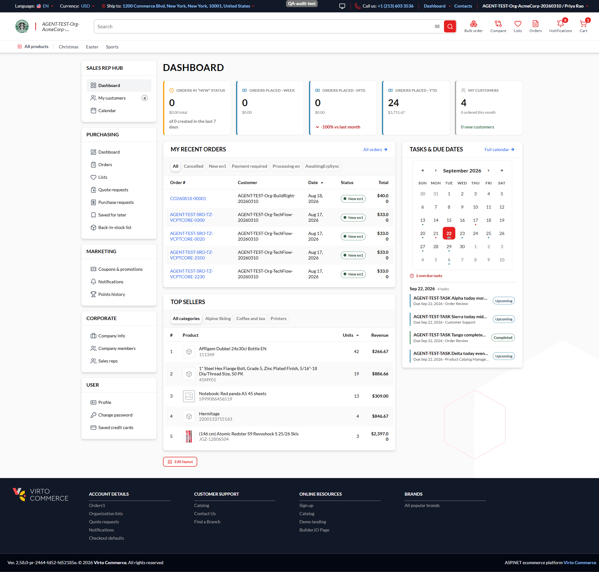
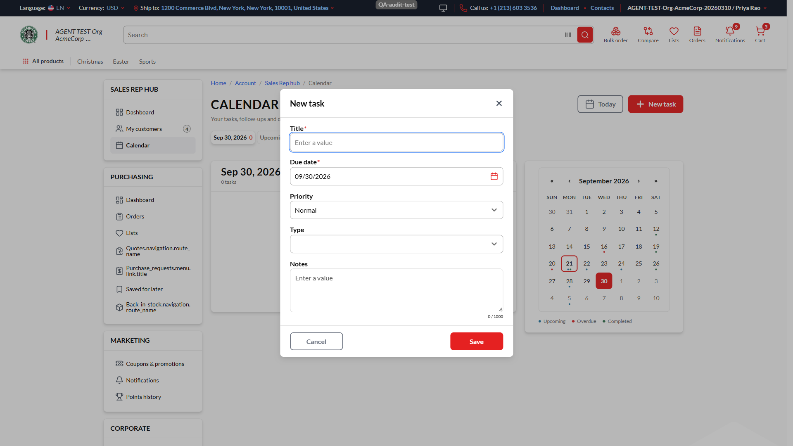
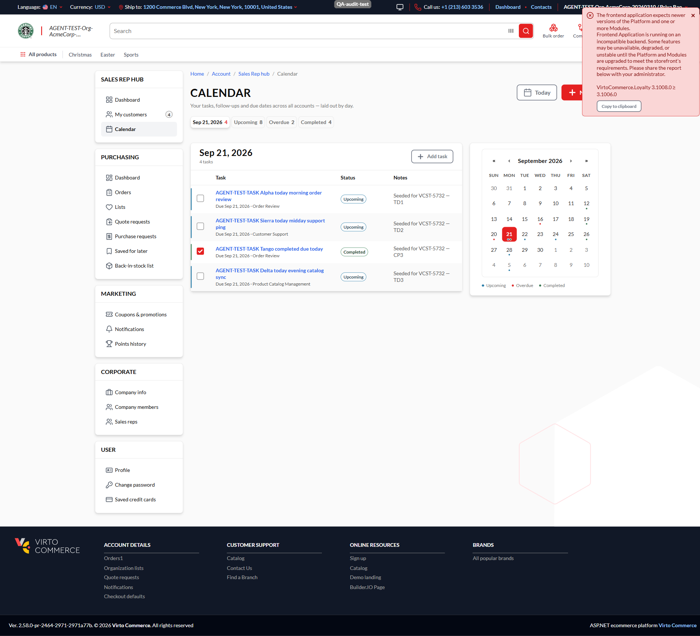
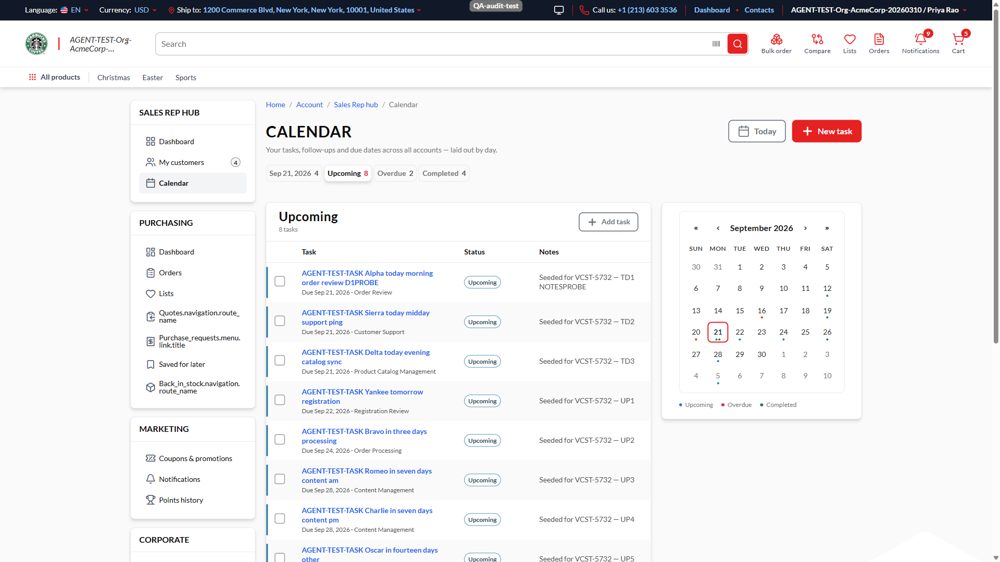
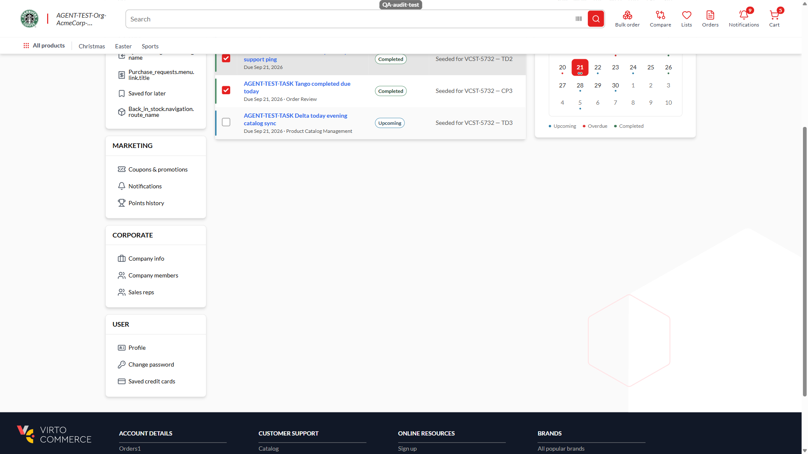
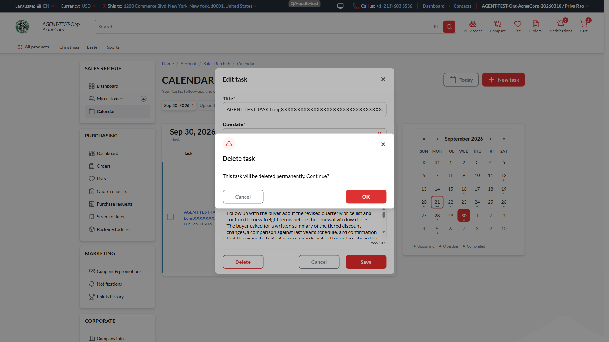
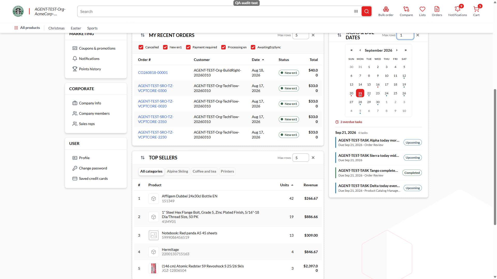

# Tracking Your Follow-Ups with Tasks & Due Dates

### Introduction
As a sales rep, you can add your own follow-up tasks — a call to make, a quote to chase — right from
your dashboard, and see at a glance which days are busy on your calendar.

*The Tasks & due dates widget on your dashboard, with the calendar and your task list side by side.*

### Prerequisites
- You are signed in to the storefront as a Sales Rep and your **Sales Rep hub** (`/company/dashboard`)
  is available.
- Your administrator has the Task module enabled — if the widget is not on your dashboard, ask them to
  check this first.

### Add a follow-up task
1. On your dashboard, find the **Tasks & due dates** widget, or open the **Calendar** page from the
   hub menu.
2. Click **+ New task**.
   
   *The New task form — Title and Due date are required; Priority, Type and Notes are optional.*
3. Enter a **Title** and pick a **Due date** — both are required.
4. Optionally set a **Priority** and a **Type**, and add up to 1000 characters of **Notes** (a counter
   under the field shows how much room you have left).
5. Click **Save**.

The form closes and your new task appears in the list for its due date — no page reload needed.

!!! note "Why can't I save without a title or a due date?"
    Every task needs both so it can show up in the right place on your calendar and in the right list.

### Find your tasks by date or status
Your task list has four views, shown as chips above the list:

- Click any day on the calendar to see just that day's tasks — the chip is labelled with the date you
  picked.
  
  *Clicking a day filters the list to that date; the day itself shows a small marker when it has tasks.*
- Click **Upcoming**, **Overdue**, or **Completed** to see all of your tasks in that status, across
  every date — these three are not limited to one day.
  
  *The Upcoming view lists every open task due today or later, regardless of which day is selected.*

!!! note "Why does a day with several tasks only show one marker?"
    The calendar marks a day as having tasks; hover the day (or open it) to see how many — the day's own
    description spells it out, for example "2 tasks. Marked: Upcoming."

### Mark a task complete, or reopen it
1. In the task list, tick the **checkbox** at the start of the task's row.
   
   *A completed task moves to the Completed view immediately; your counts update without a refresh.*
2. Changed your mind? Untick the same checkbox — the task moves back to Upcoming or Overdue, whichever
   its due date says.

### Edit or delete a task
1. Click the task in the list to open it.
2. Change any field and click **Save** — or click **Delete**.
3. If you chose Delete, confirm in the dialog that appears.
   
   *Deleting is confirmed once and cannot be undone — there is no undo for a deleted task.*

!!! warning
    Deleting a task removes it for good. There is no way to bring it back — if you are unsure, edit it
    instead of deleting it.

### Long titles and notes
Titles and notes that don't fit are shown clipped on two lines. On a desktop browser, hover over a
clipped **title** or **note** to see the rest of it.

!!! note "What about a long note I can't fully read?"
    Hovering with a mouse reveals the full text of both a clipped **title** and a clipped **note**. The
    title is also available if you are using a keyboard or a screen reader; the **note is not** — on a
    touchscreen, or without a mouse, there is currently no way to reveal it. If you need the whole note,
    open the task to edit it; the full text is there in the Notes field.

### Adjusting how many tasks the dashboard widget shows
The dashboard widget (not the Calendar page) has its own **Max rows** setting, from 1 to 10 (5 by
default). When rows are hidden because of this setting, the widget's count tells you, for example
"4 tasks (1 shown)". Click the widget's **"N overdue tasks"** link to jump straight to your Overdue view.

*With Max rows set to 1, the widget shows only the first task and tells you how many more are hidden.*

### Troubleshooting
- **A task I just added isn't where I expected it** — check its due date and whether it is marked
  complete; completed tasks only show under Completed, regardless of their due date.
- **The calendar's week starts on a different day than I expect** — this follows your store's language
  and region setting, not a fixed weekday.
- **Tasks aren't sorted the way I expect** — your list is always ordered by due date (soonest first);
  it does not currently follow when a task was created or last edited.
