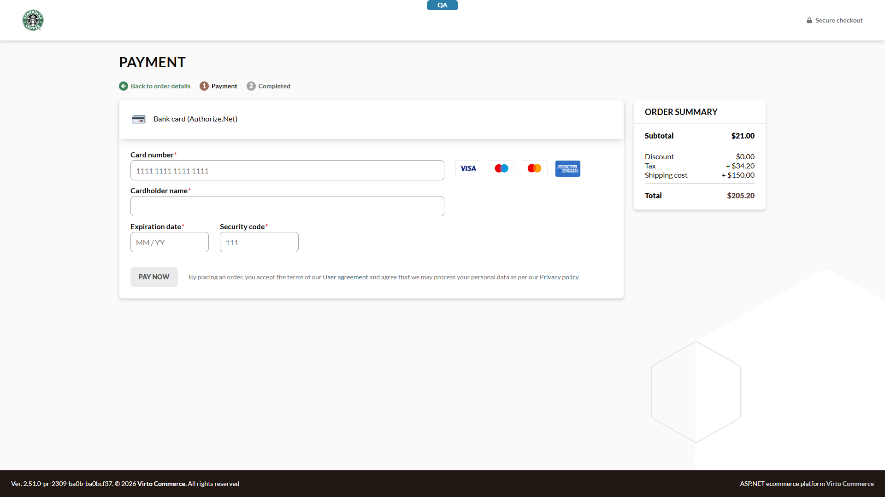

# BUG: Authorize.Net inline /cart form accepts invalid card data — ghost "Payment required" order created, then fallback redirect to /checkout/payment `[High]`

**Env:** vcst-qa @ Platform 3.1032.0, AuthorizeNetPayment 3.1001.0-pr-12-c821, theme 2.51.0-pr-2309-ba0bcf37 (PR head)
**Related:** VCST-5162 (PR vc-frontend #2309, vc-module-authorize-net #12) · Found: 2026-06-05 · Status: NOT FILED in JIRA (per QA lead decision; by-design question open with PR author)

## Summary

The cart-embedded Authorize.Net Accept.js form performs no client-side validation for Luhn-invalid card numbers or expired dates (past year, valid month) — Place Order stays enabled, and clicking it creates an unpaid "Payment required" order before falling back to `/checkout/payment`. Sibling inline processors (Skyflow, CyberSource) reject the same inputs client-side without creating an order. Month-range validation (e.g. `13/29`) IS caught, so the validation layer exists but skips Luhn and expiry-in-the-past checks.

## STR (from /cart with a seeded cart, signed in)

1. On `/cart`, select the Authorize.Net payment method; wait for the inline card form
2. Enter card number `@td(CYBERSOURCE_INVALID.number)` (Luhn-invalid), valid future expiry, CVV `123`; blur the card field
3. Observe: no inline error; Place Order remains **enabled**
4. Click Place Order

Variant (same root cause): step 2 with a valid card number but **expired** date `01/2020` → same behavior (confirmed independently in Firefox and Chrome).

Variant 2 (REG-2026-06-05-1752): **AMEX card with 3-digit CVV accepted** — Place Order enabled (AMEX requires 4 digits; AN twin of the Skyflow finding VCST-5202). Evidence: `reports/regression/REG-2026-06-05-1752/PAY-SKY-015-FAIL-amex-3digit-cvv-accepted.png` (filename says SKY — it is the AN native form).

## Expected vs Actual

| | Expected (PAY-AN-012; Skyflow/CyberSource parity) | Actual |
|---|---|---|
| Inline error | Shown on blur for invalid Luhn / expired date | None |
| Place Order | Disabled while card data invalid | Enabled |
| On click | No order created; user stays on /cart | Order created with status **Payment required** (CO260605-00012, CO260605-00016 — both cancelled), then redirect to `/checkout/payment` |

## Evidence

Expired-date variant: `tests/Sprint26-11/VCST-5162/screenshots/an-past-expiry-placeorder-enabled.png`. No payment POST is sent in the invalid state (no `api2.authorize.net` call) — the order creation itself is the defect surface.

## Notes

- BL/ECL: BL-CHK-002, BL-ORD-001 context; ECL-1.1. Suite case: PAY-AN-012 (FAIL on PR head — stale-build caveat from TLC-2026-06-05-1647 now ruled out).
- Root cause (2 sentences): `payment-processing-authorize-net.vue` syncs card validity into `usePayment` but does not run Luhn/expiry checks before enabling submission; `createOrderFromCart` then proceeds and the missing-tokenization path falls back to the legacy `/checkout/payment` route after the order exists.
- Open question for PR author (Basil Kotov): is the /checkout/payment fallback by design? Even if yes, the ghost order + absent client validation diverge from Skyflow/CyberSource behavior on the same page.
