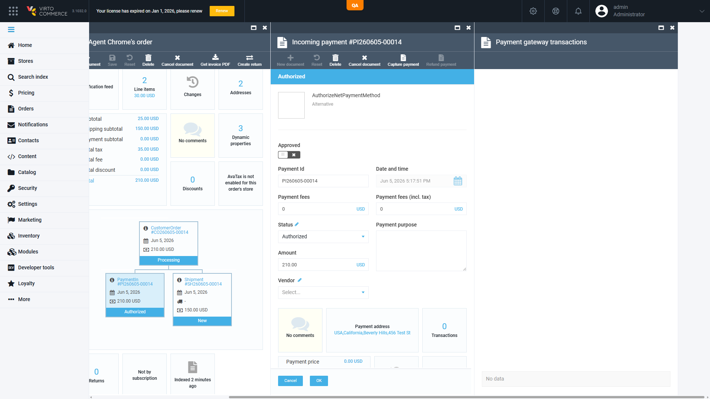

# BUG: Authorize.Net authorize does not persist PaymentGatewayTransaction — Admin shows "No data", REST `transactions:[]` `[Medium]`

**Env:** vcst-qa @ Platform 3.1032.0, AuthorizeNetPayment 3.1001.0-pr-12-c821 (PR #12)
**Related:** VCST-5162 · Found: 2026-06-05 · Status: NOT FILED in JIRA (per QA lead decision)

## Summary

Successful Authorize.Net cart-embedded payments authorize correctly (order → Processing, payment → Authorized, void-on-cancel works), but no `PaymentGatewayTransaction` audit record is persisted: Admin → order → Payment gateway transactions shows "No data" and REST returns `transactions: []` with `isApproved=false` on the in-payment document. CyberSource (Authorized) and Skyflow (Paid) orders on the same environment each persist a transaction record (`hasResponse=true`, `isApproved=true`), so this is an Authorize.Net PR #12 gap, not a platform-wide behavior. Impact: no gateway audit trail for reconciliation, refund, or dispute traceability.

## STR

1. Complete a successful Authorize.Net inline payment on /cart (e.g. suite case PAY-AN-014) — order reaches Processing / payment Authorized
2. Admin → Orders → open the order → payment document → Payment gateway transactions
3. Cross-check via REST: `GET /api/order/customerOrders/{id}` → `inPayments[0].transactions`

## Expected vs Actual

| | Expected (CyberSource/Skyflow parity) | Actual (AN orders CO260605-00014 / 00015) |
|---|---|---|
| Gateway transactions grid | ≥1 transaction with gateway response | "No data" |
| REST `inPayments[0].transactions` | 1 entry, `hasResponse=true` | `[]` |
| `isApproved` | `true` after successful authorize | `false` |

## Evidence

Comparison orders on same env: CyberSource CO260604-00006 and a Paid Skyflow order both persist 1 transaction. Confirmed by two sources (Admin UI + REST). Full check log: `tests/Sprint26-11/VCST-5162/backend-execution-report.md`.

## Notes

- BL refs: BL-ORD-006 (payment state consistency), BL-CROSS-010. Suite tie-in: ORD-018 sync note already anticipated a PR#12 `PaymentGatewayTransaction` shape change — actual behavior is absence, not shape change.
- Likely fix surface: `vc-module-authorize-net` PR #12 `ProcessPayment`/authorize path not appending the gateway response to `payment.Transactions` before save.
