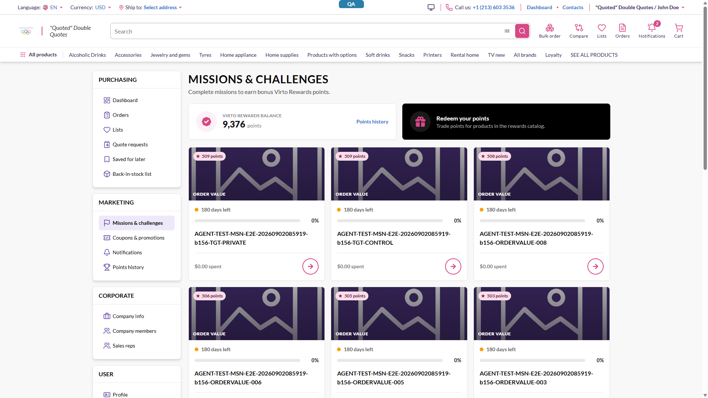
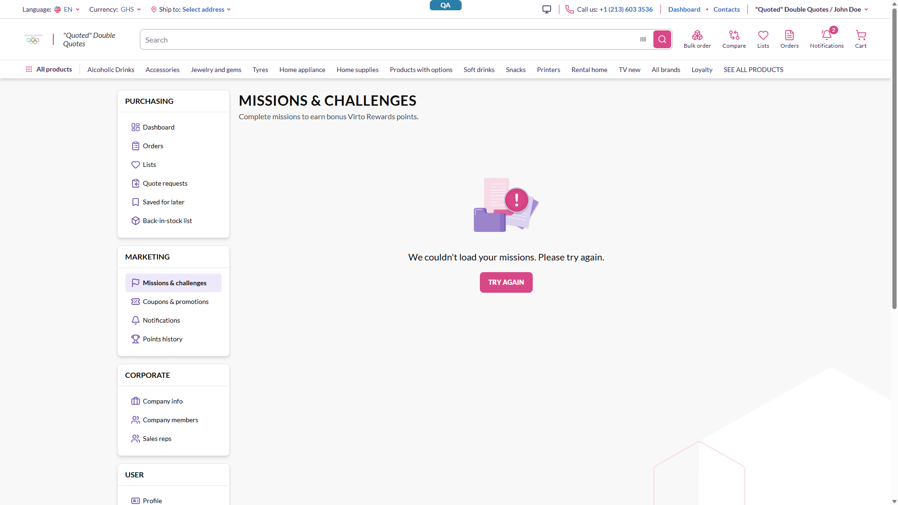

# Missions page discards a successful payload — one failing nested field blanks all 12 returned missions — **P3 (latent)**

## Status: CLOSED — won't fix; trigger removed, residual hardening declined 2026-09-02
**Tracker:** VCST-5843 (Subtask of VCST-5346; Relates VCST-5842)
**Found by:** manual · investigation of `BUG-missions-page-dead-product-resolver-throws-on-missing-currency.md` · — none (not case-attributable)
**Archetype:** `ERROR-HANDLING`

**Env:** vcst-qa @ Platform `3.1061.0`, Theme `2.57.0-pr-2396-80d1-80d1e3b9` (footer-confirmed live), store `B2B-store`, chrome/1920px, signed in as `@td(MULTI_ORG_USER.email)`.

## Summary
`/account/missions` treats a **partially successful** GraphQL response as a total failure: when `errors[]`
is non-empty the client discards `data` entirely and renders only
`We couldn't load your missions. Please try again.`

**The outage this originally described is fixed.** The remaining defect is the error policy itself, still
unchanged, which discards usable data whenever any nested field fails. It is no longer reachable by
ordinary use, so this is now a hardening item, not a live P2.

## 2026-09-02 re-test — supersedes the prior "no fix landed" entry

The earlier re-test concluded *"resolved `Done`, no fix in the codebase"* by searching for `errorPolicy`.
**That conclusion was wrong.** A fix did land; it took the other valid route — **remove the trigger**
rather than change the error policy.

- **Fix commit `5a6772304` (2026-08-28, "feat: add currency code")** — adds `$currencyCode` to
  `getLoyaltyMissionProgress.graphql` and passes `currencyCode: currentCurrency.value?.code` in its
  `index.ts`. `cultureName` was already supplied. Deployed in the live build.
- **Verified working (live, paired controls).** The storefront's exact 60-field query run against vcst-qa
  across every currency the switcher offers — `USD, AUD, CZK, EUR, GBP, GHS` — returns **HTTP 200,
  0 errors, 12 items** in all six; the page renders 12 cards. All six switches were also driven through
  the UI: none reproduces.

**Still true:** `errorPolicy` appears **nowhere in the vc-frontend repo** (0 hits repo-wide — broader than
the previous file-scoped check), so Apollo's default `"none"` still discards a partial response whole, and
omitting either optional argument still produces that shape. The gap is genuine; its reachability changed.

## STR

Ordinary UI actions no longer reproduce this — the storefront now always supplies both optional
arguments, so the condition must be induced:

1. Sign in on `{{FRONT_URL}}`, go to `/account/missions` → **12 cards render** (control).
2. Intercept the page's own `GetLoyaltyMissionProgress` POST and remove **only** the optional
   `currencyCode` variable; forward it to the real backend and return the backend's genuine response
   (nothing fabricated — the client receives an authentic HTTP 200 partial success).
3. Reload `/account/missions`, then click **Try again**.

Server-only equivalent (no browser): POST the same query with `currencyCode` omitted → 7 errors;
with `cultureName` omitted → 24 errors. Both alongside fully-populated `data`.

## Expected vs Actual
- **Expected:** render the 12 returned missions; degrade only the affected part (a featured-product row
  whose `product` is `null` shows as unavailable) and surface the partial failure as a non-blocking notice.
- **Actual:** zero missions rendered; the full-page error state replaces the grid **and both banners**
  whenever `errors[]` is non-empty, regardless of how much usable `data` accompanied it.

## Evidence

Control — 12 cards, 3 pages:

Induced partial response — same session, same account, only `currencyCode` removed:

| | Control | Partial response |
|---|---|---|
| HTTP status | `200` | `200` |
| `totalCount` | `28` | `29` |
| mission objects returned | `12` | `12`, all fully populated |
| `errors[]` | `0` | `7` — all `Error trying to resolve field 'product'.` |
| first error path | — | `loyaltyMissionProgress.items.6.items.0.product` |
| missions rendered | `12` | **0** |
| balance banner rendered | yes | **no** |
| console errors | `0` | `0` |

**One nested product, on one of twelve missions, destroyed all twelve** — items 0–5 and 7–11 had no
failure at all. Discarded anyway, e.g. item 0: `localizedName: "AGENT-TEST-MSN-E2E-…-TGT-PRIVATE"`,
`missionType: "OrderValue"`, `rewardPoints.amount: 509`, `targetValue: 7200`, `daysRemaining: 180`.
Removing the interception restores all 12 cards (clean A/B/A), so the induced response is the sole cause.

## Root Cause Analysis

Three files, all read at the deployed SHA `80d1e3b9`:

- `client-app/core/api/graphql/client.ts` — `graphqlClient.defaultOptions` sets only `fetchPolicy`; no
  `errorPolicy`, so Apollo's default `"none"` throws on any `errors[]` entry and discards `data`.
- `.../loyalty/composables/useMissions.ts` — no per-query `errorPolicy`; its `catch` logs and **re-throws**.
- `.../loyalty/pages/missions.vue:107-112` — `loadData()` runs
  `await Promise.all([fetchLoyaltyBalance(), fetchMissions()])` inside a bare `catch { loadError = true }`;
  line `13` renders `<VcEmptyView v-if="loadError" variant="error">` in place of the whole content region.
  **The `Promise.all` widens the blast radius** — either call failing also removes both banners.

`Logger.error` produced no console output, so the failure is caught and converted silently — an
error-policy choice, not a crash.

## Layer Validation

| Layer | Result | Evidence |
|-------|--------|----------|
| 1. Storefront Frontend | **FAIL** | 12 usable missions in the response, 0 rendered — screenshots + table above |
| 2. Backend Admin | N/A | not exercised by this defect |
| 3. GraphQL xAPI | PASS *for this defect* | returned usable `data`; its optional-argument faults are the linked reports |
| 4. Platform REST API | N/A | not exercised by this defect |

**Owning layer:** Layer 1 — Storefront.

## Notes
- Reproduces identically on direct load, refresh, in-app navigation and **Try again** — it is the error
  branch itself, not a routing or hydration race.
- **The one plausible non-induced path:** `currencyCode: currentCurrency.value?.code` uses optional
  chaining, so if `currentCurrency` is unresolved when the query fires the argument is omitted and the
  blank page returns.
- The page still never sets its document title (`"Virto Commerce"` vs `/sign-in`'s `"QA & Sign in"`).
  Minor, same view; not filed separately.
- Declined direction, recorded for re-open: `errorPolicy: 'all'`, render from whatever `data` arrives,
  reserve the full-page error state for a response with **no** `data`.
- **Disposition (2026-09-02):** CLOSED as won't-fix. The team's fix for VCST-5843 was to supply
  `currencyCode` (commit `5a6772304`), removing the trigger; that is verified working across all six
  storefront currencies. The `errorPolicy` hardening was considered and declined — the residual gap is
  latent, not reachable by ordinary use. Re-open if a partial response is ever observed in the wild:
  the RCA anchors below are current and the reproduction in the STR still works.

## Fix Routing (→ /qa-fix)

- **Owning layer:** Layer 1 — Storefront
- **Suggested repo:** VirtoCommerce/vc-frontend
- **repoKind:** frontend
- **Ownership hint:** platform
- **Component / module:** storefront — account → Missions & challenges
- **RCA anchor:** `client-app/modules/loyalty/pages/missions.vue:107-112` (the `Promise.all` + bare
  `catch` that sets `loadError`) and `:13` (the `VcEmptyView v-if="loadError"` that replaces the grid);
  policy site `client-app/core/api/graphql/client.ts` `defaultOptions`.
- **Routing confidence:** HIGH — file:line anchors read at the deployed SHA and confirmed live.
- **Related:** `BUG-missions-page-dead-product-resolver-throws-on-missing-currency.md` (fixed) ·
  `BUG-AI-loyalty-mission-localizedname-null-culturename.md` (open, the `cultureName` trigger) · VCST-5841
