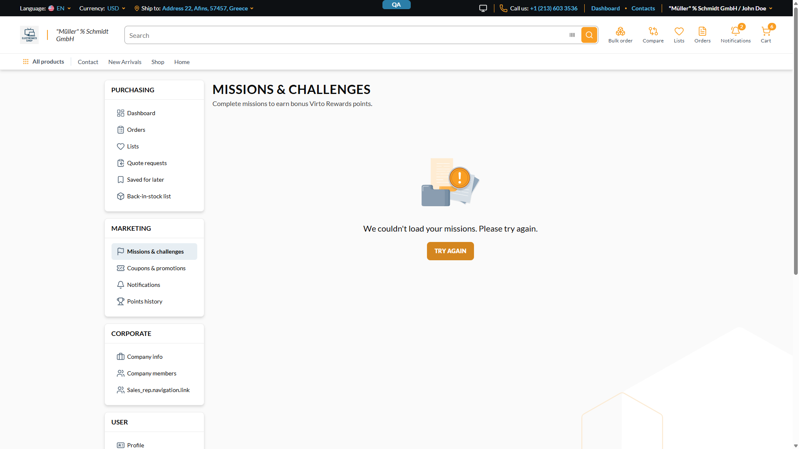

# Missions & challenges page is unusable — every featured `product` throws in promotion evaluation (`Sequence contains no matching element`) — **P1**

## Status: CONFIRMED
**Tracker:** VCST-5842 (Subtask of VCST-5319; Relates VCST-5841)
**Found by:** manual · `/qa-monitoring --since=24H` App Insights signal → live storefront repro · — none (not case-attributable)
**Archetype:** `NULL-GUARD`
**Status:** FIXED

**Env:** vcst-qa @ Platform `3.1061.0`, Theme `2.57.0-pr-2396-5924`, `VirtoCommerce.MarketingModule.Data @ 3.1006.0`, store `B2B-store`, session currency USD, chrome/1920px, signed in as `@td(MULTI_ORG_USER.email)`.

## Summary
On `/account/missions` the storefront shows **"We couldn't load your missions. Please try again."** and no mission renders — 3 of 3 loads, both on refresh and on in-app navigation. The `GetLoyaltyMissionProgress` operation returns **HTTP 200 with 12 missions of 24 populated**, plus **9 `errors[]` — one per featured product** — because `LoyaltyMissionProgressItem.product` throws server-side:

```
System.InvalidOperationException: Sequence contains no matching element
  at System.Linq.ThrowHelper.ThrowNoMatchException
  at VirtoCommerce.MarketingModule.Data.Services.EvaluationPolicies
       .PromotionPolicyBase+<<EvaluatePromotionAsync>b__0>d.MoveNext
```

`PromotionPolicyBase.EvaluatePromotionAsync` resolves the context currency with an **unguarded `.First()`**, so a missing/unmatched currency code becomes an unhandled exception instead of a diagnosable result. `loyaltyMissionProgress` **exposes no currency argument at all** (schema args: `after, first, keyword, sort, storeId, statuses, completedStartDate, completedEndDate, cultureName, isStarted, userId`), so the storefront cannot supply one — the resolver has to derive it, and does not.

**Same missing-currency-context root as VCST-5841, escalated.** VCST-5841 records that this operation resolves `items[].product.price` without the store currency and serves the *wrong* currency. Here the same gap now makes `product` fail to resolve **at all**, which takes the whole page down. Link, don't merge: different failure mode, different severity, and the fix site named below is in a different repo from VCST-5841's.

## STR
1. Sign in on `{{FRONT_URL}}` as `@td(MULTI_ORG_USER.email)` (reproduces for any account — see §Layer Validation).
2. Go to **`/account/missions`** (direct load or the sidebar link "Missions & challenges" — both fail).
3. Observe the page body.
4. Click **Try again**.
5. Open DevTools → Network → the `GetLoyaltyMissionProgress` POST to `/graphql` → Response.

## Expected vs Actual
- **Expected:** the 24 in-progress/completed missions render as cards. A featured product whose price cannot be resolved degrades to "unavailable" on that one row — it never fails the field, and never blanks the page.
- **Actual:** no mission renders; the page shows only `We couldn't load your missions. Please try again.` The response carries `data.loyaltyMissionProgress.totalCount: 24` with 12 usable mission objects (names, targets, reward points, banners, dates all present) and `product: null` on **9 of 9** featured-item rows, each with `Error trying to resolve field 'product'.` / `extensions.code: INVALID_OPERATION`.

## Evidence


Response body (trimmed) — partial success, 9 errors:
```json
{"errors":[{"message":"Error trying to resolve field 'product'.",
            "path":["loyaltyMissionProgress","items",5,"items",0,"product"],
            "extensions":{"code":"INVALID_OPERATION"}}, … ×9],
 "data":{"loyaltyMissionProgress":{"totalCount":24,"items":[
   {"missionId":"85fe98b3-…","localizedName":"AGENT-TEST-MSN-E2E-…-PERSKU",
    "rewardPoints":{"amount":750.0},
    "items":[{"productId":"3a0238a2-fcb7-4753-8972-c89664808dd9","product":null}, …]}, …]}}}
```

App Insights (backend `vcst-qa`) — same signature, 10 occurrences in the 24 h to 2026-08-28 12:40Z, spanning 2026-08-27 13:06Z → 2026-08-28 11:42Z, plus the two this repro produced: `operation_Id` **`c778cead1e374b55a2d1077efbd32acd`** (`POST graphql/GetLoyaltyMissionProgress`, 13:52:08Z) and **`b317e487a89b44e3a46ff5f29805d3eb`** (13:53:22Z).

## Layer Validation

| Layer | Result | Evidence |
|-------|--------|----------|
| 1. Storefront Frontend | **FAIL** | screenshot above; 3/3 loads (refresh + SPA nav + Try again). Separate frontend defect — the page discards 12 successfully-returned missions on a partial response — filed as VCST-5843 (`BUG-missions-page-fails-whole-page-on-partial-graphql-response.md`) |
| 2. Backend Admin | N/A | The missions and their featured products exist and are editable; nothing admin-side is mis-stored (proven at Layer 4 instead) |
| 3. GraphQL xAPI | **FAIL** | `GetLoyaltyMissionProgress` → 200 + 9 `Error trying to resolve field 'product'`. **Control:** the identical query with the `product` sub-selection removed returns 200 clean, so the mission query itself is sound and the failure is isolated to the `product` sub-resolver |
| 4. Platform REST API | PASS | `GET /api/catalog/products/{id}` for the three failing ids returns intact, active, buyable products: `AGENT-TEST-MSN-E2E-PERSKU-PTS`, `-PERSKU-B`, `-PERSKU-A` (all `active=true buyable=true`, catalog `3b0e9125-…`) |

**Owning layer:** Layer 3 — xAPI (the throw is in the marketing promotion-evaluation path the product resolver calls).

## Root Cause Analysis
`vc-module-marketing @ dev`, `src/VirtoCommerce.MarketingModule.Data/Services/EvaluationPolicies/PromotionPolicyBase.cs:30`:

```csharp
promoContext.CurrencyObject = (await currencyService.GetAllCurrenciesAsync())
    .First(x => x.Code == promoContext.Currency);
```

`.First(predicate)` with no fallback: when `promoContext.Currency` is null/empty (or differs in case from a registered code — the comparison is default string equality) the call throws `InvalidOperationException` from inside the `GetOrCreateExclusiveAsync` cache factory, which surfaces to GraphQL as an unhandled resolver error.

The missing input is corroborated by the sibling exception in the same window: `VirtoCommerce.StoreModule.Data.Services.StoreCurrencyResolver.GetStoreCurrencyAsync:68` → **`requested currency  is not registered in the system`** — note the double space, i.e. the requested currency is the **empty string**. Two different unguarded currency lookups, one missing currency input. This is `reference_xapi_ambient_context_args` in its severe form: an ambient context value the query cannot pass, with no server-side fallback to the store default.

**Why it looks intermittent in telemetry (10/24 h) while the browser fails every time:** the throw happens in a factory guarded by a 1-minute sliding cache whose expiration token is `GenericSearchCachingRegion<Promotion>` — any promotion write invalidates it. A `storeId`-scoped direct API call (`/connect/token` with `storeId=B2B-store`, then the same operation) returned **0 errors in 20 consecutive attempts** across four rounds spaced past the cache TTL, including 4-way parallel fan-out — so the browser's request context is what lacks the currency, and the low telemetry count reflects how often that path is cold, not how often a customer is affected.

## Notes
- **Customer impact is total for this surface:** 24 missions exist and none can be seen. `/account/missions` is the whole feature's storefront entry point (VCST-5320 / VCST-5319).
- The rewards themselves are unaffected — `rewardPoints`, `targetValue`, `percentage`, `daysRemaining` and banners all come back correctly. Only the featured-product rows fail, and they take the page with them.
- Fixing the guard alone converts a dead page into a page with unavailable product rows. The **currency derivation** is the real gap and is shared with VCST-5841; both should be fixed for the surface to be correct.

## Fix Routing (→ /qa-fix)

- **Owning layer:** Layer 3 — xAPI
- **Suggested repo:** VirtoCommerce/vc-module-marketing
- **repoKind:** module
- **Ownership hint:** platform
- **Component / module:** Marketing — promotion evaluation policy (called from the loyalty missions product resolver)
- **RCA anchor:** `src/VirtoCommerce.MarketingModule.Data/Services/EvaluationPolicies/PromotionPolicyBase.cs:30` — `(await currencyService.GetAllCurrenciesAsync()).First(x => x.Code == promoContext.Currency)`
- **Fix shape:** replace `.First(...)` with a guarded lookup (case-insensitive match, then the store's default currency, then a clear domain error naming the unmatched code). The companion currency-derivation gap in the loyalty resolver is VCST-5841's scope, in `vc-module-loyalty`.
- **Routing confidence:** HIGH for the throw site (exception stack + source read + a control query isolating the sub-resolver). MEDIUM for the *complete* fix, because the missing currency originates upstream of this file and spans `vc-module-loyalty` — call it out to the reviewer rather than widening the diff.
- **Related:** VCST-5841 (`BUG-loyalty-mission-progress-serves-non-session-currency-price.md`) — same missing currency context, milder symptom.
