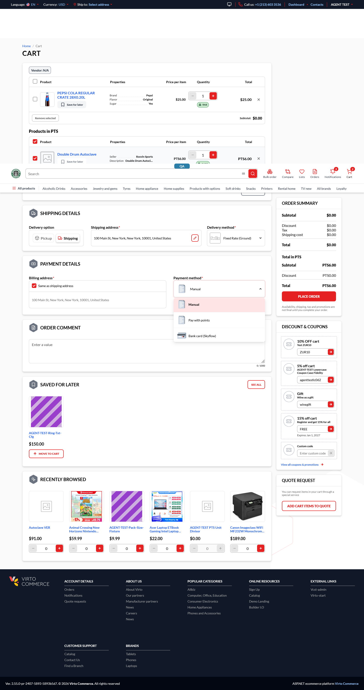
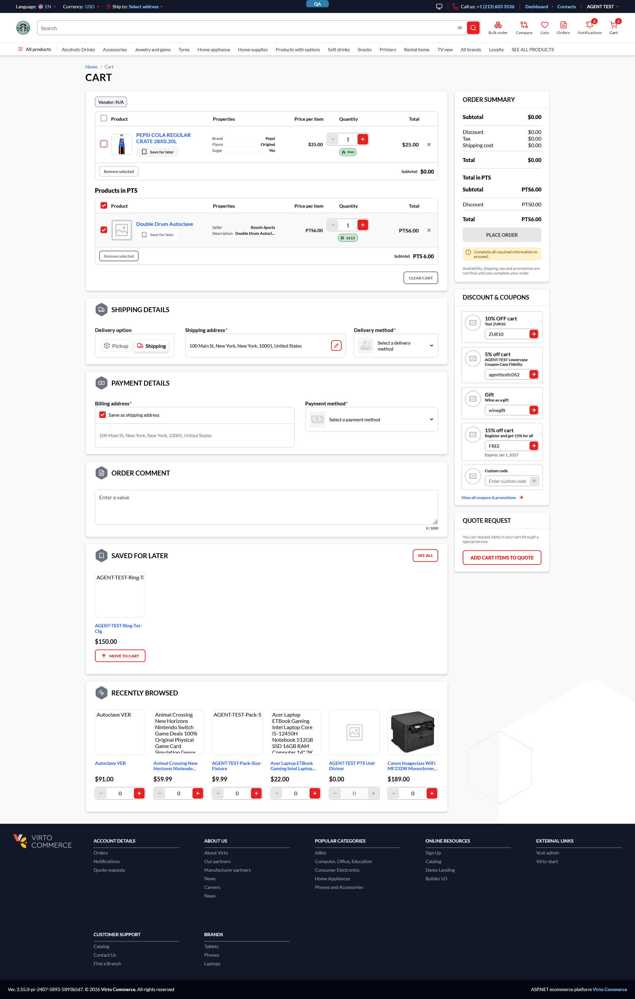

# BUG: Mixed cart — unselecting all cash lines bypasses the points-only checkout guard

## Status: FIXED

**Tracker:** VCST-5657 (High, To do) · **Severity:** High · **Reported:** 2026-08-04
**Env:** vcst-qa @ Platform 3.1055.0, Loyalty 3.1004.0, Theme 2.55.0-pr-2407-5893-5893b5d7, store `B2B-store`

## Summary

In Loyalty **Mixed Cart** mode, a cart holding both cash (USD) and loyalty (PTS) lines lets the user
**unselect every cash line** and check out on the PTS lines alone. The
`LOYALTY_ONLY_POINT_PRODUCTS_NOT_ALLOWED` guard never fires, so Place Order stays enabled and a
$0.00 / PTS 6.00 order is placeable. This is the *selection-scoped* variant of **BL-LOY-010** — the
rule is correctly enforced when the cart genuinely has no cash line, and silently skipped when the
cash line is merely deselected.

## Steps to Reproduce

Preconditions: store in Loyalty mode `Mixed Cart` with `Loyalty.Currency = PTS`; signed in as a
loyalty user with a sufficient balance (`@td(LOYALTY_VIP_USER.email)`, balance observed 211,690 PTS).

1. Add a regular USD product to the cart (observed: `PEPSI COLA REGULAR CRATE 28X0.20L`, $25.00).
2. Add a PTS-priced product from the `Loyalty` catalog category (observed: `Double Drum Autoclave`, PTS 6.00).
3. Go to `/cart` — both lines are selected; Total $30.00 + Total in PTS 6.00.
4. **Untick the checkbox on the regular USD line.** USD Subtotal drops to $0.00; the PTS group stays PTS 6.00.
5. Set Delivery method `Fixed Rate (Ground)` and Payment method **`Manual`**.
   *(Pinning `Manual` matters — see Note 1.)*
6. Observe the Place Order button and the cart/summary warning area.

**Expected:** checkout blocked, with the already-implemented warning
*"Add a regular product to check out."* / *"Loyalty points can't be used on their own…"*.

**Actual:** **Place Order is enabled**, no warning of any kind is rendered, and the order is placeable.
The failure is silent — not a wrong message, but no message.




Order placement was **not** completed (stopped at the enabled state); the cart was cleared afterwards.

## Layer Validation

| Layer | Result | Evidence |
|-------|--------|----------|
| 1. Storefront Frontend | **PASS** | Renders whatever the backend emits — it correctly blocked Place Order and showed both messages for `LOYALTY_PAYMENT_METHOD_NOT_ALLOWED` in the same session. i18n + guard already wired (VCST-5365 AC-6) |
| 2. Backend Admin | N/A | No admin surface exercised |
| 3. GraphQL xAPI | **FAIL** | `GetFullCart` with `validationErrors(ruleSet:"*")` → `cart.validationErrors: []`; same on the `UnselectCartItems` mutation response |
| 4. Platform REST API | N/A | The validator ships in `VirtoCommerce.Loyalty.ExperienceApi` (xAPI layer); no REST equivalent |

**Owning layer:** Layer 3 — GraphQL xAPI.

Observed cart state at the failure point:

```
sku=201482    PEPSI COLA …   currencyCode=USD  selectedForCheckout=false
sku=in724846  Double Drum …  currencyCode=PTS  selectedForCheckout=true
cartTotals: USD total=$0.00 (isDefaultTotalCurrency=true) | PTS total=PTS6.00
cart.validationErrors: []          ← LOYALTY_ONLY_POINT_PRODUCTS_NOT_ALLOWED absent
```

No JS exceptions; all 15 `/graphql` POSTs returned `200` with no `errors[]`. (Console noise was
third-party `*.all.biz` image CORP blocks — pre-existing, unrelated.)

## Root Cause Analysis

`vc-module-loyalty` → `src/VirtoCommerce.Loyalty.ExperienceApi/Validators/LoyaltyCartValidator.cs`:

```csharp
26: var pointsTotals     = cart.CartTotals.FirstOrDefault(x => x.CurrencyCode.EqualsIgnoreCase(loyaltyCurrencyCode));
27: var hasPointProducts = pointsTotals != null && pointsTotals.Total > 0;                                  // selection-AWARE
28: var hasCashProducts  = cart.Items?.Any(x => !x.Currency.EqualsIgnoreCase(loyaltyCurrencyCode)) == true; // selection-BLIND
…
39: if (hasPointProducts && !hasCashProducts)  →  LOYALTY_ONLY_POINT_PRODUCTS_NOT_ALLOWED
```

The two operands of rule 2 are derived from **different sources with different selection semantics**:

- `cart.CartTotals` is computed from selected items only — `vc-module-cart`
  → `DefaultShoppingCartTotalsCalculator.cs:81`: `cartItemsWithoutGifts?.Where(x => x.SelectedForCheckout)`.
- `cart.Items` is the raw line-item collection, **unfiltered by `SelectedForCheckout`**.

Deselecting the cash line therefore drives `pointsTotals.Total > 0` → `hasPointProducts = true` while
`hasCashProducts` **stays `true`** (the deselected USD line is still in `cart.Items`). The guard
`hasPointProducts && !hasCashProducts` can never be satisfied while any cash line exists in the cart at
all, selected or not. Rule 4 (`LOYALTY_INSUFFICIENT_BALANCE`) reads `pointsTotals.Total` and is
consistent — the asymmetry is isolated to **line 28**.

The storefront needs no change: `vc-frontend` → `client-app/shared/cart/enums/index.ts` already maps
the code to a Place Order guard toast + inline compact alert, and `locales/en.json:190,193` already
carry the exact expected wording. The message is unreachable only because the code is never emitted.

**Suggested fix (one line, single repo):** scope `hasCashProducts` to the selected subset so both
operands share the same semantics —
`cart.Items?.Any(x => x.SelectedForCheckout && !x.Currency.EqualsIgnoreCase(loyaltyCurrencyCode))`.

## Notes

1. **Payment-method dependent reachability.** Choosing `Pay with points` *does* block the order — but
   via `LOYALTY_PAYMENT_METHOD_NOT_ALLOWED` (a payment-mode rule), not the cart-composition rule.
   Any other method (`Manual`, card gateways) unlocks Place Order. A tester who picks "Pay with points"
   would wrongly conclude this does not reproduce — hence `Manual` is pinned in the STR.
2. **The ticket's "shipping → payment → review" wizard does not exist** on this storefront; `/cart` is a
   single-page cart + checkout. There is no intermediate gate where the rule could have fired.
3. **Coverage gap:** `075b` MCO-GQL-006 covers rule 2 with a genuinely points-only cart (no cash line)
   and passes; the deselected-cash-line variant was untested in both `075b` and `083b`. New cases
   MCO-GQL-012 / MCO-E2E-008 close it.
4. **Unrelated fixture issue observed:** `AGENT-TEST-PTS-UNIT-001` (`LOY_SKU_PTS_UNIT`) is not
   reachable via storefront search and its card renders `$0.00` with a disabled qty stepper — likely
   the same class as the open `BUG-non-usd-price-zero-display`. Not filed here.

## Fix Routing (→ /qa-fix)

- **Owning layer:** Layer 3 — GraphQL xAPI
- **Suggested repo:** `VirtoCommerce/vc-module-loyalty`
- **repoKind:** module
- **Ownership hint:** platform
- **Component / module:** Loyalty — `VirtoCommerce.Loyalty.ExperienceApi` cart validator (rule 2)
- **RCA anchor:** `src/VirtoCommerce.Loyalty.ExperienceApi/Validators/LoyaltyCartValidator.cs:28` (`hasCashProducts`)
- **Routing confidence:** HIGH — single file, single line, single repo; storefront and totals calculator both verified correct

## Related

- **BL-LOY-010** — points-only cart rejected, at least one cash line required (this is its selection-scoped hole)
- **BL-LOY-003 / BL-LOY-004** — `cartTotals` and promotion context are selection-scoped (the semantics `hasCashProducts` fails to match)
- Suites: `Backend/loyalty/075b-loyalty-mixed-cart-order.csv`, `Frontend/loyalty/083b-loyalty-mixed-cart-order.csv`

## Resolution

**Verified 2026-08-05** on vcst-qa @ Platform `3.1057.0-pr-3095-3abb`, Loyalty `3.1005.0-pr-15-838b`,
Theme `2.55.0-pr-2422-1c98`. Tracker: **VCST-5657 → Tested**.
**Fix:** [vc-module-loyalty#15](https://github.com/VirtoCommerce/vc-module-loyalty/pull/15) — rule 2's
`hasCashProducts` now reads `CartAggregate.SelectedLineItems`, not the selection-blind `cart.Items`.

**Method:** backend `MCO-GQL-012` (075b) 10/10 assertions via the canonical GraphQL runner; storefront
`MCO-E2E-008` (083b) 3/3 runs, payment pinned to `DefaultManualPaymentMethod`. Deselecting the cash line
now yields `["LOYALTY_ONLY_POINT_PRODUCTS_NOT_ALLOWED"]`, PLACE ORDER is disabled, and *"Add a regular
product to check out."* renders in a `role="status"` region; re-selecting recovers. BL-LOY-010 restored.

> **Not yet shipped.** PR #15 is open and unmerged; vcst-qa runs a temporary prerelease pin
> (`VirtoCommerce.Loyalty_3.1005.0-pr-15-838b.zip`, `AzureBlob` in `vc-deploy-dev@vcst-qa`). A repin or
> blob expiry makes this live again — re-verify against a released artifact after merge.

**Evidence:** `reports/tickets/VCST-5657/` (`evidence.html`, `verification-report.md`, `verification-summary.json`, 4 screenshots).
