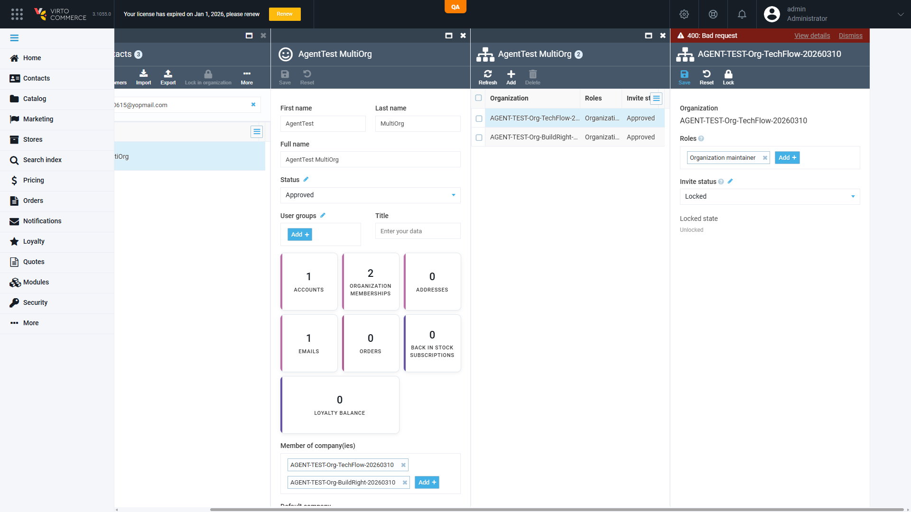
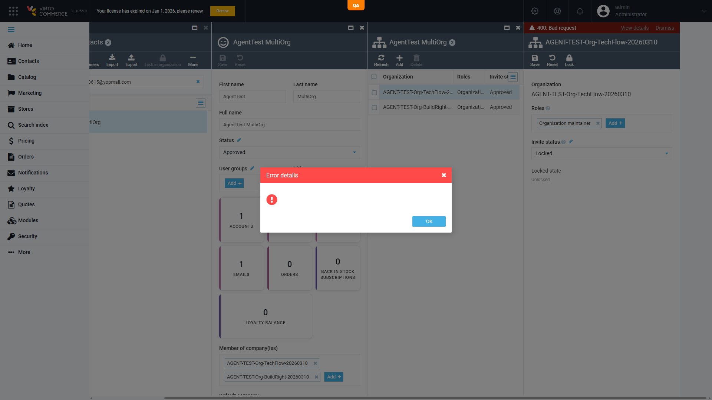

# Admin SPA discards the server's 400 explanation on a membership status save; "Error details" is empty `[Medium]`

**Env:** vcst-qa @ Platform 3.1055.0, `VirtoCommerce.Customer` 3.1021.0-pr-312-3aa7

## Summary

Saving an out-of-contract Invite status on an organization membership fails with HTTP 400, and the
platform returns a body naming exactly which values are legal. The Admin SPA shows only a generic
`400: Bad request` banner, and its **"Error details" modal opens completely empty** — so the
admin never sees the explanation. Nothing persists, so this is an observability defect rather than
data corruption, but it would mask **any** 400 raised on this blade.

## STR

> **⚠ The original trigger is gone — the environment was corrected on 2026-08-05.** `Locked` was an
> admin-added row in the `Customer.OrganizationMembershipStatuses` dictionary and has been **deleted**;
> `allowedValues` is now exactly the four compiled values, so **no out-of-contract status is selectable
> from the dropdown any more** and step 4 below cannot be performed as written. Root cause **(a) is
> therefore resolved by configuration.** Defect **(b) — the client discarding the error body — is
> unchanged and still open**; it merely has no one-click trigger left on this blade.
>
> To reproduce (b) now, either temporarily re-add any out-of-set row to that dictionary setting, or
> induce any other 400 on this blade — the defect is in the client's error handling, not in the
> particular value that provoked the 400.

1. Sign in to the Admin SPA at `{{BACK_URL}}` as an administrator.
2. Temporarily add an out-of-set value (e.g. `AGENT-TEST-NotAStatus`) to the
   `Customer.OrganizationMembershipStatuses` dictionary setting. **Remove it afterwards** — leaving it
   reintroduces exactly the config defect that was just fixed.
3. Contacts → open `@td(MULTI_ORG_TF_BR.email)`.
4. Open the **Organization memberships** widget → click the TechFlow membership row.
5. In **Invite status**, select the out-of-set value → **Save**.
6. When the red banner appears, click **View details**.

*Originally observed 2026-08-04 with `Locked`, which the dictionary then offered.*

## Expected vs Actual

| | |
|---|---|
| **Expected** | The failure surfaces the server's explanation — `Status must be one of: Invited, Approved, Rejected, Deleted.` — either in the banner or in the "Error details" modal, so the admin can pick a legal value. |
| **Actual** | Banner reads only `400: Bad request`. **"Error details" opens with a warning icon and an OK button and no text at all.** The response body carrying the legal set is discarded by the client. |

The server side is correct: `PUT /api/customer/organization-memberships/{id}` → **400** with body verbatim
`Status must be one of: Invited, Approved, Rejected, Deleted.` (read off the network response). Read-back
confirms the membership status is unchanged.

## Root cause

Two separable issues; **this report covers (b)** and (b) is worth fixing regardless of how (a) is resolved.

- **(a) Why a doomed value was offered at all — RESOLVED 2026-08-05 by deleting the row.** The blade
  populates Invite status from the `Customer.OrganizationMembershipStatuses` **dictionary setting**,
  whose `allowedValues` was `["Approved","Invited","Rejected","Locked","Deleted"]` — five values, now
  back to the compiled four. The write path validates
  against the four compiled `ModuleConstants.MembershipStatuses.ManuallySelectableStatuses`
  (`Invited, Approved, Rejected, Deleted`) and refuses anything else. The setting is
  `IsDictionary = true`, so `Locked` is an **admin-added row on this environment**, not a code change
  — arguably a content/config fix (remove the row) rather than a software one. Confirmed by a
  per-value probe: `Approved`/`Invited`/`Rejected`/`Deleted` → 200; `Locked` → 400.
  Locking is a **separate axis** (`IsLocked` + `LockoutEnd` → `IsCurrentlyLocked`), which is why
  `Locked` is structurally absent from the status vocabulary.
- **(b) The client drops the error body.** The 400 response body never reaches the UI, and the
  "Error details" modal renders empty rather than falling back to the raw message. This is
  independent of (a) — any 400 on this blade would be equally opaque.

## Not a duplicate of VCST-5061

`BUG-admin-error-toast-raw-loc-key-VCST-5061` (CLOSED — cannot reproduce) covered the *same surface*
with a **different symptom**: error toasts rendering the raw key `platform.errors.generic-error`
instead of its translation. Here every string is human-readable — the modal is **empty**, i.e. the
response body is dropped rather than mis-localized. Please do not close this as a duplicate of 5061.

## Notes

- Documented as designed-tension in `CUST-122` assertion 6 (suite `027-customer-orgs-invites`), which
  asserts the compiled-vs-dictionary divergence end-to-end. This report is the **UI** half that no
  test case covers.
- The **create path** has its own, separately-filed validation gap —
  `BUG-org-membership-create-no-input-validation-VCST-5028` (JIRA VCST-5314): `POST` accepts an empty
  `userId` (200, orphan row) and 500s on a missing one. That is why `CUST-122`'s guard-boundary
  assertion could not be exercised here without going through a known-broken path.
- Minor, not filed separately: the **New membership** blade renders a read-only
  `Locked state: Unlocked` row for a record that does not yet exist. Cosmetic.
- Related invariants: `BL-B2B-013` (membership status resolves per-org-first, then contact, then
  `Approved`), `BL-AUTH-016` (an org refusal is a single code, lock-first).
