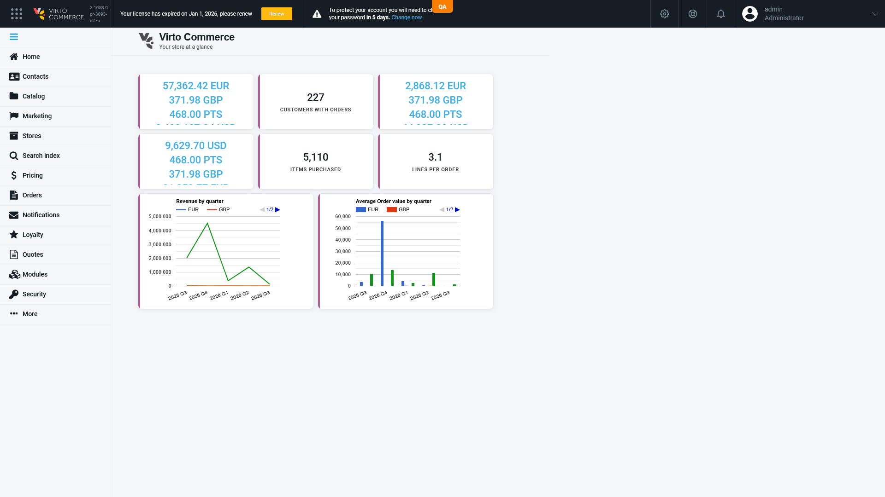

# Admin dashboard KPI tiles clip multi-currency values (≥3 currencies)

## Status: CONFIRMED

**Env:** vcst-qa @ Platform `3.1053.0-pr-3093-e27a`

## Summary

Three money-valued KPI tiles on the Admin dashboard (Revenue, Revenue per customer, Average order value) are registered at a fixed 1-row gridster size, but their template renders an unbounded per-currency line list into that fixed height. With ≥3 order currencies (this store has 4: EUR/GBP/PTS/USD), the content overflows and the last line is cut mid-glyph. Not viewport-dependent — identical clipping at 1920/1280/768px, since gridster tiles are fixed-px, not fluid. Underlying data is correct (`GET /api/order/dashboardStatistics` returns all 4 currency entries per metric, `200`); this is presentation-only.

## Steps to Reproduce

1. Sign in to the Admin SPA on a store with ≥3 order currencies.
2. Land on the home dashboard (`#!/workspace`).
3. Observe the Revenue / Revenue per customer / Average order value tiles.

## Actual Result

The 4th currency line is cut off mid-glyph in each of the three affected tiles. Geometry (read-only measurement):

| Node | Value |
|---|---|
| `li.list-item.gridster-item` (registered `size: [2,1]`) | 250×**120px**, `overflow: hidden` |
| `.gridster-cnt` (inset 10px) | `clientHeight` **100px**, `overflow-y: auto` (Firefox overlay scrollbar → no visible affordance at rest) |
| `.cnt-inner` content (4 lines × 30.8px + 19.4px caption) | `scrollHeight` **143px** |
| **Clipped** | **43px** |

Threshold: 2 currencies fit (81px); 3 already clips ~12px; 4 clips 43px. The value is scroll-reachable but nothing indicates a scrollbar is there.

## Expected Result

All currency lines for a KPI render fully visible (or the tile visibly signals there's more to scroll), regardless of currency count.

## Layer Validation

| Layer | Result | Evidence |
|-------|--------|----------|
| 1. Storefront Frontend | N/A | Admin-only surface |
| 2. Backend Admin | **FAIL** | Geometry above; no console error, pure layout |
| 3. GraphQL xAPI | N/A | widget uses Platform REST, not xAPI |
| 4. Platform REST API | PASS | `GET /api/order/dashboardStatistics` → 200, each of `revenue`/`revenuePerCustomer`/`avgOrderValue` returns all 4 `{currency, amount}` entries correctly — data layer is healthy |

**Owning layer:** Layer 2 — Admin SPA UI (presentation only). Note: distinct from the unrelated pre-existing `BUG-order-dashboard-statistics-500-invalidcast-VCST-5554` — that endpoint is healthy on this build.

## Root Cause Analysis

**`VirtoCommerce/vc-module-order`** (not core `vc-platform`) — the three money widgets are contributed by the Orders module:

- `src/VirtoCommerce.OrdersModule.Web/Scripts/order.js:517-541` — registers the three widgets with `size: [2, 1]` (1 row = 120px fixed).
- `src/VirtoCommerce.OrdersModule.Web/Scripts/widgets/dashboard/statistics-templates.html:12-21, 30-39, 40-49` — each `ng-repeat`s an **unbounded** currency array into that fixed 1-row tile (controller `virtoCommerce.orderModule.dashboard.statisticsWidgetController`, confirmed live in the rendered DOM).

Contributing platform-side context (generic to all dashboard widgets, secondary):
- `vc-platform` `.../js/app/navigation/widget/widgetContainer.tpl.html:4` — fixed `line-height:120px` per grid row.
- `vc-platform` `.../css/themes/main/sass/modules/_base-modules.sass:2225-2245` — `.gridster-cnt` inset-10px + `overflow-y:auto` + thin scrollbar, parent `overflow:hidden`.

**Minimal single-repo fix, entirely in `vc-module-order`:** change `size: [2, 1]` → `[2, 2]` for the three money widgets (a 3-line diff). Verified empirically — the chart widgets registered at `size: [3, 2]` compute a 230px inner box, comfortably fitting the same content.

**Not caused by VCST-5618** — PR #3093 is scoped to the cookie-redirect handler, unrelated to dashboard CSS. Reproduces on any store accumulating ≥3 order currencies, independent of this fix.

## Severity

**Medium / P2** — presentation-only and technically scroll-recoverable, but this is the Admin landing page every operator sees, and a half-rendered revenue figure reads as a wrong number rather than as truncation.

## Screenshots

## Duplicate Check

Clean (distinct from `BUG-order-dashboard-statistics-500-invalidcast-VCST-5554`, a different defect on the same endpoint).

## Fix Routing (→ /qa-fix)

- **Owning layer:** Layer 2 — Admin
- **Suggested repo:** VirtoCommerce/vc-module-order
- **repoKind:** module
- **Ownership hint:** platform
- **Component / module:** Orders — Admin dashboard KPI widgets
- **RCA anchor:** `src/VirtoCommerce.OrdersModule.Web/Scripts/order.js:517-541` (widget size registration); `.../widgets/dashboard/statistics-templates.html:12-21,30-39,40-49` (unbounded currency `ng-repeat`)
- **Routing confidence:** MEDIUM — `vc-module-order` is the narrower, sufficient fix site; a reviewer could reasonably argue the platform's generic widget container should never clip without a visible scroll affordance (secondary anchors named above for context, not required for the fix)
