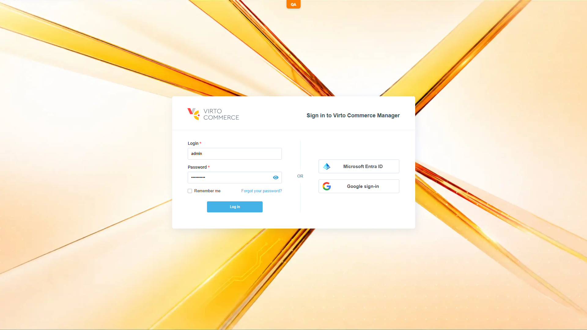
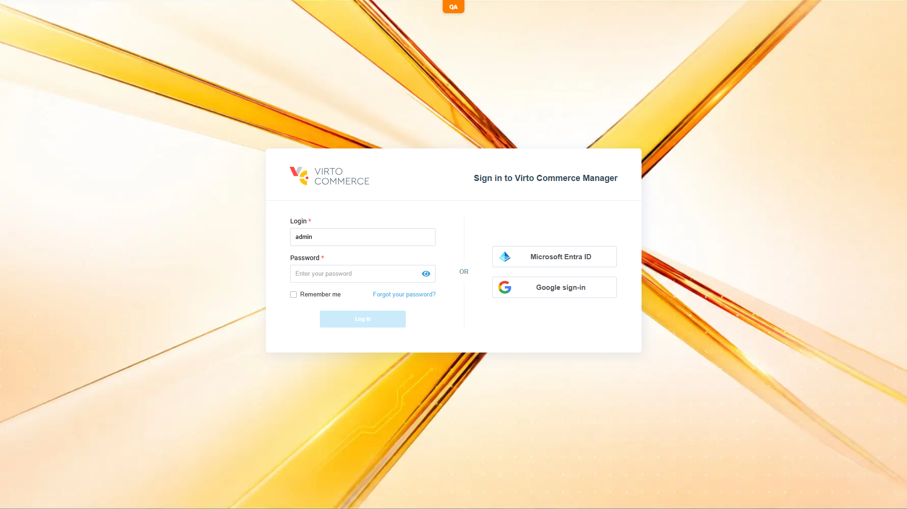

# Admin SPA: unhandled 401 *and 403* promise rejections after VCST-5618

## Status: READY_TO_SUBMIT

**JIRA:** [VCST-5622](https://virtocommerce.atlassian.net/browse/VCST-5622)
**Env:** vcst-qa @ Platform `3.1053.0-pr-3093-e27a`

## Summary

VCST-5618 fixed the platform to return a direct `401` (instead of a silently-followed `302→200`-login-HTML) on an expired admin session. That's correct, but it activated an AngularJS `$http` interceptor code path that was previously unreachable: the global `httpErrorInterceptor` correctly broadcasts `unauthorized` (redirecting to `#!/login`) but then still re-rejects the promise (`return $q.reject(rejection)`), and callers never added a `.catch()` because the interceptor was always meant to own the error channel. This produces "Possibly unhandled rejection" console noise across multiple blades — no functional or visual impact, the login redirect works correctly every time.

## Steps to Reproduce

1. Sign in to the Admin SPA, open a blade (e.g. Orders or Catalog), open DevTools console.
2. Sign out via the account menu, then press **Back** — the SPA restores the cached blade and re-fires its search against the now-dead session.
3. Observe the console.

Also reproduces on a cold, fully anonymous load of the login page itself (fires `GET api/platform/settings/VirtoCommerce.Platform.UI.WidgetColorMarkers`) — not session-expiry-specific, happens for every anonymous visit.

## Actual Result

| Trigger | Call | Console |
|---|---|---|
| Anonymous cold login-page load | `GET api/platform/settings/VirtoCommerce.Platform.UI.WidgetColorMarkers` → 401 | `Possibly unhandled rejection` |
| Orders blade ← Back after sign-out | `GET api/order/customerOrders/indexed/searchEnabled`, `POST api/order/customerOrders/search` → 401 | `Possibly unhandled rejection` (x2) |
| Catalog blade ← Back after sign-out | `POST api/catalog/catalogs/search` → 401 | `Possibly unhandled rejection` |
| Security blade ← Back after sign-out | 2x settings calls → 401 | `Possibly unhandled rejection` (x2) |
| Security blade — roles search | `POST api/platform/security/roles/search` → 401 | **handled** — `Failed to load roles: {...}` (different code path, has a real error callback) |
| Security blade — users search | `POST api/platform/security/users/search` → 401 | nothing — silently swallowed |
| **403 branch** — login as a low-permission back-office user (`@td(CATALOG_READ_ONLY.email)`, `catalog:read` only) | `GET api/platform/modules`, `GET api/platform/localizable-settings` → **403** | `Possibly unhandled rejection` (x2) |

All screenshots show a clean, correct login screen — this is console-only.

## Expected Result

No unhandled-rejection console noise on a correct 401/redirect flow (or, at minimum, consistent handling — the roles/users-search calls show two other, different behaviors for the same 401 case).

## Layer Validation

| Layer | Result | Evidence |
|-------|--------|----------|
| 1. Storefront Frontend | N/A | Admin SPA only |
| 2. Backend Admin | **FAIL** | 6 unhandled rejections observed, above |
| 3. GraphQL xAPI | N/A | not in path |
| 4. Platform REST API | PASS | 401 is the correct response; baseline authenticated calls all 200 |

**Owning layer:** Layer 2 — Admin SPA client-side error handling. The REST layer is correct; this is purely a missing/inconsistent promise-rejection consumer.

## Root Cause Analysis

**Single repo, single site — not multi-repo, not "N blades each missing a catch."** `vc-platform` → `src/VirtoCommerce.Platform.Web/wwwroot/js/app/app.js`:

```js
// L263-271 — global httpErrorInterceptor
httpErrorInterceptor.responseError = function (rejection) {
    if (rejection.status === 401) {
        $rootScope.$broadcast('unauthorized', rejection);
    } else {
        $rootScope.$broadcast('httpError', rejection);
    }
    return $q.reject(rejection);   // <- root cause: re-rejects after already handling it
};
```

401 already has complete global handling (`app.js:454-463` → `authService.logout()` + `$state.go('loginDialog')`, confirmed working live in every repro). The interceptor still re-rejects at line 270; per-blade calls use the success-only callback style by design (the interceptor is meant to own the error channel), so the derived promise has no handler and AngularJS 1.8.3's default `$qProvider.errorOnUnhandledRejections = true` prints the warning. `errorOnUnhandledRejections` is never configured repo-wide.

**Relationship to VCST-5618:** a latent gap newly *exposed*, not introduced. Pre-fix, the 302→200-HTML meant `responseError` never fired at all, so this code path was dormant. VCST-5618 correctly activated it.

**RCA anchor:** `src/VirtoCommerce.Platform.Web/wwwroot/js/app/app.js:270`

**The 403 branch is a SECOND, distinct path to the same line — a 401-only fix would not close it.** A low-permission (but validly authenticated) user takes the `else` branch → `broadcast('httpError')`. That listener (`app.js`, appCtrl) only acts *if a blade is open*:

```js
$scope.$on('httpError', function (event, error) {
    if (!event.defaultPrevented) {
        if (bladeNavigationService.currentBlade) {          // <- no blade at bootstrap
            bladeNavigationService.setError(error, bladeNavigationService.currentBlade);
        }
    }
});
```

The 403s fire during post-login bootstrap (`modulesApi.query()`, localizable-settings), before any blade exists, so nothing consumes the broadcast and line 270 re-rejects into the void. (The `pushNotificationService.error` fallback for `httpError` is commented out at `app.js` run-block.) So 401 is "handled then re-rejected" while 403 is "broadcast to no one, then re-rejected" — two different holes, one line.

Suggested direction (not prescriptive): stop re-propagating specifically the `401` case once the global handler has taken ownership, since no consumer examined reacts to it. **Weigh covering the `httpError` branch in the same change** — either don't re-reject once broadcast, or give the `httpError` listener a no-blade fallback; otherwise the read-only-user case above survives the fix. Caveats to weigh: a never-settling promise would leave `blade.isLoading = true` (harmless today since the login screen replaces the view, but a behavior change), and any future consumer wanting to react to a 401 would stop receiving it.

## Severity

**Low** — console noise only, no functional/visual impact (arguable Medium: the anonymous-login-page case fires on every visit and adds steady noise to browser telemetry).

## Screenshots




## Duplicate Check

Clean. The 403 branch was found independently on 2026-07-31 during a PLAT-079 run (suite `020`, `catalog:read`-only fixture) and folded in here rather than filed separately — same file, same line, same defect class.

## Fix Routing (→ /qa-fix)

- **Owning layer:** Layer 2 — Admin
- **Suggested repo:** VirtoCommerce/vc-platform
- **repoKind:** platform
- **Ownership hint:** platform
- **Component / module:** Admin SPA shell — global `$http` error interceptor (AngularJS)
- **RCA anchor:** `src/VirtoCommerce.Platform.Web/wwwroot/js/app/app.js:270`
- **Routing confidence:** HIGH — single repo, single anchor confirmed via `search_code` + live repro
