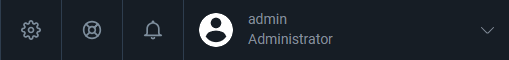
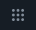

# Admin SPA top-bar icons: not keyboard-operable, no accessible name

## Status: CONFIRMED

**Env:** vcst-qa @ Platform `3.1053.0-pr-3093-e27a` (Admin SPA shell)

## Summary

The Admin SPA's top-bar controls (apps menu, settings gear, help link, notifications bell, user-menu avatar) fail WCAG 2.1.1 (Keyboard) and/or 4.1.2 (Name, Role, Value). The settings gear, notifications bell, and user-menu avatar are ``/`
` elements with `ng-click` handlers and `tabindex="-1"` — they have no role and **cannot be reached or operated by keyboard at all**, which axe-core's automated rules don't even flag (no accessible element to check). The apps-menu button and help link ARE reachable but expose no accessible name (`button-name`/`link-name`, axe-confirmed). Found incidentally during VCST-5618 exploratory testing; unrelated to that fix and pre-existing on `dev` HEAD.

## Steps to Reproduce

1. Sign in to the Admin SPA (`{{BACK_URL}}`) as any admin.
2. Tab through the top toolbar from the apps-menu (9-dot) icon rightward.
3. Observe: focus skips the settings gear and notifications bell entirely (`tabindex="-1"`); the apps-menu button and help link receive focus but have no visible/announced name.
4. Run axe-core scoped to the toolbar.

## Expected vs Actual

**Expected:** All interactive toolbar controls are keyboard-reachable, expose a role, and have an accessible name (translated, via the platform's existing i18n keys).

**Actual:**

| Control | Element | `tabIndex` | Accessible name | axe rule |
|---|---|---|---|---|
| Apps/links menu | `<button ng-click="toggleAppsMenu()">` + bare `<svg>` | `0` | empty | `button-name` (critical) |
| Settings gear | `` | **-1** | empty | not flaggable — no role |
| Help | `<a href="...docs" target="_blank">` (empty) | `0` | empty | `link-name` (serious) |
| Notifications bell | `` | **-1** | empty | not flaggable — no role |
| User-menu avatar | `
` | **-1** | has text ("admin / Administrator") | none (name OK, but unreachable) |

Icons are CSS `background-image` (no text alternative anywhere); the `va-tooltip` directive sets a visual-only tooltip, no `title`/`aria-label`. Hit-target sizes (60×60+) pass WCAG 2.5.5/2.5.8 — not a target-size issue.

**Violation signal:** the two roleless spans (gear, bell) are the more serious defect — they're invisible to both assistive tech and automated scanners, so an axe-only gate under-reports this toolbar.

## Layer Validation

| Layer | Result | Evidence |
|-------|--------|----------|
| 1. Storefront Frontend | N/A | Admin SPA shell only |
| 2. Backend Admin | **FAIL** | axe `button-name`/`link-name` + manual Tab-order walk + `tabIndex` reads |
| 3. GraphQL xAPI | N/A | static markup/ARIA, no data path |
| 4. Platform REST API | N/A | same |

**Owning layer:** Layer 2 — Admin SPA, pure presentation-markup defect.

## Root Cause Analysis

Pre-existing in `vc-platform`'s own AngularJS shell (not a module), confirmed present on `dev` HEAD — not introduced by PR #3093/VCST-5618. Exact anchors (`search_code`, one hit each):

- `src/VirtoCommerce.Platform.Web/wwwroot/js/app/navigation/header/header.tpl.html:8` — settings ``
- `.../header/header.tpl.html:12` — help `<a>` (empty)
- `src/VirtoCommerce.Platform.Web/wwwroot/js/app/pushNotifications/headerNotificationWidget.tpl.html:2-5` — bell ``
- `src/VirtoCommerce.Platform.Web/wwwroot/js/app/workspace.tpl.html:4,24` (button, duplicated block) + `:5,25` (bare `<svg>`) — apps-menu
- `src/VirtoCommerce.Platform.Web/wwwroot/js/app/security/login/headerUserProfileWidget.tpl.html` — avatar widget (`tabindex="-1"`)

The i18n keys `platform.menu.settings` / `platform.menu.help` / `platform.menu.notifications` already exist — the fix is `aria-label="{{'...' | translate}}"` on each, plus promoting the ``/`
` elements to `<button>` (or `role="button" tabindex="0"` + a keydown handler for Enter/Space).

## Success Criteria / Severity

- **2.1.1 Keyboard (A)** — gear, bell, avatar unreachable/inoperable by keyboard.
- **4.1.2 Name, Role, Value (A)** — all five controls lack a name; three also lack a role.
- **2.4.4 Link Purpose (A)** — empty help anchor.

**Severity: High.** (Not P0 — the standard "no accessible name" P0 tier is gated on EU-reachable public-storefront exposure under the EAA; this is the operator back-office, so that trigger doesn't apply. It sits at the top of High as a Level-A keyboard failure on core navigation chrome.)

## Screenshots

## Duplicate Check

Clean — globbed `reports/bugs/{open,fixed,closed}/`, `reports/tickets/Sprint*/`, and git log. Nearest neighbors are different surfaces (storefront `/cart` a11y, a Notifications-module blade, and vc-shell/Vendor Portal — a separate product). No prior report covers the platform shell toolbar.

## Fix Routing (→ /qa-fix)

- **Owning layer:** Layer 2 — Admin
- **Suggested repo:** VirtoCommerce/vc-platform
- **repoKind:** platform
- **Ownership hint:** platform
- **Component / module:** Admin SPA shell — top navigation header (AngularJS)
- **RCA anchor:** `src/VirtoCommerce.Platform.Web/wwwroot/js/app/navigation/header/header.tpl.html:8` (settings), `:12` (help); `.../pushNotifications/headerNotificationWidget.tpl.html:2-5` (bell); `.../workspace.tpl.html:4,24` (apps-menu)
- **Routing confidence:** HIGH — single repo, exact template file:line anchors confirmed via `search_code`
