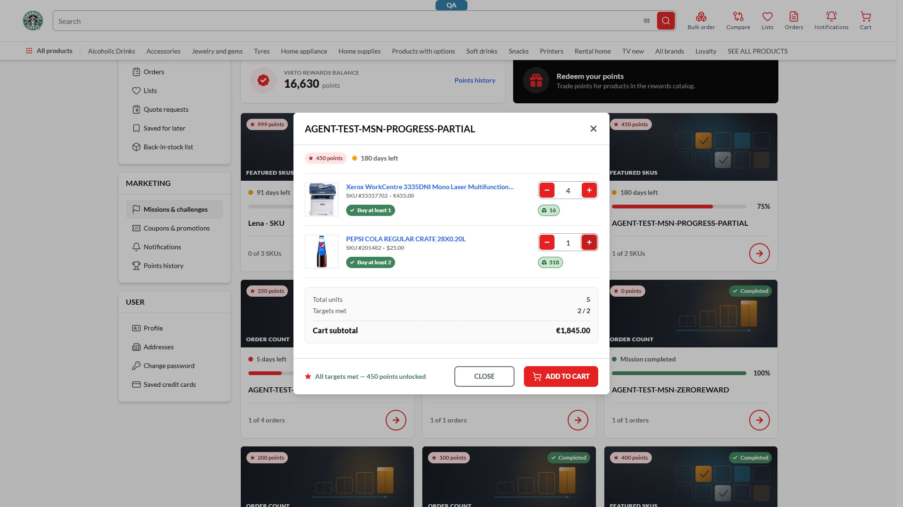

# Featured-SKU mission modal sums row amounts with no same-currency guard — `Cart subtotal €1,845.00` from a €455 row and a $25 row — **P2**

## Status: CONFIRMED
**Found by:** REG-2026-08-27-1731 · suite 083c (MSNF-029) · triaged REAL_BUG (live-verified)
**Archetype:** `MONEY`

**Env:** vcst-qa @ Theme `2.57.0-pr-2396-5924`, store `B2B-store`, session currency USD, chrome/1920px, signed in.

## Summary
The featured-SKU mission modal computes its `Cart subtotal` by adding the raw `amount` of each product row and formatting the sum with **one row's** currency symbol, with no check that the rows share a currency. Given a €455.00 row and a $25.00 row it renders `€1,845.00` — an amount that is correct in **no** currency. This is a client-side arithmetic guard, separate from the API defect that produced the mixed rows, and it survives that fix.

**The cart page proves this is the modal's own defect, not a platform-wide one.** Re-verified in REG-2026-08-28-1057 with a different quantity mix (455×2 + 25×3), where the modal rendered `Cart subtotal €985.00`. For the *same* cart contents, the cart page does **not** sum across currencies — it segregates them into a USD block and a separate `Total in EUR` block. So the correct handling exists elsewhere in the storefront and the modal alone adds unlike currencies. (The cart's own split has a different problem — its USD total omits the EUR merchandise — which belongs to the parent defect, not here.)

## STR
1. Signed in as the loyalty-missions fixture account, session currency **USD**.
2. Go to `/account/missions`.
3. Open the mission `AGENT-TEST-MSN-PROGRESS-PARTIAL` (any featured-SKU mission whose rows resolve to two different currencies).
4. Set the Xerox `55557702` row quantity to `4`, leave Pepsi `201482` at `1`.
5. Read the modal's `Cart subtotal`.

## Expected vs Actual
- **Expected:** the modal refuses to sum across currencies — it suppresses the subtotal (or shows it per currency / as unavailable) rather than presenting a formatted money value that is arithmetically meaningless. A money total is only well-defined over one currency.
- **Actual:** `Cart subtotal €1,845.00` = `455 × 4` + `25 × 1` = `1820 + 25`, with `€` taken from the first row. No warning, no per-currency split; the value reads as a real total and is presented directly above `ADD TO CART`.

## Evidence

Trace: `reports/regression/REG-2026-08-27-1731/traces/MSNF-029-FAIL-trace.json`.

> Cite the **mechanism, not the number** — the figure moves with the row quantities (the original static capture read `€1,390.00`, the live verification `€1,845.00`, same defect).

## Layer Validation

| Layer | Result | Evidence |
|-------|--------|----------|
| 1. Storefront Frontend | **FAIL** | the subtotal is computed and formatted in the modal component; the API returns no such aggregate |
| 2. Backend Admin | N/A | not admin-visible |
| 3. GraphQL xAPI | PASS *(for this defect)* | it returns per-row `amount` + `currency.code` — the currency IS on the wire and is discarded by the sum. Its own defect is filed separately |
| 4. Platform REST API | N/A | — |

**Owning layer:** Layer 1 — Storefront.

## Business rules violated
**BL-PRICE-005** (a displayed money value must belong to one price list / currency). The row-level `currency.code` is present in the response and unused, which is what makes this a client-side guard rather than a data problem.

## Why this is filed separately from the API defect
`BUG-loyalty-mission-progress-serves-non-session-currency-price.md` (P1, `vc-module-loyalty`) is what makes the rows disagree today. **Fixing it hides this defect without removing it** — the summation still has no same-currency guard, so any future path that yields mixed rows (a new price-list configuration, a partially-priced product, a multi-currency store) reproduces the meaningless total. Different repo, different owner, independently fixable.

## Related, not duplicates
`BUG-non-usd-price-zero-display.md` is a *zero*-price rendering guard for a product with no price in the selected currency; this is a *summation* guard across two present, non-zero, differently-denominated amounts. `BUG-admin-dashboard-kpi-tiles-clip-multicurrency-values.md` is an Admin SPA layout clip, unrelated mechanism.

## Root cause
The modal's subtotal is a plain `reduce` over `rows[].price.amount × quantity`, formatted with a currency symbol taken from a single row (or the session), with no assertion that every row's `currency.code` matches before the sum is displayed.

## Fix Routing (→ /qa-fix)

- **Owning layer:** Layer 1 — Storefront
- **Suggested repo:** `VirtoCommerce/vc-frontend`
- **repoKind:** frontend
- **Ownership hint:** platform
- **Component / module:** loyalty missions — featured-SKU mission modal, subtotal computation
- **RCA anchor:** the mission-modal component under the loyalty/missions account surface; `search_code repo:VirtoCommerce/vc-frontend "Cart subtotal"` scoped to the missions modal, then the `reduce`/`computed` that builds the subtotal from the row amounts.
- **Routing confidence:** HIGH — the aggregate exists only in the client; the API returns no subtotal field.
