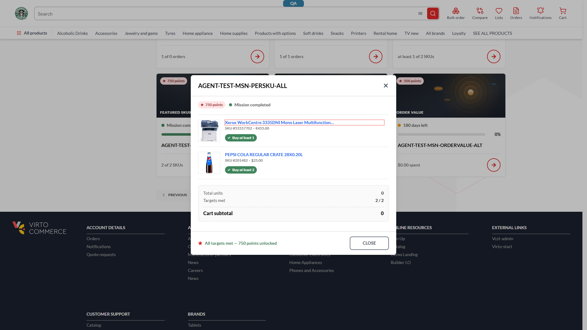
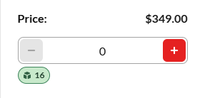

# `loyaltyMissionProgress` serves a non-session-currency price — Xerox `55557702` returns €455.00 in a USD session while the catalogue returns $349.00 — **P1**

## Status: CONFIRMED
**Tracker:** VCST-5841 (Subtask of VCST-5319)
**Found by:** REG-2026-08-27-1731 · suite 083c (MSNF-028, MSNF-029) · triaged REAL_BUG (live-verified twice)
**Archetype:** `MONEY`

**Env:** vcst-qa @ Theme `2.57.0-pr-2396-5924`, module `VirtoCommerce.Loyalty @ 3.1006.0-pr-14-1be7`, store `B2B-store`, session currency USD, chrome/1920px, signed in.

## Summary
The `loyaltyMissionProgress` xAPI operation resolves its nested `items[].product.price` **without applying the store's currency context**, so it serves whichever price list it finds first per product rather than the store's. On a USD session, featured SKU `55557702` (Xerox WorkCentre 3335DNI) comes back as **€455.00** while the ordinary catalogue returns **$349.00** for the same product in the same session. The operation exposes no `currencyCode` argument at all, so the storefront cannot request the right one; the fix is resolver-side.

**This is not display-only — the wrong currency is durably written to the cart.** The storefront faithfully propagates the price object's `currency.code`, so adding the item from the mission modal sends `itemCurrencyCode: "EUR"` and the server stores a **EUR line item in a USD cart**, which survives a hard reload and reaches an enabled "Place order". Verified in REG-2026-08-28-1057 (MSNF-037); see §Cart propagation.

## STR
1. Signed in as the loyalty-missions fixture account on `{{FRONT_URL}}`, session currency **USD** (header currency selector reads `Currency: USD`; cart and catalogue render `$`).
2. Go to `/account/missions`, wait for the mission card grid.
3. Open the featured-SKU mission `AGENT-TEST-MSN-PERSKU-ALL` (or `AGENT-TEST-MSN-PROGRESS-PARTIAL` — same mechanism).
4. Read the currency symbol and amount on each product row.
5. Close the modal and open the PDP for SKU `55557702` via the catalogue; read its price.

## Expected vs Actual
- **Expected (BL-PRICE-005):** every modal row resolves from the **session currency's** price list — `$349.00` for `55557702`, matching the PDP. A product with *no* price in the session currency renders as **unavailable**, never as another currency's amount.
- **Actual:** the modal renders `SKU #55557702 · €455.00` on one row and `SKU #201482 · $25.00` on the adjacent row. The PDP for the same SKU, same session, renders `$349.00`.

## Evidence

Trace: `reports/regression/REG-2026-08-27-1731/traces/MSNF-028-FAIL-trace.json`. Further shots in that run's `screenshots/` (`MSNF-028-*`, `MSNF-029-*`) — gitignored, the two above are the preserved copies.

## The three fields that settle it
Live verification, same signed-in session, currency USD:

| Path | `price.actual.amount` | `price.actual.currency.code` | resolved from price list |
|---|---|---|---|
| `loyaltyMissionProgress → items[].product.price` (SKU `55557702`) | `455` | **`EUR`** | `5767def9-…` |
| `products(currencyCode:"USD") → price.actual` (same SKU) | `349` | `USD` | `86e88675…` |
| `loyaltyMissionProgress → items[].product.price` (SKU `201482`) | `25` | `USD` | — |

**The product has a USD price and the loyalty path serves the EUR one anyway.** SKU `201482` looks correct only because it has no EUR price at all — it is the control, not a passing case.

**No argument exists to fix this client-side.** The schema signature (`knowledge/api/graphql-schema.md:125`) is
`loyaltyMissionProgress(after, first, keyword, sort, storeId!, statuses, completedStartDate, completedEndDate, cultureName, isStarted, userId)` — `cultureName` is there, `currencyCode` is not. Probing it live returns `Unknown argument 'currencyCode' on field 'loyaltyMissionProgress'`.

## Layer Validation

| Layer | Result | Evidence |
|-------|--------|----------|
| 1. Storefront Frontend | PASS | renders the API response faithfully — `€455.00` is what the wire carried |
| 2. Backend Admin | N/A | not admin-visible; the USD price list exists and is correct in Pricing |
| 3. GraphQL xAPI | **FAIL** | `loyaltyMissionProgress` returns `currency.code: EUR` in a USD session; no `currencyCode` arg on the field |
| 4. Platform REST API | PASS | both price lists exist and are correct; the catalogue path resolves USD for the same SKU |

**Owning layer:** Layer 3 — GraphQL xAPI.

## Cart propagation — the wrong currency is written, not just shown
Confirmed live in REG-2026-08-28-1057 (case MSNF-037), chrome, USD session.

Adding Xerox from the mission modal sends, verbatim:
`{"items":[{"productId":"4b729fae…","quantity":2,"itemCurrencyCode":"EUR"}, …],"storeId":"B2B-store","currencyCode":"USD","cultureName":"en-US"}`
The server accepts it and echoes `{"sku":"55557702","currencyCode":"EUR"}` while the cart's own `currencyCode` stays `USD`. After navigating away and hard-reloading `/cart`, the server still returns that line as **EUR** (`listPrice €455.00`, `extendedPrice €910.00`) — so this is durable server-side state, not a rendering artefact.

**Control (decisive):** the same product id, same cart, same session, added from its ordinary **PDP** writes `itemCurrencyCode:"USD"` → `$349.00 × 2`. **Only the mission path writes EUR.**

**What it does NOT do.** The amount is never mislabelled as USD — there is no `$455.00` anywhere, so customers are not silently overcharged ~30%. The cart does not sum across currencies either: it *splits*, showing a USD block (`Subtotal $75.00 / Total $90.00`) beside a separate `Total in EUR €910.00`. The USD total therefore **omits the €910 of merchandise entirely**.

**Where it ends.** With delivery and a manual payment method selected, **"Place order" is enabled** on a cart carrying two unreconciled totals and no single grand total. Testing stopped there — no order was placed. Whether the platform converts or rejects at order creation is **untested**; that is the open question a fix must answer.

## Back-office grounding — the pricing config is well-formed; the fault is in the read path
Admin/Platform REST, read-only. Product `55557702` = `4b729fae613046448aaba7c265bb4f2d`, physical catalog `MFD`; store `B2B-store` catalog = `fc596540…` (B2B-mixed), `defaultCurrency USD`, EUR **is** an allowed store currency.

| Price list | id | Cur | list | Assignment → target, priority |
|---|---|---|---|---|
| `MFDUSD` | `86e88675…` | USD | **349.00** | → catalog `fc596540…` (the store's own), **prio 1**; plus a store-scoped contract assignment at **prio 10000** |
| `MFD_EUR` | `5767def9…` | EUR | **455.00** | → catalog `fc596540…`, **prio 1** — its only assignment, never store-scoped |

Those are the product's **only two** price entries. No date windows. Pepsi `201482` has a single USD price and no EUR price, which is why it cannot exhibit the fault.

**Priority is positively ruled out as the explanation.** Both assignments sit at prio 1 on the same catalog, and the USD list additionally has a *higher* (10000) store-scoped assignment — on any priority-based reading USD should win, not lose.

**The platform's own resolver is correct when asked.** `POST /api/pricing/evaluate` (productId + `catalogId=fc596540…` + `storeId=B2B-store`):
- `currency: "USD"` → `[86e88675… USD 349]` — EUR correctly filtered out
- `currency: "EUR"` → `[5767def9… EUR 455]`
- **currency omitted** → `[5767def9… EUR 455, 86e88675… USD 349]` — **EUR first, stable across 3 runs**

That last line reproduces the loyalty symptom exactly. The configuration resolves correctly the moment a currency is supplied, so the defect is that the loyalty path supplies none.

## Business rules violated
**BL-PRICE-005** — violated twice: a **non-session price list** is activated, *and* it is activated for a product that **does have** a session-currency price. Per the invariant, the correct behaviour for a product with no price in the session currency is *unavailable*, never another currency's amount. Also **ECL-14.4**.

## Related, not duplicates
- `BUG-non-usd-price-zero-display.md` — **related, NOT a duplicate.** That one renders a literal `€0.00`/`£0.00` with `isBuyable:false` for a product that has **no** price in the selected currency (an unguarded zero). This one renders a **non-zero foreign-currency amount** for a product that **does** have a session-currency price. Opposite input condition, opposite output; do not merge them.
- Memory `project_vcst_qa_missing_eur_product_pricelist` **does not apply** — its signature is "EUR selected ⇒ every product €0.00 because no EUR product list exists"; here USD is selected, a EUR amount is served, and both price lists demonstrably exist.
- `vc-bug-catalog` **VC-LOY-001** is the inverse and is `BY-DESIGN`: a documented PTS→**session**-currency reversion. This defect is a resolver ignoring the session currency, so VC-LOY-001 is not cover for it.
- Sibling defect on the same modal: `BUG-loyalty-mission-modal-sums-mixed-currency-subtotal.md` (P2, `vc-frontend`) — it survives this fix.

## Root cause
The mission-progress resolver hydrates each featured SKU's `product.price` **omitting the session-currency filter** from the pricing evaluation, so the pricing service returns every currency's row and the first one wins — deterministically EUR for this product. (Not "picks the wrong list by priority": the priorities rule that out — see §Back-office grounding.) The field's own signature confirms the omission is at the contract level, not just the call site — `cultureName` was threaded through and `currencyCode` was not.

**Not a caller-context defect — ruled out by direct inspection.** The storefront's own `GetLoyaltyMissionProgress` request passes every context argument the field accepts (`storeId: "B2B-store"`, `cultureName: "en-US"`) and authenticates with a bearer token carrying the user identity; `userId`, `organizationId` and `currencyCode` are not arguments on this field. This matters because most xAPI operations take their context optionally and answer with a silent default when it is omitted (`graphql-schema.md` Rule 12), so "the caller forgot the context" was the leading alternative explanation.

**The discriminator sits inside a single response.** In that same response, featured SKU `55557702` returns `currency.code: "EUR"` while the adjacent row `201482` returns `"USD"` — one request, one context, two currencies. No property of the caller's context can explain a per-product split, which places the defect in per-product price-list selection inside the resolver. `55557702` returns EUR across all five missions that reference it.

## Fix Routing (→ /qa-fix)

- **Owning layer:** Layer 3 — xAPI
- **Suggested repo:** `VirtoCommerce/vc-module-loyalty`
- **repoKind:** module
- **Ownership hint:** platform
- **Component / module:** Loyalty missions — `loyaltyMissionProgress` resolver / featured-SKU product hydration
- **RCA anchor:** the `loyaltyMissionProgress` query type + the mission-item product/price hydration path; `search_code repo:VirtoCommerce/vc-module-loyalty "loyaltyMissionProgress"` and the pricing-evaluation-context construction next to it. A complete fix adds `currencyCode` to the field signature **and** threads it (defaulting to the store currency) into the price evaluation.
- **Routing confidence:** HIGH — the wrong value is on the wire before the storefront sees it, and the missing argument is in this module's own schema.
- **Note on the registry:** `vc-module-loyalty` has **no entry in `ci/config/fix-repos.json` `routing[]`**, so `/qa-fix` gets no routing *hint* — but `isAllowedRepo()` passes it on the `^vc-module(-x)?-[a-z0-9.-]+$` pattern, so it **clears Gate 1**. Not blocked; just unhinted.
