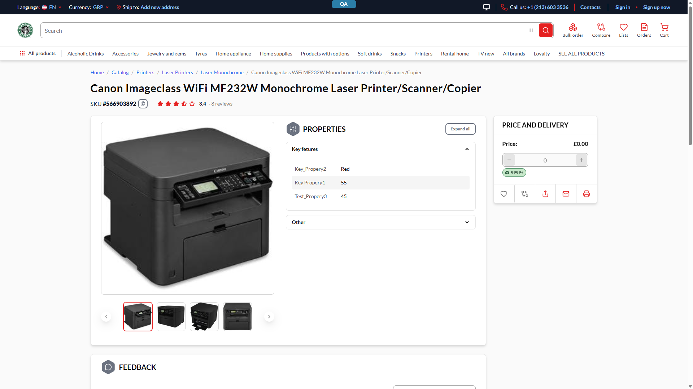
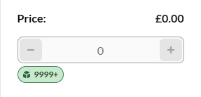

# PDP renders a literal `£0.00` / `€0.00` for products with no price list in the selected currency — P1

**Env:** vcst-qa @ Platform 3.1061.0, Theme 2.56.0-pr-2448 (re-confirmed 2026-08-25, chrome/1920px, guest)

## Summary
When the storefront currency is switched to one the store has no price list for, the PDP renders a literal zero price (`Price: £0.00`) while the availability chip still reads "In stock 9999+", with no unavailability message. Every other surface handles the same condition correctly — listing/search hide the product, the bulk-order pad rejects it with "Price is invalid", and the PDP's own qty stepper is disabled — so this is an unguarded **price display**, not a missing capability. No order can be placed at the zero price, but the whole catalog is affected on most of the store's currencies.

## STR
1. On any PDP for a product that is priced in the store default currency but absent from the selected currency's price list, set the header currency switcher to a currency with no price list (on vcst-qa: **GBP** — no GBP price list exists at all).
2. Observe the "Price and delivery" sidebar.

## Expected vs Actual
- **Expected:** the price is suppressed or replaced with an unavailability state (the UI kit's own `N/A` path), and the in-stock chip is not presented as if the item were purchasable — consistent with listing/search/bulk-order, all of which already treat the product as unavailable.
- **Actual:** `Price: £0.00` renders as a real price, alongside a green "In stock 9999+" chip and no unavailability message. The "Customers bought together" carousel on the same page renders `£0.00` for every item.

## Evidence

## Payload — this is what settles the routing
`GetProduct` (storefront `/graphql`), same product, `currencyCode` the only variable changed. The API returns a **present, fully-populated `PriceType` whose Money members are all `amount: 0`** — never `null`, never absent — so the UI kit's nullish guard cannot fire. It **also** returns a correct unavailability signal:

| `currencyCode` | `price.actual` | `isBuyable` | `isAvailable` | `isInStock` | PDP stepper |
|---|---|---|---|---|---|
| store default (USD) | `189.00` / `$189.00` | `true` | `true` | `true` | enabled |
| no price list (GBP) | `0` / `£0.00` | **`false`** | **`false`** | `true` | disabled |

Full payloads: `reports/regression/REG-2026-08-24-1806/triage-verify/gql-221-GetProduct-{GBP,USD}-resp.json`.

## Root cause
The storefront **already receives and already consumes** the authoritative signal: `availabilityData.isBuyable === false` is what disables the qty stepper (proven by the A/B above — the only thing that changed is the currency). The price display and the stock chip are simply not gated on it. The UI-kit price atom guards on nullish only (`value?.formattedAmount ?? "N/A"`), and a zero-amount Money is not nullish, so the existing `N/A` path is unreachable for this condition.

Routing to the backend instead would **not** fix the bug: making the API return `null` would clear the price, but the "In stock 9999+" chip is driven by `isInStock`/`availableQuantity`, which are *factually correct* — there is real stock. Only the storefront can suppress the chip for a non-buyable product. The zero-amount Money is a separate API-contract wart worth raising on its own, but it is not on the path to fixing this.

## Blast radius — systemic, not one product
Measured on the catalog page, same session, currency the only variable (counts drift with re-seeds; the **ratio** is the finding):

| Currency | Catalog results |
|---|---|
| store default (USD) | 3,506 |
| EUR | 13 |
| GBP | 0 |

Listing correctly hides every unpriced product, so the zero price is only reachable where the hide-path does not apply: **direct/bookmarked/shared PDP links, search-engine entry, and the recommendation carousels.** In GBP that is the entire catalog; in EUR it is all but 13 products. The switcher offers 9 currencies (USD, AUD, CNY, CZK, EUR, GBP, GHS, XPT, PTS) — only USD, EUR and GBP were measured, so the other six are unquantified (PTS is loyalty points and likely has different semantics).

## Severity — P1, not P0: no oversell path (verified, not assumed)
Every add-to-cart entry point was exercised in GBP against a zero-priced product:

| Path | Result |
|---|---|
| PDP qty stepper (the stepper *is* add-to-cart here) | all three controls disabled |
| "Customers bought together" carousel | display-only, no stepper |
| Homepage "Daily Deals" widget | product list renders empty (hidden) |
| **Bulk order pad (SKU,qty — bypasses the PDP entirely)** | server-side reject: **"Price is invalid"**, cart stayed empty |

The bulk-order pad is the one path that skips PDP gating, and it is guarded server-side — so nothing reaches the cart and no order can be placed at `0.00`. Raised **P2 → P1** on blast radius rather than on impact: this is a customer-facing mispricing across effectively the entire catalog on every currency measured except the store default, reachable by any shared or indexed PDP link.

## Refs
- **BL-PRICE-005** — violation signal *"products without currency-specific prices still show a price"* (literal match).
- **BL-PRICE-006** — *"No prices should fall back to $0 — they should show as 'Unavailable'"*. Its other two signals do **not** apply: Add to Cart is not enabled, and no order can be placed.
- **BL-CROSS-001** — display half only (`$0.00` shown); the purchase halves do not apply.

## History
Persistent, not flaky: suite 002 `CAT-054` has failed on this signature across runs since 2026-07-14 (REG-2026-07-14-0018, -07-24-2121, -08-06-0937, -08-24-1806) and has never passed. Originally filed against Platform 3.1043.0 / Theme 2.53.0-pr-2368; still present on 3.1061.0 / 2.56.0-pr-2448.

## Fix Routing
- **Repo:** `vc-frontend` — **settled** (was previously recorded as ambiguous). Gate the PDP price display and the availability chip on `availabilityData.isBuyable`, routing the non-buyable case to the price atom's existing `N/A` / unavailable path; the same atom fix covers the recommendation carousels.
- **Kind:** frontend
- **Secondary, do not block on it:** `vc-module-x-catalog` returns a zero-amount `PriceType` where no price list covers the requested currency. Worth a separate contract discussion (zero Money vs `null`), but fixing it alone leaves the "In stock" chip wrong.
