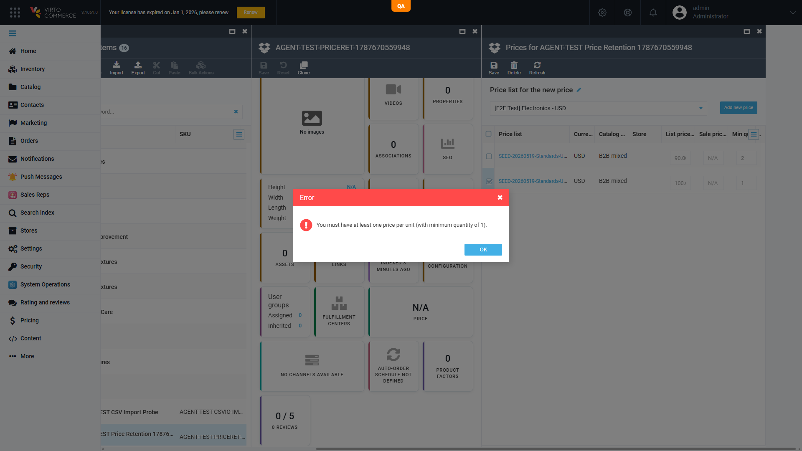
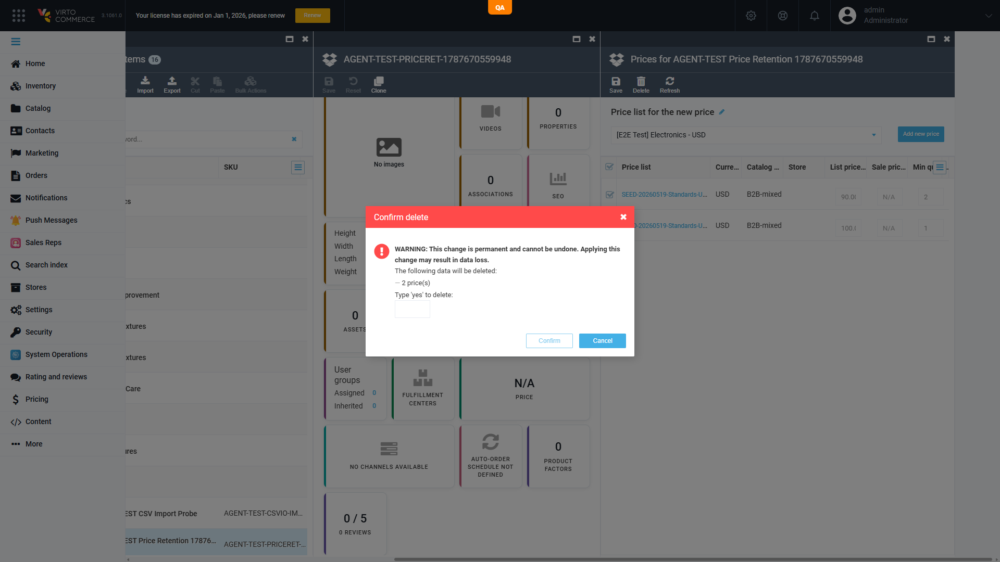

# Min-qty-1 price retention guard is client-side only, and selecting *every* row bypasses it — product left with zero prices `[P1]`

**Env:** vcst-qa @ Platform `3.1061.0`, Pricing `3.1006.0` · confirmed live 2026-08-25
**Cases:** `PRICE-021` (passes — the guard), `PRICE-022` / `PRICE-023` (fail — the bypass), suite `054`
**Tracker:** not filed

## Summary
A product must keep at least one price with minimum quantity 1. That invariant is enforced **only** in the Admin SPA blade (`item-prices.js`), and its condition is inverted at the boundary: the check is skipped entirely when **no** row is left unselected. Selecting *more* rows therefore makes the guard *weaker* — "Select all" → Delete strips every price and leaves the product at zero, while deleting the same last min-qty-1 row on its own is correctly refused. The platform API applies no retention check at all.

## Steps to Reproduce

**A — the guard (works):** Admin → Catalog → any product → Price widget. With exactly two prices present — one `min qty = 1`, one `min qty = 2` — tick **only** the `min qty = 1` row → **Delete**.
→ Error dialog: *"You must have at least one price per unit (with minimum quantity of 1)."* Nothing is deleted. ✅

**B — the bypass (same product, same row):** tick the grid header **Select all** so both rows are selected → **Delete**.
→ No error dialog. The ordinary *"Confirm delete — 2 price(s)"* prompt appears; confirming deletes both. The Prices blade renders **"No data"**; the product widget reads **"N/A PRICE"**.

**C — API layer, no guard at any selection size:**
```
DELETE /api/pricing/products/prices?priceIds=<lastMinQty1Id>            → 204, price gone
DELETE /api/pricing/products/prices?priceIds=<id1>&priceIds=<id2>       → 204, both gone
```
Even the **single-row** delete of the last `min qty = 1` price is accepted. Step A's refusal exists only in the browser.

Fixture: a disposable `AGENT-TEST-` product created for this run, priced into two store-assigned USD price lists (`min qty` 1 / 2 / 1), then deleted. Never run against a shared fixture.

## Expected vs Actual
- **Expected:** the retention rule holds for every delete path and selection size, and is enforced **server-side** — `DELETE /api/pricing/products/prices` rejects any set whose removal would leave the product with no `min qty = 1` price (4xx + reason), with the blade dialog as a convenience echo.
- **Actual:** the rule holds only for a partial UI selection. Select-all in the UI, and any API call, silently reduce the product to zero prices with a `204`.





## Storefront impact — this is a revenue-path defect, not only data integrity
Measured on the same product via storefront xAPI (`products`), before and after the bulk delete:

| | `price.actual` | `isBuyable` | `isAvailable` | `isInStock` |
|---|---|---|---|---|
| with prices | `$95.00` | `true` | `true` | `true` |
| after bulk delete | **`$0.00`** | **`false`** | **`false`** | **`false`** |

`totalCount` stays `1` — the product is **still listed**, now at $0.00 and unpurchasable. One admin mis-click silently delists a live SKU while leaving it visible in the catalog. For how a zero price then renders on the PDP see `BUG-non-usd-price-zero-display.md` (same symptom, different cause — do not merge).

## Root cause
`vc-module-pricing` → `src/VirtoCommerce.PricingModule.Web/Scripts/blades/item/item-prices.js`, delete command:

```js
if (selection.some(x => x.minQuantity == 1)) {
    var unselected = _.difference(blade.currentEntities, selection);
    if (unselected.length && !unselected.some(x => x.minQuantity == 1)) { /* block */ }
}
```

`unselected.length` short-circuits the block. When every row is selected, `unselected.length === 0` and the guard never evaluates — yet that is precisely the case that empties the product. The condition should be *"no `min qty = 1` price survives"*, which is true when `unselected` is empty.

Server-side, `PricingModuleController.DeleteProductPrice(string[] priceIds)` calls `priceService.DeleteAsync(priceIds)` with no validation, so there is no second line of defence — the check must move (or be duplicated) into the domain service.

## Oracle gap — MISSING invariant
Both `PRICE-022` and `PRICE-023` cite **`BL-PRICE-002`**, which is the **tax-position** rule. That is a mis-citation. The invariant these cases actually exercise — *at least one price per single unit must survive any delete* — **is not recorded in `business-logic.md` at all**. It is a MISSING candidate for `/qa-review-oracles bl`; the citations in suite `054` should be remapped once the new ID exists. Not edited here.

## Fix Routing
**Repo:** `VirtoCommerce/vc-module-pricing`
**Layers:** Admin SPA (`Scripts/blades/item/item-prices.js` — fix the inverted condition) **and** backend (`PricingModuleController.DeleteProductPrice` / the pricing domain service — add the authoritative retention check). Both are in the same repo; the server-side half is the one that actually closes the hole.
