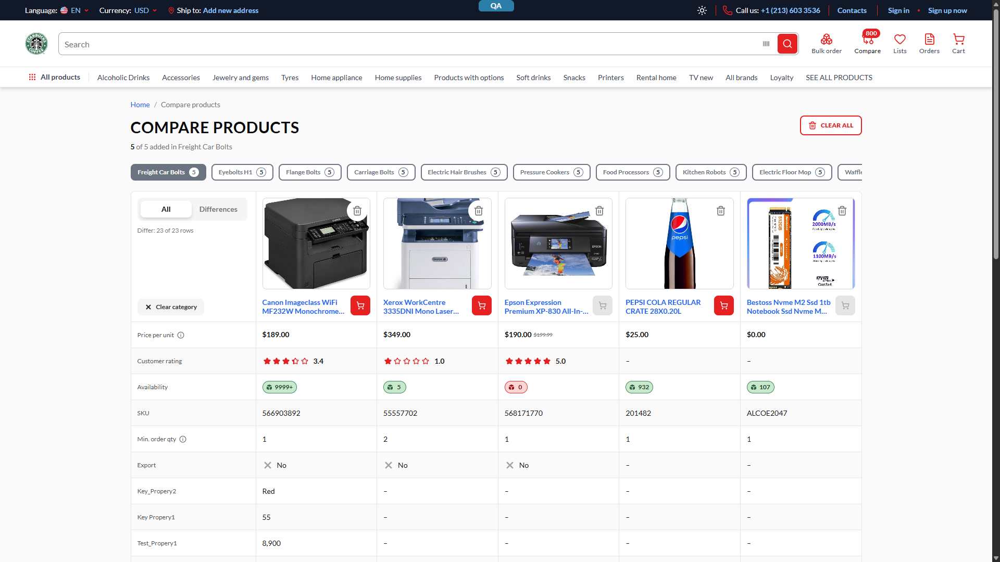

# Compare v2 — Compare page freezes and sometimes becomes unresponsive — P2

## Status: FILED — [VCST-5938](https://virtocommerce.atlassian.net/browse/VCST-5938) (screenshots attached AND embedded inline, verified via renderedFields)
**Severity:** Medium/P2 · **Type:** Performance / unbounded fetch · **Archetype:** `SCALE`
**Found by:** `/qa-bug`, 2026-09-10 — user report: *"Compare page became frozen when too many categories with products different types, configurations"*
**Env:** vcst-qa · theme `2.58.0-pr-2469-83d6-83d6e5d5` · Platform `3.1064.0` · Chrome 152, desktop, no throttling.

## Summary
`/compare` renders **one** category tab at a time (≤ `product_compare_limit`, 5 columns), but on load it fetches
every tab's products in a single `SearchProducts` query and issues a `createConfiguredLineItem` mutation for
**every** configured entry in **every** tab — neither path reads `selectedCategoryKey`. The 5-product limit is
**per category with no overall cap**, so the list grows without bound: 160 tabs × 5 = 800 products, reached
through the normal UI (badge showed `800`), returns **3.1 MB in 20 860 ms cold** — content **blank for 21.7 s**.

**Not a main-thread freeze** — worst rung: longest task 143 ms, INP 64 ms. The page waits on the server.

> **Open thread.** The reporter states the **browser was truly unresponsive** (no scroll/click), not merely slow;
> not reproduced in ten runs on desktop Chrome 152 at 1× CPU. The configured-entry axis (below, 2026-09-10)
> supplies the missing mechanism — the queue is **server-drain-bound, not main-thread-bound**, so at that scale
> the tab is blank with its connection budget spent while the main thread idles. The 800-configured rung was
> deliberately not run against shared vcst-qa; whether saturation alone kills the tab stays open.

## Steps to Reproduce
1. Open `{{FRONT_URL}}/compare` (anonymous is fine — compare is localStorage-backed).
2. Build a list spanning many categories. Deterministic path: seed `localStorage["compareProducts"]` with
   `[{productId, categoryKey}]` — `categoryKey` = the product's first two **Category** breadcrumb `itemId`s
   joined with `/`; discover ids live via `childCategories` + `products`. UI-only path: §Configured-entry axis.
3. Hard-reload `/compare`.

**Expected:** the selected category's ≤5 products render promptly; other tabs load on demand.
**Actual:** blank for ~21 s; one `SearchProducts` with `first: 800` returning ~3.1 MB.

> **Verifier caveat — looks intermittent.** A second reload with the **same** id set returns in **1819 ms**
> (backend cache); 20.9 s is the **cold** path. Every real list is a unique id set, so real users hit it cold —
> change the id set (re-seed at a different `after` offset) to measure cold again.

## Measured ladder (all figures from this session)

| Cats | Products | Configured | `SearchProducts` first / dur / size | Table visible at | Longest task | TBT | Responsive |
|---|---|---|---|---|---|---|---|
| 1 | 2 | 0 | 2 / 461 ms / 12 KB | 1170 ms | 85 ms | 35 ms | — |
| 20 | 100 | 0 | 100 / 3060 ms / 391 KB | 3845 ms | 86 ms | 38 ms | Y |
| 30 | 114 | **45** | 114 / 1776 ms / 431 KB | 2774 ms | 107 ms | 57 ms | Y (INP 64 ms) |
| 80 | 400 | 0 | 400 / 4857 ms / 1604 KB | 5816 ms | 99 ms | 89 ms | Y |
| **160** | **800** | 0 | 800 / **20 860 ms** / **3160 KB** | **21 751 ms** | 143 ms | 136 ms | **NO — blank 21.7 s** |
| 160 (warm) | 800 | 0 | 800 / 1819 ms / 3160 KB | 3087 ms | 139 ms | 128 ms | Y |

Payload is linear at ≈3.95 KB/product; cold **duration** is super-linear (400→800 doubles the count, ×4.3 the
time) — the knee sits between 400 and 800. **Zero console errors, Vue warnings, GraphQL `errors[]` or failed
requests on every rung.** **Dominant axis: TOTAL distinct products across all categories** — varied one at a
time, 160 tabs alone render fine (tab-switch INP 64 ms) and property count (1–16) made no difference.

Further evidence: `compare-R4-22configured.png` in the same folder.

## Configured-entry axis — follow-up, 2026-09-10 (live UI, real catalog, no seeding)

12 compare entries built **through the storefront UI only** from live `products-with-options` products, over 5
category tabs (Configurable Parents 5 · caps & shirts 2 · bikes 3 · beds 1 · cakes 1); 11 carry a configuration.
Only the selected tab's 5 columns render. Figures from the raw Chrome trace:

| Observation | Value |
|---|---|
| GraphQL requests in the load burst | **16**, all sent inside a **10 ms** window |
| of which `createConfiguredLineItem` | **11** — one per configured entry, **across all 5 tabs**, not just the visible one |
| Mutation completions (warm) | 186 · 202 · 204 · 304 · 399 · 399 · 512 · 515 · 594 · 596 ms — a staircase: the server drains **2–3 at a time**, ≈15–18/s |
| `SearchProducts` (paints the table) | issued **last in the burst**, finished **605 ms** — behind the whole mutation queue |
| Main thread | 2 long tasks (82 ms, 135 ms), TBT ≈ 117 ms, LCP 1441 ms — **not the bottleneck** |

One "Remove from compare" after settle fired 1 full `SearchProducts` and **0** mutations — the
`configuredEntriesSignature` guard holds.

**What this adds to the RCA:** the configured fan-out is queued *ahead of* the query that paints the table and
drains at a fixed server rate, so time-to-table grows **linearly in the configured-entry count anywhere in the
list** (≈ N/16 s). At the reporter's shape (160 tabs × 5 = 800 configured) that is **≈45–55 s** of mutations
ahead of the products query with ~800 fetches outstanding on one origin — blank tab, spent connection budget,
idle main thread, which is why the earlier ladder found no long tasks.
Screenshot: `compare-configured-11-entries-5-tabs.png`.

**Second defect, same code path (code-derived, NOT live-reproduced):** the wave has **no `AbortController`** —
`onCleanup` (`:217`) only flags results to be *discarded*, and `entriesToFetch` (`:212`) dedupes against
`configuredLineItemsByLocalId`, written **once, after the whole wave settles** (`:262`). A signature change
mid-wave re-issues mutations for every unresolved entry while the previous N stay live (N + (N−1) + …). The
window is narrow (no table rendered yet), so it needs a **second tab** editing the list — both share
`compareProducts` via the `useLocalStorage` storage event. The same patch should cover it.

## Layer Validation

| Layer | Result | Evidence |
|-------|--------|----------|
| 1. Storefront Frontend | **FAIL** | Blank 21.7 s; the client requests all 800 ids in one query and ignores `selectedCategoryKey`. Screenshots above. |
| 3. GraphQL xAPI | PASS (correctness) | Correct data, no `errors[]`, every rung. **Cold latency super-linear** in `first` — noted below, not the owning defect. |

Layers 2 (Admin) and 4 (Platform REST) are N/A — compare is storefront-only.
**Owning layer:** Layer 1 — the storefront asks for data it will not render.

## Root Cause Analysis

Two unbounded client-side fan-outs in `client-app/shared/compare/composables/useCompareProductsPage.ts`:

1. **`fetchCompareProducts` (line 547)** — `fetchProducts({ productIds: ids, itemsPerPage: ids.length })`,
   driven by `watch(productIds, …)` (line 562) over the **whole** list. The in-source comment acknowledges
   *"The compare limit is per category with no overall cap"* but treats that as a reason to raise `itemsPerPage`
   rather than to scope the fetch to the selected tab. **This is the freeze.**
2. **The `configuredEntriesSignature` watcher (lines 199–222)** — `Promise.allSettled` over every configured
   entry in every category (22 → 22 mutations in a **5 ms** spread; 45 → 45 in **13 ms**; 11 → 11 in **10 ms**).
   It **starves the co-issued query on the same HTTP/2 connection** — a 40 KB / 14-product `SearchProducts` took
   2376 ms with 45 mutations in flight vs 719 ms for a 193 KB / 50-product response with none — and queues
   *ahead* of it (§Configured-entry axis). Apollo uses a plain `HttpLink`
   (`core/api/graphql/config/links/http.ts`) — no batching, `queryDeduplication: false`.

The cap that would have prevented this is per-category only — `useCompareProducts.ts:123`
(`product_compare_limit`, default 5 at line 18). There is no global cap and no per-tab lazy load.

**Secondary:** `getProductPropertyValue` rebuilds `getPropertiesGroupedByName(product.properties)` once per
*(property × product)* instead of once per product. Bounded to the visible tab (+57 ms from 100→800 at 1× CPU),
but real jank under **4× CPU throttling**: longest task **679 ms**, TBT **1330 ms**.

**Ruled out:** a reactive feedback loop — exactly one `SearchProducts` per load across all runs; a real "remove
from compare" fires 1 query and 0 mutations (the guard works).

## Related observations (not filed here)
- **Every edit re-queries the whole list** — removing one product re-issues `SearchProducts` for all remaining
  ids (777 ms / 101 KB at 36 entries; not measured at 800). That is the *escape* path, so plausibly worse in
  practice than the initial load.
- **The UI advertises the missing cap** — badge `800`, 160 real tabs, while the empty state says "up to 5
  products per category", implying a global limit that does not exist.
- **Two legacy keys**, `productCompareListIds` and `configProductsToCompare`, still sit in localStorage next to
  `compareProducts`, untouched by Compare v2's clear paths.
- **xAPI cold latency** on `products(first: N)` is super-linear (4.9 s @ 400 → 20.9 s @ 800) — worth a separate
  look at `vc-module-x-catalog`, though the storefront should not ask for 800.

## Why P2 · Not verified
No data loss or security impact and the extreme rung needs an extreme list; degradation is gradual (~3.8 s at
100 products, ~5.8 s at 400, unusable at 800). Not P3: the state is reachable through ordinary UI use with
nothing to stop it, the list persists indefinitely (it survives sign-out —
`BUG-compare-list-survives-sign-out.md`), and the escape path is the slowest operation. **P1** where compare
lists are seeded or imported programmatically.
Not verified: signed-in B2B (Chrome DevTools MCP has no `--secrets` channel — org price lists could change
`createConfiguredLineItem` cost, not the query shapes or fan-out); no HAR — data came from an instrumented
`fetch` wrapper (first session) and the raw Chrome trace (follow-up), both cross-checked against
`list_network_requests`.

## Fix Routing (→ /qa-fix)

- **Owning layer:** Layer 1 — Storefront · **repo:** `VirtoCommerce/vc-frontend` (`repoKind` frontend, ownership platform)
- **Component:** Compare v2 — `client-app/shared/compare` (`useCompareProductsPage`)
- **RCA anchor:** `useCompareProductsPage.ts:547` (`fetchProducts({ productIds: ids, itemsPerPage: ids.length })`,
  driven by `watch(productIds, …)` at `:562`); secondary `:199–226` (`Promise.allSettled` + no abort).
  Cap: `useCompareProducts.ts:18,123`. Introduced by `17ad3e6` — `feat(VCST-5735): Compare products (#2452)`.
- **Routing confidence:** HIGH — single repo, single composable, reproduced and measured live.

**Fix shape (suggestion):** scope both fetches to `selectedCategoryKey` so work is bounded by what renders, add
a global cap (or paginate the id list), and abort the in-flight wave on cleanup.
